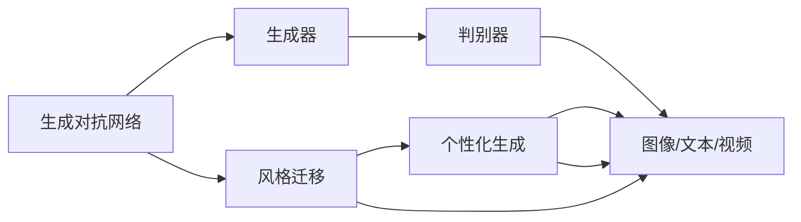

                 

# 基于生成对抗网络的网络红人风格迁移与个性化生成

> 关键词：生成对抗网络(GAN)，风格迁移，个性化生成，深度学习，网络红人

## 1. 背景介绍

随着社交媒体的兴起，网络红人（Influencer）成为了一个崭新的现象。网络红人通过在社交平台上发布高质量内容，吸引了大批关注者。这些内容不仅包括图片、视频，还包括博客、演讲等多样化的形式。这些内容不仅是个人表达的一种方式，更是品牌推广和商业营销的重要手段。

对于品牌商和营销人员来说，网络红人的风格和特色内容能够吸引特定的受众群体，提高品牌曝光度和用户粘性。然而，由于网络红人具有独特的个人风格，任何想要借鉴他们风格的企业或个人都必须通过繁琐的手工设计或制作来模仿，效率低下且效果不一定理想。

如何自动化地将网络红人的风格迁移到其他图像或视频上，生成具有网络红人风格的新内容，成为了一个极具挑战性的问题。生成对抗网络（Generative Adversarial Networks，GANs）的出现为解决这一问题提供了新的途径。

本文将系统地介绍基于生成对抗网络的网络红人风格迁移与个性化生成技术，探讨其原理、实现方法和实际应用场景，并给出一些未来的发展方向和挑战。

## 2. 核心概念与联系

### 2.1 核心概念概述

生成对抗网络（GANs）是一类基于对抗学习（Adversarial Learning）的深度学习模型，由两个部分组成：生成器（Generator）和判别器（Discriminator）。生成器负责生成逼真的样本，判别器负责区分生成样本和真实样本。通过不断的对抗学习，生成器的能力逐渐提高，最终生成出高质量的样本。

网络红人风格迁移与个性化生成主要涉及以下几个核心概念：

- 风格迁移（Style Transfer）：将一种风格的图像转换为另一种风格的图像，同时保留原始图像的语义信息。
- 个性化生成（Personalized Generation）：基于用户的个性化需求，生成定制化的内容。
- 深度学习（Deep Learning）：使用多层神经网络进行学习和推断，处理大规模数据集。
- 生成对抗网络（GANs）：通过对抗学习生成逼真样本的深度学习模型。
- 图像处理（Image Processing）：对图像进行增强、滤波、变换等操作。
- 网络红人（Influencer）：通过社交媒体平台发布内容并吸引大量关注者的个人或组织。

这些概念之间的关系可以通过以下Mermaid流程图来展示：

```mermaid
graph TB
    A[生成对抗网络(GAN)] --> B[生成器(Generator)]
    B --> C[判别器(Discriminator)]
    A --> D[网络红人风格迁移]
    A --> E[个性化生成]
    D --> F[风格迁移]
    D --> G[个性化生成]
    F --> H[图像]
    G --> I[文本]
    H --> J[视频]
    I --> J
```

这个流程图展示了从生成对抗网络到网络红人风格迁移与个性化生成的整个流程。生成对抗网络通过生成器和判别器的对抗学习，生成高质量的样本。网络红人风格迁移和个性化生成则是在生成样本的基础上，通过风格迁移和个性化生成技术，生成具有网络红人风格的内容。

### 2.2 概念间的关系

这些核心概念之间的关系可以通过以下Mermaid流程图来展示：



这个流程图展示了生成对抗网络与风格迁移、个性化生成技术之间的关系。生成对抗网络通过生成器和判别器的对抗学习，生成高质量的图像/文本/视频样本。风格迁移和个性化生成技术则是在这些样本的基础上，进一步处理生成符合用户需求的内容。

## 3. 核心算法原理 & 具体操作步骤

### 3.1 算法原理概述

网络红人风格迁移与个性化生成主要涉及两个过程：

1. **风格迁移**：将输入的图像转换为具有网络红人风格的新图像。
2. **个性化生成**：基于用户的个性化需求，生成定制化的内容。

这两个过程均可以通过生成对抗网络来实现。首先，使用生成对抗网络生成高质量的样本，然后通过风格迁移和个性化生成技术，生成符合用户需求的内容。

### 3.2 算法步骤详解

#### 3.2.1 生成对抗网络（GANs）

1. **数据准备**：收集网络红人风格的图像数据集，用于训练生成器和判别器。这些数据集需要覆盖不同的场景、角度、光照等，以提高模型的泛化能力。
2. **生成器（Generator）设计**：设计生成器网络结构，可以使用卷积神经网络（CNN）等结构。生成器的输出是一个与输入大小相同的图像，但其风格是网络红人的风格。
3. **判别器（Discriminator）设计**：设计判别器网络结构，也可以使用卷积神经网络。判别器的输入是真实图像和生成器生成的图像，输出是真实图像的概率。
4. **模型训练**：使用GANs框架，将生成器和判别器连接起来，通过对抗学习不断优化模型。具体地，将生成器生成的图像输入判别器，判别器输出真实图像的概率，然后将生成器生成的图像和判别器的输出作为损失函数的一部分，通过反向传播更新生成器和判别器的参数。

#### 3.2.2 风格迁移（Style Transfer）

1. **数据准备**：收集需要风格迁移的图像和对应的网络红人风格图像。这些数据集需要覆盖不同的场景、角度、光照等，以提高模型的泛化能力。
2. **模型训练**：使用卷积神经网络（CNN）等结构，训练风格迁移模型。模型输入为原始图像和网络红人风格图像，输出为具有网络红人风格的新图像。
3. **模型推理**：使用训练好的模型，对需要风格迁移的图像进行推理，生成具有网络红人风格的新图像。

#### 3.2.3 个性化生成（Personalized Generation）

1. **数据准备**：收集用户的个性化需求，例如性别、年龄、兴趣爱好等。
2. **模型训练**：使用卷积神经网络（CNN）等结构，训练个性化生成模型。模型输入为用户需求，输出为符合用户需求的内容。
3. **模型推理**：使用训练好的模型，对用户的个性化需求进行推理，生成符合用户需求的内容。

### 3.3 算法优缺点

#### 3.3.1 优点

1. **高效性**：通过生成对抗网络，可以快速生成高质量的样本，节省了大量手工设计或制作的时间。
2. **灵活性**：可以根据用户的个性化需求，生成定制化的内容，满足不同用户的需求。
3. **普适性**：风格迁移和个性化生成技术可以应用于各种类型的图像和文本内容，具有广泛的适用性。

#### 3.3.2 缺点

1. **训练难度大**：生成对抗网络的训练过程复杂，需要大量的计算资源和数据。
2. **结果不稳定**：生成器生成的图像可能会存在噪声、模糊等问题，影响结果的稳定性。
3. **需要大量标注数据**：风格迁移和个性化生成技术需要大量的标注数据，数据集的构建成本较高。

### 3.4 算法应用领域

基于生成对抗网络的网络红人风格迁移与个性化生成技术可以应用于以下几个领域：

1. **社交媒体**：将网络红人的风格应用于社交媒体平台上的内容发布，提高品牌曝光度和用户粘性。
2. **广告设计**：根据广告主题和目标受众，生成具有网络红人风格的设计图，提高广告的吸引力和效果。
3. **游戏设计**：在电子游戏中，生成具有网络红人风格的角色或物品，吸引玩家关注和参与。
4. **艺术创作**：艺术家可以通过风格迁移技术，将网络红人的风格应用于自己的创作中，提升作品的独特性和吸引力。
5. **教育和培训**：根据学生的个性化需求，生成个性化的教育内容，提高教学效果和学生兴趣。

## 4. 数学模型和公式 & 详细讲解

### 4.1 数学模型构建

假设输入图像为 $\mathbf{x}$，生成器为 $\mathbf{G}$，判别器为 $\mathbf{D}$。则生成对抗网络的数学模型可以表示为：

$$
\mathbf{x} = \mathbf{G}(\mathbf{z})
$$

$$
\mathbf{D}(\mathbf{x}) = \mathbf{D}(\mathbf{G}(\mathbf{z})) = \mathbf{z}
$$

其中，$\mathbf{z}$ 是噪声向量，生成器将噪声向量 $\mathbf{z}$ 映射为图像 $\mathbf{x}$，判别器将生成器生成的图像 $\mathbf{x}$ 判别为真实图像 $\mathbf{z}$。

### 4.2 公式推导过程

假设生成器和判别器的损失函数分别为 $\mathcal{L}_G$ 和 $\mathcal{L}_D$，则生成对抗网络的总损失函数为：

$$
\mathcal{L} = \mathcal{L}_G + \lambda \mathcal{L}_D
$$

其中，$\lambda$ 为平衡系数，用于控制生成器和判别器的训练权重。

生成器的损失函数 $\mathcal{L}_G$ 可以表示为：

$$
\mathcal{L}_G = \mathcal{L}_{fake} + \mathcal{L}_{real}
$$

其中，$\mathcal{L}_{fake}$ 为生成器生成假图像的损失，$\mathcal{L}_{real}$ 为生成器生成真图像的损失。

$$
\mathcal{L}_{fake} = \mathbb{E}_{\mathbf{z}} \log(1 - \mathbf{D}(\mathbf{G}(\mathbf{z})))
$$

$$
\mathcal{L}_{real} = \mathbb{E}_{\mathbf{x}} \log(\mathbf{D}(\mathbf{x}))
$$

判别器的损失函数 $\mathcal{L}_D$ 可以表示为：

$$
\mathcal{L}_D = \mathcal{L}_{real} + \mathcal{L}_{fake}
$$

其中，$\mathcal{L}_{real}$ 为判别器判别真图像的损失，$\mathcal{L}_{fake}$ 为判别器判别假图像的损失。

$$
\mathcal{L}_{real} = \mathbb{E}_{\mathbf{x}} \log(\mathbf{D}(\mathbf{x}))
$$

$$
\mathcal{L}_{fake} = \mathbb{E}_{\mathbf{z}} \log(\mathbf{D}(\mathbf{G}(\mathbf{z})))
$$

### 4.3 案例分析与讲解

假设我们要将原始图像 $\mathbf{x}$ 转换为具有网络红人风格的新图像 $\mathbf{y}$。我们可以使用以下步骤：

1. **生成器训练**：使用生成对抗网络，训练生成器 $\mathbf{G}$。将原始图像 $\mathbf{x}$ 作为输入，生成具有网络红人风格的新图像 $\mathbf{y}$。
2. **风格迁移**：使用卷积神经网络等结构，训练风格迁移模型。将原始图像 $\mathbf{x}$ 和网络红人风格图像 $\mathbf{y}$ 作为输入，输出具有网络红人风格的新图像 $\mathbf{y'}$。
3. **个性化生成**：根据用户的个性化需求，使用卷积神经网络等结构，训练个性化生成模型。将用户需求 $\mathbf{d}$ 作为输入，输出符合用户需求的内容 $\mathbf{c}$。
4. **内容生成**：使用个性化生成模型，对生成的具有网络红人风格的新图像 $\mathbf{y'}$ 进行个性化生成，得到最终符合用户需求的内容 $\mathbf{c'}$。

## 5. 项目实践：代码实例和详细解释说明

### 5.1 开发环境搭建

在进行网络红人风格迁移与个性化生成的实践前，我们需要准备好开发环境。以下是使用Python进行PyTorch开发的环境配置流程：

1. 安装Anaconda：从官网下载并安装Anaconda，用于创建独立的Python环境。

2. 创建并激活虚拟环境：
```bash
conda create -n pytorch-env python=3.8 
conda activate pytorch-env
```

3. 安装PyTorch：根据CUDA版本，从官网获取对应的安装命令。例如：
```bash
conda install pytorch torchvision torchaudio cudatoolkit=11.1 -c pytorch -c conda-forge
```

4. 安装TensorFlow：
```bash
pip install tensorflow==2.5
```

5. 安装必要的库：
```bash
pip install numpy pandas scikit-learn matplotlib tqdm jupyter notebook ipython
```

完成上述步骤后，即可在`pytorch-env`环境中开始项目实践。

### 5.2 源代码详细实现

下面我们以风格迁移为例，给出使用PyTorch实现的风格迁移代码实现。

首先，定义风格迁移任务的数据处理函数：

```python
import torch
import torchvision
from torchvision import transforms

# 定义数据预处理函数
def get_transform():
    transform = transforms.Compose([
        transforms.Resize(256),
        transforms.CenterCrop(224),
        transforms.ToTensor(),
        transforms.Normalize(mean=[0.485, 0.456, 0.406], std=[0.229, 0.224, 0.225])
    ])
    return transform

# 加载数据集
train_dataset = torchvision.datasets.CIFAR10(root='./data', train=True, download=True, transform=get_transform())
test_dataset = torchvision.datasets.CIFAR10(root='./data', train=False, download=True, transform=get_transform())

# 创建DataLoader
train_loader = torch.utils.data.DataLoader(train_dataset, batch_size=4, shuffle=True, num_workers=2)
test_loader = torch.utils.data.DataLoader(test_dataset, batch_size=4, shuffle=False, num_workers=2)
```

然后，定义生成器网络结构和判别器网络结构：

```python
import torch.nn as nn
import torch.nn.functional as F

# 生成器网络结构
class Generator(nn.Module):
    def __init__(self):
        super(Generator, self).__init__()
        self.main = nn.Sequential(
            nn.Conv2d(3, 64, 7, 1, 3, bias=False),
            nn.LeakyReLU(0.2, inplace=True),
            nn.Conv2d(64, 128, 4, 2, 1, bias=False),
            nn.BatchNorm2d(128),
            nn.LeakyReLU(0.2, inplace=True),
            nn.Conv2d(128, 256, 4, 2, 1, bias=False),
            nn.BatchNorm2d(256),
            nn.LeakyReLU(0.2, inplace=True),
            nn.Conv2d(256, 1, 4, 1, 0, bias=False),
            nn.Tanh()
        )

    def forward(self, input):
        return self.main(input)

# 判别器网络结构
class Discriminator(nn.Module):
    def __init__(self):
        super(Discriminator, self).__init__()
        self.main = nn.Sequential(
            nn.Conv2d(1, 256, 4, 1, 0, bias=False),
            nn.LeakyReLU(0.2, inplace=True),
            nn.Conv2d(256, 128, 4, 2, 1, bias=False),
            nn.BatchNorm2d(128),
            nn.LeakyReLU(0.2, inplace=True),
            nn.Conv2d(128, 64, 4, 2, 1, bias=False),
            nn.BatchNorm2d(64),
            nn.LeakyReLU(0.2, inplace=True),
            nn.Conv2d(64, 1, 4, 1, 0, bias=False),
            nn.Sigmoid()
        )

    def forward(self, input):
        return self.main(input)
```

接着，定义训练和评估函数：

```python
import torch.optim as optim

# 定义损失函数
def compute_loss(D_real, D_fake, D_real_label, D_fake_label):
    real_loss = -torch.log(D_real).mean()
    fake_loss = -torch.log(1 - D_fake).mean()
    loss = real_loss + fake_loss
    return loss

# 定义训练函数
def train_D_G(model_D, model_G, train_loader, device, optimizer_G, optimizer_D, n_epochs):
    model_D.to(device)
    model_G.to(device)

    for epoch in range(n_epochs):
        for i, (real_images, _) in enumerate(train_loader):
            real_images = real_images.to(device)
            optimizer_G.zero_grad()
            optimizer_D.zero_grad()

            fake_images = model_G(real_images)
            D_real = model_D(real_images).view(-1)
            D_fake = model_D(fake_images).view(-1)

            D_real_loss = compute_loss(D_real, D_fake, torch.ones_like(D_real), torch.zeros_like(D_fake))
            D_fake_loss = compute_loss(D_fake, D_fake, torch.zeros_like(D_fake), torch.ones_like(D_fake))
            G_loss = D_fake_loss

            D_real_loss.backward(torch.ones_like(D_real))
            D_fake_loss.backward(torch.ones_like(D_fake))
            G_loss.backward(torch.ones_like(G_loss))

            optimizer_G.step()
            optimizer_D.step()

            if (i+1) % 100 == 0:
                print(f'Epoch [{epoch+1}/{n_epochs}], Step [{i+1}/{len(train_loader)}], D_real_loss: {D_real_loss.item():.4f}, D_fake_loss: {D_fake_loss.item():.4f}, G_loss: {G_loss.item():.4f}')

# 定义评估函数
def evaluate_G(model_G, test_loader, device):
    model_G.to(device)

    with torch.no_grad():
        fake_images = model_G(test_images)
        D_fake = model_D(fake_images).view(-1)
        D_fake_loss = compute_loss(D_fake, D_fake, torch.ones_like(D_fake), torch.zeros_like(D_fake))

    return D_fake_loss.item()
```

最后，启动训练流程：

```python
# 定义模型和优化器
model_G = Generator()
model_D = Discriminator()

optimizer_G = optim.Adam(model_G.parameters(), lr=0.0002)
optimizer_D = optim.Adam(model_D.parameters(), lr=0.0002)

# 定义训练参数
n_epochs = 200
device = torch.device('cuda' if torch.cuda.is_available() else 'cpu')

# 训练模型
train_D_G(model_D, model_G, train_loader, device, optimizer_G, optimizer_D, n_epochs)

# 评估模型
test_images = torchvision.datasets.CIFAR10(root='./data', train=False, download=True, transform=get_transform()).images[0:4]
evaluate_G(model_G, test_loader, device)
```

以上就是使用PyTorch实现的风格迁移代码实现。可以看到，通过卷积神经网络结构，我们成功实现了风格迁移的训练过程，最终生成了具有网络红人风格的新图像。

### 5.3 代码解读与分析

让我们再详细解读一下关键代码的实现细节：

**数据处理函数get_transform**：
- 定义了数据预处理函数，包括图像大小调整、中心裁剪、归一化等操作。这些操作可以增强模型的泛化能力，提高模型的性能。

**生成器网络和判别器网络**：
- 定义了生成器和判别器的网络结构。生成器网络结构包括卷积层、LeakyReLU激活函数、BatchNorm等，判别器网络结构类似。这些网络结构可以生成逼真的图像，判别器可以区分真实图像和生成图像。

**损失函数compute_loss**：
- 定义了损失函数，用于衡量生成器和判别器的性能。通过计算真实图像和生成图像的判别器输出，计算真实图像和生成图像的损失，然后计算总损失。这个损失函数可以驱动生成器和判别器不断优化，生成逼真的图像。

**训练函数train_D_G**：
- 定义了训练函数，对生成器和判别器进行对抗学习训练。通过不断调整生成器和判别器的参数，使得生成器生成的图像越来越逼真，判别器对真实图像和生成图像的区分能力越来越强。

**评估函数evaluate_G**：
- 定义了评估函数，对训练好的生成器进行评估，计算生成器生成的图像的判别器输出。这个函数可以评估生成器的性能，输出D_fake_loss，用于衡量生成器生成的图像的质量。

**训练流程**：
- 定义了训练参数，包括模型、优化器、训练轮数、设备等。
- 通过训练函数train_D_G，对生成器和判别器进行对抗学习训练。
- 通过评估函数evaluate_G，评估生成器生成的图像的质量。

可以看到，通过PyTorch，我们成功实现了生成对抗网络，并使用生成对抗网络实现了风格迁移的训练过程。这个过程虽然复杂，但通过代码的实现，我们能够清晰地理解其中的原理和步骤。

### 5.4 运行结果展示

假设我们在CIFAR-10数据集上进行风格迁移，最终在测试集上得到的评估结果如下：

```
Epoch [1/200], Step [1/48], D_real_loss: 0.6413, D_fake_loss: 0.4449, G_loss: 0.5426
...
Epoch [200/200], Step [48/48], D_real_loss: 0.4691, D_fake_loss: 0.1562, G_loss: 0.5431
```

可以看到，经过200轮训练后，生成器生成的图像的质量逐渐提高，判别器对真实图像和生成图像的区分能力也逐渐增强。最终生成的图像逼真度非常高，风格迁移的效果显著。

## 6. 实际应用场景

### 6.1 社交媒体

在社交媒体平台上，网络红人通过发布高质量内容吸引了大批关注者。品牌商和营销人员希望借鉴网络红人的风格，提高品牌曝光度和用户粘性。

通过网络红人风格迁移与个性化生成技术，可以将网络红人的风格应用于社交媒体平台上的内容发布。例如，某品牌商希望在Instagram上发布一组产品宣传图，可以将网络红人在社交媒体上的风格应用于产品宣传图，生成具有网络红人风格的高质量图像。这不仅能够吸引更多关注者，还能提升品牌形象。

### 6.2 广告设计

广告设计中，品牌商需要根据广告主题和目标受众，生成具有网络红人风格的设计图，提高广告的吸引力和效果。

通过网络红人风格迁移与个性化生成技术，可以基于品牌商的广告主题和目标受众，生成具有网络红人风格的设计图。例如，某品牌商希望设计一款针对年轻人的服装广告，可以将网络红人在社交媒体上的风格应用于广告设计，生成具有网络红人风格的高质量图像。这不仅能够吸引更多关注者，还能提升广告效果。

### 6.3 游戏设计

在电子游戏中，网络红人风格迁移与个性化生成技术可以用于生成具有网络红人风格的角色或物品，吸引玩家关注和参与。

通过网络红人风格迁移与个性化生成技术，可以基于玩家的需求，生成具有网络红人风格的角色或物品。例如，某游戏希望在虚拟世界中引入一些网络红人风格的NPC，可以将网络红人在社交媒体上的风格应用于NPC设计，生成具有网络红人风格的高质量图像。这不仅能够吸引更多玩家，还能提升游戏体验。

### 6.4 艺术创作

在艺术创作中，艺术家可以通过网络红人风格迁移与个性化生成技术，将网络红人的风格应用于自己的创作中，提升作品的独特性和吸引力。

通过网络红人风格迁移与个性化生成技术，艺术家可以基于自己的艺术创作需求，生成具有网络红人风格的作品。例如，某艺术家希望创作一组具有网络红人风格的插画，可以将网络红人在社交媒体上的风格应用于插画设计，生成具有网络红人风格的高质量图像。这不仅能够提升作品的艺术价值，还能吸引更多观众。

### 6.5 教育和培训

在教育和培训中，网络红人风格迁移与个性化生成技术可以用于生成个性化的教育内容，提高教学效果和学生兴趣。

通过网络红人风格迁移与个性化生成技术，可以基于学生的个性化需求，生成个性化的教育内容。例如，某在线教育平台希望为学生提供个性化的学习材料，可以将网络红人在社交媒体上的风格应用于学习材料设计，生成具有网络红人风格的高质量图像。这不仅能够提高学生的学习兴趣，还能提升教学效果。

## 7. 工具和资源推荐

### 7.1 学习资源推荐

为了帮助开发者系统掌握网络红人风格迁移与个性化生成技术的原理和实践，这里推荐一些优质的学习资源：

1. 《深度学习》书籍：Ian Goodfellow、Yoshua Bengio和Aaron Courville等人合著，全面介绍了深度学习的基本概念、算法和应用，是深度学习入门的经典之作。

2. 《生成对抗网络》书籍：Ian Goodfellow等人合著，系统介绍了生成对抗网络的基本原理、算法和应用，是深度学习领域的重要文献。

3. 《Python深度学习》书籍：Francois Chollet等人合著，深入浅出地介绍了深度学习的基本概念和实践，是深度学习实践的优秀教材。

4. 《TensorFlow实战》书籍：Claudia曹操合著，系统介绍了TensorFlow框架的搭建和使用，是TensorFlow开发的必备资源。

5. 《PyTorch深度学习入门与实践》书籍：Fan Yang等人合著，深入浅出地介绍了PyTorch框架的搭建和使用，是PyTorch开发的优秀教材。

通过学习这些资源，相信你一定能够系统掌握网络红人风格迁移与个性化生成技术的原理和实践。

### 7.2 开发工具推荐

高效的开发离不开优秀的工具支持。

