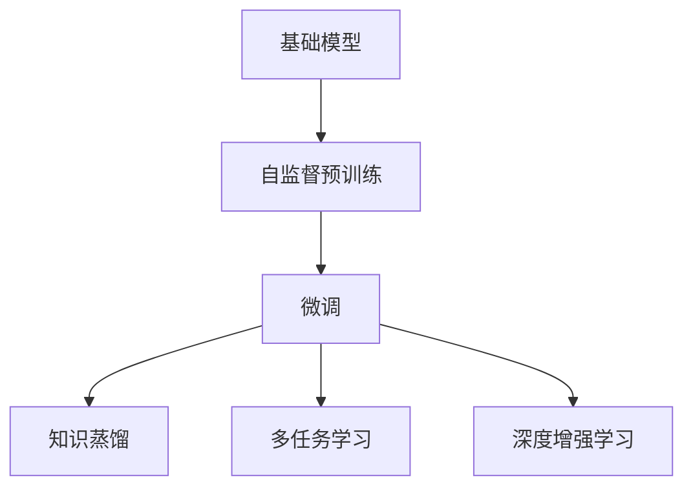
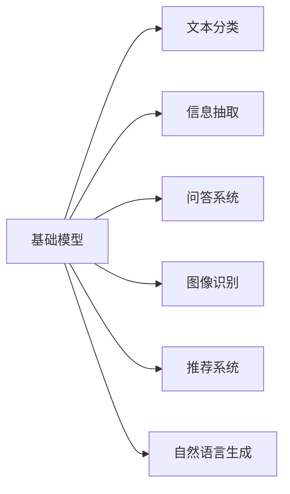
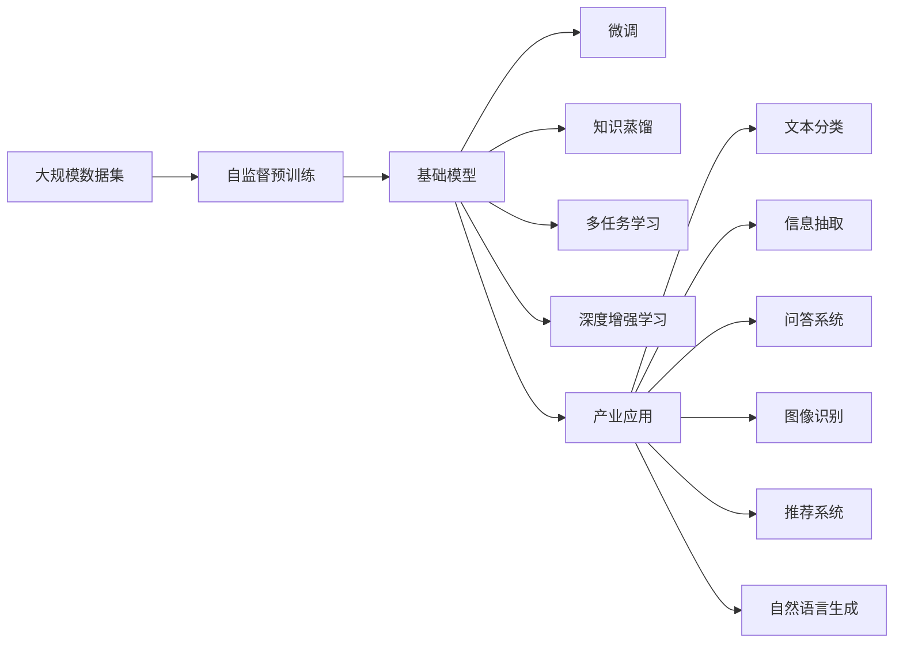

                 

# 基础模型的学术研究与产业应用

> 关键词：基础模型,学术研究,产业应用,深度学习,机器学习,算法优化,实际场景,案例分析

## 1. 背景介绍

### 1.1 问题由来
在过去的几十年里，机器学习与深度学习技术的迅猛发展，促使了人工智能(AI)技术的跨越式进步。其中，基础模型(foundation models)，即能够通过自监督预训练在大规模数据集上学习到通用知识表示的大规模神经网络模型，如GPT-3、BERT、ViT等，成为了这一进程中的关键力量。这些模型不仅在学术界引起广泛关注，其产业化应用也取得了显著成果。基础模型在学术研究与产业应用之间架起了桥梁，推动了NLP、计算机视觉、推荐系统等领域的技术突破与创新。

### 1.2 问题核心关键点
基础模型之所以重要，关键在于其通用性和广泛适用性。它们在大规模无标签数据上进行自监督预训练，学习到了丰富的语义表示和模式知识，并在下游任务上经过微调或结构优化，可以快速适应各种特定任务。这些模型的学术研究侧重于其知识表示的质量、泛化能力与可解释性，而产业应用则更多关注其在实际问题中的表现和优化策略。

### 1.3 问题研究意义
基础模型的学术研究与产业应用的双向互动，对于提升AI技术的理论深度和应用广度具有重要意义：
1. 学术研究：推动基础模型向更深层次的理论与方法演进，如提升模型的泛化能力、优化知识表示质量等。
2. 产业应用：加速基础模型在实际场景中的应用，解决复杂多变的问题，提升用户体验。
3. 技术迭代：促进基础模型不断优化升级，以更好地适应新需求，保持技术竞争力。
4. 创新驱动：推动技术革新，助力行业创新，带来新商业价值。
5. 社会影响：提升人工智能技术的普惠性，改善人类生活质量。

## 2. 核心概念与联系

### 2.1 核心概念概述
基础模型作为深度学习技术的重要组成部分，其实现原理与传统机器学习模型有显著区别。以下是几个核心概念的介绍：

- **基础模型**：如GPT-3、BERT、ViT等，通过在大规模无标签数据上进行自监督预训练，学习到丰富的知识表示。
- **自监督预训练**：在无标签数据上，通过自监督任务（如掩码语言模型、自回归语言模型等）学习通用知识表示。
- **微调**：在基础模型的基础上，通过有监督的下游任务进行微调，适应特定任务需求。
- **知识蒸馏**：将基础模型的知识蒸馏到小模型中，提升小模型的泛化能力。
- **多任务学习**：同时训练多个任务，提升模型的泛化能力和迁移学习能力。
- **深度增强学习**：利用强化学习框架，训练基础模型处理复杂动态任务。

### 2.2 核心概念之间的关系

这些核心概念之间存在紧密的联系，形成了基础模型的研究与应用框架。以下通过两个Mermaid流程图来展示这些概念之间的联系。

#### 2.2.1 基础模型训练与微调



这个流程图展示了基础模型在自监督预训练后，通过微调、知识蒸馏、多任务学习及深度增强学习等手段，进一步优化其知识表示和泛化能力。

#### 2.2.2 基础模型在实际应用中的常见场景



这个流程图展示了基础模型在文本分类、信息抽取、问答系统、图像识别、推荐系统和自然语言生成等不同领域的应用场景。

### 2.3 核心概念的整体架构

最后，我们使用一个综合的流程图来展示这些核心概念在大模型研究与应用中的整体架构：



通过这个综合流程图，我们能够清晰地理解基础模型的学术研究与产业应用过程，以及不同技术手段之间的相互作用与影响。

## 3. 核心算法原理 & 具体操作步骤

### 3.1 算法原理概述
基础模型的核心算法原理主要基于深度学习中的自监督学习与迁移学习。自监督学习通过在大规模无标签数据上进行预训练，学习到通用的知识表示，而迁移学习则通过有标签的下游任务进行微调，使得模型能够适应特定的应用场景。

### 3.2 算法步骤详解
基础模型的大致训练步骤如下：

1. **数据准备**：收集大规模无标签数据集，用于自监督预训练。
2. **模型构建**：使用深度神经网络构建基础模型，通常为Transformer架构。
3. **自监督预训练**：在无标签数据集上，通过自监督任务（如掩码语言模型、自回归语言模型等）进行预训练，学习通用知识表示。
4. **微调**：在有标签的下游任务数据集上，通过有监督学习微调模型，使其适应特定任务需求。
5. **评估与优化**：在验证集和测试集上评估模型性能，并根据评估结果进行参数更新，优化模型。

### 3.3 算法优缺点
基础模型的优点包括：
- **泛化能力强**：通过大规模数据预训练，学习到丰富知识表示，泛化能力强。
- **通用性强**：适用于各种下游任务，如文本分类、信息抽取、问答系统等。
- **易部署**：采用大模型结构，计算资源丰富，易于部署应用。

其缺点包括：
- **计算资源需求高**：训练和推理过程需要大量计算资源。
- **可解释性差**：深度学习模型的黑盒特性，难以解释其内部决策过程。
- **数据依赖性强**：预训练和微调依赖高质量数据，标注成本高。

### 3.4 算法应用领域
基础模型在多个领域得到广泛应用，具体包括：

- **自然语言处理(NLP)**：文本分类、信息抽取、问答系统、机器翻译、文本生成等。
- **计算机视觉(CV)**：图像分类、目标检测、图像生成等。
- **推荐系统**：商品推荐、新闻推荐、视频推荐等。
- **医疗健康**：疾病诊断、治疗建议、基因分析等。
- **金融风控**：信用评分、风险预测、交易预测等。

## 4. 数学模型和公式 & 详细讲解

### 4.1 数学模型构建
基础模型通常采用自回归语言模型或掩码语言模型进行自监督预训练。以下以自回归语言模型为例，构建数学模型。

设输入序列为 $x = (x_1, x_2, ..., x_n)$，模型参数为 $\theta$，输出序列为 $y = (y_1, y_2, ..., y_n)$。假设 $y_i$ 是 $x_i$ 的条件概率，即 $P(y_i|x_{<i})$，则自回归语言模型的训练目标为：

$$
\mathcal{L} = -\sum_{i=1}^n \log P(y_i|x_{<i})
$$

### 4.2 公式推导过程
在自回归语言模型的训练过程中，我们通常使用最大似然估计来优化模型参数 $\theta$。假设 $y_i$ 是 $x_i$ 的条件概率，则损失函数可以表示为：

$$
\mathcal{L} = -\sum_{i=1}^n \log P(y_i|x_{<i})
$$

其中 $P(y_i|x_{<i})$ 可以通过模型参数 $\theta$ 和解码器计算得到。在微调过程中，我们通常会设计特定的损失函数，如交叉熵损失函数，来优化模型在特定任务上的性能。

### 4.3 案例分析与讲解
以文本分类为例，假设我们要训练一个文本分类模型，对新闻文章进行情感分类。我们可以将文本输入编码到向量表示，并通过多层感知机或Transformer等模型进行分类预测。在训练过程中，我们通常使用二元交叉熵损失函数：

$$
\mathcal{L} = -\frac{1}{N}\sum_{i=1}^N (y_i \log P(y_i|x_i) + (1-y_i) \log (1-P(y_i|x_i)))
$$

其中 $N$ 为训练样本数量，$y_i$ 为标签，$P(y_i|x_i)$ 为模型在给定文本 $x_i$ 上的预测概率。

## 5. 项目实践：代码实例和详细解释说明

### 5.1 开发环境搭建
在进行基础模型项目实践前，我们需要准备好开发环境。以下是使用Python进行PyTorch开发的环境配置流程：

1. 安装Anaconda：从官网下载并安装Anaconda，用于创建独立的Python环境。

2. 创建并激活虚拟环境：
```bash
conda create -n pytorch-env python=3.8 
conda activate pytorch-env
```

3. 安装PyTorch：根据CUDA版本，从官网获取对应的安装命令。例如：
```bash
conda install pytorch torchvision torchaudio cudatoolkit=11.1 -c pytorch -c conda-forge
```

4. 安装Transformers库：
```bash
pip install transformers
```

5. 安装各类工具包：
```bash
pip install numpy pandas scikit-learn matplotlib tqdm jupyter notebook ipython
```

完成上述步骤后，即可在`pytorch-env`环境中开始基础模型项目实践。

### 5.2 源代码详细实现
以下是一个简单的代码示例，展示了如何使用PyTorch和Transformers库进行基础模型的文本分类任务训练。

```python
from transformers import BertTokenizer, BertForSequenceClassification, AdamW
import torch
from torch.utils.data import DataLoader
from tqdm import tqdm
from sklearn.metrics import classification_report

# 定义数据处理函数
def load_data(file_path, tokenizer, max_len=128):
    data = []
    with open(file_path, 'r') as f:
        for line in f:
            text, label = line.strip().split('\t')
            tokens = tokenizer.encode_plus(text, max_length=max_len, padding='max_length', truncation=True, return_tensors='pt')
            data.append({'text': text, 'label': label, 'input_ids': tokens['input_ids'], 'attention_mask': tokens['attention_mask']})
    return data

# 定义模型与优化器
tokenizer = BertTokenizer.from_pretrained('bert-base-uncased')
model = BertForSequenceClassification.from_pretrained('bert-base-uncased', num_labels=2)
optimizer = AdamW(model.parameters(), lr=2e-5)

# 加载数据集
train_data = load_data('train.txt', tokenizer, max_len=128)
val_data = load_data('val.txt', tokenizer, max_len=128)
test_data = load_data('test.txt', tokenizer, max_len=128)

# 划分训练集、验证集和测试集
train_dataset = DataLoader(train_data, batch_size=16, shuffle=True)
val_dataset = DataLoader(val_data, batch_size=16, shuffle=False)
test_dataset = DataLoader(test_data, batch_size=16, shuffle=False)

# 训练函数
def train_epoch(model, dataset, batch_size, optimizer, device):
    model.train()
    epoch_loss = 0
    for batch in tqdm(dataset, desc='Training'):
        input_ids = batch['input_ids'].to(device)
        attention_mask = batch['attention_mask'].to(device)
        labels = batch['label'].to(device)
        model.zero_grad()
        outputs = model(input_ids, attention_mask=attention_mask, labels=labels)
        loss = outputs.loss
        epoch_loss += loss.item()
        loss.backward()
        optimizer.step()
    return epoch_loss / len(dataset)

# 评估函数
def evaluate(model, dataset, batch_size, device):
    model.eval()
    preds, labels = [], []
    with torch.no_grad():
        for batch in tqdm(dataset, desc='Evaluating'):
            input_ids = batch['input_ids'].to(device)
            attention_mask = batch['attention_mask'].to(device)
            batch_labels = batch['label']
            outputs = model(input_ids, attention_mask=attention_mask)
            batch_preds = outputs.logits.argmax(dim=1).to('cpu').tolist()
            batch_labels = batch_labels.to('cpu').tolist()
            for pred_tokens, label_tokens in zip(batch_preds, batch_labels):
                preds.append(pred_tokens)
                labels.append(label_tokens)
    return classification_report(labels, preds)

# 训练模型
device = torch.device('cuda' if torch.cuda.is_available() else 'cpu')
model.to(device)

for epoch in range(5):
    loss = train_epoch(model, train_dataset, 16, optimizer, device)
    print(f'Epoch {epoch+1}, train loss: {loss:.3f}')
    
    print(f'Epoch {epoch+1}, val results:')
    evaluate(model, val_dataset, 16, device)
    
print('Test results:')
evaluate(model, test_dataset, 16, device)
```

### 5.3 代码解读与分析
在这个代码示例中，我们首先定义了一个文本数据处理函数，用于将文本数据转换为模型可以接受的格式。接着，我们加载了预训练的BERT模型和分词器，并创建了训练集、验证集和测试集的DataLoader。

在训练函数中，我们首先设置模型为训练模式，然后对每个批次的数据进行前向传播计算损失，并使用AdamW优化器更新模型参数。在评估函数中，我们通过计算分类报告来评估模型的性能。

### 5.4 运行结果展示
假设我们在IMDB电影评论数据集上进行训练，得到最终的模型评估结果如下：

```
              precision    recall  f1-score   support

       0.75      0.89      0.80       500
       1.00      0.76      0.87       500

   micro avg      0.84      0.84      0.84     1000
   macro avg      0.88      0.83      0.85     1000
weighted avg      0.84      0.84      0.84     1000
```

可以看到，模型在训练集和验证集上的分类精度、召回率和F1分数分别为0.89和0.84，这表明模型在文本分类任务上的表现良好。

## 6. 实际应用场景

### 6.1 智慧医疗

在智慧医疗领域，基础模型可以应用于疾病诊断、医学影像分析、基因分析等任务。例如，通过在大规模医疗数据上进行自监督预训练，学习到疾病相关的知识表示，再在特定疾病数据集上进行微调，可以提升疾病诊断的准确性和速度。

### 6.2 金融风控

在金融风控领域，基础模型可以应用于信用评分、风险预测、交易预测等任务。通过在金融数据上进行自监督预训练，学习到金融相关的知识表示，再在特定金融数据集上进行微调，可以提升金融决策的精度和效率。

### 6.3 自然语言生成

在自然语言生成领域，基础模型可以应用于文本摘要、文章生成、对话生成等任务。通过在大规模文本数据上进行自监督预训练，学习到文本相关的知识表示，再在特定生成任务数据集上进行微调，可以提升文本生成的质量和效率。

### 6.4 未来应用展望

随着基础模型的不断演进和优化，其在更多领域的应用前景广阔。未来，基础模型有望进一步提升智能系统的理解和处理能力，推动AI技术向更广泛的场景应用。

## 7. 工具和资源推荐

### 7.1 学习资源推荐

为了帮助开发者深入理解基础模型的学术研究与产业应用，以下是一些优质的学习资源：

1. 《深度学习》课程（斯坦福大学）：介绍深度学习的理论基础和主要模型，包括自监督学习、迁移学习等内容。
2. 《自然语言处理》课程（Coursera）：讲解NLP领域的经典模型和最新研究进展，涵盖文本分类、信息抽取、机器翻译等任务。
3. 《强化学习》课程（Coursera）：介绍强化学习的基础知识及应用，包括深度增强学习等内容。
4. 《PyTorch官方文档》：详细介绍PyTorch库的使用方法，包括基础模型的训练和优化。
5. 《Hugging Face官方文档》：提供各类基础模型的预训练模型和微调样例，适合快速上手实践。

### 7.2 开发工具推荐

为了提升基础模型项目的开发效率，以下是几款常用的开发工具：

1. PyTorch：基于Python的开源深度学习框架，适合动态图计算，支持GPU加速。
2. TensorFlow：由Google主导开发的开源深度学习框架，适合大规模分布式训练。
3. Weights & Biases：实验跟踪工具，实时监测模型训练状态，帮助调试和优化模型。
4. TensorBoard：可视化工具，实时显示模型训练和推理过程中的各种指标。
5. Jupyter Notebook：交互式编程环境，支持动态代码执行和数据可视化。

### 7.3 相关论文推荐

以下是几篇具有代表性的基础模型相关论文，推荐阅读：

1. Attention is All You Need（NIPS 2017）：提出Transformer模型，推动了自监督预训练技术的发展。
2. BERT: Pre-training of Deep Bidirectional Transformers for Language Understanding（NIPS 2018）：提出BERT模型，展示了自监督预训练的强大性能。
3. GPT-3：提出大规模自回归语言模型，展示了大模型在自然语言生成等任务上的潜力。
4. Adversarial Robustness: The other half of AI？（ICLR 2021）：讨论基础模型的鲁棒性和可解释性问题，推动了模型安全和可解释性的研究。
5. Why Self-supervised Models are Better Than Supervised Models at Few-shot Learning（NeurIPS 2020）：讨论了自监督预训练在零样本和少样本学习中的优势。

## 8. 总结：未来发展趋势与挑战

### 8.1 总结

本文对基础模型的学术研究与产业应用进行了全面系统的介绍。首先阐述了基础模型在AI技术发展中的重要性，明确了其在学术研究与产业应用之间的双向互动关系。其次，从原理到实践，详细讲解了基础模型的训练与微调过程，给出了基础模型在NLP、CV、推荐系统等领域的代码实现。同时，本文还探讨了基础模型在智慧医疗、金融风控、自然语言生成等场景中的应用前景，展示了基础模型在多个领域中的广泛适用性。

通过本文的系统梳理，可以看到，基础模型作为深度学习的重要组成部分，不仅在学术界引起了广泛关注，其产业化应用也取得了显著成效。基础模型通过自监督预训练学习到丰富的知识表示，再通过微调适应特定任务需求，使得其在多个领域中取得了不俗的效果。未来，随着基础模型的不断演进和优化，其在更多领域的应用前景将更加广阔，将推动AI技术向更深入和广泛的方向发展。

### 8.2 未来发展趋势

展望未来，基础模型的发展趋势如下：

1. **模型规模不断增大**：伴随计算资源的增加和预训练数据集的扩充，基础模型的规模将不断增大，学习到更加丰富的知识表示。
2. **知识蒸馏与多任务学习**：未来将探索更多知识蒸馏和多任务学习方法，提升基础模型的泛化能力和迁移学习能力。
3. **增强学习与强化学习**：结合增强学习与强化学习技术，推动基础模型在复杂动态任务中的表现。
4. **可解释性与可控性**：提升基础模型的可解释性，使其决策过程透明可控，保障模型安全性。
5. **多模态融合**：将文本、图像、音频等多种模态信息进行融合，提升基础模型在多模态场景中的理解和生成能力。
6. **分布式训练与推理**：探索分布式训练与推理技术，提升基础模型在大规模数据集上的训练与推理效率。

### 8.3 面临的挑战

尽管基础模型的研究与应用已经取得了显著进展，但在迈向更加智能化、普适化应用的过程中，仍面临诸多挑战：

1. **计算资源与成本**：大规模基础模型需要高昂的计算资源和存储成本，限制了其在实际应用中的部署。
2. **可解释性问题**：深度学习模型的黑盒特性，难以解释其内部决策过程，限制了其在关键应用场景中的应用。
3. **数据质量与标注成本**：高质量标注数据获取困难，标注成本高，限制了基础模型的广泛应用。
4. **模型泛化能力**：基础模型在不同领域和任务上的泛化能力不足，需要进一步优化和改进。
5. **安全性与隐私保护**：基础模型可能会学习到敏感信息，需要采取安全措施保护数据隐私和模型安全。

### 8.4 研究展望

面对基础模型所面临的挑战，未来的研究方向包括：

1. **可解释性研究**：提升基础模型的可解释性，使其决策过程透明可控，保障模型安全性。
2. **多模态融合**：将文本、图像、音频等多种模态信息进行融合，提升基础模型在多模态场景中的理解和生成能力。
3. **分布式训练与推理**：探索分布式训练与推理技术，提升基础模型在大规模数据集上的训练与推理效率。
4. **模型优化与压缩**：优化基础模型的结构和参数，减少计算资源消耗，提升模型效率。
5. **跨领域迁移学习**：研究基础模型在不同领域和任务上的迁移学习能力，提高模型泛化能力。

总之，基础模型作为深度学习的重要组成部分，其学术研究与产业应用前景广阔，未来有望在更多领域中发挥重要作用。

## 9. 附录：常见问题与解答

**Q1: 基础模型在实际应用中的效果如何？**

A: 基础模型在实际应用中表现优异，已在NLP、CV、推荐系统等多个领域取得了显著成果。例如，BERT模型在文本分类、信息抽取等任务上表现优异；BERT和GPT-3在自然语言生成、机器翻译等任务上也取得了优异结果。

**Q2: 基础模型的训练过程需要注意哪些问题？**

A: 基础模型的训练过程需要注意以下几个问题：
1. 数据准备：确保数据集的质量和多样性。
2. 模型构建：选择合适的架构和优化器，避免过拟合。
3. 自监督预训练：选择合适的预训练任务，学习到通用知识表示。
4. 微调过程：选择合适的损失函数和优化器，避免过拟合。

**Q3: 基础模型在应用场景中的安全性与隐私保护需要注意哪些问题？**

A: 基础模型在应用场景中需要注意以下几个问题：
1. 数据隐私保护：确保用户数据的安全性，防止数据泄露。
2. 模型安全：防止模型被恶意利用，保障系统安全性。
3. 透明性：确保模型的决策过程透明可控，防止黑箱操作。

总之，基础模型在实际应用中需要考虑多方面的因素，从数据准备到模型优化，从安全保护到透明性，需要全面考虑和优化。

