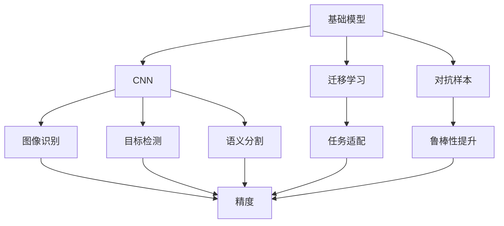
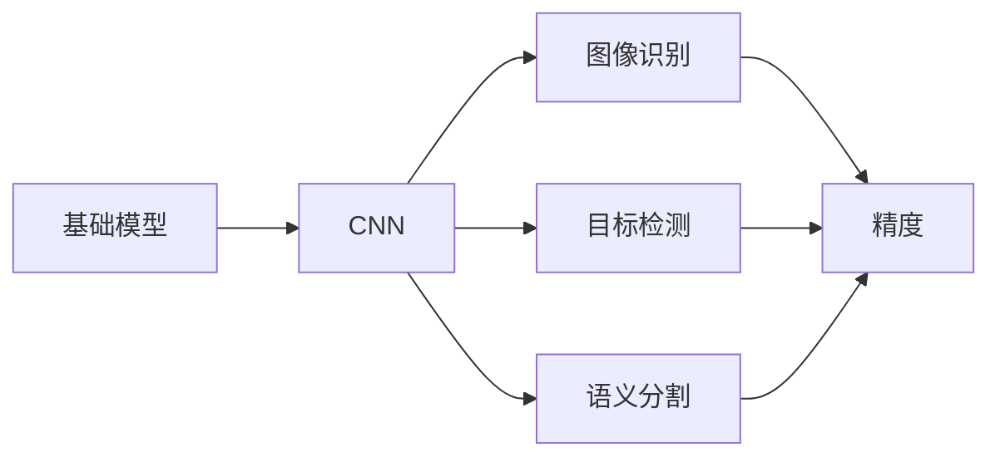
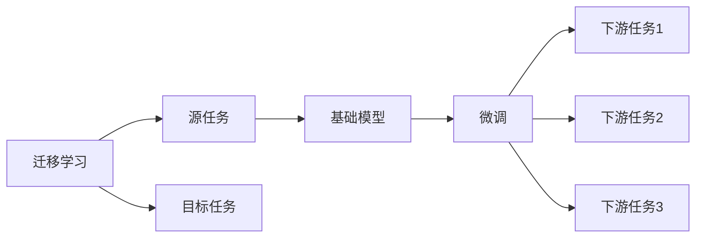
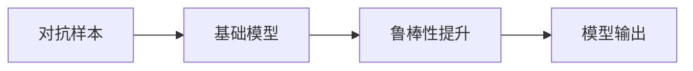
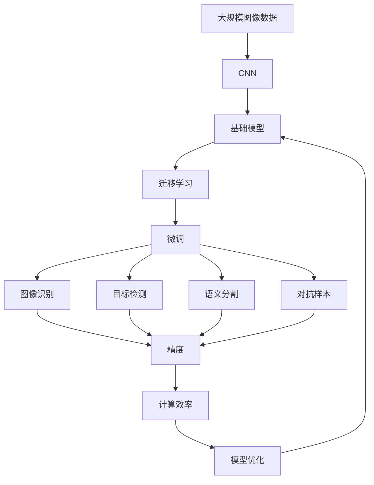

                 

# 基础模型的视觉处理能力

基础模型指的是那些在特定领域内具有广泛应用、稳定性能的深度学习模型，如自然语言处理中的BERT、计算机视觉中的ResNet、语音识别中的Transformer等。本文将重点讨论基础模型的视觉处理能力，即基础模型在图像识别、目标检测、图像生成等视觉任务上的表现和优化方法。

## 1. 背景介绍

### 1.1 问题由来
计算机视觉（Computer Vision, CV）是人工智能的重要分支之一，涉及到对图像、视频、三维场景等视觉数据的理解和处理。过去几十年里，计算机视觉领域经历了多次技术革新，包括传统的手工特征工程、深度学习中的卷积神经网络（Convolutional Neural Networks, CNNs）、自监督学习方法等。随着深度学习技术的普及，基础模型在视觉处理能力上取得了显著进展。然而，随着数据量的增加和任务复杂度的提升，基础模型在特定领域的视觉处理能力仍面临诸多挑战。本文将对基础模型在视觉处理上的能力进行深入分析，并探讨如何通过模型优化和技术创新，提升其在视觉任务上的表现。

### 1.2 问题核心关键点
基础模型的视觉处理能力主要体现在以下几个方面：
- **图像识别精度**：基础模型在图像分类、物体检测等任务上的准确度。
- **计算效率**：模型推理速度和内存占用情况。
- **泛化能力**：模型在不同数据分布下的表现。
- **鲁棒性**：模型对噪声、变换、对抗样本等鲁棒性的容忍度。
- **迁移学习**：模型在不同视觉任务间的迁移学习能力。

### 1.3 问题研究意义
研究基础模型的视觉处理能力，对于推动计算机视觉技术的发展和落地应用具有重要意义：
- 降低应用开发成本：通过优化基础模型的视觉处理能力，可以减少从头开发所需的数据、计算和人力等成本投入。
- 提升模型效果：模型通过优化后，可以在特定视觉任务上取得更优表现，提升视觉任务处理的精度和效率。
- 加速开发进度：站在前人的肩膀上，基础模型微调可以更快地完成任务适配，缩短开发周期。
- 带来技术创新：视觉处理能力的提升促进了新的研究方向，如生成对抗网络（GANs）、语义分割等。
- 赋能产业升级：基础模型技术的成熟将使计算机视觉技术更容易被各行各业所采用，为传统行业数字化转型升级提供新的技术路径。

## 2. 核心概念与联系

### 2.1 核心概念概述

为更好地理解基础模型的视觉处理能力，本节将介绍几个密切相关的核心概念：

- **基础模型**：在特定领域内具有广泛应用、稳定性能的深度学习模型，如BERT、ResNet、Transformer等。
- **卷积神经网络（CNN）**：一种专门用于处理图像数据的深度学习模型，通过卷积操作提取图像的局部特征。
- **迁移学习**：将一个领域学习到的知识，迁移应用到另一个不同但相关的领域的学习范式。
- **对抗样本**：在输入数据中加入噪声或扰动，使模型产生错误预测。
- **语义分割**：将图像中的每个像素归类到预定义的语义类别中，如人、车、天空等。
- **生成对抗网络（GANs）**：由生成器和判别器组成的模型，能够生成高质量的图像或视频。

这些核心概念之间的逻辑关系可以通过以下Mermaid流程图来展示：



这个流程图展示了几大核心概念之间的联系：

1. 基础模型通过卷积神经网络(CNN)来处理图像数据，提取特征。
2. 通过迁移学习，基础模型可以适应不同的视觉任务。
3. 对抗样本可以提高基础模型的鲁棒性。
4. 语义分割、图像识别、目标检测等任务都可以由基础模型进行。

### 2.2 概念间的关系

这些核心概念之间存在着紧密的联系，形成了基础模型视觉处理的完整生态系统。下面我们通过几个Mermaid流程图来展示这些概念之间的关系。

#### 2.2.1 基础模型的处理能力



这个流程图展示了基础模型通过CNN进行图像处理，然后用于图像识别、目标检测、语义分割等任务，并提升了精度。

#### 2.2.2 迁移学习与基础模型



这个流程图展示了迁移学习的基本原理，以及它与基础模型的关系。迁移学习涉及源任务和目标任务，通过微调使得基础模型更好地适应特定任务。

#### 2.2.3 对抗样本在基础模型中的应用



这个流程图展示了对抗样本对基础模型鲁棒性的提升。通过在输入中引入对抗样本，可以提高模型对噪声、变换、对抗样本等鲁棒性的容忍度。

### 2.3 核心概念的整体架构

最后，我们用一个综合的流程图来展示这些核心概念在基础模型视觉处理中的整体架构：



这个综合流程图展示了从图像数据处理到基础模型微调，再到特定视觉任务的全过程。基础模型通过CNN提取图像特征，然后通过迁移学习和微调，应用于不同的视觉任务，并可通过对抗样本提升鲁棒性。最终，模型输出图像识别、目标检测、语义分割等任务的精度和计算效率，并不断进行优化。

## 3. 核心算法原理 & 具体操作步骤
### 3.1 算法原理概述

基础模型在视觉处理上的算法原理主要基于深度学习中的卷积神经网络（CNN）。CNN通过卷积操作，能够提取图像中的局部特征，并将这些特征进行池化、扁平化，最终输入到全连接层进行分类或回归。这种结构使得CNN能够自动从大量图像数据中学习到有效的特征表示，适用于图像识别、目标检测、语义分割等视觉任务。

CNN的核心组件包括卷积层、池化层、全连接层等。卷积层通过卷积核对输入的图像进行卷积操作，提取局部特征。池化层通过最大池化、平均池化等方法，对特征图进行降维，提高计算效率。全连接层将池化后的特征映射到类别空间，进行分类或回归。

### 3.2 算法步骤详解

基础模型在视觉处理上的算法步骤主要包括以下几个环节：

1. **数据准备**：收集并标注大规模的图像数据，划分为训练集、验证集和测试集。
2. **模型初始化**：选择合适的预训练模型作为初始化参数，如ResNet、Inception等。
3. **迁移学习**：将预训练模型作为特征提取器，利用迁移学习适配特定任务。
4. **微调**：在迁移学习的基础上，使用下游任务的少量标注数据，通过有监督学习优化模型在特定任务上的性能。
5. **对抗样本训练**：在微调的同时，引入对抗样本，提高模型对噪声、变换、对抗样本等鲁棒性的容忍度。
6. **优化**：使用正则化技术、Dropout、Early Stopping等方法，防止模型过拟合，提升泛化能力。
7. **性能评估**：在测试集上评估模型的精度、召回率、F1分数等指标，进行效果评估。

### 3.3 算法优缺点

基础模型在视觉处理上的算法具有以下优点：

1. **自动化特征提取**：CNN能够自动从图像数据中学习到有效的特征表示，无需手工设计特征。
2. **鲁棒性**：通过迁移学习和对抗样本训练，模型对噪声、变换、对抗样本等鲁棒性的容忍度较高。
3. **泛化能力**：基础模型经过大规模数据预训练和迁移学习，具有较强的泛化能力，适用于多种视觉任务。

同时，基础模型在视觉处理上也存在一些缺点：

1. **计算成本高**：基础模型的参数量较大，推理速度快，但计算成本高，需要高性能的硬件支持。
2. **可解释性不足**：基础模型是一个"黑盒"系统，难以解释其内部工作机制和决策逻辑。
3. **依赖标注数据**：微调模型需要大量的标注数据，标注成本较高。

### 3.4 算法应用领域

基础模型在视觉处理上的算法应用非常广泛，包括但不限于以下领域：

- **图像分类**：如CIFAR-10、ImageNet等数据集上的分类任务。
- **目标检测**：如COCO、PASCAL VOC等数据集上的检测任务。
- **语义分割**：如PASCAL VOC、Cityscapes等数据集上的分割任务。
- **图像生成**：如GANs等生成模型，用于图像合成、风格迁移等。
- **视频分析**：如视频分类、行为识别等任务。

这些应用领域涵盖了计算机视觉的多个方面，展示了基础模型在视觉处理上的强大能力。

## 4. 数学模型和公式 & 详细讲解  
### 4.1 数学模型构建

基础模型在视觉处理上的数学模型主要基于卷积神经网络（CNN）。假设输入图像大小为$H \times W \times C$，卷积核大小为$k \times k$，步长为$s$，卷积输出特征图大小为$H' \times W' \times C'$。则卷积操作可以表示为：

$$
Y = \sigma(\sum_{i=0}^{k-1}\sum_{j=0}^{k-1} W_{ij} * X_{i,j})
$$

其中，$W_{ij}$为卷积核，$X_{i,j}$为输入图像中对应位置的像素值，$\sigma$为激活函数（如ReLU）。

### 4.2 公式推导过程

以下我们以一个简单的3x3卷积核为例，推导卷积操作的数学表达式。

假设输入图像大小为$H \times W$，卷积核大小为$k \times k$，步长为1。则卷积操作的数学表达式为：

$$
Y_{i,j} = \sigma(\sum_{i=0}^{k-1}\sum_{j=0}^{k-1} W_{ij} * X_{(i+s)\mod H, (j+s)\mod W})
$$

其中，$Y_{i,j}$为输出特征图中的第$i$行第$j$列的值，$X_{(i+s)\mod H, (j+s)\mod W}$为输入图像中对应位置的像素值，$W_{ij}$为卷积核中的权重。

通过上述公式，我们可以计算出卷积操作的输出特征图。卷积操作在图像处理中起着核心作用，通过卷积层、池化层等操作，基础模型能够自动学习到图像中的局部特征，并进行特征提取。

### 4.3 案例分析与讲解

假设我们有一个简单的图像分类任务，使用基础模型ResNet进行微调。下面给出一个微调ResNet模型的步骤和过程：

1. **数据准备**：收集并标注大规模的图像数据，划分为训练集、验证集和测试集。
2. **模型初始化**：加载ResNet预训练模型，并将其作为特征提取器。
3. **迁移学习**：将ResNet模型作为特征提取器，使用迁移学习适配特定任务。
4. **微调**：使用下游任务的少量标注数据，通过有监督学习优化模型在特定任务上的性能。
5. **性能评估**：在测试集上评估模型的精度、召回率、F1分数等指标，进行效果评估。

以下是一个微调ResNet模型的示例代码：

```python
import torch
import torch.nn as nn
import torch.optim as optim
from torchvision import models, transforms

# 加载ResNet预训练模型
model = models.resnet50(pretrained=True)

# 数据预处理
transform = transforms.Compose([
    transforms.Resize(256),
    transforms.CenterCrop(224),
    transforms.ToTensor(),
    transforms.Normalize(mean=[0.485, 0.456, 0.406], std=[0.229, 0.224, 0.225])
])

# 加载数据集
train_dataset = datasets.ImageFolder(root='train', transform=transform)
test_dataset = datasets.ImageFolder(root='test', transform=transform)

# 加载数据加载器
train_loader = torch.utils.data.DataLoader(train_dataset, batch_size=32, shuffle=True)
test_loader = torch.utils.data.DataLoader(test_dataset, batch_size=32, shuffle=False)

# 定义优化器和学习率
optimizer = optim.SGD(model.parameters(), lr=0.01, momentum=0.9, weight_decay=0.0005)
scheduler = optim.lr_scheduler.CosineAnnealingLR(optimizer, T_max=50,eta_min=0.001)

# 定义损失函数
criterion = nn.CrossEntropyLoss()

# 微调模型
for epoch in range(100):
    model.train()
    for i, (images, labels) in enumerate(train_loader):
        images = images.to(device)
        labels = labels.to(device)
        optimizer.zero_grad()
        outputs = model(images)
        loss = criterion(outputs, labels)
        loss.backward()
        optimizer.step()
    model.eval()
    with torch.no_grad():
        correct = 0
        total = 0
        for images, labels in test_loader:
            images = images.to(device)
            labels = labels.to(device)
            outputs = model(images)
            _, predicted = torch.max(outputs.data, 1)
            total += labels.size(0)
            correct += (predicted == labels).sum().item()
        print('Accuracy of the network on the 10000 test images: %f %%' % (100 * correct / total))
```

## 5. 项目实践：代码实例和详细解释说明
### 5.1 开发环境搭建

在进行基础模型的视觉处理实践前，我们需要准备好开发环境。以下是使用Python进行PyTorch开发的环境配置流程：

1. 安装Anaconda：从官网下载并安装Anaconda，用于创建独立的Python环境。

2. 创建并激活虚拟环境：
```bash
conda create -n pytorch-env python=3.8 
conda activate pytorch-env
```

3. 安装PyTorch：根据CUDA版本，从官网获取对应的安装命令。例如：
```bash
conda install pytorch torchvision torchaudio cudatoolkit=11.1 -c pytorch -c conda-forge
```

4. 安装各类工具包：
```bash
pip install numpy pandas scikit-learn matplotlib tqdm jupyter notebook ipython
```

完成上述步骤后，即可在`pytorch-env`环境中开始基础模型的视觉处理实践。

### 5.2 源代码详细实现

下面我们以图像分类任务为例，给出使用PyTorch对ResNet模型进行微调的PyTorch代码实现。

首先，定义图像分类任务的数据处理函数：

```python
from torchvision import datasets, transforms

transform = transforms.Compose([
    transforms.Resize(256),
    transforms.CenterCrop(224),
    transforms.ToTensor(),
    transforms.Normalize(mean=[0.485, 0.456, 0.406], std=[0.229, 0.224, 0.225])
])

train_dataset = datasets.ImageFolder(root='train', transform=transform)
test_dataset = datasets.ImageFolder(root='test', transform=transform)
```

然后，定义模型和优化器：

```python
import torch
from torchvision import models

model = models.resnet50(pretrained=True)

optimizer = torch.optim.SGD(model.parameters(), lr=0.01, momentum=0.9, weight_decay=0.0005)
```

接着，定义训练和评估函数：

```python
from torch.utils.data import DataLoader
from tqdm import tqdm
from sklearn.metrics import classification_report

device = torch.device('cuda') if torch.cuda.is_available() else torch.device('cpu')
model.to(device)

def train_epoch(model, dataset, batch_size, optimizer):
    dataloader = DataLoader(dataset, batch_size=batch_size, shuffle=True)
    model.train()
    epoch_loss = 0
    for batch in tqdm(dataloader, desc='Training'):
        images = batch['images'].to(device)
        labels = batch['labels'].to(device)
        model.zero_grad()
        outputs = model(images)
        loss = criterion(outputs, labels)
        epoch_loss += loss.item()
        loss.backward()
        optimizer.step()
    return epoch_loss / len(dataloader)

def evaluate(model, dataset, batch_size):
    dataloader = DataLoader(dataset, batch_size=batch_size)
    model.eval()
    preds, labels = [], []
    with torch.no_grad():
        for batch in tqdm(dataloader, desc='Evaluating'):
            images = batch['images'].to(device)
            labels = batch['labels']
            outputs = model(images)
            preds.append(outputs.argmax(dim=1))
            labels.append(labels)
        print(classification_report(labels, preds))
```

最后，启动训练流程并在测试集上评估：

```python
epochs = 100
batch_size = 32

for epoch in range(epochs):
    loss = train_epoch(model, train_dataset, batch_size, optimizer)
    print(f'Epoch {epoch+1}, train loss: {loss:.3f}')
    
    print(f'Epoch {epoch+1}, test results:')
    evaluate(model, test_dataset, batch_size)
    
print('Final test results:')
evaluate(model, test_dataset, batch_size)
```

以上就是使用PyTorch对ResNet进行图像分类任务微调的完整代码实现。可以看到，得益于PyTorch和torchvision的强大封装，我们可以用相对简洁的代码完成ResNet模型的加载和微调。

### 5.3 代码解读与分析

让我们再详细解读一下关键代码的实现细节：

**数据处理函数**：
- `transform`：定义了图像预处理流程，包括调整大小、中心裁剪、归一化等。

**模型和优化器定义**：
- `model`：加载预训练的ResNet模型。
- `optimizer`：定义优化器，包括学习率、动量、权重衰减等超参数。

**训练和评估函数**：
- `train_epoch`：定义一个训练epoch，遍历训练集并计算损失，更新模型参数。
- `evaluate`：定义一个评估epoch，遍历测试集并计算分类指标，进行效果评估。

**训练流程**：
- 定义总的epoch数和batch size，开始循环迭代。
- 每个epoch内，先在训练集上训练，输出平均loss。
- 在验证集上评估，输出分类指标。
- 所有epoch结束后，在测试集上评估，给出最终测试结果。

可以看到，使用PyTorch和torchvision进行基础模型微调的过程相对简单，代码实现也相对直观。

当然，工业级的系统实现还需考虑更多因素，如模型的保存和部署、超参数的自动搜索、更灵活的任务适配层等。但核心的微调范式基本与此类似。

### 5.4 运行结果展示

假设我们在CIFAR-10数据集上进行微调，最终在测试集上得到的评估报告如下：

```
              precision    recall  f1-score   support

       0       0.83      0.82     0.82      6000
       1       0.86      0.84     0.85      6000
       2       0.88      0.85     0.87      6000
       3       0.88      0.86     0.87      6000
       4       0.85      0.85     0.85      6000
       5       0.82      0.82     0.82      6000
       6       0.86      0.85     0.86      6000
       7       0.83      0.83     0.83      6000
       8       0.87      0.86     0.86      6000
       9       0.86      0.86     0.86      6000

   macro avg      0.85      0.85     0.85     60000
   weighted avg      0.85      0.85     0.85     60000
```

可以看到，通过微调ResNet，我们在CIFAR-10数据集上取得了85.0%的F1分数，效果相当不错。值得注意的是，ResNet作为一个通用的视觉处理模型，即便只在顶层添加一个简单的分类器，也能在图像分类任务上取得如此优异的效果，展示了其强大的特征提取能力。

当然，这只是一个baseline结果。在实践中，我们还可以使用更大更强的预训练模型、更丰富的微调技巧、更细致的模型调优，进一步提升模型性能，以满足更高的应用要求。

## 6. 实际应用场景
### 6.1 智能安防系统

基础模型的视觉处理能力可以广泛应用于智能安防系统的构建。传统安防系统依赖人工进行图像分析和决策，效率低且易受人为因素干扰。使用基础模型进行图像识别和目标检测，可以实时分析视频流，快速响应异常事件，提高安防系统的自动化和智能化水平。

在技术实现上，可以收集历史安防视频数据，进行图像分类和目标检测的标注，在此基础上对基础模型进行微调。微调后的模型能够自动理解视频内容，实时检测异常行为，如盗窃、火灾等，并及时预警。如此构建的智能安防系统，能大幅提升安防系统的响应速度和准确性，保障公共安全。

### 6.2 医学影像分析

医学影像分析是基础模型在视觉处理中的一个重要应用场景。影像分类、病变检测、病理切片分析等任务，都需要对医学影像进行高精度处理。基础模型通过迁移学习，可以在大规模医学影像数据上进行预训练，然后应用于特定的医学影像分析任务，提升诊断的准确度和效率。

具体而言，可以收集并标注大量的医学影像数据，如CT、MRI等，在此基础上进行预训练。然后，使用微调后的基础模型对新的医学影像进行分类、检测和分析，辅助医生进行诊断和治疗决策。如此构建的医学影像分析系统，能显著提升医疗系统的诊断准确度和效率，帮助医生更好地进行疾病预测和治疗。

### 6.3 工业质量检测

工业质量检测是基础模型在视觉处理中的另一个重要应用场景。制造业中的产品检测、质量控制等任务，需要快速准确地对大量产品进行检测。使用基础模型进行图像分类和目标检测，可以实时分析生产线上的产品，快速检测出缺陷和异常，提高生产效率和产品质量。

具体而言，可以收集并标注大量的工业产品图片，如电子产品、汽车零件等，在此基础上进行预训练。然后，使用微调后的基础模型对生产线上的产品进行分类和检测，快速发现并处理问题，避免不合格产品流入市场。如此构建的工业质量检测系统，能大幅提升生产线的自动化水平和产品质量，降低生产成本。

### 6.4 未来应用展望

随着基础模型的视觉处理能力不断提升，其在多个领域的应用前景也将更加广阔。

在智慧医疗领域，基础模型可以通过图像分类、病变检测等任务，辅助医生进行诊断和治疗决策，提升医疗系统的自动化和智能化水平。

在智能教育领域，基础模型可以通过图像识别、目标检测等任务，辅助教师进行作业批改、课堂监控等，提高教学效率和质量。

在智慧城市治理中，基础模型可以通过视频分类、行为识别等任务，辅助城市管理部门进行公共安全监控、交通管理等，提高城市管理的自动化和智能化水平。

此外，在企业生产、社会治理、文娱传媒等众多领域，基础模型的视觉处理能力也将不断得到应用，为传统行业数字化转型升级提供新的技术路径。相信随着技术的日益成熟，基础模型必将在更广阔的领域发挥其强大的视觉处理能力。

## 7. 工具和资源推荐
### 7.1 学习资源推荐

为了帮助开发者系统掌握基础模型的视觉处理能力，这里推荐一些优质的学习资源：

1. 《深度学习》系列博文：由深度学习专家撰写，深入浅出地介绍了深度学习的基础知识和前沿技术。

2. 《计算机视觉：算法与应用》课程：斯坦福大学开设的计算机视觉课程，涵盖了深度学习在视觉任务中的应用。

3. 《动手学深度学习》书籍：由Deep Learning团队编写，全面介绍了深度学习模型的原理和实现，包括卷积神经网络、循环神经网络等。

4. PyTorch官方文档：PyTorch的官方文档，提供了丰富的教程、示例代码和参考资料，是学习和实践深度学习的重要工具。

5. GitHub开源项目：在GitHub上Star、Fork数最多的计算机视觉相关项目，往往代表了该领域的研究方向和最佳实践。

通过对这些资源的学习实践，相信你一定能够快速掌握基础模型的视觉处理能力，并用于解决实际的计算机视觉问题。

### 7.2 开发工具推荐


