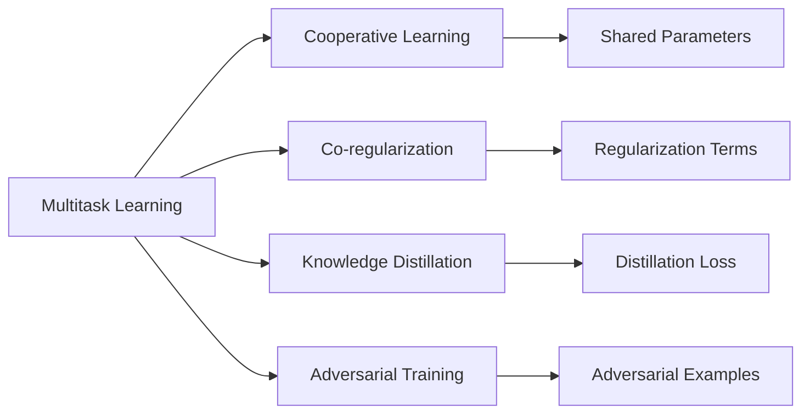
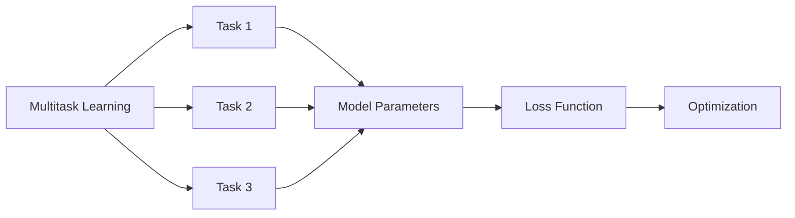
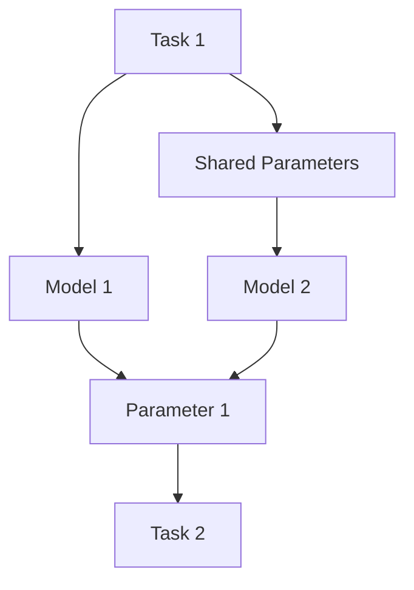
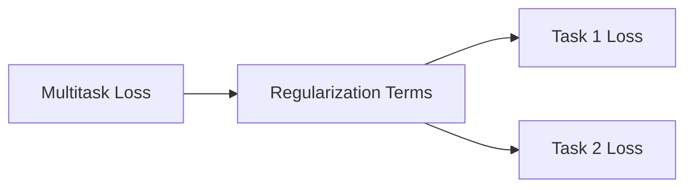
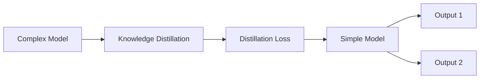
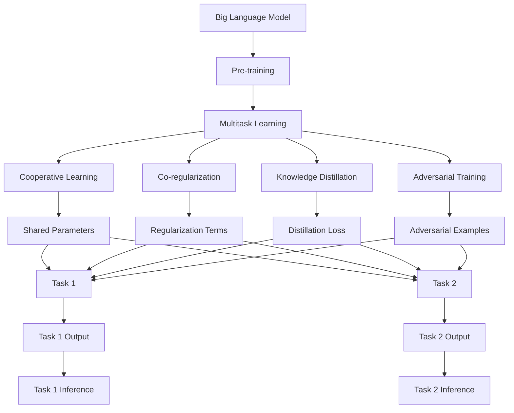

                 

# 多任务学习Multi-Task Learning原理与代码实例讲解

## 1. 背景介绍

### 1.1 问题由来
多任务学习（Multi-Task Learning, MTL）是一种机器学习范式，旨在同时训练多个相关联的任务，以共享知识、提升模型性能、降低训练成本。与传统的单任务学习相比，MTL可以利用任务之间的相关性，使得不同任务的知识相互启发、相互补充，从而在多个任务上取得更好的效果。

MTL在图像分类、语音识别、自然语言处理等领域均取得了显著成果，尤其是深度学习时代，通过使用共享的卷积层或循环层，使得模型的参数可以同时用于多个任务。近年来，随着大规模预训练模型和迁移学习技术的兴起，多任务学习在自然语言处理中的应用也日益广泛，尤其是BERT、GPT等大模型的预训练-微调范式，很大程度上依赖于多任务训练，从而提升了模型在多种下游任务上的性能。

### 1.2 问题核心关键点
MTL的核心在于如何设计多任务的损失函数，以及如何在有限的资源下合理分配和利用任务之间的共享参数。以下是MTL中的几个关键点：

- **任务关系设计**：任务间的关系可以是协调的、竞争的或者独立的。任务间的关系设计将直接影响MTL的训练效果。
- **共享参数设计**：共享参数的多少和分布直接决定多任务学习的效果。过多的共享参数可能导致任务间竞争，过少的共享参数则无法有效利用任务间的相关性。
- **损失函数设计**：损失函数的设计直接决定了模型的优化目标。MTL的损失函数通常包含多个任务的综合损失，需考虑任务间权重。
- **模型架构设计**：MTL的模型架构设计也至关重要。通常使用共享的卷积层、循环层、注意力机制等，以便参数在不同任务间共享。

### 1.3 问题研究意义
多任务学习在深度学习中的应用，对于拓展模型的应用边界、提升模型的泛化能力、降低训练成本等方面具有重要意义：

1. **模型泛化能力提升**：通过多个任务间的共享知识，可以提升模型在特定任务上的泛化能力，减少过拟合风险。
2. **训练成本降低**：多任务学习可以共享训练资源，减少对标注数据的依赖，降低训练成本。
3. **多任务协同优化**：多任务学习可以实现多任务的协同优化，使得模型在多个任务上都能取得优异性能。
4. **知识迁移增强**：通过共享模型参数，可以增强知识在不同任务间的迁移能力，提升模型在特定任务上的效果。
5. **任务无关性提升**：多任务学习可以有效提升模型对新任务的适应能力，减少任务间的数据依赖。

## 2. 核心概念与联系

### 2.1 核心概念概述

为更好地理解多任务学习，本节将介绍几个关键概念：

- **多任务学习（Multi-Task Learning, MTL）**：同时训练多个相关联的任务，以共享知识、提升模型性能、降低训练成本。
- **协同学习（Cooperative Learning）**：多个任务间通过共享参数或损失函数进行协同优化，以提升每个任务的性能。
- **协同正则化（Co-regularization）**：通过在损失函数中加入任务间的约束条件，促进任务间的协同优化。
- **知识蒸馏（Knowledge Distillation）**：通过将复杂模型的知识蒸馏到简单模型，提升模型在特定任务上的性能。
- **对抗训练（Adversarial Training）**：通过在训练过程中加入对抗样本，提升模型的鲁棒性和泛化能力。

这些概念之间的联系可以通过以下Mermaid流程图来展示：



这个流程图展示了大语言模型微调过程中各个核心概念的关系：

1. 多任务学习通过协同学习、协同正则化、知识蒸馏、对抗训练等手段，实现多个任务的协同优化。
2. 协同学习通过共享参数，提升模型在多个任务上的性能。
3. 协同正则化通过在损失函数中加入任务间的约束条件，进一步促进协同优化。
4. 知识蒸馏通过将复杂模型的知识传递给简单模型，提升模型在特定任务上的性能。
5. 对抗训练通过加入对抗样本，提高模型的鲁棒性和泛化能力。

### 2.2 概念间的关系

这些核心概念之间存在着紧密的联系，形成了多任务学习的完整生态系统。下面我通过几个Mermaid流程图来展示这些概念之间的关系。

#### 2.2.1 多任务学习的训练流程



这个流程图展示了多任务学习的训练流程：

1. 多任务学习通过多个任务进行训练。
2. 每个任务共享模型参数，进行协同优化。
3. 损失函数包含多个任务的综合损失。
4. 优化过程通过最小化综合损失来实现模型参数的更新。

#### 2.2.2 协同学习的参数共享



这个流程图展示了协同学习中参数共享的机制：

1. 多任务共享模型参数。
2. 任务间参数共享，提升模型性能。
3. 共享参数在多个任务间分布，以便协同优化。

#### 2.2.3 协同正则化的约束条件



这个流程图展示了协同正则化的约束条件：

1. 多任务损失包含多个任务的损失。
2. 损失函数中加入任务间的约束条件。
3. 约束条件促进任务间的协同优化。

#### 2.2.4 知识蒸馏的知识传递



这个流程图展示了知识蒸馏的知识传递机制：

1. 复杂模型作为知识源，简单模型作为知识接受器。
2. 通过知识蒸馏，复杂模型将知识传递给简单模型。
3. 简单模型在特定任务上性能提升。

#### 2.2.5 对抗训练的鲁棒性提升


这个流程图展示了对抗训练的鲁棒性提升机制：

1. 对抗样本加入训练数据中。
2. 模型在对抗样本上进行训练。
3. 模型鲁棒性和泛化能力提升。

### 2.3 核心概念的整体架构

最后，我们用一个综合的流程图来展示这些核心概念在大语言模型微调过程中的整体架构：



这个综合流程图展示了从预训练到多任务学习的完整过程。大语言模型首先在大规模文本数据上进行预训练，然后通过多任务学习范式进行多个任务的协同优化。协同学习、协同正则化、知识蒸馏、对抗训练等手段，使得模型在多个任务上都能取得优异性能。通过这些流程图，我们可以更清晰地理解多任务学习过程中各个核心概念的关系和作用，为后续深入讨论具体的微调方法和技术奠定基础。

## 3. 核心算法原理 & 具体操作步骤
### 3.1 算法原理概述

多任务学习（MTL）的核心思想是利用多个相关联的任务之间的相关性，提升模型的泛化能力和性能。形式化地，假设我们有多项任务 $T_1, T_2, ..., T_n$，每个任务对应的训练数据集为 $D_i=\{(x_{i,j}, y_{i,j})\}_{j=1}^{m_i}$。其中 $x_{i,j}$ 为输入，$y_{i,j}$ 为标签。多任务学习的目标是通过优化以下联合损失函数来提升模型在多个任务上的性能：

$$
\mathcal{L}(\theta) = \frac{1}{N}\sum_{i=1}^{n} \frac{1}{m_i}\sum_{j=1}^{m_i} \ell_i(M_{\theta}(x_{i,j}), y_{i,j})
$$

其中 $M_{\theta}(x_{i,j})$ 为模型在输入 $x_{i,j}$ 上的输出，$\ell_i$ 为任务 $i$ 的损失函数，$\theta$ 为模型参数。联合损失函数包含多个任务的综合损失，使得模型在多个任务上都能得到优化。

### 3.2 算法步骤详解

多任务学习的核心步骤主要包括：

**Step 1: 准备预训练模型和数据集**
- 选择合适的预训练模型 $M_{\theta}$ 作为初始化参数，如 BERT、GPT等。
- 准备每个任务的标注数据集 $D_i=\{(x_{i,j}, y_{i,j})\}_{j=1}^{m_i}$，其中 $i=1,2,...,n$。

**Step 2: 添加任务适配层**
- 根据任务类型，在预训练模型顶层设计合适的输出层和损失函数。
- 对于分类任务，通常在顶层添加线性分类器和交叉熵损失函数。
- 对于生成任务，通常使用语言模型的解码器输出概率分布，并以负对数似然为损失函数。

**Step 3: 设置多任务学习超参数**
- 选择合适的优化算法及其参数，如 AdamW、SGD 等，设置学习率、批大小、迭代轮数等。
- 设置协同正则化技术及强度，包括权重衰减、Dropout、Early Stopping等。
- 确定共享参数的策略，如只微调顶层，或全部参数都参与微调。

**Step 4: 执行多任务训练**
- 将训练集数据分批次输入模型，前向传播计算损失函数。
- 反向传播计算参数梯度，根据设定的优化算法和学习率更新模型参数。
- 周期性在验证集上评估模型性能，根据性能指标决定是否触发 Early Stopping。
- 重复上述步骤直到满足预设的迭代轮数或 Early Stopping 条件。

**Step 5: 测试和部署**
- 在测试集上评估多任务学习模型 $M_{\hat{\theta}}$ 的性能，对比微调前后的精度提升。
- 使用多任务学习模型对新样本进行推理预测，集成到实际的应用系统中。
- 持续收集新的数据，定期重新训练模型，以适应数据分布的变化。

以上是多任务学习的基本流程。在实际应用中，还需要针对具体任务的特点，对多任务学习过程的各个环节进行优化设计，如改进训练目标函数，引入更多的协同正则化技术，搜索最优的超参数组合等，以进一步提升模型性能。

### 3.3 算法优缺点

多任务学习（MTL）具有以下优点：
1. 提升泛化能力：通过多个任务间的知识共享，提升模型在特定任务上的泛化能力，减少过拟合风险。
2. 提高资源利用率：多个任务共享模型参数，减少对标注数据的依赖，降低训练成本。
3. 提升模型性能：通过多任务优化，模型在多个任务上都能取得优异性能。
4. 加速任务适应：多任务学习使得模型能够快速适应新任务，提升任务无关性。

同时，该方法也存在一定的局限性：
1. 参数共享复杂：多个任务共享模型参数可能导致任务间竞争，影响模型性能。
2. 任务关系设计困难：任务间的关系设计需要仔细考虑，否则可能降低模型效果。
3. 模型复杂度高：多任务学习通常需要设计更复杂的模型架构，增加了模型复杂度。
4. 训练难度大：多任务学习需要同时优化多个任务，增加了训练难度和计算成本。

尽管存在这些局限性，但就目前而言，多任务学习仍是机器学习中较为有效的范式之一，特别是在多任务数据稀缺的情况下，能够有效提升模型性能。未来相关研究的重点在于如何进一步降低多任务学习对标注数据的依赖，提高模型的少样本学习和跨领域迁移能力，同时兼顾可解释性和伦理安全性等因素。

### 3.4 算法应用领域

多任务学习（MTL）在机器学习领域已经得到了广泛的应用，覆盖了几乎所有常见的多任务学习场景，例如：

- 文本分类：如情感分析、主题分类、意图识别等。通过多任务训练，模型能够更好地掌握文本-标签映射。
- 命名实体识别：识别文本中的人名、地名、机构名等特定实体。通过多任务训练，模型能够更好地学习实体边界和类型。
- 关系抽取：从文本中抽取实体之间的语义关系。通过多任务训练，模型能够更好地学习实体-关系三元组。
- 问答系统：对自然语言问题给出答案。通过多任务训练，模型能够更好地匹配问题-答案对，提供更准确的答复。
- 机器翻译：将源语言文本翻译成目标语言。通过多任务训练，模型能够更好地学习语言-语言映射。
- 文本摘要：将长文本压缩成简短摘要。通过多任务训练，模型能够更好地抓取文本要点。
- 对话系统：使机器能够与人自然对话。通过多任务训练，模型能够更好地理解对话历史，生成合理的回复。

除了上述这些经典任务外，多任务学习也被创新性地应用到更多场景中，如可控文本生成、常识推理、代码生成、数据增强等，为多任务学习技术带来了全新的突破。随着多任务学习方法的不断进步，相信其在更多领域的应用将不断涌现，为机器学习技术带来新的创新和进步。

## 4. 数学模型和公式 & 详细讲解  
### 4.1 数学模型构建

本节将使用数学语言对多任务学习过程进行更加严格的刻画。

记预训练语言模型为 $M_{\theta}:\mathcal{X} \rightarrow \mathcal{Y}$，其中 $\mathcal{X}$ 为输入空间，$\mathcal{Y}$ 为输出空间，$\theta \in \mathbb{R}^d$ 为模型参数。假设我们有多项任务 $T_1, T_2, ..., T_n$，每个任务对应的训练集为 $D_i=\{(x_{i,j}, y_{i,j})\}_{j=1}^{m_i}$。

定义模型 $M_{\theta}$ 在输入 $x$ 上的损失函数为 $\ell_i(M_{\theta}(x),y_i)$，则在数据集 $D_i$ 上的经验风险为：

$$
\mathcal{L}_i(\theta) = \frac{1}{m_i}\sum_{j=1}^{m_i} \ell_i(M_{\theta}(x_{i,j}),y_{i,j})
$$

多任务学习的目标是最小化联合损失函数，即找到最优参数：

$$
\theta^* = \mathop{\arg\min}_{\theta} \sum_{i=1}^{n} \mathcal{L}_i(\theta)
$$

在实践中，我们通常使用基于梯度的优化算法（如AdamW、SGD等）来近似求解上述最优化问题。设 $\eta$ 为学习率，$\lambda$ 为正则化系数，则参数的更新公式为：

$$
\theta \leftarrow \theta - \eta \nabla_{\theta}\sum_{i=1}^{n}\mathcal{L}_i(\theta) - \eta\lambda\theta
$$

其中 $\nabla_{\theta}\sum_{i=1}^{n}\mathcal{L}_i(\theta)$ 为联合损失函数对参数 $\theta$ 的梯度，可通过反向传播算法高效计算。

### 4.2 公式推导过程

以下我们以二分类任务为例，推导多任务学习的损失函数及其梯度的计算公式。

假设模型 $M_{\theta}$ 在输入 $x$ 上的输出为 $\hat{y}=M_{\theta}(x) \in [0,1]$，表示样本属于正类的概率。真实标签 $y \in \{0,1\}$。

对于任务 $i$，二分类交叉熵损失函数定义为：

$$
\ell_i(M_{\theta}(x),y) = -[y\log \hat{y} + (1-y)\log (1-\hat{y})]
$$

将其代入经验风险公式，得：

$$
\mathcal{L}_i(\theta) = -\frac{1}{m_i}\sum_{j=1}^{m_i} [y_i\log M_{\theta}(x_i)+(1-y_i)\log(1-M_{\theta}(x_i))]
$$

通过链式法则，联合损失函数对参数 $\theta_k$ 的梯度为：

$$
\frac{\partial \mathcal{L}(\theta)}{\partial \theta_k} = -\sum_{i=1}^{n}\frac{1}{m_i}(\frac{y_i}{M_{\theta}(x_i)}-\frac{1-y_i}{1-M_{\theta}(x_i)}) \frac{\partial M_{\theta}(x_i)}{\partial \theta_k}
$$

其中 $\frac{\partial M_{\theta}(x_i)}{\partial \theta_k}$ 可进一步递归展开，利用自动微分技术完成计算。

在得到联合损失函数的梯度后，即可带入参数更新公式，完成模型的迭代优化。重复上述过程直至收敛，最终得到适应多个任务的最优模型参数 $\theta^*$。

## 5. 项目实践：代码实例和详细解释说明
### 5.1 开发环境搭建

在进行多任务学习实践前，我们需要准备好开发环境。以下是使用Python进行PyTorch开发的环境配置流程：

1. 安装Anaconda：从官网下载并安装Anaconda，用于创建独立的Python环境。

2. 创建并激活虚拟环境：
```bash
conda create -n pytorch-env python=3.8 
conda activate pytorch-env
```

3. 安装PyTorch：根据CUDA版本，从官网获取对应的安装命令。例如：
```bash
conda install pytorch torchvision torchaudio cudatoolkit=11.1 -c pytorch -c conda-forge
```

4. 安装Transformers库：
```bash
pip install transformers
```

5. 安装各类工具包：
```bash
pip install numpy pandas scikit-learn matplotlib tqdm jupyter notebook ipython
```

完成上述步骤后，即可在`pytorch-env`环境中开始多任务学习实践。

### 5.2 源代码详细实现

下面我们以命名实体识别(NER)和情感分析任务为例，给出使用Transformers库对BERT模型进行多任务训练的PyTorch代码实现。

首先，定义多任务数据处理函数：

```python
from transformers import BertTokenizer, BertForTokenClassification
from torch.utils.data import Dataset
import torch

class MultiTaskDataset(Dataset):
    def __init__(self, texts, tags, sentiment_labels, tokenizer, max_len=128):
        self.texts = texts
        self.tags = tags
        self.sentiment_labels = sentiment_labels
        self.tokenizer = tokenizer
        self.max_len = max_len
        
    def __len__(self):
        return len(self.texts)
    
    def __getitem__(self, item):
        text = self.texts[item]
        tags = self.tags[item]
        sentiment_label = self.sentiment_labels[item]
        
        encoding = self.tokenizer(text, return_tensors='pt', max_length=self.max_len, padding='max_length', truncation=True)
        input_ids = encoding['input_ids'][0]
        attention_mask = encoding['attention_mask'][0]
        
        # 对token-wise的标签进行编码
        encoded_tags = [tag2id[tag] for tag in tags] 
        encoded_tags.extend([tag2id['O']] * (self.max_len - len(encoded_tags)))
        labels = torch.tensor(encoded_tags, dtype=torch.long)
        
        sentiment_label = 0 if sentiment_label == 'positive' else 1
        sentiment_label = torch.tensor(sentiment_label, dtype=torch.long)
        
        return {'input_ids': input_ids, 
                'attention_mask': attention_mask,
                'labels': labels,
                'sentiment_label': sentiment_label}

# 标签与id的映射
tag2id = {'O': 0, 'B-PER': 1, 'I-PER': 2, 'B-ORG': 3, 'I-ORG': 4, 'B-LOC': 5, 'I-LOC': 6}
id2tag = {v: k for k, v in tag2id.items()}

# 情感标签与id的映射
sentiment2id = {'positive': 0, 'negative': 1}
id2sentiment = {v: k for k, v in sentiment2id.items()}

# 创建dataset
tokenizer = BertTokenizer.from_pretrained('bert-base-cased')

train_dataset = MultiTaskDataset(train_texts, train_tags, train_sentiment_labels, tokenizer)
dev_dataset = MultiTaskDataset(dev_texts, dev_tags, dev_sentiment_labels, tokenizer)
test_dataset = MultiTaskDataset(test_texts, test_tags, test_sentiment_labels, tokenizer)
```

然后，定义模型和优化器：

```python
from transformers import BertForTokenClassification, AdamW

model = BertForTokenClassification.from_pretrained('bert-base-cased', num_labels=len(tag2id))

optimizer = AdamW(model.parameters(), lr=2e-5)
```

接着，定义训练和评估函数：

```python
from torch.utils.data import DataLoader
from tqdm import tqdm
from sklearn.metrics import classification_report

device = torch.device('cuda') if torch.cuda.is_available() else torch.device('cpu')
model.to(device)

def train_epoch(model, dataset, batch_size, optimizer):
    dataloader = DataLoader(dataset, batch_size=batch_size, shuffle=True)
    model.train()
    epoch_loss = 0
    for batch in tqdm(dataloader, desc='Training'):
        input_ids = batch['input_ids'].to(device)
        attention_mask = batch['attention_mask'].to(device)
        labels = batch['labels'].to(device)
        sentiment_labels = batch['sentiment_label'].to(device)
        model.zero_grad()
        outputs = model(input_ids, attention_mask=attention_mask, labels=labels, sentiment_labels=sentiment_labels)
        loss = outputs.loss
        epoch_loss += loss.item()
        loss.backward()
        optimizer.step()
    return epoch_loss / len(dataloader)

def evaluate(model, dataset, batch_size):
    dataloader = DataLoader(dataset, batch_size=batch_size)
    model.eval()
    preds, labels = [], []
    sentiment_preds, sentiment_labels = [], []
    with torch.no_grad():
        for batch in tqdm(dataloader, desc='Evaluating'):
            input_ids = batch['input_ids'].to(device)
            attention_mask = batch['attention_mask'].to(device)
            labels = batch['labels'].to(device)
            sentiment_labels = batch['sentiment_label'].to(device)
            batch_preds = model(input_ids, attention_mask=attention_mask, labels=labels, sentiment_labels=sentiment_labels)
            batch_preds = batch_preds.logits.argmax(dim=2).to('cpu').tolist()
            batch_labels = batch_labels.to('cpu').tolist()
            batch_sentiment_labels = sentiment_labels.to('cpu').tolist()
            batch_sentiment_preds = model(input_ids, attention_mask=attention_mask, labels=labels, sentiment_labels=sentiment_labels).sentiment_labels.argmax(dim=2).to('cpu').tolist()
            for pred_tokens, label_tokens, sentiment_pred in zip(batch_pred_tokens, batch_labels, batch_sentiment_preds):
                pred_tags = [id2tag[_id] for _id in pred_tokens]
                label_tags = [id2tag[_id] for _id in label_tokens]
                sentiment_preds.append(sentiment_pred)
                sentiment_labels.append(id2sentiment[batch_sentiment_labels[j]])
                preds.append(pred_tags[:len(label_tokens)])
                labels.append(label_tags)
                
    print(classification_report(labels, preds))
    print(classification_report(sentiment_labels, sentiment_preds))
```

最后

