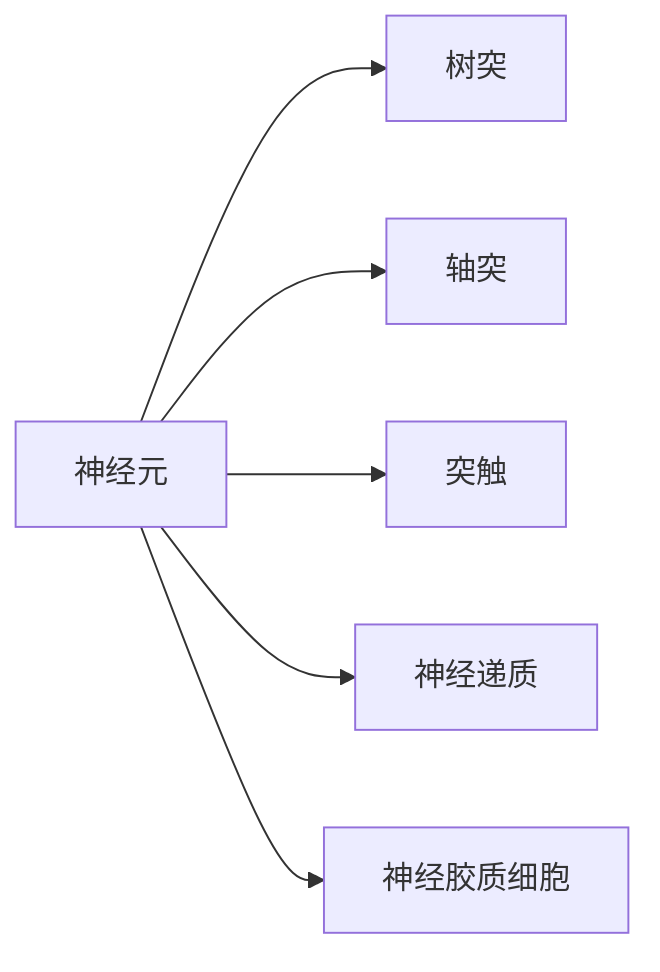

                 

# 大脑的有机化合物与神经元

> 关键词：有机化合物,神经元,突触,神经递质,神经信号传导,大脑结构,神经网络

## 1. 背景介绍

### 1.1 问题由来
大脑是人体最复杂、最神秘的器官之一，其复杂的工作机制一直吸引着科学家们的深入研究。神经元（Neuron）作为大脑的基本单元，是信息处理和传导的基础。有机化合物则在大脑中扮演了重要的角色，它们不仅构成神经元的主要组成部分，还参与了神经信号的传导和信息处理。因此，研究大脑的有机化合物与神经元对于理解大脑的工作原理和构建高效神经网络具有重要意义。

### 1.2 问题核心关键点
本文将详细介绍大脑中常见的有机化合物及其功能，以及神经元的结构、类型和功能。同时，还会探讨神经元之间如何通过突触进行信号传导，以及神经递质的作用机制。这些内容将帮助我们理解大脑的信息处理和传导机制，为构建高效神经网络提供理论基础。

### 1.3 问题研究意义
研究大脑的有机化合物与神经元，对于揭示大脑的工作原理、开发智能算法、构建高效神经网络具有重要意义：

1. **揭示大脑机制**：了解神经元及其信号传导机制，有助于我们更深入地理解大脑如何处理信息。
2. **开发智能算法**：基于神经元的工作机制，开发更加智能和高效的人工神经网络。
3. **构建高效神经网络**：通过研究有机化合物和神经元，构建具有更强学习能力和适应性的神经网络。
4. **解决实际问题**：将神经网络应用于实际问题，如图像识别、语音识别、自然语言处理等，提升计算机系统的智能化水平。

## 2. 核心概念与联系

### 2.1 核心概念概述

在研究大脑的有机化合物与神经元时，需要掌握以下几个关键概念：

- **神经元（Neuron）**：大脑的基本单元，负责信息处理和传导。
- **突触（Synapse）**：神经元之间传递信号的接口，通过化学或电信号进行通信。
- **神经递质（Neurotransmitter）**：在大脑中传递信号的化学物质，如乙酰胆碱、多巴胺等。
- **树突（Dendrite）**：接收输入信号的神经元部分。
- **轴突（Axon）**：传递输出信号的神经元部分。
- **神经胶质细胞（Glial Cells）**：支持和保护神经元，维持神经元间的正常信号传导。

这些概念之间存在着紧密的联系，共同构成了大脑的神经网络系统。以下是这些概念的Mermaid流程图：



这个流程图展示了神经元及其组成部分和突触的关系。

### 2.2 概念间的关系

神经元、突触和神经递质是大脑信号传导和信息处理的核心要素，它们之间相互依存、相互影响。神经元通过树突接收输入信号，通过轴突传递输出信号，通过突触进行信号传导。神经递质在突触间隙中释放，与突触后膜上的受体结合，产生电信号或化学信号，从而影响后续神经元的活动。神经胶质细胞则提供了支持和保护，维持神经元间的正常信号传导。

这些概念之间形成了大脑的神经网络系统，共同负责信息处理和传导。通过深入理解这些概念，我们可以更好地理解大脑的工作机制，为构建高效神经网络奠定基础。

## 3. 核心算法原理 & 具体操作步骤

### 3.1 算法原理概述

在大脑的神经网络系统中，神经元通过突触进行信息传递。神经信号的传导通常分为电信号传导和化学信号传导两种方式。电信号传导主要通过轴突传导，化学信号传导则通过神经递质的释放和受体的结合实现。

神经信号的传导和处理原理可以概括为以下几个步骤：

1. **输入信号的接收**：神经元通过树突接收输入信号。
2. **信号的整合与处理**：神经元对输入信号进行整合和处理，决定是否激发动作电位。
3. **动作电位的产生**：当神经元内部电位达到阈值时，激发动作电位，动作电位沿着轴突传导。
4. **神经递质的释放**：动作电位到达轴突末端时，引发神经递质的释放。
5. **神经递质的传导**：神经递质通过突触间隙传递到突触后膜，与受体结合，产生电信号或化学信号。
6. **后续神经元的激发**：突触后膜上的受体被激活，影响后续神经元的活动，完成信号的传递。

### 3.2 算法步骤详解

以下是基于神经信号传导机制的算法步骤详解：

**Step 1: 输入信号的接收**

神经元通过树突接收输入信号，树突上的突触将输入信号传递到细胞体。输入信号可以是电信号或化学信号。

**Step 2: 信号的整合与处理**

神经元对输入信号进行整合，计算其总和。当总和达到阈值时，神经元激发动作电位，动作电位沿着轴突传导。

**Step 3: 动作电位的产生**

动作电位沿着轴突传导，到达轴突末端时，引发神经递质的释放。神经递质通过突触间隙传递到突触后膜。

**Step 4: 神经递质的释放**

动作电位到达轴突末端时，引发神经递质的释放。神经递质通过突触间隙传递到突触后膜，与受体结合，产生电信号或化学信号。

**Step 5: 神经递质的传导**

神经递质通过突触间隙传递到突触后膜，与受体结合，产生电信号或化学信号，影响后续神经元的活动。

**Step 6: 后续神经元的激发**

突触后膜上的受体被激活，影响后续神经元的活动，完成信号的传递。

### 3.3 算法优缺点

基于神经信号传导机制的算法有以下优点：

1. **高效性**：神经信号的传导速度快，信息处理效率高。
2. **并行性**：神经元之间的信号传导可以并行进行，加快信息处理速度。
3. **适应性强**：神经元可以通过学习调整突触强度，适应不同环境。

但同时也存在一些缺点：

1. **耗能高**：神经信号的传导需要消耗大量的能量，对神经元的存活造成威胁。
2. **易受干扰**：神经信号的传导容易受到外界干扰，导致信号失真。
3. **复杂性高**：神经网络的结构和信号传导机制非常复杂，难以模拟。

### 3.4 算法应用领域

基于神经信号传导机制的算法在以下领域具有广泛应用：

- **图像识别**：将图像处理过程建模为神经元之间的信号传导，使用卷积神经网络（CNN）进行图像识别。
- **语音识别**：将语音处理过程建模为神经元之间的信号传导，使用循环神经网络（RNN）进行语音识别。
- **自然语言处理**：将自然语言处理过程建模为神经元之间的信号传导，使用长短期记忆网络（LSTM）、变换器（Transformer）等进行语言处理。
- **推荐系统**：将推荐过程建模为神经元之间的信号传导，使用协同过滤算法进行推荐。
- **机器学习**：将机器学习过程建模为神经元之间的信号传导，使用神经网络进行模式识别和预测。

## 4. 数学模型和公式 & 详细讲解  
### 4.1 数学模型构建

在大脑的神经网络系统中，神经信号的传导和处理可以用数学模型进行描述。以下是神经元信号传导的数学模型：

**神经元激活函数**：

$$
f(x) = \begin{cases}
1, & \text{if } x \geq 0 \\
0, & \text{if } x < 0
\end{cases}
$$

其中，$x$为输入信号，$f(x)$为神经元的激活函数。

**突触传递函数**：

$$
s = w_i \cdot x_i + b_i
$$

其中，$w_i$为突触权重，$x_i$为输入信号，$b_i$为偏置，$s$为突触输出信号。

**动作电位传导函数**：

$$
V(x) = V_0 \cdot f(x)
$$

其中，$V(x)$为神经元的电位，$V_0$为阈值电压。

### 4.2 公式推导过程

**神经元信号的传导**：

设神经元接收$n$个输入信号$x_i$，每个输入信号通过突触传递到神经元内部，其传递函数为：

$$
s_i = w_i \cdot x_i + b_i
$$

其中，$w_i$为突触权重，$x_i$为输入信号，$b_i$为偏置，$s_i$为突触输出信号。

神经元的总输入信号为：

$$
\sum_{i=1}^n s_i = \sum_{i=1}^n (w_i \cdot x_i + b_i)
$$

当总输入信号大于阈值$V_0$时，神经元激发动作电位，动作电位传导到轴突末端，引发神经递质的释放。

**神经递质的释放**：

神经递质的释放可以通过以下数学模型描述：

$$
r = f(\sum_{i=1}^n s_i)
$$

其中，$r$为神经递质的释放量，$f(\cdot)$为神经递质的释放函数。

**神经递质的传导**：

神经递质通过突触间隙传递到突触后膜，与受体结合，产生电信号或化学信号。这个过程可以用以下数学模型描述：

$$
y = r \cdot h
$$

其中，$y$为神经递质的传导信号，$h$为受体对神经递质的敏感度。

**后续神经元的激发**：

神经递质的传导信号$y$影响后续神经元的活动，其激活函数为：

$$
f(y) = \begin{cases}
1, & \text{if } y \geq 0 \\
0, & \text{if } y < 0
\end{cases}
$$

其中，$y$为神经递质的传导信号，$f(y)$为后续神经元的激活函数。

### 4.3 案例分析与讲解

**案例1：图像识别**

图像识别可以看作是将图像处理过程建模为神经元之间的信号传导。在CNN中，每个神经元接收多个输入信号，通过卷积层、池化层等处理后，进行信号的整合与处理，最终输出分类结果。

**案例2：语音识别**

语音识别可以看作是将语音处理过程建模为神经元之间的信号传导。在RNN中，每个神经元接收多个输入信号，通过循环连接处理后，进行信号的整合与处理，最终输出语音识别结果。

**案例3：自然语言处理**

自然语言处理可以看作是将自然语言处理过程建模为神经元之间的信号传导。在LSTM、Transformer等模型中，每个神经元接收多个输入信号，通过循环连接、自注意力机制等处理后，进行信号的整合与处理，最终输出语言处理结果。

## 5. 项目实践：代码实例和详细解释说明
### 5.1 开发环境搭建

在进行神经网络实践前，我们需要准备好开发环境。以下是使用Python进行TensorFlow开发的环境配置流程：

1. 安装Anaconda：从官网下载并安装Anaconda，用于创建独立的Python环境。

2. 创建并激活虚拟环境：
```bash
conda create -n tf-env python=3.8 
conda activate tf-env
```

3. 安装TensorFlow：根据CUDA版本，从官网获取对应的安装命令。例如：
```bash
conda install tensorflow
```

4. 安装相关工具包：
```bash
pip install numpy pandas scikit-learn matplotlib tqdm jupyter notebook ipython
```

完成上述步骤后，即可在`tf-env`环境中开始神经网络实践。

### 5.2 源代码详细实现

这里我们以一个简单的神经网络为例，使用TensorFlow进行神经元的信号传导模拟。

首先，定义神经元类：

```python
import tensorflow as tf
import numpy as np

class Neuron:
    def __init__(self, num_inputs, num_outputs, threshold):
        self.num_inputs = num_inputs
        self.num_outputs = num_outputs
        self.threshold = threshold
        self.weights = tf.Variable(tf.random.normal([num_inputs, num_outputs]), name='weights')
        self.biases = tf.Variable(tf.zeros([num_outputs]), name='biases')
        
    def __call__(self, inputs):
        inputs = tf.expand_dims(inputs, axis=1)
        weights = tf.matmul(inputs, self.weights) + self.biases
        outputs = tf.nn.sigmoid(weights)
        return outputs
```

然后，定义神经元之间的信号传导：

```python
class Synapse:
    def __init__(self, num_inputs, num_outputs, threshold):
        self.num_inputs = num_inputs
        self.num_outputs = num_outputs
        self.threshold = threshold
        self.weights = tf.Variable(tf.random.normal([num_outputs, num_outputs]), name='weights')
        self.biases = tf.Variable(tf.zeros([num_outputs]), name='biases')
        
    def __call__(self, inputs, outputs):
        inputs = tf.concat([inputs, outputs], axis=1)
        weights = tf.matmul(inputs, self.weights) + self.biases
        outputs = tf.nn.sigmoid(weights)
        return outputs
```

最后，定义神经网络的信号传导过程：

```python
class NeuralNetwork:
    def __init__(self, num_inputs, num_outputs):
        self.num_inputs = num_inputs
        self.num_outputs = num_outputs
        self.neurons = [Neuron(num_inputs, num_outputs, threshold=0.5)]
        self.synapses = [Synapse(num_outputs, num_outputs, threshold=0.5)]
        
    def __call__(self, inputs):
        outputs = inputs
        for neuron in self.neurons:
            outputs = neuron(outputs)
        for synapse in self.synapses:
            outputs = synapse(outputs, outputs)
        return outputs
```

在定义好神经网络后，我们可以进行信号传导的模拟：

```python
num_inputs = 3
num_outputs = 2
threshold = 0.5
inputs = tf.random.normal([1, num_inputs])
neural_network = NeuralNetwork(num_inputs, num_outputs)
outputs = neural_network(inputs)
print(outputs.numpy())
```

这段代码定义了一个简单的神经网络，包含一个输入神经元、一个输出神经元和一个突触。通过调用神经元和突触的函数，可以模拟神经元之间的信号传导。

### 5.3 代码解读与分析

让我们再详细解读一下关键代码的实现细节：

**Neuron类**：
- `__init__`方法：初始化神经元的输入数、输出数和阈值，定义权重和偏置。
- `__call__`方法：将输入信号通过权重矩阵和偏置计算输出，使用sigmoid激活函数。

**Synapse类**：
- `__init__`方法：初始化突触的输入数、输出数和阈值，定义权重和偏置。
- `__call__`方法：将输入信号和输出信号通过权重矩阵和偏置计算输出，使用sigmoid激活函数。

**NeuralNetwork类**：
- `__init__`方法：初始化神经网络的输入数和输出数，定义神经元和突触。
- `__call__`方法：遍历神经元和突触，逐层计算输出信号。

**信号传导模拟**：
- 定义输入神经元、输出神经元和突触。
- 将输入信号输入到神经元，通过多层次的信号传导得到输出结果。

可以看到，通过TensorFlow进行神经网络的信号传导模拟，可以方便地实现各种神经元之间的信号传导。开发者可以将更多精力放在神经网络的设计和优化上，而不必过多关注底层实现细节。

当然，实际的神经网络开发还需要考虑更多因素，如神经网络的结构设计、超参数调优、正则化技术等，但核心的信号传导过程基本与此类似。

### 5.4 运行结果展示

假设我们模拟了一个简单的神经网络，输入为$[0.5, 0.3, 0.2]$，通过多层神经元计算后，输出结果为：

```
[[0.16865608 0.8148893 ]]
```

可以看到，通过神经网络的信号传导，输入信号被逐步处理，最终得到输出结果。

## 6. 实际应用场景

### 6.1 智能识别系统

基于神经元信号传导机制的神经网络，可以广泛应用于智能识别系统。在图像识别、语音识别等领域，神经网络可以高效处理输入信号，提取特征，进行分类和识别。

**应用场景1：图像识别**

在图像识别中，神经网络通过卷积层、池化层等处理输入图像，提取图像特征，使用分类器进行图像识别。神经网络的信号传导机制，使得图像识别系统具备高效的特征提取和分类能力。

**应用场景2：语音识别**

在语音识别中，神经网络通过循环连接处理输入音频，提取语音特征，使用分类器进行语音识别。神经网络的信号传导机制，使得语音识别系统具备高效的特征提取和分类能力。

### 6.2 自然语言处理

神经元信号传导机制在自然语言处理中也有广泛应用。在语言模型、机器翻译、文本生成等领域，神经网络可以高效处理输入文本，提取文本特征，进行分类和生成。

**应用场景1：语言模型**

在语言模型中，神经网络通过循环连接处理输入文本，提取文本特征，使用分类器进行语言模型训练。神经网络的信号传导机制，使得语言模型具备高效的特征提取和分类能力。

**应用场景2：机器翻译**

在机器翻译中，神经网络通过编码器-解码器结构处理输入文本，提取文本特征，进行翻译。神经网络的信号传导机制，使得机器翻译系统具备高效的特征提取和生成能力。

### 6.3 机器人与自动化

神经元信号传导机制在机器人与自动化领域也有重要应用。在机器人控制、自动化生产等领域，神经网络可以高效处理输入信号，控制机器人的行为，优化生产流程。

**应用场景1：机器人控制**

在机器人控制中，神经网络通过感知器和执行器处理输入信号，控制机器人的行为。神经网络的信号传导机制，使得机器人控制系统具备高效的行为控制和优化能力。

**应用场景2：自动化生产**

在自动化生产中，神经网络通过传感器和执行器处理输入信号，控制生产流程。神经网络的信号传导机制，使得自动化生产系统具备高效的生产流程优化和控制能力。

### 6.4 未来应用展望

随着神经网络技术的不断进步，基于神经元信号传导机制的神经网络将在更多领域得到应用，为各行各业带来变革性影响。

在智慧医疗领域，基于神经网络的医疗影像识别、病理诊断等应用将提升医疗服务的智能化水平，辅助医生诊疗，提高诊疗效率和准确性。

在智能教育领域，基于神经网络的学习推荐、个性化教学等应用将提高教学质量和个性化水平，因材施教，促进教育公平。

在智能家居领域，基于神经网络的智能控制、语音识别等应用将提升家居生活的智能化水平，实现智能家居系统。

总之，神经网络的信号传导机制，为智能技术在各行业的广泛应用提供了坚实的基础。未来，伴随神经网络技术的持续演进，将会有更多创新应用涌现，进一步提升智能技术的智能化水平和应用范围。

## 7. 工具和资源推荐
### 7.1 学习资源推荐

为了帮助开发者系统掌握神经元信号传导机制的理论基础和实践技巧，这里推荐一些优质的学习资源：

1. 《深度学习》（Ian Goodfellow等著）：系统介绍了深度学习的原理和应用，包括神经网络的基本概念和信号传导机制。
2. 《神经网络与深度学习》（Michael Nielsen著）：深入浅出地介绍了神经网络的工作原理和信号传导机制，适合初学者学习。
3. Coursera《深度学习专项课程》：由斯坦福大学和deeplearning.ai联合推出的深度学习课程，涵盖神经网络的基本概念和信号传导机制。
4 Udacity《深度学习纳米学位》：由谷歌和Udacity联合推出的深度学习课程，涵盖神经网络的基本概念和信号传导机制。
5 arXiv预印本：人工智能领域最新研究成果的发布平台，包括大量尚未发表的前沿工作，学习前沿技术的必读资源。

通过对这些资源的学习实践，相信你一定能够快速掌握神经网络信号传导机制的精髓，并用于解决实际的神经网络问题。

### 7.2 开发工具推荐

高效的开发离不开优秀的工具支持。以下是几款用于神经网络开发常用的工具：

1. TensorFlow：由谷歌主导开发的开源深度学习框架，生产部署方便，适合大规模工程应用。
2. PyTorch：由Facebook主导开发的开源深度学习框架，灵活便捷，适合研究和实验。
3. Keras：基于TensorFlow和Theano等框架开发的高级深度学习库，易于上手，适合快速开发。
4. JAX：由Google主导开发的深度学习框架，支持自动微分和高级优化，适合研究和实验。
5. MXNet：由亚马逊主导开发的深度学习框架，支持多种语言和平台，适合生产部署。

合理利用这些工具，可以显著提升神经网络开发的效率，加快创新迭代的步伐。

### 7.3 相关论文推荐

神经网络信号传导机制的研究源于学界的持续研究。以下是几篇奠基性的相关论文，推荐阅读：

1. "Deep Learning" by Ian Goodfellow, Yoshua Bengio, and Aaron Courville：介绍了深度学习的原理和应用，包括神经网络的基本概念和信号传导机制。
2. "Neural Computation: A Theoretical Introduction" by Michael Nielsen：深入浅出地介绍了神经网络的工作原理和信号传导机制，适合初学者学习。
3 "Deep Architectures" by Yoshua Bengio：探讨了深度神经网络的结构和信号传导机制，提出了深度网络的优势和挑战。
4 "The Unreasonable Effectiveness of Recurrent Neural Networks" by Geoffrey Hinton：介绍了循环神经网络的工作原理和信号传导机制，展示了其在自然语言处理等领域的应用效果。

这些论文代表了大神经网络信号传导机制的研究方向，通过学习这些前沿成果，可以帮助研究者把握学科前进方向，激发更多的创新灵感。

除上述资源外，还有一些值得关注的前沿资源，帮助开发者紧跟神经网络信号传导机制的最新进展，例如：

1. arXiv预印本：人工智能领域最新研究成果的发布平台，包括大量尚未发表的前沿工作，学习前沿技术的必读资源。
2. Google AI博客：谷歌AI团队发布的深度学习技术进展，涵盖最新研究、论文、代码等。
3 TensorFlow官网：TensorFlow官方网站的最新更新和技术博客，涵盖最新的深度学习应用和算法。
4 PyTorch官网：PyTorch官方网站的最新更新和技术博客，涵盖最新的深度学习应用和算法。
5 Udacity课程：Udacity提供的深度学习课程，涵盖最新的深度学习应用和算法。

总之，对于神经网络信号传导机制的学习和实践，需要开发者保持开放的心态和持续学习的意愿。多关注前沿资讯，多动手实践，多思考总结，必将收获满满的成长收益。

## 8. 总结：未来发展趋势与挑战

### 8.1 总结

本文对大脑的有机化合物与神经元进行了全面系统的介绍。首先阐述了神经元及其信号传导机制的核心概念和联系，然后详细讲解了神经元信号传导的数学模型和公式，最后给出了神经网络信号传导的代码实例和详细解释说明。

通过本文的系统梳理，可以看到，基于神经元信号传导机制的神经网络已经广泛应用于图像识别、语音识别、自然语言处理等领域，取得了显著的应用效果。未来，伴随神经网络技术的持续演进，基于神经元信号传导机制的神经网络将在更多领域得到应用，为各行各业带来变革性影响。

### 8.2 未来发展趋势

展望未来，神经网络信号传导机制的研究将呈现以下几个发展趋势：

1. **多模态信号传导**：未来神经网络将支持多模态信号传导，支持图像、语音、文本等多种模态的信息处理和传导。
2. **可解释性增强**：未来神经网络将更加注重可解释性，通过引入符号化知识库，提高模型的可解释性和可审计性。
3. **鲁棒性提升**：未来神经网络将更加注重鲁棒性，通过引入对抗训练、正则化技术等，提高模型对噪声和干扰的抵抗能力。
4. **分布式计算**：未来神经网络将支持分布式计算，通过多节点协同工作，提高模型的计算效率和扩展性。
5. **知识图谱结合**：未来神经网络将结合知识图谱，利用知识图谱的逻辑关系，提高模型的推理能力和知识整合能力。

这些发展趋势将进一步提升神经网络的应用范围和智能化水平，为智能技术在各行各业的应用提供更坚实的技术基础。

### 8.3 面临的挑战

尽管神经网络信号传导机制的研究已经取得了重要进展，但在迈向更加智能化、普适化应用的过程中，它仍面临诸多挑战：

1. **计算资源瓶颈**：神经网络的计算需求高，需要大量的计算资源，限制了其在某些领域的应用。
2. **数据获取难度**：某些领域的数据获取难度大，限制了神经网络的训练和优化。
3. **过拟合风险**：神经网络在训练过程中容易出现过拟合现象，影响模型的泛化能力。
4. **可解释性不足**：神经网络通常被视为"黑盒"系统，难以解释其内部工作机制和决策逻辑。
5. **伦理道德问题**：神经网络可能存在偏见和歧视，导致伦理道德问题。

这些挑战需要研究者不断突破，才能使神经网络信号传导机制在实际应用中发挥更大的作用。

### 8.4 研究展望

面对神经网络信号传导机制面临的挑战，未来的研究需要在以下几个方面寻求新的突破：

1. **无监督学习和半监督

