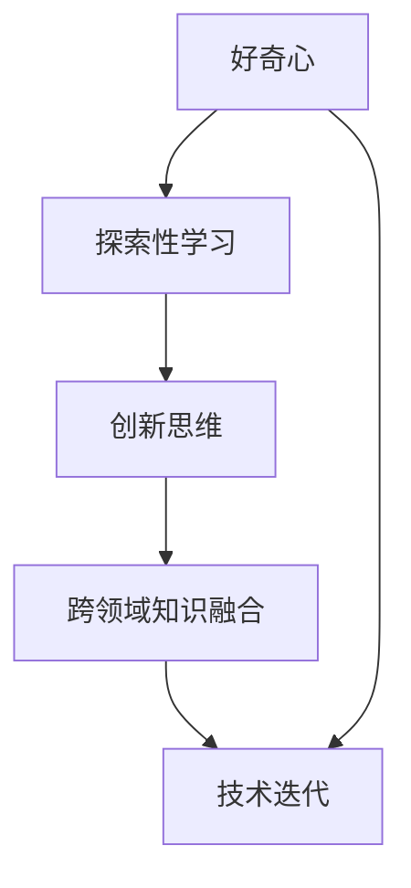

                 

# 好奇心：探索未知的动力

好奇心是推动人类文明进步的重要动力之一，是人类探索未知、发明创新、突破自我认知的源泉。而在计算机领域，好奇心同样发挥着关键作用。从最初的简单计算器到现代复杂的人工智能系统，每一次技术的飞跃和突破，都离不开对未知的好奇心驱动。本文将探讨好奇心在计算机领域的应用，分析其对技术进步和创新的深远影响，并展望未来的发展趋势。

## 1. 背景介绍

### 1.1 问题由来

计算机科学自诞生以来，已经经历了多次技术革新和产业变革。每一次的技术进步，都源于对现有技术的深入探究和对未来可能性的探索。好奇心驱动着研究者们不断挑战现有认知，开拓未知领域，带来了一系列划时代的成就。

1960年代，计算机科学家探索了编程语言、操作系统、编译器等基础架构，为现代计算机体系奠定了基础。1980年代，人工智能领域的研究者们提出了专家系统、神经网络等算法，开启了AI时代的新篇章。而随着互联网、大数据、云计算等技术的出现，好奇心驱动着学者和开发者在分布式系统、算法优化、智能应用等方面不断创新，推动了现代科技的蓬勃发展。

### 1.2 问题核心关键点

好奇心在计算机领域的核心关键点主要包括：

- **探索精神**：对未知领域的好奇心驱使研究者不断探索，发现新的规律和理论，推动技术的进步。
- **创新驱动**：好奇心激发了新方法、新工具和新应用的出现，提升了技术创新和产业应用的速度。
- **跨领域融合**：好奇心促成了不同领域间的技术交流与融合，推动了计算机科学与其他学科的协同发展。
- **人类福祉**：好奇心促进了人工智能、医疗、教育等领域的创新应用，提升了人类生活质量和社会进步。

理解这些关键点，有助于我们更好地把握好奇心在计算机领域的重要性，为未来的探索提供指导。

## 2. 核心概念与联系

### 2.1 核心概念概述

1. **好奇心**：指对未知事物和问题保持兴趣、探究欲望的心理状态。好奇心是驱使人们不断学习、探索、创新的内在动力。
2. **探索性学习**：指在获取知识的过程中，主动发现问题、解决问题，从而获得新知识的认知过程。
3. **创新思维**：指打破常规思维定式，提出新颖解决方案的思维方式。
4. **跨领域知识融合**：指在多个学科领域之间进行知识的交叉应用和融合，产生新的技术突破。
5. **技术迭代**：指通过不断的探索和创新，实现技术的持续改进和更新换代。

### 2.2 概念间的关系

好奇心是探索性学习的驱动力，创新思维是探索性学习的产物，跨领域知识融合和技术迭代则是在好奇心和探索性学习的基础上，产生的新技术和应用的体现。好奇心、探索性学习、创新思维、跨领域知识融合和技术迭代之间相互关联，共同构成了计算机领域的创新生态系统。

以下是一个Mermaid流程图，展示这些核心概念之间的关系：



## 3. 核心算法原理 & 具体操作步骤

### 3.1 算法原理概述

好奇心驱动的技术创新过程，可以通过以下步骤概括：

1. **问题定义**：确定需要解决的问题或目标，明确探索的方向。
2. **假设生成**：根据问题的复杂性，生成可行的假设或模型。
3. **数据收集**：收集相关的数据，为模型训练提供数据基础。
4. **模型训练**：利用数据训练模型，验证假设的正确性。
5. **结果评估**：评估模型的性能和效果，判断是否达到预期目标。
6. **迭代优化**：根据评估结果，进行模型优化或调整，继续探索新的方向。

这一过程是一个循环迭代的持续改进过程，每一个步骤都可能带来新的发现和突破。

### 3.2 算法步骤详解

以人工智能领域为例，展示如何利用好奇心驱动的技术创新过程：

1. **问题定义**：在自然语言处理领域，目标是通过文本分析预测用户的情感倾向，帮助企业了解用户反馈和市场动态。
2. **假设生成**：假设基于深度学习的情感分析模型可以有效地识别文本情感，如正面、负面和中性。
3. **数据收集**：收集大量的用户评论和社交媒体数据，构建情感标注数据集。
4. **模型训练**：利用数据集训练基于Transformer的情感分析模型，并进行超参数调优。
5. **结果评估**：在测试集上评估模型性能，分析模型的优势和不足。
6. **迭代优化**：根据评估结果，进一步优化模型架构和训练方法，提升模型准确率。

### 3.3 算法优缺点

好奇心驱动的技术创新具有以下优点：

- **自驱动性**：好奇心自然驱动研究者主动探索未知领域，无需外部强制要求。
- **灵活性**：不受现有框架和技术的限制，可以自由探索和尝试新的方法和技术。
- **创新性**：好奇心促使研究者打破常规，提出创新性解决方案，推动技术进步。

同时，也存在一些缺点：

- **高风险性**：好奇心驱动的探索可能面临高风险，投入巨大资源却难以取得预期效果。
- **资源需求**：好奇心驱动的技术创新需要大量的数据、计算资源和人力支持。
- **不确定性**：探索未知领域具有高度不确定性，可能无法直接看到明显的收益。

### 3.4 算法应用领域

好奇心驱动的技术创新广泛应用于以下领域：

1. **人工智能**：推动深度学习、自然语言处理、计算机视觉等领域的创新应用。
2. **互联网和社交媒体**：驱动网络搜索、推荐系统、社交网络分析等应用的发展。
3. **医疗健康**：促进医疗影像分析、基因组学、个性化医疗等技术创新。
4. **金融科技**：推动智能投顾、风险评估、区块链技术等创新应用。
5. **智慧城市**：提升城市管理、交通控制、环境保护等智慧应用。
6. **教育技术**：驱动在线教育、虚拟现实、个性化学习等技术创新。

## 4. 数学模型和公式 & 详细讲解  
### 4.1 数学模型构建

基于好奇心的技术创新过程，可以通过数学模型进行定量描述和优化。以下是一个简化的模型构建过程：

1. **问题定义**：设问题为 $P$，定义问题空间的集合为 $S$。
2. **假设生成**：生成假设 $H$，映射问题 $P$ 到假设空间 $S$。
3. **数据收集**：设训练集为 $D$，包含 $N$ 个样本 $(x_i, y_i)$，其中 $x_i$ 为输入，$y_i$ 为输出标签。
4. **模型训练**：选择模型 $M$，定义损失函数 $L$，求解 $M$ 使得 $L(M(D))$ 最小化。
5. **结果评估**：设测试集为 $D'$，评估模型性能，计算准确率 $A = \frac{1}{N'} \sum_{i=1}^{N'} I(M(x'_i), y'_i)$。
6. **迭代优化**：通过调整模型参数 $θ$，优化损失函数 $L$，反复迭代直至收敛。

### 4.2 公式推导过程

以二分类问题为例，展示假设生成和模型训练的过程。

1. **假设生成**：设假设函数 $h(x)$ 为 $h(x) = f(x;θ)$，其中 $f(x)$ 为神经网络模型，$θ$ 为模型参数。
2. **模型训练**：选择损失函数 $L$ 为交叉熵损失，目标函数为 $L(M(D)) = \frac{1}{N} \sum_{i=1}^N \ell(M(x_i), y_i)$。
3. **结果评估**：在测试集 $D'$ 上评估模型性能，计算准确率 $A = \frac{1}{N'} \sum_{i=1}^{N'} I(M(x'_i), y'_i)$。
4. **迭代优化**：使用梯度下降算法，更新模型参数 $θ$，使 $L$ 最小化。

具体公式推导如下：

假设输入 $x_i$ 经过神经网络 $f(x)$ 后，输出 $M(x_i)$ 为模型预测结果，交叉熵损失函数为：

$$
L(M(D)) = -\frac{1}{N} \sum_{i=1}^N [y_i \log M(x_i) + (1-y_i) \log (1-M(x_i))]
$$

优化目标为使 $L$ 最小化，因此使用梯度下降算法更新参数 $θ$：

$$
θ \leftarrow θ - \eta \nabla_{θ}L(M(D))
$$

其中 $\eta$ 为学习率。

### 4.3 案例分析与讲解

以自然语言处理中的文本分类为例，展示模型训练和结果评估的过程。

1. **问题定义**：目标是对新闻文章进行情感分类，分为正面、负面和中性。
2. **假设生成**：假设使用深度学习模型，如BiLSTM-CRF模型，构建文本分类器。
3. **数据收集**：收集新闻文章和对应的情感标签，构建训练集和测试集。
4. **模型训练**：在训练集上训练模型，使用交叉熵损失函数，调整超参数，优化模型性能。
5. **结果评估**：在测试集上评估模型准确率，计算混淆矩阵等指标。
6. **迭代优化**：根据评估结果，调整模型结构和超参数，进一步提升模型性能。

## 5. 项目实践：代码实例和详细解释说明

### 5.1 开发环境搭建

开发环境搭建步骤如下：

1. 安装Python：在官网下载最新版本的Python，建议安装3.9以上版本。
2. 安装Jupyter Notebook：使用pip命令安装Jupyter Notebook，用于交互式编程和数据可视化。
3. 安装TensorFlow：使用pip命令安装TensorFlow，提供深度学习功能。
4. 安装Keras：使用pip命令安装Keras，提供高层次的神经网络接口。
5. 安装NumPy：使用pip命令安装NumPy，提供数值计算功能。

### 5.2 源代码详细实现

以下是一个基于TensorFlow和Keras实现的文本分类器代码示例：

```python
import tensorflow as tf
from tensorflow.keras.preprocessing.text import Tokenizer
from tensorflow.keras.preprocessing.sequence import pad_sequences
from tensorflow.keras.layers import Embedding, Bidirectional, LSTM, Dense, Dropout
from tensorflow.keras.models import Sequential

# 数据准备
texts = ['I love this movie', 'This movie is terrible', 'This movie is okay']
labels = [1, 0, 1]
tokenizer = Tokenizer()
tokenizer.fit_on_texts(texts)
sequences = tokenizer.texts_to_sequences(texts)
padded_sequences = pad_sequences(sequences, maxlen=5, padding='post')
labels = tf.keras.utils.to_categorical(labels)

# 模型构建
model = Sequential()
model.add(Embedding(input_dim=5000, output_dim=32, input_length=5))
model.add(Bidirectional(LSTM(64, dropout=0.2)))
model.add(Dense(1, activation='sigmoid'))
model.compile(loss='binary_crossentropy', optimizer='adam', metrics=['accuracy'])

# 模型训练
model.fit(padded_sequences, labels, epochs=10, verbose=1)

# 模型评估
test_texts = ['This movie is amazing', 'This movie is awful']
test_sequences = tokenizer.texts_to_sequences(test_texts)
test_padded_sequences = pad_sequences(test_sequences, maxlen=5, padding='post')
test_labels = tf.keras.utils.to_categorical([1, 0])
predictions = model.predict(test_padded_sequences)
print(predictions)
```

### 5.3 代码解读与分析

该代码示例展示了如何使用TensorFlow和Keras构建和训练一个简单的文本分类器。具体分析如下：

1. **数据准备**：使用Tokenizers模块进行文本预处理，将文本转换为数字序列，并进行填充和截断。
2. **模型构建**：使用Embedding层将文本转换为向量表示，通过Bidirectional LSTM层进行序列建模，最终使用Dense层输出分类结果。
3. **模型训练**：使用binary_crossentropy损失函数和adam优化器进行模型训练，并在训练过程中输出进度条。
4. **模型评估**：使用test_texts数据集评估模型性能，并输出预测结果。

## 6. 实际应用场景

### 6.1 智能客服系统

基于好奇心的智能客服系统可以为用户提供个性化服务。系统通过收集用户历史对话和行为数据，利用好奇心驱动的模型优化，实现情感识别、意图理解等功能，提供智能回答和推荐。

### 6.2 医疗诊断系统

医疗诊断系统可以通过收集患者病历和影像数据，利用好奇心驱动的深度学习模型进行疾病预测和诊断。系统不断学习和优化，逐步提高诊断的准确率和覆盖面，辅助医生进行精准诊疗。

### 6.3 金融风控系统

金融风控系统可以通过收集用户的交易记录和行为数据，利用好奇心驱动的模型进行风险评估和预警。系统不断优化模型，提升风险预测的准确性，保障金融安全。

### 6.4 未来应用展望

未来，基于好奇心的技术创新将进一步拓展应用场景，推动更多领域的智能化进程：

1. **智慧城市**：通过收集城市运行数据，利用好奇心驱动的模型进行交通优化、能源管理、环境监测等应用。
2. **教育技术**：通过收集学生学习行为数据，利用好奇心驱动的模型进行个性化推荐和辅导，提升教育效果。
3. **农业技术**：通过收集农业生产数据，利用好奇心驱动的模型进行精准农业和智慧农业，提高农业生产效率。
4. **智能制造**：通过收集生产设备和运营数据，利用好奇心驱动的模型进行智能制造和质量控制，提升生产效率和产品质量。

## 7. 工具和资源推荐

### 7.1 学习资源推荐

1. 《深度学习》：Yoshua Bengio等著，全面介绍深度学习理论和实践，是深度学习领域的经典教材。
2. Coursera《机器学习》课程：Andrew Ng教授主讲，涵盖机器学习基础和深度学习算法。
3. Google AI的TensorFlow和ML Coursera课程：提供深度学习框架和机器学习算法的详细讲解和实践。
4. Kaggle竞赛平台：提供各类数据集和算法竞赛，帮助学习者提升数据处理和模型训练能力。
5. GitHub开源项目：提供丰富的开源代码和资源，帮助学习者了解前沿技术和应用实践。

### 7.2 开发工具推荐

1. TensorFlow：Google开发的深度学习框架，功能强大，易于使用。
2. PyTorch：Facebook开发的深度学习框架，灵活高效。
3. Keras：高层次神经网络接口，提供快速构建模型的能力。
4. Jupyter Notebook：交互式编程环境，适合进行数据探索和模型训练。
5. Git和GitHub：版本控制工具和代码托管平台，方便协作和分享。

### 7.3 相关论文推荐

1. Deep Learning：Ian Goodfellow等著，涵盖深度学习理论和实践，是深度学习领域的权威教材。
2. Convolutional Neural Networks for Visual Recognition：Alex Krizhevsky等著，介绍卷积神经网络在图像识别中的应用。
3. Attention Is All You Need：Ashish Vaswani等著，介绍Transformer架构及其在自然语言处理中的应用。
4. Reinforcement Learning：Richard S. Sutton等著，介绍强化学习理论和算法，是强化学习领域的经典教材。
5. Generative Adversarial Networks：Ian Goodfellow等著，介绍生成对抗网络及其在图像生成和数据增强中的应用。

## 8. 总结：未来发展趋势与挑战

### 8.1 研究成果总结

好奇心驱动的技术创新在计算机领域取得了显著成就，推动了人工智能、深度学习、自然语言处理等领域的快速发展。未来，这一趋势将继续深化，带来更多颠覆性技术突破。

### 8.2 未来发展趋势

1. **自动化和智能化**：好奇心驱动的技术创新将进一步推动自动化和智能化进程，提升生产力和效率。
2. **跨领域融合**：不同领域的知识和技术将进一步融合，推动跨学科创新应用。
3. **伦理和安全**：技术创新将更加注重伦理和安全问题，确保技术应用符合社会价值观和法律法规。
4. **人机协同**：好奇心驱动的技术创新将促进人机协同工作，提升人类与机器的合作水平。
5. **可持续发展**：技术创新将更加注重可持续发展，推动环境友好型技术的开发。

### 8.3 面临的挑战

尽管好奇心驱动的技术创新带来了诸多优势，但也面临以下挑战：

1. **伦理和法律**：技术创新需要考虑伦理和法律问题，避免技术滥用和数据隐私问题。
2. **数据隐私**：技术创新需要处理大量数据，如何保护数据隐私和安全，避免数据滥用。
3. **计算资源**：好奇心驱动的技术创新需要大量计算资源，如何高效利用计算资源，降低成本。
4. **技术公平性**：技术创新需要考虑技术公平性问题，避免技术歧视和偏见。
5. **社会影响**：技术创新需要考虑社会影响，避免对社会带来负面影响。

### 8.4 研究展望

面对未来挑战，好奇心驱动的技术创新需要进一步探索和优化：

1. **伦理和法律规范**：建立健全技术伦理和法律规范，确保技术应用符合社会价值观和法律法规。
2. **隐私保护技术**：开发隐私保护技术，确保数据隐私和安全，避免数据滥用。
3. **高效计算技术**：开发高效计算技术，降低计算成本，提高计算效率。
4. **公平性算法**：开发公平性算法，避免技术歧视和偏见，确保技术应用公平。
5. **社会影响评估**：建立社会影响评估机制，确保技术创新对社会产生积极影响。

总之，好奇心驱动的技术创新将不断推动计算机科学的进步，为人类社会的智能化发展提供强大动力。但也需要我们共同努力，确保技术应用的伦理、安全和社会责任。未来，只有在好奇心和伦理责任的共同指引下，技术创新才能真正造福人类社会。

---

作者：禅与计算机程序设计艺术 / Zen and the Art of Computer Programming

