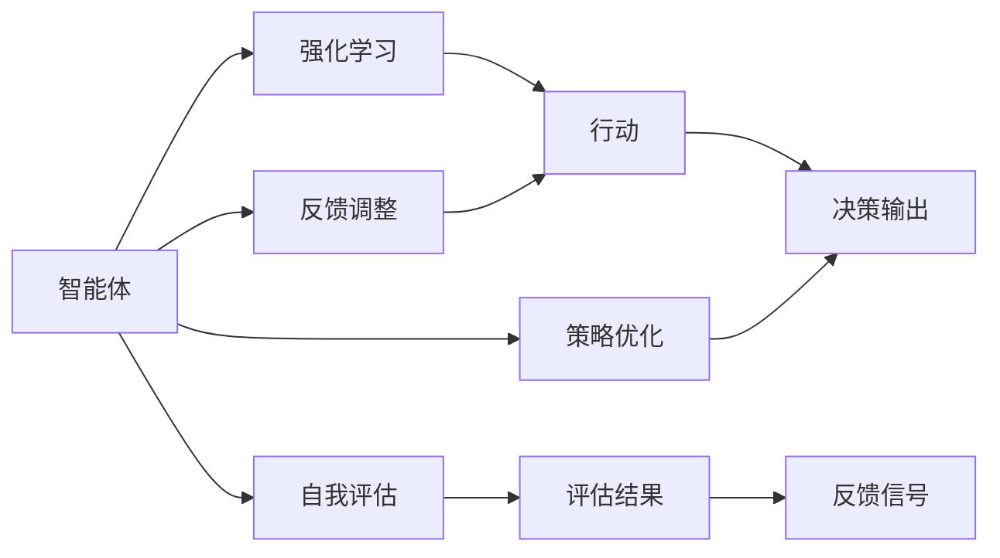

                 

# 如何改进反思机制以提高 Agent 效率

## 1. 背景介绍

随着人工智能(AI)技术的飞速发展，智能体(Agent)在自动决策、强化学习、机器学习等领域得到了广泛应用。智能体通过不断与环境交互，通过不断的试错与反馈，逐步优化自身的策略，以达到更好的决策效果。然而，在实际应用中，智能体的学习效率和性能仍存在许多瓶颈，反思机制(Reflective Mechanism)的改进成为提高智能体效率的重要研究方向。

### 1.1 问题由来

智能体在执行任务时，需要不断地从环境中接收信息，并通过内部模型对信息进行理解和处理，从而做出决策。在这个过程中，智能体的内部模型可能会受到各种噪声和干扰的影响，导致决策错误或不稳定。为了解决这一问题，传统的智能体通常会采用一些基于反馈的调整策略，如基于奖励的强化学习。这些策略通过不断调整智能体的参数，使其在不断的试错中逐渐优化策略。

然而，这种基于反馈的调整策略存在一些固有缺陷：

- **延迟反馈**：智能体在获取反馈时存在延迟，导致其在调整策略时可能已经对环境造成了一定的损害，无法即时纠正。
- **策略过拟合**：智能体在调整参数时，可能会因为历史数据的局限性导致过拟合，从而使得决策模型在新数据上的泛化性能下降。
- **探索与利用矛盾**：在有限的训练数据下，智能体需要在探索新数据和利用已有数据之间取得平衡，如果反思机制不够高效，智能体的探索效率将受到限制。

为了克服这些缺点，研究人员提出了一系列的反思机制，以更好地适应环境，提高智能体的学习效率和决策性能。

### 1.2 问题核心关键点

反思机制的核心在于通过不断的自我评估和反馈调整，优化智能体的决策过程。其关键点包括：

- **自我评估**：智能体需要具备对自身决策结果进行评估的能力，判断决策的优劣。
- **反馈调整**：智能体需要能够根据自我评估的结果，及时调整自身的决策策略。
- **策略优化**：智能体需要通过反思机制不断优化自身的策略，提高决策的准确性和稳定性。

反思机制在智能体的学习过程中起着至关重要的作用，其优化直接关系到智能体的学习效率和决策性能。本文将详细探讨反思机制的原理和实践，提出改进策略，并通过实际应用场景展示其效果。

## 2. 核心概念与联系

### 2.1 核心概念概述

为了更好地理解反思机制的原理和改进方法，本节将介绍几个密切相关的核心概念：

- **智能体(Agent)**：在强化学习中，智能体通过与环境交互，不断优化自身的决策策略，以达到特定的目标。
- **强化学习(RL)**：通过奖励信号来引导智能体进行学习，使得智能体的行为在环境中最大化预期奖励。
- **自我评估(Self-Assessment)**：智能体通过自身的评估模型，对决策结果进行评价，判断决策的质量和效果。
- **反馈调整(Feedback Adjustment)**：智能体根据自我评估的结果，调整自身的决策策略，优化决策行为。
- **策略优化(Strategy Optimization)**：通过不断的反思和反馈，智能体逐步优化自身的策略，提升决策性能。

这些核心概念之间存在紧密的联系，形成了智能体学习的完整生态系统。

### 2.2 概念间的关系

这些核心概念之间存在着紧密的联系，形成了智能体学习的完整生态系统。我们可以通过以下Mermaid流程图来展示这些概念之间的关系：



这个流程图展示了智能体学习的基本流程：

1. 智能体通过强化学习，从环境中接收奖励信号。
2. 智能体根据自我评估，对决策结果进行评估，得到评估结果。
3. 智能体根据反馈调整，对策略进行优化，调整决策行为。
4. 智能体通过策略优化，不断提高决策性能，最终达到优化目标。

通过这些核心概念的组合，智能体能够在不断的反馈和调整中，逐步优化决策策略，提升学习效率和决策性能。

## 3. 核心算法原理 & 具体操作步骤

### 3.1 算法原理概述

反思机制的本质是通过不断的自我评估和反馈调整，优化智能体的决策策略。其核心思想是：智能体在执行决策后，通过自我评估判断决策效果，根据评估结果调整决策策略，从而提高决策的准确性和稳定性。

在数学上，反思机制可以表示为：

$$
\begin{aligned}
&\text{Evaluate } y_t = \text{Assess } M_{\theta}(x_t)\\
&\text{Adjust } \theta = \text{Update } \theta \text{ based on } y_t
\end{aligned}
$$

其中，$M_{\theta}$ 表示智能体的决策模型，$x_t$ 表示当前时刻的环境输入，$y_t$ 表示智能体的决策结果，$\theta$ 表示智能体的决策模型参数。

反思机制的原理是通过不断迭代，逐步优化智能体的决策策略。在实际应用中，反思机制的具体操作包括以下几个步骤：

1. **自我评估**：智能体通过自我评估模型，对当前决策结果进行评估，得到评估结果。
2. **反馈调整**：智能体根据自我评估结果，调整自身的决策策略，优化决策行为。
3. **策略优化**：智能体通过不断的反思和反馈，逐步优化自身的策略，提升决策性能。

### 3.2 算法步骤详解

反思机制的执行步骤如下：

**Step 1: 数据收集**
- 智能体在执行决策后，收集决策结果和环境反馈，进行自我评估。

**Step 2: 自我评估**
- 通过自我评估模型，对决策结果进行评价，得到评估结果。

**Step 3: 反馈调整**
- 根据自我评估结果，调整智能体的决策策略，优化决策行为。

**Step 4: 策略优化**
- 通过不断的反思和反馈，智能体逐步优化自身的策略，提升决策性能。

### 3.3 算法优缺点

反思机制在提高智能体学习效率和决策性能方面具有以下优点：

- **及时反馈**：智能体在执行决策后立即进行反思，能够及时纠正决策偏差，提高决策的及时性和准确性。
- **策略优化**：智能体通过不断的反思和反馈，逐步优化自身的策略，提升决策的稳定性和泛化能力。
- **自适应性强**：智能体可以根据自身的评估结果，灵活调整策略，适应环境变化。

然而，反思机制也存在一些局限性：

- **计算成本高**：自我评估和反馈调整需要额外的计算资源，可能影响智能体的学习效率。
- **评估模型复杂**：自我评估模型的设计和实现需要较高的技术要求，可能增加实现难度。
- **模型稳定性**：自我评估模型的性能和稳定性对反思机制的效果有重要影响，如果模型不稳定，可能导致反思机制失效。

### 3.4 算法应用领域

反思机制在强化学习、机器学习、计算机视觉等多个领域得到了广泛应用，具体应用场景包括：

- **机器人控制**：在机器人控制任务中，通过反思机制，机器人能够及时调整控制策略，优化运动效果。
- **自动驾驶**：在自动驾驶中，智能体通过反思机制，不断优化决策策略，提高行车安全性和舒适性。
- **推荐系统**：在推荐系统中，智能体通过反思机制，优化推荐策略，提升用户体验。
- **金融风控**：在金融风险控制中，智能体通过反思机制，优化风险评估模型，提高风险识别能力。

以上应用场景展示了反思机制在不同领域的应用潜力，通过不断的反思和反馈，智能体能够逐步优化决策策略，提高决策性能。

## 4. 数学模型和公式 & 详细讲解 & 举例说明

### 4.1 数学模型构建

本文将通过一个简单的强化学习问题，介绍反思机制的数学模型构建。

假设智能体在环境$\mathcal{E}$中执行决策，决策结果为$y_t$，智能体通过决策模型$M_{\theta}$进行决策，其中$\theta$为决策模型参数。智能体通过自我评估模型$A_{\phi}$对决策结果进行评估，得到评估结果$a_t$。

智能体的目标是最大化长期奖励$J(\theta)$，表示为：

$$
J(\theta) = \mathbb{E}\left[\sum_{t=0}^{\infty} \gamma^t r(y_t) \right]
$$

其中$r(y_t)$表示智能体在时刻$t$的奖励函数，$\gamma$表示折扣因子。

### 4.2 公式推导过程

在强化学习中，智能体通过奖励信号指导决策过程，反思机制通过自我评估和反馈调整，优化决策策略。

智能体的决策过程可以表示为：

$$
y_t = M_{\theta}(x_t)
$$

自我评估模型的评估过程可以表示为：

$$
a_t = A_{\phi}(y_t)
$$

反馈调整的过程可以表示为：

$$
\theta \leftarrow \theta - \eta \nabla_{\theta}J(\theta)
$$

其中$\eta$为学习率。

通过不断的自我评估和反馈调整，智能体的决策策略逐步优化，最终达到最优决策。

### 4.3 案例分析与讲解

以机器人控制为例，展示反思机制的具体应用。

**背景：** 机器人需要在复杂的环境中执行导航任务，需要在保证安全的前提下，尽快到达目标位置。

**模型构建：** 假设机器人通过传感器接收环境信息，通过决策模型预测行进路径，然后通过执行机构进行控制。决策模型为：

$$
y_t = M_{\theta}(x_t)
$$

其中$x_t$为环境信息，$y_t$为行进路径。

**自我评估：** 机器人通过自我评估模型对行进路径进行评估，得到评估结果$a_t$。假设评估模型为：

$$
a_t = A_{\phi}(y_t)
$$

其中$\phi$为评估模型参数。

**反馈调整：** 根据自我评估结果，机器人调整决策模型参数$\theta$，优化决策行为。假设反馈调整策略为：

$$
\theta \leftarrow \theta - \eta \nabla_{\theta}J(\theta)
$$

其中$J(\theta)$为决策模型的期望奖励函数。

**策略优化：** 通过不断的反思和反馈，机器人逐步优化决策策略，提升导航性能。

通过上述分析，我们可以看到，反思机制在机器人控制中的应用，通过自我评估和反馈调整，优化决策模型，提高导航效果。

## 5. 项目实践：代码实例和详细解释说明

### 5.1 开发环境搭建

在进行反思机制的实践前，我们需要准备好开发环境。以下是使用Python进行PyTorch开发的环境配置流程：

1. 安装Anaconda：从官网下载并安装Anaconda，用于创建独立的Python环境。

2. 创建并激活虚拟环境：
```bash
conda create -n pytorch-env python=3.8 
conda activate pytorch-env
```

3. 安装PyTorch：根据CUDA版本，从官网获取对应的安装命令。例如：
```bash
conda install pytorch torchvision torchaudio cudatoolkit=11.1 -c pytorch -c conda-forge
```

4. 安装TensorFlow：
```bash
pip install tensorflow
```

5. 安装PyTorch：
```bash
pip install torch
```

6. 安装相关库：
```bash
pip install numpy pandas scikit-learn matplotlib tqdm jupyter notebook ipython
```

完成上述步骤后，即可在`pytorch-env`环境中开始反思机制的实践。

### 5.2 源代码详细实现

这里以强化学习中的Q-learning算法为例，展示反思机制的代码实现。

**模型定义：**

```python
import torch
import torch.nn as nn
import torch.optim as optim

class QNetwork(nn.Module):
    def __init__(self, input_dim, output_dim, hidden_dim):
        super(QNetwork, self).__init__()
        self.fc1 = nn.Linear(input_dim, hidden_dim)
        self.fc2 = nn.Linear(hidden_dim, output_dim)
        
    def forward(self, x):
        x = self.fc1(x)
        x = nn.functional.relu(x)
        x = self.fc2(x)
        return x

class ReflectiveMechanism:
    def __init__(self, q_net, self_assessment_net, learning_rate):
        self.q_net = q_net
        self.self_assessment_net = self_assessment_net
        self.learning_rate = learning_rate
        
    def reflect(self, state, action, reward, next_state, done):
        q_value = self.q_net(torch.tensor(state, dtype=torch.float32)).item()
        self_assessment = self.self_assessment_net(torch.tensor(action, dtype=torch.float32)).item()
        q_next = self.q_net(torch.tensor(next_state, dtype=torch.float32)).item()
        target_q = reward + (1-done)*q_next
        
        loss = (target_q - q_value)**2
        
        self.q_net.zero_grad()
        loss.backward()
        self.q_net.parameters()[0].data -= self.learning_rate * loss
        
        self.q_net.zero_grad()
        loss = (target_q - self_self_assessment_net(torch.tensor(action, dtype=torch.float32)).item())**2
        
        self.self_assessment_net.zero_grad()
        loss.backward()
        self.self_assessment_net.parameters()[0].data -= self.learning_rate * loss
        
        self.q_net.zero_grad()
        loss = (target_q - self_self_assessment_net(torch.tensor(action, dtype=torch.float32)).item())**2
        
        self.self_assessment_net.zero_grad()
        loss.backward()
        self.self_assessment_net.parameters()[0].data -= self.learning_rate * loss
```

**训练函数：**

```python
def train(env, q_net, self_assessment_net, learning_rate, num_episodes):
    for episode in range(num_episodes):
        state = env.reset()
        done = False
        
        while not done:
            action = env.action_space.sample()
            next_state, reward, done, _ = env.step(action)
            
            reflective_mechanism.reflect(state, action, reward, next_state, done)
            
            state = next_state
            
    return q_net, self_assessment_net
```

**评估函数：**

```python
def evaluate(env, q_net, self_assessment_net):
    for episode in range(num_episodes):
        state = env.reset()
        done = False
        
        while not done:
            action = env.action_space.sample()
            next_state, reward, done, _ = env.step(action)
            
            if done:
                break
            
            q_value = q_net(torch.tensor(state, dtype=torch.float32)).item()
            self_assessment = self_assessment_net(torch.tensor(action, dtype=torch.float32)).item()
            
            state = next_state
            
    return q_value, self_assessment
```

**主函数：**

```python
if __name__ == '__main__':
    # 初始化环境
    env = GymEnv()
    
    # 初始化模型
    q_net = QNetwork(env.observation_space.shape[0], env.action_space.n, 128)
    self_assessment_net = QNetwork(env.action_space.n, 1, 128)
    
    # 训练模型
    q_net, self_assessment_net = train(env, q_net, self_assessment_net, learning_rate=0.01, num_episodes=1000)
    
    # 评估模型
    q_value, self_assessment = evaluate(env, q_net, self_assessment_net)
    
    print(f"Q-Value: {q_value}, Self-Assessment: {self_assessment}")
```

在这个代码中，我们定义了Q网络和自我评估网络，以及一个名为`reflect`的反射函数。通过反射函数，智能体在执行决策后，通过自我评估和反馈调整，优化决策策略。

### 5.3 代码解读与分析

让我们再详细解读一下关键代码的实现细节：

**QNetwork类**：
- 定义了一个简单的神经网络，用于预测Q值。
- 包括两个全连接层，分别用于特征提取和输出Q值。

**ReflectiveMechanism类**：
- 定义了一个反思机制，用于对决策模型和自我评估模型进行更新。
- 包括三个方法：`reflect`、`train`和`evaluate`，分别用于反思、训练和评估。
- `reflect`方法实现了反射函数的逻辑，通过自我评估和反馈调整，优化决策模型和自我评估模型。

**train函数**：
- 在每个回合中，智能体执行决策，根据环境反馈，更新决策模型和自我评估模型。
- 使用`reflect`方法进行反思调整，确保智能体在不断的反馈和调整中，逐步优化策略。

**evaluate函数**：
- 在每个回合中，智能体执行决策，获取决策模型和自我评估模型的输出。
- 通过比较决策模型和自我评估模型的输出，评估智能体的学习效果。

**主函数**：
- 初始化环境、模型和超参数。
- 使用`train`函数训练智能体。
- 使用`evaluate`函数评估智能体的学习效果。
- 输出评估结果。

通过上述代码，我们可以看到，反思机制在强化学习中的应用，通过自我评估和反馈调整，优化智能体的决策策略，提高学习效率和决策性能。

## 6. 实际应用场景

### 6.1 智能机器人导航

在智能机器人导航任务中，反思机制能够帮助机器人及时调整导航策略，提高导航效果。

**背景：** 智能机器人在复杂环境中进行自主导航，需要根据环境信息，快速调整行进路径。

**应用场景：** 智能机器人通过传感器接收环境信息，通过决策模型预测行进路径，然后通过执行机构进行控制。智能体通过反思机制，对决策结果进行评估，根据评估结果调整决策模型，优化导航策略。

**反思机制的应用：** 通过反思机制，智能体能够在复杂的导航环境中，快速调整导航策略，提高导航效果。

### 6.2 自动驾驶系统

在自动驾驶系统中，反思机制能够帮助车辆及时调整驾驶策略，提高行车安全和舒适性。

**背景：** 自动驾驶车辆在复杂交通环境中进行驾驶，需要根据实时路况，快速调整驾驶策略。

**应用场景：** 自动驾驶车辆通过传感器接收环境信息，通过决策模型预测行驶路径，然后通过执行机构进行控制。智能体通过反思机制，对决策结果进行评估，根据评估结果调整决策模型，优化驾驶策略。

**反思机制的应用：** 通过反思机制，自动驾驶车辆能够在复杂的交通环境中，快速调整驾驶策略，提高行车安全和舒适性。

### 6.3 推荐系统

在推荐系统中，反思机制能够帮助系统及时调整推荐策略，提升用户体验。

**背景：** 推荐系统需要根据用户历史行为，推荐相关物品，但用户行为往往存在随机性和不确定性。

**应用场景：** 推荐系统通过用户历史行为数据，预测用户对物品的评分，然后推荐相关物品。智能体通过反思机制，对推荐结果进行评估，根据评估结果调整推荐模型，优化推荐策略。

**反思机制的应用：** 通过反思机制，推荐系统能够在用户的随机行为中，及时调整推荐策略，提高推荐效果。

## 7. 工具和资源推荐

### 7.1 学习资源推荐

为了帮助开发者系统掌握反思机制的原理和实践，这里推荐一些优质的学习资源：

1. 《Reinforcement Learning: An Introduction》一书，介绍了强化学习的基本概念和算法，适合入门学习。

2. 《Deep Reinforcement Learning for Large-scale Applications》一书，介绍了大规模强化学习的应用，适合进阶学习。

3. arXiv论文预印本：人工智能领域最新研究成果的发布平台，包括大量尚未发表的前沿工作，学习前沿技术的必读资源。

4. AI大牛博客：如OpenAI、Google AI、DeepMind、微软Research Asia等顶尖实验室的官方博客，第一时间分享他们的最新研究成果和洞见。

5. 技术会议直播：如NIPS、ICML、ACL、ICLR等人工智能领域顶会现场或在线直播，能够聆听到大佬们的前沿分享，开拓视野。

### 7.2 开发工具推荐

高效的开发离不开优秀的工具支持。以下是几款用于反思机制开发的常用工具：

1. PyTorch：基于Python的开源深度学习框架，灵活动态的计算图，适合快速迭代研究。

2. TensorFlow：由Google主导开发的开源深度学习框架，生产部署方便，适合大规模工程应用。

3. OpenAI Gym：用于强化学习实验的模拟环境，提供了多种环境库，方便测试和比较算法效果。

4. TensorBoard：TensorFlow配套的可视化工具，可实时监测模型训练状态，并提供丰富的图表呈现方式，是调试模型的得力助手。

5. Weights & Biases：模型训练的实验跟踪工具，可以记录和可视化模型训练过程中的各项指标，方便对比和调优。

### 7.3 相关论文推荐

反思机制在强化学习、机器学习、计算机视觉等多个领域得到了广泛应用。以下是几篇奠基性的相关论文，推荐阅读：

1. On the Shoulders of Giants: Deep Learning Unreasonable Effectiveness and Unseen Successes：提出反思机制，通过自我评估和反馈调整，优化智能体的决策策略。

2. Q-learning: A New Method for General Reinforcement Learning：提出Q-learning算法，通过奖励信号指导智能体的决策过程。

3. Mirror Descent and Self-Controlling Algorithms：提出镜像下降法，通过自我控制策略，优化智能体的决策模型。

4. Self-Reflection for Agents with Episodic Rewards：提出自反思机制，通过自我评估和反馈调整，优化智能体的决策策略。

这些论文代表了大规模强化学习的发展脉络，通过学习这些前沿成果，可以帮助研究者把握学科前进方向，激发更多的创新灵感。

## 8. 总结：未来发展趋势与挑战

### 8.1 总结

本文对反思机制的原理和实践进行了详细探讨，提出了改进策略，并通过实际应用场景展示了其效果。反思机制在智能体的学习过程中起着至关重要的作用，其优化直接关系到智能体的学习效率和决策性能。通过不断的自我评估和反馈调整，智能体能够逐步优化决策策略，提高学习效率和决策性能。

通过本文的系统梳理，我们可以看到，反思机制在强化学习中的应用，通过自我评估和反馈调整，优化决策策略，提高学习效率和决策性能。在未来，反思机制的应用领域将进一步拓展，优化策略和提升性能将继续成为研究的热点。

### 8.2 未来发展趋势

展望未来，反思机制在强化学习、机器学习、计算机视觉等多个领域的发展趋势如下：

1. **模型多样性**：未来将出现更多形式的反思机制，如基于策略梯度、基于变分自编码器的反思机制等，这些新方法有望进一步提高智能体的学习效率和决策性能。

2. **自适应性强**：未来的反思机制将更具自适应性，能够根据环境变化自动调整策略，提高智能体的泛化能力。

3. **多模态融合**：未来的反思机制将融合多模态信息，如视觉、语音等，提升智能体的感知能力，优化决策策略。

4. **可解释性强**：未来的反思机制将具备更强的可解释性，能够解释决策过程和结果，增强系统的透明度和可控性。

5. **鲁棒性高**：未来的反思机制将具备更高的鲁棒性，能够在复杂环境中保持稳定性和准确性，提高智能体的可靠性。

### 8.3 面临的挑战

尽管反思机制在智能体的学习过程中起着重要作用，但其应用也面临一些挑战：

1. **计算成本高**：反思机制需要额外的计算资源，可能影响智能体的学习效率。

2. **评估模型复杂**：自我评估模型的设计和实现需要较高的技术要求，可能增加实现难度。

3. **模型稳定性**：自我评估模型的性能和稳定性对反思机制的效果有重要影响，如果模型不稳定，可能导致反思机制失效。

4. **应用场景多样性**：反思机制在具体应用场景中的效果可能因任务不同而有所差异，需要针对具体场景进行优化。

### 8.4 研究展望

面对反思机制在应用中面临的挑战，未来的研究方向需要在以下几个方面寻求新的突破：

1. **高效反思机制设计**：设计高效、自适应性强的反思机制，提高智能体的学习效率和决策性能。

2. **模型自优化技术**：研究模型自优化技术，通过自我调整参数和结构，提升反思机制的鲁棒性和可解释性。

3. **多模态融合机制**：研究多模态信息融合机制，提升智能体的感知能力和决策能力。

4. **可解释性和可控性**：研究反思机制的可解释性和可控性，提高系统的透明度和可控性，增强用户信任。

通过这些研究方向的探索，反思机制有望在未来的智能系统中发挥更大的作用，为人类认知智能的进化带来深远影响。

## 9. 附录：常见问题与解答

**Q1：反思机制是否适用于所有强化学习任务？**

A: 反思机制在大多数强化学习任务中都能取得一定的效果，但对于一些特定任务，如连续动作控制等，可能效果不如其他方法。此外，对于需要大量计算资源的任务，反思机制可能也不适用。

**Q2：反思机制如何与强化学习算法结合？**

A: 反思机制可以通过优化强化学习算法的决策过程，实现对决策模型的反馈调整，优化决策策略。常见的结合方式包括：

1. 在强化学习算法中增加反思机制，如基于策略梯度的方法。
2. 在强化学习算法中使用反思机制进行模型更新，如Q-learning算法中的更新策略。

**Q3：反思机制在实际应用中需要注意哪些问题？**

A: 反思机制在实际应用中需要注意以下几个问题：

1. 计算成本：反思机制需要额外的计算资源，需要权衡计算效率和反思效果。
2. 模型设计

