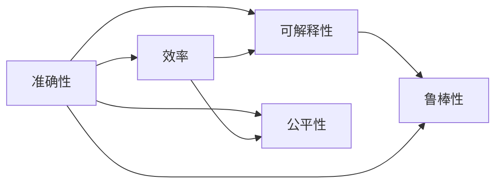

                 

# 如何评估AI系统的性能

## 1. 背景介绍

在人工智能（AI）系统的设计和开发过程中，评估系统性能是一个至关重要的环节。有效的评估可以确保系统满足业务需求，提高用户体验，同时帮助团队识别改进的方向和优化点。然而，随着AI技术的快速发展，如何准确、全面地评估系统的性能成为了一个亟待解决的问题。

### 1.1 问题由来

近年来，人工智能领域涌现出了大量的研究成果和应用，如深度学习、自然语言处理（NLP）、计算机视觉等。这些技术的成功应用极大地提升了系统性能，但也带来了新的挑战。例如，如何衡量模型的泛化能力，如何评估系统的实时响应能力，如何度量系统的准确性和可靠性等。这些问题都需要系统的评估方法来回答。

### 1.2 问题核心关键点

评估AI系统的性能涉及多个方面，包括准确性、效率、可解释性、公平性、鲁棒性等。为了全面评估系统的性能，需要从多个角度进行考虑。

1. **准确性**：系统输出是否与真实结果相匹配。
2. **效率**：系统运行是否高效，响应时间是否合理。
3. **可解释性**：系统的决策过程是否透明、可理解。
4. **公平性**：系统是否对所有用户公平，是否存在偏见。
5. **鲁棒性**：系统对噪声、异常数据、攻击等是否有较强的抗干扰能力。

这些关键点构成了评估AI系统性能的基础，但也需要根据具体应用场景进行选择和调整。

## 2. 核心概念与联系

### 2.1 核心概念概述

为了更好地理解AI系统性能评估的方法和原理，本节将介绍几个密切相关的核心概念：

- **准确性（Accuracy）**：模型预测结果与真实结果的匹配程度。通常用分类正确的样本数除以总样本数来表示。

- **效率（Efficiency）**：系统资源消耗和运行时间。可以通过计算时间复杂度和空间复杂度来评估。

- **可解释性（Interpretability）**：模型决策过程的透明性和可理解性。可解释性高的模型更易于调试和维护。

- **公平性（Fairness）**：模型是否对所有类别或用户公平。

- **鲁棒性（Robustness）**：模型对输入数据的扰动和变化的鲁棒性。

这些概念之间存在着紧密的联系，共同构成了AI系统性能评估的核心。通过深入理解这些概念，可以更好地选择和设计评估指标，进行系统的全面评估。

### 2.2 概念间的关系

这些核心概念之间存在着相互依赖和制约的关系，如图示：



这个流程图展示了各个概念之间的相互作用和影响：

1. **准确性**对**效率**和**可解释性**有直接影响。通常情况下，高准确性的模型需要更多的计算资源和时间，降低效率。同时，复杂模型的可解释性往往较低。
2. **效率**对**准确性**和**鲁棒性**有间接影响。高效的模型往往牺牲了一定的准确性和鲁棒性。
3. **公平性**与**准确性**和**鲁棒性**密切相关。公平的模型需要在不同类别或用户之间保持一致的准确性和鲁棒性。
4. **可解释性**和**公平性**对**鲁棒性**有间接影响。可解释性高的模型更容易检测和纠正偏见，提高鲁棒性。

这些概念的相互关系使得AI系统性能评估变得更加复杂，需要综合考虑多个因素进行全面评估。

## 3. 核心算法原理 & 具体操作步骤
### 3.1 算法原理概述

AI系统性能评估的原理可以总结为以下几点：

1. **数据驱动评估**：通过在实际应用场景中收集数据，利用统计学和机器学习方法进行评估。
2. **基准测试**：使用标准化的基准测试集和评估指标进行系统性能比较。
3. **模型评估**：分析模型在各种条件下的性能表现，如训练数据、测试数据、噪声数据等。
4. **用户反馈**：收集用户反馈和实际使用情况，评估系统的实用性和用户体验。

这些评估方法需要根据具体应用场景进行选择和组合，以确保评估的全面性和准确性。

### 3.2 算法步骤详解

AI系统性能评估一般包括以下几个关键步骤：

1. **数据准备**：收集和整理用于评估的数据集，包括训练集、测试集、验证集等。
2. **模型训练和测试**：在训练集上训练模型，在测试集上进行性能评估。
3. **指标计算**：根据具体的评估指标计算模型的性能得分。
4. **分析和优化**：分析评估结果，识别系统性能瓶颈，提出优化建议。
5. **持续监控**：在系统部署后，持续监控系统性能，及时调整和优化。

这些步骤需要系统地进行，确保评估的全面性和准确性。

### 3.3 算法优缺点

AI系统性能评估方法有以下优缺点：

**优点**：
1. 数据驱动：评估结果基于实际数据，更具可信度。
2. 标准化：使用基准测试集和标准化评估指标，便于比较和优化。
3. 可扩展：评估方法和工具可以适应多种应用场景。

**缺点**：
1. 数据依赖：评估结果依赖于数据的质量和数量。
2. 复杂度高：评估过程涉及多个指标和方法，需要综合考虑。
3. 难以解释：部分评估方法难以直观理解，需要专业知识。

尽管存在这些局限，AI系统性能评估仍然是推动AI技术发展和应用的重要手段。未来，随着技术的发展和工具的进步，评估方法将变得更加高效和易于使用。

### 3.4 算法应用领域

AI系统性能评估方法广泛应用于多个领域，例如：

- **自然语言处理（NLP）**：评估模型的分类准确性、可解释性和公平性。
- **计算机视觉（CV）**：评估模型的识别准确性、鲁棒性和效率。
- **推荐系统**：评估模型的个性化推荐效果、效率和可解释性。
- **医疗诊断**：评估模型的诊断准确性、鲁棒性和公平性。

这些领域的应用表明，AI系统性能评估方法具有广泛的适用性，是推动AI技术落地应用的重要工具。

## 4. 数学模型和公式 & 详细讲解  
### 4.1 数学模型构建

AI系统性能评估的数学模型可以表示为：

$$
\text{评估结果} = f(\text{数据集}, \text{模型}, \text{评估指标})
$$

其中：
- **数据集**：用于评估的训练集、测试集和验证集。
- **模型**：被评估的AI系统，如分类器、回归器、推荐系统等。
- **评估指标**：衡量系统性能的各项指标，如准确性、效率、公平性等。

### 4.2 公式推导过程

以分类问题为例，分类准确性可以用混淆矩阵（Confusion Matrix）来表示：

$$
\begin{pmatrix}
    TP & FN \\
    FP & TN
\end{pmatrix}
$$

其中：
- **TP**：真阳性，表示模型正确预测的正例数。
- **FN**：假阴性，表示实际为正但模型预测为负的样本数。
- **FP**：假阳性，表示实际为负但模型预测为正的样本数。
- **TN**：真阴性，表示实际为负且模型预测为负的样本数。

分类准确性可以表示为：

$$
\text{Accuracy} = \frac{TP + TN}{TP + TN + FP + FN}
$$

### 4.3 案例分析与讲解

以推荐系统为例，推荐准确性可以用召回率和精度的调和平均值（Harmonic Mean of Precision and Recall, HPR）来表示：

$$
\text{HPR} = \frac{2 \times \text{Precision} \times \text{Recall}}{\text{Precision} + \text{Recall}}
$$

其中：
- **Precision**：精确率，表示推荐的相关样本占推荐样本总数的比例。
- **Recall**：召回率，表示实际的相关样本占所有相关样本的比例。

评估指标的选择需要根据具体应用场景进行，如NLP任务可能更关注准确性和可解释性，推荐系统可能更关注召回率和用户满意度。

## 5. 项目实践：代码实例和详细解释说明
### 5.1 开发环境搭建

在进行AI系统性能评估前，需要先准备好开发环境。以下是使用Python进行TensorFlow和PyTorch开发的环境配置流程：

1. 安装Anaconda：从官网下载并安装Anaconda，用于创建独立的Python环境。

2. 创建并激活虚拟环境：
```bash
conda create -n pyenv python=3.8 
conda activate pyenv
```

3. 安装TensorFlow：根据CUDA版本，从官网获取对应的安装命令。例如：
```bash
conda install tensorflow tensorflow-gpu -c conda-forge
```

4. 安装PyTorch：根据CUDA版本，从官网获取对应的安装命令。例如：
```bash
conda install pytorch torchvision torchaudio cudatoolkit=11.1 -c pytorch -c conda-forge
```

5. 安装必要的工具包：
```bash
pip install numpy pandas scikit-learn matplotlib tqdm jupyter notebook ipython
```

完成上述步骤后，即可在`pyenv`环境中开始评估实践。

### 5.2 源代码详细实现

这里以推荐系统为例，展示如何使用TensorFlow进行性能评估。

首先，定义推荐系统模型：

```python
import tensorflow as tf
from tensorflow.keras import layers

model = tf.keras.Sequential([
    layers.Dense(64, activation='relu', input_shape=(10,)),
    layers.Dense(10, activation='softmax')
])
```

然后，定义评估函数：

```python
def evaluate(model, dataset):
    loss_fn = tf.keras.losses.SparseCategoricalCrossentropy()
    accuracy_fn = tf.keras.metrics.SparseCategoricalAccuracy()
    
    for x, y in dataset:
        with tf.GradientTape() as tape:
            logits = model(x)
            loss = loss_fn(y, logits)
        gradients = tape.gradient(loss, model.trainable_variables)
        optimizer.apply_gradients(zip(gradients, model.trainable_variables))
        accuracy_fn.update_state(y, logits)
    
    return accuracy_fn.result().numpy()
```

最后，启动评估流程：

```python
dataset = ...
accuracy = evaluate(model, dataset)
print(f"Accuracy: {accuracy}")
```

以上就是使用TensorFlow进行推荐系统性能评估的完整代码实现。可以看到，TensorFlow提供了丰富的评估工具和接口，可以轻松实现各种评估指标的计算。

### 5.3 代码解读与分析

让我们再详细解读一下关键代码的实现细节：

**定义模型**：
- 使用`Sequential`模型定义简单的推荐模型，包含一个全连接层和一个softmax输出层。

**定义评估函数**：
- 定义损失函数`SparseCategoricalCrossentropy`和准确率评估函数`SparseCategoricalAccuracy`。
- 在每次迭代中，使用梯度下降更新模型参数，计算损失和准确率。

**启动评估流程**：
- 在数据集上调用`evaluate`函数，计算推荐系统的准确率。

可以看到，TensorFlow提供了便捷的评估接口和工具，可以轻松实现各种评估指标的计算。这使得开发者能够更专注于模型优化和应用实现，而不必过多关注底层评估过程。

### 5.4 运行结果展示

假设我们在一个简单的推荐数据集上进行评估，最终得到准确率为0.8，表示模型在推荐相关样本方面的表现较好。

## 6. 实际应用场景
### 6.1 智能客服系统

智能客服系统需要实时响应用户查询，准确性和效率是关键指标。可以通过收集用户反馈和系统日志，计算响应时间和准确率，进行系统评估和优化。

### 6.2 金融舆情监测

金融舆情监测系统需要实时分析社交媒体和新闻，评估模型的召回率和准确性，检测和预警潜在的风险。

### 6.3 个性化推荐系统

推荐系统需要评估个性化推荐的效果和效率，通过收集用户反馈和行为数据，计算召回率和用户满意度，进行系统优化。

### 6.4 未来应用展望

未来，AI系统性能评估将结合更多的技术和工具，如自动化测试、机器学习调参、A/B测试等，进行更全面、更自动化的评估。同时，评估方法将更加注重系统的鲁棒性和可解释性，确保系统的稳定性和可理解性。

## 7. 工具和资源推荐
### 7.1 学习资源推荐

为了帮助开发者系统掌握AI系统性能评估的理论基础和实践技巧，这里推荐一些优质的学习资源：

1. **TensorFlow官方文档**：提供了丰富的评估工具和接口，详细介绍了各种评估指标的计算方法。

2. **PyTorch官方文档**：介绍了多种评估方法和工具，包括准确性、效率、可解释性等。

3. **Coursera《深度学习专项课程》**：由斯坦福大学和DeepMind等顶尖机构开设的课程，系统讲解了深度学习的基础知识和评估方法。

4. **Kaggle竞赛平台**：提供了丰富的数据集和评估任务，帮助开发者实践和提升评估技能。

5. **AISTATS和ICML等顶级会议论文**：收录了大量的AI系统评估方法和研究进展，是学习前沿技术的必读资源。

通过这些资源的学习实践，相信你一定能够快速掌握AI系统性能评估的精髓，并用于解决实际的评估问题。

### 7.2 开发工具推荐

高效的评估离不开优秀的工具支持。以下是几款用于AI系统性能评估开发的常用工具：

1. **TensorFlow**：提供丰富的评估工具和接口，支持多种评估指标的计算。

2. **PyTorch**：提供了简单易用的评估函数和工具，支持多种评估指标的计算。

3. **Scikit-learn**：提供了多种机器学习评估工具，如准确率、召回率、AUC等。

4. **Numpy**：提供了高效的数值计算工具，支持大规模数据处理和评估。

5. **Matplotlib和Seaborn**：提供了丰富的数据可视化工具，支持评估结果的展示和分析。

合理利用这些工具，可以显著提升AI系统性能评估的效率和准确性，加快创新迭代的步伐。

### 7.3 相关论文推荐

AI系统性能评估技术的发展源于学界的持续研究。以下是几篇奠基性的相关论文，推荐阅读：

1. **《Evaluation of Machine Learning Algorithms: A Comparative Study》**：比较了多种机器学习算法的评估方法，提供了全面的评估指南。

2. **《Understanding Machine Learning: From Theory to Algorithms》**：介绍了机器学习的基础知识和评估方法，适合初学者学习。

3. **《A Survey on the Evaluation of Machine Learning Models》**：综述了机器学习模型的评估方法，提供了丰富的评估工具和指标。

4. **《The Impact of Data Quality on Machine Learning》**：探讨了数据质量对机器学习评估的影响，提供了数据评估的方法和工具。

5. **《Robustness Assessment of Deep Neural Networks》**：介绍了深度神经网络的鲁棒性评估方法，提供了实用的评估工具和指标。

这些论文代表了AI系统性能评估技术的发展脉络，是学习前沿技术的必读资源。

除上述资源外，还有一些值得关注的前沿资源，帮助开发者紧跟AI系统性能评估技术的最新进展，例如：

1. **arXiv论文预印本**：人工智能领域最新研究成果的发布平台，包括大量尚未发表的前沿工作，学习前沿技术的必读资源。

2. **GitHub热门项目**：在GitHub上Star、Fork数最多的AI评估项目，往往代表了该技术领域的发展趋势和最佳实践，值得去学习和贡献。

3. **AI会议直播**：如NeurIPS、ICML、CVPR等人工智能领域顶会现场或在线直播，能够聆听到大佬们的前沿分享，开拓视野。

4. **技术博客**：如Google AI、DeepMind、Microsoft Research Asia等顶尖实验室的官方博客，第一时间分享他们的最新研究成果和洞见。

5. **开源软件包**：如TensorFlow、PyTorch等深度学习框架，提供了丰富的评估工具和接口，支持多种评估指标的计算。

总之，对于AI系统性能评估技术的学习和实践，需要开发者保持开放的心态和持续学习的意愿。多关注前沿资讯，多动手实践，多思考总结，必将收获满满的成长收益。

## 8. 总结：未来发展趋势与挑战
### 8.1 总结

本文对AI系统性能评估方法进行了全面系统的介绍。首先阐述了AI系统性能评估的重要性，明确了评估的多个关键指标。其次，从原理到实践，详细讲解了AI系统性能评估的数学模型和计算方法，给出了性能评估的完整代码实例。同时，本文还探讨了AI系统性能评估在多个领域的应用前景，展示了评估范式的广泛适用性。最后，推荐了多个学习资源、开发工具和相关论文，帮助读者深入理解评估方法，掌握评估技巧。

通过本文的系统梳理，可以看到，AI系统性能评估技术正在成为AI技术设计和应用的重要组成部分，极大地提升了系统的可靠性和实用性。未来，随着技术的进步和工具的完善，评估方法将变得更加高效和全面，为AI技术的落地应用提供更坚实的保障。

### 8.2 未来发展趋势

展望未来，AI系统性能评估技术将呈现以下几个发展趋势：

1. **自动化评估**：随着自动化测试和机器学习调参技术的发展，AI系统性能评估将变得更加自动化和智能化。

2. **多指标评估**：未来的评估方法将更加注重系统的鲁棒性、可解释性和用户满意度，涵盖更多的评估指标。

3. **动态评估**：通过持续监控和反馈机制，实现动态评估，及时调整和优化系统。

4. **跨领域评估**：将AI系统性能评估方法应用到更多领域，如医疗、金融、教育等，提升各行业的AI技术应用水平。

5. **模型可解释性**：未来的评估方法将更加注重模型的可解释性，提升系统的透明性和可理解性。

6. **数据质量评估**：评估模型对数据质量的敏感性，确保系统在各种数据分布下的稳定性。

以上趋势表明，AI系统性能评估技术正在逐步走向成熟，将成为推动AI技术发展的重要手段。

### 8.3 面临的挑战

尽管AI系统性能评估技术已经取得了显著进展，但仍面临诸多挑战：

1. **数据质量**：评估结果依赖于数据的质量和数量，数据偏差和噪声可能影响评估的准确性。

2. **模型复杂性**：复杂模型和高维数据增加了评估的复杂度，需要更高效和精确的评估方法。

3. **可解释性**：部分评估方法难以直观理解，需要专业知识和技术工具。

4. **资源限制**：评估过程需要大量的计算资源和时间，资源瓶颈可能限制评估的规模和速度。

5. **实时性要求**：实时系统需要快速评估和反馈，对评估方法和工具提出了更高的要求。

6. **公平性问题**：评估方法需要避免偏见和歧视，确保系统公平性。

这些挑战需要通过持续的技术创新和优化来解决，才能进一步提升AI系统性能评估的准确性和实用性。

### 8.4 研究展望

未来，需要在以下几个方面进行研究探索：

1. **自动化评估工具**：开发更加高效、易用的自动化评估工具，降低评估难度和成本。

2. **多指标评估方法**：探索综合评估方法，涵盖准确性、效率、鲁棒性、公平性等多个指标。

3. **动态评估框架**：研究动态评估方法，实时监控和优化系统性能。

4. **跨领域评估技术**：将评估技术应用到更多领域，提升各行业的AI技术应用水平。

5. **模型可解释性**：探索模型可解释性技术，提升系统的透明性和可理解性。

6. **数据质量评估**：研究数据质量对系统性能的影响，确保数据驱动评估的准确性。

这些研究方向的探索，必将引领AI系统性能评估技术迈向更高的台阶，为AI技术的落地应用提供更坚实的保障。

## 9. 附录：常见问题与解答

**Q1：AI系统性能评估有哪些常见的指标？**

A: AI系统性能评估常见的指标包括准确性（Accuracy）、召回率（Recall）、精确率（Precision）、F1分数（F1 Score）、AUC-ROC曲线（AUC-ROC）等。不同的应用场景需要根据具体需求选择适合的评估指标。

**Q2：如何理解AI系统的可解释性？**

A: AI系统的可解释性指的是模型决策过程的透明性和可理解性。可解释性高的模型更容易调试和维护，也更容易让用户理解和接受。可以通过可视化技术、规则提取、因果分析等方法提升模型的可解释性。

**Q3：如何选择适合AI系统的评估方法？**

A: 选择合适的评估方法需要考虑多个因素，包括应用场景、数据特点、模型复杂度等。例如，推荐系统可能更关注召回率和用户满意度，而金融舆情监测可能更关注准确性和鲁棒性。可以参考以下原则：

- 准确性：衡量模型预测结果与真实结果的匹配程度。
- 效率：衡量系统资源消耗和运行时间。
- 可解释性：衡量模型决策过程的透明性和可理解性。
- 鲁棒性：衡量模型对输入数据的扰动和变化的鲁棒性。
- 公平性：衡量模型对所有类别或用户是否公平。

根据具体需求选择合适的评估指标，并进行综合评估。

**Q4：如何处理AI系统的评估数据？**

A: 评估数据的处理需要考虑数据质量、数据分布、数据量等多个因素。常见的方法包括：

- 数据清洗：去除噪声、缺失值和异常值，提高数据质量。
- 数据增强：通过数据增强技术，扩充数据集，增加数据多样性。
- 数据划分：将数据划分为训练集、验证集和测试集，避免数据泄漏。
- 数据平衡：处理类别不平衡的数据，确保评估结果的公正性。

合理处理评估数据，可以有效提升评估的准确性和可靠性。

**Q5：AI系统性能评估的未来方向是什么？**

A: AI系统性能评估的未来方向包括：

- 自动化评估：开发更加高效、易用的自动化评估工具，降低评估难度和成本。
- 多指标评估：探索综合评估方法，涵盖准确性、效率、鲁棒性、公平性等多个指标。
- 动态评估：研究动态评估方法，实时监控和优化系统性能。
- 跨领域评估：将评估技术应用到更多领域，提升各行业的AI技术应用水平。
- 模型可解释性：探索模型可解释性技术，提升系统的透明性和可理解性。
- 数据质量评估：研究数据质量对系统性能的影响，确保数据驱动评估的准确性。

这些方向将推动AI系统性能评估技术的不断进步，为AI技术的落地应用提供更坚实的保障。

---

作者：禅与计算机程序设计艺术 / Zen and the Art of Computer Programming

