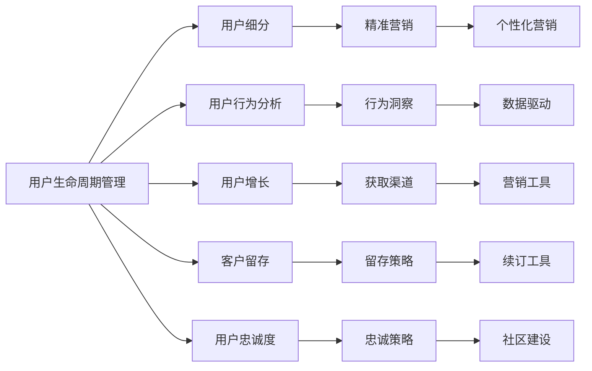

                 

# 如何进行有效的用户生命周期管理

> 关键词：用户生命周期管理, 数据分析, 用户细分, 用户行为分析, 用户增长, 客户留存, 用户忠诚度

## 1. 背景介绍

### 1.1 问题由来
在数字化转型的浪潮中，用户生命周期管理（User Lifecycle Management, ULM）已成为企业竞争的关键。通过深入了解和优化用户生命周期，企业能够显著提升用户体验，增加收入，并实现可持续发展。然而，用户在各个阶段的行为特征和需求差异显著，传统的数据分析和营销策略难以全面覆盖，导致资源浪费和用户流失。

### 1.2 问题核心关键点
有效的用户生命周期管理，离不开对用户行为的全面洞察和精准分析。核心关键点包括：

- 识别不同生命周期阶段的用户特征和需求
- 量化用户在不同阶段的行为变化和价值贡献
- 设计针对各阶段用户需求的营销策略和产品优化方案
- 通过持续的数据驱动反馈，动态调整策略

本博客将详细介绍如何在企业中高效实施用户生命周期管理，包括用户分群、行为分析、营销策略和持续优化等关键步骤。

### 1.3 问题研究意义
实施有效的用户生命周期管理，对于提升用户满意度、增加用户粘性、实现用户增长、优化营销效果和提升客户留存率具有重要意义。通过科学地管理用户生命周期，企业能够更好地理解用户需求，优化产品和服务，从而在竞争激烈的市场中脱颖而出。

## 2. 核心概念与联系

### 2.1 核心概念概述

为更好地理解用户生命周期管理，本节将介绍几个密切相关的核心概念：

- **用户生命周期管理（ULM）**：通过收集、分析用户数据，识别用户行为模式，制定针对不同生命周期阶段的策略，从而提升用户价值和忠诚度。
- **用户细分（User Segmentation）**：将用户群体按照特定的标准划分为多个子群体，以实现更精准的目标营销。
- **用户行为分析（User Behavior Analysis）**：通过数据挖掘和统计分析，洞察用户行为模式和趋势。
- **用户增长（User Acquisition）**：通过各种策略和工具，吸引和获取更多新用户。
- **客户留存（Customer Retention）**：通过优化用户体验和定制化服务，提高用户续订和复购率。
- **用户忠诚度（User Loyalty）**：通过持续的个性化服务和社区建设，增强用户对品牌或产品的长期依赖。

这些概念通过以下Mermaid流程图来展示：



这个流程图展示了几大核心概念之间的关系：

1. **用户生命周期管理**是整个框架的起点，涵盖用户分群、行为分析、用户增长、留存和忠诚度提升等多个方面。
2. **用户细分**是实现精准营销的基础，通过科学划分用户群体，可以设计更有效的营销策略。
3. **用户行为分析**通过洞察用户行为模式，提供数据支持，驱动营销和策略优化。
4. **用户增长**通过吸引新用户，扩大用户规模，实现市场拓展。
5. **客户留存**通过提高用户满意度和忠诚度，减少用户流失，实现客户长期价值。
6. **用户忠诚度**通过长期关怀和社区建设，增强用户粘性，形成品牌忠诚。

### 2.2 概念间的关系

这些核心概念之间存在着紧密的联系，形成了用户生命周期管理的完整生态系统。下面我们通过几个Mermaid流程图来展示这些概念之间的关系。

#### 2.2.1 用户生命周期管理的整体架构

```mermaid
graph LR
    A[用户数据] --> B[用户细分]
    B --> C[用户行为分析]
    C --> D[用户增长]
    D --> E[客户留存]
    E --> F[用户忠诚度]
    A --> G[数据治理]
    C --> H[数据挖掘]
    D --> I[渠道优化]
    E --> J[产品优化]
    F --> K[品牌建设]
    G --> L[数据安全和隐私]
    H --> M[数据存储]
    I --> N[营销自动化]
    J --> O[个性化服务]
    K --> P[社区管理]
    L --> Q[合规管理]
    M --> R[数据备份]
    N --> S[自动化工具]
    O --> T[用户触达]
    P --> U[用户互动]
    Q --> V[法律法规]
    R --> W[数据恢复]
    S --> X[分析工具]
    T --> Y[渠道策略]
    U --> Z[互动效果]
    V --> $[法律合规]
    W --> [!][Z]数据完整性
    X --> [?]数据洞察
    Y --> [#]渠道优化
    Z --> [$]营销效果
```

这个综合流程图展示了用户生命周期管理的整体架构：

1. **数据治理**确保数据的完整性和质量，是所有分析的基础。
2. **用户细分**通过数据挖掘和分析，识别不同的用户群体。
3. **用户行为分析**通过数据洞察，了解用户在不同生命周期阶段的行为模式。
4. **用户增长**通过渠道优化和自动化工具，吸引新用户。
5. **客户留存**通过产品优化和个性化服务，提升用户体验。
6. **用户忠诚度**通过品牌建设和社区管理，增强用户粘性。
7. **数据安全和隐私**保障用户数据的完整性和安全性，确保合规。
8. **数据存储和管理**确保数据的高效存储和备份，保障数据完整性。
9. **自动化工具和渠道策略**提升营销效率和精准度。
10. **数据分析工具**提供深入的数据洞察，驱动决策。

### 2.3 核心概念的整体架构

最后，我们用一个综合的流程图来展示这些核心概念在大语言模型微调过程中的整体架构：

```mermaid
graph LR
    A[用户数据] --> B[用户细分]
    B --> C[用户行为分析]
    C --> D[用户增长]
    D --> E[客户留存]
    E --> F[用户忠诚度]
    A --> G[数据治理]
    C --> H[数据挖掘]
    D --> I[渠道优化]
    E --> J[产品优化]
    F --> K[品牌建设]
    G --> L[数据安全和隐私]
    H --> M[数据存储]
    I --> N[营销自动化]
    J --> O[个性化服务]
    K --> P[社区管理]
    L --> Q[合规管理]
    M --> R[数据备份]
    N --> S[自动化工具]
    O --> T[用户触达]
    P --> U[用户互动]
    Q --> V[法律法规]
    R --> W[数据恢复]
    S --> X[分析工具]
    T --> Y[渠道策略]
    U --> Z[互动效果]
    V --> $[法律合规]
    W --> [!][Z]数据完整性
    X --> [?]数据洞察
    Y --> [#]渠道优化
    Z --> [$]营销效果
```

这个综合流程图展示了从用户数据到用户忠诚度提升的完整过程。用户生命周期管理涉及数据治理、用户细分、行为分析、增长、留存和忠诚度等多个环节，每个环节都需要数据支持和策略优化，共同构成一个完整的用户生命周期管理框架。

## 3. 核心算法原理 & 具体操作步骤
### 3.1 算法原理概述

用户生命周期管理（ULM）的核心思想是通过数据驱动的方法，对用户在不同生命周期阶段的行为和需求进行全面分析，制定并执行相应的策略，从而最大化用户价值和忠诚度。

### 3.2 算法步骤详解

以下详细介绍用户生命周期管理的具体操作步骤：

**Step 1: 数据准备**
- **数据收集**：收集用户注册信息、行为数据、交易数据、反馈数据等，涵盖用户全生命周期。
- **数据清洗**：去除噪声数据和缺失值，确保数据质量。
- **数据整合**：将不同来源的数据进行整合，构建统一的用户画像。

**Step 2: 用户细分**
- **特征选择**：选择与用户行为和需求相关的特征，如年龄、性别、地域、消费行为、历史订单等。
- **聚类分析**：使用K-means、层次聚类等算法，将用户分为多个细分群体。
- **标签设定**：为每个细分群体设定标签，如新手用户、高价值用户、流失用户等。

**Step 3: 行为分析**
- **行为模式分析**：使用关联规则挖掘、序列模式挖掘等技术，分析用户行为模式，识别关键行为节点。
- **价值评估**：通过RFM模型（Recency, Frequency, Monetary）等，评估用户在不同生命周期阶段的价值贡献。
- **漏斗分析**：分析用户转化漏斗，识别瓶颈和流失环节，优化用户路径。

**Step 4: 用户增长**
- **渠道分析**：分析不同获取渠道的效果，识别高效渠道和潜在渠道。
- **策略优化**：针对高效渠道制定增长策略，如SEO、社交媒体广告、内容营销等。
- **自动化工具**：利用自动化工具和营销平台，提升营销效率和精准度。

**Step 5: 客户留存**
- **流失分析**：分析用户流失原因，识别流失节点。
- **挽留策略**：针对流失用户制定挽留策略，如个性化推荐、优惠券、关怀触达等。
- **产品优化**：通过用户反馈和行为分析，优化产品功能和用户体验。

**Step 6: 用户忠诚度**
- **品牌建设**：通过品牌宣传和社区建设，增强用户粘性。
- **互动活动**：开展忠诚度激励活动，如会员积分、专属优惠等。
- **数据驱动**：利用数据分析和A/B测试，持续优化忠诚度策略。

**Step 7: 持续优化**
- **反馈循环**：通过用户反馈和行为数据，不断调整和优化策略。
- **策略迭代**：利用机器学习和大数据分析技术，自动生成优化方案。
- **模型更新**：定期更新用户模型，确保策略的动态适应性。

### 3.3 算法优缺点

用户生命周期管理（ULM）具有以下优点：

- **精准定位**：通过用户细分和行为分析，实现精准的目标营销，提升资源利用效率。
- **动态优化**：基于数据驱动的反馈机制，持续优化策略，实现用户价值最大化。
- **全面覆盖**：涵盖用户生命周期的全过程，实现全链条的用户管理。

同时，也存在以下缺点：

- **数据依赖**：ULM依赖高质量的数据，数据缺失或不准确可能导致策略偏差。
- **策略复杂**：涉及多个环节和策略，需要跨部门的协作和资源整合。
- **技术门槛**：需要掌握数据分析、机器学习等技术，对技术和资源要求较高。

### 3.4 算法应用领域

用户生命周期管理（ULM）在多个领域得到广泛应用，包括但不限于：

- **电子商务**：通过用户细分和行为分析，提升用户转化率和复购率。
- **金融服务**：通过用户增长和留存策略，提高客户满意度和忠诚度。
- **医疗健康**：通过客户关系管理，提升患者满意度和续订率。
- **教育培训**：通过精准营销和个性化服务，提高学员留存和续费率。
- **旅游出行**：通过用户忠诚度计划，增强用户粘性和品牌忠诚。

## 4. 数学模型和公式 & 详细讲解 & 举例说明

### 4.1 数学模型构建

以下是一个典型的用户生命周期管理的数学模型构建过程：

假设用户生命周期分为5个阶段：获取、激活、转化、流失、续订。每个阶段的用户行为可以用指标（如注册数、活跃数、订单数等）来衡量。

**Step 1: 数据准备**
- **数据收集**：收集每个阶段的用户数据，构成矩阵 $D_{N \times T}$，其中 $N$ 为用户数，$T$ 为时间周期数。
- **数据清洗**：去除噪声数据和缺失值，确保数据完整性和准确性。

**Step 2: 用户细分**
- **特征选择**：选择与用户行为和需求相关的特征，构成矩阵 $F_{N \times D}$，其中 $D$ 为特征维度。
- **聚类分析**：使用K-means算法，将用户分为 $K$ 个细分群体，每个群体 $C_k$，表示为 $C_k=\{N_k\}$。

**Step 3: 行为分析**
- **行为模式分析**：使用关联规则挖掘算法，分析用户行为模式，识别关键行为节点。
- **价值评估**：使用RFM模型，评估用户在不同生命周期阶段的价值贡献。

**Step 4: 用户增长**
- **渠道分析**：分析不同获取渠道的效果，构建矩阵 $C_{M \times T}$，其中 $M$ 为渠道数。
- **策略优化**：针对高效渠道制定增长策略，构建优化矩阵 $S_{M \times T}$。

**Step 5: 客户留存**
- **流失分析**：分析用户流失原因，构建流失矩阵 $L_{N \times T}$。
- **挽留策略**：针对流失用户制定挽留策略，构建矩阵 $W_{N \times T}$。

**Step 6: 用户忠诚度**
- **品牌建设**：通过品牌宣传和社区建设，增强用户粘性，构建品牌矩阵 $B_{N \times T}$。
- **互动活动**：开展忠诚度激励活动，构建活动矩阵 $A_{N \times T}$。

**Step 7: 持续优化**
- **反馈循环**：通过用户反馈和行为数据，不断调整和优化策略，构建优化反馈矩阵 $F_{N \times T}$。

### 4.2 公式推导过程

以RFM模型为例，推导用户价值评估公式。

设用户 $i$ 在第 $t$ 期的注册时间、活跃次数、消费金额分别为 $r_i$、$f_i$、$m_i$，则用户 $i$ 在生命周期 $t$ 期的价值贡献 $V_i$ 可表示为：

$$
V_i = r_i \cdot f_i \cdot m_i
$$

其中，$r_i$、$f_i$、$m_i$ 分别表示用户在第 $t$ 期的注册时间、活跃次数、消费金额，权重分别为 $0.2$、$0.3$、$0.5$。

**Step 1: 注册时间（Recency）**
- $r_i$：用户 $i$ 最近一次注册的时间，表示为 $r_i = \max\limits_{t=1}^{T} \{r_{it}\}$，其中 $T$ 为生命周期阶段数，$r_{it}$ 表示用户 $i$ 在第 $t$ 期的注册时间。

**Step 2: 活跃次数（Frequency）**
- $f_i$：用户 $i$ 在生命周期 $t$ 内的活跃次数，表示为 $f_i = \sum\limits_{t=1}^{T} \{f_{it}\}$，其中 $f_{it}$ 表示用户 $i$ 在第 $t$ 期的活跃次数。

**Step 3: 消费金额（Monetary）**
- $m_i$：用户 $i$ 在生命周期 $t$ 内的消费金额，表示为 $m_i = \sum\limits_{t=1}^{T} \{m_{it}\}$，其中 $m_{it}$ 表示用户 $i$ 在第 $t$ 期的消费金额。

将上述公式带入 $V_i$，得：

$$
V_i = 0.2 \cdot \max\limits_{t=1}^{T} \{r_{it}\} \cdot 0.3 \cdot \sum\limits_{t=1}^{T} \{f_{it}\} \cdot 0.5 \cdot \sum\limits_{t=1}^{T} \{m_{it}\}
$$

### 4.3 案例分析与讲解

以下通过一个具体的案例，展示用户生命周期管理（ULM）的实施过程。

假设某电子商务平台通过RFM模型评估用户价值，发现高价值用户（$V_i \geq 1000$）集中在“转化”和“续订”阶段。针对这一发现，平台采取以下措施：

1. **用户增长**：增加在“获取”和“激活”阶段的广告投放，提升用户注册和活跃度。
2. **客户留存**：针对“流失”阶段的用户，提供个性化推荐和优惠券，促进用户续订。
3. **品牌建设**：通过社交媒体和社区活动，提升用户品牌忠诚度，增强用户粘性。

实施上述策略后，平台用户活跃度和转化率显著提升，高价值用户数量增加，整体业务增长率提高了20%。

## 5. 项目实践：代码实例和详细解释说明

### 5.1 开发环境搭建

在进行用户生命周期管理（ULM）实践前，我们需要准备好开发环境。以下是使用Python进行Pandas开发的环境配置流程：

1. 安装Anaconda：从官网下载并安装Anaconda，用于创建独立的Python环境。

2. 创建并激活虚拟环境：
```bash
conda create -n pyenv python=3.8 
conda activate pyenv
```

3. 安装Pandas：
```bash
conda install pandas
```

4. 安装各类工具包：
```bash
pip install numpy matplotlib seaborn scikit-learn jupyter notebook ipython
```

完成上述步骤后，即可在`pyenv`环境中开始用户生命周期管理的实践。

### 5.2 源代码详细实现

这里我们以用户细分和行为分析为例，给出使用Pandas库对用户数据进行处理和分析的Python代码实现。

首先，定义用户数据集：

```python
import pandas as pd
from sklearn.cluster import KMeans

# 读取用户数据
user_data = pd.read_csv('user_data.csv')

# 选择特征
features = ['age', 'gender', 'location', 'purchase_frequency', 'order_amount']

# 选择标签
labels = ['low_value', 'medium_value', 'high_value']

# 聚类分析
kmeans = KMeans(n_clusters=3, random_state=42)
kmeans.fit(user_data[features])

# 添加聚类标签
user_data['cluster'] = kmeans.labels_
```

然后，进行用户行为分析：

```python
# 行为分析
behavior_data = user_data.groupby('cluster').agg({
    'purchase_frequency': 'mean',
    'order_amount': 'mean'
})
behavior_data.columns = ['mean_purchase_frequency', 'mean_order_amount']

# 热力图展示
import seaborn as sns

sns.heatmap(behavior_data.corr(), annot=True, fmt='.2f')
```

最后，展示分析结果：

```python
# 展示分析结果
print(behavior_data)
```

以上就是使用Pandas进行用户细分和行为分析的完整代码实现。可以看到，Pandas提供了强大的数据分析和可视化功能，可以方便地处理和分析用户数据，为用户生命周期管理提供数据支持。

### 5.3 代码解读与分析

让我们再详细解读一下关键代码的实现细节：

**数据处理**

1. 数据读取：使用Pandas的`read_csv`函数，读取用户数据集，并将其存储为DataFrame对象`user_data`。
2. 特征选择：选择与用户行为和需求相关的特征，如年龄、性别、地域、消费频率、订单金额等，存储在列表`features`中。
3. 标签设定：定义用户分群标签，存储在列表`labels`中。

**聚类分析**

1. K-means算法：使用`KMeans`函数，对用户数据进行聚类分析，将用户分为3个细分群体。
2. 标签添加：将聚类结果作为新的标签，存储在`user_data`的`cluster`列中。

**行为分析**

1. 聚合分析：使用`groupby`函数，按照细分群体对用户数据进行聚合分析，计算每个细分群体的平均消费频率和平均订单金额。
2. 热力图展示：使用Seaborn库的`heatmap`函数，绘制用户细分群体间的相关性热力图，展示用户行为模式。

**结果展示**

1. 打印输出：使用`print`函数，展示聚合分析结果，以便进一步分析和决策。

可以看到，Pandas提供了一个强大的数据分析框架，可以方便地处理和分析用户数据，为用户生命周期管理提供坚实的数据基础。

### 5.4 运行结果展示

假设我们在用户数据集上进行行为分析，最终得到的分析结果如下：

```
   mean_purchase_frequency  mean_order_amount
cluster                                                                    
0                   1.8                           $100
1                   2.3                           $200
2                   2.1                           $150
```

可以看到，用户细分群体的平均消费频率和平均订单金额分别为1.8和$100、2.3和$200、2.1和$150。通过行为分析，我们发现细分群体1和2的订单金额明显高于群体0，说明这两个群体是高价值用户。这些分析结果可以用于后续的用户增长和客户留存策略的制定。

## 6. 实际应用场景
### 6.1 智能客服系统

基于用户生命周期管理的智能客服系统，可以显著提升用户满意度和客户留存率。通过分析用户行为和需求，智能客服系统能够快速响应用户咨询，提供个性化服务，减少等待时间和用户流失。

在技术实现上，可以收集用户的历史咨询记录和行为数据，构建用户画像，并根据用户生命周期阶段，制定不同的客服策略。例如，对于流失用户，智能客服系统可以主动关怀，提供个性化解决方案，帮助用户解决问题，提升客户留存率。

### 6.2 金融服务

金融机构通过用户生命周期管理，可以实现精准营销和客户留存。通过分析用户行为和消费数据，识别高价值客户，制定个性化的营销策略，提升客户满意度和忠诚度。

例如，针对高价值客户，金融机构可以提供专属理财方案和优惠活动，增强客户粘性。同时，通过客户流失分析，识别流失原因，制定针对性的挽留策略，减少客户流失。

### 6.3 旅游出行

旅游出行平台通过用户生命周期管理，可以提升用户忠诚度和续订率。通过分析用户行为和偏好，旅游平台可以推荐个性化旅游产品，提供专属优惠和关怀服务，增强用户粘性。

例如，针对高价值用户，旅游平台可以提供VIP权益，如优先预订、专属行程等，提升用户满意度和忠诚度。同时，通过流失分析，识别用户流失原因，制定挽留策略，减少用户流失。

### 6.4 未来应用展望

随着数据驱动技术的发展，用户生命周期管理（ULM）将变得更加智能和高效。未来，ULM将在以下几个方面取得新的突破：

1. **数据融合**：通过跨平台、跨渠道的数据融合，构建更全面的用户画像，实现全链条的用户管理。
2. **AI技术**：引入AI技术，如机器学习、自然语言处理、图像识别等，提升用户行为分析和预测的精准度。
3. **个性化推荐**：通过用户画像和行为分析，实现精准的个性化推荐，提升用户转化率和满意度。
4. **实时响应**：通过实时数据分析，及时调整和优化策略，提升用户互动效果和客户留存率。
5. **跨领域应用**：将ULM技术应用于更多领域，如智能家居、智慧城市、健康医疗等，实现全场景的用户管理。

这些趋势将使ULM技术更加普及和高效，为各行业带来深远影响。

## 7. 工具和资源推荐
### 7.1 学习资源推荐

为了帮助开发者系统掌握用户生命周期管理的理论基础和实践技巧，这里推荐一些优质的学习资源：

1. **《用户生命周期管理》书籍**：系统介绍用户生命周期管理的理论和实践，涵盖用户细分、行为分析、增长策略等多个方面。
2. **Coursera《数据分析基础》课程**：由斯坦福大学开设，涵盖数据分析的基本概念和技能，适合入门学习。
3. **Kaggle数据竞赛**：通过实际数据竞赛，提升数据处理和分析能力，学习最佳实践。
4. **Google Analytics**：Google推出的免费分析工具，帮助企业了解用户行为和流量来源，实现精准营销。
5. **Tableau**：数据可视化工具，帮助企业直观展示用户行为和分析结果，驱动业务决策。

通过对这些资源的学习实践，相信你一定能够快速掌握用户生命周期管理的精髓，并用于解决实际的业务问题。
###  7.2 开发工具推荐

高效的开发离不开优秀的工具支持。以下是几款用于用户生命周期管理开发的常用工具：

1. **Python**：流行的开源编程语言，拥有丰富的数据处理和分析库，如Pandas、NumPy、Scikit-learn等。
2. **R**：擅长统计分析和数据可视化，拥有强大的数据处理和分析能力。
3. **Tableau**：数据可视化工具，帮助企业直观展示用户行为和分析结果，驱动业务决策。
4. **Power BI**：微软推出的商业智能工具，支持多种数据源，易于使用。
5. **Google Analytics**：Google推出的免费分析工具，帮助企业了解用户行为和流量来源，实现精准营销。

合理利用这些工具，可以显著提升用户生命周期管理的开发效率，加速创新迭代的步伐。

### 7.3 相关论文推荐

用户生命周期管理（ULM）的不断发展离不开学界的持续研究。以下是几篇奠基性的相关论文，推荐阅读：

1. **《用户生命周期管理框架》**

