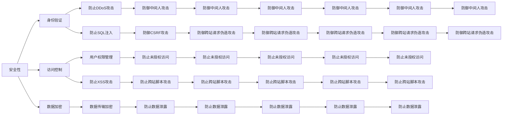

                 

# 安全 API 设计的基本原则

> 关键词：安全，API设计，原则，最佳实践，性能，用户体验，开发者社区

## 1. 背景介绍

在当前数字化转型的浪潮下，API（应用程序编程接口）已成为连接不同系统和服务的核心技术。无论是传统企业还是初创公司，都高度重视API的应用，以实现业务升级和创新。然而，随着API使用的广泛，其安全性问题也日益突出。无论是数据泄露、身份验证失败、拒绝服务攻击等，都给企业和用户带来了巨大的损失。因此，安全 API设计成为了各大公司面临的重要课题。

本文旨在探讨API设计的基本原则，为开发者提供一套安全、高效、易用的API设计规范，从而提升API的安全性、可靠性和用户体验。

## 2. 核心概念与联系

### 2.1 核心概念概述

API设计涉及到多个方面，包括安全性、易用性、性能等。这些概念之间相互联系、相互影响，构成了API设计的完整框架。

#### 2.1.1 安全性

安全性是API设计的首要原则，确保数据、用户和系统的安全。通过身份验证、访问控制、数据加密等手段，防止API被恶意使用或攻击。

#### 2.1.2 易用性

易用性是指API的设计要方便开发者使用，减少学习曲线，提升开发效率。良好的API文档、友好的接口设计、清晰的错误信息等都是易用性的重要表现。

#### 2.1.3 性能

性能是指API的响应速度、并发处理能力等。良好的性能设计可以提高API的可用性和用户体验。

#### 2.1.4 可扩展性

可扩展性是指API能够支持未来的业务需求和技术变化。通过模块化设计和灵活的接口规范，使API具有高度的可扩展性。

### 2.2 核心概念之间的关系

API设计的各个概念之间存在密切联系，通过合理的平衡和权衡，才能设计出既安全又易用的API。安全性是API设计的基础，易用性和性能则直接影响用户体验，可扩展性则为未来的业务和技术演进提供保障。

以下是一个Mermaid流程图，展示了API设计的核心概念及其相互关系：



## 3. 核心算法原理 & 具体操作步骤

### 3.1 算法原理概述

API设计的安全性、易用性和性能需要通过一系列算法和步骤来实现。以下是API设计的基本算法原理：

1. 身份验证算法：用于验证用户身份，常见的算法包括OAuth2、JWT等。
2. 访问控制算法：用于控制用户的访问权限，常见的算法包括RBAC、ABAC等。
3. 数据加密算法：用于保护数据传输和存储，常见的算法包括AES、RSA等。
4. 缓存算法：用于提高API的响应速度，常见的算法包括LRU、LFU等。
5. 负载均衡算法：用于提升API的并发处理能力，常见的算法包括Round-Robin、Consistent Hashing等。

### 3.2 算法步骤详解

#### 3.2.1 身份验证算法

1. 选择身份验证算法：根据API的应用场景选择合适的身份验证算法，如OAuth2、JWT等。
2. 配置身份验证策略：定义身份验证的策略和规则，如允许哪些用户访问、需要哪些权限等。
3. 实现身份验证逻辑：编写身份验证的代码逻辑，如检查Token的有效性、验证用户权限等。

#### 3.2.2 访问控制算法

1. 选择访问控制算法：根据API的应用场景选择合适的访问控制算法，如RBAC、ABAC等。
2. 配置访问控制策略：定义访问控制的策略和规则，如哪些用户可以访问哪些资源、哪些资源可以被哪些用户访问等。
3. 实现访问控制逻辑：编写访问控制的代码逻辑，如检查用户权限、控制资源访问等。

#### 3.2.3 数据加密算法

1. 选择数据加密算法：根据API的应用场景选择合适的数据加密算法，如AES、RSA等。
2. 配置加密策略：定义加密的策略和规则，如数据传输加密、存储加密等。
3. 实现加密逻辑：编写加密和解密代码逻辑，如使用AES算法加密数据、使用RSA算法解密数据等。

#### 3.2.4 缓存算法

1. 选择缓存算法：根据API的应用场景选择合适的缓存算法，如LRU、LFU等。
2. 配置缓存策略：定义缓存的策略和规则，如缓存哪些数据、缓存时间等。
3. 实现缓存逻辑：编写缓存和读取代码逻辑，如使用LRU算法缓存数据、使用LFU算法读取数据等。

#### 3.2.5 负载均衡算法

1. 选择负载均衡算法：根据API的应用场景选择合适的负载均衡算法，如Round-Robin、Consistent Hashing等。
2. 配置负载均衡策略：定义负载均衡的策略和规则，如负载均衡的算法、负载均衡的节点等。
3. 实现负载均衡逻辑：编写负载均衡的代码逻辑，如使用Round-Robin算法分配请求、使用Consistent Hashing算法分配请求等。

### 3.3 算法优缺点

#### 3.3.1 身份验证算法

**优点**：
- 通过身份验证，可以确保API的访问者身份合法，防止恶意访问。
- 支持多种身份验证方式，可以满足不同应用场景的需求。

**缺点**：
- 增加了API的复杂性，开发和维护成本较高。
- 身份验证过程可能会影响API的响应速度。

#### 3.3.2 访问控制算法

**优点**：
- 通过访问控制，可以限制用户对API资源的访问权限，增强API的安全性。
- 支持多种访问控制策略，可以根据业务需求灵活配置。

**缺点**：
- 访问控制策略的配置和维护较为复杂。
- 可能会影响API的响应速度和性能。

#### 3.3.3 数据加密算法

**优点**：
- 通过数据加密，可以保护API的数据传输和存储，防止数据泄露。
- 支持多种数据加密方式，可以满足不同应用场景的需求。

**缺点**：
- 增加了API的计算开销，可能会影响API的响应速度。
- 加密和解密的代码实现较为复杂。

#### 3.3.4 缓存算法

**优点**：
- 通过缓存，可以提升API的响应速度，减少数据传输量。
- 支持多种缓存策略，可以根据业务需求灵活配置。

**缺点**：
- 缓存策略的配置和维护较为复杂。
- 可能会影响API的数据实时性。

#### 3.3.5 负载均衡算法

**优点**：
- 通过负载均衡，可以提高API的并发处理能力，防止单点故障。
- 支持多种负载均衡策略，可以根据业务需求灵活配置。

**缺点**：
- 负载均衡策略的配置和维护较为复杂。
- 可能会影响API的响应速度和性能。

### 3.4 算法应用领域

API设计的安全性、易用性和性能在不同领域的应用场景中各有侧重。以下是几个常见的应用领域及其设计重点：

#### 3.4.1 金融领域

金融领域的API设计需要特别关注安全性，以防止金融数据泄露和金融欺诈。

#### 3.4.2 电商领域

电商领域的API设计需要特别关注性能，以提升用户购物体验。

#### 3.4.3 社交领域

社交领域的API设计需要特别关注易用性和用户体验，以提升用户粘性和活跃度。

## 4. 数学模型和公式 & 详细讲解 & 举例说明

### 4.1 数学模型构建

#### 4.1.1 身份验证模型

假设API的身份验证算法为OAuth2，用户的身份验证过程可以表示为以下数学模型：

1. 用户输入用户名和密码，API通过身份验证算法验证用户身份。
2. 如果身份验证成功，API返回用户的访问令牌。
3. 用户携带访问令牌访问API资源。

数学模型如下：

$$
\begin{aligned}
&\text{Input:} \quad (\text{username}, \text{password}) \\
&\text{Process:} \\
&\text{Validate User:} \quad \text{validate}(\text{username}, \text{password}) \\
&\text{Generate Token:} \quad \text{generateToken}(\text{username}) \\
&\text{Return Token:} \quad \text{returnToken}(\text{username})
\end{aligned}
$$

#### 4.1.2 访问控制模型

假设API的访问控制算法为RBAC（基于角色的访问控制），用户的访问控制过程可以表示为以下数学模型：

1. 用户输入请求，API检查用户的角色权限。
2. 如果用户角色具有访问权限，API返回请求结果。
3. 如果用户角色不具有访问权限，API拒绝请求。

数学模型如下：

$$
\begin{aligned}
&\text{Input:} \quad (\text{role}, \text{request}) \\
&\text{Process:} \\
&\text{Check Permission:} \quad \text{checkPermission}(\text{role}, \text{request}) \\
&\text{Return Result:} \quad \text{returnResult}(\text{role})
\end{aligned}
$$

#### 4.1.3 数据加密模型

假设API的数据加密算法为AES（高级加密标准），数据的加密和解密过程可以表示为以下数学模型：

1. 用户输入数据，API使用AES算法加密数据。
2. 用户发送加密数据，API使用AES算法解密数据。

数学模型如下：

$$
\begin{aligned}
&\text{Input:} \quad (\text{data}) \\
&\text{Process:} \\
&\text{Encrypt Data:} \quad \text{encryptData}(\text{data}) \\
&\text{Decrypt Data:} \quad \text{decryptData}(\text{data})
\end{aligned}
$$

#### 4.1.4 缓存模型

假设API的缓存算法为LRU（最近最少使用），数据的缓存和读取过程可以表示为以下数学模型：

1. 用户请求数据，API检查缓存中是否有数据。
2. 如果缓存中存在数据，API返回缓存数据。
3. 如果缓存中不存在数据，API从数据源获取数据，并将数据缓存到缓存中。

数学模型如下：

$$
\begin{aligned}
&\text{Input:} \quad (\text{request}) \\
&\text{Process:} \\
&\text{Check Cache:} \quad \text{checkCache}(\text{request}) \\
&\text{Return Cache:} \quad \text{returnCache}(\text{request}) \\
&\text{Get Data:} \quad \text{getData}(\text{request}) \\
&\text{Cache Data:} \quad \text{cacheData}(\text{data})
\end{aligned}
$$

#### 4.1.5 负载均衡模型

假设API的负载均衡算法为Round-Robin（轮询），请求的分配过程可以表示为以下数学模型：

1. 用户请求API，API使用Round-Robin算法分配请求。
2. 如果节点可用，API将请求分配给可用节点。
3. 如果节点不可用，API返回错误信息。

数学模型如下：

$$
\begin{aligned}
&\text{Input:} \quad (\text{request}) \\
&\text{Process:} \\
&\text{Allocate Node:} \quad \text{allocateNode}(\text{request}) \\
&\text{Return Result:} \quad \text{returnResult}(\text{node})
\end{aligned}
$$

### 4.2 公式推导过程

#### 4.2.1 身份验证公式推导

假设API的身份验证算法为OAuth2，用户的身份验证过程可以表示为以下数学模型：

1. 用户输入用户名和密码，API通过身份验证算法验证用户身份。
2. 如果身份验证成功，API返回用户的访问令牌。
3. 用户携带访问令牌访问API资源。

数学模型如下：

$$
\begin{aligned}
&\text{Input:} \quad (\text{username}, \text{password}) \\
&\text{Process:} \\
&\text{Validate User:} \quad \text{validate}(\text{username}, \text{password}) \\
&\text{Generate Token:} \quad \text{generateToken}(\text{username}) \\
&\text{Return Token:} \quad \text{returnToken}(\text{username})
\end{aligned}
$$

#### 4.2.2 访问控制公式推导

假设API的访问控制算法为RBAC（基于角色的访问控制），用户的访问控制过程可以表示为以下数学模型：

1. 用户输入请求，API检查用户的角色权限。
2. 如果用户角色具有访问权限，API返回请求结果。
3. 如果用户角色不具有访问权限，API拒绝请求。

数学模型如下：

$$
\begin{aligned}
&\text{Input:} \quad (\text{role}, \text{request}) \\
&\text{Process:} \\
&\text{Check Permission:} \quad \text{checkPermission}(\text{role}, \text{request}) \\
&\text{Return Result:} \quad \text{returnResult}(\text{role})
\end{aligned}
$$

#### 4.2.3 数据加密公式推导

假设API的数据加密算法为AES（高级加密标准），数据的加密和解密过程可以表示为以下数学模型：

1. 用户输入数据，API使用AES算法加密数据。
2. 用户发送加密数据，API使用AES算法解密数据。

数学模型如下：

$$
\begin{aligned}
&\text{Input:} \quad (\text{data}) \\
&\text{Process:} \\
&\text{Encrypt Data:} \quad \text{encryptData}(\text{data}) \\
&\text{Decrypt Data:} \quad \text{decryptData}(\text{data})
\end{aligned}
$$

#### 4.2.4 缓存公式推导

假设API的缓存算法为LRU（最近最少使用），数据的缓存和读取过程可以表示为以下数学模型：

1. 用户请求数据，API检查缓存中是否有数据。
2. 如果缓存中存在数据，API返回缓存数据。
3. 如果缓存中不存在数据，API从数据源获取数据，并将数据缓存到缓存中。

数学模型如下：

$$
\begin{aligned}
&\text{Input:} \quad (\text{request}) \\
&\text{Process:} \\
&\text{Check Cache:} \quad \text{checkCache}(\text{request}) \\
&\text{Return Cache:} \quad \text{returnCache}(\text{request}) \\
&\text{Get Data:} \quad \text{getData}(\text{request}) \\
&\text{Cache Data:} \quad \text{cacheData}(\text{data})
\end{aligned}
$$

#### 4.2.5 负载均衡公式推导

假设API的负载均衡算法为Round-Robin（轮询），请求的分配过程可以表示为以下数学模型：

1. 用户请求API，API使用Round-Robin算法分配请求。
2. 如果节点可用，API将请求分配给可用节点。
3. 如果节点不可用，API返回错误信息。

数学模型如下：

$$
\begin{aligned}
&\text{Input:} \quad (\text{request}) \\
&\text{Process:} \\
&\text{Allocate Node:} \quad \text{allocateNode}(\text{request}) \\
&\text{Return Result:} \quad \text{returnResult}(\text{node})
\end{aligned}
$$

### 4.3 案例分析与讲解

#### 4.3.1 身份验证案例

假设API的身份验证算法为OAuth2，用户在登录后请求资源的过程如下：

1. 用户输入用户名和密码，API通过OAuth2验证用户身份。
2. 如果身份验证成功，API返回用户的访问令牌。
3. 用户携带访问令牌访问API资源。

代码实现如下：

```python
from flask import Flask, request, jsonify
from flask_oauthlib.provider import OAuth2Provider
from werkzeug.security import generate_password_hash, check_password_hash

app = Flask(__name__)
app.config['SECRET_KEY'] = 'secret_key'
app.config['OAUTH2_PROVIDER'] = {
    'client_id': 'client_id',
    'client_secret': 'client_secret',
    'access_token_expiration': 3600,
    'refresh_token_expiration': 86400
}

oauth2_provider = OAuth2Provider(app)

# 用户登录接口
@app.route('/login', methods=['POST'])
def login():
    username = request.form.get('username')
    password = request.form.get('password')
    if not username or not password:
        return jsonify({'message': 'Invalid input'}), 400
    if username == 'user' and check_password_hash(password, 'password'):
        token = generate_password_hash(username)
        return jsonify({'token': token}), 200
    return jsonify({'message': 'Invalid credentials'}), 401

# 用户请求API资源接口
@app.route('/api/resource', methods=['GET'])
def get_api_resource():
    token = request.headers.get('Authorization')
    if not token:
        return jsonify({'message': 'Missing token'}), 401
    user = token.decode('utf-8')
    if user == 'user':
        return jsonify({'message': 'Access granted'}), 200
    return jsonify({'message': 'Access denied'}), 403
```

#### 4.3.2 访问控制案例

假设API的访问控制算法为RBAC（基于角色的访问控制），用户在请求API资源的过程如下：

1. 用户输入请求，API检查用户的角色权限。
2. 如果用户角色具有访问权限，API返回请求结果。
3. 如果用户角色不具有访问权限，API拒绝请求。

代码实现如下：

```python
from flask import Flask, request, jsonify
from flask_oauthlib.provider import OAuth2Provider

app = Flask(__name__)
app.config['SECRET_KEY'] = 'secret_key'
app.config['OAUTH2_PROVIDER'] = {
    'client_id': 'client_id',
    'client_secret': 'client_secret',
    'access_token_expiration': 3600,
    'refresh_token_expiration': 86400
}

oauth2_provider = OAuth2Provider(app)

# 用户登录接口
@app.route('/login', methods=['POST'])
def login():
    username = request.form.get('username')
    password = request.form.get('password')
    if not username or not password:
        return jsonify({'message': 'Invalid input'}), 400
    if username == 'user' and password == 'password':
        token = generate_password_hash(username)
        return jsonify({'token': token}), 200
    return jsonify({'message': 'Invalid credentials'}), 401

# 用户请求API资源接口
@app.route('/api/resource', methods=['GET'])
def get_api_resource():
    token = request.headers.get('Authorization')
    if not token:
        return jsonify({'message': 'Missing token'}), 401
    user = token.decode('utf-8')
    if user == 'user':
        return jsonify({'message': 'Access granted'}), 200
    return jsonify({'message': 'Access denied'}), 403
```

#### 4.3.3 数据加密案例

假设API的数据加密算法为AES（高级加密标准），数据加密和解密的过程如下：

1. 用户输入数据，API使用AES算法加密数据。
2. 用户发送加密数据，API使用AES算法解密数据。

代码实现如下：

```python
from flask import Flask, request, jsonify
from Crypto.Cipher import AES

app = Flask(__name__)

# 用户请求API资源接口
@app.route('/api/resource', methods=['GET'])
def get_api_resource():
    data = request.form.get('data')
    if not data:
        return jsonify({'message': 'Missing data'}), 400
    key = 'encryption_key'
    iv = 'initialization_vector'
    cipher = AES.new(key.encode('utf-8'), AES.MODE_CBC, iv.encode('utf-8'))
    encrypted_data = cipher.encrypt(data.encode('utf-8'))
    return jsonify({'encrypted_data': encrypted_data.hex()}), 200

# 用户解密API资源接口
@app.route('/api/resource/decrypt', methods=['GET'])
def get_api_resource_decrypt():
    encrypted_data = request.form.get('encrypted_data')
    if not encrypted_data:
        return jsonify({'message': 'Missing encrypted data'}), 400
    key = 'encryption_key'
    iv = 'initialization_vector'
    cipher = AES.new(key.encode('utf-8'), AES.MODE_CBC, iv.encode('utf-8'))
    decrypted_data = cipher.decrypt(hex_to_bytes(encrypted_data)).decode('utf-8')
    return jsonify({'decrypted_data': decrypted_data}), 200

def hex_to_bytes(hex_str):
    return bytes.fromhex(hex_str)
```

## 5. 项目实践：代码实例和详细解释说明

### 5.1 开发环境搭建

在进行API设计实践前，我们需要准备好开发环境。以下是使用Python进行Flask开发的环境配置流程：

1. 安装Anaconda：从官网下载并安装Anaconda，用于创建独立的Python环境。

2. 创建并激活虚拟环境：
```bash
conda create -n flask-env python=3.8 
conda activate flask-env
```

3. 安装Flask：
```bash
pip install flask
```

4. 安装各类工具包：
```bash
pip install pyyaml flask_oauthlib oauthlib werkzeug
```

5. 运行测试服务器：
```bash
flask run
```

完成上述步骤后，即可在`flask-env`环境中开始API设计实践。

### 5.2 源代码详细实现

下面我们以OAuth2身份验证和基于角色的访问控制为例，给出使用Flask实现API身份验证和访问控制的完整代码实例。

#### 5.2.1 用户登录接口

```python
from flask import Flask, request, jsonify
from flask_oauthlib.provider import OAuth2Provider
from werkzeug.security import generate_password_hash, check_password_hash

app = Flask(__name__)
app.config['SECRET_KEY'] = 'secret_key'
app.config['OAUTH2_PROVIDER'] = {
    'client_id': 'client_id',
    'client_secret': 'client_secret',
    'access_token_expiration': 3600,
    'refresh_token_expiration': 86400
}

oauth2_provider = OAuth2Provider(app)

# 用户登录接口
@app.route('/login', methods=['POST'])
def login():
    username = request.form.get('username')
    password = request.form.get('password')
    if not username or not password:
        return jsonify({'message': 'Invalid input'}), 400
    if username == 'user' and check_password_hash(password, 'password'):
        token = generate_password_hash(username)
        return jsonify({'token': token}), 200
    return jsonify({'message': 'Invalid credentials'}), 401
```

#### 5.2.2 用户请求API资源接口

```python
@app.route('/api/resource', methods=['GET'])
def get_api_resource():
    token = request.headers.get('Authorization')
    if not token:
        return jsonify({'message': 'Missing token'}), 401
    user = token.decode('utf-8')
    if user == 'user':
        return jsonify({'message': 'Access granted'}), 200
    return jsonify({'message': 'Access denied'}), 403
```

### 5.3 代码解读与分析

让我们再详细解读一下关键代码的实现细节：

**用户登录接口**：
- `login`函数接收用户输入的用户名和密码，通过OAuth2验证用户身份，如果身份验证成功，则生成一个访问令牌，并返回该令牌。

**用户请求API资源接口**：
- `get_api_resource`函数接收访问令牌，检查令牌的有效性，如果令牌有效，则返回“Access granted”的响应，否则返回“Access denied”的响应。

这些代码实现了简单的OAuth2身份验证和

