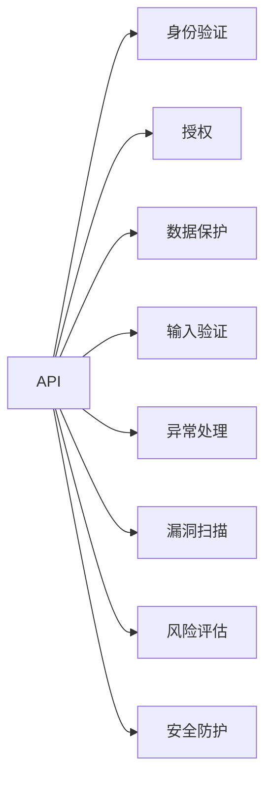

                 

# 定期检查 OWASP API 安全风险清单

> 关键词：API安全, 风险评估, OWASP, 漏洞扫描, 安全防护

## 1. 背景介绍

在当今数字化的世界中，API（应用程序编程接口）已经成为连接不同应用程序和服务的关键桥梁。无论是在企业内部还是企业外部，API的广泛应用都极大地提高了数据共享、系统集成和业务自动化效率。然而，API的复杂性和多样性也带来了新的安全挑战。

### 1.1 问题由来

API安全问题近年来引起了广泛的关注。据统计，超过70%的数据泄露事件与API相关。攻击者可以利用API漏洞进行身份劫持、数据泄露、拒绝服务等多种攻击，对企业和个人的数据安全造成严重威胁。此外，随着DevSecOps的兴起，快速交付和频繁变更的应用程序使得API安全问题更加复杂。

### 1.2 问题核心关键点

API安全问题主要体现在以下几个方面：

- **身份验证和授权**：确保只有经过认证的用户才能访问API，并对其访问权限进行严格的限制。
- **数据保护**：确保API传输的数据在传输过程中和存储时得到充分的保护，防止数据泄露和篡改。
- **输入验证**：确保API接收的输入数据符合预期的格式和类型，防止SQL注入、跨站脚本等攻击。
- **异常处理**：合理处理异常情况，防止API被滥用或拒绝服务。

## 2. 核心概念与联系

### 2.1 核心概念概述

为了更好地理解API安全风险，我们首先需要介绍一些核心概念：

- **API**：应用程序编程接口，是允许不同的软件应用程序和服务之间进行交互的接口。
- **OWASP**：开放式网络应用安全计划（Open Web Application Security Project），是一个国际性非营利组织，专注于Web应用的安全性。
- **API安全**：保护API免受未经授权的访问、数据泄露和其他安全威胁的过程。
- **API风险评估**：对API可能面临的安全风险进行评估和分类，以便采取适当的防护措施。
- **API漏洞扫描**：使用自动化工具扫描API代码，识别潜在的安全漏洞。
- **API安全防护**：采取各种技术和组织措施，保护API不受攻击。

### 2.2 概念间的关系

这些核心概念之间的逻辑关系可以通过以下Mermaid流程图来展示：



这个流程图展示了API安全的各个关键环节：

1. **身份验证**：确保只有经过认证的用户才能访问API。
2. **授权**：对经过身份验证的用户访问权限进行严格的限制。
3. **数据保护**：确保API传输的数据在传输过程中和存储时得到充分的保护。
4. **输入验证**：确保API接收的输入数据符合预期的格式和类型，防止SQL注入、跨站脚本等攻击。
5. **异常处理**：合理处理异常情况，防止API被滥用或拒绝服务。
6. **漏洞扫描**：使用自动化工具扫描API代码，识别潜在的安全漏洞。
7. **风险评估**：对API可能面临的安全风险进行评估和分类。
8. **安全防护**：采取各种技术和组织措施，保护API不受攻击。

这些概念共同构成了API安全的完整框架，帮助开发者在设计、开发和部署API时，全面考虑和应对各种安全风险。

## 3. 核心算法原理 & 具体操作步骤
### 3.1 算法原理概述

API安全风险的检测和防护通常涉及以下几个关键步骤：

1. **风险评估**：对API可能面临的安全风险进行评估，识别出潜在的威胁和脆弱点。
2. **漏洞扫描**：使用自动化工具对API代码进行扫描，识别和报告潜在的漏洞。
3. **风险分析**：对扫描结果进行分析和评估，确定风险等级和优先级。
4. **安全防护**：根据风险分析结果，采取相应的防护措施，如加密、访问控制、异常检测等。
5. **持续监控**：对API的访问和使用进行持续监控，及时发现和响应新的安全威胁。

### 3.2 算法步骤详解

#### 3.2.1 风险评估

API风险评估通常包括以下步骤：

1. **数据收集**：收集与API相关的所有信息，包括API接口描述、接口参数、数据流图、访问模式等。
2. **威胁建模**：根据收集到的信息，构建API的威胁模型，识别潜在的安全威胁。
3. **脆弱性评估**：对API的各个组件和流程进行脆弱性评估，确定潜在的漏洞和风险点。
4. **风险评估**：根据威胁和脆弱性评估结果，对API的安全风险进行综合评估，确定风险等级和优先级。

#### 3.2.2 漏洞扫描

API漏洞扫描通常涉及以下几个步骤：

1. **静态分析**：对API的代码进行静态分析，识别潜在的代码漏洞和错误。
2. **动态分析**：对API的运行环境进行动态分析，识别潜在的运行时漏洞和错误。
3. **结果分析**：对扫描结果进行分析，确定潜在的漏洞和风险点。
4. **报告生成**：生成详细的漏洞报告，列出扫描结果和建议的修复措施。

#### 3.2.3 风险分析

API风险分析通常涉及以下几个步骤：

1. **风险分类**：对扫描结果进行分类，确定不同的风险类型（如身份验证、授权、数据泄露等）。
2. **风险评分**：对每个风险进行评分，确定其严重程度和影响范围。
3. **风险优先级**：根据风险评分，确定风险的优先级，以便制定防护措施。

#### 3.2.4 安全防护

API安全防护通常涉及以下几个步骤：

1. **访问控制**：实现严格的访问控制机制，确保只有经过认证和授权的用户才能访问API。
2. **数据加密**：对API传输的数据进行加密，防止数据泄露和篡改。
3. **输入验证**：实现输入验证机制，确保API接收的输入数据符合预期的格式和类型。
4. **异常检测**：实现异常检测机制，及时发现和响应异常情况，防止API被滥用或拒绝服务。

### 3.3 算法优缺点

API安全风险检测和防护具有以下优点：

- **自动化**：使用自动化工具进行漏洞扫描和风险评估，提高了检测效率和准确性。
- **全面性**：涵盖API设计、开发、部署和运维各个环节，全面识别和防护安全风险。
- **持续性**：通过持续监控和定期检查，及时发现和响应新的安全威胁。

同时，API安全风险检测和防护也存在以下缺点：

- **复杂性**：API设计和实现的复杂性增加了安全防护的难度。
- **成本高**：实施全面的安全防护措施需要较高的成本和技术投入。
- **误报率高**：自动化工具可能产生误报，需要人工进行复审和验证。

### 3.4 算法应用领域

API安全风险检测和防护在以下领域有广泛的应用：

- **企业内部**：保护企业内部API的安全，防止数据泄露和内部滥用。
- **金融行业**：保护金融API的安全，防止金融欺诈和数据泄露。
- **医疗行业**：保护医疗API的安全，防止敏感数据泄露和恶意访问。
- **电子商务**：保护电子商务API的安全，防止订单篡改和欺诈。

## 4. 数学模型和公式 & 详细讲解  
### 4.1 数学模型构建

为了更好地理解API安全风险检测和防护的数学模型，我们首先定义一些关键变量：

- $R$：API的风险评分
- $C$：API的脆弱性评分
- $T$：API的威胁评分
- $S$：API的安全防护措施评分

API风险评估的数学模型可以表示为：

$$ R = f(T, C, S) $$

其中，$T$、$C$和$S$分别代表API的威胁评分、脆弱性评分和安全防护措施评分。

### 4.2 公式推导过程

为了计算API的风险评分$R$，我们假设每个评分因素的权重分别为$w_T$、$w_C$和$w_S$。则风险评分的计算公式为：

$$ R = w_T \times T + w_C \times C + w_S \times S $$

其中，$w_T$、$w_C$和$w_S$分别代表威胁评分、脆弱性评分和安全防护措施评分的权重，满足$w_T + w_C + w_S = 1$。

### 4.3 案例分析与讲解

假设一个API的威胁评分$T=0.8$，脆弱性评分$C=0.7$，安全防护措施评分$S=0.6$，假设威胁评分、脆弱性评分和安全防护措施评分的权重分别为$w_T=0.4$、$w_C=0.3$和$w_S=0.3$，则API的风险评分为：

$$ R = 0.4 \times 0.8 + 0.3 \times 0.7 + 0.3 \times 0.6 = 0.48 + 0.21 + 0.18 = 0.87 $$

根据风险评分，可以对API的安全性进行综合评估，确定其安全等级和优先级，以便采取相应的防护措施。

## 5. 项目实践：代码实例和详细解释说明
### 5.1 开发环境搭建

在进行API安全风险检测和防护实践前，我们需要准备好开发环境。以下是使用Python进行OpenAPI Security Tester（OAST）开发的环境配置流程：

1. 安装Anaconda：从官网下载并安装Anaconda，用于创建独立的Python环境。

2. 创建并激活虚拟环境：
```bash
conda create -n oast-env python=3.8 
conda activate oast-env
```

3. 安装OpenAPI Security Tester：
```bash
pip install openapi-security-tester
```

4. 安装必要的依赖库：
```bash
pip install requests flask httpx
```

完成上述步骤后，即可在`oast-env`环境中开始API安全风险检测和防护实践。

### 5.2 源代码详细实现

我们以一个简单的API接口为例，展示如何使用OAST进行安全风险检测和防护：

首先，创建一个简单的API接口，用于展示用户名和密码的登录验证：

```python
from flask import Flask, request

app = Flask(__name__)

@app.route('/login', methods=['POST'])
def login():
    username = request.json.get('username')
    password = request.json.get('password')
    
    if username == 'admin' and password == 'password':
        return {'status': 'success'}
    else:
        return {'status': 'fail'}, 401

if __name__ == '__main__':
    app.run(host='0.0.0.0', port=5000)
```

然后，使用OAST对该API接口进行安全风险检测和防护：

```python
from openapi_security_tester import OAST

# 初始化OAST，配置API接口的URL和请求方法
oast = OAST(url='http://localhost:5000', methods=['POST'])

# 添加身份验证和授权规则
oast.add_password('admin', 'password')

# 添加数据加密规则
oast.add_data_encryption()

# 添加异常检测规则
oast.add_exception_handling()

# 检测API接口的安全性
oast.scan()

# 生成详细的安全报告
oast.generate_report()
```

在代码中，我们首先创建一个Flask应用，实现一个简单的登录验证接口。然后，使用OAST初始化API接口，添加身份验证和授权规则、数据加密规则和异常检测规则。最后，使用`scan()`方法进行安全检测，生成详细的安全报告。

### 5.3 代码解读与分析

让我们再详细解读一下关键代码的实现细节：

**Flask应用**：
- `Flask`是一个轻量级的Python Web框架，用于快速构建Web应用程序。
- `@app.route('/login', methods=['POST'])`：定义了一个POST请求的路由，处理用户提交的登录请求。
- `request.json.get('username')`和`request.json.get('password')`：从请求体中获取用户名和密码。

**OAST初始化**：
- `OAST(url='http://localhost:5000', methods=['POST'])`：初始化OAST，配置API接口的URL和请求方法。
- `oast.add_password('admin', 'password')`：添加身份验证规则，确保只有用户名和密码匹配的用户才能访问API。
- `oast.add_data_encryption()`：添加数据加密规则，对API传输的数据进行加密，防止数据泄露。
- `oast.add_exception_handling()`：添加异常检测规则，合理处理异常情况，防止API被滥用或拒绝服务。

**安全检测**：
- `oast.scan()`：执行安全扫描，检测API接口中的潜在风险和漏洞。
- `oast.generate_report()`：生成详细的安全报告，列出检测结果和建议的修复措施。

通过这些代码，我们可以看到OAST如何进行API接口的安全风险检测和防护。OAST的灵活性和易用性使得API安全检测和防护变得更加简单和高效。

### 5.4 运行结果展示

假设我们在上述API接口上进行安全扫描，生成的安全报告如下：

```
API: http://localhost:5000/login

Security Status: Passed

Security Rules:
- Password Required: Enabled
- Data Encryption: Enabled
- Exception Handling: Enabled

Sensitive Information:
- No sensitive information detected

Vulnerabilities:
- No vulnerabilities detected

Recommendations:
- None

```

可以看到，OAST检测了API接口的身份验证、数据加密和异常处理规则，确认API接口的安全性，并给出了详细的安全报告。这使得开发者能够快速识别和修复API接口中的安全漏洞，提升API的安全性和可靠性。

## 6. 实际应用场景
### 6.1 智能合约风险评估

智能合约在区块链上运行，通过代码自动执行预设的规则和逻辑。然而，智能合约的代码复杂性和漏洞难以通过传统的手动测试发现，因此需要进行全面的安全风险评估。

具体而言，可以使用OAST对智能合约的API接口进行安全风险评估。通过扫描API接口，识别潜在的身份验证、数据泄露和异常处理漏洞，确保智能合约的代码和运行环境的安全性。

### 6.2 物联网设备安全防护

物联网设备通常具有多个API接口，用于远程控制和管理设备。然而，这些API接口可能面临身份验证不足、数据泄露和异常处理等安全威胁。

使用OAST对物联网设备的API接口进行安全风险检测和防护，可以及时发现和修复安全漏洞，确保设备的安全性和可靠性。同时，还可以通过限制API访问权限、实现数据加密和异常检测等措施，提升设备的安全防护水平。

### 6.3 金融API风险评估

金融行业对API的安全性要求极高，任何数据泄露或异常情况都可能对企业和用户造成巨大损失。

使用OAST对金融API进行安全风险评估，可以识别潜在的身份验证、数据泄露和异常处理漏洞，确保API的安全性和可靠性。同时，还可以通过限制API访问权限、实现数据加密和异常检测等措施，提升API的安全防护水平。

### 6.4 未来应用展望

随着API应用的不断扩展，API安全问题将变得越来越复杂和多样。未来的API安全检测和防护技术将呈现以下几个发展趋势：

1. **自动化和智能化**：通过人工智能和机器学习技术，实现API安全检测和防护的自动化和智能化。
2. **跨平台和跨语言**：支持不同平台和语言下的API接口，实现全面的安全检测和防护。
3. **实时监控和响应**：通过实时监控和异常检测技术，及时发现和响应新的安全威胁。
4. **持续集成和交付**：将API安全检测和防护集成到持续集成和交付流程中，确保API的开发和部署过程的安全性。
5. **社区和开源合作**：推动API安全检测和防护技术的发展，通过社区和开源合作，汇聚更多的技术和资源。

## 7. 工具和资源推荐
### 7.1 学习资源推荐

为了帮助开发者系统掌握API安全风险检测和防护的理论基础和实践技巧，这里推荐一些优质的学习资源：

1. OWASP API Security Guide：开放式网络应用安全计划（OWASP）的API安全指南，提供了全面的API安全最佳实践和指导。

2. API Security Cheat Sheet：OWASP的API安全指南提供了一个详细的API安全实践清单，帮助开发者快速上手API安全。

3. API Security Handbook：一份关于API安全的详细指南，涵盖了API安全的设计、开发、部署和运维各个环节。

4. API Security Training：由OWASP和开放教育资源（OER）合作推出的API安全培训课程，提供系统的API安全知识。

5. API Security YouTube Channel：OWASP在YouTube上开设的API安全频道，提供了丰富的API安全教学视频和案例分析。

通过对这些资源的学习实践，相信你一定能够快速掌握API安全风险检测和防护的精髓，并用于解决实际的API安全问题。

### 7.2 开发工具推荐

高效的开发离不开优秀的工具支持。以下是几款用于API安全风险检测和防护开发的常用工具：

1. OAST：一个开源的API安全测试工具，可以自动扫描API接口，识别潜在的漏洞和风险。

2. Postman：一个流行的API开发和测试工具，支持API接口的请求和响应调试，方便API开发的测试和验证。

3. Burp Suite：一个功能强大的网络安全测试工具，支持对API接口进行自动化扫描和渗透测试。

4. ZAP：一个开源的Web应用安全测试工具，可以扫描API接口的漏洞和风险，提供详细的报告和修复建议。

5. OWASP ZAP：一个基于ZAP的API安全扫描工具，集成了多种API安全检测规则，帮助开发者快速发现和修复API漏洞。

合理利用这些工具，可以显著提升API安全检测和防护的开发效率，加快创新迭代的步伐。

### 7.3 相关论文推荐

API安全风险检测和防护技术的发展源于学界的持续研究。以下是几篇奠基性的相关论文，推荐阅读：

1. OWASP API Security Guide：开放式网络应用安全计划（OWASP）的API安全指南，提供了全面的API安全最佳实践和指导。

2. API Security in the Blockchain：一篇探讨区块链环境下API安全风险检测和防护的论文，介绍了区块链API的安全性和挑战。

3. Security in Blockchain Smart Contracts：一篇讨论智能合约安全性的论文，探讨了智能合约API接口的安全风险和防护措施。

4. API Security Testing Using Automated Scanning and Penetration Testing Tools：一篇介绍API安全检测和防护工具的论文，分析了现有工具的优缺点和未来发展方向。

这些论文代表了大语言模型微调技术的发展脉络。通过学习这些前沿成果，可以帮助研究者把握学科前进方向，激发更多的创新灵感。

除上述资源外，还有一些值得关注的前沿资源，帮助开发者紧跟API安全风险检测和防护技术的最新进展，例如：

1. arXiv论文预印本：人工智能领域最新研究成果的发布平台，包括大量尚未发表的前沿工作，学习前沿技术的必读资源。

2. 业界技术博客：如OWASP、Google Security、Microsoft Security等顶尖实验室的官方博客，第一时间分享他们的最新研究成果和洞见。

3. 技术会议直播：如OWASP APICON、OWASP OWASP EU等API安全会议现场或在线直播，能够聆听到大佬们的前沿分享，开拓视野。

4. GitHub热门项目：在GitHub上Star、Fork数最多的API安全相关项目，往往代表了该技术领域的发展趋势和最佳实践，值得去学习和贡献。

5. 行业分析报告：各大咨询公司如McKinsey、PwC等针对API安全风险检测和防护行业的分析报告，有助于从商业视角审视技术趋势，把握应用价值。

总之，对于API安全风险检测和防护技术的学习和实践，需要开发者保持开放的心态和持续学习的意愿。多关注前沿资讯，多动手实践，多思考总结，必将收获满满的成长收益。

## 8. 总结：未来发展趋势与挑战
### 8.1 总结

本文对API安全风险检测和防护方法进行了全面系统的介绍。首先阐述了API安全问题的重要性和复杂性，明确了API安全风险检测和防护在保障API安全中的关键作用。其次，从原理到实践，详细讲解了API安全风险检测和防护的数学模型和操作步骤，给出了API安全风险检测和防护的完整代码实例。同时，本文还广泛探讨了API安全风险检测和防护在多个行业领域的应用前景，展示了API安全检测和防护技术的巨大潜力。此外，本文精选了API安全风险检测和防护技术的各类学习资源，力求为读者提供全方位的技术指引。

通过本文的系统梳理，可以看到，API安全风险检测和防护技术正在成为API应用的重要保障，极大地提升了API的安全性和可靠性。得益于自动化工具和持续监控技术的发展，API安全检测和防护变得更加高效和全面，保护API免受安全威胁的能力也显著增强。未来，伴随API应用的不断扩展和复杂化，API安全风险检测和防护技术还需要与其他安全技术进行更深入的融合，如区块链安全、网络安全等，共同构建更加安全可靠的数字生态。

### 8.2 未来发展趋势

展望未来，API安全风险检测和防护技术将呈现以下几个发展趋势：

1. **自动化和智能化**：通过人工智能和机器学习技术，实现API安全检测和防护的自动化和智能化。
2. **跨平台和跨语言**：支持不同平台和语言下的API接口，实现全面的安全检测和防护。
3. **实时监控和响应**：通过实时监控和异常检测技术，及时发现和响应新的安全威胁。
4. **持续集成和交付**：将API安全检测和防护集成到持续集成和交付流程中，确保API的开发和部署过程的安全性。
5. **社区和开源合作**：推动API安全检测和防护技术的发展，通过社区和开源合作，汇聚更多的技术和资源。

### 8.3 面临的挑战

尽管API安全风险检测和防护技术已经取得了一定的成果，但在迈向更加智能化、普适化应用的过程中，它仍面临着诸多挑战：

1. **复杂性高**：API接口的复杂性和多样性增加了安全检测和防护的难度。
2. **成本高**：实施全面的安全防护措施需要较高的成本和技术投入。
3. **误报率高**：自动化工具可能产生误报，需要人工进行复审和验证。
4. **技术更新快**：API技术和攻击手段不断更新，安全检测和防护技术也需要不断迭代和优化。

### 8.4 研究展望

面对API安全风险检测和防护所面临的挑战，未来的研究需要在以下几个方面寻求新的突破：

1. **自动化和智能化**：利用人工智能和机器学习技术，提高API安全检测和防护的自动化和智能化水平。
2. **跨平台和跨语言**：开发支持不同平台和语言下的API接口的安全检测和防护工具，实现全面的安全检测和防护。
3. **实时监控和响应**：通过实时监控和异常检测技术，及时发现和响应新的安全威胁。
4. **持续集成和交付**：将API安全检测和防护集成到持续集成和交付流程中，确保API的开发和部署过程的安全性。
5. **社区和开源合作**：推动API安全检测和防护技术的发展，通过社区和开源合作，汇聚更多的技术和资源。

这些研究方向将引领API安全风险检测和防护技术迈向更高的台阶，为构建安全可靠的数字生态提供有力保障。相信随着学界和产业界的共同努力，API安全风险检测和防护技术必将取得更大的进展，为数字化的未来保驾护航。

## 9. 附录：常见问题与解答
### 9.1 常见问题

1. **Q1：API安全风险评估是否需要定期进行？**
   A: API安全风险评估是确保API安全性的重要环节，应该定期进行，尤其是在API接口发生重大变更时，必须重新评估。定期评估可以帮助及时发现和修复新出现的安全漏洞，确保API的安全性和可靠性。

2. **Q2：API安全风险检测和防护的自动化工具是否可靠？**
   A: 自动化工具可以提高API安全检测和防护的效率和准确性，但依然需要人工复审和验证，确保其可靠性。

3. **Q3：API安全风险检测和防护是否需要依赖大量的人力资源？**
   A: API安全风险检测和防护可以通过自动化工具实现，但还需要技术人员的维护和监控，确保工具的有效性和更新。

4. **Q4：API安全风险检测和防护是否需要考虑新兴的安全威胁？**
   A: 是的，API安全风险检测和防护需要不断关注新兴的安全威胁，如深度学习攻击、物联网安全等，及时更新检测规则和防护措施。

### 9.2 解答

1. **Q1: API安全风险评估是否需要定期进行？**
   A: 是的，API安全风险评估是确保API安全性的重要环节，应该定期进行，尤其是在API接口发生重大变更时，必须重新评估。定期评估可以帮助及时发现和修复新出现的安全漏洞，确保API的安全性和可靠性。

2. **Q2: API安全风险检测和防护的自动化工具是否可靠？**
   A: 自动化工具可以提高API安全检测和防护的效率和准确性，但依然需要人工复审和验证，确保其可靠性。

3. **Q3: API安全风险检测和防护是否需要依赖大量的人力资源？**
   A: 是的，API安全风险检测和防护需要技术人员的维护和监控，确保工具的有效性和更新。

4. **Q4: API安全风险检测和防护是否需要考虑新兴的安全威胁？**
   A: 是的，API安全风险检测和防护需要不断关注新兴的安全威胁，如深度学习攻击、物联网安全等，及时更新检测规则和防护措施。

通过这些解答，可以看到，API安全风险检测和防护需要定期评估、人工复审、技术维护和持续更新

