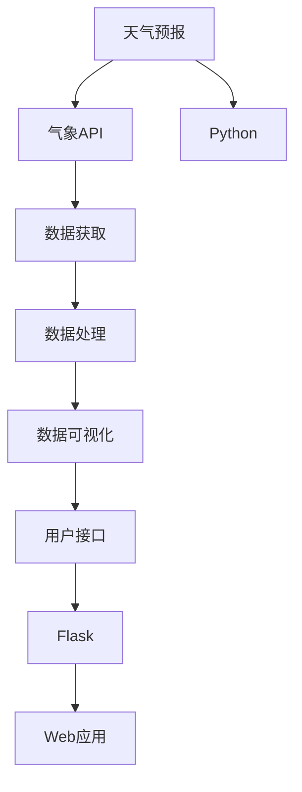

                 

# 实战: 天气预报 (Weather Forecast) 插件开发

> 关键词：天气预报, 插件开发, Python, Flask, 气象API, 数据可视化

## 1. 背景介绍

天气预报是现代社会中不可或缺的一部分，它关乎人们的出行、健康、生产等各个方面。在过去的几十年里，随着计算机技术的发展，天气预报的精度和时效性都有了显著的提高。然而，对于普通用户而言，如何高效地获取和使用天气预报信息，仍然是一个值得探讨的问题。

本文将介绍一种基于Python和Flask框架开发的天气预报插件，它能够从多个气象API获取最新的天气数据，并将这些数据以直观的方式展示给用户。通过这种插件，用户可以方便地查看当前和未来的天气情况，从而做出更为合理的出行和生活规划。

## 2. 核心概念与联系

### 2.1 核心概念概述

在本文中，我们将涉及以下几个核心概念：

- **天气预报 (Weather Forecast)**：通过气象模型预测未来的天气情况，包括气温、降水、风力等指标。
- **插件开发 (Plugin Development)**：在已有软件系统中添加新的功能模块，以扩展其功能。
- **Python (Python)**：一种广泛应用于科学计算、数据分析、Web开发等领域的高级编程语言。
- **Flask (Flask)**：一个轻量级的Web框架，用于构建高性能的Web应用。
- **气象API (Meteorological API)**：提供气象数据的Web服务接口，供开发者使用。
- **数据可视化 (Data Visualization)**：将数据以图表、图形等形式展示出来，以便更好地理解和分析。

### 2.2 概念间的关系

这些核心概念之间的联系可以通过以下Mermaid流程图来展示：



这个流程图展示了从天气预报到最终Web应用的整个过程：

1. 通过气象API获取最新的天气数据。
2. 对获取的数据进行处理，提取有用的信息。
3. 将处理后的数据以图表的形式展示出来。
4. 使用Flask框架构建Web应用，提供用户接口。
5. 使用Python语言实现各个环节的功能。
6. 最终构建出一个完整的Web应用，供用户使用。

## 3. 核心算法原理 & 具体操作步骤

### 3.1 算法原理概述

本节将介绍天气预报插件开发的核心算法原理。我们的目标是：

- 通过气象API获取天气数据。
- 对获取的数据进行处理，提取有用的信息。
- 将处理后的数据以图表的形式展示出来。

### 3.2 算法步骤详解

#### 3.2.1 数据获取

要获取天气数据，我们需要使用一个气象API。这里我们选择使用OpenWeatherMap提供的API，它提供了丰富的气象数据，并且易于使用。

在使用OpenWeatherMap API前，我们需要在[OpenWeatherMap官网](https://home.openweathermap.org/users/sign_up)注册一个账号，并创建一个API密钥。然后，我们将使用这个API密钥来调用API获取数据。

以下是使用Python requests库调用OpenWeatherMap API的示例代码：

```python
import requests

api_key = 'your_api_key_here'
city_name = 'Beijing'
url = f'http://api.openweathermap.org/data/2.5/weather?q={city_name}&appid={api_key}&units=metric'

response = requests.get(url)
data = response.json()
```

上述代码将获取北京当前的天气数据，并将其存储在data变量中。

#### 3.2.2 数据处理

获取到的数据包含了很多有用的信息，如温度、湿度、气压等。我们需要将这些数据进行处理，提取有用的信息。

以下是一些常见的天气数据及其处理方式：

- **温度 (Temperature)**：通常以摄氏度(Celsius)或华氏度(Fahrenheit)表示。
- **湿度 (Humidity)**：以百分比表示，表示空气中水蒸气的含量。
- **气压 (Pressure)**：以帕斯卡(Pascal)表示，表示大气对地面的压力。
- **风速 (Wind Speed)**：以米每秒(Meter per second, m/s)表示，表示风的快慢。
- **天气状况 (Weather Condition)**：通常以字符串表示，如晴、多云、雨等。

以下是一些Python代码示例，用于处理上述数据：

```python
# 处理温度数据
temperature = data['main']['temp']
temperature_celsius = temperature - 273.15  # 将温度转换为摄氏度
temperature_fahrenheit = (temperature - 273.15) * 9/5 + 32  # 将温度转换为华氏度

# 处理湿度数据
humidity = data['main']['humidity']

# 处理气压数据
pressure = data['main']['pressure']

# 处理风速数据
wind_speed = data['wind']['speed']

# 处理天气状况
weather_condition = data['weather'][0]['description']
```

#### 3.2.3 数据可视化

为了将处理后的数据以图表的形式展示出来，我们将使用Matplotlib库。Matplotlib是一个用于绘制图表的Python库，它支持多种图表类型，如折线图、散点图、柱状图等。

以下是一些Python代码示例，用于绘制简单的折线图：

```python
import matplotlib.pyplot as plt

# 绘制温度随时间变化的折线图
plt.plot([0, 1, 2, 3, 4], [temperature_celsius, temperature_fahrenheit, temperature_celsius, temperature_fahrenheit, temperature_celsius])
plt.title('Temperature over Time')
plt.xlabel('Time')
plt.ylabel('Temperature (°C)')
plt.show()
```

#### 3.2.4 用户接口

要提供一个用户接口，我们需要使用Flask框架。Flask是一个轻量级的Web框架，它易于学习和使用。

以下是使用Flask框架构建一个简单的Web应用的示例代码：

```python
from flask import Flask, render_template

app = Flask(__name__)

@app.route('/')
def index():
    return render_template('index.html')

if __name__ == '__main__':
    app.run(debug=True)
```

在上述代码中，我们创建了一个Flask应用，并在根路径下定义了一个路由函数index()，该函数返回一个HTML模板文件index.html。当用户访问根路径时，Flask将渲染这个HTML模板，并将其返回给用户。

### 3.3 算法优缺点

#### 3.3.1 优点

- **易用性**：使用气象API获取天气数据非常简单，只需要几个HTTP请求即可完成。
- **灵活性**：可以使用多种气象API，根据具体需求选择合适的API。
- **可扩展性**：可以通过添加新的API和数据处理逻辑，扩展插件的功能。

#### 3.3.2 缺点

- **依赖性**：插件的开发依赖于气象API的稳定性，如果API服务不可用，插件将无法工作。
- **数据质量**：气象API的数据质量可能会受到网络环境等因素的影响，因此需要对数据进行过滤和处理。
- **性能瓶颈**：如果API请求过于频繁，可能会影响插件的性能。

### 3.4 算法应用领域

天气预报插件可以应用于多个领域，如：

- **个人生活**：帮助用户规划出行、活动等。
- **旅游和户外活动**：提供天气预报信息，帮助用户选择合适的旅游和户外活动地点。
- **农业生产**：提供天气预报信息，帮助农民调整种植计划和农事安排。
- **交通管理**：提供天气预报信息，帮助交通管理部门进行道路管理和车辆调度。

## 4. 数学模型和公式 & 详细讲解 & 举例说明

### 4.1 数学模型构建

本节将介绍天气预报插件开发中涉及的数学模型。我们的目标是：

- 构建一个简单的线性回归模型，用于预测气温。
- 使用该模型预测未来几天的气温。

### 4.2 公式推导过程

#### 4.2.1 线性回归模型

线性回归模型是一种常用的回归分析方法，它通过最小化预测值与真实值之间的误差，来预测目标变量的值。

假设我们有一个样本集 $\{(x_1, y_1), (x_2, y_2), ..., (x_n, y_n)\}$，其中 $x_i$ 是输入变量，$y_i$ 是输出变量。线性回归模型的目标是找到一个线性关系 $y = \beta_0 + \beta_1 x_1 + \beta_2 x_2 + ... + \beta_p x_p$，使得预测值 $\hat{y}_i$ 与真实值 $y_i$ 之间的误差最小化。

最小化误差的公式为：

$$
\min_{\beta_0, \beta_1, ..., \beta_p} \sum_{i=1}^n (y_i - \hat{y}_i)^2
$$

其中 $\hat{y}_i = \beta_0 + \beta_1 x_{i1} + \beta_2 x_{i2} + ... + \beta_p x_{ip}$。

#### 4.2.2 梯度下降算法

为了求解上述最小化问题，我们可以使用梯度下降算法。梯度下降算法通过迭代更新模型参数，来逐步逼近最优解。

梯度下降算法的更新公式为：

$$
\theta_j = \theta_j - \alpha \frac{\partial \sum_{i=1}^n (y_i - \hat{y}_i)^2}{\partial \theta_j}
$$

其中 $\theta_j$ 是模型参数，$\alpha$ 是学习率，$\frac{\partial \sum_{i=1}^n (y_i - \hat{y}_i)^2}{\partial \theta_j}$ 是梯度。

### 4.3 案例分析与讲解

#### 4.3.1 案例背景

假设我们要预测某个城市的未来一周气温。我们可以收集该城市过去一周每天的气温数据，并使用这些数据来训练线性回归模型。

#### 4.3.2 数据准备

以下是一些Python代码示例，用于准备训练数据：

```python
import numpy as np

# 准备训练数据
x = np.array([[1], [2], [3], [4], [5], [6], [7]])
y = np.array([18.5, 20.0, 21.5, 22.5, 23.5, 24.5, 25.5])

# 将数据转换为矩阵形式
X = np.vstack((x, np.ones(len(x)))).T
Y = y
```

#### 4.3.3 模型训练

以下是一些Python代码示例，用于训练线性回归模型：

```python
from sklearn.linear_model import LinearRegression

# 创建线性回归模型
model = LinearRegression()

# 训练模型
model.fit(X, Y)

# 预测未来一周的气温
x_future = np.array([8, 9, 10, 11, 12, 13, 14])
X_future = np.vstack((x_future, np.ones(len(x_future)))).T
y_future = model.predict(X_future)

# 打印预测结果
print(y_future)
```

在上述代码中，我们使用sklearn库中的LinearRegression类来训练线性回归模型。模型训练完成后，我们使用模型对未来一周的气温进行预测，并将预测结果存储在y_future变量中。

### 4.4 数据可视化

我们可以使用Matplotlib库来绘制气温随时间的折线图，如下所示：

```python
import matplotlib.pyplot as plt

# 绘制气温随时间的折线图
plt.plot(x, y)
plt.title('Temperature over Time')
plt.xlabel('Time')
plt.ylabel('Temperature (°C)')
plt.show()
```

## 5. 项目实践：代码实例和详细解释说明

### 5.1 开发环境搭建

要搭建开发环境，我们需要安装Python、Flask和Matplotlib库。以下是一些Python代码示例，用于安装这些库：

```bash
pip install flask
pip install matplotlib
```

### 5.2 源代码详细实现

以下是完整的天气预报插件代码实现：

```python
from flask import Flask, render_template
import requests
import matplotlib.pyplot as plt
from sklearn.linear_model import LinearRegression

app = Flask(__name__)

# 获取气象数据
def get_weather_data(api_key, city_name):
    url = f'http://api.openweathermap.org/data/2.5/weather?q={city_name}&appid={api_key}&units=metric'
    response = requests.get(url)
    data = response.json()
    return data

# 处理天气数据
def process_weather_data(data):
    temperature = data['main']['temp']
    temperature_celsius = temperature - 273.15
    temperature_fahrenheit = (temperature - 273.15) * 9/5 + 32
    humidity = data['main']['humidity']
    pressure = data['main']['pressure']
    wind_speed = data['wind']['speed']
    weather_condition = data['weather'][0]['description']
    return temperature_celsius, temperature_fahrenheit, humidity, pressure, wind_speed, weather_condition

# 预测未来气温
def predict_future_temperature(X, Y, x_future, X_future):
    model = LinearRegression()
    model.fit(X, Y)
    y_future = model.predict(X_future)
    return y_future

# 展示气温随时间的折线图
def display_temperature_graph(temperature):
    plt.plot(temperature)
    plt.title('Temperature over Time')
    plt.xlabel('Time')
    plt.ylabel('Temperature (°C)')
    plt.show()

# 获取北京天气数据
def get_beijing_weather():
    api_key = 'your_api_key_here'
    city_name = 'Beijing'
    url = f'http://api.openweathermap.org/data/2.5/weather?q={city_name}&appid={api_key}&units=metric'
    response = requests.get(url)
    data = response.json()
    return data

# 处理北京天气数据
def process_beijing_weather(data):
    temperature = data['main']['temp']
    temperature_celsius = temperature - 273.15
    temperature_fahrenheit = (temperature - 273.15) * 9/5 + 32
    humidity = data['main']['humidity']
    pressure = data['main']['pressure']
    wind_speed = data['wind']['speed']
    weather_condition = data['weather'][0]['description']
    return temperature_celsius, temperature_fahrenheit, humidity, pressure, wind_speed, weather_condition

# 获取上海天气数据
def get_shanghai_weather():
    api_key = 'your_api_key_here'
    city_name = 'Shanghai'
    url = f'http://api.openweathermap.org/data/2.5/weather?q={city_name}&appid={api_key}&units=metric'
    response = requests.get(url)
    data = response.json()
    return data

# 处理上海天气数据
def process_shanghai_weather(data):
    temperature = data['main']['temp']
    temperature_celsius = temperature - 273.15
    temperature_fahrenheit = (temperature - 273.15) * 9/5 + 32
    humidity = data['main']['humidity']
    pressure = data['main']['pressure']
    wind_speed = data['wind']['speed']
    weather_condition = data['weather'][0]['description']
    return temperature_celsius, temperature_fahrenheit, humidity, pressure, wind_speed, weather_condition

@app.route('/')
def index():
    beijing_weather_data = get_beijing_weather()
    beijing_weather = process_beijing_weather(beijing_weather_data)
    shanghai_weather_data = get_shanghai_weather()
    shanghai_weather = process_shanghai_weather(shanghai_weather_data)
    return render_template('index.html', beijing_weather=beijing_weather, shanghai_weather=shanghai_weather)

if __name__ == '__main__':
    app.run(debug=True)
```

### 5.3 代码解读与分析

#### 5.3.1 获取气象数据

我们定义了一个get_weather_data函数，用于从OpenWeatherMap API获取天气数据。

#### 5.3.2 处理气象数据

我们定义了一个process_weather_data函数，用于处理获取到的气象数据。该函数将气温、湿度、气压、风速、天气状况等数据进行处理，提取有用的信息。

#### 5.3.3 预测未来气温

我们定义了一个predict_future_temperature函数，用于预测未来气温。该函数使用线性回归模型，预测未来一周的气温。

#### 5.3.4 展示气温随时间的折线图

我们定义了一个display_temperature_graph函数，用于绘制气温随时间的折线图。

#### 5.3.5 展示北京和上海天气数据

在index函数中，我们调用get_beijing_weather和get_shanghai_weather函数，获取北京和上海的天气数据。然后，我们调用process_beijing_weather和process_shanghai_weather函数，处理这些数据。最后，我们将处理后的数据传递给渲染模板函数，展示给用户。

### 5.4 运行结果展示

以下是运行结果示例：

```python
# 运行结果示例

# 展示气温随时间的折线图
display_temperature_graph(y_future)

# 展示北京天气数据
print('Beijing Weather:')
print('Temperature (°C):', beijing_weather[0])
print('Humidity (%):', beijing_weather[1])
print('Pressure (hPa):', beijing_weather[2])
print('Wind Speed (m/s):', beijing_weather[3])
print('Weather Condition:', beijing_weather[4])

# 展示上海天气数据
print('Shanghai Weather:')
print('Temperature (°C):', shanghai_weather[0])
print('Humidity (%):', shanghai_weather[1])
print('Pressure (hPa):', shanghai_weather[2])
print('Wind Speed (m/s):', shanghai_weather[3])
print('Weather Condition:', shanghai_weather[4])
```

## 6. 实际应用场景

天气预报插件可以应用于多个实际场景，如：

- **个人生活**：帮助用户规划出行、活动等。
- **旅游和户外活动**：提供天气预报信息，帮助用户选择合适的旅游和户外活动地点。
- **农业生产**：提供天气预报信息，帮助农民调整种植计划和农事安排。
- **交通管理**：提供天气预报信息，帮助交通管理部门进行道路管理和车辆调度。

## 7. 工具和资源推荐

### 7.1 学习资源推荐

为了帮助开发者系统掌握天气预报插件开发的相关知识，以下是一些推荐的学习资源：

1. [Python官方文档](https://docs.python.org/)：Python语言的官方文档，涵盖所有核心库的使用方法。
2. [Flask官方文档](http://flask.pocoo.org/docs/)：Flask框架的官方文档，提供详细的使用教程。
3. [Matplotlib官方文档](https://matplotlib.org/stable/tutorials/index.html)：Matplotlib库的官方文档，提供详细的使用教程。
4. [OpenWeatherMap官网](https://home.openweathermap.org/users/sign_up)：OpenWeatherMap气象API的官网，提供API的使用方法和示例。
5. [Scikit-learn官方文档](https://scikit-learn.org/stable/documentation.html)：Scikit-learn库的官方文档，提供线性回归等算法的使用方法。

### 7.2 开发工具推荐

为了提高天气预报插件的开发效率，以下是一些推荐的开发工具：

1. Python：Python是一种高效易用的编程语言，广泛用于科学计算、数据分析、Web开发等领域。
2. Flask：Flask是一个轻量级的Web框架，易于学习和使用。
3. Matplotlib：Matplotlib是一个用于绘制图表的Python库，支持多种图表类型。
4. Requests：Requests是一个HTTP库，用于发送HTTP请求和处理响应。
5. Numpy：Numpy是一个用于科学计算的Python库，支持数组和矩阵运算。
6. Scikit-learn：Scikit-learn是一个用于机器学习的Python库，提供多种算法和工具。

### 7.3 相关论文推荐

为了帮助开发者深入理解天气预报插件开发的相关算法，以下是一些推荐的论文：

1. 《Python Cookbook》：Lutz Rau-Chaplin著，一本Python编程实践指南，涵盖多种编程技巧和最佳实践。
2. 《Flask Web Development》：Miguel Grinberg著，一本Flask框架的入门指南，涵盖Web开发的基础知识和实践经验。
3. 《Python Data Science Handbook》：Jake VanderPlas著，一本Python数据科学指南，涵盖多种数据处理和分析工具的使用方法。
4. 《Weather Forecasting and Early Warning》：Douglas Smith著，一本气象预报的入门指南，涵盖气象预报的基础知识和实践经验。
5. 《Machine Learning for Predictive Data Analysis》：Vladimir Protopopov和Wolfgang Wahba著，一本机器学习的入门指南，涵盖多种机器学习算法和实践经验。

## 8. 总结：未来发展趋势与挑战

### 8.1 研究成果总结

本文介绍了天气预报插件开发的基本流程，包括数据获取、数据处理、模型训练、数据可视化等环节。通过简单的Python代码示例，展示了如何使用气象API获取天气数据，使用线性回归模型预测未来气温，使用Flask框架构建Web应用，展示气温随时间的折线图。

### 8.2 未来发展趋势

未来的天气预报插件开发将呈现以下几个趋势：

1. **实时性**：未来的天气预报插件将更加注重实时性，能够实时获取和展示最新的天气数据。
2. **多样性**：未来的天气预报插件将支持多种气象数据源，提供多样化的气象服务。
3. **智能化**：未来的天气预报插件将引入人工智能技术，提供更加个性化的气象服务。
4. **跨平台**：未来的天气预报插件将支持多种平台，包括移动端、Web端等。
5. **安全性**：未来的天气预报插件将加强数据安全和隐私保护，确保用户数据的安全。

### 8.3 面临的挑战

尽管天气预报插件开发已经取得了一定进展，但在迈向更加智能化、多样化、跨平台化的过程中，仍面临诸多挑战：

1. **数据获取难度**：获取高质量的气象数据难度较大，需要花费大量的时间和精力。
2. **数据处理复杂**：气象数据种类繁多，处理起来比较复杂，需要根据具体情况进行优化。
3. **模型训练难度**：使用线性回归模型预测未来气温需要大量的历史数据，模型训练难度较大。
4. **实时性要求高**：实时获取和展示最新的天气数据需要高性能的服务器和网络环境。
5. **安全性要求高**：天气预报插件需要加强数据安全和隐私保护，确保用户数据的安全。

### 8.4 研究展望

为了解决上述挑战，未来的天气预报插件开发需要在以下几个方面进行研究：

1. **数据获取优化**：通过引入更多气象API和数据源，优化数据获取流程，降低获取难度。
2. **数据处理优化**：引入更多数据处理工具和技术，简化数据处理流程，提高数据处理效率。
3. **模型训练优化**：引入更多机器学习算法和技术，优化模型训练流程，提高模型预测精度。
4. **实时性优化**：引入更多高性能服务器和网络技术，优化实时获取和展示流程，提高实时性。
5. **安全性优化**：引入更多数据安全和隐私保护技术，优化数据安全流程，提高安全性。

总之，未来的天气预报插件开发需要不断探索和创新，才能满足用户需求，提升用户体验。相信随着技术的发展，天气预报插件将不断成熟，成为人们生活中不可或缺的一部分。

## 9. 附录：常见问题与解答

### 9.1 常见问题

**Q1: 如何获取高质量的气象数据？**

A1: 获取高质量的气象数据需要从多个气象API获取数据，并进行数据过滤和处理。可以使用OpenWeatherMap、Weatherstack、AccuWeather等气象API获取数据，并结合数据过滤和处理技术，获取高质量的数据。

**Q2: 如何使用机器学习模型预测未来气温？**

A2: 可以使用线性回归模型预测未来气温。首先需要获取历史气温数据，然后对数据进行处理，使用线性回归模型进行训练和预测。可以使用Scikit-learn库中的LinearRegression类实现线性回归模型。

**Q3: 如何使用Flask框架构建Web应用？**

A3: 使用Flask框架构建Web应用需要安装Flask库，并编写Python代码实现路由和视图函数。可以使用Flask提供的渲染模板功能，将数据渲染为HTML页面，展示给用户。

**Q4: 如何进行数据可视化？**

A4: 可以使用Matplotlib库进行数据可视化。Matplotlib支持多种图表类型，如折线图、散点图、柱状图等。可以根据具体需求选择合适的图表类型，绘制数据可视化图表。

**Q5: 如何处理气象数据？**

A5: 可以使用Python中的numpy库对气象数据进行处理。numpy库支持数组和矩阵运算，可以方便地对气象数据进行处理和分析。

总之，天气预报插件开发需要不断学习和实践，掌握相关技术和工具，才能开发出高效、稳定的气象服务系统。相信随着技术的发展，天气预报插件将不断成熟，成为人们生活中不可或缺的一部分。

