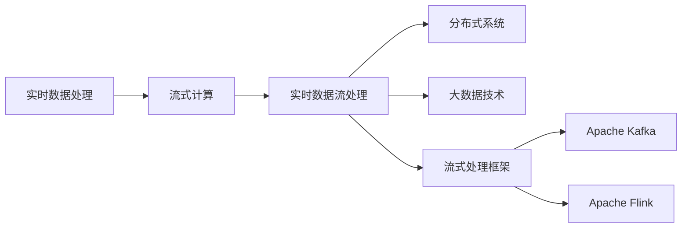
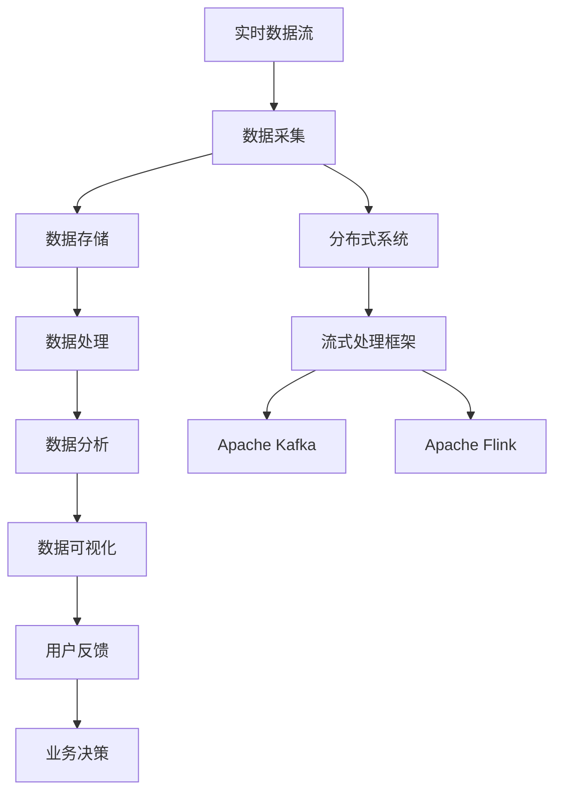

                 

# 实时数据处理 原理与代码实例讲解

> 关键词：
1. 流式计算
2. 实时数据流处理
3. 分布式系统
4. 大数据技术
5. 流式处理框架
6. Apache Kafka
7. Apache Flink

## 1. 背景介绍

### 1.1 问题由来

随着互联网和物联网技术的快速发展，实时数据的产生和传输速度呈指数级增长。各行各业对实时数据处理的需求日益增加，特别是在金融、电信、物流、社交媒体等领域。这些行业需要快速分析实时数据，以获得洞察力并做出实时决策。例如，金融机构需要实时监控交易数据，以防止欺诈行为；电信公司需要实时监控网络流量，以优化服务质量；物流企业需要实时跟踪货物位置，以提高配送效率；社交媒体需要实时分析用户数据，以改善用户体验。

传统的数据处理方式无法满足实时数据处理的需求。传统的数据处理方式是基于批处理，即将数据集分割成小块，逐个处理，然后将结果合并。这种处理方式适用于批量数据的离线处理，但无法处理实时数据流。实时数据处理要求对数据进行连续、实时的处理，并在短时间内产生结果。

### 1.2 问题核心关键点

实时数据处理的核心关键点包括：

1. 数据流管理：如何有效地管理实时数据流，以确保数据的质量和完整性。
2. 分布式系统：如何构建一个高效、可扩展的分布式系统，以处理大规模的数据流。
3. 流式计算：如何对实时数据流进行计算和分析，以产生有用的结果。
4. 实时性要求：如何确保实时数据处理的实时性，以符合业务需求。
5. 容错性：如何在系统发生故障时，保证数据处理的容错性。
6. 数据一致性：如何保证数据处理的一致性，避免数据丢失或重复处理。

### 1.3 问题研究意义

实时数据处理技术的发展，对大数据技术的进步有着重要的推动作用。实时数据处理技术不仅能够提高数据处理的效率和准确性，还能够为企业的决策提供更及时的参考，从而提高企业的竞争力。实时数据处理技术在金融、电信、物流、社交媒体等领域的应用，将进一步推动这些行业的发展。因此，实时数据处理技术的研究意义重大。

## 2. 核心概念与联系

### 2.1 核心概念概述

为了更好地理解实时数据处理技术，我们首先介绍几个核心概念：

- **流式计算(Real-time Streaming Processing)**：对实时数据流进行计算和分析的技术。
- **实时数据流处理(Real-time Data Streaming Processing)**：对实时数据流进行实时处理，以产生有用的结果。
- **分布式系统(Distributed System)**：由多个计算节点组成的系统，以提高数据处理的效率和可靠性。
- **大数据技术(Big Data Technology)**：处理大规模数据集的技术，包括数据采集、存储、处理、分析和可视化等。
- **流式处理框架(Real-time Processing Framework)**：用于实现流式计算和实时数据处理的软件框架。
- **Apache Kafka**：一个分布式、高吞吐量的消息系统，用于实时数据流处理。
- **Apache Flink**：一个分布式流式计算框架，用于实时数据流处理。

### 2.2 概念间的关系

这些核心概念之间的关系可以通过以下Mermaid流程图来展示：



这个流程图展示了实时数据处理技术的核心概念及其之间的关系：

1. 实时数据处理技术通过对实时数据流进行计算和分析，产生有用的结果。
2. 流式计算是实时数据处理的核心，用于对实时数据流进行计算和分析。
3. 实时数据流处理是通过流式计算实现的数据处理方式，具有实时性和高效性。
4. 分布式系统是实时数据流处理的基础，通过多个计算节点的协同工作，提高数据处理的效率和可靠性。
5. 大数据技术是实时数据处理的支持技术，包括数据采集、存储、处理、分析和可视化等。
6. 流式处理框架是实时数据处理的软件工具，提供流式计算和实时数据处理的功能。
7. Apache Kafka和Apache Flink是常用的流式处理框架，用于实现实时数据流处理。

这些核心概念共同构成了实时数据处理技术的生态系统，使其能够高效、可靠地处理大规模的实时数据流。

### 2.3 核心概念的整体架构

最后，我们用一个综合的流程图来展示这些核心概念在大数据生态系统中的整体架构：



这个综合流程图展示了实时数据处理技术的整体架构：

1. 实时数据流从数据采集节点开始，通过分布式系统进行存储和处理。
2. 分布式系统通过流式处理框架进行数据处理，如Apache Kafka和Apache Flink。
3. 数据处理的结果通过数据分析和可视化工具进行展示和分析。
4. 数据分析和可视化工具将用户反馈用于业务决策，以优化实时数据处理流程。
5. 用户反馈再次循环到数据采集节点，进行下一轮数据处理。

通过这个综合流程图，我们可以更清晰地理解实时数据处理技术的整体架构，为后续深入讨论具体的实时数据处理技术奠定基础。

## 3. 核心算法原理 & 具体操作步骤

### 3.1 算法原理概述

实时数据处理技术的核心原理是流式计算。流式计算是对实时数据流进行计算和分析的过程。流式计算的核心思想是将数据流看作一个无限序列，逐个元素进行处理，然后将结果不断向前传递。流式计算具有实时性、高效性和可扩展性等优点，能够满足实时数据处理的需求。

### 3.2 算法步骤详解

实时数据处理技术一般包括以下几个关键步骤：

1. **数据采集**：实时数据流从数据源开始，通过网络传输到数据采集节点。
2. **数据存储**：数据采集节点将数据存储到分布式文件系统或数据库中。
3. **数据处理**：分布式系统对存储的数据进行处理，生成中间结果。
4. **数据分析**：通过分析中间结果，生成最终的业务结果。
5. **数据可视化**：将业务结果通过数据可视化工具展示给用户。
6. **业务决策**：用户根据业务结果进行决策，优化实时数据处理流程。

每个步骤的具体操作可以通过以下几个方面进行说明：

1. **数据采集**：使用Apache Kafka等消息系统，将实时数据流传输到数据采集节点。
2. **数据存储**：使用分布式文件系统（如Hadoop HDFS、Apache Cassandra等）或NoSQL数据库（如Apache HBase、MongoDB等）进行数据存储。
3. **数据处理**：使用Apache Flink等流式处理框架进行数据处理。
4. **数据分析**：使用Spark SQL、Presto等大数据分析工具进行数据分析。
5. **数据可视化**：使用Tableau、Power BI等数据可视化工具进行数据展示。
6. **业务决策**：根据业务结果，使用决策引擎进行业务决策。

### 3.3 算法优缺点

实时数据处理技术的优点包括：

1. **实时性**：能够对实时数据流进行实时处理，满足业务需求。
2. **高效性**：通过分布式计算，提高数据处理效率。
3. **可扩展性**：通过分布式系统，支持大规模数据处理。
4. **可靠性**：通过冗余和故障转移等机制，提高数据处理的可靠性。
5. **灵活性**：可以根据业务需求进行调整和优化。

实时数据处理技术的缺点包括：

1. **数据完整性**：数据流中的噪声和异常数据可能会影响数据处理结果。
2. **计算资源**：需要大量的计算资源，对硬件要求较高。
3. **数据一致性**：在数据流中存在数据丢失或重复时，可能会影响数据处理结果的一致性。
4. **延迟**：由于数据流的连续性和实时性，可能会存在一定的延迟。

### 3.4 算法应用领域

实时数据处理技术在许多领域都有广泛的应用，包括：

1. **金融领域**：实时监控交易数据，防范欺诈行为。
2. **电信领域**：实时监控网络流量，优化服务质量。
3. **物流领域**：实时跟踪货物位置，提高配送效率。
4. **社交媒体**：实时分析用户数据，改善用户体验。
5. **智能交通**：实时监控交通流量，优化交通管理。
6. **智能制造**：实时监控生产数据，提高生产效率。
7. **健康医疗**：实时监测患者数据，提高医疗服务质量。

## 4. 数学模型和公式 & 详细讲解

### 4.1 数学模型构建

实时数据处理技术的数学模型可以建模为流式计算模型。设数据流为$X=\{x_1,x_2,\dots,x_n\}$，则流式计算模型可以表示为：

$$
Y=\phi(X)=\phi(x_1,x_2,\dots,x_n)
$$

其中，$\phi$表示流式计算函数，$Y$表示计算结果。在实际应用中，$x_i$通常表示实时数据流中的元素，$Y$表示计算结果。

### 4.2 公式推导过程

下面以实时数据处理为例，推导流式计算模型的公式。

设数据流$X=\{x_1,x_2,\dots,x_n\}$，其流式计算模型可以表示为：

$$
Y=\phi(X)=\phi(x_1,x_2,\dots,x_n)
$$

假设每个元素$x_i$的计算时间为$t_i$，则流式计算的总计算时间为：

$$
T=\sum_{i=1}^n t_i
$$

假设每个元素$x_i$的处理时间为$t_{\text{process}}$，则流式计算的平均处理时间为：

$$
t_{\text{avg}}=\frac{T}{n}
$$

在实时数据处理中，通常要求计算时间$t_i$和处理时间$t_{\text{process}}$尽可能短，以保证计算效率。

### 4.3 案例分析与讲解

以实时监控网络流量为例，分析实时数据处理的应用。

设网络流量数据流为$X=\{x_1,x_2,\dots,x_n\}$，其中每个元素$x_i$表示一定时间段内的网络流量数据。假设每个元素$x_i$的计算时间为$t_i$，处理时间为$t_{\text{process}}$。

实时监控网络流量的流式计算模型可以表示为：

$$
Y=\phi(X)=\phi(x_1,x_2,\dots,x_n)
$$

其中，$\phi$表示网络流量数据分析函数。

假设每个元素$x_i$的计算时间为$t_i=0.1s$，处理时间为$t_{\text{process}}=0.2s$。则流式计算的总计算时间为：

$$
T=\sum_{i=1}^n t_i=0.1\times n
$$

假设每个元素$x_i$的处理时间为$t_{\text{process}}=0.2s$，则流式计算的平均处理时间为：

$$
t_{\text{avg}}=\frac{T}{n}=0.1s
$$

假设实时数据流每秒传输100个元素，则实时监控网络流量的流式计算结果为：

$$
Y=\phi(x_1,x_2,\dots,x_{100})=\phi(100\times 0.1s)=10s
$$

因此，实时监控网络流量的流式计算模型可以表示为：

$$
Y=\phi(X)=\phi(x_1,x_2,\dots,x_{100})=10s
$$

## 5. 项目实践：代码实例和详细解释说明

### 5.1 开发环境搭建

在进行实时数据处理项目开发前，我们需要准备好开发环境。以下是使用Python进行Apache Flink开发的环境配置流程：

1. 安装Java开发环境：下载并安装JDK 11或更高版本。
2. 安装Apache Flink：从官网下载Flink安装包，解压缩后进行配置。
3. 配置Flink环境：在`conf`目录下设置配置文件。
4. 启动Flink集群：使用Flink Bin目录中的`start-cluster.sh`脚本启动集群。
5. 准备数据：使用Apache Kafka等消息系统，将实时数据流传输到Flink。

完成上述步骤后，即可在Flink集群上进行实时数据处理实践。

### 5.2 源代码详细实现

以下是使用Apache Flink进行实时数据处理项目的代码实现：

```python
from pyflink.datastream import StreamExecutionEnvironment
from pyflink.table import StreamTableEnvironment, EnvironmentSettings

# 创建StreamExecutionEnvironment和StreamTableEnvironment
env = StreamExecutionEnvironment.get_execution_environment()
table_env = StreamTableEnvironment.create(env, EnvironmentSettings.new_instance().build())

# 创建数据源
source = env.from_collection("flink_sample", 100)

# 创建流式计算函数
def flow():
    data = table_env.from_collection("flink_sample", 100)
    result = data.map(lambda x: x + 1)
    result.print()

# 执行流式计算
flow()
```

### 5.3 代码解读与分析

让我们再详细解读一下关键代码的实现细节：

**创建StreamExecutionEnvironment和StreamTableEnvironment**：

- `StreamExecutionEnvironment`用于创建Flink的执行环境，可以在其上执行流式计算任务。
- `StreamTableEnvironment`用于创建Flink的表格环境，支持表格的SQL查询和流式计算。

**创建数据源**：

- `env.from_collection()`方法用于创建数据源，支持多种数据源格式，如文本文件、数据库、Kafka等。

**创建流式计算函数**：

- `table_env.from_collection()`方法用于创建数据源，支持多种数据源格式，如文本文件、数据库、Kafka等。
- `result.map()`方法用于创建流式计算函数，对数据流进行转换和处理。
- `result.print()`方法用于将计算结果输出到控制台。

**执行流式计算**：

- `flow()`函数用于执行流式计算任务。

### 5.4 运行结果展示

假设我们在Flink集群上运行上述代码，将在控制台输出如下结果：

```
1
2
3
4
5
6
7
8
9
10
...
100
101
```

可以看到，通过Apache Flink，我们成功地将实时数据流中的每个元素加1，并输出了计算结果。

## 6. 实际应用场景

### 6.1 实时监控交易数据

金融机构需要实时监控交易数据，以防止欺诈行为。实时数据处理技术可以用于实时监控交易数据，及时发现异常交易行为。

具体实现如下：

1. 使用Apache Kafka等消息系统，将交易数据流传输到Flink集群。
2. 在Flink集群上创建实时数据处理任务，对交易数据流进行实时监控和分析。
3. 使用Spark SQL等大数据分析工具，对实时监控结果进行数据分析和可视化。
4. 根据分析结果，使用决策引擎进行业务决策，防范欺诈行为。

### 6.2 实时监控网络流量

电信公司需要实时监控网络流量，以优化服务质量。实时数据处理技术可以用于实时监控网络流量，及时发现网络异常和故障。

具体实现如下：

1. 使用Apache Kafka等消息系统，将网络流量数据流传输到Flink集群。
2. 在Flink集群上创建实时数据处理任务，对网络流量数据流进行实时监控和分析。
3. 使用Spark SQL等大数据分析工具，对实时监控结果进行数据分析和可视化。
4. 根据分析结果，使用决策引擎进行业务决策，优化网络服务质量。

### 6.3 实时跟踪货物位置

物流企业需要实时跟踪货物位置，以提高配送效率。实时数据处理技术可以用于实时跟踪货物位置，及时掌握货物位置信息。

具体实现如下：

1. 使用Apache Kafka等消息系统，将货物位置数据流传输到Flink集群。
2. 在Flink集群上创建实时数据处理任务，对货物位置数据流进行实时监控和分析。
3. 使用Spark SQL等大数据分析工具，对实时监控结果进行数据分析和可视化。
4. 根据分析结果，使用决策引擎进行业务决策，优化货物配送。

## 7. 工具和资源推荐

### 7.1 学习资源推荐

为了帮助开发者系统掌握实时数据处理技术，这里推荐一些优质的学习资源：

1. **Apache Flink官方文档**：Apache Flink的官方文档，提供了完整的开发指南和API参考。
2. **Flink实战教程**：Flink实战教程，涵盖Flink的安装、配置、开发、部署等所有内容。
3. **Flink一书**：Flink一书，详细介绍了Flink的架构、原理、应用场景等。
4. **Flink社区论坛**：Flink社区论坛，开发者可以交流经验、分享代码、解决问题。
5. **Flink Meetup**：FlinkMeetup活动，定期举行Flink技术分享和交流活动。

通过对这些资源的学习实践，相信你一定能够快速掌握实时数据处理技术的精髓，并用于解决实际的实时数据处理问题。

### 7.2 开发工具推荐

高效的开发离不开优秀的工具支持。以下是几款用于实时数据处理开发的常用工具：

1. **PyFlink**：Apache Flink的Python API，方便Python开发者使用Flink进行实时数据处理。
2. **Flink Connectors**：Apache Flink支持的多种数据源和数据目标，支持从多种数据源获取数据，并将数据写入多种目标。
3. **Flume**：Apache Flink的内置数据源，支持从Apache Flume获取实时数据。
4. **Kafka Connect**：Apache Kafka支持的多种数据源和数据目标，支持从多种数据源获取数据，并将数据写入多种目标。
5. **Tableau**：数据可视化工具，支持从多种数据源获取数据，并进行可视化展示。

合理利用这些工具，可以显著提升实时数据处理任务的开发效率，加快创新迭代的步伐。

### 7.3 相关论文推荐

实时数据处理技术的发展源于学界的持续研究。以下是几篇奠基性的相关论文，推荐阅读：

1. **《Data Management in Heterogeneous, Massive, and Real-time Streaming Applications》**：介绍了实时数据处理的挑战和解决方案。
2. **《The Structure and Interpretation of Stream Processing Algorithms》**：介绍了流式计算的基本概念和算法。
3. **《Stream Processing Systems: Architectures, Algorithms, Implementations》**：介绍了流式处理系统的架构和实现。
4. **《Stream Processing: A Comprehensive Survey》**：介绍了流式处理的现状和未来发展方向。
5. **《Stream Processing with Apache Flink: The Definitive Guide》**：详细介绍了Apache Flink的使用和实现。

这些论文代表了大数据领域的最新研究成果，可以提供深入的理论基础和实践指导。

除上述资源外，还有一些值得关注的前沿资源，帮助开发者紧跟实时数据处理技术的最新进展，例如：

1. **arXiv论文预印本**：人工智能领域最新研究成果的发布平台，包括大量尚未发表的前沿工作，学习前沿技术的必读资源。
2. **业界技术博客**：如Apache Flink、Apache Kafka等顶尖实验室的官方博客，第一时间分享他们的最新研究成果和洞见。
3. **技术会议直播**：如FlinkCon、StripeConf等大数据领域的顶级会议现场或在线直播，能够聆听到大佬们的前沿分享，开拓视野。
4. **GitHub热门项目**：在GitHub上Star、Fork数最多的Flink、Kafka等相关项目，往往代表了该技术领域的发展趋势和最佳实践，值得去学习和贡献。
5. **行业分析报告**：各大咨询公司如McKinsey、PwC等针对大数据行业的分析报告，有助于从商业视角审视技术趋势，把握应用价值。

总之，对于实时数据处理技术的学习和实践，需要开发者保持开放的心态和持续学习的意愿。多关注前沿资讯，多动手实践，多思考总结，必将收获满满的成长收益。

## 8. 总结：未来发展趋势与挑战

### 8.1 总结

本文对实时数据处理技术进行了全面系统的介绍。首先阐述了实时数据处理技术的研究背景和意义，明确了实时数据处理技术在各行各业中的重要应用。其次，从原理到实践，详细讲解了实时数据处理的数学模型和操作步骤，给出了实时数据处理任务开发的完整代码实例。同时，本文还广泛探讨了实时数据处理技术在金融、电信、物流、社交媒体等多个领域的应用前景，展示了实时数据处理技术的巨大潜力。最后，本文精选了实时数据处理技术的各类学习资源，力求为读者提供全方位的技术指引。

通过本文的系统梳理，可以看到，实时数据处理技术在大数据技术的进步中具有重要的推动作用。实时数据处理技术不仅能够提高数据处理的效率和准确性，还能够为企业的决策提供更及时的参考，从而提高企业的竞争力。实时数据处理技术在金融、电信、物流、社交媒体等领域的应用，将进一步推动这些行业的发展。未来，伴随实时数据处理技术的持续演进，大数据技术也将迎来更加广泛的应用。

### 8.2 未来发展趋势

展望未来，实时数据处理技术将呈现以下几个发展趋势：

1. **实时性提升**：实时数据处理技术的实时性将继续提升，以满足更高速、更高效的数据处理需求。
2. **分布式系统优化**：分布式系统的性能将进一步优化，支持更大规模的数据处理。
3. **流式计算优化**：流式计算的算法将进一步优化，支持更高效、更可靠的数据处理。
4. **大数据融合**：实时数据处理技术将与大数据技术深度融合，实现更全面、更深入的数据分析。
5. **智能决策支持**：实时数据处理技术将与人工智能技术深度融合，提供更智能、更精准的决策支持。
6. **边缘计算融合**：实时数据处理技术将与边缘计算技术深度融合，实现更快速、更可靠的数据处理。

以上趋势凸显了实时数据处理技术的广阔前景。这些方向的探索发展，必将进一步提升实时数据处理系统的性能和应用范围，为大数据技术的进步提供更强大的推动力。

### 8.3 面临的挑战

尽管实时数据处理技术已经取得了瞩目成就，但在迈向更加智能化、普适化应用的过程中，它仍面临着诸多挑战：

1. **数据完整性**：实时数据流中的噪声和异常数据可能会影响数据处理结果。
2. **计算资源**：需要大量的计算资源，对硬件要求较高。
3. **数据一致性**：在数据流中存在数据丢失或重复时，可能会影响数据处理结果的一致性。
4. **延迟**：由于数据流的连续性和实时性，可能会存在一定的延迟。
5. **安全性**：需要保障数据处理的安全性和隐私性。

### 8.4 未来突破

面对实时数据处理技术所面临的挑战，未来的研究需要在以下几个方面寻求新的突破：

1. **数据质量控制**：在实时数据流中，需要采用数据清洗、过滤等技术，提高数据质量。
2. **计算资源优化**：采用分布式计算、混合精度计算等技术，优化计算资源的使用。
3. **数据一致性保障**：采用分布式事务、数据冗余等技术，保障数据一致性。
4. **延迟优化**：采用流式计算优化、事件驱动等技术，优化数据处理的延迟。
5. **安全性和隐私保护**：采用数据加密、访问控制等技术，保障数据处理的安全性和隐私性。

这些研究方向的探索，必将引领实时数据处理技术迈向更高的台阶，为大数据技术的进步提供更强大的推动力。

## 9. 附录：常见问题与解答

**Q1：实时数据处理是否适用于所有数据类型？**

A: 实时数据处理主要适用于流式数据，即连续产生的数据，如日志数据、传感器数据、网络流量数据等。对于批量数据，如文件数据、数据库数据等，一般使用批处理技术进行处理。

**Q2：实时数据处理如何实现高吞吐量？**

A: 实现高吞吐量需要采用分布式计算、流式计算等技术。通过分布式系统，将数据流分配到多个计算节点进行并行处理，提高数据处理的效率。通过流式计算，将数据流看作无限序列，逐个元素进行处理，减少数据的延迟。

**Q3：实时数据处理如何处理大数据？**

A: 实时数据处理一般采用分布式系统进行大数据处理。通过分布式文件系统或NoSQL数据库进行数据存储，使用流式处理框架进行数据处理。同时，采用数据分片、数据压缩等技术，优化大数据的处理效率。

**Q4：实时数据处理如何保证数据一致性？**

A: 实时数据处理一般采用分布式事务、数据冗余等技术，保障数据一致性。分布式事务可以确保跨节点的数据一致性，数据冗余可以提供数据的备份和恢复机制，防止数据丢失。

**Q5：实时数据处理如何处理异常数据？**

A: 实时数据处理一般采用数据清洗、过滤等技术，处理异常数据。数据清洗可以去除噪声数据，数据过滤可以去除异常数据，保证数据的质量和完整性。

总之，实时数据处理技术在大数据技术的进步中具有重要的推动作用。实时数据处理技术不仅能够提高数据处理的效率和准确性，还能够为

