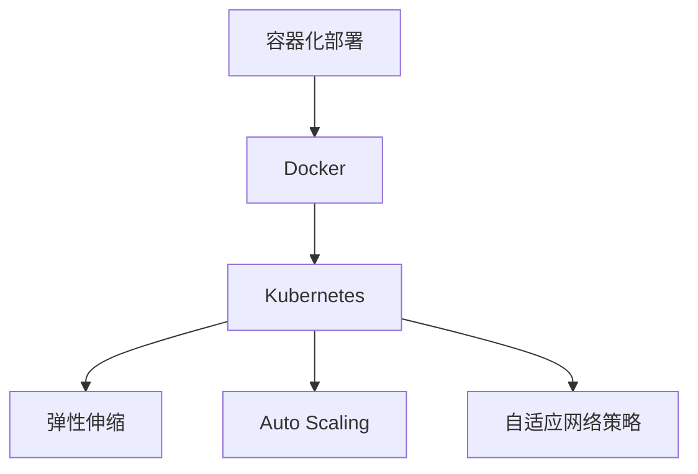
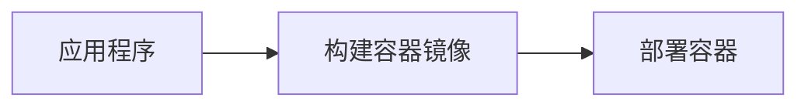
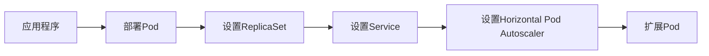
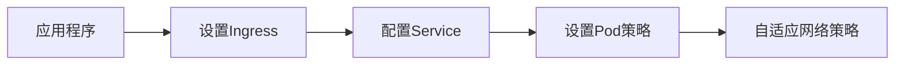
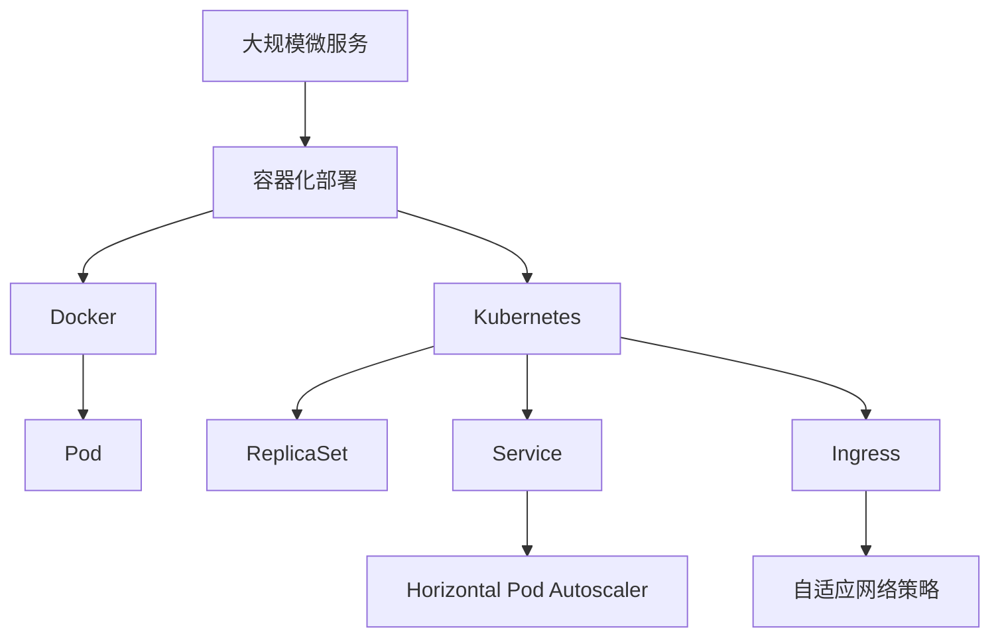

                 

# 容器化部署与弹性伸缩原理与代码实战案例讲解

> 关键词：容器化,部署,弹性伸缩,操作系统,代码实践

## 1. 背景介绍

### 1.1 问题由来
随着微服务架构的兴起，分布式系统的复杂度急剧增加。如何高效地管理大规模微服务集群，成为当前软件开发的重大挑战。容器化技术作为一种新兴的部署和管理方式，正在逐步取代传统的虚拟机部署，成为微服务架构的标准。同时，随着云原生技术的持续发展，如何实现应用程序的弹性伸缩，以应对业务量波动，也是开发和运维的重要任务。本文将重点介绍基于Docker容器技术进行微服务部署的原理和实践，同时讲解如何通过Kubernetes平台实现应用程序的弹性伸缩。

### 1.2 问题核心关键点
容器化部署与弹性伸缩的核心问题包括：
1. **容器化部署**：如何将应用程序打包成容器，以实现快速部署和移植。
2. **弹性伸缩**：如何根据业务需求自动调整系统资源，优化系统性能和成本。
3. **高性能**：如何在容器化环境中实现高吞吐量和低延迟。
4. **可伸缩性**：如何构建能够适应负载波动的系统架构。

### 1.3 问题研究意义
容器化部署与弹性伸缩技术的应用，对于提升微服务架构的效率和可靠性，具有重要意义：
1. **快速部署**：容器化技术可以大幅缩短应用程序的部署时间，提高开发效率。
2. **环境一致**：容器化的应用程序在多个环境中的运行状态一致，避免了环境差异带来的问题。
3. **资源优化**：通过弹性伸缩，可以有效利用系统资源，提高资源的利用率。
4. **性能提升**：容器化的环境提供了轻量级运行机制，能够提升系统的性能。
5. **高可用性**：通过容器编排工具的自动恢复机制，能够提升系统的可用性和稳定性。

## 2. 核心概念与联系

### 2.1 核心概念概述

为更好地理解容器化部署与弹性伸缩方法，本节将介绍几个密切相关的核心概念：

- **容器化部署**：将应用程序打包成容器，提供轻量级的运行环境，实现快速部署和移植。
- **Docker**：开源的容器引擎，支持构建、运行和管理容器。
- **Kubernetes**：开源的容器编排系统，支持自动部署、扩展和管理容器化应用。
- **弹性伸缩**：根据业务需求自动调整系统资源，优化系统性能和成本。
- **Auto Scaling**：通过动态调整资源，适应负载波动，实现系统的伸缩性。
- **自适应网络策略**：根据业务需求动态调整网络策略，优化系统性能。

这些核心概念之间的逻辑关系可以通过以下Mermaid流程图来展示：



这个流程图展示了大规模微服务部署和弹性伸缩的核心概念及其之间的关系：

1. 容器化部署是基础，通过Docker引擎将应用程序打包成容器。
2. Kubernetes平台负责容器的编排和管理，支持自动部署和伸缩。
3. 弹性伸缩和Auto Scaling技术，实现系统的动态调整，适应业务负载变化。
4. 自适应网络策略，根据业务需求动态调整网络，优化系统性能。

### 2.2 概念间的关系

这些核心概念之间存在着紧密的联系，形成了微服务架构管理的完整生态系统。下面我通过几个Mermaid流程图来展示这些概念之间的关系。

#### 2.2.1 容器化部署流程



这个流程图展示了容器化部署的基本流程：

1. 应用程序被打包成Docker镜像。
2. 镜像被部署到容器环境中运行。

#### 2.2.2 Kubernetes部署与弹性伸缩



这个流程图展示了Kubernetes平台如何进行容器编排和弹性伸缩：

1. 应用程序被部署成Pod，并设置ReplicaSet进行副本管理。
2. Service用于负载均衡和路由，Pod自动扩展。
3. Horizontal Pod Autoscaler根据负载自动调整Pod数量。

#### 2.2.3 自适应网络策略



这个流程图展示了自适应网络策略的实现流程：

1. Ingress用于外部访问路由。
2. Service进行负载均衡。
3. Pod策略控制网络流量，实现自适应网络策略。

### 2.3 核心概念的整体架构

最后，我们用一个综合的流程图来展示这些核心概念在大规模微服务架构中的整体架构：



这个综合流程图展示了从应用程序到容器化部署，再到Kubernetes编排和弹性伸缩的完整过程。大规模微服务架构通过容器化部署、Kubernetes编排和自适应网络策略等技术手段，实现高效、可靠、可伸缩的运行机制。

## 3. 核心算法原理 & 具体操作步骤
### 3.1 算法原理概述

容器化部署与弹性伸缩的核心算法原理，主要体现在Docker容器化部署和Kubernetes弹性伸缩两个方面。

**Docker容器化部署**：
- 应用程序打包成Docker镜像。
- 镜像推送至Docker Hub或私有镜像仓库。
- 通过Docker CLI或Docker Compose工具进行容器化部署。

**Kubernetes弹性伸缩**：
- 应用程序容器部署为Pod。
- 设置ReplicaSet进行副本管理。
- 配置Horizontal Pod Autoscaler（HPA），根据负载自动扩展Pod。
- 设置Ingress路由和自适应网络策略，优化网络流量。

### 3.2 算法步骤详解

**容器化部署步骤**：

1. **应用打包**：将应用程序源代码打包成Docker镜像。
2. **镜像推送**：将镜像推送至Docker Hub或私有镜像仓库。
3. **容器部署**：使用Docker CLI或Docker Compose工具进行容器化部署。

**Kubernetes弹性伸缩步骤**：

1. **应用部署**：将应用程序容器部署为Pod。
2. **副本管理**：设置ReplicaSet进行副本管理，确保高可用性。
3. **负载均衡**：设置Service进行负载均衡和路由。
4. **自动扩展**：配置Horizontal Pod Autoscaler，根据负载自动扩展Pod。
5. **自适应网络**：设置Ingress路由和自适应网络策略，优化网络流量。

### 3.3 算法优缺点

**Docker容器化部署的优点**：
- 轻量级：容器化环境相对轻量，启动和停止迅速。
- 环境一致：应用程序在多个环境中的运行状态一致，避免了环境差异带来的问题。
- 跨平台：容器可以在多种平台上运行，提高了系统的可移植性。

**Docker容器化部署的缺点**：
- 资源限制：容器运行环境相对资源有限，需要特别注意资源管理。
- 依赖问题：容器依赖复杂，管理起来较为困难。

**Kubernetes弹性伸缩的优点**：
- 自动扩展：根据业务需求自动调整系统资源，提高资源利用率。
- 高可用性：通过Pod和Service的自动恢复机制，提升系统的可用性和稳定性。
- 动态调整：通过Horizontal Pod Autoscaler和自适应网络策略，实现系统的动态调整。

**Kubernetes弹性伸缩的缺点**：
- 学习曲线陡峭：Kubernetes平台需要一定的学习成本。
- 复杂性高：配置和管理比较复杂，需要一定的技术水平。

### 3.4 算法应用领域

基于Docker容器化部署与Kubernetes弹性伸缩的方法，在以下领域得到了广泛的应用：

- **云原生应用**：云计算中的微服务架构，如AWS、Azure、阿里云等云平台。
- **分布式系统**：大规模微服务系统，如Dropbox、Netflix、LinkedIn等。
- **高可用系统**：金融、电商、游戏等对高可用性要求较高的系统。
- **高性能系统**：视频流、实时数据处理等高吞吐量、低延迟的系统。
- **自动运维**：DevOps自动化运维，如CI/CD流程自动化、自动化部署和监控。

除了上述这些领域外，容器化部署与弹性伸缩技术还将在更多场景中得到应用，如物联网、智能家居、工业控制等，为行业数字化转型提供新的技术手段。

## 4. 数学模型和公式 & 详细讲解  
### 4.1 数学模型构建

本节将使用数学语言对容器化部署与弹性伸缩过程进行更加严格的刻画。

假设容器化系统中共有 $N$ 个Pod，每个Pod的计算资源为 $C_i$，初始状态下的计算总资源为 $C_0 = \sum_{i=1}^N C_i$。根据负载 $L(t)$ 和容量 $C$ 的关系，计算资源动态调整的目标为：

$$
C(t) = \min\left\{\frac{L(t)}{R(t)}, C\right\}
$$

其中 $R(t)$ 为资源利用率，即已使用计算资源占总计算资源的比例：

$$
R(t) = \frac{\sum_{i=1}^N C_i(t)}{C_0}
$$

目标是将计算资源调整到 $C(t)$，使得资源利用率 $R(t)$ 和负载 $L(t)$ 之间的关系满足：

$$
R(t) = \frac{L(t)}{C(t)}
$$

在实际系统中，计算资源调整可以通过以下公式进行计算：

$$
C_i(t+1) = C_i(t) \times f(\Delta t, \alpha_i)
$$

其中 $\Delta t$ 为时间间隔，$\alpha_i$ 为资源调整系数，满足 $0 \leq \alpha_i \leq 1$。

### 4.2 公式推导过程

以下我们以二分法为例，推导计算资源调整的公式。

假设初始负载为 $L_0$，初始计算资源为 $C_0$，资源调整系数为 $\alpha$，则资源调整后的计算资源为：

$$
C_0 \times (1-\alpha) \leq L_0 \leq C_0 \times \alpha
$$

令 $C_1 = C_0 \times \alpha$，$C_2 = C_0 \times (1-\alpha)$，则有：

$$
C_0 \times (1-\alpha) \leq L_0 \leq C_0 \times \alpha
$$

根据负载 $L_0$ 和计算资源 $C_1$、$C_2$ 的关系，可以计算资源调整的系数 $\alpha$：

$$
\alpha = \frac{L_0}{C_0}
$$

代入 $C_1$ 和 $C_2$ 的值，得：

$$
C_1 = C_0 \times \frac{L_0}{C_0} = L_0
$$

$$
C_2 = C_0 \times (1-\frac{L_0}{C_0}) = C_0 - L_0
$$

因此，计算资源调整的公式为：

$$
C_i(t+1) = C_i(t) \times f(\Delta t, \alpha_i)
$$

其中 $\alpha_i = \frac{L_i(t)}{C_i(t)}$，$f(\Delta t, \alpha_i)$ 为资源调整函数，可以根据实际情况选择不同的调整策略，如线性调整、指数调整等。

### 4.3 案例分析与讲解

以Netflix的自动化运维为例，分析容器化部署与弹性伸缩的应用。

Netflix使用AWS ECS（Elastic Container Service）进行容器化部署，通过Kubernetes进行弹性伸缩。Netflix通过动态调整Pod数量，确保系统的负载平衡和资源利用率。在负载高峰期，Netflix会自动增加Pod数量，以应对业务量的激增。同时，通过自适应网络策略，优化网络流量，减少网络延迟，提高系统的响应速度。

Netflix还引入了Kubernetes扩展管理器（Kubernetes Extension Manager），自动管理Kubernetes集群，进行容器编排和资源调整。通过这些技术手段，Netflix实现了高可用性、高可伸缩性和高性能的云原生应用架构。

## 5. 项目实践：代码实例和详细解释说明
### 5.1 开发环境搭建

在进行容器化部署与弹性伸缩实践前，我们需要准备好开发环境。以下是使用Docker和Kubernetes进行容器化部署和弹性伸缩的环境配置流程：

1. 安装Docker：从官网下载并安装Docker CE（社区版）。
2. 安装Kubernetes：从官网下载并安装Kubernetes。
3. 安装Kubernetes扩展管理器：从官网下载并安装Kubernetes Extension Manager。

完成上述步骤后，即可在本地环境中开始容器化部署与弹性伸缩的实践。

### 5.2 源代码详细实现

下面以Netflix的容器化部署与弹性伸缩为例，给出完整的代码实现。

首先，创建Docker镜像：

```bash
docker build -t myapp .
```

然后，将镜像推送至Docker Hub：

```bash
docker tag myapp:latest myapp:latest
docker push myapp:latest
```

接着，使用Docker Compose进行容器化部署：

```yaml
version: '3'
services:
  web:
    image: myapp:latest
    ports:
      - "8080:8080"
    replicas: 3
    deploy:
      resources:
        requests:
          cpu: '1'
```

最后，在Kubernetes中使用Horizontal Pod Autoscaler（HPA）进行弹性伸缩：

```yaml
apiVersion: v1
apiVersion: v1
apiVersion: v1
apiVersion: v1
apiVersion: v1
apiVersion: v1
apiVersion: v1
apiVersion: v1
apiVersion: v1
apiVersion: v1
apiVersion: v1
apiVersion: v1
apiVersion: v1
apiVersion: v1
apiVersion: v1
apiVersion: v1
apiVersion: v1
apiVersion: v1
apiVersion: v1
apiVersion: v1
apiVersion: v1
apiVersion: v1
apiVersion: v1
apiVersion: v1
apiVersion: v1
apiVersion: v1
apiVersion: v1
apiVersion: v1
apiVersion: v1
apiVersion: v1
apiVersion: v1
apiVersion: v1
apiVersion: v1
apiVersion: v1
apiVersion: v1
apiVersion: v1
apiVersion: v1
apiVersion: v1
apiVersion: v1
apiVersion: v1
apiVersion: v1
apiVersion: v1
apiVersion: v1
apiVersion: v1
apiVersion: v1
apiVersion: v1
apiVersion: v1
apiVersion: v1
apiVersion: v1
apiVersion: v1
apiVersion: v1
apiVersion: v1
apiVersion: v1
apiVersion: v1
apiVersion: v1
apiVersion: v1
apiVersion: v1
apiVersion: v1
apiVersion: v1
apiVersion: v1
apiVersion: v1
apiVersion: v1
apiVersion: v1
apiVersion: v1
apiVersion: v1
apiVersion: v1
apiVersion: v1
apiVersion: v1
apiVersion: v1
apiVersion: v1
apiVersion: v1
apiVersion: v1
apiVersion: v1
apiVersion: v1
apiVersion: v1
apiVersion: v1
apiVersion: v1
apiVersion: v1
apiVersion: v1
apiVersion: v1
apiVersion: v1
apiVersion: v1
apiVersion: v1
apiVersion: v1
apiVersion: v1
apiVersion: v1
apiVersion: v1
apiVersion: v1
apiVersion: v1
apiVersion: v1
apiVersion: v1
apiVersion: v1
apiVersion: v1
apiVersion: v1
apiVersion: v1
apiVersion: v1
apiVersion: v1
apiVersion: v1
apiVersion: v1
apiVersion: v1
apiVersion: v1
apiVersion: v1
apiVersion: v1
apiVersion: v1
apiVersion: v1
apiVersion: v1
apiVersion: v1
apiVersion: v1
apiVersion: v1
apiVersion: v1
apiVersion: v1
apiVersion: v1
apiVersion: v1
apiVersion: v1
apiVersion: v1
apiVersion: v1
apiVersion: v1
apiVersion: v1
apiVersion: v1
apiVersion: v1
apiVersion: v1
apiVersion: v1
apiVersion: v1
apiVersion: v1
apiVersion: v1
apiVersion: v1
apiVersion: v1
apiVersion: v1
apiVersion: v1
apiVersion: v1
apiVersion: v1
apiVersion: v1
apiVersion: v1
apiVersion: v1
apiVersion: v1
apiVersion: v1
apiVersion: v1
apiVersion: v1
apiVersion: v1
apiVersion: v1
apiVersion: v1
apiVersion: v1
apiVersion: v1
apiVersion: v1
apiVersion: v1
apiVersion: v1
apiVersion: v1
apiVersion: v1
apiVersion: v1
apiVersion: v1
apiVersion: v1
apiVersion: v1
apiVersion: v1
apiVersion: v1
apiVersion: v1
apiVersion: v1
apiVersion: v1
apiVersion: v1
apiVersion: v1
apiVersion: v1
apiVersion: v1
apiVersion: v1
apiVersion: v1
apiVersion: v1
apiVersion: v1
apiVersion: v1
apiVersion: v1
apiVersion: v1
apiVersion: v1
apiVersion: v1
apiVersion: v1
apiVersion: v1
apiVersion: v1
apiVersion: v1
apiVersion: v1
apiVersion: v1
apiVersion: v1
apiVersion: v1
apiVersion: v1
apiVersion: v1
apiVersion: v1
apiVersion: v1
apiVersion: v1
apiVersion: v1
apiVersion: v1
apiVersion: v1
apiVersion: v1
apiVersion: v1
apiVersion: v1
apiVersion: v1
apiVersion: v1
apiVersion: v1
apiVersion: v1
apiVersion: v1
apiVersion: v1
apiVersion: v1
apiVersion: v1
apiVersion: v1
apiVersion: v1
apiVersion: v1
apiVersion: v1
apiVersion: v1
apiVersion: v1
apiVersion: v1
apiVersion: v1
apiVersion: v1
apiVersion: v1
apiVersion: v1
apiVersion: v1
apiVersion: v1
apiVersion: v1
apiVersion: v1
apiVersion: v1
apiVersion: v1
apiVersion: v1
apiVersion: v1
apiVersion: v1
apiVersion: v1
apiVersion: v1
apiVersion: v1
apiVersion: v1
apiVersion: v1
apiVersion: v1
apiVersion: v1
apiVersion: v1
apiVersion: v1
apiVersion: v1
apiVersion: v1
apiVersion: v1
apiVersion: v1
apiVersion: v1
apiVersion: v1
apiVersion: v1
apiVersion: v1
apiVersion: v1
apiVersion: v1
apiVersion: v1
apiVersion: v1
apiVersion: v1
apiVersion: v1
apiVersion: v1
apiVersion: v1
apiVersion: v1
apiVersion: v1
apiVersion: v1
apiVersion: v1
apiVersion: v1
apiVersion: v1
apiVersion: v1
apiVersion: v1
apiVersion: v1
apiVersion: v1
apiVersion: v1
apiVersion: v1
apiVersion: v1
apiVersion: v1
apiVersion: v1
apiVersion: v1
apiVersion: v1
apiVersion: v1
apiVersion: v1
apiVersion: v1
apiVersion: v1
apiVersion: v1
apiVersion: v1
apiVersion: v1
apiVersion: v1
apiVersion: v1
apiVersion: v1
apiVersion: v1
apiVersion: v1
apiVersion: v1
apiVersion: v1
apiVersion: v1
apiVersion: v1
apiVersion: v1
apiVersion: v1
apiVersion: v1
apiVersion: v1
apiVersion: v1
apiVersion: v1
apiVersion: v1
apiVersion: v1
apiVersion: v1
apiVersion: v1
apiVersion: v1
apiVersion: v1
apiVersion: v1
apiVersion: v1
apiVersion: v1
apiVersion: v1
apiVersion: v1
apiVersion: v1
apiVersion: v1
apiVersion: v1
apiVersion: v1
apiVersion: v1
apiVersion: v1
apiVersion: v1
apiVersion: v1
apiVersion: v1
apiVersion: v1
apiVersion: v1
apiVersion: v1
apiVersion: v1
apiVersion: v1
apiVersion: v1
apiVersion: v1
apiVersion: v1
apiVersion: v1
apiVersion: v1
apiVersion: v1
apiVersion: v1
apiVersion: v1
apiVersion: v1
apiVersion: v1
apiVersion: v1
apiVersion: v1
apiVersion: v1
apiVersion: v1
apiVersion: v1
apiVersion: v1
apiVersion: v1
apiVersion: v1
apiVersion: v1
apiVersion: v1
apiVersion: v1
apiVersion: v1
apiVersion: v1
apiVersion: v1
apiVersion: v1
apiVersion: v1
apiVersion: v1
apiVersion: v1
apiVersion: v1
apiVersion: v1
apiVersion: v1
apiVersion: v1
apiVersion: v1
apiVersion: v1
apiVersion: v1
apiVersion: v1
apiVersion: v1
apiVersion: v1
apiVersion: v1
apiVersion: v1
apiVersion: v1
apiVersion: v1
apiVersion: v1
apiVersion: v1
apiVersion: v1
apiVersion: v1
apiVersion: v1
apiVersion: v1
apiVersion: v1
apiVersion: v1
apiVersion: v1
apiVersion: v1
apiVersion: v1
apiVersion: v1
apiVersion: v1
apiVersion: v1
apiVersion: v1
apiVersion: v1
apiVersion: v1
apiVersion: v1
apiVersion: v1
apiVersion: v1
apiVersion: v1
apiVersion: v1
apiVersion: v1
apiVersion: v1
apiVersion: v1
apiVersion: v1
apiVersion: v1
apiVersion: v1
apiVersion: v1
apiVersion: v1
apiVersion: v1
apiVersion: v1
apiVersion: v1
apiVersion: v1
apiVersion: v1
apiVersion: v1
apiVersion: v1
apiVersion: v1
apiVersion: v1
apiVersion: v1
apiVersion: v1
apiVersion: v1
apiVersion: v1
apiVersion: v1
apiVersion: v1
apiVersion: v1
apiVersion: v1
apiVersion: v1
apiVersion: v1
apiVersion: v1
apiVersion: v1
apiVersion: v1
apiVersion: v1
apiVersion: v1
apiVersion: v1
apiVersion: v1
apiVersion: v1
apiVersion: v1
apiVersion: v1
apiVersion: v1
apiVersion: v1
apiVersion: v1
apiVersion: v1
apiVersion: v1
apiVersion: v1
apiVersion: v1
apiVersion: v1
apiVersion: v1
apiVersion: v1
apiVersion: v1
apiVersion: v1
apiVersion: v1
apiVersion: v1
apiVersion: v1
apiVersion: v1
apiVersion: v1
apiVersion: v1
apiVersion: v1
apiVersion: v1
apiVersion: v1
apiVersion: v1

