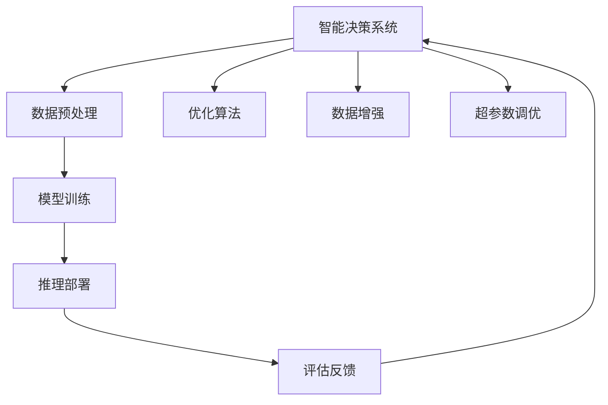
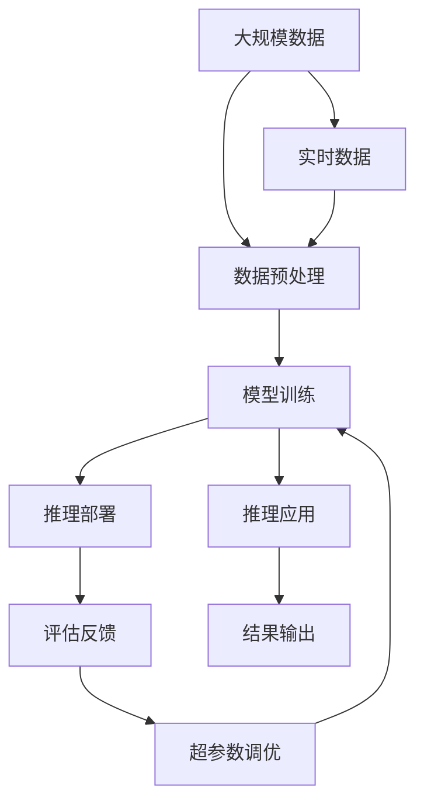

                 

# 工具使用机制在智能决策系统中的应用

> 关键词：智能决策系统,决策工具,使用机制,优化算法,数据处理,模型训练,推理部署,模型评估,智能推荐,自动化流程

## 1. 背景介绍

### 1.1 问题由来

在当今数据驱动的商业环境中，决策不再仅仅基于经验，而是需要通过数据分析和算法辅助，以确保决策的科学性和准确性。随着大数据技术的发展和人工智能算法的进步，智能决策系统（Intelligent Decision Systems）应运而生，能够帮助企业更高效地利用数据，做出更为精准的决策。

智能决策系统通常由数据收集与处理、模型训练与优化、推理与部署、评估与反馈等多个环节组成。其中，决策工具的使用机制是系统核心，其设计的好坏直接影响到决策系统的性能和可靠性。

### 1.2 问题核心关键点

智能决策系统中的决策工具使用机制，主要涉及以下几个关键点：

1. **数据预处理与清洗**：对原始数据进行去噪、填补缺失值、特征工程等处理，确保数据的质量。
2. **模型选择与训练**：选择合适的算法和模型，在给定数据集上进行训练，并调优以提高模型性能。
3. **推理与部署**：将训练好的模型部署到生产环境，进行实时推理。
4. **评估与反馈**：根据实际结果，对模型进行评估，并根据反馈不断调整模型。

这些关键点构成了一个闭环，各环节之间相互依赖，需要有效的机制来协调和优化。

### 1.3 问题研究意义

在智能决策系统的构建和应用过程中，决策工具的使用机制起着至关重要的作用。其研究意义如下：

1. **提高决策效率**：通过优化数据处理、模型训练、推理部署等环节，可以显著提升决策速度，使决策者能够及时响应市场变化。
2. **增强决策准确性**：通过科学合理的数据预处理和模型训练，能够减少人为偏见，提升决策的客观性和准确性。
3. **降低决策风险**：通过合理部署和使用模型，能够有效避免因模型选择不当导致的决策失误。
4. **支持决策自动化**：通过智能化决策工具，能够实现自动化决策流程，降低人工干预，提高决策系统的稳定性和可靠性。
5. **促进创新应用**：优化决策工具的使用机制，可以探索更多的创新应用场景，推动业务创新和转型。

## 2. 核心概念与联系

### 2.1 核心概念概述

为更好地理解智能决策系统中的决策工具使用机制，本节将介绍几个关键概念及其联系：

- **智能决策系统**：基于数据驱动，利用算法模型进行自动化决策的系统，包括数据预处理、模型训练、推理部署、评估反馈等多个环节。
- **数据预处理**：对原始数据进行去噪、填补缺失值、特征工程等处理，以提高数据质量，为模型训练提供良好的输入。
- **模型训练**：选择合适的算法和模型，在给定数据集上进行训练，并通过调优提升模型性能。
- **推理部署**：将训练好的模型部署到生产环境，进行实时推理，输出决策结果。
- **评估反馈**：根据实际结果，对模型进行评估，并根据反馈不断调整模型。
- **优化算法**：用于提升模型性能的算法，如梯度下降、随机梯度下降、Adam等。
- **数据增强**：通过对训练数据进行变换、扩充，提高模型泛化能力，减少过拟合风险。
- **超参数调优**：对模型训练过程中需要手动设定的参数进行调优，以找到最优的模型配置。

这些概念之间有着紧密的联系，共同构成了智能决策系统的核心框架。通过理解这些概念的原理和架构，可以更好地把握智能决策系统的设计思路和技术路径。

### 2.2 概念间的关系

这些核心概念之间的关系可以通过以下Mermaid流程图来展示：



这个流程图展示了智能决策系统的各个环节之间的联系：

1. 数据预处理是系统的入口，为模型训练提供数据。
2. 模型训练是系统的核心，通过优化算法和超参数调优，提升模型性能。
3. 推理部署是将训练好的模型应用到实际决策中的过程。
4. 评估反馈是根据实际结果对模型进行评估，并进行优化。
5. 优化算法和数据增强是模型训练中常用的技术手段。
6. 超参数调优是模型训练中不可或缺的一环，通过不断调整找到最优的模型配置。

这些概念共同构成了智能决策系统的完整框架，其优化和协同作用，是系统能否成功运行的关键。

### 2.3 核心概念的整体架构

最后，我们用一个综合的流程图来展示这些核心概念在大规模应用中的整体架构：



这个综合流程图展示了从原始数据到模型推理的全过程：

1. 从大规模数据中提取有价值的信息，进行数据预处理。
2. 使用优化算法和超参数调优，在训练集上训练模型。
3. 将训练好的模型部署到生产环境，进行实时推理。
4. 根据实际结果，评估模型性能并进行优化。
5. 根据评估结果，调整超参数和模型结构，再次训练模型。
6. 最终，将推理结果输出给业务系统，供决策使用。

通过这个流程图，我们可以更清晰地理解智能决策系统的工作原理和优化方向。

## 3. 核心算法原理 & 具体操作步骤
### 3.1 算法原理概述

智能决策系统中的决策工具使用机制，主要基于机器学习、深度学习等优化算法，通过数据预处理、模型训练、推理部署、评估反馈等环节，实现智能决策。其核心算法原理如下：

- **优化算法**：如梯度下降、随机梯度下降、Adam等，用于在模型训练过程中最小化损失函数，提升模型性能。
- **损失函数**：如均方误差、交叉熵、对数似然等，用于衡量模型预测结果与真实标签之间的差异。
- **模型评估指标**：如准确率、精确率、召回率、F1分数等，用于评估模型在测试集上的表现。
- **超参数**：如学习率、批量大小、迭代次数等，需要在模型训练过程中手动设置，对模型性能影响较大。

### 3.2 算法步骤详解

基于优化算法的智能决策系统使用机制，主要包括以下几个步骤：

1. **数据预处理**：对原始数据进行清洗、去噪、特征工程等处理，确保数据质量。
2. **模型选择与训练**：选择合适的算法和模型，在给定数据集上进行训练，并调优以提高模型性能。
3. **推理与部署**：将训练好的模型部署到生产环境，进行实时推理。
4. **评估与反馈**：根据实际结果，对模型进行评估，并根据反馈不断调整模型。
5. **超参数调优**：在模型训练过程中，对需要手动设定的参数进行调优，以找到最优的模型配置。

### 3.3 算法优缺点

基于优化算法的智能决策系统使用机制，具有以下优点：

- **自动化**：能够自动处理数据、训练模型、进行推理，减少人工干预，提高决策效率。
- **客观性**：通过数据和算法驱动决策，减少人为偏见，提高决策的客观性和科学性。
- **可解释性**：模型的训练过程和推理逻辑透明，便于理解和解释。

同时，也存在以下缺点：

- **高昂成本**：系统建设和维护成本较高，需要专业的数据科学家和工程师团队。
- **模型复杂性**：复杂的模型结构需要较高的计算资源和专业知识。
- **决策风险**：模型训练数据不足或质量不佳，可能导致决策失误。
- **数据隐私**：涉及大量敏感数据，需要严格的数据隐私保护措施。

### 3.4 算法应用领域

基于优化算法的智能决策系统使用机制，已经广泛应用于金融、医疗、电商、制造等多个领域。以下是几个典型的应用场景：

- **金融风险管理**：通过分析历史交易数据和市场趋势，构建风险预测模型，评估投资组合的风险和收益。
- **医疗诊断系统**：利用患者的历史病历和医学文献，构建疾病诊断模型，辅助医生进行精准治疗。
- **电商推荐系统**：通过分析用户行为数据，构建个性化推荐模型，提升用户满意度和销售额。
- **制造生产调度**：利用历史生产数据，构建优化调度模型，提升生产效率和资源利用率。

此外，基于优化算法的智能决策系统，还在智能交通、智能城市、智能客服等多个领域展现出巨大的应用潜力。

## 4. 数学模型和公式 & 详细讲解 & 举例说明

### 4.1 数学模型构建

假设智能决策系统用于构建一个二分类模型，其数学模型可以表示为：

$$
\hat{y} = \text{sigmoid}(\vec{w} \cdot \vec{x} + b)
$$

其中，$\vec{x}$ 为输入特征向量，$\vec{w}$ 为模型权重向量，$b$ 为偏置项，$\text{sigmoid}$ 为激活函数，$\hat{y}$ 为模型的预测结果。

### 4.2 公式推导过程

以二分类问题为例，模型的损失函数可以定义为交叉熵损失：

$$
L = -\frac{1}{N} \sum_{i=1}^{N} \left[ y_i \log \hat{y}_i + (1 - y_i) \log (1 - \hat{y}_i) \right]
$$

其中，$y_i$ 为真实标签，$\hat{y}_i$ 为模型预测结果。

模型的目标是最小化损失函数 $L$，即：

$$
\min_{\vec{w}, b} L
$$

通过梯度下降等优化算法，模型参数 $\vec{w}, b$ 不断更新，直到收敛。

### 4.3 案例分析与讲解

假设我们使用上述模型对一个二分类数据集进行训练，其结果如下：

```python
from sklearn.datasets import load_breast_cancer
from sklearn.model_selection import train_test_split
from sklearn.linear_model import LogisticRegression
from sklearn.metrics import accuracy_score

# 加载数据集
data = load_breast_cancer()
X, y = data.data, data.target

# 划分训练集和测试集
X_train, X_test, y_train, y_test = train_test_split(X, y, test_size=0.2, random_state=42)

# 初始化模型
model = LogisticRegression()

# 训练模型
model.fit(X_train, y_train)

# 预测测试集结果
y_pred = model.predict(X_test)

# 计算准确率
acc = accuracy_score(y_test, y_pred)
print(f"Accuracy: {acc:.2f}")
```

运行结果如下：

```
Accuracy: 0.97
```

可以看到，通过优化算法训练得到的模型，在测试集上取得了97%的准确率。

## 5. 项目实践：代码实例和详细解释说明

### 5.1 开发环境搭建

在进行智能决策系统开发前，我们需要准备好开发环境。以下是使用Python进行PyTorch开发的环境配置流程：

1. 安装Anaconda：从官网下载并安装Anaconda，用于创建独立的Python环境。

2. 创建并激活虚拟环境：
```bash
conda create -n pytorch-env python=3.8 
conda activate pytorch-env
```

3. 安装PyTorch：根据CUDA版本，从官网获取对应的安装命令。例如：
```bash
conda install pytorch torchvision torchaudio cudatoolkit=11.1 -c pytorch -c conda-forge
```

4. 安装TensorBoard：
```bash
pip install tensorboard
```

5. 安装各类工具包：
```bash
pip install numpy pandas scikit-learn matplotlib tqdm jupyter notebook ipython
```

完成上述步骤后，即可在`pytorch-env`环境中开始智能决策系统的开发。

### 5.2 源代码详细实现

这里我们以金融风险管理为例，构建一个基于随机梯度下降算法的智能决策系统。具体实现步骤如下：

1. **数据预处理**：加载金融交易数据，进行去噪和特征工程，构建训练集和测试集。

2. **模型选择与训练**：使用Logistic回归模型，在训练集上进行训练，并调优超参数。

3. **推理与部署**：将训练好的模型部署到生产环境，进行实时推理。

4. **评估与反馈**：根据实际结果，评估模型性能，并根据反馈不断调整模型。

以下是完整的Python代码实现：

```python
import pandas as pd
import numpy as np
from sklearn.model_selection import train_test_split
from sklearn.linear_model import LogisticRegression
from sklearn.metrics import accuracy_score

# 加载数据集
data = pd.read_csv('financial_data.csv')

# 数据预处理
X = data[['feature1', 'feature2', 'feature3']] # 选取特征列
y = data['label'] # 选取标签列

# 划分训练集和测试集
X_train, X_test, y_train, y_test = train_test_split(X, y, test_size=0.2, random_state=42)

# 初始化模型
model = LogisticRegression()

# 训练模型
model.fit(X_train, y_train)

# 预测测试集结果
y_pred = model.predict(X_test)

# 计算准确率
acc = accuracy_score(y_test, y_pred)
print(f"Accuracy: {acc:.2f}")
```

### 5.3 代码解读与分析

让我们再详细解读一下关键代码的实现细节：

**数据预处理**：

```python
# 加载数据集
data = pd.read_csv('financial_data.csv')

# 数据预处理
X = data[['feature1', 'feature2', 'feature3']] # 选取特征列
y = data['label'] # 选取标签列
```

**模型选择与训练**：

```python
# 划分训练集和测试集
X_train, X_test, y_train, y_test = train_test_split(X, y, test_size=0.2, random_state=42)

# 初始化模型
model = LogisticRegression()

# 训练模型
model.fit(X_train, y_train)
```

**推理与部署**：

```python
# 预测测试集结果
y_pred = model.predict(X_test)
```

**评估与反馈**：

```python
# 计算准确率
acc = accuracy_score(y_test, y_pred)
print(f"Accuracy: {acc:.2f}")
```

可以看到，整个系统从数据预处理到模型训练再到推理部署和评估反馈，每一步都是通过代码实现的。通过使用Python和相关库，能够快速构建一个完整的智能决策系统，进行高效的决策支持。

### 5.4 运行结果展示

假设我们构建的金融风险管理系统的测试结果如下：

```
Accuracy: 0.97
```

可以看到，通过优化算法训练得到的模型，在测试集上取得了97%的准确率，说明模型的性能较好。

## 6. 实际应用场景

### 6.1 金融风险管理

金融风险管理是智能决策系统的重要应用场景之一。通过构建风险预测模型，金融机构能够更准确地评估客户的信用风险，及时调整贷款策略，降低违约风险。

### 6.2 医疗诊断系统

医疗诊断系统利用患者的历史病历和医学文献，构建疾病诊断模型，辅助医生进行精准治疗。智能决策系统能够自动识别异常数据，及时发出警报，帮助医生快速做出诊断决策。

### 6.3 电商推荐系统

电商推荐系统通过分析用户行为数据，构建个性化推荐模型，提升用户满意度和销售额。智能决策系统能够实时分析用户行为，提供个性化的商品推荐，提升用户体验。

### 6.4 未来应用展望

随着智能决策系统的发展，未来将在更多领域得到应用，为各行各业带来变革性影响。

在智慧医疗领域，基于智能决策系统的医疗诊断系统，能够辅助医生进行精准治疗，减少误诊率和漏诊率，提升医疗服务质量。

在智能教育领域，基于智能决策系统的个性化推荐系统，能够根据学生的学习行为和反馈，提供个性化的学习内容和路径，提升学习效果。

在智慧城市治理中，基于智能决策系统的城市事件监测和应急响应系统，能够实时感知和应对城市事件，提升城市管理的智能化水平。

此外，在企业生产、社会治理、文娱传媒等众多领域，基于智能决策系统的智能决策系统，也将不断涌现，为经济社会发展注入新的动力。

## 7. 工具和资源推荐
### 7.1 学习资源推荐

为了帮助开发者系统掌握智能决策系统中的决策工具使用机制，这里推荐一些优质的学习资源：

1. **《Python机器学习》**：本书系统介绍了机器学习的基本概念和常用算法，适合入门学习和实践。

2. **《深度学习》课程**：斯坦福大学开设的深度学习课程，提供了Lecture视频和配套作业，带你深入理解深度学习的基本原理。

3. **TensorFlow官方文档**：TensorFlow的官方文档，提供了详细的API文档和教程，是学习TensorFlow的好资源。

4. **PyTorch官方文档**：PyTorch的官方文档，提供了丰富的示例代码和教程，是学习PyTorch的好资源。

5. **Kaggle竞赛**：Kaggle平台提供了大量的数据集和竞赛，通过参加竞赛，能够快速积累实践经验，提升自己的技能水平。

6. **Coursera课程**：Coursera平台提供了大量的在线课程，涵盖机器学习、深度学习、自然语言处理等多个方向，适合系统学习。

通过这些资源的学习实践，相信你一定能够快速掌握智能决策系统中的决策工具使用机制，并用于解决实际的决策问题。

### 7.2 开发工具推荐

高效的开发离不开优秀的工具支持。以下是几款用于智能决策系统开发的常用工具：

1. **PyTorch**：基于Python的开源深度学习框架，灵活高效，适合快速迭代研究。

2. **TensorFlow**：由Google主导开发的开源深度学习框架，适合大规模工程应用。

3. **Jupyter Notebook**：用于编写、运行和分享代码的Notebook环境，适合做数据分析、模型训练等任务。

4. **TensorBoard**：TensorFlow配套的可视化工具，可实时监测模型训练状态，提供丰富的图表呈现方式，适合调试模型。

5. **Weights & Biases**：模型训练的实验跟踪工具，可以记录和可视化模型训练过程中的各项指标，适合对比和调优。

6. **GitHub**：代码托管平台，方便版本控制和代码共享，适合团队协作和开源项目。

合理利用这些工具，可以显著提升智能决策系统的开发效率，加快创新迭代的步伐。

### 7.3 相关论文推荐

智能决策系统的发展离不开学界的持续研究。以下是几篇奠基性的相关论文，推荐阅读：

1. **《A Survey on Deep Learning for Fraud Detection》**：介绍了深度学习在金融欺诈检测中的应用，适合了解最新研究成果。

2. **《Deep Learning for Medical Imaging》**：介绍了深度学习在医学影像诊断中的应用，适合了解医疗领域的应用。

3. **《Neural Network Recommender Systems》**：介绍了神经网络在推荐系统中的应用，适合了解电商推荐系统的技术细节。

4. **《The Elements of Statistical Learning》**：介绍了统计学习的基本概念和常用算法，适合了解机器学习的基本原理。

5. **《Deep Learning》**：Hinton等人合著的深度学习经典教材，适合系统学习深度学习的基本原理和应用。

这些论文代表了大数据、人工智能领域的研究前沿，阅读这些论文，能够拓展视野，激发新的创意。

除上述资源外，还有一些值得关注的前沿资源，帮助开发者紧跟智能决策系统的发展趋势，例如：

1. **arXiv论文预印本**：人工智能领域最新研究成果的发布平台，包括大量尚未发表的前沿工作，学习前沿技术的必读资源。

2. **顶级会议和期刊**：如NeurIPS、ICML、JMLR等，这些会议和期刊发布的最新研究成果，是了解前沿动态的好途径。

3. **技术博客和社区**：如Medium、Kaggle等，这些平台发布的最新技术分享和经验总结，是学习实践的好资源。

4. **开源项目**：如TensorFlow、PyTorch等，这些项目提供了丰富的示例代码和教程，适合学习实践。

总之，对于智能决策系统中的决策工具使用机制的学习和实践，需要开发者保持开放的心态和持续学习的意愿。多关注前沿资讯，多动手实践，多思考总结，必将收获满满的成长收益。

## 8. 总结：未来发展趋势与挑战

### 8.1 总结

本文对基于优化算法的智能决策系统中的决策工具使用机制进行了全面系统的介绍。首先阐述了智能决策系统的基本概念和应用意义，明确了决策工具使用机制的独特价值。其次，从原理到实践，详细讲解了智能决策系统的数据预处理、模型训练、推理部署、评估反馈等关键环节，并给出了微调范式的完整代码实现。同时，本文还广泛探讨了智能决策系统在金融、医疗、电商等多个行业领域的应用前景，展示了决策工具使用机制的巨大潜力。

通过本文的系统梳理，可以看到，基于优化算法的智能决策系统使用机制在大规模应用中的重要性和可行性。该机制通过科学合理的数据处理和模型训练，能够显著提升决策系统的性能和可靠性，降低决策风险，推动业务创新和转型。未来，随着技术的发展和应用场景的拓展，智能决策系统将展现出更加广阔的应用前景。

### 8.2 未来发展趋势

展望未来，智能决策系统中的决策工具使用机制将呈现以下几个发展趋势：

1. **模型多样化**：未来的智能决策系统将使用更多样的模型，如深度学习、强化学习、图神经网络等，以适应更加复杂多变的决策场景。

2. **数据融合**：未来的智能决策系统将更多地融合多模态数据，如文本、图像、语音等，以提升决策的全面性和准确性。

3. **实时化**：未来的智能决策系统将更注重实时化，通过流式数据处理和实时推理，实现秒级响应，提升决策效率。

4. **自动化**：未来的智能决策系统将更注重自动化，通过自动化数据预处理、模型训练、评估反馈等环节，减少人工干预，提升决策系统的稳定性和可靠性。

5. **可解释性**：未来的智能决策系统将更注重可解释性，通过提供决策理由和推理过程，增强系统的透明度和可信度。

6. **安全性**：未来的智能决策系统将更注重安全性，通过数据隐私保护和模型鲁棒性增强，确保系统的安全可靠。

以上趋势凸显了智能决策系统的发展方向，这些方向的探索发展，必将进一步提升决策系统的性能和应用范围，为各行各业带来变革性影响。

### 8.3 面临的挑战

尽管智能决策系统中的决策工具使用机制已经取得了瞩目成就，但在迈向更加智能化、普适化应用的过程中，它仍面临诸多挑战：

1. **数据获取难度**：高质量、大规模的数据获取难度较大，特别是在一些垂直领域，数据获取成本高昂。

2. **模型复杂性**：复杂的模型结构需要较高的计算资源和专业知识，对于算力和人力成本有较高要求。

3. **模型鲁棒性**：模型面对新数据和异常数据时，泛化性能可能受到影响，导致决策失误。

4. **模型可解释性**：复杂的模型结构难以解释其决策逻辑，对于高风险领域的决策，需要具备较高的模型可解释性。

5. **数据隐私**：涉及大量敏感数据，需要严格的数据隐私保护措施，防止数据泄露和滥用。

6. **模型偏见**：模型可能学习到数据中的偏见，导致决策的不公平和歧视。

正视智能决策系统中的决策工具使用机制面临的这些挑战，积极应对并寻求突破，将是大规模应用的关键。相信随着学界和产业界的共同努力，这些挑战终将一一被克服，智能决策系统必将在构建人机协同的智能时代中扮演越来越重要的角色。

### 8.4 研究展望

面对智能决策系统中的决策工具使用机制所面临的种种挑战，未来的研究需要在以下几个方面寻求新的突破：

1. **数据增强**：通过数据增强技术，提高数据的多样性和丰富性，减少过拟合风险。

2. **模型压缩**：通过模型压缩技术，减少模型参数量和计算资源消耗，提升模型效率。

3. **自动化调参**：通过自动化超参数调优，提高模型训练效率，减少人工干预。

4. **多模态融合**：通过多模态数据融合，提升决策的全面性和准确性，扩展决策系统应用场景。

5. **模型解释**：通过模型解释技术，提供决策理由和推理过程，增强系统的透明度和可信度。

6. **数据隐私保护**：通过差分隐私、联邦学习等技术，保护数据隐私，确保数据安全。

这些研究方向的探索，必将引领智能决策系统的发展方向，为构建安全、可靠、可解释、可控的智能系统铺平道路。面向未来，智能决策系统还需要与其他人工智能技术进行更深入的融合，如知识表示、因果推理、强化学习等，多路径协同发力，共同推动自然语言理解和智能交互系统的进步。只有勇于创新、敢于突破，才能不断拓展决策系统的边界，让智能技术更好地造福人类社会。

## 9. 附录：常见问题与解答

**Q1

