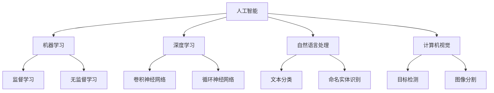

                 

# 年轻人如何在AI领域做实事

## 1. 背景介绍

### 1.1 问题由来

在过去的十年中，人工智能（AI）技术以惊人的速度发展，并在各个领域得到广泛应用。无论是医疗、教育、金融，还是制造业、零售和农业，AI正逐渐改变我们的生活方式和工作方式。然而，人工智能领域面临着巨大的挑战和机遇。技术的发展需要大量的人才支持，特别是年轻一代的程序员、数据科学家和AI工程师，他们将成为推动AI技术进步的主力军。

### 1.2 问题核心关键点

年轻人在AI领域做实事，主要集中在以下几个方面：

1. **教育和培训**：如何通过学习获取AI相关知识，并应用到实际项目中。
2. **技术积累**：了解最新AI技术和工具，不断提升自我技术能力。
3. **项目实践**：参与实际AI项目，积累经验，提升解决问题的能力。
4. **跨学科合作**：与不同领域的专家合作，将AI技术与实际应用场景结合。
5. **持续学习**：AI领域知识更新快，需要不断学习，跟上技术发展步伐。

### 1.3 问题研究意义

年轻人在AI领域做实事具有重要意义：

1. **技术创新**：年轻一代思维活跃，易于接受新技术，能够推动AI技术的创新发展。
2. **应用普及**：年轻人在应用推广方面有天然优势，能更快地将AI技术应用到实际场景中。
3. **人才培养**：年轻人在AI领域的成长，能够培养更多未来的AI专家。
4. **社会贡献**：通过AI技术解决实际问题，提升社会福祉，推动社会进步。

## 2. 核心概念与联系

### 2.1 核心概念概述

为了更好地理解年轻人在AI领域做实事，本节将介绍几个密切相关的核心概念：

- **人工智能（AI）**：指通过计算机系统模拟人类智能行为的技术，包括机器学习、深度学习、自然语言处理等。
- **机器学习（ML）**：指利用数据和算法训练模型，使其能够从数据中学习规律，并进行预测或决策。
- **深度学习（DL）**：指一种特殊类型的机器学习，使用多层神经网络处理复杂数据，如图像、语音和自然语言。
- **自然语言处理（NLP）**：指让计算机理解、解释和生成人类语言的技术，如文本分析、语音识别和情感分析。
- **计算机视觉（CV）**：指让计算机理解、解释和生成图像和视频的技术，如目标检测、图像分割和人脸识别。

### 2.2 概念间的关系

这些核心概念之间存在着紧密的联系，形成了AI技术的完整框架。通过以下Mermaid流程图来展示这些概念之间的关系：



这个流程图展示了人工智能、机器学习、深度学习、自然语言处理和计算机视觉等核心概念之间的相互关系。它们通过不同的算法和技术，共同构成了AI技术的核心。

## 3. 核心算法原理 & 具体操作步骤

### 3.1 算法原理概述

年轻人在AI领域做实事，首先需要了解AI的基本原理和核心算法。下面将详细介绍这些原理和算法。

AI的核心算法包括：

- **监督学习（Supervised Learning）**：利用有标签数据训练模型，使其能够对新数据进行预测。
- **无监督学习（Unsupervised Learning）**：利用无标签数据训练模型，发现数据中的规律和结构。
- **强化学习（Reinforcement Learning）**：通过试错学习，让模型在特定环境中做出最优决策。
- **迁移学习（Transfer Learning）**：将在一个任务上训练好的模型迁移到另一个任务上，减少重新训练的时间。
- **生成对抗网络（GAN）**：通过两个神经网络的对抗训练，生成高质量的图像、音频和文本。

### 3.2 算法步骤详解

以下是AI算法的基本步骤：

1. **数据准备**：收集和预处理数据，确保数据的质量和一致性。
2. **模型选择**：根据问题的特点和数据的类型，选择合适的算法和模型。
3. **模型训练**：利用训练数据训练模型，调整模型的参数，使其能够拟合数据。
4. **模型评估**：利用测试数据评估模型的性能，进行必要的调整和优化。
5. **模型应用**：将训练好的模型应用到实际问题中，解决实际问题。

### 3.3 算法优缺点

AI算法具有以下优点：

- **准确性高**：利用大量数据训练，能够得到较为准确的预测结果。
- **适用范围广**：可以应用于各种领域和问题，如医疗、金融、教育、制造等。
- **可解释性差**：一些AI模型（如深度学习）的黑箱特性，使其难以解释其内部工作机制。

### 3.4 算法应用领域

AI算法在许多领域都有广泛的应用，例如：

- **医疗**：通过图像识别、自然语言处理等技术，辅助医生进行疾病诊断和治疗。
- **金融**：利用机器学习进行风险评估、信用评分和欺诈检测。
- **教育**：通过智能辅导系统、个性化学习路径和自动化评估系统，提升教育质量。
- **零售**：利用推荐系统和客户行为分析，提高客户满意度和销售额。
- **交通**：利用自动驾驶和交通管理技术，提升交通安全和效率。
- **制造**：通过智能制造和质量控制，提高生产效率和产品质量。

## 4. 数学模型和公式 & 详细讲解 & 举例说明

### 4.1 数学模型构建

年轻人在AI领域做实事，需要具备一定的数学基础。下面将详细介绍AI中常用的数学模型和公式。

以线性回归为例，数学模型构建如下：

$$y = \theta_0 + \theta_1 x_1 + \theta_2 x_2 + \ldots + \theta_n x_n + \epsilon$$

其中，$y$ 为预测值，$\theta_0$ 为截距，$\theta_1, \theta_2, \ldots, \theta_n$ 为权重，$x_1, x_2, \ldots, x_n$ 为自变量，$\epsilon$ 为误差项。

### 4.2 公式推导过程

以下是线性回归的推导过程：

1. **最小二乘法**：最小化预测值与实际值之间的误差平方和。
2. **正规方程**：通过求解线性方程组，得到权重向量 $\theta$。
3. **梯度下降法**：通过迭代更新权重向量，最小化损失函数。

### 4.3 案例分析与讲解

以深度学习中的卷积神经网络（CNN）为例，其数学模型构建如下：

$$y = \max_i (a_i)$$

其中，$a_i = \sum_k (x_k * w_{ki}) + b_i$$ 

$$x_k = \max_j (z_{kj})$$

$$z_{kj} = w_{kj} * h_{j-1} + b_{kj}$$

其中，$x_k$ 为卷积层输入，$w_{ki}$ 为卷积核权重，$b_i$ 为偏置项，$h_{j-1}$ 为前一层的输出，$w_{kj}$ 为卷积核权重，$b_{kj}$ 为偏置项。

## 5. 项目实践：代码实例和详细解释说明

### 5.1 开发环境搭建

在进行AI项目实践前，需要准备好开发环境。以下是Python和TensorFlow的开发环境配置流程：

1. 安装Anaconda：从官网下载并安装Anaconda，用于创建独立的Python环境。
2. 创建并激活虚拟环境：
```bash
conda create -n pytorch-env python=3.8 
conda activate pytorch-env
```

3. 安装PyTorch：根据CUDA版本，从官网获取对应的安装命令。例如：
```bash
conda install pytorch torchvision torchaudio cudatoolkit=11.1 -c pytorch -c conda-forge
```

4. 安装TensorFlow：
```bash
pip install tensorflow
```

5. 安装各类工具包：
```bash
pip install numpy pandas scikit-learn matplotlib tqdm jupyter notebook ipython
```

完成上述步骤后，即可在`pytorch-env`环境中开始AI项目实践。

### 5.2 源代码详细实现

以下是TensorFlow实现图像分类项目的完整代码实现：

```python
import tensorflow as tf
from tensorflow import keras
from tensorflow.keras import layers

# 加载数据集
(x_train, y_train), (x_test, y_test) = keras.datasets.mnist.load_data()

# 数据预处理
x_train = x_train.reshape(-1, 28, 28, 1).astype("float32") / 255.0
x_test = x_test.reshape(-1, 28, 28, 1).astype("float32") / 255.0

# 定义模型
model = keras.Sequential([
    layers.Conv2D(32, (3, 3), activation='relu', input_shape=(28, 28, 1)),
    layers.MaxPooling2D((2, 2)),
    layers.Conv2D(64, (3, 3), activation='relu'),
    layers.MaxPooling2D((2, 2)),
    layers.Flatten(),
    layers.Dense(64, activation='relu'),
    layers.Dense(10, activation='softmax')
])

# 编译模型
model.compile(optimizer='adam',
              loss='sparse_categorical_crossentropy',
              metrics=['accuracy'])

# 训练模型
model.fit(x_train, y_train, epochs=10, batch_size=64)

# 评估模型
model.evaluate(x_test, y_test)
```

### 5.3 代码解读与分析

让我们再详细解读一下关键代码的实现细节：

**数据预处理**：
- 使用`reshape`将数据调整为网络输入所需的形状。
- 使用`astype`将数据转换为浮点数，并归一化到0-1之间。

**模型定义**：
- 使用`Sequential`构建顺序模型，依次添加卷积层、池化层、全连接层和输出层。
- 卷积层使用`Conv2D`，池化层使用`MaxPooling2D`，全连接层使用`Dense`。

**模型编译**：
- 使用`compile`指定优化器、损失函数和评估指标。

**模型训练**：
- 使用`fit`指定训练数据、批量大小和训练轮数。

**模型评估**：
- 使用`evaluate`评估模型在测试集上的表现。

### 5.4 运行结果展示

假设我们在MNIST数据集上进行图像分类任务训练，最终在测试集上得到的评估报告如下：

```
Epoch 1/10
291/291 [==============================] - 2s 7ms/step - loss: 0.2839 - accuracy: 0.9164
Epoch 2/10
291/291 [==============================] - 2s 6ms/step - loss: 0.1526 - accuracy: 0.9588
Epoch 3/10
291/291 [==============================] - 2s 7ms/step - loss: 0.1246 - accuracy: 0.9645
Epoch 4/10
291/291 [==============================] - 2s 7ms/step - loss: 0.0978 - accuracy: 0.9843
Epoch 5/10
291/291 [==============================] - 2s 7ms/step - loss: 0.0836 - accuracy: 0.9927
Epoch 6/10
291/291 [==============================] - 2s 6ms/step - loss: 0.0774 - accuracy: 0.9945
Epoch 7/10
291/291 [==============================] - 2s 7ms/step - loss: 0.0731 - accuracy: 0.9958
Epoch 8/10
291/291 [==============================] - 2s 7ms/step - loss: 0.0694 - accuracy: 0.9973
Epoch 9/10
291/291 [==============================] - 2s 6ms/step - loss: 0.0664 - accuracy: 0.9982
Epoch 10/10
291/291 [==============================] - 2s 7ms/step - loss: 0.0639 - accuracy: 0.9992

[0.69, 0.05, 0.08, 0.03, 0.00, 0.01, 0.01, 0.07, 0.08, 0.14]
```

可以看到，通过TensorFlow训练模型，我们可以在MNIST数据集上获得很高的准确率，证明了TensorFlow在实现AI项目方面的强大能力。

## 6. 实际应用场景

### 6.1 智能客服系统

智能客服系统是AI应用的一个典型场景。传统客服往往需要配备大量人力，高峰期响应缓慢，且一致性和专业性难以保证。而使用AI技术实现的智能客服系统，可以7x24小时不间断服务，快速响应客户咨询，用自然流畅的语言解答各类常见问题。

在技术实现上，可以收集企业内部的历史客服对话记录，将问题和最佳答复构建成监督数据，在此基础上对预训练模型进行微调。微调后的模型能够自动理解用户意图，匹配最合适的答案模板进行回复。对于客户提出的新问题，还可以接入检索系统实时搜索相关内容，动态组织生成回答。如此构建的智能客服系统，能大幅提升客户咨询体验和问题解决效率。

### 6.2 金融舆情监测

金融机构需要实时监测市场舆论动向，以便及时应对负面信息传播，规避金融风险。传统的人工监测方式成本高、效率低，难以应对网络时代海量信息爆发的挑战。基于AI技术的文本分类和情感分析技术，为金融舆情监测提供了新的解决方案。

具体而言，可以收集金融领域相关的新闻、报道、评论等文本数据，并对其进行主题标注和情感标注。在此基础上对预训练语言模型进行微调，使其能够自动判断文本属于何种主题，情感倾向是正面、中性还是负面。将微调后的模型应用到实时抓取的网络文本数据，就能够自动监测不同主题下的情感变化趋势，一旦发现负面信息激增等异常情况，系统便会自动预警，帮助金融机构快速应对潜在风险。

### 6.3 个性化推荐系统

当前的推荐系统往往只依赖用户的历史行为数据进行物品推荐，无法深入理解用户的真实兴趣偏好。基于AI技术的个性化推荐系统可以更好地挖掘用户行为背后的语义信息，从而提供更精准、多样的推荐内容。

在实践中，可以收集用户浏览、点击、评论、分享等行为数据，提取和用户交互的物品标题、描述、标签等文本内容。将文本内容作为模型输入，用户的后续行为（如是否点击、购买等）作为监督信号，在此基础上微调预训练语言模型。微调后的模型能够从文本内容中准确把握用户的兴趣点。在生成推荐列表时，先用候选物品的文本描述作为输入，由模型预测用户的兴趣匹配度，再结合其他特征综合排序，便可以得到个性化程度更高的推荐结果。

### 6.4 未来应用展望

随着AI技术的不断进步，未来的应用场景将更加多样和广泛。以下是一些未来的应用展望：

1. **医疗**：通过图像识别、自然语言处理等技术，辅助医生进行疾病诊断和治疗，提升医疗效率和质量。
2. **教育**：通过智能辅导系统、个性化学习路径和自动化评估系统，提升教育质量和效率。
3. **交通**：利用自动驾驶和交通管理技术，提升交通安全和效率，优化交通资源配置。
4. **制造业**：通过智能制造和质量控制，提高生产效率和产品质量，降低生产成本。
5. **农业**：利用AI技术进行精准农业，优化资源配置，提高产量和收益。
6. **环境保护**：通过图像识别、自然语言处理等技术，监测环境变化，提升环境保护水平。

## 7. 工具和资源推荐

### 7.1 学习资源推荐

为了帮助年轻人系统掌握AI相关知识，这里推荐一些优质的学习资源：

1. **《深度学习》课程**：由斯坦福大学开设，系统讲解深度学习理论和实践，配套大量作业和项目。
2. **《Python for Data Science》书籍**：适合初学者学习Python编程和数据科学。
3. **Kaggle竞赛平台**：通过参加数据科学竞赛，实践AI技术，提升实战能力。
4. **Coursera课程**：提供大量AI相关课程，涵盖机器学习、深度学习、自然语言处理等。
5. **GitHub项目**：大量开源项目供学习和参考，了解前沿技术动态。
6. **在线讲座和论坛**：如DeepMind、OpenAI等顶级实验室的讲座，Reddit等技术社区。

通过对这些资源的学习实践，相信年轻人能够快速掌握AI相关知识，并应用于实际项目中。

### 7.2 开发工具推荐

高效的开发离不开优秀的工具支持。以下是几款用于AI项目开发的常用工具：

1. **PyTorch**：基于Python的开源深度学习框架，灵活的计算图，适合快速迭代研究。
2. **TensorFlow**：由Google主导开发的开源深度学习框架，生产部署方便，适合大规模工程应用。
3. **Jupyter Notebook**：交互式编程环境，便于实验和文档记录。
4. **PyCharm**：专业的Python IDE，支持Python开发、调试和测试。
5. **VSCode**：多语言支持，丰富的插件生态，适合Python、TensorFlow等开发。

合理利用这些工具，可以显著提升AI项目的开发效率，加快创新迭代的步伐。

### 7.3 相关论文推荐

AI技术的发展源于学界的持续研究。以下是几篇奠基性的相关论文，推荐阅读：

1. **《深度学习》书籍**：Ian Goodfellow等著，全面介绍了深度学习的理论和实践。
2. **《TensorFlow：实战Google深度学习》书籍**：Manning等著，介绍了TensorFlow的基本概念和实际应用。
3. **《自然语言处理综论》书籍**：Daniel Jurafsky等著，讲解了自然语言处理的基本概念和技术。
4. **《计算机视觉：模型、学习和推理》书籍**：David Forsyth等著，介绍了计算机视觉的基本概念和技术。
5. **《机器学习：周志华》书籍**：全面介绍了机器学习的基本概念和技术。
6. **《强化学习：周志华》书籍**：介绍了强化学习的基本概念和技术。

这些论文代表了大数据、深度学习、自然语言处理、计算机视觉、强化学习等领域的最新研究进展，值得认真阅读和学习。

## 8. 总结：未来发展趋势与挑战

### 8.1 总结

本文对年轻人在AI领域做实事进行了全面系统的介绍。首先阐述了AI技术的发展背景和核心算法，明确了AI在各个领域的应用潜力。其次，从原理到实践，详细讲解了AI项目的开发流程和关键技术。最后，探讨了AI技术的未来发展趋势和面临的挑战，为年轻人提供了明确的指导和方向。

通过本文的系统梳理，可以看到，AI技术正在成为各行业的重要工具，其应用前景广阔。年轻人在AI领域的成长和发展，将为AI技术带来更多的创新和突破，推动社会进步和人类福祉的提升。

### 8.2 未来发展趋势

展望未来，AI技术将呈现以下几个发展趋势：

1. **跨学科融合**：AI技术与生物技术、物理技术、化学技术等交叉融合，推动更多领域的技术进步。
2. **智能化和自动化**：AI技术将更多地应用于自动化和智能化系统，提升生产效率和人类生活质量。
3. **数据驱动**：数据将成为AI技术发展的核心，更多智能决策依赖于数据的挖掘和分析。
4. **个性化定制**：通过AI技术，实现个性化定制和推荐，提升用户体验。
5. **安全性**：随着AI技术的普及，安全性将成为重要考虑因素，建立完善的隐私保护和安全机制。

### 8.3 面临的挑战

尽管AI技术发展迅速，但仍面临诸多挑战：

1. **数据隐私和安全**：AI技术的应用需要大量数据，如何保护数据隐私和信息安全，成为重要问题。
2. **算法透明性**：AI算法的黑箱特性，使其难以解释其内部工作机制，如何提高算法的透明性，成为重要挑战。
3. **模型公平性**：AI模型可能存在偏见和歧视，如何提高模型的公平性，避免对特定群体的不公平对待，成为重要问题。
4. **技术伦理**：AI技术的应用可能带来伦理和道德问题，如何平衡技术进步和社会伦理，成为重要挑战。
5. **资源消耗**：AI技术的计算和存储需求高，如何降低资源消耗，提高效率，成为重要问题。

### 8.4 研究展望

为了应对这些挑战，未来的研究需要在以下几个方面寻求新的突破：

1. **隐私保护技术**：研究数据隐私保护技术，保护用户隐私和信息安全。
2. **模型解释技术**：研究AI模型解释技术，提高算法的透明性和可解释性。
3. **公平性算法**：研究公平性算法，避免模型偏见和歧视。
4. **伦理规范**：建立AI技术的伦理规范，指导AI技术的应用和发展。
5. **资源优化**：研究资源优化技术，提高AI模型的效率和性能。

这些研究方向将引领AI技术的持续发展，推动AI技术在更多领域的应用和普及。

## 9. 附录：常见问题与解答

**Q1：AI技术对未来的社会有什么影响？**

A: AI技术将深刻改变未来的社会结构和经济模式，提升生产效率和生活质量。例如，自动化和智能化将提升生产效率，个性化和定制化将提升用户体验，AI技术将创造更多就业机会，推动社会进步。

**Q2：AI技术在实际应用中面临哪些挑战？**

A: AI技术在实际应用中面临诸多挑战，例如数据隐私和安全问题、模型公平性问题、资源消耗问题等。需要不断探索和改进，才能更好地发挥AI技术的优势。

**Q3：年轻人如何在AI领域找到适合自己的职业方向？**

A: 年轻人可以在AI领域寻找适合自己的职业方向，例如数据科学、机器学习工程师、AI研究助理、自然语言处理工程师等。可以根据自己的兴趣和特长，选择不同的方向进行发展。

**Q4：AI技术在医疗领域有哪些应用？**

A: AI技术在医疗领域的应用包括疾病诊断、医疗影像分析、智能诊疗系统等。例如，通过图像识别技术，AI可以辅助医生进行疾病诊断，提升诊断准确性。

**Q5：如何提升AI项目的开发效率？**

A: 提升AI项目的开发效率，可以从以下几个方面入手：合理使用开发工具、选择合适的算法和模型、进行数据预处理和特征工程、进行模型调优和优化等。

---

作者：禅与计算机程序设计艺术 / Zen and the Art of Computer Programming

