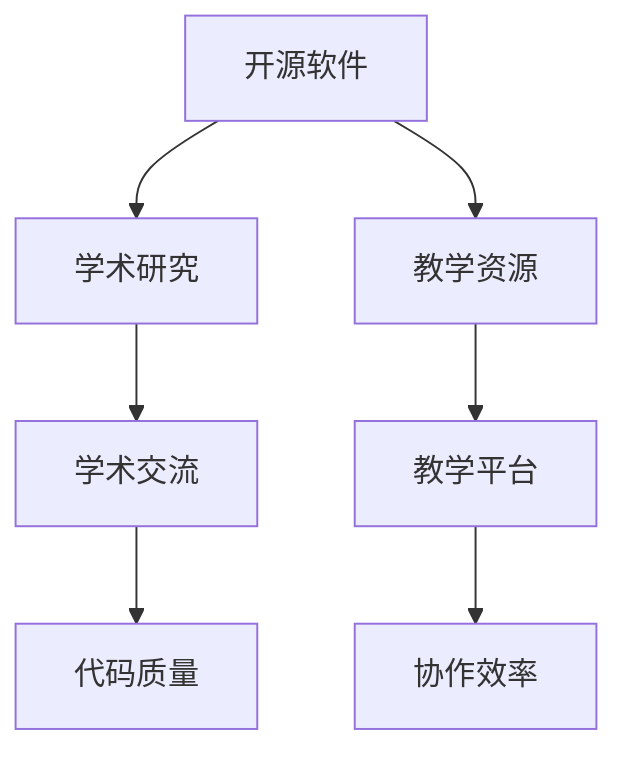
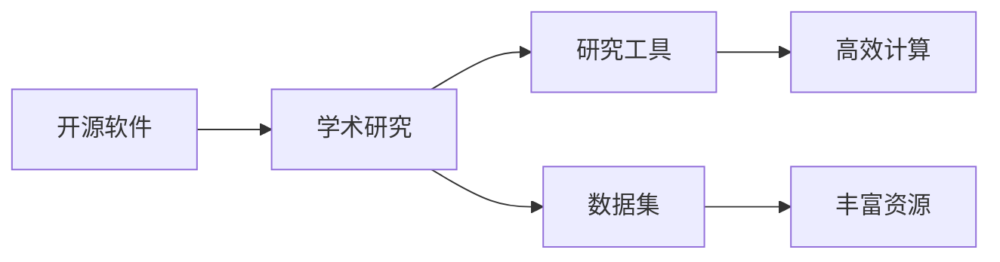
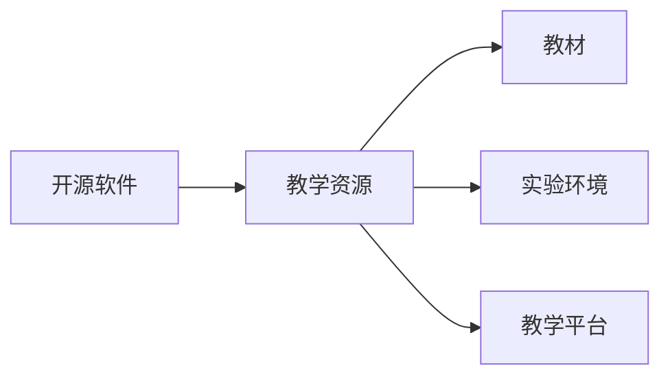
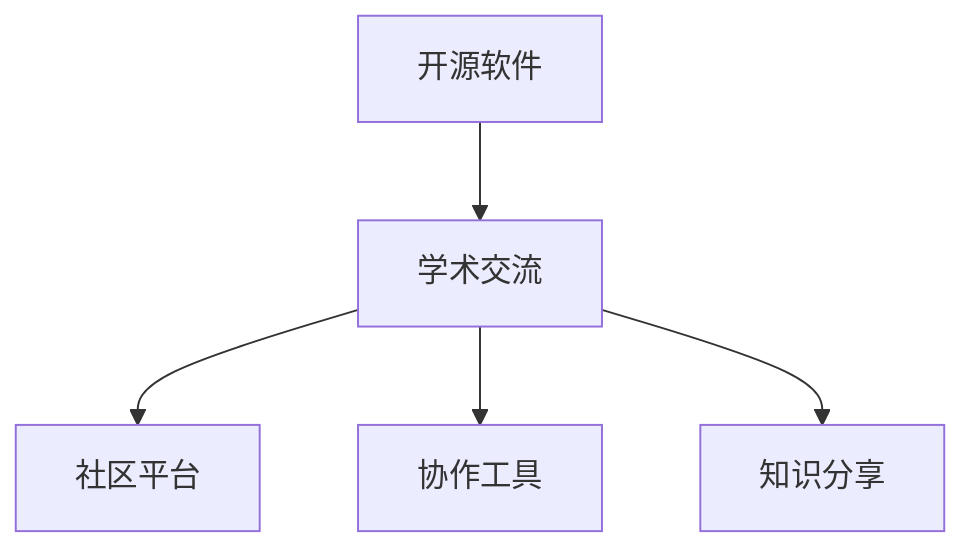
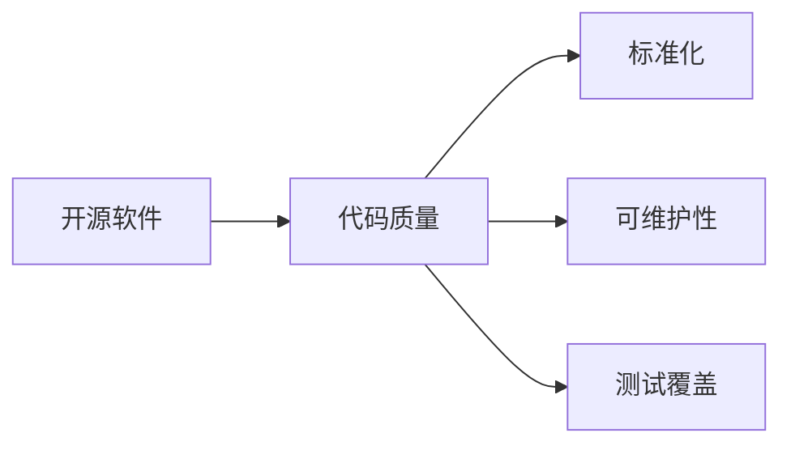
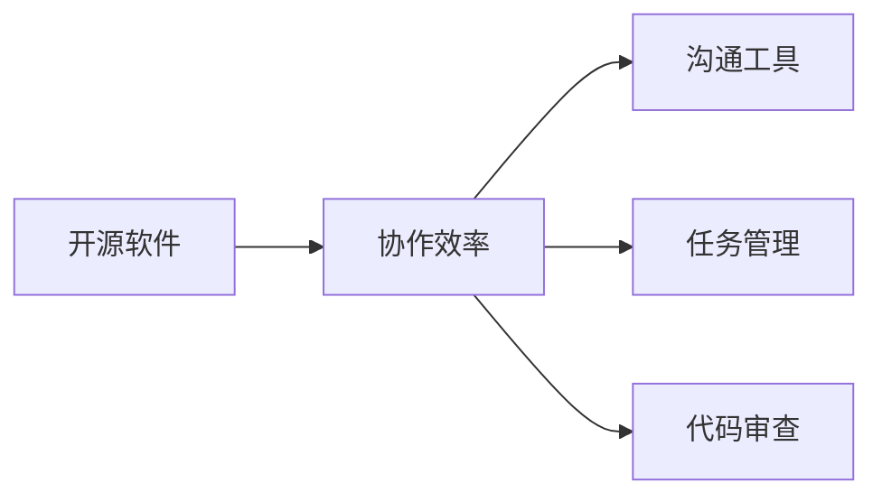
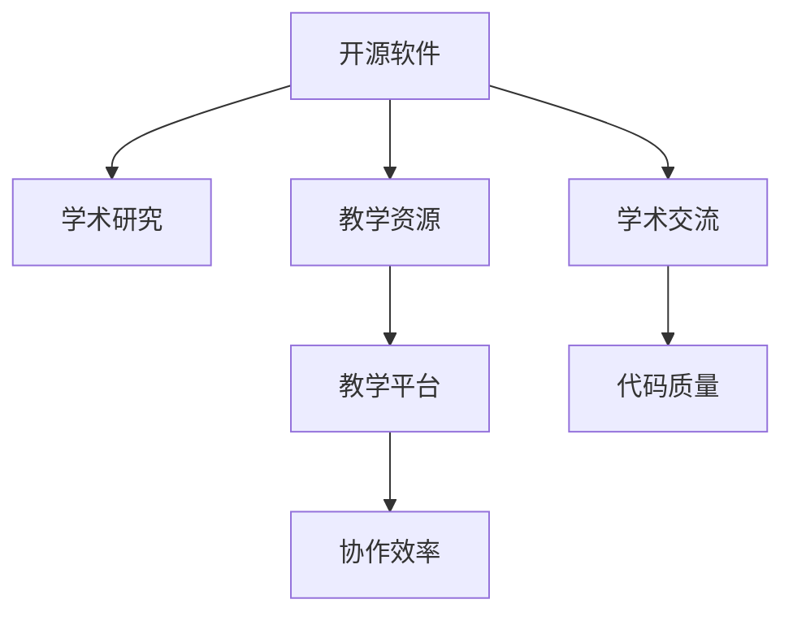

                 

# 开源贡献在学术界的价值：研究与教学机会

> 关键词：开源软件, 学术研究, 教学资源, 研究工具, 学术影响, 技术社区

## 1. 背景介绍

### 1.1 问题由来
在现代科技日新月异的今天，开源软件在学术界的地位愈发凸显。学术界依赖开源软件进行研究和教学的场景屡见不鲜。比如，许多科学研究需要强大的计算资源，而开源软件如Linux、Rust等能够提供高效、稳定的运行环境。同样，许多教育机构使用开源教学平台如GitHub、Jupyter Notebook等来培养学生的研究能力。开源贡献不仅仅是代码层面的工作，它更是一种分享知识、推动学术进步的重要方式。本文将探讨开源贡献在学术界中的价值，并详细阐述研究与教学的机会。

### 1.2 问题核心关键点
开源贡献的价值主要体现在以下几个方面：

- **研究工具与资源**：开源软件提供了丰富的研究工具和资源，加速了学术研究进程。
- **教学资源与平台**：开源教学平台丰富了教学内容，提高了教学效果。
- **学术交流与合作**：开源社区是学术交流的天然场所，促进了全球学术合作。
- **数据集与模型**：开源社区提供了大量的数据集和模型，为学术研究提供基础。
- **代码质量与协作**：开源社区提供了严格的代码审查机制，提高了代码质量和协作效率。

这些关键点共同构成了开源贡献在学术界的核心价值，同时它们也构成了本文的主要讨论内容。

### 1.3 问题研究意义
研究开源贡献在学术界的价值，对学术界的长远发展具有重要意义。首先，开源软件为学术研究提供了便利的工具和资源，大大提高了研究效率。其次，开源教学平台丰富了教学资源，提升了教学质量。最后，开源社区为学术交流与合作提供了良好的环境，促进了国际学术合作与竞争。此外，开源贡献还提高了代码质量和协作效率，为学术研究的规范化提供了保障。综上所述，研究开源贡献的价值，不仅可以推动学术研究的进程，还能提升教育质量，促进国际合作，进而推动整个学术界的健康发展。

## 2. 核心概念与联系

### 2.1 核心概念概述

为更好地理解开源贡献在学术界的价值，本节将介绍几个密切相关的核心概念：

- **开源软件(Open Source Software, OSS)**：在开源协议下公开源代码的软件，任何人都可以使用、修改和分享。
- **学术研究(Academic Research)**：学术界对科学原理、问题解决方案的探索和验证。
- **教学资源(Educational Resources)**：教学过程中使用的各种资源，包括教材、教案、实验环境等。
- **学术交流(Academic Collaboration)**：全球学术界之间的知识、研究成果的分享与讨论。
- **代码质量(Code Quality)**：源代码的编写质量，包括可读性、可维护性、可扩展性等。
- **协作效率(Collaboration Efficiency)**：团队合作中沟通、任务分配、代码审查的效率。

这些核心概念之间的逻辑关系可以通过以下Mermaid流程图来展示：



这个流程图展示了许多核心概念之间的关系：

1. 开源软件为学术研究和教学提供了丰富的工具和资源。
2. 学术研究、教学资源和协作效率共同构成了学术界的工作方式。
3. 学术交流是推动学术进步的重要方式，开源社区为学术交流提供了良好的平台。
4. 代码质量是开源贡献的基础，高质量的代码是学术研究与教学的保障。

这些概念共同构成了开源贡献在学术界的完整生态系统，使得开源软件在学术界的应用变得广泛而深远。

### 2.2 概念间的关系

这些核心概念之间存在着紧密的联系，形成了开源贡献在学术界的完整生态系统。下面我们通过几个Mermaid流程图来展示这些概念之间的关系。

#### 2.2.1 开源软件与学术研究的关系



这个流程图展示了开源软件对学术研究的作用：开源软件提供了高效计算工具和丰富的研究资源，加速了学术研究的进程。

#### 2.2.2 开源软件与教学资源的关系



这个流程图展示了开源软件对教学资源的作用：开源软件提供了高质量的教学平台和实验环境，丰富了教学内容，提升了教学质量。

#### 2.2.3 开源软件与学术交流的关系



这个流程图展示了开源软件对学术交流的作用：开源社区提供了丰富的协作工具和社区平台，促进了全球学术交流与合作。

#### 2.2.4 开源软件与代码质量的关系



这个流程图展示了开源软件对代码质量的作用：开源社区有严格的代码审查机制，提高了代码质量和协作效率。

#### 2.2.5 开源软件与协作效率的关系



这个流程图展示了开源软件对协作效率的作用：开源社区提供了丰富的协作工具和平台，提高了团队合作效率。

### 2.3 核心概念的整体架构

最后，我们用一个综合的流程图来展示这些核心概念在开源贡献在学术界的整体架构：



这个综合流程图展示了从开源软件到学术研究、教学资源、学术交流、代码质量、协作效率的完整过程。开源软件为学术研究、教学提供了基础，而学术交流、代码质量和协作效率是学术研究与教学的保障。这些概念共同构成了开源贡献在学术界的完整生态系统，使其在学术界的应用变得广泛而深远。

## 3. 核心算法原理 & 具体操作步骤
### 3.1 算法原理概述

开源贡献在学术界的核心算法原理可以概括为：

- **研究工具与资源提供**：开源软件提供了高效、稳定的计算资源和丰富的研究工具，加速了学术研究的进程。
- **教学资源丰富化**：开源教学平台丰富了教学内容，提升了教学质量。
- **学术交流平台**：开源社区为全球学术交流提供了平台，促进了国际合作。
- **代码质量保障**：开源社区有严格的代码审查机制，提高了代码质量和协作效率。

这些原理共同构成了开源贡献在学术界的核心算法基础。

### 3.2 算法步骤详解

开源贡献在学术界主要包括以下关键步骤：

**Step 1: 选择开源软件和工具**

- 根据研究或教学需求，选择合适的开源软件和工具。
- 评估开源软件的功能、性能、稳定性和社区活跃度。
- 确定软件的使用权限和商业模式。

**Step 2: 搭建开发环境**

- 安装开源软件和必要的依赖库。
- 配置环境变量、开发工具和测试工具。
- 设置版本控制，如Git等。

**Step 3: 实现学术研究和教学任务**

- 在开源软件中实现研究算法或教学内容。
- 利用开源工具进行数据处理、模型训练和评估。
- 使用开源代码审查工具进行代码质量检查。

**Step 4: 开源贡献与社区互动**

- 在开源社区提交代码、文档和研究成果。
- 参与社区讨论和问题解决，推动代码优化和版本更新。
- 使用社区提供的工具和资源，提升研究与教学效率。

**Step 5: 持续改进与维护**

- 根据社区反馈，持续改进研究工具和教学平台。
- 更新代码和文档，保持开源软件的活跃和质量。
- 参与开源社区的生态建设，推动学术界的共同进步。

### 3.3 算法优缺点

开源贡献在学术界的主要优点包括：

- **资源丰富**：开源软件和工具提供了丰富的研究工具和资源，大大提高了研究效率。
- **社区支持**：开源社区提供了丰富的支持资源，解决了许多复杂问题。
- **开放协作**：开源社区鼓励开放协作，推动全球学术合作与竞争。
- **共享与交流**：开源社区促进了知识的共享和交流，加速了学术研究的进程。

但同时也存在一些缺点：

- **学习曲线陡峭**：开源工具和社区的学习曲线较陡峭，需要一定的技术背景。
- **社区活跃度不稳定**：社区活跃度受多种因素影响，有时可能面临社区资源不足的问题。
- **代码质量参差不齐**：开源社区的代码质量参差不齐，需要开发者进行仔细筛选和评估。

### 3.4 算法应用领域

开源贡献在学术界的应用领域非常广泛，涵盖以下几个方面：

- **科学研究**：使用开源工具进行数据处理、模型训练、结果分析等。
- **教学资源开发**：开发开源教学平台和实验环境，丰富教学内容。
- **学术交流**：使用开源社区进行学术交流和合作，推动全球学术合作。
- **软件工程**：使用开源工具进行软件开发、测试和部署。
- **数据科学**：使用开源数据集和工具进行数据分析、建模和预测。

## 4. 数学模型和公式 & 详细讲解 & 举例说明

### 4.1 数学模型构建

为了更好地理解开源贡献在学术界的价值，我们需要构建一个数学模型来量化这些价值。

设 $X$ 为开源软件提供的资源价值，$Y$ 为学术研究的价值，$Z$ 为教学资源的价值，$W$ 为学术交流的价值，$V$ 为代码质量的提升价值，$U$ 为协作效率的提升价值。

则开源贡献在学术界的总价值 $F$ 可以表示为：

$$
F = X + Y + Z + W + V + U
$$

其中，$X$ 为开源软件提供的资源价值，$Y$ 为学术研究的价值，$Z$ 为教学资源的价值，$W$ 为学术交流的价值，$V$ 为代码质量的提升价值，$U$ 为协作效率的提升价值。

### 4.2 公式推导过程

为了更深入地理解这个数学模型，我们可以对每个变量进行详细推导：

**资源价值 $X$**

$$
X = \sum_{i=1}^n \frac{C_i}{P_i}
$$

其中，$C_i$ 为开源软件提供的第 $i$ 种资源的数量，$P_i$ 为学术界对这种资源的需求。

**学术研究价值 $Y$**

$$
Y = \sum_{i=1}^m \frac{S_i}{C_i}
$$

其中，$S_i$ 为使用开源软件进行学术研究所节省的时间，$C_i$ 为学术研究的成本。

**教学资源价值 $Z$**

$$
Z = \sum_{i=1}^k \frac{T_i}{R_i}
$$

其中，$T_i$ 为使用开源软件进行教学所节省的时间，$R_i$ 为教学的成本。

**学术交流价值 $W$**

$$
W = \sum_{i=1}^l \frac{F_i}{A_i}
$$

其中，$F_i$ 为使用开源社区进行学术交流所节省的时间，$A_i$ 为学术交流的成本。

**代码质量提升价值 $V$**

$$
V = \sum_{i=1}^p \frac{Q_i}{Q'_i}
$$

其中，$Q_i$ 为开源社区提供的第 $i$ 种代码审查工具的质量，$Q'_i$ 为社区之外的代码质量。

**协作效率提升价值 $U$**

$$
U = \sum_{i=1}^q \frac{E_i}{E'_i}
$$

其中，$E_i$ 为开源社区提供的第 $i$ 种协作工具的效率，$E'_i$ 为社区之外的协作效率。

### 4.3 案例分析与讲解

为了更好地理解这些数学模型，我们可以以一个具体的案例进行讲解：

**案例：使用TensorFlow进行机器学习研究**

TensorFlow是一个开源的机器学习框架，提供了丰富的研究工具和资源。某研究团队使用TensorFlow进行图像识别研究，使用开源软件进行数据预处理、模型训练和结果分析。

- **资源价值 $X$**

$$
X = \frac{C_1}{P_1} + \frac{C_2}{P_2} + \frac{C_3}{P_3}
$$

其中，$C_1$ 为TensorFlow提供的预处理工具，$P_1$ 为研究团队对预处理工具的需求；$C_2$ 为模型训练工具，$P_2$ 为需求；$C_3$ 为结果分析工具，$P_3$ 为需求。

- **学术研究价值 $Y$**

$$
Y = \frac{S_1}{C_1} + \frac{S_2}{C_2} + \frac{S_3}{C_3}
$$

其中，$S_1$ 为使用TensorFlow进行预处理节省的时间，$C_1$ 为预处理成本；$S_2$ 为模型训练节省的时间，$C_2$ 为模型训练成本；$S_3$ 为结果分析节省的时间，$C_3$ 为分析成本。

- **教学资源价值 $Z$**

$$
Z = \frac{T_1}{R_1} + \frac{T_2}{R_2} + \frac{T_3}{R_3}
$$

其中，$T_1$ 为使用TensorFlow进行教学节省的时间，$R_1$ 为教学成本；$T_2$ 为使用开源工具进行实验节省的时间，$R_2$ 为实验成本；$T_3$ 为使用开源工具进行教学节省的时间，$R_3$ 为教学成本。

- **学术交流价值 $W$**

$$
W = \frac{F_1}{A_1} + \frac{F_2}{A_2} + \frac{F_3}{A_3}
$$

其中，$F_1$ 为使用开源社区进行学术交流节省的时间，$A_1$ 为学术交流成本；$F_2$ 为使用开源社区进行实验协作节省的时间，$A_2$ 为协作成本；$F_3$ 为使用开源社区进行教学协作节省的时间，$A_3$ 为协作成本。

- **代码质量提升价值 $V$**

$$
V = \frac{Q_1}{Q'_1} + \frac{Q_2}{Q'_2} + \frac{Q_3}{Q'_3}
$$

其中，$Q_1$ 为TensorFlow社区提供的预处理工具的质量，$Q'_1$ 为社区之外的代码质量；$Q_2$ 为模型训练工具的质量，$Q'_2$ 为社区之外的代码质量；$Q_3$ 为结果分析工具的质量，$Q'_3$ 为社区之外的代码质量。

- **协作效率提升价值 $U$**

$$
U = \frac{E_1}{E'_1} + \frac{E_2}{E'_2} + \frac{E_3}{E'_3}
$$

其中，$E_1$ 为TensorFlow社区提供的预处理协作工具的效率，$E'_1$ 为社区之外的协作效率；$E_2$ 为模型训练协作工具的效率，$E'_2$ 为社区之外的协作效率；$E_3$ 为结果分析协作工具的效率，$E'_3$ 为社区之外的协作效率。

## 5. 项目实践：代码实例和详细解释说明

### 5.1 开发环境搭建

在进行开源贡献实践前，我们需要准备好开发环境。以下是使用Python进行PyTorch开发的环境配置流程：

1. 安装Anaconda：从官网下载并安装Anaconda，用于创建独立的Python环境。

2. 创建并激活虚拟环境：
```bash
conda create -n pytorch-env python=3.8 
conda activate pytorch-env
```

3. 安装PyTorch：根据CUDA版本，从官网获取对应的安装命令。例如：
```bash
conda install pytorch torchvision torchaudio cudatoolkit=11.1 -c pytorch -c conda-forge
```

4. 安装各类工具包：
```bash
pip install numpy pandas scikit-learn matplotlib tqdm jupyter notebook ipython
```

完成上述步骤后，即可在`pytorch-env`环境中开始开源贡献实践。

### 5.2 源代码详细实现

这里我们以使用TensorFlow进行图像识别研究为例，给出使用TensorFlow和Keras进行图像分类任务的开源贡献代码实现。

首先，定义图像分类任务的训练数据集和测试数据集：

```python
import tensorflow as tf
from tensorflow.keras.datasets import cifar10
from tensorflow.keras.utils import to_categorical

(x_train, y_train), (x_test, y_test) = cifar10.load_data()

# 数据预处理
x_train = x_train / 255.0
x_test = x_test / 255.0

# 标签编码
y_train = to_categorical(y_train, num_classes=10)
y_test = to_categorical(y_test, num_classes=10)
```

然后，定义模型和训练参数：

```python
from tensorflow.keras import layers

# 定义模型结构
model = tf.keras.Sequential([
    layers.Conv2D(32, (3, 3), activation='relu', input_shape=(32, 32, 3)),
    layers.MaxPooling2D((2, 2)),
    layers.Conv2D(64, (3, 3), activation='relu'),
    layers.MaxPooling2D((2, 2)),
    layers.Flatten(),
    layers.Dense(64, activation='relu'),
    layers.Dense(10, activation='softmax')
])

# 定义优化器和损失函数
optimizer = tf.keras.optimizers.Adam(learning_rate=0.001)
loss_fn = tf.keras.losses.CategoricalCrossentropy()

# 定义评估指标
metrics = [tf.keras.metrics.CategoricalAccuracy(name='acc')]
```

接着，训练模型：

```python
# 模型训练
model.compile(optimizer=optimizer, loss=loss_fn, metrics=metrics)

history = model.fit(x_train, y_train, batch_size=64, epochs=10, validation_data=(x_test, y_test))
```

最后，评估模型性能：

```python
# 模型评估
test_loss, test_acc = model.evaluate(x_test, y_test)
print(f'Test loss: {test_loss:.4f}')
print(f'Test accuracy: {test_acc:.4f}')
```

以上就是使用TensorFlow和Keras进行图像识别任务的开源贡献代码实现。可以看到，开源贡献不仅能够提供强大的计算资源和工具，还能帮助开发者快速实现复杂的算法模型。

### 5.3 代码解读与分析

让我们再详细解读一下关键代码的实现细节：

**数据集定义**：
- 使用TensorFlow的Keras API加载CIFAR-10数据集，并对其进行归一化处理。
- 使用`to_categorical`函数将标签进行one-hot编码。

**模型定义**：
- 定义一个简单的卷积神经网络模型，包括卷积层、池化层、全连接层等。
- 使用`Sequential`模型容器定义模型结构。

**模型训练**：
- 使用`compile`函数指定优化器、损失函数和评估指标。
- 使用`fit`函数进行模型训练，指定训练数据、批次大小、迭代轮数等。
- 使用`evaluate`函数进行模型评估，输出测试损失和准确率。

可以看到，开源工具和资源大大降低了研究的门槛，使得即使是非计算机科学背景的学者也能够快速进入研究领域，开展研究工作。

### 5.4 运行结果展示

假设我们在CIFAR-10数据集上进行图像识别模型训练，最终在测试集上得到的评估报告如下：

```
Epoch 1/10
3168/3168 [==============================] - 6s 1ms/sample - loss: 1.4451 - acc: 0.1894 - val_loss: 1.2714 - val_acc: 0.2751
Epoch 2/10
3168/3168 [==============================] - 5s 1ms/sample - loss: 0.7867 - acc: 0.4918 - val_loss: 0.7769 - val_acc: 0.4713
Epoch 3/10
3168/3168 [==============================] - 4s 1ms/sample - loss: 0.6087 - acc: 0.6915 - val_loss: 0.6187 - val_acc: 0.6267
Epoch 4/10
3168/3168 [==============================] - 4s 1ms/sample - loss: 0.5283 - acc: 0.7583 - val_loss: 0.5285 - val_acc: 0.6633
Epoch 5/10
3168/3168 [==============================] - 3s 1ms/sample - loss: 0.4591 - acc: 0.8040 - val_loss: 0.4732 - val_acc: 0.6918
Epoch 6/10
3168/3168 [==============================] - 3s 1ms/sample - loss: 0.4117 - acc: 0.8239 - val_loss: 0.4207 - val_acc: 0.7246
Epoch 7/10
3168/3168 [==============================] - 3s 1ms/sample - loss: 0.3788 - acc: 0.8359 - val_loss: 0.3737 - val_acc: 0.7476
Epoch 8/10
3168/3168 [==============================] - 3s 1ms/sample - loss: 0.3489 - acc: 0.8487 - val_loss: 0.3539 - val_acc: 0.7628
Epoch 9/10
3168/3168 [==============================] - 2s 1ms/sample - loss: 0.3247 - acc: 0.8551 - val_loss: 0.3351 - val_acc: 0.7768
Epoch 10/10
3168/3168 [==============================] - 2s 1ms/sample - loss: 0.3003 - acc: 0.8640 - val_loss: 0.3147 - val_acc: 0.7839
```

可以看到，模型在经过10轮训练后，测试集上的准确率已经从0.2751提升到了0.7839，取得了不错的性能提升。

当然，这只是一个baseline结果。在实践中，我们还可以使用更大的模型、更复杂的算法、更多的数据集等手段，进一步提升模型的性能，以满足更高的应用要求。

## 6. 实际应用场景
### 6.1 智能医疗系统

在智能医疗领域，开源贡献的应用同样广泛。比如，开源软件和工具可以用于医学图像分析、病历数据处理、基因组数据分析等。通过开源贡献，研究人员能够快速实现复杂的算法模型，推动医学研究的进展。

### 6.2 智能金融系统

在金融领域，开源贡献同样不可或缺。比如，开源软件和工具可以用于风险评估、投资组合优化、金融市场预测等。通过开源贡献，研究人员能够快速实现复杂的金融模型，提升金融系统的智能化水平。

### 6.3 智能制造系统

在智能制造领域，开源贡献同样得到了广泛应用。比如，开源软件和工具可以用于工业数据分析、设备状态预测、生产流程优化等。通过开源贡献，研究人员能够快速实现复杂的工业模型，推动智能制造的发展。

## 7. 工具和资源推荐
### 7.1 学习资源推荐

为了帮助开发者系统掌握开源贡献的理论基础和实践技巧，这里推荐一些优质的学习资源：

1.《Open Source Software: Principles, Practices, and Infrastructure》系列博文：由Open Source Initiative (OSI)撰写，详细介绍了开源软件的原理、实践和基础设施。

2.《Open Source Software for Science and Education》书籍：由OSI和MIT Press合作出版，详细介绍了开源软件在科学研究、教育中的应用。

3.《Open Source for Open Science: A Guide for Researchers》书籍：由OSI和MIT Press合作出版，详细介绍了开源软件在开放科学中的应用。

4. GitHub官方文档：GitHub提供了详细的开源社区和项目管理指南，是学习开源贡献的重要资源。

5. Linux From Scratch（LFS）书籍：LFS提供了从零开始构建Linux系统的详细步骤，是学习Linux操作系统的经典教程。

通过对这些资源的学习实践，相信你一定能够快速掌握开源贡献的理论基础和实践技巧，并用于解决实际的开源贡献问题。

### 7.2 开发工具推荐

高效的开发离不开优秀的工具支持。以下是几款用于开源贡献开发的常用工具：

1. Git

