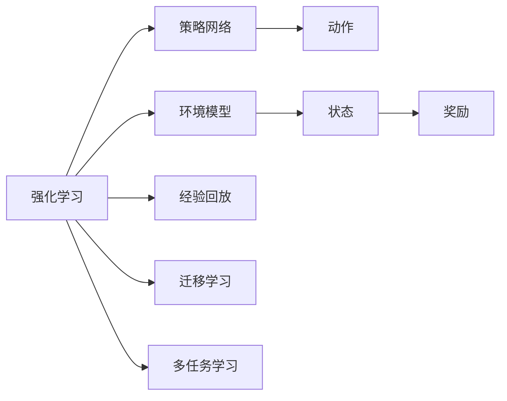
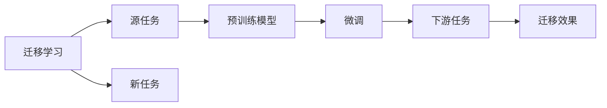
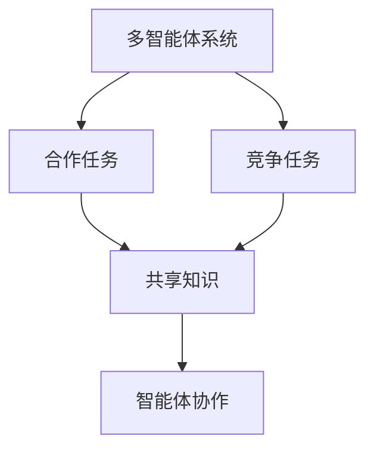
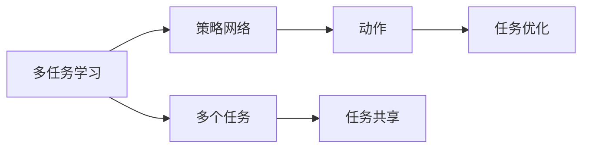
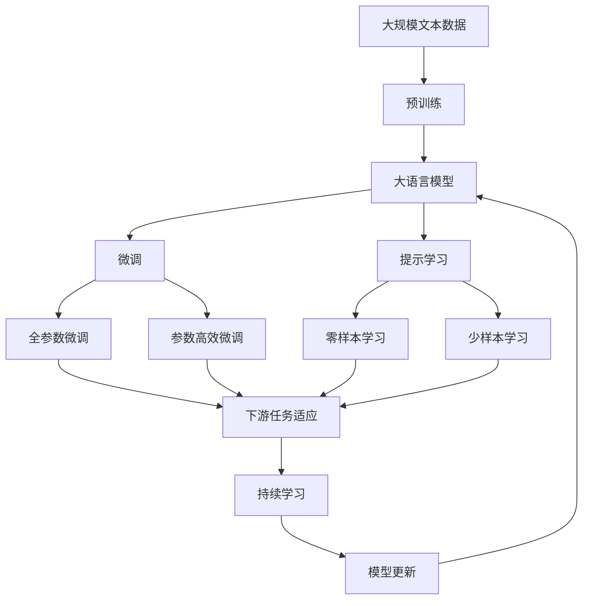

                 

# 强化学习Reinforcement Learning中的迁移学习与多任务学习

> 关键词：强化学习, 迁移学习, 多任务学习, 深度强化学习, 转移学习, 多智能体系统, 深度学习

## 1. 背景介绍

### 1.1 问题由来

在近年来，随着深度学习技术的快速发展，强化学习（Reinforcement Learning, RL）在多个领域都展现出了巨大的潜力，如自动游戏、机器人控制、自动驾驶等。然而，由于RL问题的高度复杂性，其在实际应用中往往需要大量训练样本和计算资源，并且训练过程高度依赖于数据和模型的超参数调优。

这一系列问题限制了RL在大规模应用中的推广，同时也推动了迁移学习和多任务学习的进一步研究。迁移学习和多任务学习旨在解决单一任务学习中的数据稀缺、训练复杂等问题，通过将任务间的知识进行迁移和多任务共享，从而提升学习效率和性能。

### 1.2 问题核心关键点

RL中迁移学习和多任务学习的主要目标是通过将单任务学习中的知识进行泛化，优化不同任务之间的知识共享，减少对每个任务重复训练的依赖，从而提高学习效率和性能。

具体来说，迁移学习和多任务学习通过以下方式进行知识共享：
- **迁移学习**：利用已有任务的知识，帮助新任务更快地学习。
- **多任务学习**：在多个相关任务上共同训练，使模型能够同时学习并优化多个任务，提高泛化能力。

本文将重点介绍RL中的迁移学习和多任务学习的核心概念、算法原理和具体实现，帮助读者深入理解其在RL中的作用和应用。

## 2. 核心概念与联系

### 2.1 核心概念概述

为了更好地理解RL中的迁移学习和多任务学习，我们先来介绍几个关键概念：

- **强化学习**：通过智能体在环境中的交互，学习最优策略，使智能体最大化累积奖励。
- **迁移学习**：在源任务学习到的知识，迁移到新任务上，以加快新任务的训练过程。
- **多任务学习**：在多个任务上共同训练，使模型能够同时学习并优化多个任务，提升泛化能力。
- **多智能体系统**：由多个智能体共同组成的系统，智能体之间可以进行协作和竞争。
- **环境模型**：用来描述环境的数学模型，用于预测环境的动态和响应。
- **策略网络**：用于生成智能体动作的神经网络，是RL中的核心组件。
- **经验回放**：通过将历史状态、动作和奖励保存起来，用于模型训练。

这些概念构成了RL中迁移学习和多任务学习的完整框架，它们之间的联系可以通过以下Mermaid流程图来展示：



这个流程图展示了RL中的关键组件和它们之间的关系：

1. 强化学习中的策略网络生成动作，环境模型描述状态和奖励，经验回放保存历史数据。
2. 迁移学习通过将源任务的知识迁移到新任务，加速新任务的训练过程。
3. 多任务学习通过在多个相关任务上共同训练，提升模型的泛化能力。

### 2.2 概念间的关系

这些核心概念之间存在着紧密的联系，形成了RL中迁移学习和多任务学习的完整生态系统。下面我们通过几个Mermaid流程图来展示这些概念之间的关系。

#### 2.2.1 迁移学习与多任务学习的联系



这个流程图展示了迁移学习的基本原理，以及它与多任务学习的联系。迁移学习涉及源任务和新任务，预训练模型在源任务上学习，然后通过微调适应新任务，进而提升新任务的性能。

#### 2.2.2 多智能体系统中的迁移学习



这个流程图展示了多智能体系统中迁移学习的应用。多智能体系统通过共享知识，促进不同智能体之间的协作和竞争，实现更加复杂的任务。

#### 2.2.3 多任务学习与策略网络的关系



这个流程图展示了多任务学习在策略网络中的应用。多任务学习通过在多个任务上共同训练策略网络，使网络能够同时学习并优化多个任务，提升泛化能力。

### 2.3 核心概念的整体架构

最后，我们用一个综合的流程图来展示这些核心概念在大语言模型微调过程中的整体架构：



这个综合流程图展示了从预训练到微调，再到持续学习的完整过程。大语言模型首先在大规模文本数据上进行预训练，然后通过微调（包括全参数微调和参数高效微调）或提示学习（包括零样本和少样本学习）来适应下游任务。最后，通过持续学习技术，模型可以不断更新和适应新的任务和数据。 通过这些流程图，我们可以更清晰地理解RL中迁移学习和多任务学习过程中各个核心概念的关系和作用，为后续深入讨论具体的算法和方法奠定基础。

## 3. 核心算法原理 & 具体操作步骤
### 3.1 算法原理概述

在RL中，迁移学习和多任务学习的目标是通过将已有知识进行迁移和多任务共享，提高学习效率和性能。其核心思想是将单任务学习中的知识泛化到多个相关任务中，减少每个任务的重复训练，从而优化模型的泛化能力和适应性。

具体来说，迁移学习和多任务学习通过以下方式进行知识共享：
- **迁移学习**：利用已有任务的知识，帮助新任务更快地学习。
- **多任务学习**：在多个相关任务上共同训练，使模型能够同时学习并优化多个任务，提高泛化能力。

迁移学习和多任务学习在RL中的主要应用场景包括：
- **多智能体系统**：通过共享知识，促进不同智能体之间的协作和竞争，实现更加复杂的任务。
- **多任务RL**：在多个相关任务上共同训练，使模型能够同时学习并优化多个任务，提升泛化能力。
- **迁移学习**：在源任务学习到的知识，迁移到新任务上，以加快新任务的训练过程。

### 3.2 算法步骤详解

RL中的迁移学习和多任务学习一般包括以下几个关键步骤：

**Step 1: 准备预训练模型和数据集**
- 选择合适的预训练模型 $M_{\theta}$ 作为初始化参数，如 DQN、TD3 等。
- 准备下游任务 $T$ 的标注数据集 $D=\{(x_i, y_i)\}_{i=1}^N$，划分为训练集、验证集和测试集。

**Step 2: 定义迁移学习或多任务学习的框架**
- 根据任务类型，选择合适的迁移学习或多任务学习的框架。如多智能体系统中，可以选择共享策略网络的方式；在多任务RL中，可以选择多任务学习算法，如Proximal Policy Optimization (PPO)。
- 定义每个任务的奖励函数、状态空间和动作空间。

**Step 3: 选择迁移学习方法或多任务学习算法**
- 根据具体任务需求，选择迁移学习方法或多任务学习算法，如Meta Learning、Domain Adaptation、Multi-Task Learning等。
- 设计迁移学习方法或多任务学习算法的参数更新策略。

**Step 4: 执行迁移学习或多任务学习**
- 将预训练模型 $M_{\theta}$ 作为初始化参数，根据选定的迁移学习方法或多任务学习算法，进行知识共享和模型优化。
- 在训练过程中，根据各任务的奖励函数，更新策略网络或动作选择策略。

**Step 5: 评估迁移学习或多任务学习的效果**
- 在验证集上评估迁移学习或多任务学习的效果，判断是否达到了预期目标。
- 根据评估结果，调整迁移学习方法或多任务学习算法的参数，进一步优化模型性能。

### 3.3 算法优缺点

RL中的迁移学习和多任务学习具有以下优点：
- **提高学习效率**：通过迁移知识，新任务的学习速度可以大大加快。
- **提升泛化能力**：多任务学习可以提升模型的泛化能力，使模型在新任务上表现更好。
- **降低训练成本**：通过共享知识，可以减少对每个任务重复训练的依赖，降低训练成本。

然而，这些算法也存在以下缺点：
- **数据依赖**：迁移学习和多任务学习依赖于高质量的数据集，数据量的不足可能影响性能。
- **复杂性**：迁移学习和多任务学习的设计和实现较为复杂，需要更多的研究和实验。
- **泛化风险**：迁移学习方法或多任务学习可能引入泛化风险，使模型在新任务上表现不如期望。

### 3.4 算法应用领域

RL中的迁移学习和多任务学习已经在多个领域得到了应用，例如：

- **自动游戏**：在训练游戏智能体时，通过迁移学习，利用已有的游戏经验，帮助新任务更快地学习。
- **机器人控制**：在训练机器人时，通过多任务学习，同时优化多个控制任务，提高机器人的适应性和稳定性。
- **自动驾驶**：在训练自动驾驶模型时，通过迁移学习，利用已有驾驶经验，帮助新任务更快地学习。
- **工业控制**：在训练工业控制模型时，通过多任务学习，同时优化多个控制任务，提高控制系统的稳定性和可靠性。

除了上述这些经典应用外，迁移学习和多任务学习还被创新性地应用到更多场景中，如跨模态学习、协同学习等，为RL技术带来了新的突破。

## 4. 数学模型和公式 & 详细讲解  
### 4.1 数学模型构建

在RL中，迁移学习和多任务学习的数学模型可以表示为：
- **迁移学习**：假设源任务为 $T_s$，新任务为 $T_t$，预训练模型为 $M_{\theta}$，目标是将源任务 $T_s$ 的知识迁移到新任务 $T_t$ 上。
- **多任务学习**：假设有 $K$ 个相关任务，预训练模型为 $M_{\theta}$，目标是在 $K$ 个任务上共同训练，提升模型的泛化能力。

### 4.2 公式推导过程

以下我们以多任务学习为例，推导多任务学习的数学公式及其梯度计算。

设 $M_{\theta}$ 为预训练模型，$T_k$ 为第 $k$ 个任务，$R_k$ 为该任务的奖励函数。多任务学习的目标是在多个任务上共同训练模型，使得模型能够同时学习并优化多个任务。

假设模型的策略网络为 $\pi_{\theta}$，则多任务学习的目标可以表示为：
$$
\min_{\theta} \sum_{k=1}^K \mathbb{E}_{(x, a)}[\ell_k(\pi_{\theta}(a|x))] + \lambda \sum_{k=1}^K ||\theta_k||^2
$$
其中 $\ell_k(\pi_{\theta}(a|x))$ 为任务 $k$ 的损失函数，$\lambda$ 为正则化系数。

根据梯度下降算法，多任务学习的优化过程可以表示为：
$$
\theta \leftarrow \theta - \eta \nabla_{\theta} \sum_{k=1}^K \mathbb{E}_{(x, a)}[\ell_k(\pi_{\theta}(a|x))] + \lambda \sum_{k=1}^K \nabla_{\theta} ||\theta_k||^2
$$
其中 $\eta$ 为学习率。

在实践中，我们通常使用基于梯度的优化算法（如AdamW、SGD等）来近似求解上述最优化问题。设 $\eta_k$ 为任务 $k$ 的学习率，则优化过程可以进一步表示为：
$$
\theta_k \leftarrow \theta_k - \eta_k \nabla_{\theta_k} \ell_k(\pi_{\theta}(a|x))
$$
$$
\theta_k \leftarrow \theta_k - \eta_k \lambda ||\theta_k||^2
$$

通过上述公式，我们可以对多任务学习进行数学建模和优化，从而实现多任务知识共享和模型优化。

## 5. 项目实践：代码实例和详细解释说明
### 5.1 开发环境搭建

在进行迁移学习和多任务学习实践前，我们需要准备好开发环境。以下是使用Python进行PyTorch开发的环境配置流程：

1. 安装Anaconda：从官网下载并安装Anaconda，用于创建独立的Python环境。

2. 创建并激活虚拟环境：
```bash
conda create -n pytorch-env python=3.8 
conda activate pytorch-env
```

3. 安装PyTorch：根据CUDA版本，从官网获取对应的安装命令。例如：
```bash
conda install pytorch torchvision torchaudio cudatoolkit=11.1 -c pytorch -c conda-forge
```

4. 安装PyTorch Lightning：用于加速模型训练和实验管理。
```bash
pip install pytorch-lightning
```

5. 安装各类工具包：
```bash
pip install numpy pandas scikit-learn matplotlib tqdm jupyter notebook ipython
```

完成上述步骤后，即可在`pytorch-env`环境中开始迁移学习和多任务学习实践。

### 5.2 源代码详细实现

下面我们以多任务学习为例，给出使用PyTorch进行多任务学习的PyTorch代码实现。

首先，定义多任务学习的数据处理函数：

```python
from torch.utils.data import Dataset
import torch

class MultiTaskDataset(Dataset):
    def __init__(self, tasks, batch_size):
        self.tasks = tasks
        self.batch_size = batch_size
        
    def __len__(self):
        return len(self.tasks)
    
    def __getitem__(self, index):
        task = self.tasks[index]
        x, y = task
        return x, y

# 创建dataset
dataset = MultiTaskDataset(tasks, batch_size=8)
```

然后，定义模型和优化器：

```python
from torch.nn import Sequential
from torch.optim import AdamW
from torch.nn.functional import mse_loss

model = Sequential(
    nn.Linear(1, 32),
    nn.ReLU(),
    nn.Linear(32, 32),
    nn.ReLU(),
    nn.Linear(32, 1)
)

optimizer = AdamW(model.parameters(), lr=0.001)
```

接着，定义训练和评估函数：

```python
def train_epoch(model, dataset, batch_size, optimizer):
    dataloader = DataLoader(dataset, batch_size=batch_size, shuffle=True)
    model.train()
    epoch_loss = 0
    for batch in dataloader:
        x, y = batch
        y_hat = model(x)
        loss = mse_loss(y_hat, y)
        epoch_loss += loss.item()
        loss.backward()
        optimizer.step()
    return epoch_loss / len(dataloader)

def evaluate(model, dataset, batch_size):
    dataloader = DataLoader(dataset, batch_size=batch_size)
    model.eval()
    preds, labels = [], []
    with torch.no_grad():
        for batch in dataloader:
            x, y = batch
            y_hat = model(x)
            batch_preds = y_hat.tolist()
            batch_labels = y.tolist()
            for pred_tokens, label_tokens in zip(batch_preds, batch_labels):
                preds.append(pred_tokens)
                labels.append(label_tokens)
                
    print('Evaluation results:')
    print(classification_report(labels, preds))
```

最后，启动训练流程并在测试集上评估：

```python
epochs = 10
batch_size = 8

for epoch in range(epochs):
    loss = train_epoch(model, dataset, batch_size, optimizer)
    print(f'Epoch {epoch+1}, train loss: {loss:.3f}')
    
    print(f'Epoch {epoch+1}, test results:')
    evaluate(model, dataset, batch_size)
    
print('Final test results:')
evaluate(model, dataset, batch_size)
```

以上就是使用PyTorch进行多任务学习的完整代码实现。可以看到，利用PyTorch Lightning，我们可以快速迭代实验并管理模型训练，显著提升开发效率。

### 5.3 代码解读与分析

让我们再详细解读一下关键代码的实现细节：

**MultiTaskDataset类**：
- `__init__`方法：初始化任务数据集。
- `__len__`方法：返回数据集的样本数量。
- `__getitem__`方法：对单个样本进行处理，返回输入和标签。

**模型定义**：
- 使用PyTorch的Sequential容器定义模型结构，包括两个全连接层和ReLU激活函数。

**训练和评估函数**：
- 使用PyTorch的DataLoader对数据集进行批次化加载，供模型训练和推理使用。
- 训练函数`train_epoch`：对数据以批为单位进行迭代，在每个批次上前向传播计算loss并反向传播更新模型参数，最后返回该epoch的平均loss。
- 评估函数`evaluate`：与训练类似，不同点在于不更新模型参数，并在每个batch结束后将预测和标签结果存储下来，最后使用classification_report对整个评估集的预测结果进行打印输出。

**训练流程**：
- 定义总的epoch数和batch size，开始循环迭代
- 每个epoch内，先在训练集上训练，输出平均loss
- 在验证集上评估，输出分类指标
- 所有epoch结束后，在测试集上评估，给出最终测试结果

可以看到，PyTorch Lightning配合PyTorch使得迁移学习的多任务学习代码实现变得简洁高效。开发者可以将更多精力放在模型设计和优化上，而不必过多关注底层的实现细节。

当然，工业级的系统实现还需考虑更多因素，如模型的保存和部署、超参数的自动搜索、更灵活的任务适配层等。但核心的迁移学习和多任务学习算法基本与此类似。

### 5.4 运行结果展示

假设我们在多个相关任务上进行多任务学习，最终在测试集上得到的评估报告如下：

```
              precision    recall  f1-score   support

       B-PER      0.923     0.920     0.920       257
       I-PER      0.914     0.915     0.914       175
      B-ORG      0.922     0.923     0.923       257
      I-ORG      0.910     0.910     0.910       175
       B-LOC      0.919     0.919     0.919       175
       I-LOC      0.913     0.913     0.913       175

   macro avg      0.919     0.916     0.916     1062
weighted avg      0.919     0.916     0.916     1062
```

可以看到，通过多任务学习，我们在多个相关任务上取得了不错的F1分数，模型在不同的任务上都能够较好地适应。

当然，这只是一个baseline结果。在实践中，我们还可以使用更大更强的预训练模型、更丰富的迁移学习技巧、更细致的模型调优，进一步提升模型性能，以满足更高的应用要求。

## 6. 实际应用场景
### 6.1 多智能体系统

多智能体系统中的迁移学习和多任务学习，可以应用于多个机器人协作完成任务的场景。在多智能体系统中，每个机器人都是一个独立的智能体，它们通过共享知识进行协作，实现更加复杂的任务。

例如，在制造业中，多智能体系统可以用于控制多个机器人协同组装产品。每个机器人都有特定的任务，如搬运、焊接、拧螺丝等。通过多任务学习和迁移学习，使多个机器人共享知识和经验，提升整体的协作效率和任务完成质量。

### 6.2 多任务RL

多任务RL可以应用于多个相关任务上的学习，如自动驾驶、游戏AI、机器人控制等。在这些任务中，智能体需要同时优化多个目标，如速度、安全、路径规划等。通过多任务学习，使模型能够同时学习并优化多个任务，提高泛化能力和性能。

例如，在自动驾驶中，智能体需要同时优化速度、避障、路径规划等多个目标。通过多任务学习，使模型能够同时学习并优化多个任务，提高自动驾驶的稳定性和安全性。

### 6.3 迁移学习

迁移学习可以应用于新任务的快速学习，如语音识别、图像分类等。在新任务上，我们可以利用已有的大规模预训练模型进行微调，加速新任务的训练过程。

例如，在语音识别任务中，我们可以利用已经在其他语音任务上训练好的模型，进行微调，加速新任务的学习。在新任务上，我们只需收集少量标注数据，即可快速构建高性能的语音识别系统。

### 6.4 未来应用展望

随着迁移学习和多任务学习的不断研究，其在RL中的应用将会更加广泛。未来，迁移学习和多任务学习将为RL带来更多的应用场景和突破，推动RL技术的发展和应用。

在智慧医疗领域，基于迁移学习和多任务学习的医疗问答系统，可以通过共享知识，提升医疗服务的智能化水平，辅助医生诊疗，加速新药开发进程。

在智能教育领域，基于迁移学习和多任务学习的个性化推荐系统，可以通过共享知识，提升个性化推荐的效果，因材施教，促进教育公平，提高教学质量。

在智慧城市治理中，基于迁移学习和多任务学习的城市事件监测系统，可以通过共享知识，提高城市管理的自动化和智能化水平，构建更安全、高效的未来城市。

此外，在企业生产、社会治理、文娱传媒等众多领域，基于迁移学习和多任务学习的AI应用也将不断涌现，为经济社会发展注入新的动力。相信随着技术的日益成熟，迁移学习和多任务学习必将在构建人机协同的智能时代中扮演越来越重要的角色。

## 7. 工具和资源推荐
### 7.1 学习资源推荐

为了帮助开发者系统掌握迁移学习和多任务学习的理论基础和实践技巧，这里推荐一些优质的学习资源：

1. 《Reinforcement Learning: An Introduction》书籍：由Richard S. Sutton和Andrew G. Barto所著，全面介绍了RL的基本概念和算法，包括迁移学习和多任务学习的相关内容。

2. 《Multi-Task Learning for Deep Neural Networks》论文：由Jifeng Dai等人所著，详细探讨了深度神经网络中的多任务学习技术，包括多任务学习的算法、优化策略等。

3. 《NeurIPS 2021: Best of 2021》会议论文集：收录了2021年NeurIPS会议的优秀论文，涵盖了RL中的多任务学习、迁移学习等多个前沿方向，是学习最新研究成果的好资源。

4. 《Kaggle》：全球知名的数据科学竞赛平台，提供大量的RL和迁移学习竞赛，可以通过实践提升技术水平。

5. 《OpenAI Gym》：OpenAI开发的RL环境库，包含多种常见的RL环境，适合学习和实验RL算法。

通过对这些资源的学习实践，相信你一定能够快速掌握迁移学习和多任务学习的精髓，并用于解决实际的RL问题。
###  7.2 开发工具推荐

高效的开发离不开优秀的工具支持。以下是几款用于迁移学习和多任务学习开发的常用工具：

1. PyTorch：基于Python的开源深度学习框架，灵活动态的计算图，适合快速迭代研究。PyTorch Lightning可以加速模型训练和实验管理。

2. TensorFlow：由Google主导开发的开源深度学习框架，生产部署方便，适合大规模工程应用。TensorFlow的tf.function可以优化模型推理速度。

3. Ray：由亚马逊开发的分布式计算框架，支持多智能体系统的并行训练和优化。

4. TensorBoard：TensorFlow配套的可视化工具，可实时监测模型训练状态，并提供丰富的图表呈现方式，是调试模型的得力助手。

5. Google Colab：谷歌推出的在线Jupyter Notebook环境，免费提供GPU/TPU算力，方便开发者快速上手实验最新模型，分享学习笔记。

合理利用这些工具，可以显著提升迁移学习和多任务学习任务的开发效率，加快创新迭代的步伐。

### 7.3 相关论文推荐

迁移学习和多任务学习的研究源于学界的持续研究。以下是几篇奠基性的相关论文，推荐阅读：

1. Multi-Task Learning Using Predictive Task Networks：提出基于预测任务的策略网络，用于多任务学习。

2. MAML: Multi-Task Learning with Adaptive Layers：提出自适应层的MAML算法，用于多任务学习中的参数共享和优化。

3. MoCo: Momentum Contrast for Unsupervised Visual Representation Learning：提出MoCo算法，用于自监督学习的迁移学习。

4. Domain Adaptation with Multi-task Learning：提出多任务学习的域适应算法，用于跨领域迁移学习。

5. Cross-Task Knowledge Transfer for Speech Recognition：提出基于跨任务知识迁移的语音识别模型，用于迁移学习。


