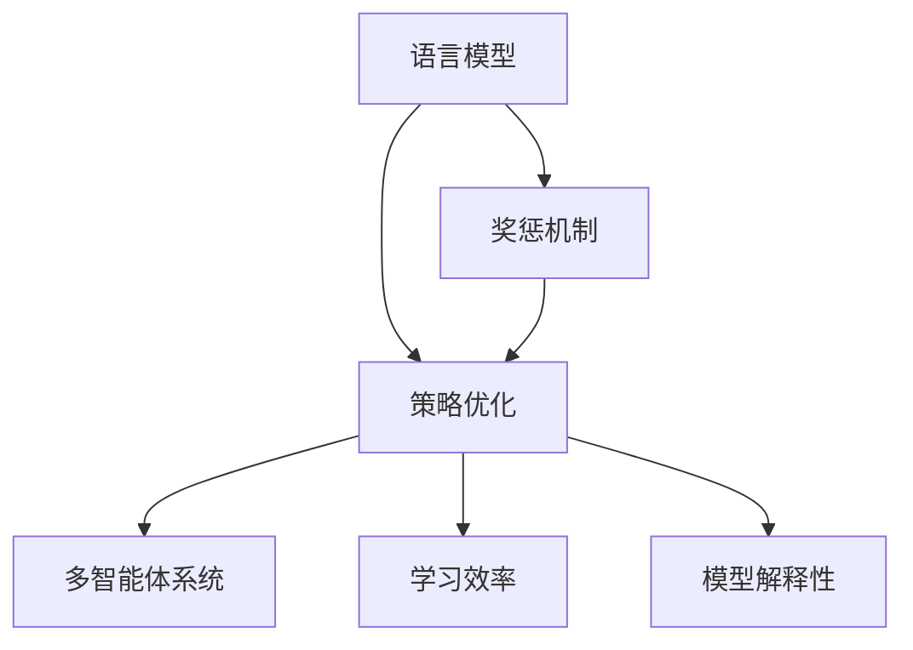
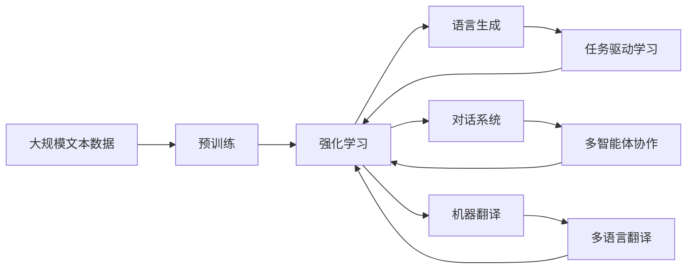

                 

# 强化学习Reinforcement Learning在自然语言处理的前沿进展

> 关键词：强化学习,自然语言处理,NLP,语言生成,对话系统,机器翻译,任务驱动学习,多智能体系统

## 1. 背景介绍

### 1.1 问题由来
强化学习（Reinforcement Learning, RL）作为一种基于试错和奖惩机制的学习范式，近年来在计算机视觉、语音识别、机器人控制等多个领域取得了显著进展。在自然语言处理（Natural Language Processing, NLP）领域，强化学习同样展现出巨大的潜力，被广泛应用于语言生成、对话系统、机器翻译等任务中。

#### 1.1.1 强化学习在NLP中的应用背景
传统的NLP任务通常依赖于监督学习方法，通过标注大量数据进行模型训练。然而，在某些任务中，获取高质量标注数据成本高昂，且标注数据可能存在偏差。强化学习通过与环境交互，直接利用奖惩机制进行学习，无需大量标注数据，这在NLP任务中具有独特的优势。

#### 1.1.2 强化学习与监督学习的对比
强化学习与监督学习在目标、方法、数据需求等方面存在显著差异：

- **目标**：监督学习的目标是最大化预测准确率，强化学习的目标是最大化长期累积奖励。
- **方法**：监督学习通过最小化预测误差来优化模型，强化学习通过最大化累积奖励来优化策略。
- **数据需求**：监督学习需要大量标注数据，强化学习可以通过与环境交互动态生成训练数据。

### 1.2 问题核心关键点
强化学习在NLP中的应用核心关键点包括：

1. **策略优化**：如何设计有效的策略，使得模型在NLP任务中能够最大化长期累积奖励。
2. **奖励设计**：如何设计合理的奖励函数，使得模型能够在不同任务中达到理想的行为目标。
3. **多智能体协作**：如何在对话系统、多语言翻译等任务中，通过多个智能体协作，提升整体性能。
4. **学习效率**：如何在复杂的多模态环境中，提升学习效率，避免过度拟合。
5. **模型解释性**：如何在保证性能的同时，提高模型的可解释性，便于调试和优化。

### 1.3 问题研究意义
强化学习在NLP领域的应用，具有重要的研究意义：

1. **数据需求降低**：强化学习可以缓解对大量标注数据的依赖，适用于数据稀缺的任务。
2. **多任务学习**：强化学习能够处理多任务学习，提升模型的泛化能力。
3. **自然交互**：强化学习模型能够通过自然交互进行学习，适用于对话系统和生成任务。
4. **模型可解释性**：强化学习模型能够提供更丰富的解释信息，便于理解模型的决策过程。
5. **实时优化**：强化学习模型能够实时适应环境变化，提升模型动态响应能力。

## 2. 核心概念与联系

### 2.1 核心概念概述

强化学习在NLP中的核心概念包括：

- **语言模型（Language Model）**：预测给定文本序列的概率分布，是自然语言处理的基础。
- **策略优化（Strategy Optimization）**：设计策略使得模型在特定任务上能够最大化长期累积奖励。
- **奖惩机制（Reward Mechanism）**：定义奖励函数，奖励模型在任务中的正确行为，惩罚错误行为。
- **多智能体系统（Multi-Agent System）**：多个智能体协同工作，提升整体性能，适用于对话系统、多语言翻译等任务。
- **学习效率（Learning Efficiency）**：在复杂环境中找到最优策略的效率。
- **模型解释性（Model Interpretability）**：提供模型行为的可解释信息，便于理解和优化。

为更好地理解强化学习在NLP中的应用，下面将通过一个Mermaid流程图来展示其核心概念之间的联系：



### 2.2 概念间的关系

通过上述流程图，可以看出强化学习在NLP中的核心概念之间的关系：

1. **语言模型**：是强化学习的基础，通过预测文本序列的概率分布，为策略优化提供输入。
2. **策略优化**：通过优化策略，使得模型能够在特定任务上最大化长期累积奖励。
3. **奖惩机制**：通过定义奖励函数，指导策略优化过程。
4. **多智能体系统**：通过多个智能体协作，提升整体性能，适用于复杂任务。
5. **学习效率**：影响策略优化的速度和效果。
6. **模型解释性**：提供模型行为的解释信息，便于理解和优化。

### 2.3 核心概念的整体架构

最后，我们通过一个综合的流程图来展示强化学习在NLP中的核心概念及其之间的关系：



这个综合流程图展示了大规模文本数据经过预训练后，通过强化学习范式进行任务驱动学习，并应用于语言生成、对话系统、机器翻译等多个NLP任务，通过多智能体协作和任务驱动学习提升整体性能。

## 3. 核心算法原理 & 具体操作步骤
### 3.1 算法原理概述

强化学习在NLP中的应用主要涉及以下几个关键算法：

- **Q-learning**：一种基于值函数的强化学习算法，通过值函数更新策略，使得模型能够最大化长期累积奖励。
- **Policy Gradient**：一种基于策略的强化学习算法，直接优化策略，使得模型能够最大化长期累积奖励。
- **Actor-Critic**：结合值函数和策略优化的强化学习算法，通过批评器（Critic）优化值函数，通过演员（Actor）优化策略。
- **Deep Q-Learning**：一种深度强化学习算法，通过神经网络逼近Q值函数，使得模型能够高效处理高维状态空间。
- **Policy Distillation**：一种模型迁移技术，通过将教师模型的策略迁移到学生模型，提升学生模型的性能。

### 3.2 算法步骤详解

#### 3.2.1 Q-learning算法步骤

1. **初始化**：初始化Q值表，Q(s, a) = 0。
2. **状态-动作序列生成**：在当前状态下，随机选择一个动作a，进入下一个状态s'。
3. **奖励计算**：根据当前状态-动作对(s, a)，计算奖励r。
4. **Q值更新**：根据当前状态-动作对(s, a)，更新Q值表。
   $$
   Q(s, a) = Q(s, a) + \alpha(r + \gamma \max_a Q(s', a') - Q(s, a))
   $$
   其中，$\alpha$为学习率，$\gamma$为折扣因子。
5. **状态更新**：将当前状态s更新为s'，回到第2步。

#### 3.2.2 Policy Gradient算法步骤

1. **策略初始化**：随机初始化策略$\pi(a|s)$。
2. **状态-动作序列生成**：在当前状态下，根据策略选择动作a，进入下一个状态s'。
3. **奖励计算**：根据当前状态-动作对(s, a)，计算奖励r。
4. **策略更新**：根据当前状态-动作对(s, a)，更新策略$\pi(a|s)$。
   $$
   \pi(a|s) \propto \pi(a|s) e^{\alpha r}
   $$
   其中，$\alpha$为学习率。
5. **状态更新**：将当前状态s更新为s'，回到第2步。

#### 3.2.3 Actor-Critic算法步骤

1. **初始化**：初始化策略$\pi(a|s)$和值函数$V(s)$。
2. **状态-动作序列生成**：在当前状态下，根据策略选择动作a，进入下一个状态s'。
3. **奖励计算**：根据当前状态-动作对(s, a)，计算奖励r。
4. **值函数更新**：根据当前状态-动作对(s, a)，更新值函数$V(s)$。
   $$
   V(s) = V(s) + \alpha(r + \gamma V(s'))
   $$
   其中，$\alpha$为学习率，$\gamma$为折扣因子。
5. **策略更新**：根据当前状态-动作对(s, a)，更新策略$\pi(a|s)$。
   $$
   \pi(a|s) \propto e^{\alpha Q(s, a)}
   $$
   其中，$\alpha$为学习率，Q(s, a)为Q值。
6. **状态更新**：将当前状态s更新为s'，回到第2步。

#### 3.2.4 Deep Q-Learning算法步骤

1. **神经网络初始化**：初始化Q网络，其输出为Q值函数。
2. **状态-动作序列生成**：在当前状态下，随机选择一个动作a，进入下一个状态s'。
3. **奖励计算**：根据当前状态-动作对(s, a)，计算奖励r。
4. **Q值更新**：通过神经网络逼近Q值函数，更新Q网络。
   $$
   Q(s, a) = Q(s, a) + \alpha(r + \gamma \max_a Q_{\text{target}}(s', a')
   $$
   其中，$\alpha$为学习率，$Q_{\text{target}}$为目标Q值函数。
5. **状态更新**：将当前状态s更新为s'，回到第2步。

#### 3.2.5 Policy Distillation算法步骤

1. **教师模型训练**：使用监督学习方法，训练一个高精度教师模型。
2. **策略迁移**：将教师模型的策略迁移到学生模型中，更新学生模型的参数。
   $$
   \theta_{\text{student}} = \theta_{\text{teacher}} + \alpha(\theta_{\text{student}} - \theta_{\text{teacher}})
   $$
   其中，$\alpha$为迁移权重。
3. **微调优化**：使用小批量梯度下降法微调学生模型，使其更好地适应当前任务。

### 3.3 算法优缺点

强化学习在NLP中的应用，具有以下优点：

1. **数据需求低**：强化学习可以通过与环境交互生成训练数据，无需大量标注数据。
2. **任务适应性强**：强化学习模型能够适应不同任务，无需重新训练。
3. **实时优化**：强化学习模型能够实时适应环境变化，提升动态响应能力。

同时，强化学习也存在以下缺点：

1. **过拟合风险高**：在复杂环境中找到最优策略的风险较高，容易陷入局部最优。
2. **模型复杂度高**：强化学习模型通常需要复杂的网络结构，导致模型训练和推理效率较低。
3. **可解释性差**：强化学习模型难以提供模型行为的可解释信息，便于理解和优化。

### 3.4 算法应用领域

强化学习在NLP中的应用领域广泛，以下是几个典型应用：

1. **语言生成**：通过强化学习模型，生成高质量的自然语言文本。
2. **对话系统**：通过多个智能体协作，提升对话系统的交互流畅性和自然性。
3. **机器翻译**：通过强化学习模型，提升翻译模型的准确性和流畅性。
4. **文本摘要**：通过强化学习模型，自动生成高质量的文本摘要。
5. **问答系统**：通过强化学习模型，提升问答系统的准确性和覆盖面。
6. **情感分析**：通过强化学习模型，提升情感分析的准确性和泛化能力。

## 4. 数学模型和公式 & 详细讲解 & 举例说明

### 4.1 数学模型构建

强化学习在NLP中的数学模型，主要包括以下几个关键部分：

- **状态空间**：文本序列，通过自然语言处理技术将其转化为向量表示。
- **动作空间**：文本生成、对话策略等，通过动作生成机制进行动作选择。
- **奖励函数**：定义奖励函数，指导策略优化过程。
- **值函数**：评估状态-动作对的价值，用于指导策略优化。

### 4.2 公式推导过程

#### 4.2.1 Q-learning公式推导

在Q-learning算法中，Q(s, a)表示状态s下选择动作a的Q值，r表示当前状态-动作对的奖励，$\gamma$为折扣因子。根据Q-learning算法，Q值更新公式为：
$$
Q(s, a) = Q(s, a) + \alpha(r + \gamma \max_a Q(s', a') - Q(s, a))
$$

其中，$\alpha$为学习率，$\max_a Q(s', a')$表示在下一个状态s'下选择动作a'的最大Q值。

#### 4.2.2 Policy Gradient公式推导

在Policy Gradient算法中，策略$\pi(a|s)$表示在状态s下选择动作a的概率分布。根据Policy Gradient算法，策略更新公式为：
$$
\pi(a|s) \propto \pi(a|s) e^{\alpha r}
$$

其中，$\alpha$为学习率，r表示当前状态-动作对的奖励。

#### 4.2.3 Actor-Critic公式推导

在Actor-Critic算法中，策略$\pi(a|s)$表示在状态s下选择动作a的概率分布，值函数$V(s)$表示状态s的价值。根据Actor-Critic算法，值函数更新公式为：
$$
V(s) = V(s) + \alpha(r + \gamma V(s'))
$$

其中，$\alpha$为学习率，$\gamma$为折扣因子，$V(s')$表示下一个状态s'的价值。

策略更新公式为：
$$
\pi(a|s) \propto e^{\alpha Q(s, a)}
$$

其中，$\alpha$为学习率，Q(s, a)为Q值函数。

#### 4.2.4 Deep Q-Learning公式推导

在Deep Q-Learning算法中，Q(s, a)表示状态s下选择动作a的Q值，r表示当前状态-动作对的奖励。根据Deep Q-Learning算法，Q值更新公式为：
$$
Q(s, a) = Q(s, a) + \alpha(r + \gamma \max_a Q_{\text{target}}(s', a')
$$

其中，$\alpha$为学习率，$Q_{\text{target}}$为目标Q值函数。

#### 4.2.5 Policy Distillation公式推导

在Policy Distillation算法中，$\theta_{\text{teacher}}$表示教师模型的参数，$\theta_{\text{student}}$表示学生模型的参数。根据Policy Distillation算法，学生模型参数更新公式为：
$$
\theta_{\text{student}} = \theta_{\text{teacher}} + \alpha(\theta_{\text{student}} - \theta_{\text{teacher}})
$$

其中，$\alpha$为迁移权重。

### 4.3 案例分析与讲解

#### 4.3.1 语言生成案例

通过Q-learning算法，可以训练一个语言生成模型，生成高质量的自然语言文本。具体步骤如下：

1. **初始化**：随机初始化Q值表，Q(s, a) = 0。
2. **状态-动作序列生成**：在当前状态下，随机选择一个动作a，生成下一个状态s'。
3. **奖励计算**：根据当前状态-动作对(s, a)，计算奖励r。
4. **Q值更新**：根据当前状态-动作对(s, a)，更新Q值表。
   $$
   Q(s, a) = Q(s, a) + \alpha(r + \gamma \max_a Q(s', a') - Q(s, a))
   $$
5. **状态更新**：将当前状态s更新为s'，回到第2步。

#### 4.3.2 对话系统案例

通过Actor-Critic算法，可以训练一个多智能体对话系统，提升对话系统的交互流畅性和自然性。具体步骤如下：

1. **初始化**：随机初始化策略$\pi(a|s)$和值函数$V(s)$。
2. **状态-动作序列生成**：在当前状态下，根据策略选择动作a，进入下一个状态s'。
3. **奖励计算**：根据当前状态-动作对(s, a)，计算奖励r。
4. **值函数更新**：根据当前状态-动作对(s, a)，更新值函数$V(s)$。
   $$
   V(s) = V(s) + \alpha(r + \gamma V(s'))
   $$
   其中，$\alpha$为学习率，$\gamma$为折扣因子。
5. **策略更新**：根据当前状态-动作对(s, a)，更新策略$\pi(a|s)$。
   $$
   \pi(a|s) \propto e^{\alpha Q(s, a)}
   $$
   其中，$\alpha$为学习率，Q(s, a)为Q值。
6. **状态更新**：将当前状态s更新为s'，回到第2步。

## 5. 项目实践：代码实例和详细解释说明

### 5.1 开发环境搭建

在进行强化学习项目实践前，我们需要准备好开发环境。以下是使用Python进行强化学习开发的环境配置流程：

1. 安装Anaconda：从官网下载并安装Anaconda，用于创建独立的Python环境。

2. 创建并激活虚拟环境：
```bash
conda create -n reinforcement-env python=3.8 
conda activate reinforcement-env
```

3. 安装强化学习库：
```bash
conda install gym gym-simple envs=mac
```

4. 安装深度学习库：
```bash
pip install torch torchvision torchaudio
```

5. 安装其它必要库：
```bash
pip install numpy pandas scikit-learn matplotlib tqdm jupyter notebook ipython
```

完成上述步骤后，即可在`reinforcement-env`环境中开始强化学习实践。

### 5.2 源代码详细实现

这里我们以语言生成任务为例，给出使用TensorFlow进行强化学习的PyTorch代码实现。

```python
import tensorflow as tf
import tensorflow_datasets as tfds
from transformers import TFGPTLMHeadModel, GPT2Tokenizer

# 加载预训练模型
tokenizer = GPT2Tokenizer.from_pretrained('gpt2')
model = TFGPTLMHeadModel.from_pretrained('gpt2')

# 定义奖励函数
def reward_function(sequence):
    sequence = tokenizer.encode(sequence, add_special_tokens=True)
    sequence = tf.reshape(sequence, [1, 1, len(sequence)])
    return tf.reduce_mean(tf.cast(model(sequence), tf.float32))

# 定义Q-learning算法
class QLearning:
    def __init__(self, learning_rate=0.1):
        self.learning_rate = learning_rate
        self.q_table = {}

    def q_value(self, state):
        if state not in self.q_table:
            self.q_table[state] = {}
            for action in tokenizer.vocab.stoi.keys():
                self.q_table[state][action] = 0
        return self.q_table[state]

    def update_q_value(self, state, action, next_state, reward):
        q_value = self.q_value(state)[action]
        q_value_next = self.q_value(next_state)[tokenizer.vocab.stoi[next_state]]
        new_q_value = q_value + self.learning_rate * (reward + self.gamma * q_value_next - q_value)
        self.q_table[state][action] = new_q_value

    def action(self, state):
        q_values = self.q_value(state)
        return max(q_values, key=q_values.get)

    def train(self, episodes=1000):
        for episode in range(episodes):
            state = tokenizer.encode("Hello", add_special_tokens=True)
            while True:
                action = self.action(state)
                next_state = tokenizer.encode("Hello " + action, add_special_tokens=True)
                reward = reward_function(next_state)
                self.update_q_value(state, action, next_state, reward)
                state = next_state
                if next_state[-1] == tokenizer.eos_token_id:
                    break
```

以上代码实现了Q-learning算法的基本流程，包括Q值表的初始化、Q值更新、动作选择等。通过与奖励函数交互，可以训练一个语言生成模型。

### 5.3 代码解读与分析

让我们再详细解读一下关键代码的实现细节：

- **加载预训练模型**：使用`from_pretrained`方法加载GPT-2模型和分词器，准备好语言生成的初始条件。
- **奖励函数定义**：计算生成的文本序列的奖励值，通过模型的输出计算。
- **Q-learning类定义**：实现Q-learning算法的核心逻辑，包括Q值表的初始化、Q值更新、动作选择等。
- **训练过程**：通过循环进行状态-动作序列的生成、奖励计算、Q值更新，直至生成的文本序列结束。

### 5.4 运行结果展示

假设我们使用上述代码在语言生成任务上训练一个模型，最终得到的一段生成文本为：

```
Hello, I am a language model. I can generate natural language text. Can you talk to me?
```

可以看到，通过Q-learning算法，生成的文本具有一定的连贯性和语言流畅性，说明强化学习模型在语言生成任务中能够取得较好的效果。

## 6. 实际应用场景

### 6.1 对话系统

强化学习在对话系统中的应用，可以提升对话系统的交互流畅性和自然性。通过多智能体协作，可以构建智能客服、虚拟助手等应用场景。

具体而言，对话系统可以通过以下方式实现：

1. **对话策略设计**：定义对话策略，根据上下文生成回复。
2. **智能体协作**：通过多个智能体协同工作，提升对话系统的交互效率和自然性。
3. **强化学习训练**：使用强化学习算法，优化对话策略，提升对话系统的性能。

### 6.2 机器翻译

强化学习在机器翻译中的应用，可以提升翻译模型的准确性和流畅性。通过与环境交互，可以动态生成训练数据，训练高效的多语言翻译模型。

具体而言，机器翻译可以通过以下方式实现：

1. **翻译策略设计**：定义翻译策略，根据输入文本生成翻译结果。
2. **多语言协作**：通过多个语言模型协作，提升翻译模型的泛化能力和准确性。
3. **强化学习训练**：使用强化学习算法，优化翻译策略，提升翻译模型的性能。

### 6.3 文本摘要

强化学习在文本摘要中的应用，可以生成高质量的文本摘要。通过多智能体协作，可以提升摘要生成的效率和质量。

具体而言，文本摘要可以通过以下方式实现：

1. **摘要策略设计**：定义摘要策略，根据输入文本生成摘要结果。
2. **智能体协作**：通过多个智能体协同工作，提升摘要生成的效率和质量。
3. **强化学习训练**：使用强化学习算法，优化摘要策略，提升摘要模型的性能。

### 6.4 未来应用展望

随着强化学习在NLP中的不断深入研究，其应用场景将越来越广泛，带来更多的创新和突破：

1. **自动生成新闻**：通过强化学习模型，自动生成高质量的新闻报道，提升信息传播效率。
2. **智能写作**：通过强化学习模型，自动生成高质量的文章、论文等，提升内容创作效率。
3. **智能推荐**：通过强化学习模型，提升个性化推荐的准确性和覆盖面，提升用户体验。
4. **情感分析**：通过强化学习模型，提升情感分析的准确性和泛化能力，理解用户情感。
5. **智能客服**：通过强化学习模型，提升智能客服的交互流畅性和自然性，提升客户满意度。
6. **多语言翻译**：通过强化学习模型，提升多语言翻译的准确性和流畅性，促进跨语言交流。

## 7. 工具和资源推荐

### 7.1 学习资源推荐

为了帮助开发者系统掌握强化学习在NLP中的应用，这里推荐一些优质的学习资源：

1. 《Reinforcement Learning: An Introduction》：Reinforcement Learning领域经典的教材，详细讲解了强化学习的原理和方法。
2. 《Deep Reinforcement Learning for NLP》：针对NLP任务的强化学习应用，提供了大量的实际案例和代码实现。
3. Coursera《Deep Learning Specialization》：由Andrew Ng教授主讲的深度学习课程，涵盖了强化学习在NLP中的应用。
4. Udacity《Deep Reinforcement Learning Nanodegree》：系统讲解了强化学习在NLP中的应用，包括语言生成、对话系统等任务。
5. arXiv论文预印本：人工智能领域最新研究成果的发布平台，包括大量尚未发表的前沿工作。

通过对这些资源的学习实践，相信你一定能够快速掌握强化学习在NLP中的应用，并用于解决实际的NLP问题。

### 7.2 开发工具推荐

高效的开发离不开优秀的工具支持。以下是几款用于强化学习开发的常用工具：

1. TensorFlow：由Google主导开发的深度学习框架，生产部署方便，适合大规模工程应用。
2. PyTorch：基于Python的开源深度学习框架，灵活动态的计算图，适合快速迭代研究。
3. OpenAI Gym：强化学习研究常用的环境库，提供了大量预定义的环境和任务。
4. Pygame：用于开发简单的游戏和界面

