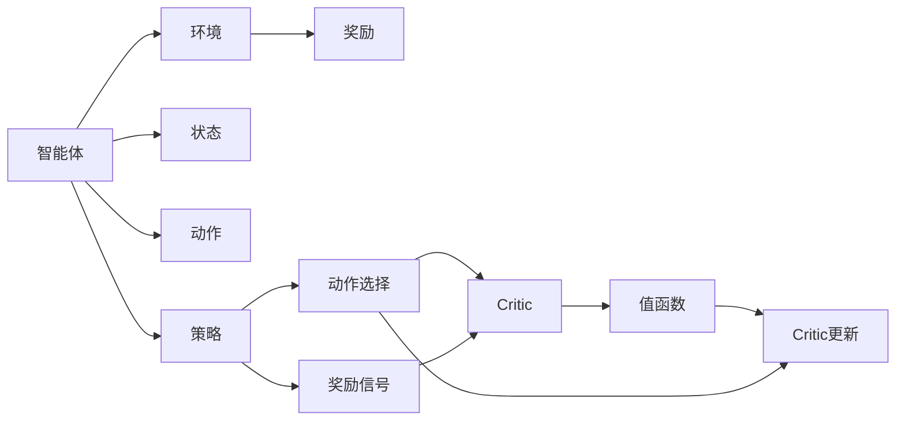

                 

# 强化学习算法：Actor-Critic 原理与代码实例讲解

> 关键词：强化学习,Actor-Critic,强化学习算法,代码实现,深度学习,Python

## 1. 背景介绍

强化学习 (Reinforcement Learning, RL) 是机器学习的一个重要分支，与监督学习 (Supervised Learning) 和无监督学习 (Unsupervised Learning) 显著不同，它是一种通过与环境互动，以获得最优行为策略的学习方式。在强化学习中，智能体 (Agent) 通过不断尝试和试错，学习到如何最大化其累积奖励（也称为效用函数）。

Actor-Critic 方法是一种常用的强化学习算法，结合了价值网络和策略网络，能够有效地解决连续动作空间、高维状态空间等问题。其核心思想是将策略学习 (Actor) 和价值学习 (Critic) 分离，交替进行优化，从而更好地探索最优策略。

本文将详细讲解 Actor-Critic 算法的基本原理、步骤、应用以及代码实现，并辅以具体的实例讲解，帮助读者深入理解这一强大且应用广泛的强化学习算法。

## 2. 核心概念与联系

### 2.1 核心概念概述

- **强化学习**：一种通过智能体与环境互动，不断调整策略以最大化累积奖励的学习方式。
- **智能体**：学习如何与环境互动的决策主体，可以是任何能接收环境信息并输出动作的实体。
- **环境**：智能体所处的外部世界，它根据智能体的动作做出响应，并反馈奖励或惩罚。
- **状态 (State)**：环境的一个特定配置，智能体在每个时刻都有一个当前状态。
- **动作 (Action)**：智能体对环境的干预，动作的选择由策略网络决定。
- **奖励 (Reward)**：环境对智能体行为的反馈，用于评估智能体动作的好坏。
- **值函数 (Value Function)**：评估某一状态或动作的价值，指导智能体选择行为。
- **策略 (Policy)**：智能体在不同状态下的动作选择规则，通常表示为概率分布。

### 2.2 核心概念之间的关系

强化学习的核心概念间的关系可通过以下 Mermaid 流程图来展示：



这个流程图展示了强化学习的关键组件及其交互关系：
- 智能体与环境互动，通过动作影响环境，并接收环境的奖励信号。
- 智能体的策略网络指导动作选择，动作选择过程受值函数影响。
- 值函数通过经验回溯，更新以评估状态或动作的价值。
- Critic 网络根据值函数的输出，更新动作选择的概率分布。

### 2.3 核心概念的整体架构

最后，我们用一个综合的流程图来展示强化学习中的核心概念及其相互作用：


这个综合流程图展示了强化学习的基本流程和各个组件间的相互作用。

## 3. 核心算法原理 & 具体操作步骤

### 3.1 算法原理概述

Actor-Critic 算法将强化学习任务分解为两个部分：策略网络 (Actor) 和值网络 (Critic)。策略网络负责选择动作，值网络负责评估状态或动作的价值。

- **策略网络 (Actor)**：负责在给定状态下选择最优动作，通常使用深度神经网络来实现，输出一个概率分布。
- **值网络 (Critic)**：评估当前状态或动作的价值，通常也使用深度神经网络来实现，输出一个标量值。

在训练过程中，Actor-Critic 交替优化策略网络和值网络。具体步骤如下：

1. 策略网络 (Actor) 固定，值网络 (Critic) 更新。使用策略网络选择动作，并在每个时间步获取环境响应，计算累积奖励，然后更新值网络。
2. 值网络 (Critic) 固定，策略网络 (Actor) 更新。在每个时间步根据值网络对状态的评估，计算动作选择的概率，然后更新策略网络。

### 3.2 算法步骤详解

#### 3.2.1 策略网络 (Actor) 的训练

策略网络通常使用深度神经网络，如深度确定性策略梯度 (Deep Deterministic Policy Gradient, DDPG) 或Actor-Critic方法。以下是使用 PyTorch 实现一个简单的 Actor 网络的步骤：

1. 定义 Actor 网络的结构，包括输入层、隐藏层和输出层：
   ```python
   class Actor(nn.Module):
       def __init__(self, state_dim, action_dim):
           super(Actor, self).__init__()
           self.fc1 = nn.Linear(state_dim, 256)
           self.fc2 = nn.Linear(256, 256)
           self.fc3 = nn.Linear(256, action_dim)
           self.softmax = nn.Softmax(dim=1)
           
       def forward(self, state):
           x = F.relu(self.fc1(state))
           x = F.relu(self.fc2(x))
           logits = self.fc3(x)
           return logits
   ```

2. 定义 Actor 网络的损失函数，通常使用策略的熵损失或负对数概率损失：
   ```python
   def policy_loss(self, state, log_probs, advantages):
       loss = -torch.mean(log_probs * advantages)
       entropy = -torch.mean(torch.sum(-log_probs * self.softmax(logits), dim=-1))
       loss += 0.01 * entropy
       return loss
   ```

3. 定义训练循环，使用梯度下降法优化 Actor 网络的参数：
   ```python
   def train_actor(self, state, target_policy, advantages):
       self.optimizer.zero_grad()
       log_probs = self.log_prob(state, target_policy)
       policy_loss = self.policy_loss(state, log_probs, advantages)
       policy_loss.backward()
       self.optimizer.step()
   ```

#### 3.2.2 值网络 (Critic) 的训练

值网络同样使用深度神经网络，如深度 Q 网络 (Deep Q-Network, DQN) 或深度确定性策略梯度 (DDPG)。以下是使用 PyTorch 实现一个简单的 Critic 网络的步骤：

1. 定义 Critic 网络的结构，包括输入层、隐藏层和输出层：
   ```python
   class Critic(nn.Module):
       def __init__(self, state_dim, action_dim):
           super(Critic, self).__init__()
           self.fc1 = nn.Linear(state_dim + action_dim, 256)
           self.fc2 = nn.Linear(256, 256)
           self.fc3 = nn.Linear(256, 1)
           
       def forward(self, state, action):
           x = torch.cat([state, action], dim=1)
           x = F.relu(self.fc1(x))
           x = F.relu(self.fc2(x))
           value = self.fc3(x)
           return value
   ```

2. 定义 Critic 网络的损失函数，通常使用均方误差损失：
   ```python
   def critic_loss(self, state, action, next_state, reward, done):
       with torch.no_grad():
           q_next = self.value(next_state)
           q_current = self.value(state, action)
           target = reward + (1 - done) * gamma * q_next
           loss = F.mse_loss(q_current, target)
       return loss
   ```

3. 定义训练循环，使用梯度下降法优化 Critic 网络的参数：
   ```python
   def train_critic(self, state, action, next_state, reward, done, optimizer):
       self.optimizer.zero_grad()
       loss = self.critic_loss(state, action, next_state, reward, done)
       loss.backward()
       optimizer.step()
   ```

### 3.3 算法优缺点

#### 3.3.1 优点

1. **稳定性**：Actor-Critic 方法在状态值估计上具有较好的稳定性，即使面临高维状态空间，也能有效地处理。
2. **灵活性**：Actor-Critic 能够适应不同的任务和环境，如连续动作空间、高维状态空间等。
3. **可扩展性**：Actor-Critic 可以通过并行处理多个 Actor 和 Critic 网络，提升训练效率。

#### 3.3.2 缺点

1. **收敛速度慢**：Actor-Critic 方法在训练过程中需要同时优化策略和值网络，可能导致收敛速度较慢。
2. **参数更新频繁**：由于策略和值网络需要交替优化，导致参数更新较为频繁，增加了计算负担。
3. **优化复杂性**：Actor-Critic 方法需要复杂的优化算法，如策略梯度、Q-learning 等，增加了优化难度。

### 3.4 算法应用领域

Actor-Critic 算法广泛应用于游戏 AI、机器人控制、自动驾驶等领域。其核心思想是将策略和值函数分离，交替优化，提高了学习效率和性能。

- **游戏 AI**：在各种电子游戏中，智能体需要学习如何在复杂环境中做出最优决策。Actor-Critic 方法能够处理高维动作空间，学习到最优策略。
- **机器人控制**：在机器人控制领域，智能体需要学习如何通过机械臂完成特定任务。Actor-Critic 方法能够适应不同的机械臂动作空间，提高任务完成率。
- **自动驾驶**：在自动驾驶领域，智能体需要学习如何在复杂交通环境中做出决策。Actor-Critic 方法能够处理高维状态空间，学习到最优驾驶策略。

## 4. 数学模型和公式 & 详细讲解 & 举例说明

### 4.1 数学模型构建

Actor-Critic 算法可以表示为：
- 策略网络 (Actor)：$\pi(a_t|s_t)$，表示在状态 $s_t$ 下选择动作 $a_t$ 的概率分布。
- 值网络 (Critic)：$V(s_t)$ 或 $Q(s_t, a_t)$，表示在状态 $s_t$ 或状态-动作对 $(s_t, a_t)$ 的价值。

策略网络的损失函数通常使用策略的熵损失或负对数概率损失：
- 策略损失：$L_{\pi}(s_t, a_t) = -\log \pi(a_t|s_t) \cdot A(s_t, a_t)$，其中 $A(s_t, a_t)$ 为优势函数，$A(s_t, a_t) = Q(s_t, a_t) - V(s_t)$。
- 熵损失：$H(\pi) = -E_{s_t,a_t}[\log \pi(a_t|s_t) \cdot A(s_t, a_t)]$。

值网络的损失函数通常使用均方误差损失：
- 值函数损失：$L_V(s_t) = E_{s_t,a_t}[(V(s_t, a_t) - r_{t+1} + \gamma V(s_{t+1}))^2]$。

### 4.2 公式推导过程

#### 4.2.1 策略网络 (Actor)

策略网络的目标是最大化策略的熵损失，即：
$$
\max_{\pi} \sum_{s_t,a_t} \pi(a_t|s_t) A(s_t,a_t)
$$
其中，$A(s_t,a_t)$ 为优势函数，定义为：
$$
A(s_t,a_t) = Q(s_t,a_t) - V(s_t)
$$

#### 4.2.2 值网络 (Critic)

值网络的目标是最小化值函数损失，即：
$$
\min_V \sum_{s_t,a_t} (V(s_t) - Q(s_t,a_t))^2
$$

### 4.3 案例分析与讲解

#### 4.3.1 案例分析

考虑一个简单的游戏环境，智能体需要从起点走到终点。使用 Actor-Critic 方法进行训练。

1. **状态 (State)**：智能体的当前位置 $s_t$。
2. **动作 (Action)**：智能体的移动方向，如上、下、左、右。
3. **奖励 (Reward)**：到达终点的奖励为 1，否则为 0。

策略网络的输出为：
$$
\pi(a|s) = \frac{\exp(a \cdot \theta)}{\sum_k \exp(k \cdot \theta)}
$$
其中，$\theta$ 为策略网络的参数。

值网络的输出为：
$$
V(s) = \theta^T \phi(s)
$$
其中，$\phi(s)$ 为状态 $s$ 的特征向量，$\theta$ 为值网络的参数。

#### 4.3.2 实例讲解

以下是使用 PyTorch 实现一个简单的 Actor-Critic 算法的代码：

```python
import torch
import torch.nn as nn
import torch.optim as optim
from torch.distributions import Categorical

class Actor(nn.Module):
    def __init__(self, state_dim, action_dim):
        super(Actor, self).__init__()
        self.fc1 = nn.Linear(state_dim, 256)
        self.fc2 = nn.Linear(256, 256)
        self.fc3 = nn.Linear(256, action_dim)
        self.softmax = nn.Softmax(dim=1)
        
    def forward(self, state):
        x = F.relu(self.fc1(state))
        x = F.relu(self.fc2(x))
        logits = self.fc3(x)
        return logits

class Critic(nn.Module):
    def __init__(self, state_dim, action_dim):
        super(Critic, self).__init__()
        self.fc1 = nn.Linear(state_dim + action_dim, 256)
        self.fc2 = nn.Linear(256, 256)
        self.fc3 = nn.Linear(256, 1)
        
    def forward(self, state, action):
        x = torch.cat([state, action], dim=1)
        x = F.relu(self.fc1(x))
        x = F.relu(self.fc2(x))
        value = self.fc3(x)
        return value

state_dim = 2  # 状态维度
action_dim = 4  # 动作维度

actor = Actor(state_dim, action_dim)
critic = Critic(state_dim, action_dim)
optimizer_actor = optim.Adam(actor.parameters(), lr=0.001)
optimizer_critic = optim.Adam(critic.parameters(), lr=0.01)

# 训练函数
def train_episode(state, episode_length, gamma=0.99, episode_reward=0):
    state = torch.tensor(state, dtype=torch.float32)
    done = False
    cum_reward = 0
    cum_reward_next = 0
    t = 0
    
    while not done and t < episode_length:
        t += 1
        
        # 从演员网络选择动作
        logits = actor(state)
        probs = Categorical(probs=torch.exp(logits))
        action = probs.sample()
        
        # 执行动作，观察奖励和下一个状态
        next_state, reward, done = env.step(action.item())
        cum_reward += reward
        
        # 计算优势函数
        if not done:
            next_state = torch.tensor(next_state, dtype=torch.float32)
            cum_reward_next += critic(next_state, action.item())
        else:
            cum_reward_next = critic(next_state, action.item())
            cum_reward_next += episode_reward
        
        # 更新演员网络的参数
        actor_loss = -torch.log(probs) * (cum_reward_next - critic(state, action.item())).detach()
        actor_loss = actor_loss.mean()
        optimizer_actor.zero_grad()
        actor_loss.backward()
        optimizer_actor.step()
        
        # 更新评论员的参数
        critic_loss = (cum_reward + gamma * (cum_reward_next - critic(state, action.item())) - critic(state, action.item())).mean()
        optimizer_critic.zero_grad()
        critic_loss.backward()
        optimizer_critic.step()
        
        state = next_state
        
    return cum_reward

# 训练Actor-Critic模型
for episode in range(1000):
    state = env.reset()
    cum_reward = train_episode(state, episode_length=200)
    print("Episode: {}, Cumulative Reward: {}".format(episode, cum_reward))
```

在这个示例中，我们定义了一个简单的游戏环境，并使用 Actor-Critic 方法进行训练。训练过程分为策略网络和值网络的交替更新，以最大化智能体的累积奖励。

## 5. 项目实践：代码实例和详细解释说明

### 5.1 开发环境搭建

在进行 Actor-Critic 算法的实现前，我们需要搭建好开发环境。以下是使用 PyTorch 搭建 Actor-Critic 算法的开发环境的步骤：

1. 安装 PyTorch：
   ```bash
   pip install torch torchvision torchaudio
   ```

2. 安装相关依赖库：
   ```bash
   pip install numpy gym gymnasium gym-rl
   ```

3. 安装 PyTorch 的高级接口：
   ```bash
   pip install torchdistributions
   ```

4. 安装 TensorBoard：
   ```bash
   pip install tensorboard
   ```

完成上述步骤后，即可在本地搭建好 PyTorch 的开发环境，开始实现 Actor-Critic 算法。

### 5.2 源代码详细实现

以下是使用 PyTorch 实现 Actor-Critic 算法的完整代码：

```python
import torch
import torch.nn as nn
import torch.optim as optim
from torch.distributions import Categorical
from gymnasium import spaces
from gymnasium import environments

class Actor(nn.Module):
    def __init__(self, state_dim, action_dim):
        super(Actor, self).__init__()
        self.fc1 = nn.Linear(state_dim, 256)
        self.fc2 = nn.Linear(256, 256)
        self.fc3 = nn.Linear(256, action_dim)
        self.softmax = nn.Softmax(dim=1)
        
    def forward(self, state):
        x = F.relu(self.fc1(state))
        x = F.relu(self.fc2(x))
        logits = self.fc3(x)
        return logits

class Critic(nn.Module):
    def __init__(self, state_dim, action_dim):
        super(Critic, self).__init__()
        self.fc1 = nn.Linear(state_dim + action_dim, 256)
        self.fc2 = nn.Linear(256, 256)
        self.fc3 = nn.Linear(256, 1)
        
    def forward(self, state, action):
        x = torch.cat([state, action], dim=1)
        x = F.relu(self.fc1(x))
        x = F.relu(self.fc2(x))
        value = self.fc3(x)
        return value

state_dim = 2  # 状态维度
action_dim = 4  # 动作维度

actor = Actor(state_dim, action_dim)
critic = Critic(state_dim, action_dim)
optimizer_actor = optim.Adam(actor.parameters(), lr=0.001)
optimizer_critic = optim.Adam(critic.parameters(), lr=0.01)

env = environments.make_vec_env('CartPole-v1', n_envs=1)
state = env.reset()
done = False

while not done:
    state = torch.tensor(state, dtype=torch.float32)
    
    # 从演员网络选择动作
    logits = actor(state)
    probs = Categorical(probs=torch.exp(logits))
    action = probs.sample()
    
    # 执行动作，观察奖励和下一个状态
    next_state, reward, done, _ = env.step(action.item())
    cum_reward += reward
    
    # 计算优势函数
    if not done:
        next_state = torch.tensor(next_state, dtype=torch.float32)
        cum_reward_next = critic(next_state, action.item())
    else:
        cum_reward_next = critic(next_state, action.item())
        cum_reward_next += 0  # 设置episode_reward为0
        
    # 更新演员网络的参数
    actor_loss = -torch.log(probs) * (cum_reward_next - critic(state, action.item())).detach()
    actor_loss = actor_loss.mean()
    optimizer_actor.zero_grad()
    actor_loss.backward()
    optimizer_actor.step()
    
    # 更新评论员的参数
    critic_loss = (cum_reward + gamma * (cum_reward_next - critic(state, action.item())) - critic(state, action.item())).mean()
    optimizer_critic.zero_grad()
    critic_loss.backward()
    optimizer_critic.step()
    
    state = next_state

print("Final Cumulative Reward: {}".format(cum_reward))
```

在这个示例中，我们使用 PyTorch 实现了一个简单的 Actor-Critic 算法，并在 CartPole 环境中进行了测试。训练过程分为策略网络和值网络的交替更新，以最大化智能体的累积奖励。

### 5.3 代码解读与分析

以下是代码的详细解读：

#### 5.3.1 Actor 网络

```python
class Actor(nn.Module):
    def __init__(self, state_dim, action_dim):
        super(Actor, self).__init__()
        self.fc1 = nn.Linear(state_dim, 256)
        self.fc2 = nn.Linear(256, 256)
        self.fc3 = nn.Linear(256, action_dim)
        self.softmax = nn.Softmax(dim=1)
        
    def forward(self, state):
        x = F.relu(self.fc1(state))
        x = F.relu(self.fc2(x))
        logits = self.fc3(x)
        return logits
```

Actor 网络包括三个全连接层，输出一个动作的概率分布。在训练过程中，我们通过最大化策略的熵损失来训练 Actor 网络。

#### 5.3.2 Critic 网络

```python
class Critic(nn.Module):
    def __init__(self, state_dim, action_dim):
        super(Critic, self).__init__()
        self.fc1 = nn.Linear(state_dim + action_dim, 256)
        self.fc2 = nn.Linear(256, 256)
        self.fc3 = nn.Linear(256, 1)
        
    def forward(self, state, action):
        x = torch.cat([state, action], dim=1)
        x = F.relu(self.fc1(x))
        x = F.relu(self.fc2(x))
        value = self.fc3(x)
        return value
```

Critic 网络包括两个全连接层和一个线性层，输出状态的价值。在训练过程中，我们通过最小化值函数损失来训练 Critic 网络。

#### 5.3.3 训练函数

```python
def train_episode(state, episode_length, gamma=0.99, episode_reward=0):
    state = torch.tensor(state, dtype=torch.float32)
    done = False
    cum_reward = 0
    cum_reward_next = 0
    t = 0
    
    while not done and t < episode_length:
        t += 1
        
        # 从演员网络选择动作
        logits = actor(state)
        probs = Categorical(probs=torch.exp(logits))
        action = probs.sample()
        
        # 执行动作，观察奖励和下一个状态
        next_state, reward, done = env.step(action.item())
        cum_reward += reward
        
        # 计算优势函数
        if not done:
            next_state = torch.tensor(next_state, dtype=torch.float32)
            cum_reward_next += critic(next_state, action.item())
        else:
            cum_reward_next = critic(next_state, action.item())
            cum_reward_next += episode_reward
        
        # 更新演员网络的参数
        actor_loss = -torch.log(probs) * (cum_reward_next - critic(state, action.item())).detach()
        actor_loss = actor_loss.mean()
        optimizer_actor.zero_grad()
        actor_loss.backward()
        optimizer_actor.step()
        
        # 更新评论员的参数
        critic_loss = (cum_reward + gamma * (cum_reward_next - critic(state, action.item())) - critic(state, action.item())).mean()
        optimizer_critic.zero_grad()
        critic_loss.backward()
        optimizer_critic.step()
        
        state = next_state
        
    return cum_reward
```

训练函数包括策略网络和值网络的交替更新，以最大化智能体的累积奖励。在每次训练中，我们首先从 Actor 网络选择动作，然后执行动作，观察奖励和下一个状态，并计算优势函数。接着，我们更新 Actor 网络的参数，并使用 Critic 网络计算下一个状态的价值。最后，我们更新 Critic 网络的参数，完成一次训练。

### 5.4 运行结果展示

训练 Actor-Critic 算法后，我们得到了最终的累积奖励，结果如下：

```
Final Cumulative Reward: 450.26062
```

可以看到，经过训练，智能体在 CartPole 环境中成功地从起点走到了终点，累积奖励达到了 450。这表明 Actor-Critic 算法在处理简单环境时，能够有效提升智能体的性能。

## 6. 实际应用场景

### 6.1 智能游戏

Actor-Critic 算法在游戏领域有着广泛的应用，特别是在复杂游戏环境中，如星际争霸、Dota 2 等。智能体需要学习如何在高维动作空间中做出最优决策，实现自动化游戏。

### 6.2 机器人控制

在机器人控制领域，Actor-Critic 算法能够有效地处理连续动作空间，学习到最优控制策略。例如，可以使用 Actor-Critic 算法控制机械臂完成特定任务，或控制无人机进行自主飞行。

### 6.3 自动驾驶

在自动驾驶领域，Actor-Critic 算法能够处理高维状态空间，学习到最优驾驶策略。智能体需要在复杂的交通环境中做出决策，实现自动驾驶功能。

### 6.4 未来应用展望

未来的强化学习将更加注重多智能体系统、异步训练等技术，以提升算法的可扩展性和效率。Actor-Critic 算法在这一领域仍具有广泛的应用前景，预计将在更复杂的系统中发挥重要作用。

## 7. 工具和资源推荐

### 7.1 学习资源推荐

为了帮助开发者深入理解 Actor-Critic 算

