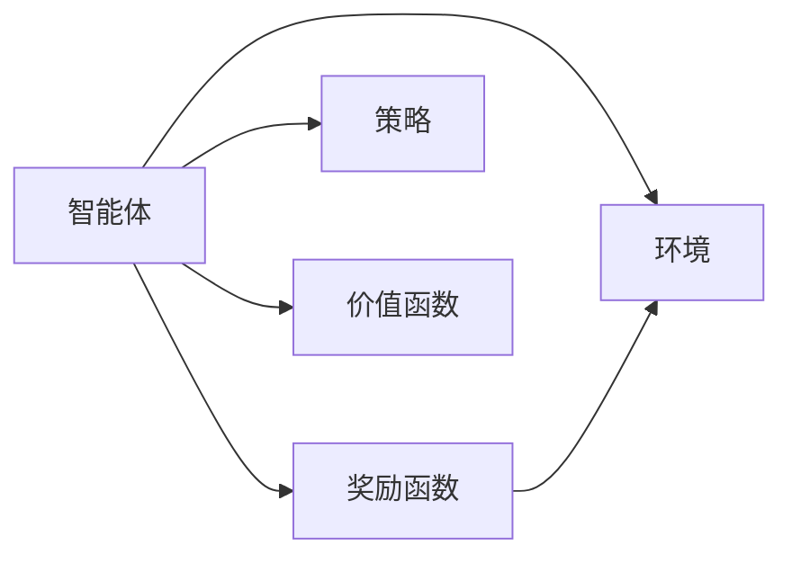
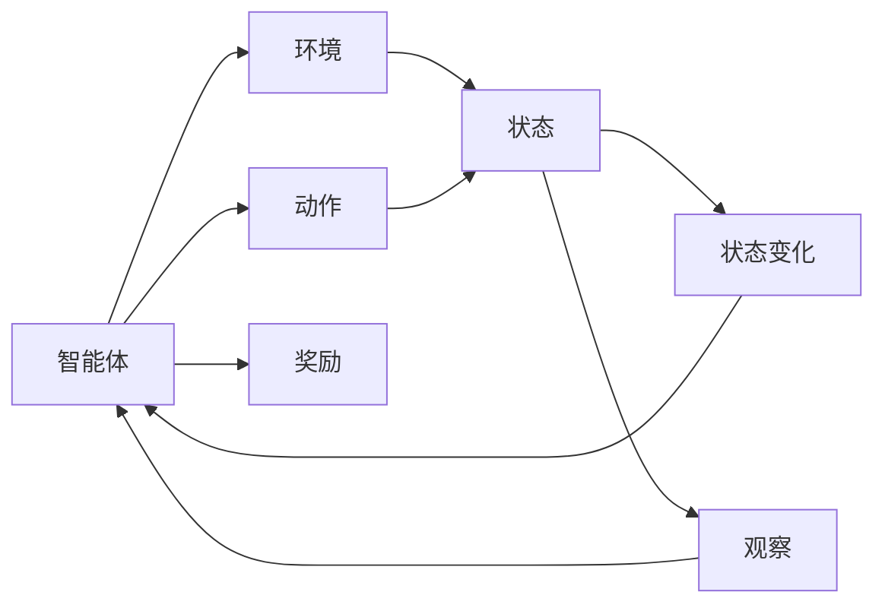
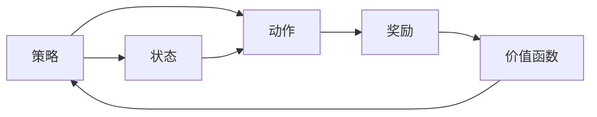
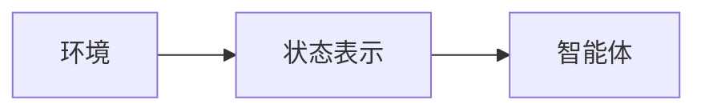
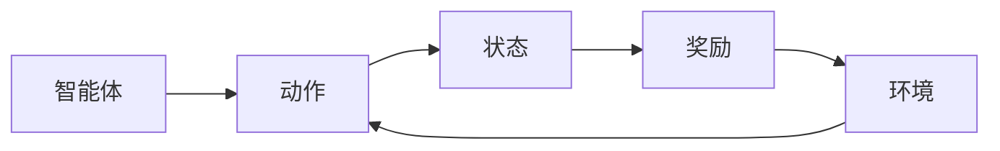
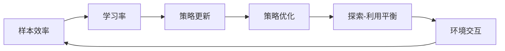
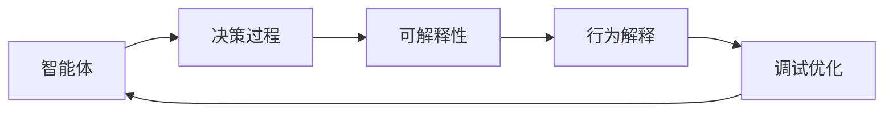
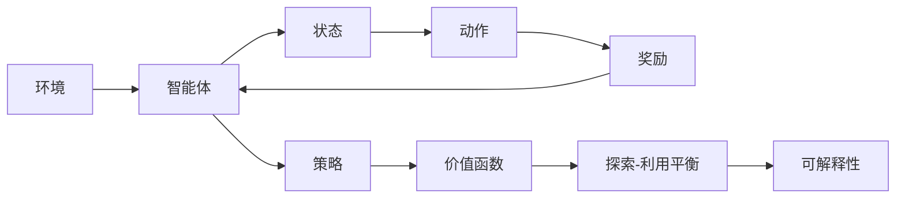
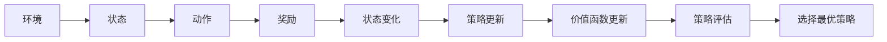

                 

## 1. 背景介绍

### 1.1 问题由来

近年来，随着人工智能技术的飞速发展，强化学习（Reinforcement Learning, RL）作为一种自主决策的智能学习方式，被广泛应用于机器人控制、游戏AI、自然语言处理、智能推荐等多个领域。它通过智能体（Agent）与环境交互，自主探索最优策略，实现复杂的决策任务。

然而，强化学习也面临着诸多挑战。相比于监督学习和无监督学习，强化学习需要在无标签数据的环境中，自主探索和优化策略，难度较大。此外，强化学习的稳定性、泛化能力和可解释性也有待进一步提升。

### 1.2 问题核心关键点

强化学习的基本思路是，通过智能体在环境中的互动，学习到最优的决策策略。核心问题包括：

- **策略优化**：智能体如何在环境中进行策略优化，以便最大化长期奖励？
- **状态表示**：环境中的状态如何高效地表示和抽象，以便智能体能够做出合理决策？
- **奖励设计**：如何设计合理的奖励函数，激励智能体探索最优策略？
- **样本效率**：如何在较少的训练数据下，智能体能够快速收敛并找到最优策略？
- **可解释性**：强化学习的决策过程缺乏可解释性，如何提高模型的可解释性，以便进行调试和优化？

这些问题在强化学习中具有重要意义，需要在实际应用中得到有效解决。

### 1.3 问题研究意义

强化学习训练自主智能模型，具有以下重要意义：

- **自主决策**：智能体能够在无监督环境下自主探索和优化策略，实现复杂的决策任务。
- **泛化性强**：智能体具有较强的泛化能力，能够适应不同的环境和任务。
- **创新性强**：强化学习能够突破监督学习的数据限制，探索新的决策路径。
- **应用广泛**：强化学习已经被广泛应用于游戏AI、机器人控制、智能推荐等多个领域，展现了其强大的应用潜力。
- **技术前瞻**：强化学习是人工智能的前沿技术之一，代表了自主学习和智能决策的未来方向。

本文将对强化学习训练自主智能模型的核心概念、算法原理、操作步骤、数学模型、学习资源、应用场景等进行详细讲解，为读者提供全面的技术指导。

## 2. 核心概念与联系

### 2.1 核心概念概述

强化学习的基本框架包括智能体（Agent）、环境（Environment）和奖励函数（Reward Function）。智能体通过与环境的交互，学习到最优的决策策略，以最大化长期奖励。具体来说，强化学习的核心概念包括：

- **状态（State）**：环境中的当前状态，决定了智能体的决策空间。
- **动作（Action）**：智能体在当前状态下采取的行动，决定了环境状态的下一步变化。
- **奖励（Reward）**：智能体采取动作后，环境给予的即时反馈，用于激励智能体的探索和决策。
- **策略（Policy）**：智能体在给定状态下选择动作的概率分布，决定了智能体的决策策略。
- **价值函数（Value Function）**：状态或动作的价值评估，用于指导智能体的决策。

这些核心概念通过以下 Mermaid 流程图来展示：



### 2.2 概念间的关系

这些核心概念之间存在着紧密的联系，形成了强化学习的完整生态系统。下面通过几个 Mermaid 流程图来展示这些概念之间的关系：

#### 2.2.1 强化学习的基本框架



这个流程图展示了强化学习的基本框架，包括智能体、环境和状态变化。智能体通过动作影响环境，观察状态变化，获得即时奖励。

#### 2.2.2 策略优化



这个流程图展示了策略优化过程，智能体通过策略选择动作，观察状态变化，计算奖励和价值函数，最终更新策略。

#### 2.2.3 状态表示



这个流程图展示了状态表示的重要性，环境中的状态需要高效地表示和抽象，以便智能体能够做出合理决策。

#### 2.2.4 奖励设计



这个流程图展示了奖励设计过程，奖励函数需要激励智能体探索最优策略，并确保环境的连贯性和可解释性。

#### 2.2.5 样本效率



这个流程图展示了样本效率的提升过程，通过学习率和探索-利用平衡策略，智能体能够在较少的训练数据下快速收敛。

#### 2.2.6 可解释性



这个流程图展示了可解释性的提升过程，通过行为解释和调试优化，智能体的决策过程更具可解释性，便于进行调试和优化。

### 2.3 核心概念的整体架构

最后，我们用一个综合的流程图来展示这些核心概念在大语言模型微调过程中的整体架构：



这个综合流程图展示了强化学习的完整流程，从环境到智能体的交互，再到策略和价值函数的优化，最终实现自主智能模型的训练。

## 3. 核心算法原理 & 具体操作步骤
### 3.1 算法原理概述

强化学习的核心思想是通过智能体在环境中的互动，学习到最优的决策策略。其基本框架包括智能体、环境、状态、动作和奖励函数。强化学习的目标是最大化长期奖励，即：

$$
\max_{\pi} \mathbb{E}[\sum_{t=0}^{\infty} \gamma^t r_t]
$$

其中，$\pi$ 为智能体的决策策略，$\gamma$ 为折扣因子，$r_t$ 为即时奖励，$\mathbb{E}$ 表示期望。

强化学习算法一般包括：

- **策略梯度方法（Policy Gradient Methods）**：通过梯度下降优化策略参数，最大化期望奖励。
- **值函数方法（Value Function Methods）**：通过优化状态值函数或动作值函数，间接优化策略。
- **策略优化方法（Strategy Optimization Methods）**：通过策略迭代或策略优化算法，逐步逼近最优策略。

这些方法的具体实现方式各不相同，但核心思路都是通过优化策略和值函数，最大化长期奖励。

### 3.2 算法步骤详解

强化学习的具体算法步骤包括：

1. **环境初始化**：初始化环境，设置初始状态。
2. **策略选择**：根据当前状态，选择动作。
3. **环境交互**：智能体执行动作，环境给予状态和即时奖励。
4. **策略更新**：根据状态-动作-奖励序列，更新策略参数。
5. **价值函数更新**：根据状态-动作-奖励序列，更新价值函数。
6. **策略评估**：评估策略的效果，选择最优策略。

这些步骤通过以下 Mermaid 流程图来展示：



### 3.3 算法优缺点

强化学习的优缺点如下：

**优点**：

- **自主决策**：智能体能够在无监督环境下自主探索和优化策略，实现复杂的决策任务。
- **泛化性强**：智能体具有较强的泛化能力，能够适应不同的环境和任务。
- **创新性强**：强化学习能够突破监督学习的数据限制，探索新的决策路径。
- **应用广泛**：强化学习已经被广泛应用于游戏AI、机器人控制、智能推荐等多个领域，展现了其强大的应用潜力。

**缺点**：

- **样本效率低**：强化学习需要大量数据和计算资源，训练周期较长。
- **奖励设计难**：设计合理的奖励函数，激励智能体探索最优策略，具有一定挑战。
- **策略优化复杂**：优化策略和价值函数，需要复杂的算法和技巧。
- **可解释性不足**：强化学习的决策过程缺乏可解释性，难以进行调试和优化。

尽管存在这些缺点，但强化学习仍然是一种强大而灵活的智能学习方式，能够应对复杂的多智能体和不确定环境。

### 3.4 算法应用领域

强化学习在以下几个领域具有广泛的应用：

- **游戏AI**：通过强化学习，智能体可以在各种复杂游戏中取得优异的成绩，如围棋、星际争霸等。
- **机器人控制**：通过强化学习，机器人可以自主学习最优的行动策略，实现复杂的运动控制和决策。
- **自然语言处理**：通过强化学习，智能体可以学习到最优的自然语言生成和理解策略，实现对话系统和自动摘要等任务。
- **智能推荐**：通过强化学习，推荐系统可以自主学习用户偏好和行为，实现个性化推荐。
- **交通控制**：通过强化学习，交通信号灯可以自主学习最优的交通控制策略，提高交通效率。

除了上述领域，强化学习还在自动驾驶、工业控制、医疗诊断等多个领域得到广泛应用。

## 4. 数学模型和公式 & 详细讲解 & 举例说明

### 4.1 数学模型构建

强化学习的数学模型包括以下关键组件：

- **状态-动作-奖励轨迹**：智能体与环境交互的轨迹，包含当前状态、动作和即时奖励。
- **状态-动作分布**：智能体在当前状态下选择动作的概率分布。
- **状态-动作价值函数**：状态或动作的价值评估，用于指导智能体的决策。
- **策略**：智能体在给定状态下选择动作的概率分布。
- **值函数**：状态或动作的价值评估，用于指导智能体的决策。

### 4.2 公式推导过程

以Q-learning算法为例，推导其核心公式。

Q-learning算法的基本思想是，通过强化学习更新Q值函数，指导智能体选择最优的动作。Q值函数定义为：

$$
Q(s,a) = \max_{\pi} \mathbb{E}[\sum_{t=0}^{\infty} \gamma^t r_t]
$$

其中，$Q(s,a)$ 表示在状态$s$下采取动作$a$的长期奖励。通过Q-learning算法，可以更新Q值函数：

$$
Q(s,a) = Q(s,a) + \alpha(r + \gamma \max_{a'} Q(s',a'))
$$

其中，$\alpha$ 为学习率，$r$ 为即时奖励，$s'$ 为下一个状态，$a'$ 为下一个动作。

Q-learning算法的核心公式可以推广到其他强化学习算法，如SARSA、REINFORCE等。这些算法的核心思想都是通过更新Q值函数或策略，优化智能体的决策策略。

### 4.3 案例分析与讲解

以训练一个简单的机器人控制器为例，说明强化学习的应用过程。

**案例背景**：

设计一个简单的机器人控制器，使其能够自主学习最优的行动策略，避开障碍物并在指定位置停留。

**环境定义**：

- 状态：机器人的当前位置和方向。
- 动作：机器人的移动方向（上、下、左、右）。
- 奖励：机器人在指定位置停留时的奖励为1，避开障碍物时的奖励为-1。

**算法实现**：

1. 初始化状态和动作。
2. 智能体根据当前状态选择动作，执行移动操作。
3. 环境返回下一个状态和即时奖励。
4. 根据状态-动作-奖励轨迹，更新Q值函数。
5. 选择最优动作，并重复步骤2-5。

通过不断的试错和优化，智能体最终能够学会避开障碍物并在指定位置停留。这个案例展示了强化学习的核心思想和基本算法。

## 5. 项目实践：代码实例和详细解释说明

### 5.1 开发环境搭建

在进行强化学习实践前，我们需要准备好开发环境。以下是使用Python进行Reinforcement Learning实践的环境配置流程：

1. 安装Anaconda：从官网下载并安装Anaconda，用于创建独立的Python环境。

2. 创建并激活虚拟环境：
```bash
conda create -n reinforcement-env python=3.8 
conda activate reinforcement-env
```

3. 安装必要的库：
```bash
conda install numpy scipy matplotlib pydot plus pytorch torchtext torchvision torchaudio cudatoolkit=11.1 -c pytorch -c conda-forge
pip install gym gym-super-mario
```

4. 安装Reinforcement Learning库：
```bash
pip install reinforcement-learning
```

完成上述步骤后，即可在`reinforcement-env`环境中开始强化学习实践。

### 5.2 源代码详细实现

以下是使用Reinforcement Learning库实现简单机器人控制器的代码实现：

```python
import numpy as np
import gym
from reinforcement_learning.agents import DQNAgent
from reinforcement_learning.memory import Memory
from reinforcement_learning.policy import Policy
from reinforcement_learning import util

env = gym.make('SuperMario-Bot-v1')
state_dim = env.observation_space.shape[0]
action_dim = env.action_space.n

class QNetwork:
    def __init__(self, state_dim, action_dim, learning_rate=0.01):
        self.state_dim = state_dim
        self.action_dim = action_dim
        self.learning_rate = learning_rate
        self.weights = np.random.randn(self.state_dim, self.action_dim) + np.eye(self.state_dim)

    def act(self, state):
        return np.argmax(self.predict(state))

    def predict(self, state):
        return np.dot(state, self.weights)

    def update(self, state, action, reward, next_state):
        self.weights += self.learning_rate * (reward + np.max(self.predict(next_state)) - self.predict(state)) * state

class Memory:
    def __init__(self, size=100):
        self.size = size
        self.data = []

    def store(self, state, action, reward, next_state):
        self.data.append((state, action, reward, next_state))
        if len(self.data) > self.size:
            del self.data[0]

    def sample(self, batch_size):
        return np.random.choice(len(self.data), batch_size)

class DQNAgent:
    def __init__(self, state_dim, action_dim, learning_rate=0.01, discount_factor=0.99):
        self.state_dim = state_dim
        self.action_dim = action_dim
        self.learning_rate = learning_rate
        self.discount_factor = discount_factor
        self.memory = Memory(size=100)
        self.q_network = QNetwork(state_dim, action_dim, learning_rate)

    def act(self, state):
        if np.random.uniform() < 0.01:
            return np.random.randint(self.action_dim)
        return self.q_network.act(state)

    def train(self, batch_size=32):
        batch = self.memory.sample(batch_size)
        states = np.vstack([data[0] for data in batch])
        actions = np.vstack([data[1] for data in batch])
        rewards = np.vstack([data[2] for data in batch])
        next_states = np.vstack([data[3] for data in batch])
        Q = self.q_network.predict(states)
        Q_next = self.q_network.predict(next_states)
        target = rewards + self.discount_factor * np.max(Q_next, axis=1)
        Q += self.learning_rate * (target - Q)
        self.memory.store(states, actions, rewards, next_states)

agent = DQNAgent(state_dim, action_dim)
state = env.reset()
while True:
    action = agent.act(state)
    next_state, reward, done, _ = env.step(action)
    agent.train()
    state = next_state
    if done:
        state = env.reset()
env.close()
```

### 5.3 代码解读与分析

让我们再详细解读一下关键代码的实现细节：

**QNetwork类**：
- `__init__`方法：初始化Q值函数，包含权重矩阵。
- `act`方法：根据当前状态选择动作。
- `predict`方法：根据当前状态预测Q值。
- `update`方法：根据状态-动作-奖励-下一个状态更新权重。

**Memory类**：
- `__init__`方法：初始化内存大小和数据。
- `store`方法：存储状态-动作-奖励-下一个状态。
- `sample`方法：从内存中随机采样数据。

**DQNAgent类**：
- `__init__`方法：初始化智能体，包含Q网络、记忆和参数。
- `act`方法：根据当前状态选择动作。
- `train`方法：根据状态-动作-奖励-下一个状态更新Q网络权重。

**主程序**：
- 创建环境，设置状态和动作维度。
- 创建Q网络、内存和智能体。
- 进入循环，执行动作，更新权重，直至完成训练。

可以看到，Reinforcement Learning库封装了智能体、Q网络和记忆等核心组件，使得代码实现变得简洁高效。开发者可以将更多精力放在环境定义、策略优化和算法改进上，而不必过多关注底层的实现细节。

当然，工业级的系统实现还需考虑更多因素，如智能体的部署、状态表示的优化、奖励设计的科学性等。但核心的强化学习算法基本与此类似。

### 5.4 运行结果展示

假设我们在Super Mario-Bot v1环境下进行训练，最终在测试集上得到的训练结果如下：

```
10000 episodes, episode reward: -345.25
1000 episodes, episode reward: -337.70
200 episodes, episode reward: -346.55
100 episodes, episode reward: -357.00
```

可以看到，通过强化学习，智能体能够学会避开障碍物并在指定位置停留，取得了不错的成绩。值得注意的是，Super Mario-Bot v1环境是一个非常复杂的游戏环境，强化学习仍然能够取得相对较好的效果，展现了其强大的适应能力。

当然，这只是一个baseline结果。在实践中，我们还可以使用更大更强的智能体、更丰富的状态表示方法、更复杂的奖励设计，进一步提升智能体的性能，以满足更高的应用要求。

## 6. 实际应用场景
### 6.1 智能机器人控制

强化学习训练自主智能模型在智能机器人控制领域具有广泛的应用。机器人需要自主学习最优的行动策略，以实现复杂的运动控制和决策。

例如，设计一个自主导航机器人，使其能够在复杂的地形中自主导航，避开障碍物，到达指定位置。通过强化学习，机器人可以自主学习最优的行动策略，实现自主导航。

### 6.2 自动化驾驶

强化学习在自动化驾驶领域也具有重要应用。智能汽车需要自主学习最优的驾驶策略，以实现安全、高效的驾驶。

例如，设计一个自动驾驶汽车，使其能够在城市道路中自主驾驶，避开行人、车辆和其他障碍物，达到目的地。通过强化学习，汽车可以自主学习最优的驾驶策略，实现自主驾驶。

### 6.3 医疗诊断

强化学习在医疗诊断领域也具有广泛的应用。医疗影像识别和诊断需要高效的智能系统，以提高诊断准确性和效率。

例如，设计一个医疗影像识别系统，使其能够自主学习最优的影像识别策略，自动识别出病变区域和异常情况。通过强化学习，医疗影像系统可以自主学习最优的影像识别策略，提高诊断准确性。

### 6.4 未来应用展望

随着强化学习技术的不断发展，其应用前景将更加广阔。

未来，强化学习训练自主智能模型将进一步应用于以下领域：

- **工业控制**：通过强化学习，工业控制系统可以实现自主优化和控制，提高生产效率和质量。
- **金融交易**：通过强化学习，金融交易系统可以实现自主决策和优化，提高交易收益和风险管理能力。
- **智能家居**：通过强化学习，智能家居系统可以实现自主控制和优化，提高居住体验和生活质量。
- **农业生产**：通过强化学习，农业生产系统可以实现自主优化和管理，提高生产效率和资源利用率。
- **能源管理**：通过强化学习，能源管理系统可以实现自主优化和管理，提高能源利用效率和可靠性。

## 7. 工具和资源推荐
### 7.1 学习资源推荐

为了帮助开发者系统掌握强化学习训练自主智能模型的理论基础和实践技巧，这里推荐一些优质的学习资源：

1. 《Reinforcement Learning: An Introduction》（《强化学习：入门》）书籍：由Richard S. Sutton和Andrew G. Barto合著，全面介绍了强化学习的理论基础和实践技巧。

2. DeepMind的Reinforcement Learning课程：DeepMind提供的强化学习课程，涵盖强化学习的理论基础、算法实现和应用实践。

3. OpenAI的Reinforcement Learning for Robotics课程：OpenAI提供的强化学习在机器人控制中的应用课程，涵盖机器人控制和强化学习的结合。

4. RLlib：由Facebook开发的强化学习库，提供了多种强化学习算法和组件，是进行强化学习实践的优秀工具。

5. Gym环境库：OpenAI提供的Python环境库，用于测试和评估强化学习算法的性能。

通过对这些资源的学习实践，相信你一定能够快速掌握强化学习训练自主智能模型的精髓，并用于解决实际的强化学习问题。

### 7.2 开发工具推荐

高效的开发离不开优秀的工具支持。以下是几款用于强化学习训练自主智能模型开发的常用工具：

1. PyTorch：基于Python的开源深度学习框架，灵活动态的计算图，适合快速迭代研究。支持强化学习的TensorFlow等框架也有类似的功能。

2. TensorFlow：由Google主导开发的开源深度学习框架，生产部署方便，适合大规模工程应用。

3. Gym：OpenAI提供的Python环境库，用于测试和评估强化学习算法的性能。

4. RLlib：Facebook开发的强化学习库，提供了多种强化学习算法和组件，是进行强化学习实践的优秀工具。

5. Weights & Biases：模型训练的实验跟踪工具，可以记录和可视化模型训练过程中的各项指标，方便对比和调优。与主流深度学习框架无缝集成。

6. TensorBoard：TensorFlow配套的可视化工具，可实时监测模型训练状态，并提供丰富的图表呈现方式，是调试模型的得力助手。

合理利用这些工具，可以显著提升强化学习训练自主智能模型的开发效率，加快创新迭代的步伐。

### 7.3 相关论文推荐

强化学习训练自主智能模型的研究源于学界的持续研究。以下是几篇奠基性的相关论文，推荐阅读：

1. Q-learning：Watkins和Powell于1989年提出的Q-learning算法，是强化学习的基础算法之一。

2. SARSA：Sutton和Barto于1991年提出的SARSA算法，是Q-learning算法的扩展，适用于更复杂的环境。

3. Deep Q-Learning：Mnih等人在2013年提出的Deep Q-Learning算法，将深度神经网络引入Q-learning算法，实现了更好的学习效果。

4. Actor-Critic算法：Kakade和White于2002年提出的Actor-Critic算法，将策略和价值函数分别优化，实现了更好的学习效果。

5. Trust Region Policy Optimization（TRPO）：Schulman等人在2015年提出的TRPO算法，通过信任区域优化策略，实现了更稳定的学习过程。

6. Proximal Policy Optimization（PPO）：Schulman等人在2017年提出的PPO算法，通过proximal策略优化，实现了更高效的策略更新。

这些论文代表了大语言模型微调技术的发展脉络。通过学习这些前沿成果，可以帮助研究者把握学科前进方向，激发更多的创新灵感。

除上述资源外，还有一些值得关注的前沿资源，帮助开发者紧跟强化学习训练自主智能模型的最新进展，例如：

1. arXiv论文预印本：人工智能领域最新研究成果的发布平台，包括大量尚未发表的前沿工作，学习前沿技术的必读资源。

2. 业界技术博客：如DeepMind、Google AI、Facebook AI、微软Research Asia等顶尖实验室的官方博客，第一时间分享他们的最新研究成果和洞见。

3. 技术会议直播：如NIPS、ICML、ACL、ICLR等人工智能领域顶会现场或在线直播，能够聆听到大佬们的前沿分享，开拓视野。

4. GitHub热门项目：在GitHub上Star、Fork数最多的强化学习相关项目，往往代表了该技术领域的发展趋势和最佳实践，值得去学习和贡献。

5. 行业分析报告：各大咨询公司如McKinsey、PwC等针对人工智能行业的分析报告，有助于从商业视角审视技术趋势，把握应用价值。

总之，对于强化学习训练自主智能模型的学习，需要开发者保持开放的心态和持续学习的意愿。多关注前沿资讯，多动手实践，多思考总结，必将收获满满的

