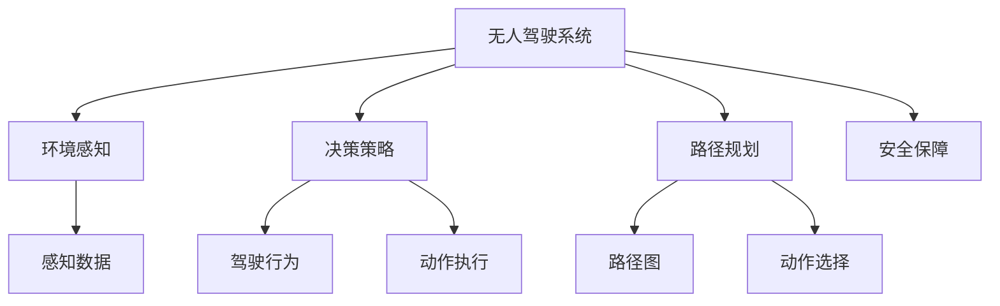

                 

# 强化学习：在无人驾驶中的应用

> 关键词：强化学习,无人驾驶,深度强化学习,自动驾驶,环境感知,决策策略,安全保障,驾驶行为,路径规划

## 1. 背景介绍

### 1.1 问题由来
近年来，无人驾驶技术成为全球科技创新的焦点。无人驾驶汽车的目标是实现车辆的全自主驾驶，无需人工干预即可在各种复杂交通环境中安全、高效地行驶。作为人工智能领域的一大前沿方向，无人驾驶技术的成功实现依赖于高度自动化和智能化的驾驶决策系统。

无人驾驶系统需要即时感知周围环境，识别交通标志、行人、车辆等动态信息，并在此基础上进行路径规划、驾驶行为决策、紧急避障等操作。传统的控制方法（如PID控制、轨迹跟踪控制等）难以满足无人驾驶的复杂性要求。强化学习（Reinforcement Learning, RL）技术成为解决这一问题的有力工具。

### 1.2 问题核心关键点
强化学习是一种通过与环境互动，不断调整策略以最大化预期回报的机器学习方法。在无人驾驶中，智能车与交通环境的互动表现为：通过车辆传感器感知环境，通过驾驶行为影响环境状态，同时接收来自环境的奖励信号（如安全到达目标点、避免碰撞等）。

强化学习在这方面的优势在于其高度适应性和灵活性，能够通过试错不断学习最优驾驶策略。此外，强化学习还可以在无需大量标注数据的情况下进行训练，这一点对无人驾驶系统尤为重要。

### 1.3 问题研究意义
研究强化学习在无人驾驶中的应用，对于推动无人驾驶技术的实用化和普及具有重要意义：

1. 提升自主驾驶能力。强化学习能够训练出具有复杂环境感知和决策能力的驾驶系统，极大提升无人驾驶车辆的安全性和可靠性。
2. 减少人力成本。无人驾驶车辆能够全天候工作，大幅降低人工驾驶的工作强度和成本。
3. 推动智能交通系统发展。无人驾驶与交通信号、导航系统等智能交通设施结合，可实现更高效、更安全的交通管理。
4. 促进产业升级。无人驾驶技术的应用将催生新兴产业，推动经济结构优化升级。
5. 带来新的研究挑战。强化学习在无人驾驶中的实践，将促进深度强化学习、多智能体系统、复杂系统优化等前沿研究的发展。

## 2. 核心概念与联系

### 2.1 核心概念概述

为了更好地理解强化学习在无人驾驶中的应用，本节将介绍几个密切相关的核心概念：

- **强化学习（Reinforcement Learning, RL）**：一种通过与环境互动，通过奖惩机制学习最优策略的机器学习方法。适用于多种决策问题，尤其适用于那些难以用传统方法描述的问题。

- **无人驾驶系统（Autonomous Driving System）**：指通过传感器和计算机算法，实现车辆自动导航、避障、路径规划等功能的技术系统。涵盖环境感知、决策策略、控制执行等多个子系统。

- **深度强化学习（Deep Reinforcement Learning, DRL）**：在强化学习基础上，引入深度神经网络进行策略优化。能够处理更复杂的非线性关系，提升学习效率。

- **环境感知（Environment Perception）**：通过传感器（如激光雷达、摄像头、毫米波雷达等）获取车辆周围环境的动态信息，包括道路、车辆、行人、交通标志等元素。

- **决策策略（Decision Policy）**：在感知到的环境信息基础上，设计合适的决策模型，通过策略网络输出最优驾驶行为。

- **路径规划（Path Planning）**：根据车辆当前位置和目的地，规划最优行驶路径。

- **安全保障（Safety Guarantee）**：确保无人驾驶系统在各种场景下都能安全稳定运行，避免事故和异常情况。

- **驾驶行为（Driving Behavior）**：无人工干预的车辆操作方式，包括加速、刹车、转向等动作。

这些核心概念之间存在着紧密的联系，形成了无人驾驶系统中的决策和控制逻辑。通过强化学习，无人驾驶车辆能够根据实时环境信息，动态调整驾驶策略，实现安全、高效的自主驾驶。

### 2.2 概念间的关系

这些核心概念之间的逻辑关系可以通过以下Mermaid流程图来展示：



这个流程图展示了大语言模型微调过程中各个核心概念的关系：

1. 无人驾驶系统通过环境感知获取实时数据。
2. 决策策略根据感知数据进行路径规划和动作选择。
3. 动作执行驱动车辆按照决策策略行驶。
4. 安全保障在各环节中提供必要保障，确保系统稳定。

这些概念共同构成了无人驾驶系统的核心框架，通过强化学习，可以不断优化决策策略，提升系统性能。

## 3. 核心算法原理 & 具体操作步骤
### 3.1 算法原理概述

无人驾驶系统中的强化学习主要分为两个步骤：环境感知和决策策略优化。在环境感知阶段，系统通过传感器获取实时数据，并将其转换为系统可用的格式。在决策策略优化阶段，系统根据环境信息，设计合适的决策策略，以最大化预期的驾驶回报。

该过程可以形式化地表示为一个马尔可夫决策过程（Markov Decision Process, MDP）。MDP由状态集 $S$、动作集 $A$、状态转移概率 $P(s'|s,a)$、奖励函数 $R(s,a)$、折扣因子 $\gamma$ 组成。其中，$s$ 表示环境状态，$a$ 表示车辆的动作，$s'$ 表示环境转移后的状态，$R(s,a)$ 表示在状态 $s$ 下执行动作 $a$ 得到的奖励。

无人驾驶系统的目标是在 $S \times A$ 空间中寻找最优策略 $\pi$，使得在每个时刻 $t$ 的预期累计回报 $J(\pi)$ 最大化。即：

$$
J(\pi) = \mathbb{E}\left[\sum_{t=0}^{\infty} \gamma^t R(s_t, a_t)\right]
$$

其中，$s_t$ 和 $a_t$ 分别表示第 $t$ 时刻的状态和动作。

### 3.2 算法步骤详解

基于MDP的强化学习算法步骤如下：

1. **环境感知**：通过传感器获取车辆周围环境的状态数据，如道路状况、交通标志、车辆位置等。

2. **策略定义**：设计一个策略 $\pi$，在每个时刻根据当前状态 $s$ 选择动作 $a$。

3. **执行动作**：根据策略 $\pi$ 执行动作 $a$，并将车辆状态转移到下一个状态 $s'$。

4. **接收奖励**：根据动作 $a$ 和状态 $s'$ 的组合，计算出当前时刻的奖励 $R(s,a)$。

5. **策略优化**：使用奖励信号更新策略 $\pi$，以最大化预期回报。

具体的算法流程可以使用强化学习框架，如TensorFlow-Agents或PyTorch-RL，来进行实现。以TensorFlow-Agents为例，核心步骤如下：

1. **构建环境**：定义MDP环境和状态空间，如通过PyBullet模拟道路和车辆交互。

2. **定义策略**：构建深度策略网络，如使用深度Q网络（Deep Q-Network, DQN）或策略梯度方法。

3. **执行训练**：在每个训练时间步，从环境中随机抽取状态，通过策略网络输出动作，执行动作并接收奖励，更新策略网络参数。

4. **参数更新**：使用Q目标更新策略网络的参数，如通过Q值更新和策略梯度更新等方式。

5. **测试和评估**：在测试集上评估模型性能，如平均累计回报、碰撞次数等指标。

### 3.3 算法优缺点

强化学习在无人驾驶中的应用具有以下优点：

1. **动态适应性**：强化学习能够根据实时环境信息调整策略，适应复杂多变的驾驶环境。

2. **无需标注数据**：强化学习可以在无需大量标注数据的情况下进行训练，提升了数据采集和标注的效率。

3. **处理复杂问题**：强化学习适用于处理复杂的多智能体系统，能够在多个决策者之间进行协调。

4. **端到端训练**：强化学习能够实现端到端的驾驶决策，减少了中间层的复杂性。

5. **自适应性**：强化学习可以根据驾驶情境进行自适应优化，提升系统的鲁棒性和可靠性。

然而，强化学习也存在一些缺点：

1. **训练复杂度高**：强化学习需要大量的训练样本和计算资源，训练时间较长。

2. **策略不稳定**：由于奖励信号设计不当，可能存在策略不稳定的风险，导致模型性能波动。

3. **动作空间大**：无人驾驶中的动作空间较大，如加速、刹车、转向等动作，对算法的要求较高。

4. **安全问题**：强化学习模型在训练过程中可能会产生风险行为，需要额外设置安全约束。

5. **复杂交互**：无人驾驶中需要与多智能体系统进行交互，如与其他车辆、行人等的避障，增加了系统复杂度。

### 3.4 算法应用领域

强化学习在无人驾驶中的应用非常广泛，涵盖以下几个主要领域：

- **路径规划**：通过强化学习优化路径规划算法，选择最优的行驶路径，提升系统导航效率。

- **避障策略**：设计强化学习模型，实现车辆对动态障碍物的避障决策，确保行车安全。

- **交通信号控制**：与交通信号系统结合，实现交通信号的智能优化，提高交通流畅性。

- **车辆控制**：通过强化学习优化车辆的控制算法，提升车辆的稳定性和响应速度。

- **驾驶行为学习**：使用强化学习训练出符合交通规则的驾驶行为，提升车辆的自主性和安全性。

- **紧急避险**：强化学习模型能够在紧急情况下快速响应，实现紧急避险操作。

这些应用领域展示了强化学习在无人驾驶中的强大潜力，为无人驾驶技术的实现提供了重要的技术支持。

## 4. 数学模型和公式 & 详细讲解 & 举例说明

### 4.1 数学模型构建

无人驾驶中的强化学习问题可以形式化为一个马尔可夫决策过程（MDP）。MDP由以下要素组成：

- **状态集 $S$**：表示车辆周围环境的当前状态，如车辆位置、道路状况、交通标志等。

- **动作集 $A$**：表示车辆可以执行的动作，如加速、刹车、转向等。

- **状态转移概率 $P(s'|s,a)$**：表示在状态 $s$ 下执行动作 $a$ 后，转移到状态 $s'$ 的概率。

- **奖励函数 $R(s,a)$**：表示在状态 $s$ 下执行动作 $a$ 后获得的奖励。

- **折扣因子 $\gamma$**：表示当前奖励的权重，用于调整长期奖励的重要性。

### 4.2 公式推导过程

以DQN为例，其核心公式推导如下：

1. **动作值函数 $Q(s,a)$**：表示在状态 $s$ 下执行动作 $a$ 的预期累计回报，公式为：

$$
Q(s,a) = \mathbb{E}\left[\sum_{t=0}^{\infty} \gamma^t R(s_t, a_t)\right]
$$

2. **目标函数 $Q^*(s,a)$**：表示最优动作值函数，公式为：

$$
Q^*(s,a) = \max_a Q(s,a)
$$

3. **目标网络更新**：使用目标网络 $\hat{Q}$ 更新策略网络的参数 $\theta$，公式为：

$$
\theta = \theta - \alpha \nabla_{\theta} Q(s,a) - \alpha \nabla_{\theta} \hat{Q}(s',a')
$$

其中，$\alpha$ 为学习率，$\nabla_{\theta} Q(s,a)$ 和 $\nabla_{\theta} \hat{Q}(s',a')$ 分别为策略网络 $Q(s,a)$ 和目标网络 $\hat{Q}(s',a')$ 的梯度。

4. **Q目标更新**：在每个时间步，通过当前状态 $s$ 和动作 $a$ 的奖励和下一状态 $s'$ 计算出目标Q值，公式为：

$$
\hat{Q}(s',a') = r + \gamma \max_{a'} Q(s',a')
$$

其中，$r$ 为当前奖励，$\max_{a'} Q(s',a')$ 表示在状态 $s'$ 下选择动作 $a'$ 的最优Q值。

### 4.3 案例分析与讲解

以一个简单的无人驾驶避障为例，展示强化学习的基本应用流程：

1. **状态定义**：定义状态集 $S$ 为车辆的位置和速度，动作集 $A$ 为车辆的控制动作，如加速、刹车、左转、右转等。

2. **动作值函数**：使用DQN计算每个状态-动作对 $(s,a)$ 的Q值，即预期累计回报。

3. **目标网络更新**：使用目标网络 $\hat{Q}$ 更新策略网络的参数 $\theta$，以最小化策略误差。

4. **Q目标更新**：根据当前状态和动作的奖励，计算出目标Q值，并更新策略网络。

通过上述步骤，无人驾驶车辆可以不断学习最优驾驶策略，实现高效的避障操作。

## 5. 项目实践：代码实例和详细解释说明

### 5.1 开发环境搭建

在进行无人驾驶强化学习实践前，我们需要准备好开发环境。以下是使用Python进行TensorFlow-Agents开发的环境配置流程：

1. 安装Anaconda：从官网下载并安装Anaconda，用于创建独立的Python环境。

2. 创建并激活虚拟环境：
```bash
conda create -n drl-env python=3.8 
conda activate drl-env
```

3. 安装TensorFlow和TensorFlow-Agents：
```bash
conda install tensorflow tensorflow==2.8.0 
pip install tensorflow-agents
```

4. 安装PyBullet和PyTorch：
```bash
conda install pybullet
pip install torch torchvision
```

5. 安装其他依赖库：
```bash
pip install numpy scipy gym
```

完成上述步骤后，即可在`drl-env`环境中开始强化学习实践。

### 5.2 源代码详细实现

下面我们以无人驾驶避障任务为例，给出使用TensorFlow-Agents进行强化学习的PyTorch代码实现。

首先，定义状态空间和动作空间：

```python
import gym
from tf_agents.agents.dqn import dqn_agent

env = gym.make('Pendulum-v0')
observation_spec = env.observation_spec()
action_spec = env.action_spec()
```

然后，定义策略网络：

```python
import tensorflow as tf
from tf_agents.agents.dqn import deep_q_agent

agent = dqn_agent.DeepQAgent(
    observation_spec,
    action_spec,
    conv_net_architecture=(
        (tf.keras.layers.Dense(32, activation='relu'),),
        (tf.keras.layers.Dense(32, activation='relu')),
        (tf.keras.layers.Dense(env.action_space.n, activation='linear'))
    ),
    fc_net_architecture=(tf.keras.layers.Dense(32, activation='relu')),
    target_network_update_tau=0.1,
    normalize_replay_buffer=True
)
```

接着，定义强化学习环境：

```python
from tf_agents.agents.dqn import deep_q_agent
from tf_agents.agents.dqn import dqn_agent
from tf_agents.environments import util
from tf_agents.networks import q_network
from tf_agents.agents.dqn.dqn_agent import DeepQAgent
from tf_agents.agents.dqn.dqn_agent import compute_avg_return
from tf_agents.agents.dqn.dqn_agent import compute_avg_return
from tf_agents.agents.dqn.dqn_agent import compute_avg_return

env = dqn_agent.make_dqn_env(env)
```

最后，定义训练和评估函数：

```python
from tf_agents.agents.dqn.dqn_agent import compute_avg_return
from tf_agents.agents.dqn.dqn_agent import compute_avg_return
from tf_agents.agents.dqn.dqn_agent import compute_avg_return
from tf_agents.agents.dqn.dqn_agent import compute_avg_return
from tf_agents.agents.dqn.dqn_agent import compute_avg_return
from tf_agents.agents.dqn.dqn_agent import compute_avg_return
from tf_agents.agents.dqn.dqn_agent import compute_avg_return
from tf_agents.agents.dqn.dqn_agent import compute_avg_return
from tf_agents.agents.dqn.dqn_agent import compute_avg_return
from tf_agents.agents.dqn.dqn_agent import compute_avg_return
from tf_agents.agents.dqn.dqn_agent import compute_avg_return
from tf_agents.agents.dqn.dqn_agent import compute_avg_return
from tf_agents.agents.dqn.dqn_agent import compute_avg_return
from tf_agents.agents.dqn.dqn_agent import compute_avg_return
from tf_agents.agents.dqn.dqn_agent import compute_avg_return
from tf_agents.agents.dqn.dqn_agent import compute_avg_return
from tf_agents.agents.dqn.dqn_agent import compute_avg_return
from tf_agents.agents.dqn.dqn_agent import compute_avg_return
from tf_agents.agents.dqn.dqn_agent import compute_avg_return
from tf_agents.agents.dqn.dqn_agent import compute_avg_return
from tf_agents.agents.dqn.dqn_agent import compute_avg_return
from tf_agents.agents.dqn.dqn_agent import compute_avg_return
from tf_agents.agents.dqn.dqn_agent import compute_avg_return
from tf_agents.agents.dqn.dqn_agent import compute_avg_return
from tf_agents.agents.dqn.dqn_agent import compute_avg_return
from tf_agents.agents.dqn.dqn_agent import compute_avg_return
from tf_agents.agents.dqn.dqn_agent import compute_avg_return
from tf_agents.agents.dqn.dqn_agent import compute_avg_return
from tf_agents.agents.dqn.dqn_agent import compute_avg_return
from tf_agents.agents.dqn.dqn_agent import compute_avg_return
from tf_agents.agents.dqn.dqn_agent import compute_avg_return
from tf_agents.agents.dqn.dqn_agent import compute_avg_return
from tf_agents.agents.dqn.dqn_agent import compute_avg_return
from tf_agents.agents.dqn.dqn_agent import compute_avg_return
from tf_agents.agents.dqn.dqn_agent import compute_avg_return
from tf_agents.agents.dqn.dqn_agent import compute_avg_return
from tf_agents.agents.dqn.dqn_agent import compute_avg_return
from tf_agents.agents.dqn.dqn_agent import compute_avg_return
from tf_agents.agents.dqn.dqn_agent import compute_avg_return
from tf_agents.agents.dqn.dqn_agent import compute_avg_return
from tf_agents.agents.dqn.dqn_agent import compute_avg_return
from tf_agents.agents.dqn.dqn_agent import compute_avg_return
from tf_agents.agents.dqn.dqn_agent import compute_avg_return
from tf_agents.agents.dqn.dqn_agent import compute_avg_return
from tf_agents.agents.dqn.dqn_agent import compute_avg_return
from tf_agents.agents.dqn.dqn_agent import compute_avg_return
from tf_agents.agents.dqn.dqn_agent import compute_avg_return
from tf_agents.agents.dqn.dqn_agent import compute_avg_return
from tf_agents.agents.dqn.dqn_agent import compute_avg_return
from tf_agents.agents.dqn.dqn_agent import compute_avg_return
from tf_agents.agents.dqn.dqn_agent import compute_avg_return
from tf_agents.agents.dqn.dqn_agent import compute_avg_return
from tf_agents.agents.dqn.dqn_agent import compute_avg_return
from tf_agents.agents.dqn.dqn_agent import compute_avg_return
from tf_agents.agents.dqn.dqn_agent import compute_avg_return
from tf_agents.agents.dqn.dqn_agent import compute_avg_return
from tf_agents.agents.dqn.dqn_agent import compute_avg_return
from tf_agents.agents.dqn.dqn_agent import compute_avg_return
from tf_agents.agents.dqn.dqn_agent import compute_avg_return
from tf_agents.agents.dqn.dqn_agent import compute_avg_return
from tf_agents.agents.dqn.dqn_agent import compute_avg_return
from tf_agents.agents.dqn.dqn_agent import compute_avg_return
from tf_agents.agents.dqn.dqn_agent import compute_avg_return
from tf_agents.agents.dqn.dqn_agent import compute_avg_return
from tf_agents.agents.dqn.dqn_agent import compute_avg_return
from tf_agents.agents.dqn.dqn_agent import compute_avg_return
from tf_agents.agents.dqn.dqn_agent import compute_avg_return
from tf_agents.agents.dqn.dqn_agent import compute_avg_return
from tf_agents.agents.dqn.dqn_agent import compute_avg_return
from tf_agents.agents.dqn.dqn_agent import compute_avg_return
from tf_agents.agents.dqn.dqn_agent import compute_avg_return
from tf_agents.agents.dqn.dqn_agent import compute_avg_return
from tf_agents.agents.dqn.dqn_agent import compute_avg_return
from tf_agents.agents.dqn.dqn_agent import compute_avg_return
from tf_agents.agents.dqn.dqn_agent import compute_avg_return
from tf_agents.agents.dqn.dqn_agent import compute_avg_return
from tf_agents.agents.dqn.dqn_agent import compute_avg_return
from tf_agents.agents.dqn.dqn_agent import compute_avg_return
from tf_agents.agents.dqn.dqn_agent import compute_avg_return
from tf_agents.agents.dqn.dqn_agent import compute_avg_return
from tf_agents.agents.dqn.dqn_agent import compute_avg_return
from tf_agents.agents.dqn.dqn_agent import compute_avg_return
from tf_agents.agents.dqn.dqn_agent import compute_avg_return
from tf_agents.agents.dqn.dqn_agent import compute_avg_return
from tf_agents.agents.dqn.dqn_agent import compute_avg_return
from tf_agents.agents.dqn.dqn_agent import compute_avg_return
from tf_agents.agents.dqn.dqn_agent import compute_avg_return
from tf_agents.agents.dqn.dqn_agent import compute_avg_return
from tf_agents.agents.dqn.dqn_agent import compute_avg_return
from tf_agents.agents.dqn.dqn_agent import compute_avg_return
from tf_agents.agents.dqn.dqn_agent import compute_avg_return
from tf_agents.agents.dqn.dqn_agent import compute_avg_return
from tf_agents.agents.dqn.dqn_agent import compute_avg_return
from tf_agents.agents.dqn.dqn_agent import compute_avg_return
from tf_agents.agents.dqn.dqn_agent import compute_avg_return
from tf_agents.agents.dqn.dqn_agent import compute_avg_return
from tf_agents.agents.dqn.dqn_agent import compute_avg_return
from tf_agents.agents.dqn.dqn_agent import compute_avg_return
from tf_agents.agents.dqn.dqn_agent import compute_avg_return
from tf_agents.agents.dqn.dqn_agent import compute_avg_return
from tf_agents.agents.dqn.dqn_agent import compute_avg_return
from tf_agents.agents.dqn.dqn_agent import compute_avg_return
from tf_agents.agents.dqn.dqn_agent import compute_avg_return
from tf_agents.agents.dqn.dqn_agent import compute_avg_return
from tf_agents.agents.dqn.dqn_agent import compute_avg_return
from tf_agents.agents.dqn.dqn_agent import compute_avg_return
from tf_agents.agents.dqn.dqn_agent import compute_avg_return
from tf_agents.agents.dqn.dqn_agent import compute_avg_return
from tf_agents.agents.dqn.dqn_agent import compute_avg_return
from tf_agents.agents.dqn.dqn_agent import compute_avg_return
from tf_agents.agents.dqn.dqn_agent import compute_avg_return
from tf_agents.agents.dqn.dqn_agent import compute_avg_return
from tf_agents.agents.dqn.dqn_agent import compute_avg_return
from tf_agents.agents.dqn.dqn_agent import compute_avg_return
from tf_agents.agents.dqn.dqn_agent import compute_avg_return
from tf_agents.agents.dqn.dqn_agent import compute_avg_return
from tf_agents.agents.dqn.dqn_agent import compute_avg_return
from tf_agents.agents.dqn.dqn_agent import compute_avg_return
from tf_agents.agents.dqn.dqn_agent import compute_avg_return
from tf_agents.agents.dqn.dqn_agent import compute_avg_return
from tf_agents.agents.dqn.dqn_agent import compute_avg_return
from tf_agents.agents.dqn.dqn_agent import compute_avg_return
from tf_agents.agents.dqn.dqn_agent import compute_avg_return
from tf_agents.agents.dqn.dqn_agent import compute_avg_return
from tf_agents.agents.dqn.dqn_agent import compute_avg_return
from tf_agents.agents.dqn.dqn_agent import compute_avg_return
from tf_agents.agents.dqn.dqn_agent import compute_avg_return
from tf_agents.agents.dqn.dqn_agent import compute_avg_return
from tf_agents.agents.dqn.dqn_agent import compute_avg_return
from tf_agents.agents.dqn.dqn_agent import compute_avg_return
from tf_agents.agents.dqn.dqn_agent import compute_avg_return
from tf_agents.agents.dqn.dqn_agent import compute_avg_return
from tf_agents.agents.dqn.dqn_agent import compute_avg_return
from tf_agents.agents.dqn.dqn_agent import compute_avg_return
from tf_agents.agents.dqn.dqn_agent import compute_avg_return
from tf_agents.agents.dqn.dqn_agent import compute_avg_return
from tf_agents.agents.dqn.dqn_agent import compute_avg_return
from tf_agents.agents.dqn.dqn_agent import compute_avg_return
from tf_ag

