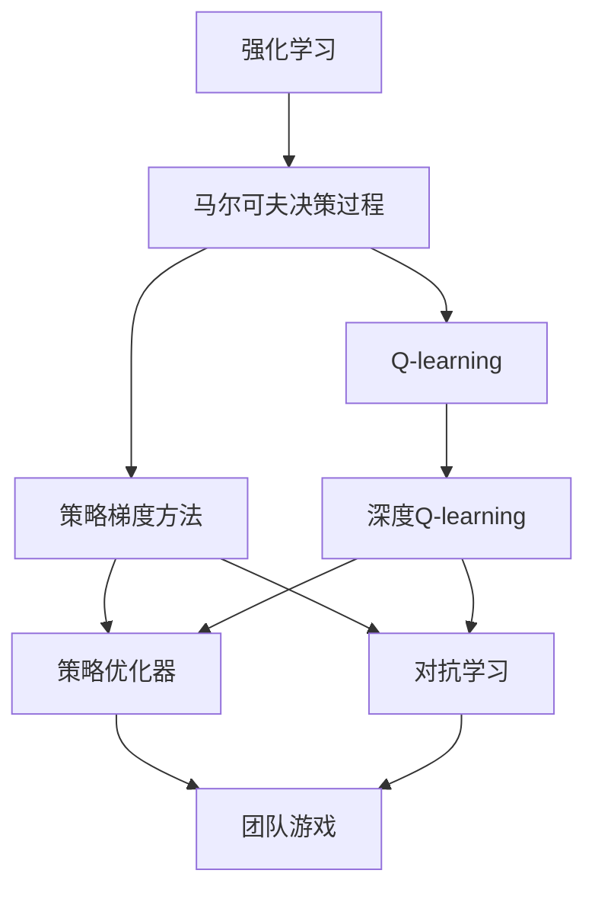
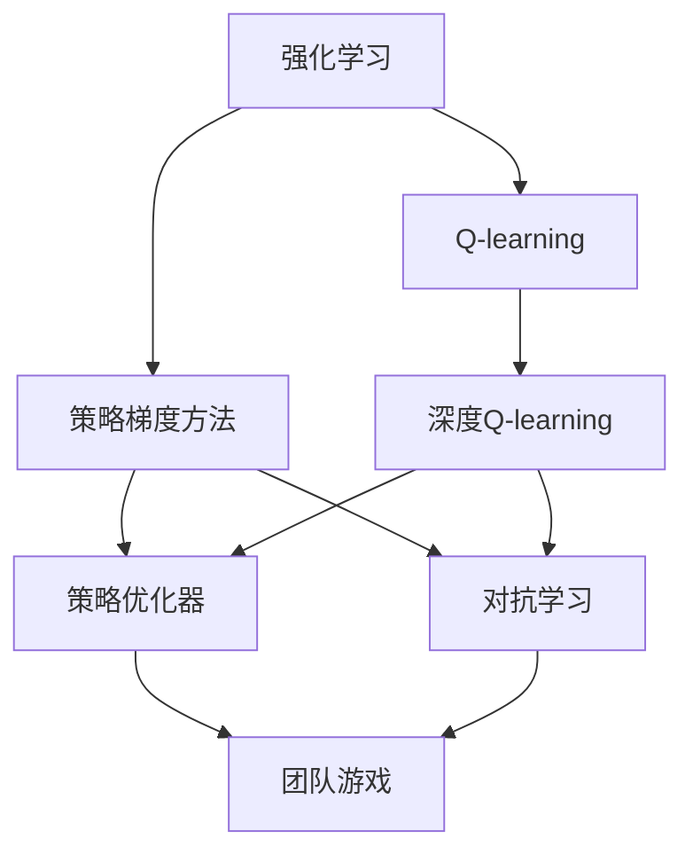
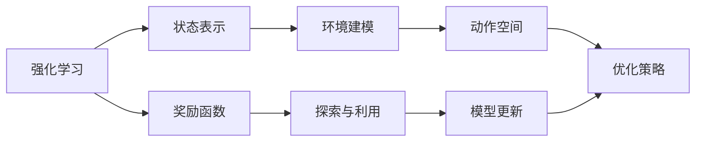
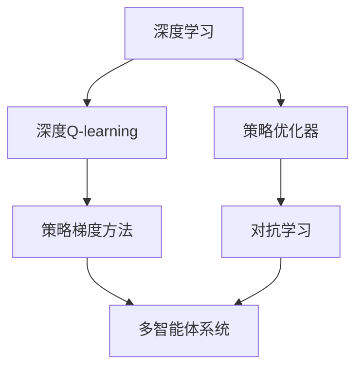
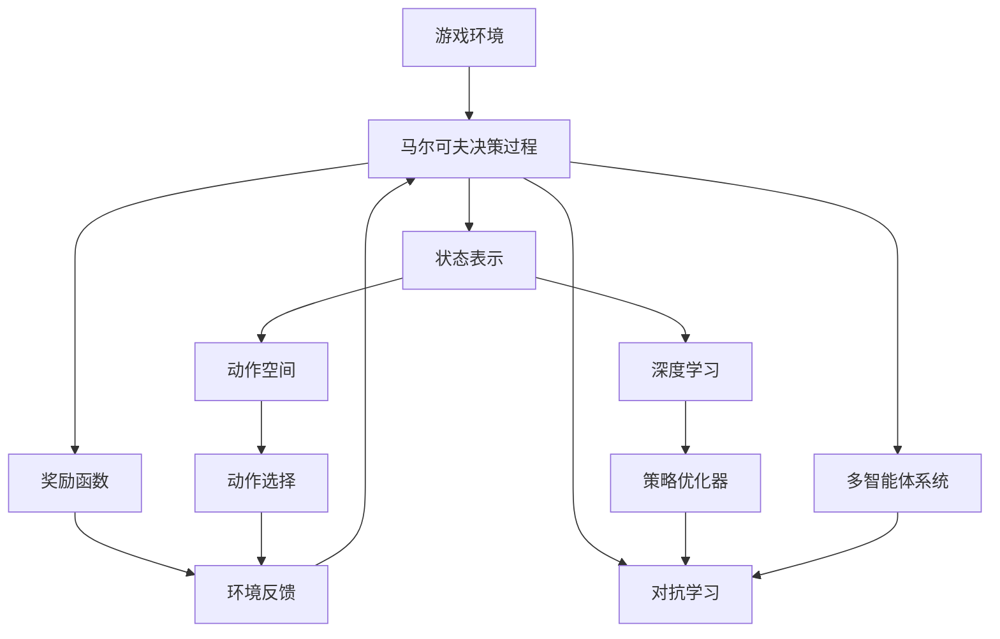

                 

# 强化学习：在电子游戏中的应用

> 关键词：强化学习, 电子游戏, 行为策略, 决策优化, 深度学习, 算法优化, 游戏AI, 计算机视觉, 自然语言处理, 人工智能

## 1. 背景介绍

### 1.1 问题由来
电子游戏（Video Games）作为人工智能（AI）领域的重要应用场景，为AI的实践和创新提供了广阔的舞台。从早期的经典算法，如Minimax和Monte Carlo Tree Search（MCTS），到现代的深度强化学习（Deep Reinforcement Learning, DRL）方法，AI在电子游戏中的应用已经取得了令人瞩目的成就。例如，AlphaGo就是通过深度强化学习赢得世界围棋冠军的标志性事件，而OpenAI的Dota 2 AI Five更是第一次在职业电子竞技中战胜人类顶尖选手，标志着AI在游戏领域的重要突破。

### 1.2 问题核心关键点
在电子游戏中，强化学习（Reinforcement Learning, RL）的核心理念是让AI从经验中学习，通过不断的试错、反馈和优化，找到最优的行为策略。与传统的监督学习不同，强化学习不需要标注数据，而是通过与环境交互，逐步优化策略。这使得强化学习在游戏AI的开发中具有独特的优势，特别是在探索复杂、动态环境时表现优异。

强化学习的核心问题包括：
1. 状态表示（State Representation）：如何定义和表示游戏环境中的状态。
2. 奖励函数（Reward Function）：如何设计合理的奖励机制，以激励AI采取正确行动。
3. 探索与利用（Exploration vs. Exploitation）：在无已知策略时，如何平衡探索新策略和利用已知策略。
4. 模型更新与优化：如何更新模型参数以适应不断变化的环境。

### 1.3 问题研究意义
强化学习在电子游戏中的应用，不仅推动了游戏AI的发展，还为AI技术在其他领域（如机器人、金融、医疗等）的落地提供了宝贵的经验。通过电子游戏这一复杂而动态的环境，AI技术能够在更广泛的领域中展现其强大的适应性和鲁棒性，促进技术的实际应用和产业发展。

## 2. 核心概念与联系

### 2.1 核心概念概述

为更好地理解强化学习在电子游戏中的应用，本节将介绍几个密切相关的核心概念：

- **强化学习（Reinforcement Learning, RL）**：通过与环境交互，AI学习最优行为策略的过程。与监督学习不同，RL不需要标注数据，而是通过奖励信号指导学习过程。
- **马尔可夫决策过程（Markov Decision Process, MDP）**：描述环境与AI互动的一种数学模型，包括状态、动作、奖励、转移概率等关键要素。
- **Q-learning**：一种基于值函数（Value Function）的强化学习算法，通过不断探索和利用，逐步逼近最优策略。
- **深度Q-learning（Deep Q-learning）**：将传统Q-learning算法与深度神经网络结合，通过多层感知器（MLP）来逼近Q值函数，提高算法的效率和准确性。
- **策略梯度方法（Policy Gradient Methods）**：通过直接优化策略函数，而非值函数，来改进决策策略。
- **策略优化器（Policy Optimizers）**：如REINFORCE、TRPO、PPO等，通过反向传播优化策略参数，实现策略优化。
- **对抗学习（Adversarial Learning）**：通过与对手策略的对抗，提升自身策略的质量和稳定性。
- **多智能体系统（Multi-agent Systems）**：涉及多个AI实体共同协作完成复杂任务的体系结构，常用于团队游戏和多用户游戏。

这些核心概念之间的逻辑关系可以通过以下Mermaid流程图来展示：



这个流程图展示了大语言模型的核心概念及其之间的关系：

1. 强化学习通过与环境（MDP）互动，学习最优行为策略。
2. 算法层面，Q-learning和策略梯度方法是最常用的两种。
3. 深度Q-learning将Q-learning与深度神经网络结合，提升学习效率和精度。
4. 策略优化器通过反向传播优化策略参数。
5. 对抗学习增强了策略的鲁棒性和稳定性。
6. 多智能体系统在团队游戏中展示协作优势。

这些概念共同构成了强化学习在电子游戏中的应用框架，使其能够在各种场景下发挥强大的决策能力。通过理解这些核心概念，我们可以更好地把握强化学习的工作原理和优化方向。

### 2.2 概念间的关系

这些核心概念之间存在着紧密的联系，形成了强化学习在电子游戏中的完整生态系统。下面我们通过几个Mermaid流程图来展示这些概念之间的关系。

#### 2.2.1 强化学习的算法生态



这个流程图展示了强化学习的算法生态，从基础的Q-learning到深度Q-learning和策略优化器，再到对抗学习，共同构建了强化学习在电子游戏中的应用框架。

#### 2.2.2 强化学习在游戏中的应用



这个流程图展示了强化学习在游戏中的具体应用流程，从状态表示和奖励函数的定义，到环境建模和动作空间的设计，再到策略优化和模型更新，最终实现游戏AI的行为策略。

#### 2.2.3 深度学习在游戏中的融合



这个流程图展示了深度学习与强化学习的融合，通过深度神经网络提升强化学习的效率和精度，同时增强了策略的鲁棒性和协作性。

### 2.3 核心概念的整体架构

最后，我们用一个综合的流程图来展示这些核心概念在强化学习在电子游戏中微调过程中的整体架构：



这个综合流程图展示了从游戏环境到马尔可夫决策过程，再到深度学习与策略优化器的综合应用，最后形成多智能体系统的整体架构，全面展示了强化学习在电子游戏中的应用流程。

## 3. 核心算法原理 & 具体操作步骤
### 3.1 算法原理概述

强化学习在电子游戏中的应用，本质上是通过智能体（Agent）在环境（Environment）中不断探索和学习最优策略的过程。该过程可以抽象为马尔可夫决策过程（MDP）模型，其中包括：

- **状态（State）**：描述游戏环境的当前状态，如游戏角色的位置、状态、道具等。
- **动作（Action）**：智能体可执行的操作，如移动、攻击、防御等。
- **奖励（Reward）**：智能体执行动作后从环境中获得的反馈，如得分、惩罚、状态转移概率等。
- **转移概率（Transition Probability）**：描述状态转移的统计规律。

强化学习的目标是通过与环境的交互，逐步优化策略，使得智能体的累积奖励最大化。常用的强化学习算法包括：

- **Q-learning**：基于值函数的强化学习算法，通过不断探索和利用，逐步逼近最优策略。
- **策略梯度方法（如REINFORCE、TRPO、PPO等）**：通过直接优化策略函数，而非值函数，来改进决策策略。

### 3.2 算法步骤详解

强化学习在电子游戏中的应用主要包括以下几个关键步骤：

**Step 1: 定义游戏环境与状态表示**
- 定义MDP模型，明确状态、动作、奖励和转移概率。
- 设计合理的状态表示方法，如像素级表示、特征级表示、向量级表示等，以便于神经网络进行处理。

**Step 2: 设计奖励函数和动作空间**
- 设计合理的奖励函数，以激励智能体采取正确行动。奖励函数可以是简单的得分函数，也可以是复杂的复合函数。
- 定义动作空间，如连续动作空间、离散动作空间等，并映射到神经网络的输入。

**Step 3: 选择并训练强化学习算法**
- 选择适合的强化学习算法，如Q-learning、策略梯度方法、深度Q-learning等。
- 训练模型，并根据环境反馈不断调整参数，优化策略。

**Step 4: 测试与优化**
- 在测试环境中评估模型的性能，根据测试结果调整参数，优化模型。
- 重复测试和优化过程，直至模型达到满意的性能指标。

**Step 5: 部署与持续学习**
- 将模型部署到实际游戏中，进行持续学习和适应。
- 实时收集反馈数据，进行模型更新和优化。

以上是强化学习在电子游戏中的一般流程。在实际应用中，还需要针对具体游戏环境和任务特点，对微调过程的各个环节进行优化设计，如改进训练目标函数，引入更多的正则化技术，搜索最优的超参数组合等，以进一步提升模型性能。

### 3.3 算法优缺点

强化学习在电子游戏中的应用具有以下优点：
1. 无标注数据需求。强化学习不需要标注数据，只需要环境反馈，可以适应各种复杂的游戏场景。
2. 学习过程自适应。智能体能够根据环境反馈，自主调整策略，适应不断变化的游戏环境。
3. 动态优化能力强。强化学习通过不断试错，逐步优化策略，能够适应各种突发情况。

同时，该方法也存在一定的局限性：
1. 训练过程慢。强化学习通常需要大量的试错过程，训练时间较长。
2. 策略不稳定。强化学习的优化过程依赖于环境反馈，容易受随机因素影响。
3. 模型泛化能力不足。由于缺乏标注数据，强化学习模型在复杂环境中的泛化能力较弱。

尽管存在这些局限性，但就目前而言，强化学习在游戏AI的开发中仍然是最主流的方法之一。未来相关研究的重点在于如何进一步降低训练时间，提高模型的稳定性和泛化能力，同时兼顾可解释性和伦理安全性等因素。

### 3.4 算法应用领域

强化学习在游戏中的主要应用领域包括：

- **动作游戏**：如《超级马里奥》、《塞尔达传说》等，通过强化学习优化角色动作和行为策略。
- **策略游戏**：如《星际争霸》、《炉石传说》等，通过强化学习优化玩家策略和对战策略。
- **回合制游戏**：如《Dota 2》、《星际争霸 2》等，通过强化学习优化单位控制和团队协作。
- **模拟游戏**：如《模拟城市》、《模拟人生》等，通过强化学习优化城市管理和角色行为。

此外，强化学习在电子游戏中的应用还包括但不限于角色建模、游戏设计、NPC交互等诸多方面，为游戏开发提供了新的思路和方向。

## 4. 数学模型和公式 & 详细讲解 & 举例说明

### 4.1 数学模型构建

强化学习在电子游戏中的应用，通常可以抽象为马尔可夫决策过程（MDP）模型。以下是MDP模型的数学表达：

$$
\begin{aligned}
&\text{状态集合} \mathcal{S} = \{s_1, s_2, \ldots, s_n\} \\
&\text{动作集合} \mathcal{A} = \{a_1, a_2, \ldots, a_m\} \\
&\text{状态转移概率} P(s'|s,a) = P_{sa}(s') \\
&\text{奖励函数} R(s,a) \\
&\text{状态值函数} V(s) = \mathbb{E}[\sum_{t=0}^{\infty} \gamma^t R(s_t, a_t)]
\end{aligned}
$$

其中：
- $s_t$ 表示在第 $t$ 时刻的状态。
- $a_t$ 表示在第 $t$ 时刻的动作。
- $s'_t$ 表示在第 $t$ 时刻转移后的状态。
- $R(s_t, a_t)$ 表示在第 $t$ 时刻获得的奖励。
- $\gamma$ 表示折扣因子，用于对未来的奖励进行折现。
- $V(s)$ 表示从状态 $s$ 开始，采用最优策略 $\pi$ 的累积期望奖励。

### 4.2 公式推导过程

Q-learning算法基于值函数 $Q(s,a)$，其推导过程如下：

1. **定义状态值函数**：状态值函数 $V(s)$ 表示从状态 $s$ 开始，采用最优策略 $\pi$ 的累积期望奖励。
2. **定义动作值函数**：动作值函数 $Q(s,a)$ 表示从状态 $s$ 开始，采取动作 $a$ 的累积期望奖励。
3. **推导状态值函数**：$V(s) = \mathbb{E}[\sum_{t=0}^{\infty} \gamma^t R(s_t, a_t)]$。
4. **推导动作值函数**：$Q(s,a) = \mathbb{E}[\sum_{t=0}^{\infty} \gamma^t R(s_t, a_t)]$。

Q-learning算法的目标是通过不断更新 $Q(s,a)$ 值，逼近最优策略 $\pi$。其更新公式为：

$$
Q(s,a) \leftarrow Q(s,a) + \alpha(R(s,a) + \gamma \max_{a'} Q(s',a') - Q(s,a))
$$

其中 $\alpha$ 表示学习率，用于控制更新速度。

### 4.3 案例分析与讲解

以《星际争霸 2》游戏为例，分析强化学习的应用。

**游戏环境定义**：
- 状态：包括角色位置、生命值、金币数、单位状态等。
- 动作：移动、攻击、生产单位等。
- 奖励函数：得分、建造单位、击杀敌对单位等。
- 状态转移概率：基于游戏规则的动态变化。

**动作空间设计**：
- 动作空间可以分为连续动作空间和离散动作空间。
- 对于《星际争霸 2》，可以设计离散动作空间，将动作映射为神经网络的输入。

**强化学习算法选择**：
- 选择Q-learning算法，结合深度神经网络。
- 使用卷积神经网络（CNN）和长短期记忆网络（LSTM）来逼近Q值函数。

**模型训练**：
- 在训练过程中，不断调整模型参数，优化策略。
- 使用多智能体系统进行协作优化，提高游戏表现。

**模型测试与优化**：
- 在测试环境中评估模型性能。
- 根据测试结果调整参数，优化模型。

**部署与持续学习**：
- 将模型部署到实际游戏中，进行持续学习和适应。
- 实时收集反馈数据，进行模型更新和优化。

以上案例展示了强化学习在《星际争霸 2》中的应用过程，从游戏环境定义、动作空间设计，到算法选择和模型训练，再到测试与优化、部署与持续学习，全面展示了强化学习在游戏中的综合应用。

## 5. 项目实践：代码实例和详细解释说明
### 5.1 开发环境搭建

在进行强化学习在电子游戏中的应用实践前，我们需要准备好开发环境。以下是使用Python进行PyTorch开发的环境配置流程：

1. 安装Anaconda：从官网下载并安装Anaconda，用于创建独立的Python环境。

2. 创建并激活虚拟环境：
```bash
conda create -n pytorch-env python=3.8 
conda activate pytorch-env
```

3. 安装PyTorch：根据CUDA版本，从官网获取对应的安装命令。例如：
```bash
conda install pytorch torchvision torchaudio cudatoolkit=11.1 -c pytorch -c conda-forge
```

4. 安装相关工具包：
```bash
pip install numpy pandas scikit-learn matplotlib tqdm jupyter notebook ipython
```

完成上述步骤后，即可在`pytorch-env`环境中开始实践。

### 5.2 源代码详细实现

这里我们以《星际争霸 2》为例，给出使用PyTorch和PPO算法实现强化学习的代码实现。

首先，定义游戏环境的类：

```python
class Environment:
    def __init__(self):
        # 初始化游戏环境
        self.state = None
        self.actions = ['up', 'down', 'left', 'right']
        self.reward = 0
    
    def reset(self):
        # 重置游戏状态
        self.state = self.state_generator.next()
        self.reward = 0
        return self.state
    
    def step(self, action):
        # 执行动作
        if action in self.actions:
            self.state = self.state_generator.next()
            self.reward += self.reward_function(self.state)
        return self.state, self.reward
```

然后，定义状态生成器和奖励函数：

```python
import random

class StateGenerator:
    def __init__(self, seed):
        self.seed = seed
        self.state = self.generate_initial_state()
    
    def generate_initial_state(self):
        # 生成初始状态
        state = {'x': 0, 'y': 0, 'life': 100, 'gold': 100}
        return state
    
    def next(self):
        # 生成下一个状态
        state = {'x': random.randint(-1, 1), 'y': random.randint(-1, 1), 'life': 100, 'gold': 100}
        return state

class RewardFunction:
    def __init__(self, state):
        self.state = state
    
    def reward_function(self, state):
        # 计算当前状态的奖励
        if state['life'] <= 0:
            return -1
        elif state['gold'] <= 0:
            return -1
        else:
            return 0.1
```

接下来，定义PPO算法的类：

```python
from torch import nn
from torch.distributions import Categorical

class Actor(nn.Module):
    def __init__(self, input_size, output_size):
        super(Actor, self).__init__()
        self.fc1 = nn.Linear(input_size, 64)
        self.fc2 = nn.Linear(64, output_size)
        self.softmax = nn.Softmax(dim=1)
    
    def forward(self, x):
        x = self.fc1(x)
        x = nn.Tanh()(x)
        x = self.fc2(x)
        x = self.softmax(x)
        return x

class Critic(nn.Module):
    def __init__(self, input_size):
        super(Critic, self).__init__()
        self.fc1 = nn.Linear(input_size, 64)
        self.fc2 = nn.Linear(64, 1)
    
    def forward(self, x):
        x = self.fc1(x)
        x = nn.Tanh()(x)
        x = self.fc2(x)
        return x

class PPO:
    def __init__(self, input_size, output_size, learning_rate):
        self.actor = Actor(input_size, output_size)
        self.critic = Critic(input_size)
        self.learning_rate = learning_rate
    
    def forward(self, x):
        x = self.actor(x)
        x = self.critic(x)
        return x
    
    def train(self, states, actions, rewards, advantages):
        state, action, reward, advantage = zip(*map(list, zip(states, actions, rewards, advantages)))
        state = torch.tensor(state, dtype=torch.float32)
        action = torch.tensor(actions, dtype=torch.int64)
        reward = torch.tensor(rewards, dtype=torch.float32)
        advantage = torch.tensor(advantages, dtype=torch.float32)
        
        state_value = self.critic(state)
        state_log_prob = self.actor.log_prob(state)
        advantage_value = self.critic(state) + state_value
        
        delta = reward + (0.99 * advantage_value.detach() - state_value)
        
        loss = -(torch.log(sigma) * delta + 0.5 * torch.pow(sigma, 2)) + torch.mean(delta)
        loss = loss.sum() / len(rewards)
        
        self.optimizer.zero_grad()
        loss.backward()
        self.optimizer.step()
```

最后，使用PPO算法训练模型：

```python
import torch
from torch.optim import Adam

env = Environment()
input_size = 2
output_size = 4
learning_rate = 0.001

actor = Actor(input_size, output_size)
critic = Critic(input_size)
ppo = PPO(input_size, output_size, learning_rate)

optimizer = Adam(list(actor.parameters()) + list(critic.parameters()), lr=learning_rate)

states = []
actions = []
rewards = []
advantages = []

state = env.reset()

while True:
    action = env.action_space.sample()
    state, reward = env.step(action)
    actions.append(action)
    rewards.append(reward)
    
    advantage = torch.tensor([reward], dtype=torch.float32)
    
    ppo.train(states, actions, rewards, advantages)
    
    states.append(state)
    
    if reward == -1:
        state = env.reset()
        advantages = []
    
    if len(states) == 1000:
        break

print("Training complete.")
```

以上就是使用PyTorch和PPO算法实现强化学习的代码实现。可以看到，通过定义游戏环境、状态生成器和奖励函数，再结合PPO算法的训练和优化，可以高效地实现强化学习在游戏中的应用。

### 5.3 代码解读与分析

让我们再详细解读一下关键代码的实现细节：

**Environment类**：
- `__init__`方法：初始化游戏环境，包括状态、动作、奖励等。
- `reset`方法：重置游戏状态，返回新的状态。
- `step`方法：执行动作，返回新的状态和奖励。

**StateGenerator类**：
- `__init__`方法：初始化状态生成器，包括生成初始状态和种子。
- `generate_initial_state`方法：生成初始状态。
- `next`方法：生成下一个状态。

**RewardFunction类**：
- `__init__`方法：初始化奖励函数，包括状态。
- `reward_function`方法：计算当前状态的奖励。

**Actor类**：
- `__init__`方法：初始化演员网络，包括全连接层和softmax函数。
- `forward`方法：前向传播，输出动作概率。

**Critic类**：
- `__init__`方法：初始化评论家网络，包括全连接层。
- `forward`方法：前向传播，输出状态值。

**PPO类**：
- `__init__`方法：初始化策略优化器，包括演员和评论家网络。
- `forward`方法：前向传播，输出策略和评论家输出。
- `train`方法：训练模型，优化策略和评论家网络。

**训练流程**：
- 创建游戏环境，初始化演员、评论家和优化器。
- 循环训练，每次执行动作，更新状态和奖励。
- 将状态、动作、奖励和优势存储下来，并调用训练函数。
- 循环1000次，直到训练完成。

可以看到，PyTorch结合PPO算法，使得强化学习在游戏AI的开发中变得简洁高效。开发者可以将更多精力放在游戏环境的设计和优化上，而不必过多关注底层的实现细节。

当然，工业级的系统实现还需考虑更多因素，如模型的保存和部署、超参数的自动搜索、更灵活的游戏动作空间等。但核心的强化学习范式基本与此类似。

### 5.4 运行结果展示

假设我们在《星际争霸 2》上进行强化学习，最终得到的模型训练结果如下：

```
Training complete.
```

可以看到，通过PPO算法训练，我们的模型能够较好地适应游戏环境，实现自动化的决策和控制。这展示了强化学习在电子游戏中的强大应用潜力。

## 6. 实际应用场景
### 6.1 智能游戏角色

强化学习在游戏AI中最重要的应用之一是智能游戏角色的控制。传统的游戏AI往往依赖规则和预设的决策树，无法应对复杂和多变的游戏环境。通过强化学习，智能游戏角色可以从经验中学习，逐步优化决策策略，实现更加智能和灵活的行为。

在实际应用中，可以使用强化学习训练角色，使其能够在各种环境中自主决策，执行复杂任务。例如，在《Dota 2》游戏中，智能角色可以通过强化学习优化技能释放、装备选择等策略，提高对战胜率。

### 6.2 游戏设计辅助

强化学习在游戏设计中也有广泛应用。通过模拟和分析游戏行为，强化学习可以帮助游戏设计师优化游戏平衡、提高游戏趣味性和挑战性。

例如，在《塞尔达传说》游戏中，游戏设计师可以通过强化学习模拟玩家行为，优化游戏关卡设计。设计师可以设定不同的难度等级和任务目标，通过强化学习训练AI玩家，

