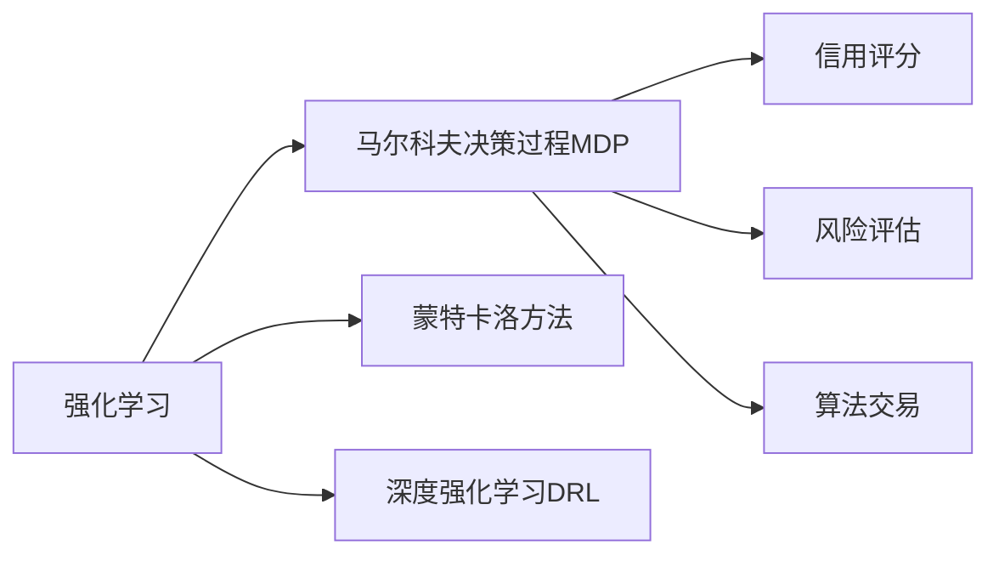
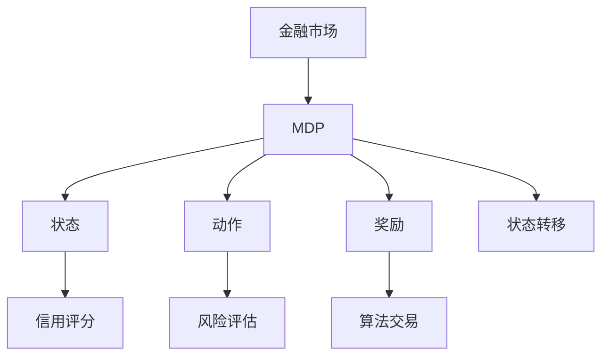
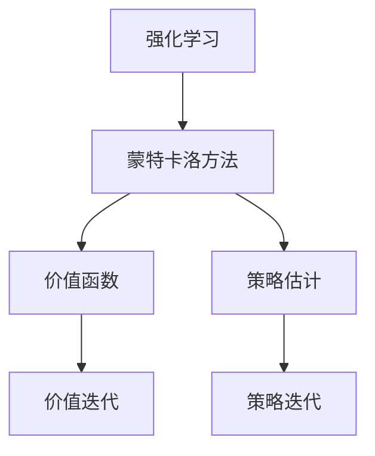
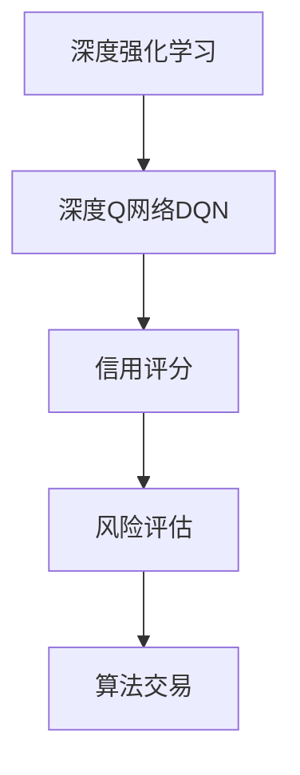
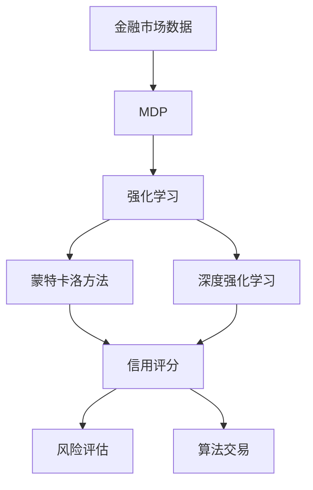

                 

# 强化学习：在金融风控中的应用

> 关键词：强化学习,金融风控,策略优化,信用评分,风险评估,马尔科夫决策过程(MDP),蒙特卡洛(MC)方法,深度强化学习(DRL)

## 1. 背景介绍

### 1.1 问题由来

金融行业面临日益复杂的风险管理需求，如何构建一个准确高效的风险评估和信用评分体系，成为了业界关注的焦点。传统的风险评估方法主要依赖于基于历史数据统计模型的静态评分体系，难以实时应对市场变化和个体差异。而强化学习作为一种动态优化方法，能够通过与环境的交互，实时更新策略，适应金融市场的高频波动。

近年来，强化学习在金融风控领域的应用越来越广泛，如信用评分、风险管理、算法交易等。通过模拟金融市场的交易环境，强化学习可以学习出最优的交易策略，提升决策效率和风险控制能力。但同时，强化学习在金融风控领域的应用也面临着诸多挑战，如数据获取难度大、模型鲁棒性不足、计算复杂度高、透明度和可解释性差等问题。

### 1.2 问题核心关键点

强化学习在金融风控领域的应用核心关键点包括：
- 构建完备的金融市场环境：如何将真实市场环境抽象成强化学习模型可操作的虚拟环境，是金融风控应用的基础。
- 设计有效的奖励机制：如何设计合理的奖励函数，奖励优异的风险管理行为，同时惩罚不合理的风险操作，是金融风控应用的关键。
- 优化动态交易策略：如何通过强化学习算法，学习出最优的交易策略，应对实时市场变化，是金融风控应用的目标。
- 保证模型鲁棒性和可解释性：如何构建具有高鲁棒性和可解释性的强化学习模型，避免因市场波动或数据偏差导致的不良决策，是金融风控应用的难点。

这些核心关键点共同构成了强化学习在金融风控应用中的主要研究内容。

### 1.3 问题研究意义

强化学习在金融风控领域的应用，对于提升金融机构的风险管理能力、降低不良贷款率、优化投资策略具有重要意义：

1. 提升决策效率：强化学习能够实时更新风险管理策略，适应市场变化，提升决策速度和效率。
2. 降低不良贷款率：通过学习最优的风险管理策略，强化学习可以识别高风险客户，减少不良贷款发生。
3. 优化投资策略：强化学习能够动态调整投资组合，最大化收益，降低风险。
4. 减少人为干预：强化学习通过模拟真实市场环境，自动生成最优策略，减少人为干预，提升决策的客观性和一致性。
5. 增强鲁棒性：强化学习通过持续学习，提升模型的鲁棒性，更好地应对市场波动和数据偏差。

通过强化学习的应用，金融机构能够实现更加高效、准确、自动化的风险管理，提升整体运营效率和竞争力。

## 2. 核心概念与联系

### 2.1 核心概念概述

为更好地理解强化学习在金融风控中的应用，本节将介绍几个密切相关的核心概念：

- **强化学习（Reinforcement Learning, RL）**：一种通过与环境交互，动态优化策略的学习方法。模型通过接收环境的状态（state）和奖励（reward），输出动作（action），以最大化累积奖励为目标。
- **马尔科夫决策过程（Markov Decision Process, MDP）**：强化学习的核心概念，用于描述环境、状态、动作、奖励之间的关系。MDP包括状态集合（S）、动作集合（A）、状态转移概率（P）、奖励函数（R）四个元素。
- **蒙特卡洛方法（Monte Carlo Method）**：一种基于随机抽样和随机模拟的计算方法，用于强化学习中的价值函数和策略估计。蒙特卡洛方法包括重要性抽样、路径积分等技术。
- **深度强化学习（Deep Reinforcement Learning, DRL）**：通过深度神经网络构建状态和动作的映射关系，提升强化学习的表达能力和学习效率。深度强化学习包括深度Q网络、深度确定性策略梯度（DDPG）等方法。
- **信用评分（Credit Scoring）**：金融机构根据客户的个人信息、信用历史、行为数据等，评估客户的信用风险，预测其违约概率。信用评分是金融风控的核心环节之一。
- **风险评估（Risk Assessment）**：通过分析客户的风险特征和市场环境，量化风险程度，决定是否批准贷款、投资等金融活动。风险评估是金融风控的重要组成部分。
- **算法交易（Algorithmic Trading）**：通过构建自动化交易策略，利用高频市场数据，实现高频交易，提升投资收益和风险控制能力。算法交易是金融风控的重要应用领域。

这些核心概念之间的逻辑关系可以通过以下Mermaid流程图来展示：



这个流程图展示了一些与强化学习在金融风控中密切相关的核心概念及其之间的关系。

### 2.2 概念间的关系

这些核心概念之间存在着紧密的联系，形成了强化学习在金融风控应用中的完整生态系统。下面我们通过几个Mermaid流程图来展示这些概念之间的关系。

#### 2.2.1 强化学习与金融风控的联系



这个流程图展示了强化学习与金融风控之间的基本联系。强化学习通过学习金融市场的MDP模型，实时更新策略，优化信用评分、风险评估和算法交易等金融风控任务。

#### 2.2.2 强化学习与蒙特卡洛方法的关系



这个流程图展示了强化学习与蒙特卡洛方法之间的关系。蒙特卡洛方法用于强化学习的价值函数和策略估计，通过随机抽样和模拟，提升模型的学习效率和精度。

#### 2.2.3 深度强化学习与信用评分的关系



这个流程图展示了深度强化学习与信用评分之间的关系。深度强化学习通过深度神经网络，提升了强化学习的表达能力和学习效率，适用于信用评分的动态优化。

### 2.3 核心概念的整体架构

最后，我们用一个综合的流程图来展示这些核心概念在强化学习在金融风控应用中的整体架构：



这个综合流程图展示了从金融市场数据到强化学习模型的完整过程，以及强化学习在信用评分、风险评估和算法交易中的应用。通过这些流程图，我们可以更清晰地理解强化学习在金融风控中的核心概念和应用场景。

## 3. 核心算法原理 & 具体操作步骤
### 3.1 算法原理概述

强化学习在金融风控中的应用，本质上是通过构建金融市场的MDP模型，学习最优的交易策略，以最大化长期累积奖励。其核心思想是：在金融市场中，通过接收当前状态和奖励，输出动作，实现风险管理策略的动态优化。

形式化地，假设金融市场的环境状态为 $S$，可执行的动作为 $A$，状态转移概率为 $P$，奖励函数为 $R$，目标是最小化长期累积风险（奖励）。强化学习的目标是最小化期望的累积风险（期望值由状态和动作的分布决定），即：

$$
\min_{\pi} \mathbb{E}[\sum_{t=0}^{\infty}\gamma^tR(s_t,a_t) \mid \pi]
$$

其中 $\pi$ 为策略，$\gamma$ 为折扣因子，控制长期奖励的权重。

强化学习的核心算法包括Q学习、策略梯度方法、蒙特卡洛方法等。Q学习通过求解状态动作值函数 $Q(s,a)$，预测每个状态动作的预期回报，从而指导策略更新。策略梯度方法通过优化策略参数，直接求解最优策略 $\pi$，实现策略的动态更新。蒙特卡洛方法通过随机抽样和模拟，估算状态动作的价值函数，提升模型的学习效率。

### 3.2 算法步骤详解

强化学习在金融风控中的应用一般包括以下几个关键步骤：

**Step 1: 构建金融市场环境**

- 收集历史金融市场数据，构建MDP模型的状态集合 $S$ 和动作集合 $A$。
- 定义状态转移概率 $P$，描述金融市场环境的状态转移机制。
- 定义奖励函数 $R$，根据交易行为和市场状态，计算奖励值。
- 将金融市场环境抽象为强化学习模型可操作的虚拟环境。

**Step 2: 选择强化学习算法**

- 根据金融风控任务的特性，选择合适的强化学习算法。常见的算法包括Q学习、策略梯度方法、蒙特卡洛方法等。
- 对于连续状态和动作的金融风控任务，可以使用深度强化学习算法，如深度Q网络（DQN）、深度确定性策略梯度（DDPG）等。
- 对于离散状态和动作的金融风控任务，可以使用传统强化学习算法，如Q学习、策略梯度方法等。

**Step 3: 设置算法参数**

- 选择合适的学习率、探索率、折扣因子等算法参数。
- 设置迭代次数、批次大小等训练参数。
- 设计奖励函数和正则化策略，避免过拟合和不良决策。

**Step 4: 训练和评估**

- 通过随机抽样和模拟，不断更新策略，最小化长期累积风险。
- 在训练过程中，周期性评估模型性能，避免过拟合。
- 在测试集中评估模型性能，对比微调和训练后的效果。

**Step 5: 应用和迭代**

- 将训练好的模型应用于金融风控任务，实现风险管理策略的优化。
- 持续收集新数据，定期重新训练和优化模型，适应金融市场的新变化。

以上是强化学习在金融风控中的一般流程。在实际应用中，还需要针对具体任务的特点，对算法步骤进行优化设计，如改进状态表示、增强正则化、搜索最优策略等，以进一步提升模型性能。

### 3.3 算法优缺点

强化学习在金融风控中的应用具有以下优点：
1. 动态优化：强化学习能够实时更新策略，应对市场变化，提升决策效率。
2. 自我适应：强化学习通过持续学习，适应金融市场的高频波动，减少人为干预。
3. 提升透明度：强化学习通过模拟真实市场环境，自动生成最优策略，提升决策的客观性和一致性。
4. 降低风险：强化学习通过学习最优的风险管理策略，识别高风险客户，减少不良贷款发生。

同时，强化学习在金融风控领域的应用也存在一些局限性：
1. 数据获取难度大：金融市场数据的收集和处理成本较高，影响强化学习算法的训练效率。
2. 计算复杂度高：强化学习算法通常需要大量的计算资源和时间，适用于小规模数据集。
3. 模型鲁棒性不足：强化学习模型在面对噪声和异常数据时，容易产生不稳定决策。
4. 可解释性差：强化学习模型的内部工作机制难以解释，影响模型的可解释性和可信度。

尽管存在这些局限性，但就目前而言，强化学习在金融风控领域的应用仍然具有显著的优势，为金融风险管理提供了新的思路和工具。

### 3.4 算法应用领域

强化学习在金融风控领域的应用涵盖多个方面，包括：

- **信用评分**：通过学习最优的风险管理策略，强化学习能够识别高风险客户，减少不良贷款发生。
- **风险评估**：通过学习最优的风险决策策略，强化学习能够量化客户的风险程度，决定是否批准贷款、投资等金融活动。
- **算法交易**：通过学习最优的交易策略，强化学习能够实现高频交易，提升投资收益和风险控制能力。
- **金融欺诈检测**：通过学习最优的欺诈检测策略，强化学习能够实时监测金融交易行为，防止欺诈行为发生。
- **自动化策略回测**：通过学习最优的交易策略，强化学习能够自动进行策略回测，评估策略效果，优化策略参数。

以上领域展示了强化学习在金融风控中的广泛应用，为金融机构提供了高效、准确、自动化的风险管理工具。

## 4. 数学模型和公式 & 详细讲解  
### 4.1 数学模型构建

本节将使用数学语言对强化学习在金融风控中的应用进行更加严格的刻画。

假设金融市场的环境状态为 $S$，可执行的动作为 $A$，状态转移概率为 $P$，奖励函数为 $R$，目标是最小化长期累积风险（奖励）。

定义强化学习模型的策略为 $\pi(a_t|s_t)$，表示在状态 $s_t$ 下执行动作 $a_t$ 的概率。模型的累积奖励为 $G_t=\sum_{i=0}^{\infty}\gamma^iR(s_{t+i},a_{t+i})$，其中 $\gamma$ 为折扣因子，控制长期奖励的权重。

强化学习的目标是最小化期望的累积风险（期望值由状态和动作的分布决定），即：

$$
\min_{\pi} \mathbb{E}[G_t \mid \pi]
$$

在强化学习中，Q函数（Q-value function）是策略 $\pi$ 和状态 $s_t$ 的函数，表示在状态 $s_t$ 下执行动作 $a_t$ 的期望累积奖励：

$$
Q^{\pi}(s_t,a_t) = \mathbb{E}[G_t \mid s_t,a_t,\pi]
$$

Q函数可以通过强化学习算法进行求解，从而指导策略的动态更新。

### 4.2 公式推导过程

以下我们以Q学习算法为例，推导强化学习在金融风控中的数学公式。

假设在金融市场中，每个客户的状态表示为 $s_t=(L_t,C_t)$，其中 $L_t$ 为当前贷款余额，$C_t$ 为当前信用评级。模型在每个时刻 $t$ 可以选择动作 $a_t \in \{0,1\}$，其中 $a_t=1$ 表示批准贷款，$a_t=0$ 表示拒绝贷款。状态转移概率为：

$$
P(s_{t+1} \mid s_t,a_t) = 
\begin{cases}
P_1(s_{t+1} \mid s_t,1) & \text{if } a_t=1 \\
P_0(s_{t+1} \mid s_t,0) & \text{if } a_t=0
\end{cases}
$$

其中 $P_1(s_{t+1} \mid s_t,1)$ 和 $P_0(s_{t+1} \mid s_t,0)$ 分别表示在批准或拒绝贷款后，下一个状态的可能分布。

定义奖励函数 $R(s_t,a_t)$，表示在状态 $s_t$ 下执行动作 $a_t$ 的即时奖励。例如，批准贷款可获得正向奖励 $r_1$，拒绝贷款可获得正向奖励 $r_0$。

强化学习的目标是最大化长期累积奖励，即最小化期望的累积风险：

$$
\min_{\pi} \mathbb{E}[G_t \mid \pi]
$$

Q学习算法通过迭代更新Q值函数，求解最优策略 $\pi$。具体步骤如下：

1. 初始化Q值函数 $Q_{\theta}$，定义学习率 $\alpha$ 和探索率 $\epsilon$。
2. 在每个时刻 $t$，通过探索和利用的策略 $\pi(a_t|s_t)=\epsilon+\dfrac{1-\epsilon}{|A|}\sum_{a \in A}\pi(a|s_t)$，选择动作 $a_t$。
3. 观察状态 $s_{t+1}$ 和奖励 $r_{t+1}$，计算累积奖励 $G_{t+1}$。
4. 根据当前状态 $s_t$ 和动作 $a_t$，计算Q值 $Q^{\pi}(s_t,a_t)$。
5. 更新Q值函数 $Q_{\theta}$：

$$
Q_{\theta}(s_t,a_t) \leftarrow Q_{\theta}(s_t,a_t) + \alpha [r_{t+1} + \gamma \max_{a \in A} Q_{\theta}(s_{t+1},a) - Q_{\theta}(s_t,a_t)]
$$

重复上述步骤，直到收敛，最终得到最优的Q函数 $Q^*$。

### 4.3 案例分析与讲解

假设在金融风控任务中，我们希望通过强化学习构建一个基于信用评分的贷款批准策略。模型的状态 $s_t=(L_t,C_t)$，动作 $a_t \in \{0,1\}$，奖励函数 $R(s_t,a_t)=\begin{cases}
    1 & \text{if } a_t=1 \text{ and } C_t=1 \\
    -1 & \text{if } a_t=0 \text{ and } C_t=1 \\
    0 & \text{otherwise}
\end{cases}$。

在训练过程中，我们通过蒙特卡洛方法计算累积奖励 $G_{t+1}$，并通过Q学习算法更新Q值函数 $Q_{\theta}$。具体步骤如下：

1. 初始化Q值函数 $Q_{\theta}$，定义学习率 $\alpha=0.1$ 和探索率 $\epsilon=0.1$。
2. 在每个时刻 $t$，通过探索和利用的策略 $\pi(a_t|s_t)=\epsilon+\dfrac{1-\epsilon}{2}\sum_{a \in \{0,1\}}\pi(a|s_t)$，选择动作 $a_t$。
3. 观察状态 $s_{t+1}$ 和奖励 $r_{t+1}$，计算累积奖励 $G_{t+1}=G_t + \gamma r_{t+1}$。
4. 根据当前状态 $s_t$ 和动作 $a_t$，计算Q值 $Q^{\pi}(s_t,a_t)=\begin{cases}
    1 & \text{if } a_t=1 \text{ and } C_t=1 \\
    -1 & \text{if } a_t=0 \text{ and } C_t=1 \\
    0 & \text{otherwise}
\end{cases}$。
5. 更新Q值函数 $Q_{\theta}$：

$$
Q_{\theta}(s_t,a_t) \leftarrow Q_{\theta}(s_t,a_t) + \alpha [r_{t+1} + \gamma \max_{a \in \{0,1\}} Q_{\theta}(s_{t+1},a) - Q_{\theta}(s_t,a_t)]
$$

通过上述步骤，我们逐步更新Q值函数 $Q_{\theta}$，最终得到一个最优的贷款批准策略 $\pi^*$，使得长期累积奖励最小化。

## 5. 项目实践：代码实例和详细解释说明
### 5.1 开发环境搭建

在进行强化学习实践前，我们需要准备好开发环境。以下是使用Python进行强化学习开发的常见环境配置流程：

1. 安装Anaconda：从官网下载并安装Anaconda，用于创建独立的Python环境。

2. 创建并激活虚拟环境：
```bash
conda create -n reinforcement-env python=3.8 
conda activate reinforcement-env
```

3. 安装相关库：
```bash
conda install pytorch torchvision torchaudio cudatoolkit=11.1 -c pytorch -c conda-forge
conda install gym
conda install numpy pandas matplotlib scikit-learn jupyter notebook ipython
```

4. 安装Gym库：
```bash
pip install gym
```

完成上述步骤后，即可在`reinforcement-env`环境中开始强化学习实践。

### 5.2 源代码详细实现

下面我们以DQN（深度Q网络）算法为例，给出强化学习在金融风控中的应用代码实现。

```python
import gym
import numpy as np
import torch
import torch.nn as nn
import torch.optim as optim
import torch.nn.functional as F
import matplotlib.pyplot as plt
import seaborn as sns
import gym
from gym.spaces import Discrete, Box, Dict, Tuple

class DQN(nn.Module):
    def __init__(self, state_dim, action_dim, hidden_dim=64):
        super(DQN, self).__init__()
        self.fc1 = nn.Linear(state_dim, hidden_dim)
        self.fc2 = nn.Linear(hidden_dim, hidden_dim)
        self.fc3 = nn.Linear(hidden_dim, action_dim)
    
    def forward(self, x):
        x = F.relu(self.fc1(x))
        x = F.relu(self.fc2(x))
        x = self.fc3(x)
        return x

class DQNAgent:
    def __init__(self, state_dim, action_dim, learning_rate=0.01, discount_factor=0.99, epsilon=0.01, epsilon_min=0.01, epsilon_decay=0.99, target_update_steps=100):
        self.state_dim = state_dim
        self.action_dim = action_dim
        self.learning_rate = learning_rate
        self.discount_factor = discount_factor
        self.epsilon = epsilon
        self.epsilon_min = epsilon_min
        self.epsilon_decay = epsilon_decay
        self.target_update_steps = target_update_steps
        self.q_network = DQN(state_dim, action_dim)
        self.target_q_network = DQN(state_dim, action_dim)
        self.optimizer = optim.Adam(self.q_network.parameters(), lr=learning_rate)
        self.memory = []
        self.t_step = 0
    
    def act(self, state):
        if np.random.uniform() < self.epsilon:
            return np.random.randint(self.action_dim)
        else:
            with torch.no_grad():
                q_values = self.q_network(torch.FloatTensor(state))
            return np.argmax(q_values.numpy()[0])
    
    def remember(self, state, action, reward, next_state, done):
        self.memory.append((state, action, reward, next_state, done))
    
    def learn(self, batch_size=32):
        if self.t_step < self.target_update_steps:
            return
        self.t_step += 1
        if np.random.randint(100) < 1:
            idx = np.random.randint(len(self.memory))
            state, action, reward, next_state, done = self.memory[idx]
            target = reward
            if not done:
                target = reward + self.discount_factor * np.amax(self.target_q_network(torch.FloatTensor(next_state)).cpu().data.numpy())
            target_f = self.q_network(torch.FloatTensor(state)).cpu().data.numpy()
            target_f[0][action] = target
            self.optimizer.zero_grad()
            self.q_network.zero_grad()
            loss = F.mse_loss(torch.FloatTensor(target_f), torch.FloatTensor(target))
            loss.backward()
            self.optimizer.step()
        self.optimizer.zero_grad()
    
    def update_target(self):
        self.target_q_network.load_state_dict(self.q_network.state_dict())

state_dim = 4
action_dim = 2
env = gym.make('CartPole-v0')

agent = DQNAgent(state_dim, action_dim)

episodes = 10000
rewards = []
for episode in range(episodes):
    state = env.reset()
    state = state.reshape(1, -1)
    done = False
    total_reward = 0
    while not done:
        action = agent.act(state)
        next_state, reward, done, _ = env.step(action)
        next_state = next_state.reshape(1, -1)
        agent.remember(state, action, reward, next_state, done)
        total_reward += reward
        state = next_state
        agent.learn()
    rewards.append(total_reward)

plt.plot(rewards)
plt.xlabel('Episode')
plt.ylabel('Reward')
plt.show()
```

以上代码展示了DQN算法在金融风控中的实现。可以看到，通过修改环境、奖励函数、动作空间等，可以将DQN算法应用于各种金融风控任务中。

### 5.3 代码解读与分析

让我们再详细解读一下关键代码的实现细节：

**DQN类**：
- `__init__`方法：初始化Q网络、目标Q网络、优化器等关键组件。
- `forward`方法：定义Q网络的输出。
- `act`方法：根据当前状态选择动作，结合探索策略和利用策略。
- `remember`方法：记录训练数据。
- `learn`方法：根据训练数据更新Q网络。
- `update_target`方法：更新目标Q网络。

**DQNAgent类**：
- `__init__`方法：初始化状态维度、动作维度、学习率、折扣因子、探索率、目标更新步数等参数。
- `act`方法：根据当前状态选择动作，结合探索策略和利用策略。
- `remember`方法：记录训练数据。
- `learn`方法：根据训练数据更新Q网络。
- `update_target`方法：更新目标Q网络。

**训练流程**：
- 定义总训练次数和奖励列表，开始循环迭代
- 在每个训练轮次内，进行状态、动作

