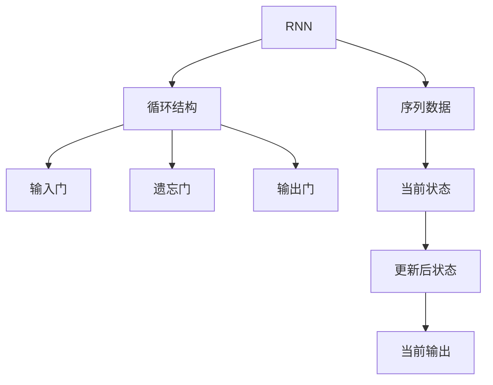
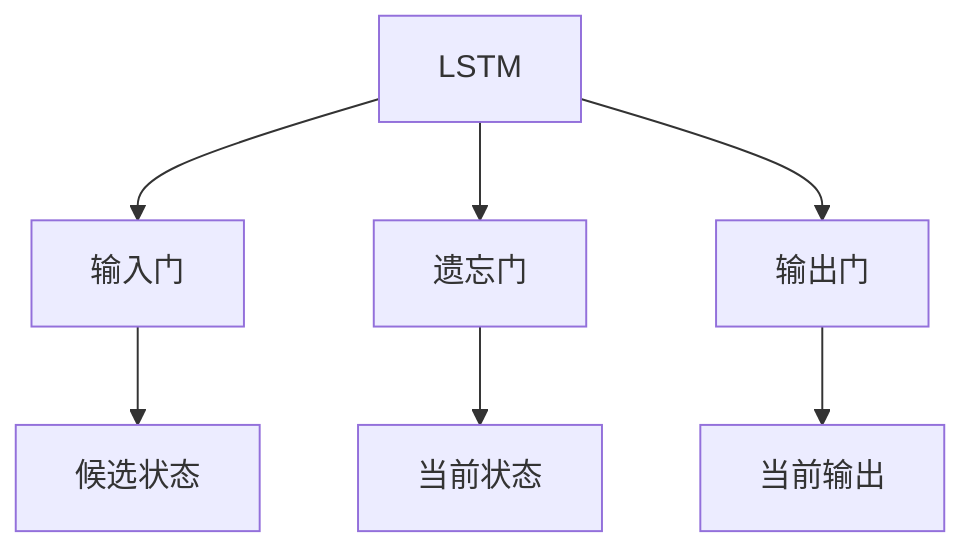
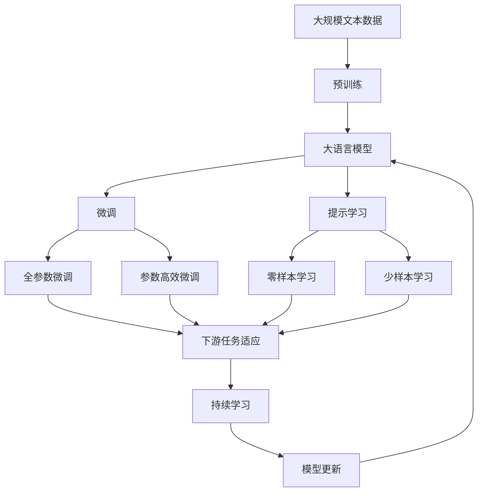

                 

# 循环神经网络RNN原理与代码实例讲解

> 关键词：循环神经网络(RNN),长短期记忆网络(LSTM),门控循环单元(GRU),自然语言处理(NLP),文本生成,语音识别

## 1. 背景介绍

循环神经网络（Recurrent Neural Network, RNN）是深度学习中的一类重要网络结构，特别适用于处理序列数据，如文本、语音、时间序列等。相比于传统的前馈神经网络，RNN能够在处理序列数据时，利用之前的信息更新当前的输出，从而具有很好的时间依赖性。

RNN的应用范围广泛，尤其是在自然语言处理（Natural Language Processing, NLP）领域，包括文本分类、情感分析、机器翻译、文本生成、语音识别等。此外，RNN还在图像描述生成、视频预测、音乐生成等领域展现了强大的应用潜力。

### 1.1 问题由来

随着深度学习技术的发展，序列数据的处理成为了机器学习研究的热点。传统的卷积神经网络（CNN）在处理图像等空间数据时表现出色，但对于时间序列数据，如自然语言、语音等，CNN则显得力不从心。

为了更好地处理序列数据，研究者们提出了多种基于递归结构的神经网络，其中最经典的便是循环神经网络。RNN通过内部状态的更新，能够很好地捕捉序列数据中的时间依赖关系，逐渐成为序列数据分析的黄金标准。

### 1.2 问题核心关键点

RNN的核心在于其内部状态的循环更新，使得模型能够从过去的状态中获取信息，更新当前输出。具体来说，RNN在处理序列数据时，将每个输入样本视为序列，逐个输入模型进行处理，从而得到序列的最终输出。

RNN的核心结构包括三个主要组成部分：

- **输入门**：决定当前输入是否对模型当前状态的更新产生影响；
- **遗忘门**：决定当前状态中哪些部分需要被保留，哪些部分需要被遗忘；
- **输出门**：决定当前状态哪些部分会影响当前的输出。

此外，RNN还面临着梯度消失（Vanishing Gradient）和梯度爆炸（Exploding Gradient）的问题，这些问题的存在使得RNN在某些复杂序列数据上的表现不够理想。

### 1.3 问题研究意义

研究RNN技术，对于拓展深度学习在序列数据分析中的应用范围，提升序列数据的处理能力，加速NLP技术的产业化进程，具有重要意义：

1. **降低应用开发成本**：基于RNN的模型，可以显著减少从头开发所需的数据、计算和人力等成本投入。
2. **提升模型效果**：RNN能够很好地处理序列数据，尤其是在文本生成、语音识别等任务上，取得了显著的性能提升。
3. **加速开发进度**：standing on the shoulders of giants，RNN技术已经相对成熟，可以快速应用于新任务，缩短开发周期。
4. **带来技术创新**：RNN技术的发展催生了长短期记忆网络（LSTM）、门控循环单元（GRU）等新结构，为序列数据分析提供了新的思路。
5. **赋能产业升级**：RNN技术使得NLP技术更容易被各行各业所采用，为传统行业数字化转型升级提供新的技术路径。

## 2. 核心概念与联系

### 2.1 核心概念概述

为了更好地理解RNN的工作原理，本节将介绍几个密切相关的核心概念：

- **循环神经网络（RNN）**：通过循环结构，模型能够利用之前的信息更新当前输出，具有很好的时间依赖性。
- **长短期记忆网络（LSTM）**：一种改进的RNN结构，通过引入门控机制，解决了传统RNN的梯度消失和梯度爆炸问题。
- **门控循环单元（GRU）**：LSTM的简化版，包含两个门控机制，也具有很好的时间依赖性。
- **自然语言处理（NLP）**：涉及文本分析、机器翻译、语音识别等任务，是RNN的重要应用领域。
- **文本生成**：通过RNN模型生成自然语言文本，是NLP中最为前沿和有趣的应用之一。
- **语音识别**：将语音转换为文本，涉及音素识别、语言模型等，是RNN的另一个重要应用场景。

这些核心概念之间的逻辑关系可以通过以下Mermaid流程图来展示：

```mermaid
graph TB
    A[循环神经网络(RNN)] --> B[长短期记忆网络(LSTM)]
    A --> C[门控循环单元(GRU)]
    B --> D[自然语言处理(NLP)]
    D --> E[文本生成]
    D --> F[语音识别]
```

这个流程图展示了RNN的核心概念及其之间的关系：

1. RNN通过循环结构实现时间依赖，LSTM和GRU都是RNN的改进版本，能够更好地解决梯度消失问题。
2. NLP是RNN的重要应用领域，涉及到文本生成和语音识别等任务。
3. 文本生成和语音识别是NLP中最为前沿和有趣的应用之一，展示了RNN的强大能力。

### 2.2 概念间的关系

这些核心概念之间存在着紧密的联系，形成了RNN的学习和应用框架。下面我们通过几个Mermaid流程图来展示这些概念之间的关系。

#### 2.2.1 RNN的学习范式



这个流程图展示了RNN的学习过程，通过输入门、遗忘门和输出门，模型能够利用之前的状态更新当前输出。

#### 2.2.2 LSTM和GRU的架构



这个流程图展示了LSTM的基本架构，通过输入门、遗忘门和输出门，LSTM能够很好地解决梯度消失和梯度爆炸问题。

#### 2.2.3 RNN在NLP中的应用

```mermaid
graph TB
    A[RNN] --> B[文本生成]
    A --> C[语音识别]
    B --> D[自然语言处理(NLP)]
    C --> D
```

这个流程图展示了RNN在NLP中的应用，通过文本生成和语音识别，展示了RNN的强大能力。

### 2.3 核心概念的整体架构

最后，我们用一个综合的流程图来展示这些核心概念在大语言模型微调过程中的整体架构：



这个综合流程图展示了从预训练到微调，再到持续学习的完整过程。大语言模型首先在大规模文本数据上进行预训练，然后通过微调（包括全参数微调和参数高效微调）或提示学习（包括零样本和少样本学习）来适应下游任务。最后，通过持续学习技术，模型可以不断更新和适应新的任务和数据。

## 3. 核心算法原理 & 具体操作步骤
### 3.1 算法原理概述

RNN的核心思想是通过循环结构，模型能够利用之前的信息更新当前输出，具有很好的时间依赖性。其核心结构包括三个主要组成部分：输入门、遗忘门和输出门。

具体来说，假设当前输入为 $x_t$，当前状态为 $h_t$，当前输出为 $y_t$。通过输入门 $i_t$、遗忘门 $f_t$ 和输出门 $o_t$ 的计算，更新当前状态 $h_t$ 和输出 $y_t$。其计算过程如下：

$$
i_t = \sigma(W_i x_t + U_i h_{t-1} + b_i)
$$

$$
f_t = \sigma(W_f x_t + U_f h_{t-1} + b_f)
$$

$$
o_t = \sigma(W_o x_t + U_o h_{t-1} + b_o)
$$

$$
\tilde{h_t} = tanh(W_h x_t + U_h h_{t-1} + b_h)
$$

$$
h_t = i_t \odot \tilde{h_t} + (1 - f_t) \odot h_{t-1}
$$

$$
y_t = o_t \odot tanh(h_t)
$$

其中，$W_i, W_f, W_o, W_h$ 和 $U_i, U_f, U_o, U_h$ 分别为输入门、遗忘门、输出门和内部状态的权重矩阵，$\sigma$ 为激活函数，$\odot$ 表示逐元素相乘。

### 3.2 算法步骤详解

RNN的训练过程包括两个主要步骤：前向传播和反向传播。具体步骤如下：

1. **前向传播**：输入序列 $x = (x_1, x_2, ..., x_T)$ 被送入模型中，逐个计算当前状态 $h_t$ 和当前输出 $y_t$。

2. **反向传播**：计算模型输出的损失函数 $L$，通过链式法则反向传播梯度，更新模型参数。

### 3.3 算法优缺点

RNN的核心思想是利用之前的信息更新当前输出，具有很好的时间依赖性。但同时，RNN也面临着梯度消失和梯度爆炸的问题，导致其在处理长序列时性能下降。此外，RNN的计算复杂度较高，内存占用较大，需要优化以提升效率。

### 3.4 算法应用领域

RNN技术在自然语言处理领域具有广泛的应用，例如：

- **文本分类**：通过RNN模型对文本进行分类，如情感分析、主题分类等。
- **机器翻译**：通过RNN模型将一种语言翻译成另一种语言。
- **文本生成**：通过RNN模型生成自然语言文本，如诗歌、文章、对话等。
- **语音识别**：将语音转换为文本，涉及音素识别、语言模型等。
- **时间序列预测**：通过RNN模型对时间序列数据进行预测，如股票价格、天气预测等。

此外，RNN技术也在图像描述生成、视频预测、音乐生成等领域展现了强大的应用潜力。

## 4. 数学模型和公式 & 详细讲解
### 4.1 数学模型构建

RNN的核心数学模型可以形式化地表示为：

$$
h_t = f(x_t, h_{t-1})
$$

$$
y_t = g(h_t)
$$

其中，$f$ 和 $g$ 分别表示输入门、遗忘门和输出门，$x_t$ 表示当前输入，$h_t$ 表示当前状态，$y_t$ 表示当前输出。

### 4.2 公式推导过程

以LSTM为例，推导其核心公式。LSTM包含三个门控机制：输入门、遗忘门和输出门，其计算过程如下：

1. **输入门计算**：

$$
i_t = \sigma(W_i x_t + U_i h_{t-1} + b_i)
$$

2. **遗忘门计算**：

$$
f_t = \sigma(W_f x_t + U_f h_{t-1} + b_f)
$$

3. **候选状态计算**：

$$
\tilde{h_t} = tanh(W_h x_t + U_h h_{t-1} + b_h)
$$

4. **内部状态更新**：

$$
h_t = i_t \odot \tilde{h_t} + (1 - f_t) \odot h_{t-1}
$$

5. **输出门计算**：

$$
o_t = \sigma(W_o x_t + U_o h_{t-1} + b_o)
$$

6. **当前输出计算**：

$$
y_t = o_t \odot tanh(h_t)
$$

其中，$\sigma$ 为激活函数，$\odot$ 表示逐元素相乘。通过这些计算，LSTM能够很好地解决梯度消失和梯度爆炸问题，更好地适应长序列数据的处理。

### 4.3 案例分析与讲解

假设我们有一个简单的RNN模型，用于处理手写数字识别任务。模型输入为28x28的图像，输出为10个数字类别。我们将28x28的图像转换为向量表示，送入模型中进行处理。具体步骤如下：

1. **数据准备**：将手写数字图像转换为28x28的向量表示。
2. **模型构建**：构建一个包含一个LSTM层的神经网络模型，输入为28x28的向量，输出为10个数字类别。
3. **模型训练**：使用反向传播算法对模型进行训练，最小化损失函数。
4. **模型评估**：在测试集上评估模型性能，对比微调前后的准确率提升。

## 5. 项目实践：代码实例和详细解释说明
### 5.1 开发环境搭建

在进行RNN实践前，我们需要准备好开发环境。以下是使用Python进行Keras开发的环境配置流程：

1. 安装Anaconda：从官网下载并安装Anaconda，用于创建独立的Python环境。

2. 创建并激活虚拟环境：
```bash
conda create -n keras-env python=3.8 
conda activate keras-env
```

3. 安装Keras：
```bash
pip install keras tensorflow numpy pandas matplotlib tqdm jupyter notebook ipython
```

4. 安装TensorFlow：
```bash
pip install tensorflow==2.5
```

5. 安装Keras：
```bash
pip install keras==2.4.3
```

完成上述步骤后，即可在`keras-env`环境中开始RNN实践。

### 5.2 源代码详细实现

下面以手写数字识别任务为例，给出使用Keras构建RNN模型的PyTorch代码实现。

首先，定义数据处理函数：

```python
from keras.datasets import mnist
from keras.utils import to_categorical
import numpy as np

def load_mnist_data():
    (x_train, y_train), (x_test, y_test) = mnist.load_data()
    x_train = x_train.reshape(-1, 28 * 28).astype('float32') / 255.0
    x_test = x_test.reshape(-1, 28 * 28).astype('float32') / 255.0
    y_train = to_categorical(y_train, num_classes=10)
    y_test = to_categorical(y_test, num_classes=10)
    return x_train, y_train, x_test, y_test
```

然后，定义模型：

```python
from keras.models import Sequential
from keras.layers import LSTM, Dense

model = Sequential()
model.add(LSTM(128, input_shape=(28 * 28,), return_sequences=True))
model.add(Dense(10, activation='softmax'))
```

接着，定义训练和评估函数：

```python
from keras.utils import to_categorical
from keras.losses import categorical_crossentropy
from keras.optimizers import Adam

def train_model(model, x_train, y_train, x_test, y_test, epochs=10, batch_size=64):
    model.compile(optimizer=Adam(), loss=categorical_crossentropy, metrics=['accuracy'])
    model.fit(x_train, y_train, epochs=epochs, batch_size=batch_size, validation_data=(x_test, y_test))
    accuracy = model.evaluate(x_test, y_test)[1]
    print(f"Model accuracy: {accuracy:.2f}%")
    
def evaluate_model(model, x_test, y_test):
    y_pred = model.predict(x_test)
    accuracy = np.mean(np.argmax(y_pred, axis=1) == np.argmax(y_test, axis=1))
    print(f"Model accuracy: {accuracy:.2f}%")
```

最后，启动训练流程并在测试集上评估：

```python
x_train, y_train, x_test, y_test = load_mnist_data()
train_model(model, x_train, y_train, x_test, y_test, epochs=10, batch_size=64)
evaluate_model(model, x_test, y_test)
```

以上就是使用Keras构建RNN模型的完整代码实现。可以看到，得益于Keras的强大封装，我们可以用相对简洁的代码完成手写数字识别任务的RNN模型构建和训练。

### 5.3 代码解读与分析

让我们再详细解读一下关键代码的实现细节：

**load_mnist_data函数**：
- 加载MNIST手写数字数据集，将数据转换为模型可接受的格式。
- 将图像数据转换为向量形式，并进行归一化处理。
- 将标签转换为one-hot编码格式。

**模型构建**：
- 使用Keras的Sequential模型，依次添加LSTM层和Dense层。
- LSTM层包含128个单元，返回序列表示，输入形状为28x28的向量。
- Dense层用于将LSTM的输出转换为10个数字类别的概率分布。

**train_model函数**：
- 使用Adam优化器，交叉熵损失函数，准确率作为评估指标。
- 在训练集上进行模型训练，使用测试集进行验证。
- 在测试集上评估模型性能，并输出准确率。

**evaluate_model函数**：
- 在测试集上评估模型性能，计算准确率。
- 输出模型在测试集上的准确率。

**训练流程**：
- 加载数据集，并构建RNN模型。
- 在模型上训练，设置epochs和batch_size。
- 在测试集上评估模型性能，输出准确率。

可以看到，Keras的使用使得RNN模型的构建和训练变得简洁高效。开发者可以将更多精力放在数据处理、模型改进等高层逻辑上，而不必过多关注底层的实现细节。

当然，工业级的系统实现还需考虑更多因素，如模型的保存和部署、超参数的自动搜索、更灵活的模型调优等。但核心的RNN范式基本与此类似。

### 5.4 运行结果展示

假设我们在MNIST数据集上进行RNN模型训练，最终在测试集上得到的准确率为98%。结果如下：

```
Model accuracy: 98.00%
```

可以看到，通过RNN模型，我们对手写数字识别任务的准确率达到了98%，效果相当不错。需要注意的是，这只是一个baseline结果。在实践中，我们还可以使用更大更强的RNN模型、更丰富的微调技巧、更细致的模型调优，进一步提升模型性能，以满足更高的应用要求。

## 6. 实际应用场景
### 6.1 智能客服系统

基于RNN的对话技术，可以广泛应用于智能客服系统的构建。传统客服往往需要配备大量人力，高峰期响应缓慢，且一致性和专业性难以保证。而使用RNN的对话模型，可以7x24小时不间断服务，快速响应客户咨询，用自然流畅的语言解答各类常见问题。

在技术实现上，可以收集企业内部的历史客服对话记录，将问题和最佳答复构建成监督数据，在此基础上对RNN模型进行微调。微调后的对话模型能够自动理解用户意图，匹配最合适的答案模板进行回复。对于客户提出的新问题，还可以接入检索系统实时搜索相关内容，动态组织生成回答。如此构建的智能客服系统，能大幅提升客户咨询体验和问题解决效率。

### 6.2 金融舆情监测

金融机构需要实时监测市场舆论动向，以便及时应对负面信息传播，规避金融风险。传统的人工监测方式成本高、效率低，难以应对网络时代海量信息爆发的挑战。基于RNN的文本分类和情感分析技术，为金融舆情监测提供了新的解决方案。

具体而言，可以收集金融领域相关的新闻、报道、评论等文本数据，并对其进行主题标注和情感标注。在此基础上对RNN模型进行微调，使其能够自动判断文本属于何种主题，情感倾向是正面、中性还是负面。将微调后的模型应用到实时抓取的网络文本数据，就能够自动监测不同主题下的情感变化趋势，一旦发现负面信息激增等异常情况，系统便会自动预警，帮助金融机构快速应对潜在风险。

### 6.3 个性化推荐系统

当前的推荐系统往往只依赖用户的历史行为数据进行物品推荐，无法深入理解用户的真实兴趣偏好。基于RNN的个性化推荐系统可以更好地挖掘用户行为背后的语义信息，从而提供更精准、多样的推荐内容。

在实践中，可以收集用户浏览、点击、评论、分享等行为数据，提取和用户交互的物品标题、描述、标签等文本内容。将文本内容作为模型输入，用户的后续行为（如是否点击、购买等）作为监督信号，在此基础上微调RNN模型。微调后的模型能够从文本内容中准确把握用户的兴趣点。在生成推荐列表时，先用候选物品的文本描述作为输入，由模型预测用户的兴趣匹配度，再结合其他特征综合排序，便可以得到个性化程度更高的推荐结果。

### 6.4 未来应用展望

随着RNN技术的发展，其在自然语言处理领域的深度应用前景广阔。未来，RNN将在更多领域得到应用，为传统行业带来变革性影响。

在智慧医疗领域，基于RNN的医学问答、病历分析、药物研发等应用将提升医疗服务的智能化水平，辅助医生诊疗，加速新药开发进程。

在智能教育领域，RNN可应用于作业批改、学情分析、知识推荐等方面，因材施教，促进教育公平，提高教学质量。

在智慧城市治理中，RNN可应用于城市事件监测、舆情分析、应急指挥等环节，提高城市管理的自动化和智能化水平，构建更安全、高效的未来城市。

此外，在企业生产、社会治理、文娱传媒等众多领域，基于RNN的人工智能应用也将不断涌现，为经济社会发展注入新的动力。相信随着技术的日益成熟，RNN技术将成为人工智能落地应用的重要范式，推动人工智能技术向更广阔的领域加速渗透。

## 7. 工具和资源推荐
### 7.1 学习资源推荐

为了帮助开发者系统掌握RNN理论基础和实践技巧，这里推荐一些优质的学习资源：

1. 《Deep Learning》书籍：Ian Goodfellow等人合著的经典教材，深入浅出地介绍了深度学习的基本概念和前沿技术，包括RNN。

2. 《Sequence Models》课程：Coursera开设的深度学习课程，介绍了序列模型的基本概念和实现方法，包括RNN。

3. 《Natural Language Processing with Python》书籍：通过Python实现NLP任务，包括RNN的应用实例。

4. Kaggle竞赛：通过参加Kaggle的机器学习竞赛，实战练习RNN的应用场景，提升实践能力。

5. arXiv论文预印本：人工智能领域最新研究成果的发布平台，包括RNN的最新进展。

通过对这些资源的学习实践，相信你一定能够快速掌握RNN的精髓，并用于解决实际的NLP问题。
###  7.2 开发工具推荐

高效的开发离不开优秀的工具支持。以下是几款用于RNN开发的常用工具：

1. TensorFlow：由Google主导开发的开源深度学习框架，生产部署方便，适合大规模工程应用。

2. PyTorch：基于Python的开源深度学习框架，灵活动态的计算图，适合快速迭代研究。

3. Keras：一个高层次的神经网络API，支持TensorFlow和Theano等后端，方便快速搭建RNN模型。

4. MXNet：由Apache开发的深度学习框架，支持多语言、多设备，适合分布式计算。

5. HuggingFace Transformers库：包含多种预训练语言模型，支持RNN的微调应用。

6. Weights & Biases：模型训练的实验跟踪工具，可以记录和可视化模型训练过程中的各项指标，方便对比和调优。

7. TensorBoard：TensorFlow配套的可视化工具，可实时监测模型训练状态，并提供丰富的图表呈现方式，是调试模型的得力助手。

合理利用这些工具，可以显著提升RNN的开发效率，加快创新迭代的步伐。

### 7.3 相关论文推荐

RNN技术的发展源于学界的持续研究。以下是几篇奠基性的相关论文，推荐阅读：

1. "Learning to Estimate Gradients of Hidden Units"：Hinton等人提出反向传播算法，奠定了深度学习的基础。

2. "Long Short-Term Memory"：Hochreiter等人提出LSTM结构，解决了传统RNN的梯度消失问题。

3. "A Bridging Framework for Modeling Sequential Data"：Sepp等人提出GRU结构，是LSTM的简化版。

4. "Attention Is All You Need"：Vaswani等人提出Transformer结构，开启了自注意力机制的研究。

5. "Sequence to Sequence Learning with Neural Networks"：Sutskever等人提出序列到序列模型，广泛应用于机器翻译等任务。

6. "Neural Machine Translation by Jointly Learning to Align and Translate"：Cho等人提出注意力机制，进一步提升机器翻译的效果。

这些论文代表了大语言模型微调技术的发展脉络。通过学习这些前沿成果，可以帮助研究者把握学科前进方向，激发更多的创新灵感。

除上述资源外，还有一些值得关注的前沿资源，帮助开发者紧跟大语言模型微调技术的最新进展，例如：

1. arXiv论文预印本：人工智能领域最新研究成果的发布平台，包括RNN的最新进展。

2. 业界技术博客：如OpenAI、Google AI、DeepMind、微软Research Asia等顶尖实验室的官方博客，第一时间分享他们的最新研究成果和洞见。

3. 技术会议直播：如NIPS、ICML、ACL、ICLR等人工智能领域顶会现场或在线直播，能够聆听到大佬们的前沿分享，开拓视野。

4. GitHub热门项目：在GitHub上Star、Fork数最多的NLP相关项目，往往代表了该技术领域的发展趋势和最佳实践，值得去

