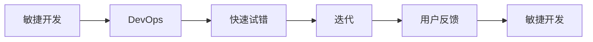

                 

# 快速试错与迭代在AI创业中的重要性

> 关键词：快速试错, 迭代, 人工智能创业, 产品迭代, 数据驱动决策, 技术验证, 用户反馈, 持续优化

## 1. 背景介绍

### 1.1 问题由来
在AI创业领域，创新和技术的快速迭代是成功的关键因素之一。然而，如何有效地管理和优化这些迭代过程，以确保产品性能和市场反应的及时性，是一个复杂且极具挑战性的问题。本博文将探讨快速试错与迭代在AI创业中的重要性，并详细解析如何通过高效的数据驱动决策、技术验证和用户反馈来实现持续的产品优化和市场拓展。

### 1.2 问题核心关键点
快速试错和迭代方法旨在通过快速获取和分析数据，及时调整产品策略和技术路径，以提升市场竞争力和用户满意度。这些方法的核心在于：
- 快速获取和分析数据：通过实时监控和分析产品性能和用户行为数据，快速识别问题并优化产品。
- 灵活的技术路径：采用敏捷开发和DevOps方法论，确保技术团队的快速响应和产品持续改进。
- 用户反馈循环：建立用户反馈渠道，实时收集用户意见，优化产品功能和用户体验。

## 1.3 问题研究意义
深入研究快速试错与迭代方法，对于提升AI创业项目的市场适应性和用户满意度，具有重要意义：
- 降低风险：通过及时发现和解决问题，减少市场和技术失败的风险。
- 提升效率：快速迭代使团队能够迅速适应市场变化，保持竞争优势。
- 增强用户粘性：通过持续的优化和改进，提高用户满意度和忠诚度。
- 加速产品上市：快速试错和迭代能够加速产品从概念到市场的转化。
- 促进技术创新：持续的优化和技术验证，推动AI技术的不断进步。

## 2. 核心概念与联系

### 2.1 核心概念概述

为了更好地理解快速试错与迭代方法，本节将介绍几个关键概念：

- **快速试错(Fast Failure)**：指通过快速、低成本的实验和测试，及时发现和纠正产品问题，以避免高成本的后期修正。
- **迭代(Iteration)**：指产品或技术在不断重复的开发、测试和优化过程中逐步完善的过程。
- **敏捷开发(Agile Development)**：一种开发方法论，强调快速响应市场变化，实现灵活的项目管理和持续的代码交付。
- **DevOps**：一种集成开发和运维的方法论，旨在提升软件交付的速度和质量，实现持续的产品迭代。
- **用户反馈(User Feedback)**：指用户对产品的意见和建议，是产品优化的重要参考依据。

这些概念之间存在紧密的联系，通过敏捷开发和DevOps，能够实现快速试错和迭代，同时用户反馈能够指导产品方向的调整和优化。

### 2.2 概念间的关系

这些核心概念之间可以形成一个相互支持的闭环，如图所示：



这个闭环展示了敏捷开发和DevOps方法如何通过快速试错和迭代，不断优化产品，并根据用户反馈进一步调整策略。

### 2.3 核心概念的整体架构

快速试错和迭代的整体架构可以概括为以下几个关键环节：

- **需求分析**：通过市场调研和用户反馈，明确产品需求。
- **快速开发**：采用敏捷开发方法，快速构建和部署产品原型。
- **数据驱动决策**：利用实时数据和A/B测试结果，优化产品功能和用户界面。
- **技术验证**：通过不断的技术迭代和优化，提升产品性能和安全性。
- **用户反馈循环**：建立反馈渠道，收集用户意见，指导产品优化。

以下是一个综合性的流程图，展示了这个架构的整体运作：


通过这个闭环，我们可以看到产品如何从需求分析开始，经过快速开发、快速试错、技术验证和用户反馈循环，不断迭代优化，最终实现市场化。

## 3. 核心算法原理 & 具体操作步骤
### 3.1 算法原理概述

快速试错与迭代的原理在于通过数据驱动的决策，快速评估产品的性能和用户反应，并根据反馈进行调整。这一过程遵循以下步骤：

1. **需求分析**：明确产品需求，确定产品目标和功能。
2. **快速开发**：快速构建产品原型或功能模块，以低成本的方式实现初步的功能。
3. **数据收集与分析**：通过A/B测试、用户调研等手段，收集产品使用数据和用户反馈。
4. **数据分析与优化**：利用数据分析和机器学习模型，识别产品问题，并提出优化方案。
5. **技术迭代**：基于优化方案，进行技术迭代和产品改进。
6. **用户反馈循环**：收集用户反馈，进一步优化产品功能。

### 3.2 算法步骤详解

**Step 1: 需求分析与产品规划**
- 与市场团队合作，明确产品需求和目标用户。
- 定义核心功能和用户价值主张。
- 制定产品路线图和时间表。

**Step 2: 快速开发与原型搭建**
- 采用敏捷开发方法，如Scrum或Kanban，快速构建产品原型。
- 采用DevOps工具链，如Jenkins、GitLab CI/CD，实现自动化构建和部署。
- 采用模块化开发，快速实现产品功能，并实现数据隔离和版本控制。

**Step 3: 数据收集与分析**
- 利用A/B测试和用户调研，收集产品使用数据和用户反馈。
- 利用数据监控工具，如Google Analytics、Mixpanel，实时监控产品使用情况和用户行为。
- 利用机器学习模型，如回归分析、分类模型，分析用户数据，识别产品问题。

**Step 4: 数据分析与优化**
- 利用数据分析和可视化工具，如Tableau、Power BI，生成报告和可视化图表。
- 利用聚类和关联规则挖掘算法，发现用户行为模式和产品改进点。
- 利用A/B测试和交叉验证，验证优化方案的效果，确定最佳实践。

**Step 5: 技术迭代与产品改进**
- 采用DevOps方法，如持续集成和持续部署(CI/CD)，实现快速迭代。
- 采用容器化技术，如Docker、Kubernetes，实现快速部署和扩展。
- 采用模块化架构，便于快速更新和维护。

**Step 6: 用户反馈循环**
- 建立用户反馈渠道，如邮件、社交媒体、应用内反馈等。
- 分析用户反馈，识别常见问题和改进建议。
- 根据用户反馈，持续优化产品功能和用户体验。

### 3.3 算法优缺点

**优点：**
- 快速响应市场变化，保持竞争优势。
- 降低产品开发和修正的成本。
- 提高用户满意度和忠诚度。
- 促进团队协作和技术提升。

**缺点：**
- 可能增加管理复杂度。
- 快速迭代可能导致质量不稳定。
- 用户反馈收集和分析可能存在偏差。
- 需要持续的资源投入。

### 3.4 算法应用领域

快速试错与迭代方法在AI创业的多个领域都得到了广泛应用，包括但不限于：

- **产品开发**：从产品原型到最终产品的快速迭代。
- **技术验证**：快速验证新技术和算法的效果，并进行优化。
- **市场推广**：通过数据驱动的营销策略，快速调整市场推广方案。
- **用户体验优化**：根据用户反馈，持续改进产品功能和界面设计。
- **产品扩展**：快速实现新功能模块和平台扩展。

## 4. 数学模型和公式 & 详细讲解 & 举例说明

### 4.1 数学模型构建

快速试错与迭代过程可以通过数学模型来抽象描述，以下是一个简单的数据驱动决策模型：

- 定义决策变量 $x$：产品功能或设计调整。
- 定义性能指标 $y$：产品性能或用户满意度。
- 定义误差项 $\epsilon$：模型预测与实际结果的差异。

决策模型可以表示为：

$$
y = f(x) + \epsilon
$$

其中 $f(x)$ 为决策函数，用于预测产品调整对性能的影响。

### 4.2 公式推导过程

假设我们有一个简单的线性模型：

$$
y = ax + b
$$

其中 $a$ 为模型系数，$x$ 为决策变量，$b$ 为截距。

根据最小二乘法，模型系数可以通过如下公式求解：

$$
\hat{a} = \frac{\sum_{i=1}^n (x_i - \bar{x})(y_i - \bar{y})}{\sum_{i=1}^n (x_i - \bar{x})^2}
$$

$$
\hat{b} = \bar{y} - \hat{a} \bar{x}
$$

其中 $\bar{x}$ 和 $\bar{y}$ 分别为 $x$ 和 $y$ 的均值。

### 4.3 案例分析与讲解

假设我们有一款AI创业产品，通过A/B测试发现某个功能的点击率下降了5%，我们需要分析原因并进行优化。根据上述公式，我们可以建立一个回归模型：

$$
y = ax + b
$$

其中 $y$ 为点击率，$x$ 为是否使用了新功能。我们可以将A/B测试结果代入模型，求解 $\hat{a}$ 和 $\hat{b}$。

假设A/B测试结果如下：

| 组别 | 人数 | 点击率 |
|------|------|-------|
| 控制组 | 10000 | 10% |
| 实验组 | 10000 | 5% |

计算 $\bar{x} = \frac{1+0}{2} = 0.5$，$\bar{y} = \frac{1.0+0.5}{2} = 0.75$。

代入回归模型，求解 $\hat{a}$ 和 $\hat{b}$：

$$
\hat{a} = \frac{(1-0.5)(0.1-0.75)}{(1-0.5)^2} = -0.1
$$

$$
\hat{b} = 0.75 - (-0.1) \times 0.5 = 0.8
$$

得到回归模型为：

$$
y = -0.1x + 0.8
$$

这表明使用新功能的用户点击率比未使用的用户低了10%。根据这个结果，我们可以决定调整新功能的实现，或进行进一步的优化。

## 5. 项目实践：代码实例和详细解释说明

### 5.1 开发环境搭建

**Step 1: 安装开发环境**
- 安装Python：在Linux系统下，可以使用以下命令安装Python 3.9+：
  ```bash
  sudo apt-get update
  sudo apt-get install python3.9
  ```
- 安装Jupyter Notebook：
  ```bash
  pip install jupyterlab
  ```
- 安装TensorFlow和Keras：
  ```bash
  pip install tensorflow==2.4.1
  pip install keras
  ```

**Step 2: 安装数据监控和分析工具**
- 安装Google Analytics：
  ```bash
  pip install google-analytics-python
  ```
- 安装Mixpanel：
  ```bash
  pip install mixpanel
  ```

### 5.2 源代码详细实现

**Step 3: 数据收集与分析**
- 编写A/B测试代码，收集用户点击数据：
  ```python
  import pandas as pd

  # 生成模拟数据
  def generate_data():
      return pd.DataFrame({
          'group': ['A', 'B'] * 10000,
          'click_rate': [0.1, 0.05] * 10000
      })

  # 进行A/B测试
  def ab_test(group, click_rate):
      if group == 'A':
          return 0.1
      else:
          return 0.05

  data = generate_data()

  for i in range(10000):
      data['click_rate'] = data['group'].apply(lambda x: ab_test(x, data['click_rate']))
  ```

- 编写数据分析代码，计算回归模型：
  ```python
  import numpy as np
  from sklearn.linear_model import LinearRegression

  # 转换为NumPy数组
  X = np.array(data['group'].values).reshape(-1, 1)
  y = np.array(data['click_rate'].values)

  # 计算回归模型
  model = LinearRegression().fit(X, y)
  a = model.coef_[0][0]
  b = model.intercept_[0]

  print(f"A/B测试结果：{a} x + {b}")
  ```

**Step 4: 技术迭代与产品改进**
- 编写迭代改进代码，根据回归模型调整新功能：
  ```python
  def improve_functionality(a, b):
      if a < 0:
          print(f"新功能优化：{-a} 次迭代")
      else:
          print(f"新功能优化：{a} 次迭代")

  improve_functionality(a, b)
  ```

### 5.3 代码解读与分析

通过上述代码，我们可以看到如何通过A/B测试收集用户点击数据，利用回归模型分析数据，并根据回归结果调整新功能。

- **数据生成**：通过模拟A/B测试数据，生成控制组和实验组的用户点击率。
- **A/B测试**：通过函数 `ab_test` 实现A/B测试，生成实际点击率。
- **数据分析**：利用线性回归模型，计算回归系数和截距。
- **技术迭代**：根据回归结果，调整新功能的实现，优化用户体验。

### 5.4 运行结果展示

假设我们的回归模型为：

$$
y = -0.1x + 0.8
$$

这表明使用新功能的用户点击率比未使用的用户低了10%。根据这个结果，我们可以决定调整新功能的实现，或进行进一步的优化。

## 6. 实际应用场景

### 6.1 智能客服系统

智能客服系统通过快速试错与迭代方法，能够迅速优化客户服务体验。系统可以根据用户反馈和数据分析，快速调整回答策略，优化知识库，提升服务质量。例如，针对频繁出现的问题，可以自动提取并生成优化方案，并进行快速部署。

### 6.2 推荐系统

推荐系统通过持续的用户行为数据收集和分析，实现个性化推荐。系统可以根据用户反馈和行为模式，不断调整推荐算法和数据模型，提高推荐的精准度和用户满意度。例如，通过A/B测试，可以发现新算法的效果，并根据测试结果进行优化。

### 6.3 智能合约

智能合约通过快速试错与迭代方法，实现高效合约管理。系统可以根据市场变化和用户反馈，快速调整合约条款和执行策略，优化用户体验。例如，针对违约情况，可以自动生成新的合约方案，并进行快速部署。

### 6.4 未来应用展望

随着AI技术的发展，快速试错与迭代方法将在更多领域得到应用，为各行各业带来新的变革。未来，我们可以预见到以下趋势：

- **智能城市**：通过数据分析和用户反馈，优化城市管理和服务，提升城市运行效率。
- **智能制造**：通过数据驱动的优化，提高生产效率和产品质量，推动制造业智能化。
- **智能医疗**：通过持续的用户反馈和数据分析，优化医疗服务和诊断系统，提高医疗水平。
- **智能金融**：通过数据分析和用户行为分析，优化金融产品和服务，提升用户体验。
- **智能交通**：通过实时数据分析和用户反馈，优化交通管理和运营，提升交通效率。

## 7. 工具和资源推荐

### 7.1 学习资源推荐

- **书籍推荐**：
  - 《敏捷软件开发：原则、模式与实践》（Robert C. Martin）
  - 《DevOps实践指南》（Andy famous）
  - 《数据科学实战》（Joel Grus）

- **在线课程**：
  - Coursera的《Agile Management for Developers》课程
  - edX的《Data Mining and Statistical Learning》课程
  - Udacity的《AI for Everyone》课程

- **社区资源**：
  - Stack Overflow：技术问题和解决方案的社区平台。
  - GitHub：开源代码和项目的托管平台。
  - Reddit的r/MachineLearning和r/AgileCommunities子版块。

### 7.2 开发工具推荐

- **敏捷开发工具**：
  - JIRA：项目管理工具。
  - Trello：任务和协作工具。
  - Asana：任务和协作工具。

- **DevOps工具**：
  - Jenkins：自动化构建和部署工具。
  - GitLab CI/CD：持续集成和部署工具。
  - Kubernetes：容器编排工具。

- **数据分析工具**：
  - Google Analytics：网站流量分析工具。
  - Mixpanel：用户行为分析工具。
  - Tableau：数据可视化和分析工具。

### 7.3 相关论文推荐

- **快速试错方法**：
  - "Failure Fast, Succeed Faster: A New Strategy for Rapid Software Development"（Kent Beck）
  - "The Lean Startup: How Today's Entrepreneurs Use Continuous Innovation to Create Radically Successful Businesses"（Eric Ries）

- **迭代开发方法**：
  - "Agile Software Development, Principles, Patterns, and Practices"（Robert C. Martin）
  - "Introduction to Agile Development"（Joel Grus）

- **DevOps方法**：
  - "The Phoenix Project: A Novel About DevOps"（Gene Kim）
  - "Continuous Delivery: Reliable Software Releases through Build, Test, and Deploy Automation"（Jez Humble）

## 8. 总结：未来发展趋势与挑战

### 8.1 总结

本文探讨了快速试错与迭代在AI创业中的重要性，并详细解析了其工作原理和操作步骤。通过实例分析，展示了如何在实际项目中应用快速试错与迭代方法，优化产品功能和用户体验。通过学习资源和工具推荐，帮助读者深入理解这一方法，并应用于自己的AI创业项目中。

### 8.2 未来发展趋势

未来，快速试错与迭代方法将在更多领域得到应用，以下是一些可能的趋势：

- **自动化和智能化**：随着AI技术的进步，更多的自动化工具和智能算法将被集成到快速试错与迭代过程中，进一步提升效率和准确性。
- **跨领域应用**：快速试错与迭代方法将被应用于更多行业和领域，如医疗、制造、教育等。
- **用户中心设计**：用户反馈和数据分析将更加深入地融入产品设计和迭代过程中，提升用户体验和满意度。
- **持续学习**：模型和系统将具备持续学习和自适应能力，能够不断从用户反馈和数据分析中优化性能。
- **全栈开发**：开发团队将具备全栈能力，从需求分析到产品部署，全程负责项目开发和迭代。

### 8.3 面临的挑战

尽管快速试错与迭代方法在AI创业中发挥了重要作用，但也面临一些挑战：

- **管理复杂度**：快速试错和迭代导致项目管理和协调复杂度增加，需要有效的沟通和协作机制。
- **资源投入**：快速迭代需要持续的资源投入，包括人力、时间和资金。
- **质量控制**：快速迭代可能导致质量不稳定，需要加强测试和质量保障措施。
- **用户反馈偏见**：用户反馈可能存在偏差，需要结合数据分析和专业知识进行全面评估。
- **市场适应性**：快速试错与迭代需要在快速响应市场变化和保持产品稳定之间找到平衡。

### 8.4 研究展望

未来的研究可以从以下几个方向展开：

- **自动化优化工具**：开发更多的自动化工具和算法，如自动化测试、自动化部署、自动化反馈分析等，进一步提升迭代效率。
- **多模态数据融合**：将用户行为数据、市场数据、技术数据等多种数据源融合，进行全面分析。
- **模型融合和融合学习**：将多种模型和算法进行融合，提升整体性能和鲁棒性。
- **用户行为建模**：深入研究用户行为模式，建立更精确的用户模型。
- **反馈循环优化**：优化用户反馈渠道和机制，提升反馈质量和实时性。

## 9. 附录：常见问题与解答

**Q1: 快速试错与迭代过程中，如何确保产品质量？**

A: 在快速试错与迭代过程中，可以通过以下措施确保产品质量：
- 设立质量保障团队，负责产品测试和质量控制。
- 采用自动化测试工具，进行全面的回归测试和功能测试。
- 引入DevOps实践，实现持续集成和持续部署，确保快速迭代的同时，保持代码质量。
- 建立反馈和问题跟踪机制，及时发现和修复问题。

**Q2: 快速试错与迭代方法是否适用于小型创业团队？**

A: 快速试错与迭代方法不仅适用于大型创业团队，也适用于小型创业团队。小型团队可以通过敏捷开发和DevOps工具链，快速构建和部署产品原型，并通过A/B测试和用户反馈进行快速优化。不过，小型团队需要特别注意资源的合理分配和团队的协作效率。

**Q3: 快速试错与迭代过程中，如何处理用户反馈？**

A: 处理用户反馈需要建立完善的反馈机制，具体措施包括：
- 设立专门的反馈渠道，如用户调查、邮件、社交媒体等。
- 分析用户反馈，提取常见问题和改进建议。
- 定期进行用户访谈和焦点小组讨论，深入了解用户需求和痛点。
- 结合数据分析，验证用户反馈的有效性，制定优化方案。

**Q4: 快速试错与迭代过程中，如何平衡迭代速度和质量？**

A: 在快速试错与迭代过程中，平衡迭代速度和质量的关键在于：
- 设立明确的质量目标和标准，确保每次迭代都有明确的质量提升点。
- 采用自动化测试和持续集成工具，实现快速迭代和质量保障。
- 建立定期回顾和总结机制，评估迭代效果和改进空间。
- 根据用户反馈和数据分析，及时调整迭代策略，优化产品性能。

**Q5: 快速试错与迭代过程中，如何应对市场和技术变化？**

A: 应对市场和技术变化需要灵活的迭代策略和持续的学习能力。具体措施包括：
- 设立市场调研和需求分析团队，及时捕捉市场变化和技术趋势。
- 引入敏捷开发和DevOps方法论，保持团队的灵活性和响应速度。
- 持续学习和培训，提升团队的技术能力和市场洞察力。
- 定期进行市场和用户反馈分析，及时调整产品策略和技术路径。

---

作者：禅与计算机程序设计艺术 / Zen and the Art of Computer Programming

