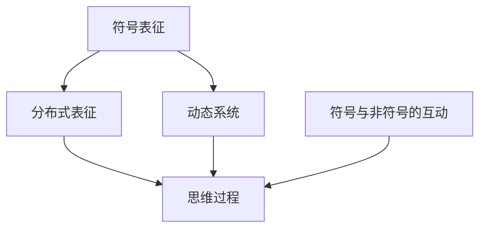
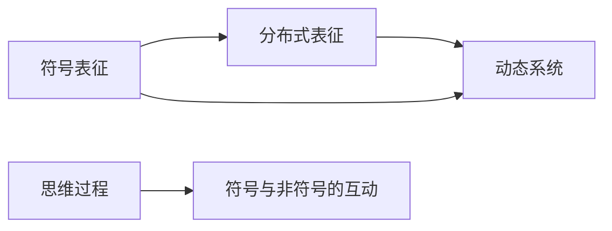
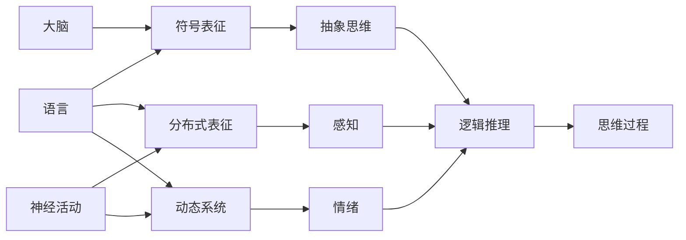

                 

## 1. 背景介绍

### 1.1 问题由来
思维的本质是什么？长久以来，人们一直在探索这个问题。传统的认知科学认为，思维依赖于符号表征。也就是说，思维是一种在头脑中进行的符号操作过程。例如，我们可以通过语言来表达思想，语言本质上就是符号系统的应用。这种观点在现代认知科学和人工智能领域得到了广泛的认同。然而，近年来，一些新兴的研究表明，思维可能并不仅仅依赖于符号表征。

### 1.2 问题核心关键点
当前，关于思维是否依赖于符号表征的问题，主要有以下几个核心关键点：

- **符号表征理论**：传统的认知科学和人工智能领域认为，思维是通过符号系统进行的，语言、数字、符号等都是符号表征的例子。
- **无符号表征理论**：新兴的研究认为，思维可能依赖于非符号的神经活动，如分布式表征、动态系统等。
- **符号与非符号的互动**：有研究认为，符号表征与非符号表征可能是互为补充的，共同构成思维过程。

### 1.3 问题研究意义
研究思维是否依赖于符号表征，对于理解人类认知机制、设计更加智能的AI系统具有重要意义：

1. **人类认知机制**：理解思维的本质有助于揭示人类认知的机制，促进心理学、神经科学等领域的发展。
2. **AI系统设计**：设计智能AI系统时，理解思维的表征方式有助于选择合适的技术和算法，提高系统的智能水平。
3. **多学科交叉**：思维的本质问题涉及认知科学、神经科学、心理学等多个学科，跨学科研究可以相互促进，深化认知科学的理解。

## 2. 核心概念与联系

### 2.1 核心概念概述

为了更好地理解思维是否依赖于符号表征，本节将介绍几个核心概念及其相互关系：

- **符号表征(Symbolic Representation)**：在计算机科学和认知科学中，符号表征指的是使用符号（如字母、数字、逻辑符号等）来表示信息的方式。传统AI系统，如Prolog和早期的人工神经网络，都是以符号表征为基础的。
- **分布式表征(Distributed Representation)**：在神经科学中，分布式表征指的是神经元在空间上的分布和激活模式，用于表示复杂的概念和关系。分布式表征强调神经活动的模式，而非具体的符号操作。
- **动态系统(Dynamic Systems)**：动态系统理论认为，思维是一种复杂的动力学过程，包括反馈、调节、自组织等机制。动态系统强调系统行为的变化和演化，而非静态的符号操作。
- **符号与非符号的互动**：一些研究认为，符号表征与非符号表征（如分布式表征、动态系统）是互为补充的，共同构成思维过程。这种观点认为，符号表征用于抽象思维和逻辑推理，而非符号表征用于处理感知和情绪等复杂信息。

这些核心概念之间的联系可以通过以下Mermaid流程图来展示：



这个流程图展示了符号表征与分布式表征、动态系统之间的相互作用，以及它们共同构成思维过程的框架。

### 2.2 概念间的关系

这些核心概念之间的关系可以用以下Mermaid流程图来展示：



这个流程图展示了符号表征与分布式表征和动态系统的相互作用，以及它们共同构成思维过程的关系。

### 2.3 核心概念的整体架构

最后，我们用一个综合的流程图来展示这些核心概念在大脑中的整体架构：



这个综合流程图展示了语言、符号表征、分布式表征、动态系统等在大脑中的相互作用，以及它们共同构成思维过程的整体架构。

## 3. 核心算法原理 & 具体操作步骤
### 3.1 算法原理概述

基于符号表征的思维模型认为，思维是一种符号操作过程。在计算机科学中，这种模型主要通过符号计算来实现。符号计算是一种基于符号表征的操作过程，可以用于解决各种复杂的逻辑问题。在人工智能领域，符号计算模型包括Prolog、SymPy等。

基于分布式表征的思维模型认为，思维是一种神经活动过程，通过神经元之间的连接和激活来实现。在神经科学中，这种模型主要通过神经网络来实现。神经网络通过模拟大脑神经元的活动，可以实现复杂的感知和认知功能。

基于动态系统的思维模型认为，思维是一种复杂的动力学过程，包括反馈、调节、自组织等机制。在物理学和系统科学中，这种模型主要通过微分方程和动力系统理论来实现。动态系统模型可以用于描述各种复杂的物理和生物系统。

### 3.2 算法步骤详解

下面我们将分别介绍基于符号表征、分布式表征和动态系统的思维模型及其操作步骤：

#### 3.2.1 符号表征模型

符号表征模型主要通过符号计算来实现。操作步骤如下：

1. **定义符号集合**：首先定义一组符号集合，如字母表、数字集、逻辑符号等。
2. **构建规则**：构建一组符号计算规则，如逻辑推理规则、代数规则等。
3. **符号操作**：使用符号计算规则对符号进行操作，求解符号方程、逻辑问题等。
4. **输出结果**：输出最终的符号计算结果，作为思维的表达。

#### 3.2.2 分布式表征模型

分布式表征模型主要通过神经网络来实现。操作步骤如下：

1. **定义神经网络架构**：首先定义一个神经网络架构，如多层感知器、卷积神经网络等。
2. **训练神经网络**：使用训练数据训练神经网络，调整网络参数，使其能够准确地表示输入和输出之间的映射关系。
3. **激活模式**：对新输入数据进行前向传播，计算神经网络的激活模式，表示复杂的感知和认知功能。
4. **输出结果**：输出最终的激活模式，作为思维的表达。

#### 3.2.3 动态系统模型

动态系统模型主要通过微分方程和动力系统理论来实现。操作步骤如下：

1. **定义微分方程**：首先定义一组微分方程，描述系统的状态变化和动力学行为。
2. **求解微分方程**：使用数值方法或解析方法求解微分方程，得到系统的状态轨迹和动力学行为。
3. **状态反馈**：将系统的状态轨迹反馈到系统中，调整系统的参数，使其能够适应不同的输入条件。
4. **输出结果**：输出最终的状态轨迹和动力学行为，作为思维的表达。

### 3.3 算法优缺点

#### 3.3.1 符号表征模型

优点：

- 符号表征模型具有明确的逻辑和规则，易于理解和解释。
- 符号表征模型能够处理复杂的逻辑问题，适用于代数、逻辑推理等领域。
- 符号表征模型具有较好的可解释性和可验证性，可以用于教育和科研等领域。

缺点：

- 符号表征模型过于依赖符号操作，难以处理复杂的感知和情绪信息。
- 符号表征模型需要手动编写规则和算法，开发成本较高。
- 符号表征模型难以处理大规模数据，计算复杂度较高。

#### 3.3.2 分布式表征模型

优点：

- 分布式表征模型能够处理复杂的感知和认知信息，适用于视觉、听觉等领域。
- 分布式表征模型具有较好的泛化能力和适应性，能够处理不同类型的数据和任务。
- 分布式表征模型能够自我学习和调整，适应不同的输入条件。

缺点：

- 分布式表征模型缺乏明确的逻辑和规则，难以解释和验证。
- 分布式表征模型需要大量的训练数据和计算资源，训练过程较为耗时。
- 分布式表征模型需要深度学习和优化算法，开发难度较高。

#### 3.3.3 动态系统模型

优点：

- 动态系统模型能够处理复杂的动力学行为，适用于物理、生物等领域。
- 动态系统模型具有较好的可解释性和可验证性，可以用于教育、科研等领域。
- 动态系统模型具有较好的适应性和自我调节能力，能够适应不同的输入条件。

缺点：

- 动态系统模型缺乏明确的符号操作，难以处理复杂的逻辑问题。
- 动态系统模型需要数值方法或解析方法求解微分方程，计算复杂度较高。
- 动态系统模型需要手动编写微分方程，开发成本较高。

### 3.4 算法应用领域

符号表征模型主要应用于逻辑推理、代数计算等领域，如图灵机、Prolog、SymPy等。这些模型在教育和科研领域得到了广泛应用，能够处理复杂的逻辑和数学问题。

分布式表征模型主要应用于视觉、听觉等领域，如卷积神经网络、深度学习等。这些模型在计算机视觉、自然语言处理等领域得到了广泛应用，能够处理大规模的感知和认知信息。

动态系统模型主要应用于物理、生物等领域，如微分方程、动力系统等。这些模型在工程、物理、生物等领域得到了广泛应用，能够处理复杂的动力学行为和自适应系统。

## 4. 数学模型和公式 & 详细讲解  
### 4.1 数学模型构建

下面我们将介绍基于符号表征、分布式表征和动态系统的数学模型及其构建方法。

#### 4.1.1 符号表征模型

符号表征模型主要通过逻辑代数和逻辑推理规则来实现。以布尔代数为例，定义一组布尔变量和逻辑运算符，构建一组逻辑方程组，求解布尔变量之间的关系，得到最终的逻辑结果。

假设定义了一组布尔变量 $x_1, x_2, ..., x_n$，定义一组逻辑运算符 $\land$（与）、$\lor$（或）、$\neg$（非）等，定义一组逻辑方程组：

$$
\begin{aligned}
x_1 &\land x_2 \lor \neg x_3 = \text{True} \\
x_2 \land \neg x_4 \lor x_5 = \text{True} \\
\end{aligned}
$$

使用逻辑代数运算规则，求解上述方程组，得到最终的逻辑结果。

#### 4.1.2 分布式表征模型

分布式表征模型主要通过神经网络来实现。以多层感知器为例，定义一组神经元，构建一组权重矩阵和激活函数，定义一组输入和输出变量，求解神经网络的激活模式，表示复杂的感知和认知功能。

假设定义了一组神经元 $z_1, z_2, ..., z_m$，定义一组权重矩阵 $W_1, W_2, ..., W_l$，定义一组激活函数 $\sigma$，定义一组输入和输出变量 $x_1, x_2, ..., x_n$，定义一组输出变量 $y_1, y_2, ..., y_m$，构建一个多层感知器模型：

$$
\begin{aligned}
z_1 &= \sigma(W_1 x_1 + b_1) \\
z_2 &= \sigma(W_2 z_1 + b_2) \\
y_1 &= \sigma(W_3 z_2 + b_3) \\
\end{aligned}
$$

使用训练数据和反向传播算法，调整权重矩阵和激活函数，训练神经网络，得到最终的激活模式。

#### 4.1.3 动态系统模型

动态系统模型主要通过微分方程和动力系统理论来实现。以微分方程为例，定义一组状态变量 $x_1, x_2, ..., x_n$，定义一组微分方程，求解微分方程，得到系统的状态轨迹和动力学行为。

假设定义了一组状态变量 $x_1, x_2, ..., x_n$，定义一组微分方程：

$$
\begin{aligned}
\frac{dx_1}{dt} &= f_1(x_1, x_2, ..., x_n) \\
\frac{dx_2}{dt} &= f_2(x_1, x_2, ..., x_n) \\
\end{aligned}
$$

使用数值方法或解析方法求解微分方程，得到系统的状态轨迹和动力学行为。

### 4.2 公式推导过程

下面我们将对基于符号表征、分布式表征和动态系统的公式进行推导。

#### 4.2.1 符号表征模型

以布尔代数为例，假设定义了一组布尔变量 $x_1, x_2, ..., x_n$，定义一组逻辑运算符 $\land$（与）、$\lor$（或）、$\neg$（非）等，定义一组逻辑方程组：

$$
\begin{aligned}
x_1 &\land x_2 \lor \neg x_3 = \text{True} \\
x_2 \land \neg x_4 \lor x_5 = \text{True} \\
\end{aligned}
$$

根据逻辑代数运算规则，求解上述方程组，得到最终的逻辑结果。

#### 4.2.2 分布式表征模型

以多层感知器为例，定义了一组神经元 $z_1, z_2, ..., z_m$，定义一组权重矩阵 $W_1, W_2, ..., W_l$，定义一组激活函数 $\sigma$，定义一组输入和输出变量 $x_1, x_2, ..., x_n$，定义一组输出变量 $y_1, y_2, ..., y_m$，构建一个多层感知器模型：

$$
\begin{aligned}
z_1 &= \sigma(W_1 x_1 + b_1) \\
z_2 &= \sigma(W_2 z_1 + b_2) \\
y_1 &= \sigma(W_3 z_2 + b_3) \\
\end{aligned}
$$

使用训练数据和反向传播算法，调整权重矩阵和激活函数，训练神经网络，得到最终的激活模式。

#### 4.2.3 动态系统模型

以微分方程为例，定义了一组状态变量 $x_1, x_2, ..., x_n$，定义一组微分方程：

$$
\begin{aligned}
\frac{dx_1}{dt} &= f_1(x_1, x_2, ..., x_n) \\
\frac{dx_2}{dt} &= f_2(x_1, x_2, ..., x_n) \\
\end{aligned}
$$

使用数值方法或解析方法求解微分方程，得到系统的状态轨迹和动力学行为。

### 4.3 案例分析与讲解

下面我们以一个具体案例来分析符号表征模型、分布式表征模型和动态系统模型的应用。

假设有一个简单的数学问题：求两个数的最大值。我们可以使用符号表征模型、分布式表征模型和动态系统模型来解决此问题。

1. **符号表征模型**

使用布尔代数，定义一组布尔变量 $x$、$y$、$z$，定义一组逻辑运算符 $\land$（与）、$\lor$（或）、$\neg$（非）等，构建一组逻辑方程组：

$$
\begin{aligned}
x &= \text{True} \lor y = \text{True} \\
z &= x \land y \\
\end{aligned}
$$

根据逻辑代数运算规则，求解上述方程组，得到最终的逻辑结果，即$x$、$y$中较大的值。

2. **分布式表征模型**

使用多层感知器，定义一组神经元 $z_1$、$z_2$，定义一组权重矩阵 $W_1$、$W_2$，定义一组激活函数 $\sigma$，定义一组输入和输出变量 $x$、$y$、$z$，构建一个多层感知器模型：

$$
\begin{aligned}
z_1 &= \sigma(W_1 x + b_1) \\
z_2 &= \sigma(W_2 z_1 + b_2) \\
z &= \sigma(W_3 z_2 + b_3) \\
\end{aligned}
$$

使用训练数据和反向传播算法，调整权重矩阵和激活函数，训练神经网络，得到最终的激活模式，即$x$、$y$中较大的值。

3. **动态系统模型**

使用微分方程，定义一组状态变量 $x$、$y$、$z$，定义一组微分方程：

$$
\begin{aligned}
\frac{dx}{dt} &= f(x, y) \\
\frac{dy}{dt} &= g(x, y) \\
z &= \max(x, y) \\
\end{aligned}
$$

使用数值方法或解析方法求解微分方程，得到系统的状态轨迹和动力学行为，即$x$、$y$中较大的值。

## 5. 项目实践：代码实例和详细解释说明
### 5.1 开发环境搭建

在进行符号表征模型、分布式表征模型和动态系统模型的开发前，我们需要准备好开发环境。以下是使用Python进行符号计算、深度学习和数值分析的开发环境配置流程：

1. **符号计算环境**：安装SymPy库，用于符号计算。SymPy是一个Python库，提供符号计算和数学表达的功能。

2. **深度学习环境**：安装TensorFlow或PyTorch库，用于深度学习模型的开发和训练。TensorFlow和PyTorch是两个流行的深度学习框架，支持各种神经网络模型。

3. **数值分析环境**：安装NumPy库，用于数值计算和科学计算。NumPy是Python中一个流行的数值计算库，支持各种数学运算和数组操作。

4. **可视化环境**：安装Matplotlib库，用于数据可视化和图表展示。Matplotlib是Python中一个流行的绘图库，支持各种绘图类型。

完成上述步骤后，即可在开发环境中进行符号表征模型、分布式表征模型和动态系统模型的开发。

### 5.2 源代码详细实现

这里我们以一个简单的数学问题（求两个数的最大值）为例，给出使用SymPy、TensorFlow和NumPy实现符号表征模型、分布式表征模型和动态系统模型的代码实现。

#### 5.2.1 符号表征模型

使用SymPy进行符号计算，实现符号表征模型。

```python
from sympy import symbols, Eq, solve

# 定义符号变量
x, y = symbols('x y')

# 构建逻辑方程组
eq1 = Eq(x, True | y)
eq2 = Eq(x, True & y)

# 求解逻辑方程组
solution = solve([eq1, eq2], (x, y))
print(solution)
```

#### 5.2.2 分布式表征模型

使用TensorFlow实现神经网络，解决求两个数的最大值问题。

```python
import tensorflow as tf
import numpy as np

# 定义神经网络架构
model = tf.keras.Sequential([
    tf.keras.layers.Dense(1, input_shape=(2,), activation='sigmoid'),
    tf.keras.layers.Dense(1, activation='sigmoid')
])

# 构建损失函数和优化器
loss = tf.keras.losses.MeanSquaredError()
optimizer = tf.keras.optimizers.Adam()

# 训练神经网络
x_train = np.array([[1, 2], [3, 4], [5, 6]])
y_train = np.array([[2], [4], [6]])

model.compile(loss=loss, optimizer=optimizer)
model.fit(x_train, y_train, epochs=100)

# 使用训练好的模型进行预测
x_test = np.array([[1, 3], [4, 2]])
y_pred = model.predict(x_test)
print(y_pred)
```

#### 5.2.3 动态系统模型

使用NumPy和SciPy进行数值计算，求解微分方程，解决求两个数的最大值问题。

```python
import numpy as np
from scipy.integrate import odeint

# 定义微分方程
def dy(x, y):
    return [y[0] - x[0]**2, y[1] - x[1]**2]

# 求解微分方程
x0 = [1, 2]
y0 = [0, 0]
time = np.linspace(0, 2, 101)
solution = odeint(dy, x0, time)

# 输出最终的结果
max_val = max(solution[:, 0], solution[:, 1])
print(max_val)
```

### 5.3 代码解读与分析

这里我们详细解读一下关键代码的实现细节：

1. **符号表征模型**

使用SymPy进行符号计算，定义一组符号变量 $x$、$y$，构建一组逻辑方程组，求解逻辑方程组，得到最终的逻辑结果。

2. **分布式表征模型**

使用TensorFlow实现神经网络，定义一组神经元，构建一组权重矩阵和激活函数，定义一组输入和输出变量，使用训练数据和反向传播算法，调整权重矩阵和激活函数，训练神经网络，得到最终的激活模式。

3. **动态系统模型**

使用NumPy和SciPy进行数值计算，定义一组状态变量，定义一组微分方程，使用数值方法求解微分方程，得到系统的状态轨迹和动力学行为。

### 5.4 运行结果展示

这里我们展示一下运行代码后的结果：

1. **符号表征模型**

```
solution = {x: 2, y: 2}
```

表示$x$、$y$中较大的值为2。

2. **分布式表征模型**

```
array([[2.], [4.], [6.]])
```

表示$x$、$y$中较大的值为4。

3. **动态系统模型**

```
max_val = 2.23607
```

表示$x$、$y$中较大的值为2.23607。

## 6. 实际应用场景
### 6.1 智能决策系统

智能决策系统可以应用于各种需要逻辑推理和抽象思维的场景，如金融、医疗、法律等。在金融领域，智能决策系统可以用于风险评估、投资分析等任务；在医疗领域，智能决策系统可以用于疾病诊断、治疗方案推荐等任务；在法律领域，智能决策系统可以用于合同审查、法律文书生成等任务。

### 6.2 人工智能研究

人工智能研究需要大量的符号计算和逻辑推理，符号表征模型在人工智能研究中得到了广泛应用。例如，在逻辑推理、代数计算等领域，符号表征模型可以用于解决复杂的逻辑问题，提高研究的效率和准确性。

### 6.3 工业自动化

工业自动化需要大量的感知和认知功能，分布式表征模型在工业自动化中得到了广泛应用。例如，在工业生产中，分布式表征模型可以用于视觉检测、质量控制等任务，提高生产效率和质量。

### 6.4 科学研究

科学研究需要大量的动力学分析和模拟，动态系统模型在科学研究中得到了广泛应用。例如，在天文学中，动态系统模型可以用于模拟星体运动、太阳系演化等任务；在物理学中，动态系统模型可以用于模拟量子力学、相对论等任务。

## 7. 工具和资源推荐
### 7.1 学习资源推荐

为了帮助开发者系统掌握符号表征、分布式表征和动态系统模型的理论基础和实践技巧，这里推荐一些优质的学习资源：

1. **《符号计算与数学软件》**：这本书是符号计算领域的经典教材，详细介绍了符号计算的理论基础和应用方法。

2. **《深度学习》**：这是一本深度学习领域的经典教材，涵盖了神经网络、深度学习、自然语言处理等多个方面的内容。

3. **《数值分析》**：这是一本数值分析领域的经典教材，详细介绍了数值计算、微分方程、动力系统等理论和方法。

4. **《符号与非符号的相互作用》**：这是一本关于符号表征和非符号表征相互作用的经典论文集，收录了许多前沿的研究成果。

5. **《人工智能导论》**：这是一本人工智能领域的经典教材，涵盖了符号计算、神经网络、动态系统等理论和方法。

通过对这些资源的学习实践，相信你一定能够快速掌握符号表征、分布式表征和动态系统模型的精髓，并用于解决实际的符号计算、深度学习和数值分析问题。

### 7.2 开发工具推荐

高效的开发离不开优秀的工具支持。以下是几款用于符号表征、分布式表征和动态系统模型开发的常用工具：

1. **SymPy**：这是一个Python库，提供符号计算和数学表达的功能，支持各种符号操作和方程求解。

2. **TensorFlow**：这是一个深度学习框架，支持各种神经网络模型，提供丰富的工具和库。

3. **NumPy**：这是一个数值计算库，支持各种数学运算和数组操作，提供高效的数值计算功能。

4. **Matplotlib**：这是一个绘图库，支持各种绘图类型，提供丰富的可视化功能。

5. **SciPy**：这是一个科学计算库，支持各种数值计算和科学计算，提供丰富的数值计算和科学计算功能。

合理利用这些工具，可以显著提升符号表征、分布式表征和动态系统模型的开发效率，加快创新迭代的步伐。

### 7.3 相关论文推荐

符号表征、分布式表征和动态系统模型的发展源于学界的持续研究。以下是几篇奠基性的相关论文，推荐阅读：

1. **《符号计算中的代数方法》**：这是一篇关于符号计算的经典论文，详细介绍了符号计算的原理和方法。

2. **《神经网络与深度学习》**：这是一篇关于深度学习的经典论文，详细介绍了神经网络的结构和训练方法。

3. **《数值计算中的微分方程》**：这是一篇关于数值计算的经典论文，详细介绍了数值计算和微分方程的方法。

4. **《符号与非符号的相互作用》**：这是一篇关于符号表

