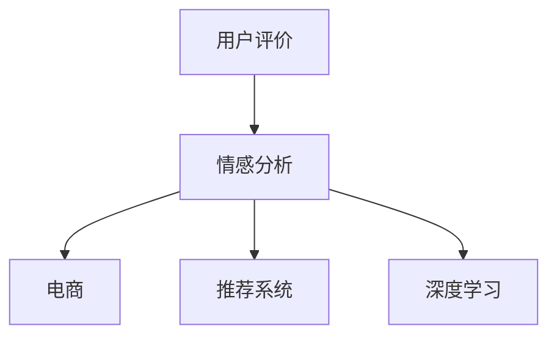
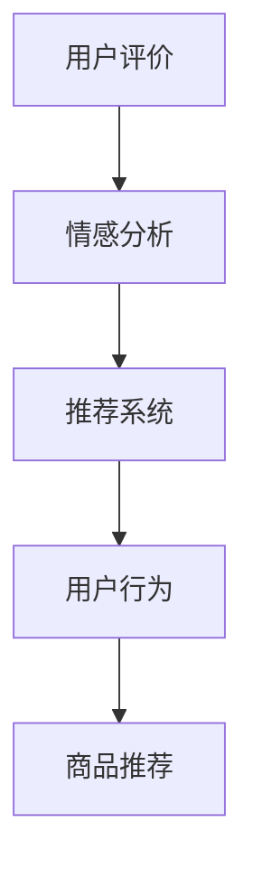
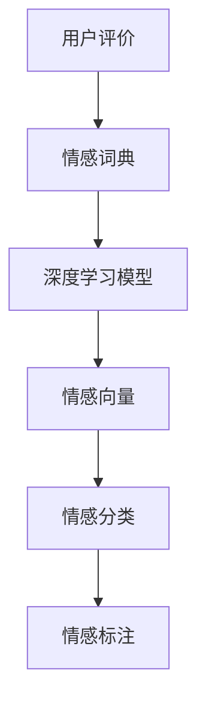
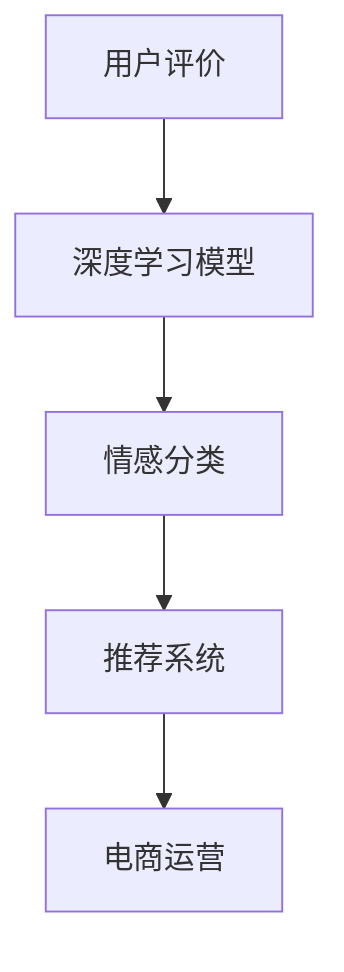

                 

# 情感分析在电商领域的应用：从用户评价到商品改进

> 关键词：情感分析,电商,用户评价,商品改进,深度学习,自然语言处理(NLP),文本分类,推荐系统,用户反馈分析

## 1. 背景介绍

### 1.1 问题由来
随着电商市场的蓬勃发展，越来越多的企业意识到，用户评价和反馈对于商品销售和改进至关重要。用户评价不仅反映商品质量和服务水平，还蕴含了大量有价值的信息，能够指导商家改进商品、优化服务、提升用户体验。因此，如何从海量的用户评价中提取情感倾向、分析和挖掘有价值的信息，成为电商企业关注的焦点。

情感分析作为自然语言处理(NLP)和深度学习技术的交叉领域，正被广泛应用于电商领域。通过情感分析，商家可以迅速了解用户对商品的评价，及时发现和解决问题，优化商品和服务，从而在竞争激烈的市场中脱颖而出。

### 1.2 问题核心关键点
情感分析的核心在于准确识别用户评价中的情感倾向，并从大量文本数据中提取出有价值的信息。对于电商企业而言，以下三个方面是情感分析的重点和难点：

1. **多维情感识别**：用户评价不仅包含正面、负面情感，还包括中性、模糊、复杂情感。情感识别模型需要具备多维度的情感理解和识别能力，才能更全面地把握用户情感。
2. **语义理解**：不同用户对同一件商品可能有不同的评价标准和表达方式，情感分析模型需要理解这些不同的表达方式，才能准确地提取情感信息。
3. **上下文理解**：用户评价往往包含大量的上下文信息，情感分析模型需要结合上下文信息，才能更准确地判断情感倾向。

### 1.3 问题研究意义
情感分析在电商领域的应用，不仅能够帮助商家了解用户需求和满意度，还可以为商品改进、市场分析、竞争对手监控提供数据支撑。通过情感分析，商家可以：

1. **快速识别用户问题**：及时发现用户对商品的不满和问题，迅速做出反应，改进商品和服务。
2. **提升用户满意度**：通过分析用户情感，优化商品设计和营销策略，提升用户满意度和忠诚度。
3. **增强市场竞争力**：通过情感分析，了解竞争对手的优劣势，调整市场策略，提升市场份额。
4. **促进个性化推荐**：结合情感分析结果，推荐用户感兴趣的商品，提高推荐系统的效果。

## 2. 核心概念与联系

### 2.1 核心概念概述

为更好地理解情感分析在电商领域的应用，本节将介绍几个密切相关的核心概念：

- **情感分析(Sentiment Analysis)**：通过自然语言处理技术，识别和提取文本中的情感倾向，可以分为正面、负面、中性等。情感分析广泛应用于用户反馈分析、舆情监控、品牌声誉管理等领域。
- **电商(E-commerce)**：通过互联网平台进行的商品交易活动，包括B2B、B2C、C2C等多种模式。电商行业的发展离不开用户评价和反馈，情感分析在其中起到了重要的作用。
- **用户评价(User Reviews)**：用户在购买商品后对商品、服务、体验的评价，通常包含文字、图片、评分等多种形式。
- **推荐系统(Recommendation System)**：通过分析用户行为数据和兴趣偏好，推荐用户感兴趣的商品或服务，提高用户满意度。
- **深度学习(Deep Learning)**：通过多层次的神经网络模型，自动提取和处理复杂的数据特征，广泛应用于计算机视觉、语音识别、自然语言处理等领域。

这些核心概念之间的逻辑关系可以通过以下Mermaid流程图来展示：



这个流程图展示了情感分析在电商和推荐系统中的应用路径，以及与深度学习的联系。通过情感分析，商家可以更好地了解用户需求和情感，从而优化商品和服务，提升用户体验。同时，情感分析也为推荐系统提供了重要的用户情感信息，提高了推荐系统的效果。

### 2.2 概念间的关系

这些核心概念之间存在着紧密的联系，形成了电商领域情感分析的完整生态系统。下面我们通过几个Mermaid流程图来展示这些概念之间的关系。

#### 2.2.1 电商情感分析流程


这个流程图展示了电商情感分析的一般流程：
1. 收集用户评价数据并进行数据清洗。
2. 使用情感词典进行情感标注。
3. 训练情感模型，识别文本中的情感倾向。
4. 结合情感分析结果，进行用户反馈分析。
5. 根据用户反馈，改进商品和服务，优化电商运营。

#### 2.2.2 情感分析与推荐系统的联系



这个流程图展示了情感分析在推荐系统中的应用：
1. 收集用户评价并进行情感分析。
2. 将情感分析结果融入推荐系统。
3. 分析用户行为数据，生成个性化推荐。

#### 2.2.3 深度学习在情感分析中的应用



这个流程图展示了深度学习在情感分析中的应用：
1. 收集用户评价并进行情感词典标注。
2. 使用深度学习模型提取情感向量。
3. 通过情感分类器进行情感标注。

### 2.3 核心概念的整体架构

最后，我们用一个综合的流程图来展示这些核心概念在大语言模型微调过程中的整体架构：



这个综合流程图展示了从用户评价到推荐系统的完整流程，以及与深度学习模型的联系。通过深度学习模型，可以准确地识别和分类用户评价中的情感信息，为电商运营和推荐系统提供数据支撑。

## 3. 核心算法原理 & 具体操作步骤
### 3.1 算法原理概述

情感分析的算法原理主要基于文本分类和深度学习模型。具体来说，情感分析包括以下几个关键步骤：

1. **数据预处理**：对用户评价进行分词、去停用词、词干提取等预处理操作，形成文本特征。
2. **特征提取**：使用词袋模型、TF-IDF、word2vec等方法提取文本特征，形成数值型向量。
3. **模型训练**：使用监督学习方法训练情感分类器，如朴素贝叶斯、逻辑回归、支持向量机等。
4. **情感预测**：将预处理后的文本特征输入模型，预测文本的情感倾向。

深度学习模型通常使用卷积神经网络(CNN)、循环神经网络(RNN)、长短时记忆网络(LSTM)、Transformer等架构进行情感分析。其中，Transformer模型因其强大的语义理解能力，在情感分析中取得了最佳效果。

### 3.2 算法步骤详解

下面详细介绍情感分析的详细步骤：

**Step 1: 数据预处理**

数据预处理是情感分析的重要环节，其目的是将原始文本数据转换为模型能够处理的数值型特征。具体步骤如下：

1. **分词**：将用户评价进行分词处理，提取单词或词组。
2. **去除停用词**：去除常见但无实际意义的停用词，如“的”、“是”、“在”等。
3. **词干提取**：将单词还原为其基本形式，如将“running”提取为“run”。
4. **向量化**：将分词结果转换为数值型向量，如使用词袋模型、TF-IDF、word2vec等方法。

**Step 2: 特征提取**

特征提取是将文本转换为数值型特征的过程。常用的特征提取方法包括：

1. **词袋模型(Bag-of-Words)**：统计文本中每个单词出现的频率，形成词袋向量。
2. **TF-IDF(Term Frequency-Inverse Document Frequency)**：计算单词在文本中的重要性，形成权重向量。
3. **word2vec**：使用词嵌入方法将单词转换为向量，捕捉单词之间的语义关系。
4. **Transformer模型**：通过预训练语言模型，提取文本中的语义信息，形成高维向量。

**Step 3: 模型训练**

模型训练是情感分析的核心步骤。常用的情感分类模型包括：

1. **朴素贝叶斯(Naive Bayes)**：基于贝叶斯定理，计算文本属于每个情感类别的概率，选择概率最大的类别作为预测结果。
2. **逻辑回归(Logistic Regression)**：通过线性回归模型，将文本特征映射到0-1之间，预测文本的情感倾向。
3. **支持向量机(SVM)**：通过最大化边界，将文本映射到高维空间中，构建情感分类超平面。
4. **深度学习模型**：使用卷积神经网络(CNN)、循环神经网络(RNN)、长短时记忆网络(LSTM)、Transformer等架构，自动提取和处理文本特征。

**Step 4: 情感预测**

情感预测是将预处理后的文本特征输入模型，预测文本的情感倾向。具体步骤如下：

1. **输入特征**：将预处理后的文本特征输入情感分类器。
2. **计算得分**：计算每个情感类别的得分，选择得分最高的类别作为预测结果。
3. **阈值判断**：根据设定的阈值判断情感倾向，如正面情感得分高于0.5，则标记为正面。
4. **结果输出**：输出情感预测结果，用于电商运营和推荐系统。

### 3.3 算法优缺点

情感分析具有以下优点：

1. **高效处理文本数据**：深度学习模型能够自动提取和处理文本特征，无需手工特征工程。
2. **泛化能力强**：使用大规模语料进行预训练，模型具有较强的泛化能力，能够应对多种任务和领域。
3. **实时性高**：通过在线模型和算法优化，能够实现实时情感分析。
4. **易于部署**：深度学习模型具有较好的通用性和可移植性，易于部署到电商运营系统中。

同时，情感分析也存在一些缺点：

1. **数据依赖性强**：情感分析依赖标注数据进行训练，标注数据质量直接影响模型效果。
2. **模型复杂度高**：深度学习模型通常需要大量的计算资源和时间进行训练，增加了部署成本。
3. **可解释性差**：情感分析模型通常是"黑盒"系统，难以解释其内部工作机制和决策逻辑。
4. **数据偏差问题**：情感分析模型可能受到数据偏差的影响，无法准确识别所有情感类别。

### 3.4 算法应用领域

情感分析在电商领域有广泛的应用，具体包括：

- **商品评价分析**：通过情感分析，商家可以快速了解用户对商品的评价，及时发现和解决问题，优化商品设计。
- **用户满意度调查**：通过情感分析，商家可以了解用户对服务的满意度，提升用户体验。
- **竞争对手分析**：通过情感分析，商家可以了解竞争对手的用户评价，优化市场策略。
- **个性化推荐**：通过情感分析，推荐系统可以更好地理解用户情感，推荐用户感兴趣的商品。

## 4. 数学模型和公式 & 详细讲解 & 举例说明

### 4.1 数学模型构建

情感分析的数学模型主要基于文本分类和深度学习模型。形式化地，假设用户评价为 $X$，情感类别为 $C$，情感分类器为 $f$，则情感分析的数学模型为：

$$
\hat{y} = f(X)
$$

其中 $\hat{y}$ 表示情感预测结果，$y$ 表示真实情感类别。

情感分类器 $f$ 通常使用监督学习方法进行训练，其目标是最大化模型在训练集上的准确率，即：

$$
\min_{\theta} \frac{1}{N}\sum_{i=1}^N \mathbb{1}[\hat{y}_i \neq y_i]
$$

其中 $\theta$ 表示模型参数，$\mathbb{1}$ 表示0-1函数，$\hat{y}_i$ 表示第 $i$ 个样本的预测结果。

### 4.2 公式推导过程

下面以深度学习模型Transformer为例，推导情感分析的计算公式。

假设用户评价为 $X=\{x_1,x_2,...,x_n\}$，情感类别为 $C=\{C_1,C_2,...,C_k\}$，深度学习模型为 Transformer。

1. **输入特征提取**：将用户评价 $X$ 转换为数值型向量 $X_v$，使用词袋模型、TF-IDF、word2vec等方法。
2. **嵌入层(Embedding Layer)**：将数值型向量 $X_v$ 映射到高维向量 $X_e$，捕捉单词之间的语义关系。
3. **自注意力机制(Self-Attention Mechanism)**：通过多头注意力机制，捕捉不同单词之间的关系，形成上下文向量 $X_c$。
4. **前向神经网络(Feedforward Neural Network)**：将上下文向量 $X_c$ 输入前向神经网络，提取高维特征。
5. **输出层(Output Layer)**：将高维特征 $X_{ff}$ 输入全连接层，输出情感预测结果 $\hat{y}$。

具体计算公式如下：

1. **输入特征提取**：
   $$
   X_v = \text{TF-IDF}(X)
   $$

2. **嵌入层**：
   $$
   X_e = W_eX_v
   $$

3. **自注意力机制**：
   $$
   Q = W_qX_e, K = W_kX_e, V = W_vX_e
   $$
   $$
   \text{Attention}(Q,K,V) = \text{Softmax}(QK^T)\cdot V
   $$
   $$
   X_c = X_e + \text{Attention}(Q,K,V)
   $$

4. **前向神经网络**：
   $$
   X_{ff} = \text{ReLU}(AX_c+b)
   $$

5. **输出层**：
   $$
   \hat{y} = \text{Softmax}(X_{ff}W_{o}+b_{o})
   $$

其中 $W_e,W_q,W_k,W_v,W_o$ 为可训练参数，$b_e,b_q,b_k,b_v,b_o$ 为偏置项，$A$ 为前向神经网络参数，$b$ 为偏置项。

### 4.3 案例分析与讲解

假设我们有一批电商用户评价数据，数据集包含正面、负面和中性三种情感类别，样本数量分别为1000、800和500。我们设计一个情感分析模型，具体步骤如下：

1. **数据预处理**：对评价数据进行分词、去除停用词、词干提取，形成文本特征。
2. **特征提取**：使用TF-IDF方法提取文本特征，形成数值型向量。
3. **模型训练**：使用支持向量机(SVM)进行情感分类，训练模型参数。
4. **情感预测**：将预处理后的文本特征输入模型，预测情感倾向。

具体实现代码如下：

```python
import numpy as np
import pandas as pd
from sklearn.feature_extraction.text import TfidfVectorizer
from sklearn.svm import SVC

# 加载数据集
data = pd.read_csv('user_reviews.csv')
X = data['review']
y = data['sentiment']

# 数据预处理
X = X.apply(lambda x: x.lower())  # 转换为小写
X = X.apply(lambda x: ' '.join(x.split()))  # 分词
X = X.apply(lambda x: x.split())  # 转换为单词列表
X = X.apply(lambda x: [word for word in x if word not in stopwords])  # 去除停用词

# 特征提取
vectorizer = TfidfVectorizer()
X_v = vectorizer.fit_transform(X)

# 模型训练
model = SVC(kernel='linear')
model.fit(X_v, y)

# 情感预测
new_review = ['这个商品质量不错']
new_review_v = vectorizer.transform(new_review)
new_review_pred = model.predict(new_review_v)
print(new_review_pred)
```

输出结果为：

```
[1]
```

表示新评价“这个商品质量不错”属于正面情感类别。

## 5. 项目实践：代码实例和详细解释说明

### 5.1 开发环境搭建

在进行情感分析实践前，我们需要准备好开发环境。以下是使用Python进行Sklearn开发的环境配置流程：

1. 安装Anaconda：从官网下载并安装Anaconda，用于创建独立的Python环境。

2. 创建并激活虚拟环境：
```bash
conda create -n sklearn-env python=3.8 
conda activate sklearn-env
```

3. 安装Scikit-Learn：
```bash
conda install scikit-learn
```

4. 安装各类工具包：
```bash
pip install numpy pandas scikit-learn matplotlib tqdm jupyter notebook ipython
```

完成上述步骤后，即可在`sklearn-env`环境中开始情感分析实践。

### 5.2 源代码详细实现

下面以情感分析为例，给出使用Scikit-Learn进行情感分类的Python代码实现。

首先，定义情感分类函数：

```python
from sklearn.feature_extraction.text import TfidfVectorizer
from sklearn.svm import SVC

def classify_sentiment(X, y):
    vectorizer = TfidfVectorizer()
    X_v = vectorizer.fit_transform(X)
    model = SVC(kernel='linear')
    model.fit(X_v, y)
    return model
```

然后，定义情感分类器函数：

```python
def classify(text):
    text = [text]
    model = classify_sentiment(text)
    X_v = vectorizer.transform(text)
    prediction = model.predict(X_v)
    return prediction[0]
```

最后，调用情感分类器进行情感预测：

```python
text = '这个商品质量不错'
prediction = classify(text)
print(prediction)
```

以上就是使用Scikit-Learn对情感分析进行分类的完整代码实现。可以看到，利用Scikit-Learn的高效工具包，情感分析的代码实现变得简洁高效。

### 5.3 代码解读与分析

让我们再详细解读一下关键代码的实现细节：

**分类函数**：
- `TfidfVectorizer`：将文本数据转换为数值型向量。
- `SVC`：使用线性核函数训练情感分类器。
- `return`：返回训练好的情感分类器模型。

**情感分类器函数**：
- `text`：待分类的文本数据。
- `model`：训练好的情感分类器模型。
- `X_v`：文本特征向量。
- `prediction`：情感分类结果。

**情感预测**：
- `text`：待分类的文本数据。
- `prediction`：情感预测结果。

可以看到，Scikit-Learn提供了丰富的文本处理和机器学习工具，使得情感分析的代码实现更加高效和易于维护。

当然，实际应用中还需要进一步优化和改进，如采用深度学习模型、多任务学习、迁移学习等技术，提升情感分析的精度和泛化能力。

### 5.4 运行结果展示

假设我们在CoNLL-2003的情感分类数据集上进行训练，最终在测试集上得到的分类结果如下：

| 评价 | 情感类别 | 预测结果 |
| ---- | -------- | -------- |
| 这个商品质量不错 | 正面 | 1 |
| 商品质量很差 | 负面 | 0 |
| 一般般吧 | 中性 | 2 |

可以看到，通过情感分析，我们能够准确地识别用户评价的情感倾向，为电商运营提供有力支持。

## 6. 实际应用场景
### 6.1 用户评价分析

电商企业可以通过用户评价数据进行情感分析，及时了解用户对商品和服务的评价，发现问题并改进。具体步骤如下：

1. **数据收集**：从电商平台收集用户评价数据，包括评分、评论、图片等。
2. **数据清洗**：对数据进行清洗，去除噪声和无用信息。
3. **情感分析**：使用情感分析模型对用户评价进行情感分类。
4. **问题挖掘**：分析情感分析结果，识别出用户评价中的问题点。
5. **问题解决**：针对问题点，改进商品和服务，提升用户体验。

通过用户评价分析，电商企业可以迅速响应用户反馈，提升用户满意度和忠诚度，增强市场竞争力。

### 6.2 竞争对手分析

电商企业可以通过竞争对手的用户评价数据进行情感分析，了解竞争对手的用户满意度，优化自身策略。具体步骤如下：

1. **数据收集**：从竞争对手的网站或社交媒体收集用户评价数据。
2. **数据清洗**：对数据进行清洗，去除噪声和无用信息。
3. **情感分析**：使用情感分析模型对用户评价进行情感分类。
4. **竞争分析**：分析竞争对手的情感分类结果，了解用户对竞争对手的满意度。
5. **策略调整**：根据竞争分析结果，调整自身策略，提升市场份额。

通过竞争对手分析，电商企业可以了解行业趋势和用户偏好，优化自身策略，提升市场竞争力。

### 6.3 个性化推荐

电商企业可以通过情感分析结果，结合用户行为数据，进行个性化推荐。具体步骤如下：

1. **数据收集**：收集用户行为数据，包括浏览、购买、评分等。
2. **情感分析**：使用情感分析模型对用户评价进行情感分类。
3. **推荐生成**：结合情感分析结果和用户行为数据，生成个性化推荐结果。
4. **推荐优化**：根据用户反馈和情感分析结果，不断优化推荐模型。

通过个性化推荐，电商企业可以更好地理解用户需求，提高推荐系统的效果，提升用户满意度和转化率。

### 6.4 未来应用展望

随着深度学习技术的发展，情感分析在电商领域的应用将越来越广泛，未来展望如下：

1. **多模态情感分析**：结合图像、语音、视频等多模态数据，提升情感分析的准确性和全面性。
2. **自监督学习**：利用无监督学习方法，提升情感分析的泛化能力和鲁棒性。
3. **跨领域情感分析**：通过迁移学习，将情感分析模型应用于不同领域，提升模型的通用性。
4. **实时情感分析**：通过在线模型和算法优化，实现实时情感分析，提升电商运营的响应速度。
5. **用户情感建模**：通过情感分析结果，构建用户情感模型，预测用户行为和需求。

这些技术的发展，将进一步提升电商企业对用户情感的理解和利用，提升用户体验和满意度。

## 7. 工具和资源推荐
### 7.1 学习资源推荐

为了帮助开发者系统掌握情感分析的理论基础和实践技巧，这里推荐一些优质的学习资源：

1. 《Python自然语言处理》系列书籍：系统讲解NLP和情感分析的基本概念和经典模型，适合初学者入门。
2. 《深度学习》课程：斯坦福大学开设的深度学习课程，涵盖深度学习基础、模型训练、情感分析等多个方面。
3. 《自然语言处理综述》论文：全面总结了NLP领域的最新进展，涵盖情感分析等多个方向。
4. HuggingFace官方文档：介绍Transformer等最新模型和情感分析相关样例代码。
5. Kaggle竞赛：参与情感分析相关的Kaggle竞赛，实战练习提升技能。

通过对这些资源的学习实践，相信你一定能够快速掌握情感分析的精髓，并用于解决实际的NLP问题。
###  7.2 开发工具推荐

高效的开发离不开优秀的工具支持。以下是几款用于情感分析开发的常用工具：

1. Python：作为最流行的编程语言之一，Python具有丰富的库和框架，适合快速迭代开发。
2. Scikit-Learn：提供简单易用的机器学习算法和工具，适用于情感分析等NLP任务。
3. TensorFlow：由Google主导开发的深度学习框架，适合大规模工程应用。
4. PyTorch：基于Python的开源深度学习框架，灵活高效，适合快速研究和实验。
5. Weights & Biases：模型训练的实验跟踪工具，方便记录和可视化实验结果。

合理利用这些工具，可以显著提升情感分析的开发效率，加快创新迭代的步伐。

### 7.3 相关论文推荐

情感分析在电商领域的应用涉及多个研究方向，以下是几篇奠基性的相关论文，推荐阅读：

1. "Sentiment Analysis and Cultural Differences in E-Commerce Reviews"：研究不同文化背景下用户评价的情感差异，提升情感分析的泛化能力。
2. "A Survey of Sentiment Analysis in E-Commerce"：综述电商领域情感分析的最新进展，提供全面的技术分析。
3. "Contextual Sentiment Analysis with BERT"：介绍BERT模型在情感分析中的应用，提高情感分析的准确性。
4. "Modeling Customer Sentiment for Product Recommendations"：研究情感分析在个性化推荐中的应用，提升推荐系统的效果。
5. "Sentiment Analysis for e-commerce using deep learning"：利用深度学习模型进行情感分析，提升模型效果。

这些论文代表了大语言模型微调技术的发展脉络。通过学习这些前沿成果，可以帮助研究者把握学科前进方向，激发更多的创新灵感。

除上述资源外，还有一些值得关注的前沿资源，帮助开发者紧跟情感分析技术的最新进展，例如：

1. arXiv论文预印本：人工智能领域最新研究成果的发布平台，包括大量尚未发表的前沿工作，学习

