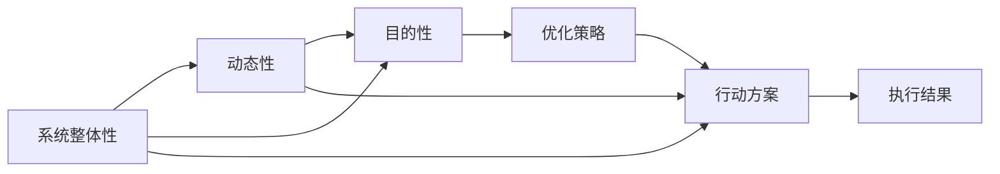

                 

## 1. 背景介绍

### 1.1 问题由来
在快速变化和高度竞争的现代商业环境中，管理者需要具备多种技能和知识才能成功地领导团队和实现目标。而在这些技能中，拥有一个体系化、结构化的思维能力，成为越来越受到重视的关键技能。所谓的体系思维，是指能够从整体角度出发，识别系统中的各个组成部分，理解它们之间的关系和相互作用，从而找到系统优化和改进的最佳路径。

### 1.2 问题核心关键点
体系思维的核心在于能够构建一个结构化的框架，用以指导决策和行动。在这个框架中，不同要素之间是相互关联的，某一要素的改变可能影响到整个系统。这要求管理者不仅要关注单个任务的完成，还要对整体系统有深刻的理解。

### 1.3 问题研究意义
理解并掌握体系思维，对于提高管理效率、优化决策过程、增强团队协作能力具有重要意义。体系思维使管理者能够在复杂多变的环境中，更好地识别问题和机会，制定科学有效的策略，推动组织持续发展。

## 2. 核心概念与联系

### 2.1 核心概念概述

体系思维（Systems Thinking）指的是从整体和系统视角审视问题，理解不同要素之间的相互依赖和影响。它强调从全局和长远角度出发，综合考虑多因素，找出最优解决方案。

**体系思维的三个核心要素**：
1. **系统整体性**：理解系统的各个部分如何相互作用，构成整体。
2. **动态性**：认识到系统是不断变化的，理解变化的驱动因素和结果。
3. **目的性**：明确系统的目标和价值，理解不同部分对系统目标的贡献和影响。

### 2.2 核心概念之间的联系

通过Mermaid流程图展示体系思维的三大要素及其相互关系：



此图展示了体系思维的三大要素如何相互作用，共同推动系统优化和改进。

## 3. 核心算法原理 & 具体操作步骤

### 3.1 算法原理概述
体系思维的算法原理可以从以下几个方面理解：

1. **系统建模**：建立系统的模型，包括系统组件、变量、流程、输入和输出等要素。
2. **系统分析**：对系统进行结构分析，理解各个要素之间的依赖关系和影响路径。
3. **系统仿真**：通过仿真和模拟，预测系统在不同情境下的表现，识别潜在问题。
4. **系统优化**：基于仿真结果和分析，制定改进方案，进行系统优化。

### 3.2 算法步骤详解

#### 3.2.1 系统建模
系统建模是体系思维的第一步，也是最关键的一步。具体步骤如下：

1. **确定系统边界**：明确系统包含的所有要素和外部环境。
2. **分解系统**：将系统拆分为多个子系统或组件，每个组件有其特定的功能。
3. **定义变量**：确定每个子系统中的关键变量，如输入、输出、状态等。
4. **建立连接**：明确各子系统之间、各变量之间的相互作用和影响关系。

#### 3.2.2 系统分析
系统分析旨在理解系统的结构、行为和动态。具体步骤如下：

1. **绘制系统图**：用图表或网络图形式展示系统的组成部分和相互关系。
2. **进行因果分析**：识别系统中各要素之间的因果关系，如因果链、反馈循环等。
3. **模拟系统行为**：使用仿真工具模拟系统在不同输入条件下的行为，理解系统响应。

#### 3.2.3 系统仿真
系统仿真可以帮助管理者理解系统的行为和变化，识别潜在问题和改进空间。具体步骤如下：

1. **设定仿真场景**：定义仿真所需的环境和参数。
2. **运行仿真**：启动仿真程序，观察系统在不同场景下的行为表现。
3. **分析结果**：提取仿真结果中的关键指标和数据，进行分析和评估。

#### 3.2.4 系统优化
系统优化是基于系统分析和仿真结果，提出优化方案和行动计划。具体步骤如下：

1. **识别问题**：根据仿真结果，识别系统中的瓶颈、异常或需要改进的部分。
2. **制定策略**：制定改进策略，如调整参数、修改流程等。
3. **实施方案**：实施改进方案，观察系统性能变化。
4. **反馈调整**：根据实施结果，不断调整优化方案，直至达到预期效果。

### 3.3 算法优缺点
体系思维的优点包括：
1. **全局视角**：能够从整体和系统层面考虑问题，避免局部最优解。
2. **系统性思考**：识别系统各部分之间的依赖关系，找到根本原因。
3. **动态适应**：理解系统动态变化，制定长远规划。

缺点包括：
1. **复杂性高**：系统建模和分析需要较多时间和资源。
2. **知识要求高**：需要深入理解系统和相关领域的知识。
3. **实施难度大**：系统优化往往需要多部门协作，协调复杂。

### 3.4 算法应用领域
体系思维在多个领域有广泛应用，包括但不限于：

1. **项目管理**：优化项目流程，提高项目执行效率。
2. **供应链管理**：优化供应链结构，降低成本，提升效率。
3. **人力资源管理**：优化员工配置，提升团队绩效。
4. **产品开发**：优化产品设计，提升市场竞争力。
5. **财务规划**：优化资金分配，提高投资回报率。

## 4. 数学模型和公式 & 详细讲解 & 举例说明

### 4.1 数学模型构建
体系思维的数学模型可以构建为因果图（Causal Graph），其核心要素包括：

1. **节点（Node）**：表示系统中的各个部分或变量。
2. **箭头（Edge）**：表示节点之间的因果关系。
3. **反馈环（Feedback Loop）**：表示节点之间的反馈关系。

### 4.2 公式推导过程

#### 4.2.1 因果图表示
使用因果图表示系统各要素之间的关系，示例如下：

```graph
graph LR
    A --> B --> C
    A --> D --> E
    B --> F
    C --> G --> H
    D --> I
```

此图表示了三个节点（A、B、C）和四个箭头（A->B、A->D、B->F、C->G），以及一个反馈环（B->F->G->H）。

#### 4.2.2 公式化表达
以因果图为基础，可以将其转化为数学公式进行推导。假设系统中有三个节点A、B、C，分别表示输入、过程和输出，则其因果关系可以表达为：

$$ Y = f(X) + e $$

其中：
- $X$ 表示输入变量，
- $f$ 表示过程函数，
- $Y$ 表示输出变量，
- $e$ 表示随机噪声。

### 4.3 案例分析与讲解
以一个简单的供应链管理案例进行分析：

#### 4.3.1 系统建模
系统包含供应商、生产、销售、库存四个子系统，变量包括订单数量、生产量、库存量等。

#### 4.3.2 系统分析
绘制系统图，识别各要素之间的因果关系，如订单量影响生产量，库存量影响订单量等。

#### 4.3.3 系统仿真
设定不同的订单量，仿真系统在不同订单量下的库存量和生产量变化，分析结果。

#### 4.3.4 系统优化
根据仿真结果，提出优化策略，如增加缓冲库存、优化生产计划等。

## 5. 项目实践：代码实例和详细解释说明

### 5.1 开发环境搭建
使用Python和SimPy库进行仿真实验。

1. **安装Python**：
   ```bash
   conda install python=3.8
   ```

2. **安装SimPy**：
   ```bash
   pip install simpy
   ```

### 5.2 源代码详细实现

#### 5.2.1 系统建模代码

```python
import simpy
import random

class Supplier:
    def __init__(self, env):
        self.env = env
        self.supply = 100

    def supply(self):
        while True:
            yield self.env.timeout(random.uniform(0, 1))
            self.supply += 1
            print("Supplier supply:", self.supply)

class Factory:
    def __init__(self, env):
        self.env = env

    def produce(self, demand):
        while True:
            yield self.env.timeout(random.uniform(0, 1))
            print("Factory production:", demand)

class Warehouse:
    def __init__(self, env, demand):
        self.env = env
        self.stock = 0
        self.demand = demand

    def restock(self):
        while True:
            yield self.env.timeout(random.uniform(0, 1))
            self.stock += 1
            print("Warehouse stock:", self.stock)

class Retailer:
    def __init__(self, env, warehouse):
        self.env = env
        self.stock = 0
        self.warehouse = warehouse

    def sell(self):
        while True:
            yield self.env.timeout(random.uniform(0, 1))
            if self.stock > 0:
                self.stock -= 1
                print("Retailer sale:", self.stock)
            else:
                self.stock = 0

def simulation(env):
    supply = Supplier(env)
    factory = Factory(env)
    warehouse = Warehouse(env, 20)
    retailer = Retailer(env, warehouse)

    env.process(supply.supply())
    env.process(factory.produce(10))
    env.process(warehouse.restock())
    env.process(retailer.sell())

    env.run(until=100)

if __name__ == '__main__':
    env = simpy.Environment()
    simulation(env)
```

### 5.3 代码解读与分析
上述代码实现了一个简单的供应链管理模拟系统，包含供应商、工厂、仓库和零售商四个部分，通过SimPy库进行仿真。

#### 5.3.1 系统分析
通过观察系统输出，分析各部分的性能表现，如供应商供应速度、工厂生产速度、仓库库存量、零售商销售量等。

#### 5.3.2 系统仿真
设定不同的供应速率和需求量，观察系统在不同条件下的表现，找出影响系统性能的关键因素。

#### 5.3.3 系统优化
根据仿真结果，提出优化方案，如增加供应商供应速率、优化工厂生产计划、调整仓库缓冲库存等。

### 5.4 运行结果展示
运行仿真代码，输出系统各部分的性能数据，分析结果，提出优化策略。

```bash
$ python simulation.py
Supplier supply: 1
Supplier supply: 2
Supplier supply: 3
Factory production: 10
Warehouse stock: 1
Retailer sale: 1
Supplier supply: 4
Supplier supply: 5
Supplier supply: 6
Factory production: 10
Warehouse stock: 2
Retailer sale: 0
Warehouse stock: 1
Supplier supply: 7
Supplier supply: 8
Supplier supply: 9
Factory production: 10
Warehouse stock: 2
Retailer sale: 1
...
```

## 6. 实际应用场景

### 6.4 未来应用展望
体系思维在未来的应用将更加广泛和深入，具体展望如下：

1. **大数据分析**：利用体系思维分析大数据，理解业务和市场变化，制定应对策略。
2. **人工智能**：结合人工智能技术，优化系统流程，提高决策效率。
3. **可持续发展**：应用体系思维，优化资源配置，实现可持续发展目标。
4. **智能城市**：构建智能城市系统，提高城市管理效率和居民生活质量。
5. **健康管理**：优化医疗资源分配，提高公共卫生水平。

## 7. 工具和资源推荐

### 7.1 学习资源推荐
为了帮助管理者掌握体系思维，以下是一些推荐的资源：

1. **书籍**：《系统思维：构建组织竞争力》（Tomas M. Copeland, Robert G. Pitel）
2. **课程**：《系统思维与管理》（Coursera）
3. **论文**：《System Dynamics in Management Science》（J.D. Sterman）

### 7.2 开发工具推荐
以下是一些用于系统建模和仿真的工具：

1. **SimPy**：用于仿真系统的Python库。
2. **AnyLogic**：用于建模和仿真的商业软件。
3. **NetLogo**：用于建模和仿真的开放平台。

### 7.3 相关论文推荐
以下是几篇关于体系思维和系统建模的经典论文：

1. **《System Dynamics: Principles and Applications》**（J.D. Sterman）
2. **《Systems Thinking for a Sustainable Future》**（Homer-D同盟）
3. **《The Dynamics of Complex Systems: A Primer》**（Michael C. Gilbert, Thomas R. Sewell）

## 8. 总结：未来发展趋势与挑战

### 8.1 研究成果总结
本文详细介绍了体系思维的原理、步骤和应用，通过仿真示例展示了其具体实现和效果。体系思维已成为现代管理中的重要工具，具有广泛的应用前景。

### 8.2 未来发展趋势
未来，体系思维将与大数据、人工智能等技术深度融合，成为更强大的管理工具。具体趋势如下：

1. **智能化提升**：结合AI技术，优化系统决策，提升管理效率。
2. **多领域应用**：扩展到更多行业和领域，如医疗、金融、教育等。
3. **数据驱动**：利用大数据，分析系统动态变化，优化决策过程。
4. **持续优化**：实现持续改进，动态适应环境变化。

### 8.3 面临的挑战
体系思维在应用过程中也面临一些挑战：

1. **知识要求高**：需要管理者具备系统思维和相关领域知识。
2. **复杂性高**：系统建模和仿真复杂，需要多学科合作。
3. **实施难度大**：需要跨部门协作，协调难度大。

### 8.4 研究展望
未来，体系思维的研究将关注以下几个方向：

1. **模型自动化**：开发自动化工具，简化建模过程。
2. **多模态建模**：结合多种数据源，提高系统建模精度。
3. **动态优化**：实现系统动态优化，提升决策灵活性。
4. **模型验证**：建立模型验证机制，提高模型可靠性。

## 9. 附录：常见问题与解答

**Q1：如何系统性地构建一个体系思维模型？**

A: 系统性地构建体系思维模型需要遵循以下步骤：
1. **定义系统边界**：明确系统的范围和要素。
2. **分解系统**：将系统拆分为多个子系统，每个子系统有其特定功能。
3. **定义变量**：确定各子系统中的关键变量，如输入、输出、状态等。
4. **建立连接**：明确各子系统之间、各变量之间的相互作用和影响关系。
5. **模拟仿真**：使用仿真工具模拟系统在不同情境下的表现，分析结果。

**Q2：体系思维在项目管理中有哪些应用？**

A: 体系思维在项目管理中的应用包括：
1. **项目规划**：理解项目各组成部分的关系，制定科学的计划。
2. **资源配置**：优化资源配置，提高项目执行效率。
3. **风险管理**：识别和评估项目风险，制定应对策略。
4. **绩效评估**：建立绩效指标，评估项目进展和效果。

**Q3：体系思维在供应链管理中有哪些具体应用？**

A: 体系思维在供应链管理中的应用包括：
1. **需求预测**：理解需求与生产、库存的关系，优化需求预测。
2. **库存管理**：优化库存水平，降低库存成本。
3. **运输优化**：优化运输路线和方式，提高物流效率。
4. **成本控制**：识别供应链中的瓶颈和浪费，降低成本。

**Q4：如何有效应用体系思维进行系统优化？**

A: 有效应用体系思维进行系统优化的关键在于：
1. **深入分析**：理解系统的结构和动态变化。
2. **数据驱动**：利用大数据分析系统行为，识别问题。
3. **制定策略**：基于分析结果，制定优化方案。
4. **持续改进**：根据实施效果，不断调整优化策略。

总之，体系思维是一种系统化的管理工具，需要管理者在实践中不断探索和应用，才能发挥其最大效用。通过深入理解系统各部分的关系和影响，管理者可以更好地制定决策，提升管理效果，推动组织持续发展。

