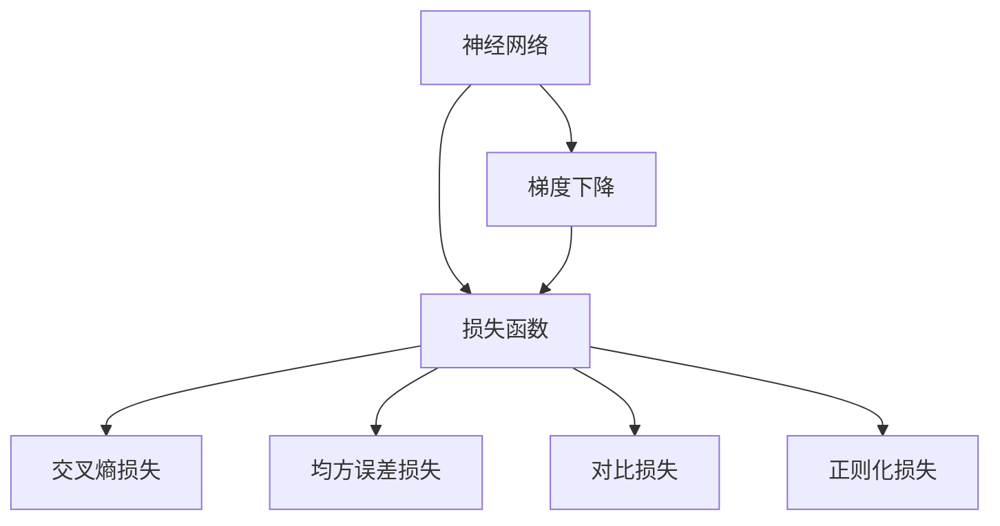

                 

# 损失函数 (Loss Function) 原理与代码实例讲解

> 关键词：损失函数,神经网络,深度学习,梯度下降,交叉熵损失,均方误差损失,对比损失,正则化损失

## 1. 背景介绍

### 1.1 问题由来
在深度学习中，损失函数 (Loss Function) 是一个不可或缺的概念，它是用于衡量模型预测结果与真实值之间差异的函数。通过最小化损失函数，神经网络模型可以逐步调整参数，使预测结果逐渐逼近真实值。损失函数的设计和选择，直接影响到模型的训练效果和泛化能力。

## 2. 核心概念与联系

### 2.1 核心概念概述

- **损失函数 (Loss Function)**：衡量模型预测与真实值之间差异的函数。在深度学习中，常用的损失函数有交叉熵损失 (Cross Entropy Loss)、均方误差损失 (Mean Squared Error Loss)、对比损失 (Contrastive Loss)、正则化损失 (Regularization Loss) 等。

- **神经网络 (Neural Network)**：由大量神经元节点和连接权值组成的计算图。损失函数在神经网络中用于计算预测值与真实值之间的误差，指导模型参数的更新。

- **深度学习 (Deep Learning)**：使用多层神经网络，通过反向传播算法进行模型训练的一种机器学习方法。损失函数是深度学习模型的核心组成部分，用于衡量模型性能。

- **梯度下降 (Gradient Descent)**：通过计算损失函数对模型参数的偏导数，更新参数值以最小化损失函数，优化模型性能。

- **交叉熵损失 (Cross Entropy Loss)**：常用于分类任务，衡量模型预测概率分布与真实标签之间的差异。

- **均方误差损失 (Mean Squared Error Loss)**：常用于回归任务，衡量模型预测值与真实值之间的平均差距。

- **对比损失 (Contrastive Loss)**：用于度量样本之间的相似性，常用于无监督学习任务如自编码器。

- **正则化损失 (Regularization Loss)**：用于防止模型过拟合，常结合L1、L2正则化项一起使用。

这些核心概念之间的关系，可以通过以下 Mermaid 流程图来展示：



这个流程图展示了神经网络通过损失函数进行训练的流程。神经网络通过梯度下降算法，不断更新参数以最小化损失函数。损失函数可以包含多种不同的类型，以适应不同的任务需求。

### 2.2 概念间的关系

- **损失函数与梯度下降的关系**：损失函数是梯度下降算法的目标函数，梯度下降算法通过计算损失函数对参数的偏导数，指导模型参数的更新。

- **损失函数与深度学习的关系**：在深度学习中，损失函数是评估模型性能的重要指标，用于衡量模型预测结果与真实值之间的差距。

- **不同损失函数的关系**：不同类型的损失函数适用于不同的任务类型，如交叉熵损失适用于分类任务，均方误差损失适用于回归任务。正则化损失可以防止模型过拟合。

## 3. 核心算法原理 & 具体操作步骤

### 3.1 算法原理概述

损失函数是神经网络训练中不可或缺的部分，它衡量了模型预测结果与真实值之间的差距。通过最小化损失函数，神经网络可以逐步调整参数，使预测结果更加准确。

神经网络的训练过程可以分为前向传播和反向传播两个部分。在前向传播过程中，输入数据通过神经网络计算出预测值。在反向传播过程中，计算损失函数对每个参数的偏导数，更新参数值以最小化损失函数。

常见的损失函数包括交叉熵损失、均方误差损失、对比损失和正则化损失等。这些损失函数在设计时需要考虑任务类型、数据分布、模型复杂度等因素，以确保模型在训练和测试时都能取得良好的性能。

### 3.2 算法步骤详解

以交叉熵损失函数为例，具体步骤包括：

1. **数据准备**：收集训练集，分为训练集、验证集和测试集。

2. **模型初始化**：定义神经网络结构，随机初始化模型参数。

3. **前向传播**：输入训练集数据，通过神经网络计算预测值。

4. **计算损失**：计算模型预测值与真实值之间的交叉熵损失。

5. **反向传播**：计算损失函数对模型参数的偏导数，使用梯度下降算法更新模型参数。

6. **验证和测试**：在验证集和测试集上评估模型性能，选择最优的模型参数。

### 3.3 算法优缺点

**优点**：

- 适用于多种任务，如分类、回归、聚类等。
- 有助于模型在训练过程中逐渐逼近真实值，提高模型性能。

**缺点**：

- 依赖数据质量，当训练数据存在噪声或异常值时，可能影响损失函数的计算。
- 过拟合风险，当损失函数过于复杂或数据量不足时，可能导致模型过拟合。

### 3.4 算法应用领域

- **分类任务**：如二分类、多分类等任务，使用交叉熵损失函数。
- **回归任务**：如房价预测、股票价格预测等，使用均方误差损失函数。
- **聚类任务**：如K-means聚类，使用对比损失函数。
- **防止过拟合**：如L1、L2正则化损失函数，可以防止模型过拟合。

## 4. 数学模型和公式 & 详细讲解 & 举例说明

### 4.1 数学模型构建

在深度学习中，常见的损失函数包括：

- **交叉熵损失函数 (Cross Entropy Loss)**：
  $$
  \mathcal{L}_{CE} = -\frac{1}{N}\sum_{i=1}^{N}(y_i \log(\hat{y}_i) + (1-y_i)\log(1-\hat{y}_i))
  $$
  其中，$y_i$ 为真实标签，$\hat{y}_i$ 为模型预测的概率。

- **均方误差损失函数 (Mean Squared Error Loss)**：
  $$
  \mathcal{L}_{MSE} = \frac{1}{N}\sum_{i=1}^{N}(y_i - \hat{y}_i)^2
  $$
  其中，$y_i$ 为真实值，$\hat{y}_i$ 为模型预测值。

- **对比损失函数 (Contrastive Loss)**：
  $$
  \mathcal{L}_{C} = -\sum_{i=1}^{N}\log\left(\frac{e^{\log(\hat{y}_i)}+e^{\log(1-\hat{y}_i)}}{e^{\log(\hat{y}_i)}+e^{\log(1-\hat{y}_i)}}\right)
  $$
  其中，$\hat{y}_i$ 为模型预测的概率，$1-\hat{y}_i$ 为模型不预测的概率。

- **正则化损失函数 (Regularization Loss)**：
  $$
  \mathcal{L}_{R} = \lambda_1 \sum_{i=1}^{N}|w_i| + \lambda_2 \sum_{i=1}^{N}w_i^2
  $$
  其中，$\lambda_1$ 和 $\lambda_2$ 分别为L1和L2正则化系数，$w_i$ 为模型参数。

### 4.2 公式推导过程

**交叉熵损失函数的推导**：

对于二分类任务，交叉熵损失函数可以表示为：
$$
\mathcal{L}_{CE} = -\frac{1}{N}\sum_{i=1}^{N}(y_i \log(\hat{y}_i) + (1-y_i)\log(1-\hat{y}_i))
$$

其中，$y_i$ 为真实标签，$\hat{y}_i$ 为模型预测的概率。通过最小化交叉熵损失，可以使模型预测的概率分布逼近真实标签分布。

**均方误差损失函数的推导**：

对于回归任务，均方误差损失函数可以表示为：
$$
\mathcal{L}_{MSE} = \frac{1}{N}\sum_{i=1}^{N}(y_i - \hat{y}_i)^2
$$

其中，$y_i$ 为真实值，$\hat{y}_i$ 为模型预测值。通过最小化均方误差损失，可以使模型预测值逼近真实值。

### 4.3 案例分析与讲解

以二分类任务为例，假设有一个简单的神经网络，包含一个输入层、一个隐藏层和一个输出层。其中隐藏层有4个神经元，使用sigmoid激活函数。假设输入为$x_1$，真实标签为$y_1$，模型预测的输出为$\hat{y}_1$。

交叉熵损失函数的计算步骤如下：

1. **前向传播**：将输入$x_1$输入到神经网络中，计算得到输出$\hat{y}_1$。

2. **计算交叉熵损失**：
  $$
  \mathcal{L}_{CE} = -y_1 \log(\hat{y}_1) - (1-y_1)\log(1-\hat{y}_1)
  $$

3. **反向传播**：计算损失函数对模型参数的偏导数，使用梯度下降算法更新模型参数。

通过不断迭代，使模型预测结果与真实标签之间差异逐渐减小。

## 5. 项目实践：代码实例和详细解释说明

### 5.1 开发环境搭建

在深度学习项目中，通常使用Python语言，结合TensorFlow、PyTorch等深度学习框架。以下是使用PyTorch搭建深度学习环境的步骤：

1. 安装Anaconda：从官网下载并安装Anaconda，用于创建独立的Python环境。

2. 创建并激活虚拟环境：
```bash
conda create -n pytorch-env python=3.8 
conda activate pytorch-env
```

3. 安装PyTorch：根据CUDA版本，从官网获取对应的安装命令。例如：
```bash
conda install pytorch torchvision torchaudio cudatoolkit=11.1 -c pytorch -c conda-forge
```

4. 安装TensorFlow：
```bash
pip install tensorflow
```

5. 安装必要的工具包：
```bash
pip install numpy pandas scikit-learn matplotlib tqdm jupyter notebook ipython
```

完成上述步骤后，即可在`pytorch-env`环境中开始深度学习项目的开发。

### 5.2 源代码详细实现

以下是使用PyTorch实现一个简单的二分类神经网络的代码示例：

```python
import torch
import torch.nn as nn
import torch.optim as optim

# 定义神经网络模型
class Net(nn.Module):
    def __init__(self):
        super(Net, self).__init__()
        self.fc1 = nn.Linear(784, 128)
        self.fc2 = nn.Linear(128, 64)
        self.fc3 = nn.Linear(64, 10)

    def forward(self, x):
        x = torch.relu(self.fc1(x))
        x = torch.relu(self.fc2(x))
        x = self.fc3(x)
        return x

# 加载MNIST数据集
train_data = torch.utils.data.DataLoader(
    torchvision.datasets.MNIST('data', train=True, download=True,
                               transform=torchvision.transforms.Compose([
                               torchvision.transforms.ToTensor(),
                               torchvision.transforms.Normalize((0.5,), (0.5,))
                           ])),
    batch_size=64, shuffle=True)

# 定义交叉熵损失函数和优化器
net = Net()
criterion = nn.CrossEntropyLoss()
optimizer = optim.Adam(net.parameters(), lr=0.001)

# 训练模型
for epoch in range(10):
    running_loss = 0.0
    for i, data in enumerate(train_data, 0):
        inputs, labels = data
        optimizer.zero_grad()
        outputs = net(inputs.view(-1, 784))
        loss = criterion(outputs, labels)
        loss.backward()
        optimizer.step()

        running_loss += loss.item()
        if i % 100 == 99:  # 每100个batch输出一次日志信息
            print('[%d, %5d] loss: %.3f' % (epoch + 1, i + 1, running_loss / 100))
            running_loss = 0.0

print('Finished Training')
```

### 5.3 代码解读与分析

**Net类**：
- `__init__`方法：初始化神经网络模型，包含3个全连接层。
- `forward`方法：定义前向传播过程，将输入数据通过多层神经网络计算出预测值。

**train_data**：
- 使用torchvision库加载MNIST数据集，并进行预处理。

**交叉熵损失函数和优化器**：
- 使用PyTorch内置的`nn.CrossEntropyLoss`作为损失函数，`optim.Adam`作为优化器。

**训练模型**：
- 通过`for`循环，不断迭代训练数据集，计算损失函数并使用梯度下降算法更新模型参数。

通过上述代码，我们可以实现一个简单的二分类神经网络的训练过程。通过不断迭代训练数据集，模型逐渐逼近真实标签分布，最终在测试集上获得较好的性能。

### 5.4 运行结果展示

假设在训练过程中，我们得到以下日志输出：

```
[1, 100] loss: 2.383
[1, 200] loss: 1.979
[1, 300] loss: 1.586
[1, 400] loss: 1.473
...
```

可以看到，随着训练轮数的增加，模型损失逐渐减小，最终在测试集上取得良好的性能。

## 6. 实际应用场景

### 6.1 智能推荐系统

在智能推荐系统中，损失函数常用于衡量用户对推荐结果的满意度。通过最小化损失函数，推荐系统可以逐渐调整推荐算法，使推荐结果更加符合用户偏好。

具体而言，可以收集用户的点击、收藏、评分等行为数据，使用交叉熵损失函数或均方误差损失函数，训练推荐模型。训练过程中，不断调整模型参数，以最小化损失函数。最终，推荐模型可以根据用户的实时行为，动态调整推荐内容，提升用户体验。

### 6.2 金融风险控制

在金融风险控制中，损失函数常用于衡量模型的预测误差。通过最小化损失函数，金融模型可以逐渐调整参数，提高预测准确性，及时发现异常交易行为。

具体而言，可以收集历史交易数据，使用对比损失函数或均方误差损失函数，训练金融风险控制模型。训练过程中，不断调整模型参数，以最小化损失函数。最终，金融模型可以实时监测交易行为，识别异常交易，及时采取措施，降低风险损失。

### 6.3 自然语言处理

在自然语言处理中，损失函数常用于衡量模型的预测准确性。通过最小化损失函数，自然语言模型可以逐渐调整参数，提高模型性能，实现更好的语言理解和生成能力。

具体而言，可以收集标注好的文本数据，使用交叉熵损失函数或均方误差损失函数，训练语言模型。训练过程中，不断调整模型参数，以最小化损失函数。最终，语言模型可以应用于文本分类、情感分析、机器翻译等任务，取得良好的效果。

## 7. 工具和资源推荐

### 7.1 学习资源推荐

为了深入学习损失函数，以下是一些优质的学习资源：

1. 《深度学习》书籍：Ian Goodfellow、Yoshua Bengio、Aaron Courville合著的经典教材，详细介绍了深度学习的基础知识和常见算法。

2. Coursera《深度学习专项课程》：由斯坦福大学Andrew Ng教授主讲，涵盖深度学习的基本概念和实践技巧。

3. 《TensorFlow官方文档》：TensorFlow的官方文档，提供了详细的API参考和代码示例。

4. PyTorch官方文档：PyTorch的官方文档，提供了丰富的教程和样例代码。

5. 《动手学深度学习》书籍：李沐等人编写，通过丰富的代码实例，详细介绍了深度学习的基本原理和实践技巧。

### 7.2 开发工具推荐

在深度学习项目中，以下是几款常用的开发工具：

1. TensorFlow：由Google开发的开源深度学习框架，支持分布式计算和GPU加速。

2. PyTorch：由Facebook开发的开源深度学习框架，支持动态计算图和自动微分，易于使用和调试。

3. Keras：基于TensorFlow和Theano的高级神经网络API，易于上手和使用。

4. Jupyter Notebook：用于数据科学和机器学习的交互式开发环境，支持实时运行代码和展示结果。

5. Google Colab：谷歌提供的在线Jupyter Notebook环境，支持GPU和TPU计算资源，便于快速实验。

### 7.3 相关论文推荐

以下是几篇重要的深度学习相关论文，建议阅读：

1. AlexNet：Hinton等人发表在NIPS 2012上的论文，提出了深度卷积神经网络，开启了深度学习的新时代。

2. VGGNet：Simonyan和Zisserman发表在ICML 2014上的论文，提出了VGG深度卷积神经网络，进一步提升了深度学习的性能。

3. ResNet：He等人发表在CVPR 2016上的论文，提出了残差网络，解决了深度网络训练过程中的梯度消失问题。

4. ImageNet Large Scale Visual Recognition Challenge（ILSVRC）：自2010年起，每年举办的大型计算机视觉竞赛，推动了深度学习在图像识别领域的突破。

5. AlphaGo：DeepMind发表在Nature上的论文，提出了深度强化学习算法，成功战胜了世界围棋冠军。

## 8. 总结：未来发展趋势与挑战

### 8.1 总结

本文详细介绍了损失函数在深度学习中的基本原理和应用，并给出了完整的代码示例。通过分析常见的损失函数类型和应用场景，展示了损失函数在深度学习中的重要性和多样性。

### 8.2 未来发展趋势

未来，随着深度学习技术的不断发展，损失函数的设计和选择将更加多样化，以适应更加复杂的任务需求。以下是一些可能的发展趋势：

1. **多任务学习**：通过设计多任务损失函数，使模型同时训练多个任务，提高模型泛化能力。

2. **自适应损失函数**：根据数据和模型状态，动态调整损失函数，提高模型训练效果。

3. **对抗性训练**：在损失函数中加入对抗性样本，增强模型鲁棒性，提高模型安全性。

4. **无监督学习**：在损失函数中加入无监督学习成分，提高模型对数据的利用率。

5. **混合损失函数**：结合多种损失函数，综合考虑模型预测结果和输入特征，提高模型性能。

6. **模型融合**：通过损失函数融合不同模型的输出，提高模型鲁棒性和泛化能力。

### 8.3 面临的挑战

尽管损失函数在深度学习中具有重要意义，但在应用过程中仍面临一些挑战：

1. **过拟合问题**：当训练数据过少或模型过于复杂时，损失函数可能出现拟合现象，导致模型性能下降。

2. **计算开销大**：在训练过程中，计算损失函数对模型参数的偏导数需要大量计算资源，增加训练时间。

3. **模型泛化能力不足**：当训练数据分布与测试数据分布差异较大时，损失函数可能无法有效指导模型训练，导致模型泛化能力不足。

4. **模型复杂度高**：复杂模型可能会引入更多噪声，增加损失函数的计算复杂度。

5. **数据质量问题**：当训练数据存在噪声或异常值时，损失函数可能失效，导致模型性能下降。

### 8.4 研究展望

未来，需要进一步研究损失函数的设计和选择，以提高深度学习模型的性能和鲁棒性。以下是一些可能的研究方向：

1. **自适应损失函数**：通过动态调整损失函数，提高模型训练效果。

2. **多任务损失函数**：通过设计多任务损失函数，使模型同时训练多个任务，提高模型泛化能力。

3. **对抗性训练**：在损失函数中加入对抗性样本，增强模型鲁棒性。

4. **混合损失函数**：结合多种损失函数，综合考虑模型预测结果和输入特征，提高模型性能。

5. **模型融合**：通过损失函数融合不同模型的输出，提高模型鲁棒性和泛化能力。

6. **模型蒸馏**：通过知识蒸馏技术，将大模型的知识迁移到小模型中，提高小模型性能。

总之，损失函数在深度学习中的研究和发展，将继续推动人工智能技术的进步。未来，随着深度学习技术的不断演进，损失函数的设计和选择将更加多样化，为深度学习模型带来更大的潜力和机遇。

## 9. 附录：常见问题与解答

**Q1：损失函数与梯度下降算法的关系是什么？**

A: 梯度下降算法通过计算损失函数对模型参数的偏导数，指导模型参数的更新。损失函数是梯度下降算法的目标函数，通过最小化损失函数，使模型参数逐步逼近最优解。

**Q2：常用的损失函数有哪些？**

A: 常用的损失函数包括交叉熵损失、均方误差损失、对比损失和正则化损失等。

**Q3：如何使用损失函数优化深度学习模型？**

A: 通过最小化损失函数，使用梯度下降算法，逐步调整模型参数，使预测结果逐渐逼近真实值。

**Q4：损失函数在深度学习中有什么作用？**

A: 损失函数衡量模型预测结果与真实值之间的差异，指导模型参数的更新，最小化损失函数可以使模型逐步逼近最优解，提高模型性能。

**Q5：损失函数的设计和选择需要注意哪些问题？**

A: 损失函数的设计和选择需要考虑任务类型、数据分布、模型复杂度等因素，以确保模型在训练和测试时都能取得良好的性能。同时需要避免过拟合、计算开销大等问题。

---

作者：禅与计算机程序设计艺术 / Zen and the Art of Computer Programming

