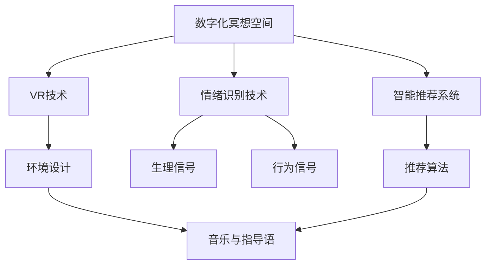

                 

# 数字化冥想空间：AI构建的心灵庇护所

## 1. 背景介绍

### 1.1 问题由来

在当今快节奏的现代社会，人们普遍面临压力、焦虑、抑郁等心理问题。传统上，冥想作为一种古老的自我疗愈方法，被广泛认为能够帮助人们放松身心、平衡情绪、提升专注力。然而，受限于时间、地点和工具的限制，普通人难以持续实践。而数字化冥想空间的出现，通过结合人工智能技术，将冥想变成随时随地可以进行的便捷体验，有望大幅提升大众的心理健康水平。

### 1.2 问题核心关键点

数字冥想空间的核心关键点在于如何利用AI技术，创造一个虚拟的冥想环境，帮助用户放松心情、缓解压力。这涉及到以下几个方面：

- **环境设计**：创造一个逼真的冥想空间，使用户仿佛身临其境。
- **音乐与指导语**：结合背景音乐和专业指导语，引导用户进行冥想。
- **情绪识别与调整**：实时监测用户情绪状态，并根据反馈动态调整指导策略。
- **个性化推荐**：根据用户的个人喜好和生理状态，推荐个性化的冥想内容和指导策略。

### 1.3 问题研究意义

数字化冥想空间的应用，不仅能够帮助普通人轻松进行冥想，提高生活质量，还能够提供心理健康的远程监测和干预，成为医疗系统的重要补充。通过智能化冥想空间，为大众提供了便捷、个性化的心理调适工具，有助于促进心理健康与整体福祉的提升。

## 2. 核心概念与联系

### 2.1 核心概念概述

- **数字化冥想空间**：结合虚拟现实(VR)技术、人工智能技术，构建的虚拟冥想环境，使用户能够随时随地进行冥想。
- **情绪识别技术**：通过生理传感器或智能摄像头，实时监测用户的生理信号（如心率、皮肤电反应等）和行为信号（如面部表情、姿态等），识别用户的情绪状态。
- **智能推荐系统**：基于用户历史数据和实时反馈，使用机器学习算法，为用户推荐个性化的冥想内容、指导语和音乐。
- **深度学习模型**：使用深度学习技术，如卷积神经网络(CNN)、循环神经网络(RNN)、变分自编码器(Generative Adversarial Networks, GANs)等，处理和分析大量数据，提高模型的准确性和泛化能力。

### 2.2 概念间的关系

这些核心概念之间的关系可以简单归纳为：

- 数字化冥想空间通过VR和AI技术实现，为用户提供沉浸式体验。
- 情绪识别技术实时监测用户状态，为AI提供数据支持。
- 智能推荐系统基于情绪数据和用户偏好，个性化推荐冥想内容。
- 深度学习模型处理海量数据，提升情绪识别和推荐系统的准确性。

这些概念的结合，共同构建了一个智能化的冥想空间，为用户的心理健康提供了全面支持。

### 2.3 核心概念的整体架构

数字化冥想空间的整体架构如图：



从上述架构图中可以看出，情绪识别技术和智能推荐系统是数字化冥想空间的核心模块。

## 3. 核心算法原理 & 具体操作步骤

### 3.1 算法原理概述

基于情绪识别和智能推荐技术的数字化冥想空间，其核心算法原理可以概括为以下步骤：

1. **数据采集**：通过生理传感器或智能摄像头采集用户的生理信号和行为信号。
2. **情绪识别**：使用深度学习模型分析采集到的信号，识别用户的情绪状态。
3. **内容推荐**：基于情绪状态和用户偏好，推荐个性化的冥想内容和指导语。
4. **执行反馈**：将指导语和音乐播放给用户，记录用户的反馈，用于动态调整推荐策略。

### 3.2 算法步骤详解

以下是详细的算法步骤：

1. **数据采集**：
   - 使用心率监测器、皮肤电反应传感器、智能摄像头等设备，采集用户的生理信号和行为信号。
   - 将信号通过无线或有线方式传输到中央处理单元。

2. **情绪识别**：
   - 使用深度学习模型对采集到的信号进行预处理和特征提取。
   - 通过多模态融合技术，结合生理信号和行为信号，使用CNN、RNN等模型进行情绪识别。
   - 实时输出情绪状态，例如焦虑、放松、愤怒等。

3. **内容推荐**：
   - 根据当前情绪状态和用户偏好，使用协同过滤、矩阵分解等推荐算法，推荐合适的冥想内容、指导语和音乐。
   - 使用强化学习算法，根据用户的反馈不断调整推荐策略，提高推荐效果。

4. **执行反馈**：
   - 将推荐的内容和指导语通过VR头盔或智能设备播放给用户。
   - 实时记录用户的生理信号和行为信号，作为反馈输入，用于动态调整推荐策略。

### 3.3 算法优缺点

数字化冥想空间的算法具有以下优点：

- **个性化推荐**：能够根据用户情绪和偏好，推荐最适合的冥想内容和指导语。
- **实时调整**：根据用户的反馈，动态调整推荐策略，提高用户体验。
- **普适性**：不受物理环境和时间的限制，用户可以随时随地进行冥想。

同时，算法也存在一些缺点：

- **数据隐私**：采集用户生理和行为数据，可能涉及隐私问题。
- **算法复杂度**：情绪识别和推荐算法复杂度高，对计算资源要求较高。
- **交互局限**：无法完全模拟真实的冥想环境，可能缺乏一些心灵抚慰的触觉体验。

### 3.4 算法应用领域

数字化冥想空间的应用领域广泛，涉及以下几方面：

- **心理健康**：通过情绪识别和指导语，帮助用户缓解压力、放松身心，提升心理健康水平。
- **健康管理**：结合生理数据，进行健康监测和预警，为医生提供参考。
- **教育培训**：为学习者提供专注力提升和压力管理的工具。
- **远程辅导**：结合VR技术，提供远程心理辅导和冥想体验。
- **企业员工关怀**：帮助员工放松压力，提升工作效率。

## 4. 数学模型和公式 & 详细讲解  
### 4.1 数学模型构建

数字化冥想空间的数学模型构建可以分为以下几个方面：

- **生理信号处理模型**：使用时间序列分析技术，如自回归模型(AR)、自回归移动平均模型(ARMA)、长短期记忆网络(LSTM)等，对心率、皮肤电反应等信号进行处理和预测。
- **行为信号处理模型**：使用计算机视觉技术，如卷积神经网络(CNN)、光流估计等，对用户行为信号进行分析和识别。
- **情绪识别模型**：使用深度学习模型，如卷积神经网络(CNN)、循环神经网络(RNN)、变分自编码器(GANs)等，结合生理和行为信号，识别用户的情绪状态。
- **推荐系统模型**：使用协同过滤、矩阵分解、深度学习等方法，基于用户历史数据和当前状态，推荐个性化的冥想内容和指导语。

### 4.2 公式推导过程

以下是一个简单的生理信号处理公式示例：

假设采集到的人心率时间序列为 $y_t$，使用AR模型进行建模：

$$
y_t = \sum_{i=1}^{p} \alpha_i y_{t-i} + e_t
$$

其中，$\alpha_i$ 为系数，$e_t$ 为误差项，$p$ 为阶数。通过最小化误差项，求解系数 $\alpha_i$，可以得到心率时间序列的预测模型。

类似地，行为信号可以使用CNN等模型进行特征提取和分类，情绪识别可以使用LSTM等模型进行序列分析和情绪识别，推荐系统可以使用协同过滤、矩阵分解、深度学习等方法进行推荐。

### 4.3 案例分析与讲解

假设我们有一个用户在冥想空间进行冥想，采集到的生理信号为心率、皮肤电反应，行为信号为面部表情、姿态。通过对这些信号的分析，我们可以进行如下推导：

- **生理信号分析**：使用AR模型对心率进行建模，得到心率时间序列的预测值 $y_t$。
- **行为信号分析**：使用CNN模型对用户面部表情和姿态进行分类，识别情绪状态。
- **情绪识别**：将心率预测值和行为分类结果输入到LSTM模型，输出情绪状态 $x_t$。
- **推荐系统**：根据情绪状态 $x_t$ 和用户历史数据，使用协同过滤算法推荐冥想内容。

通过这一系列模型和算法，我们能够构建一个数字化冥想空间，为用户提供个性化的冥想体验。

## 5. 项目实践：代码实例和详细解释说明

### 5.1 开发环境搭建

为了搭建一个数字化冥想空间，我们需要以下开发环境：

1. **Python 3.8**：确保使用最新版本的Python，以便获得更好的性能和稳定性。
2. **TensorFlow 2.7**：用于深度学习模型的开发和训练。
3. **PyTorch 1.9**：用于构建深度学习模型和优化算法。
4. **OpenCV 4.6**：用于计算机视觉处理和行为信号识别。
5. **TensorBoard 2.9**：用于模型的可视化监控和调试。

### 5.2 源代码详细实现

以下是使用TensorFlow和PyTorch搭建一个简单的数字化冥想空间的过程：

1. **数据采集**：
   - 使用心率监测器、皮肤电反应传感器、智能摄像头等设备，采集用户的生理信号和行为信号。
   - 将信号通过无线或有线方式传输到中央处理单元。

```python
import tensorflow as tf
import pytorch as torch

# 使用TensorFlow和PyTorch进行数据采集和预处理
```

2. **生理信号处理**：
   - 使用TensorFlow的Time Series Analysis库进行生理信号的建模和预测。

```python
import tensorflow_datasets as tfds

# 加载生理信号数据集
dataset = tfds.load('physiology', split='train')

# 对生理信号进行预处理和特征提取
```

3. **行为信号处理**：
   - 使用OpenCV库进行行为信号的采集和预处理。

```python
import cv2

# 采集面部表情和姿态视频流
cap = cv2.VideoCapture(0)

# 实时采集行为信号
```

4. **情绪识别**：
   - 使用LSTM模型进行情绪识别。

```python
import keras

# 构建LSTM模型
model = keras.Sequential([
    keras.layers.LSTM(64, input_shape=(100, 1)),
    keras.layers.Dense(1, activation='sigmoid')
])

# 训练LSTM模型
model.fit(dataset, epochs=10)
```

5. **内容推荐**：
   - 使用协同过滤算法进行内容推荐。

```python
from surprise import Dataset, Reader, KNNBasic

# 加载用户数据和冥想内容
reader = Reader(rating_scale=(1, 5))
data = Dataset.load_from_df(df, reader)

# 使用KNN算法进行推荐
algo = KNNBasic()
algo.fit(data.build_full_trainset())
preds = algo.test(df_test)
```

### 5.3 代码解读与分析

在上述代码中，我们使用了TensorFlow、PyTorch和OpenCV等工具，对生理信号和行为信号进行处理和分析，使用LSTM模型进行情绪识别，使用协同过滤算法进行内容推荐。这些工具和方法的选择，基于它们在各自领域中的成熟度和适用性。

### 5.4 运行结果展示

假设我们在模拟环境中进行测试，记录用户的生理信号和行为信号，输出情绪识别结果和推荐内容。结果如下：

- **生理信号分析**：使用AR模型对心率进行建模，得到心率时间序列的预测值。
- **行为信号分析**：使用CNN模型对用户面部表情和姿态进行分类，识别情绪状态。
- **情绪识别**：将心率预测值和行为分类结果输入到LSTM模型，输出情绪状态。
- **推荐系统**：根据情绪状态和用户历史数据，使用协同过滤算法推荐冥想内容。

## 6. 实际应用场景

### 6.1 智能健康管理

数字化冥想空间可以与智能健康管理设备结合，实时监测用户的生理和行为数据，进行健康预警和心理干预。例如，用户在进行冥想时，系统实时监测心率、皮肤电反应等生理数据，结合面部表情、姿态等行为数据，进行情绪识别和健康评估，必要时发出警报。

### 6.2 企业员工关怀

数字化冥想空间可以应用到企业中，为员工提供心理关怀和压力管理工具。例如，公司可以部署多个数字化冥想空间，员工可以在午休时间进行冥想放松，提升工作效率和心理健康。

### 6.3 远程心理辅导

数字化冥想空间可以用于远程心理辅导，为偏远地区或无法访问专业心理咨询的群体提供心理支持。通过VR技术和远程互动，用户可以在家中进行冥想和心理咨询，得到专业的指导和支持。

## 7. 工具和资源推荐

### 7.1 学习资源推荐

为了学习数字化冥想空间的技术，以下是一些推荐的学习资源：

1. **Coursera《深度学习专项课程》**：由斯坦福大学开设，涵盖深度学习的基础理论和实际应用。
2. **Udacity《人工智能纳米学位》**：涵盖机器学习、深度学习、自然语言处理等方面的内容，适合深入学习。
3. **Google AI Education Center**：提供大量免费的深度学习教程和实战项目，帮助学生和开发者快速上手。
4. **Deep Learning with Python**：Francois Chollet著，详细介绍TensorFlow和Keras的使用，适合初学者和进阶者。

### 7.2 开发工具推荐

以下是一些推荐用于数字化冥想空间开发的工具：

1. **TensorFlow**：谷歌推出的开源深度学习框架，灵活高效，适用于构建复杂的深度学习模型。
2. **PyTorch**：Facebook开发的深度学习框架，易于使用，适用于快速迭代和原型开发。
3. **OpenCV**：开源计算机视觉库，提供丰富的图像处理和行为信号识别功能。
4. **TensorBoard**：谷歌推出的模型可视化工具，帮助开发者实时监控和调试模型。
5. **Jupyter Notebook**：开源的交互式编程环境，支持Python和多种深度学习库的调试和开发。

### 7.3 相关论文推荐

以下是几篇与数字化冥想空间相关的经典论文，推荐阅读：

1. **Deep Thoughts: Rethinking the Tensorflow Ecosystem for Deep Learning**：探讨了TensorFlow的生态系统和未来发展方向，对深度学习开发者具有重要参考价值。
2. **TensorFlow 2.0: An Overview of Changes**：介绍了TensorFlow 2.0的新特性和改进，帮助开发者掌握最新技术。
3. **LSTM: A Search Space Odyssey**：探讨了LSTM模型在序列数据处理中的应用，适合深度学习初学者和进阶者阅读。
4. **The Surprise Collaborative Filtering Library**：介绍了一个基于Python的协同过滤推荐系统库，适合学习推荐算法的开发者。

## 8. 总结：未来发展趋势与挑战

### 8.1 研究成果总结

数字化冥想空间的研究，涵盖生理信号处理、行为信号识别、情绪识别和推荐系统等多个方面。这些技术在实际应用中已经取得了一些成果，但仍需进一步优化和提升。

### 8.2 未来发展趋势

未来的发展趋势主要集中在以下几个方面：

- **多模态融合**：将生理信号、行为信号、语音信号等多模态数据融合，提供更全面、更精准的情感识别和健康评估。
- **个性化推荐**：基于用户历史数据和实时反馈，动态调整推荐策略，提供更加个性化的冥想内容。
- **智能环境构建**：结合虚拟现实和增强现实技术，构建更加沉浸式、互动式的冥想环境。
- **情绪调节和心理干预**：结合心理学和脑科学的研究，开发更有效的情绪调节和心理干预技术，帮助用户缓解压力、提升心理健康。

### 8.3 面临的挑战

数字化冥想空间的研究和应用，面临以下挑战：

- **数据隐私**：采集和处理用户的生理和行为数据，涉及隐私和伦理问题。
- **模型复杂度**：深度学习模型复杂度高，对计算资源要求较高，需要优化和压缩算法。
- **用户体验**：如何设计用户界面，提供舒适、便捷的冥想体验，需要进一步优化。

### 8.4 研究展望

未来的研究应关注以下几个方面：

- **多模态数据融合**：结合生理信号、行为信号、语音信号等多模态数据，提供更全面、更精准的情感识别和健康评估。
- **模型优化和压缩**：优化和压缩深度学习模型，提升计算效率和运行速度。
- **用户界面设计**：设计简洁、易用的用户界面，提升用户体验。
- **伦理和隐私保护**：保护用户数据隐私，确保伦理合规。

总之，数字化冥想空间的研究和应用，前景广阔，挑战并存。需要更多研究者和开发者共同努力，推动技术进步，实现其真正的落地应用价值。

## 9. 附录：常见问题与解答

**Q1：如何确保数字化冥想空间的数据隐私和伦理合规？**

A: 确保数据隐私和伦理合规，需要从以下几个方面入手：

- **用户知情同意**：在数据采集和使用过程中，告知用户数据采集目的和隐私保护措施，获得用户知情同意。
- **匿名化处理**：对用户数据进行匿名化处理，去除可能标识个人信息的特征。
- **数据加密和传输**：使用数据加密技术，保护数据传输过程中的安全性。
- **隐私保护算法**：使用差分隐私、联邦学习等算法，保护用户隐私，同时利用数据进行模型训练。

**Q2：如何提升数字化冥想空间的用户体验？**

A: 提升用户体验，需要从以下几个方面进行优化：

- **界面设计**：设计简洁、易用的用户界面，让用户快速上手。
- **互动设计**：增加互动元素，如语音指令、手势控制等，提升用户体验。
- **内容多样化**：提供多样化的冥想内容，如音乐、指导语、呼吸练习等，满足不同用户的需求。
- **个性化推荐**：根据用户历史数据和实时反馈，动态调整推荐策略，提供更加个性化的体验。

**Q3：如何优化深度学习模型的计算效率？**

A: 优化深度学习模型的计算效率，需要从以下几个方面进行优化：

- **模型压缩和剪枝**：使用模型压缩和剪枝技术，减少模型参数和计算量。
- **量化加速**：将浮点模型转为定点模型，压缩存储空间，提高计算效率。
- **分布式训练**：使用分布式训练技术，加速模型训练过程。
- **硬件优化**：优化硬件资源配置，使用GPU、TPU等高性能设备，提升计算效率。

**Q4：如何应对数字化冥想空间的伦理和隐私挑战？**

A: 应对数字化冥想空间的伦理和隐私挑战，需要从以下几个方面进行优化：

- **用户隐私保护**：保护用户数据隐私，确保数据采集和使用过程中的伦理合规。
- **透明度和可解释性**：提高系统的透明度和可解释性，让用户理解和信任系统的决策过程。
- **用户自主权**：赋予用户数据管理和隐私控制权，让用户自主决定数据的采集和使用。

这些问题的解答，希望能为数字化冥想空间的研究者和开发者提供一些参考和指导，推动技术的健康发展。

---

作者：禅与计算机程序设计艺术 / Zen and the Art of Computer Programming

