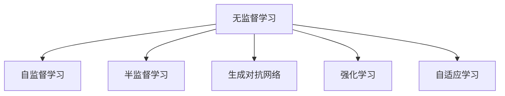
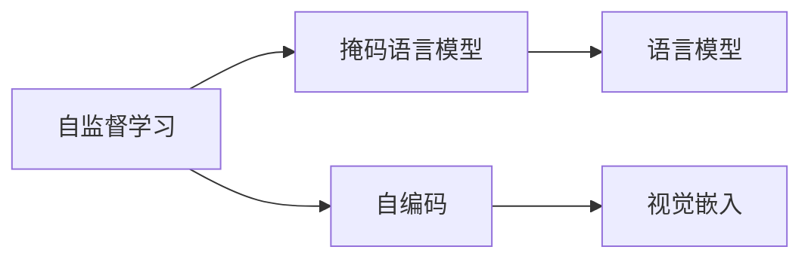
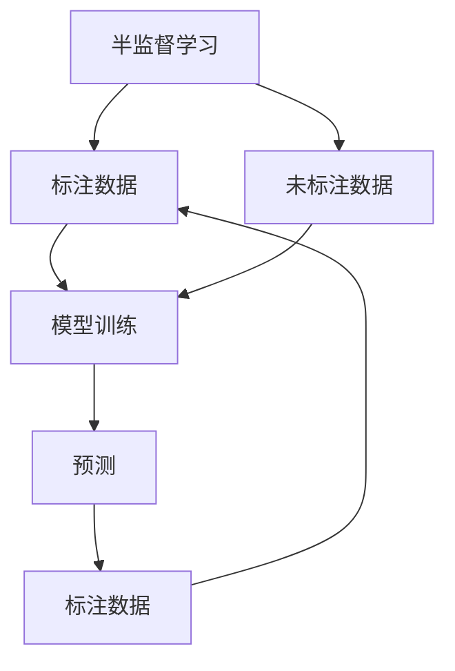
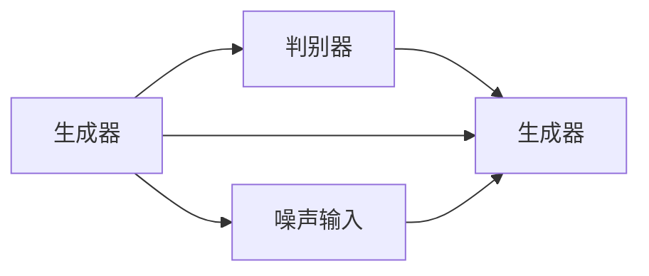
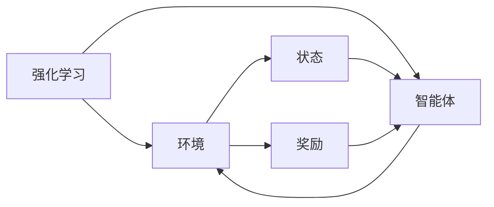
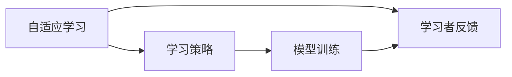
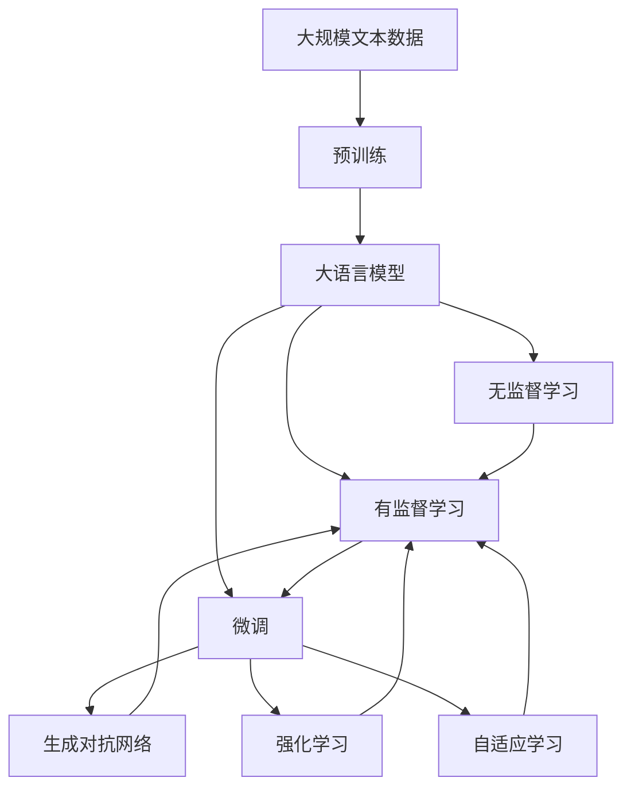

                 

## 1. 背景介绍

### 1.1 问题由来

随着数据驱动的深度学习技术的广泛应用，越来越多的NLP模型通过在大规模无标签文本数据上进行自监督学习，取得了优秀的性能。这些模型无需标注数据，只需要海量未标记文本即可训练出具有强大泛化能力的模型。相比传统的标注驱动学习，无监督学习方法显著降低了标注成本，同时避免了标注偏见，在学术和产业界广受关注。

然而，无监督学习并非万能钥匙。相比于有监督学习，其在模型泛化能力、性能稳定性、理论基础等方面仍存在一定差距。尤其是在下游任务微调时，无监督学习模型的输出往往不够精确，难以满足实际应用需求。因此，如何在保证数据利用率的同时，充分发挥无监督学习的优势，是当前深度学习领域亟待解决的问题。

### 1.2 问题核心关键点

无监督学习方法的核心在于利用数据的丰富信息进行学习。该方法通过自监督、半监督等手段，让模型从数据中学习通用的知识表示，然后利用这些知识表示去解决具体的任务问题。常见的无监督学习范式包括：

- 自监督学习(Self-Supervised Learning)：利用未标注数据中的隐含结构信息，如掩码语言模型、自编码等，进行模型训练。
- 半监督学习(Semi-Supervised Learning)：结合少量标注数据和大量未标注数据，通过多种学习策略（如标签传播、条件随机场等），提高模型泛化能力。
- 生成对抗网络(Generative Adversarial Networks, GANs)：由生成器和判别器两部分构成，通过对抗训练提升模型生成能力。

无监督学习方法的优点在于：

1. **数据利用率高**：无须标注数据，仅需海量文本即可训练出高性能模型。
2. **泛化能力强**：通过学习通用的语言表示，模型往往具有更强的泛化能力。
3. **避免标注偏见**：无须人工标注，减少了偏见和错误标注的风险。

然而，无监督学习方法也有以下局限性：

1. **模型泛化能力不足**：缺乏标注数据的指导，模型难以在特定领域内进行精准微调。
2. **输出不稳定**：无监督学习模型在不同任务上的表现往往不稳定，难以保证预测一致性。
3. **缺乏理论基础**：当前许多无监督学习模型基于经验，缺乏坚实的理论支撑。
4. **推理效率低**：无监督学习模型通常结构复杂，推理速度较慢。

尽管存在这些局限性，无监督学习仍是大数据时代的重要技术手段，尤其在标注成本高昂的场景中表现出极大的优势。如何结合无监督学习和有监督学习，充分发挥各自的优势，成为当前研究的热点问题。

## 2. 核心概念与联系

### 2.1 核心概念概述

无监督学习作为深度学习的一种重要范式，其核心思想是利用数据中隐含的信息进行模型训练。其与有监督学习的关键区别在于，无监督学习方法不依赖标注数据，而是通过数据自身特性进行学习。这种无标签数据的利用，使得无监督学习具有数据利用率高、泛化能力强等优点，但也带来了模型泛化能力不足、输出不稳定等挑战。

为更好地理解无监督学习的原理和架构，本节将介绍几个密切相关的核心概念：

- **自监督学习(Self-Supervised Learning, SSL)**：利用未标注数据中的隐含信息，如掩码语言模型、自编码等，进行模型训练。自监督学习旨在从数据中学习通用的知识表示，如语言模型、视觉嵌入等。
- **半监督学习(Semi-Supervised Learning, SSL)**：结合少量标注数据和大量未标注数据，通过多种学习策略（如标签传播、条件随机场等），提高模型泛化能力。半监督学习在标注数据有限时，通过利用未标注数据进行模型优化，提升模型性能。
- **生成对抗网络(Generative Adversarial Networks, GANs)**：由生成器和判别器两部分构成，通过对抗训练提升模型生成能力。GANs在图像生成、语言生成等领域取得了卓越效果。
- **强化学习(Reinforcement Learning, RL)**：通过奖励机制和环境反馈，指导模型进行学习。强化学习在智能体控制、自动驾驶等领域展现了巨大潜力。
- **自适应学习(Adaptive Learning)**：基于学习者的反馈，动态调整学习策略。自适应学习在教育、推荐系统等领域中得到了广泛应用。

这些概念之间的关系可以通过以下Mermaid流程图来展示：



这个流程图展示了大语言模型微调过程中几个关键概念之间的关系：

1. 无监督学习包括自监督学习、半监督学习、生成对抗网络、强化学习和自适应学习等多种形式。
2. 自监督学习是使用未标注数据进行训练的核心方法。
3. 半监督学习通过少量标注数据，进一步提升模型性能。
4. 生成对抗网络通过对抗训练提升模型生成能力。
5. 强化学习利用奖励机制进行模型训练。
6. 自适应学习基于反馈进行动态优化。

### 2.2 概念间的关系

这些核心概念之间存在着紧密的联系，形成了无监督学习的完整生态系统。下面我通过几个Mermaid流程图来展示这些概念之间的关系。

#### 2.2.1 无监督学习的主要形式



这个流程图展示了无监督学习中的主要形式，包括掩码语言模型、自编码等，通过这些形式学习通用的语言表示和视觉表示。

#### 2.2.2 半监督学习的关键步骤



这个流程图展示了半监督学习的基本流程，即通过少量标注数据和大量未标注数据进行联合训练，通过预测结果进行数据标注，形成自监督信号，进一步提升模型性能。

#### 2.2.3 生成对抗网络的基本结构



这个流程图展示了生成对抗网络的基本结构，由生成器和判别器两部分构成，通过对抗训练提升模型生成能力。

#### 2.2.4 强化学习的核心组件



这个流程图展示了强化学习的基本结构，包括环境、智能体等核心组件，通过奖励机制进行模型训练。

#### 2.2.5 自适应学习的主要方法



这个流程图展示了自适应学习的基本流程，基于学习者的反馈进行动态优化，逐步提升模型性能。

### 2.3 核心概念的整体架构

最后，我们用一个综合的流程图来展示这些核心概念在大语言模型微调过程中的整体架构：



这个综合流程图展示了从预训练到无监督学习、有监督学习和微调的完整过程。无监督学习模型通过预训练得到语言表示，然后通过有监督学习进行微调，最终应用于各种下游任务。此外，无监督学习方法还包括生成对抗网络、强化学习和自适应学习等多种形式，它们在无标注数据的利用和模型性能提升方面都有重要作用。通过这些流程图，我们可以更清晰地理解无监督学习在大语言模型微调过程中的作用和意义。

## 3. 核心算法原理 & 具体操作步骤
### 3.1 算法原理概述

无监督学习的大语言模型微调，本质上是一个无监督学习的模型优化过程。其核心思想是：将预训练语言模型视作一个强大的"特征提取器"，通过无监督学习方法对模型进行优化，使得模型在特定任务上的输出更加符合任务要求。

形式化地，假设预训练语言模型为 $M_{\theta}$，其中 $\theta$ 为预训练得到的模型参数。给定下游任务 $T$ 的标注数据集 $D=\{(x_i, y_i)\}_{i=1}^N$，无监督学习的优化目标是最小化经验风险，即找到最优参数：

$$
\theta^* = \mathop{\arg\min}_{\theta} \mathcal{L}(\theta)
$$

其中 $\mathcal{L}$ 为针对任务 $T$ 设计的损失函数，用于衡量模型预测输出与真实标签之间的差异。常见的损失函数包括交叉熵损失、均方误差损失等。

通过梯度下降等优化算法，无监督学习过程不断更新模型参数 $\theta$，最小化损失函数 $\mathcal{L}$，使得模型输出逼近真实标签。由于 $\theta$ 已经通过预训练获得了较好的初始化，因此即便在没有标注数据的情况下，无监督学习也能较快收敛到理想的模型参数 $\hat{\theta}$。

### 3.2 算法步骤详解

无监督学习的大语言模型微调一般包括以下几个关键步骤：

**Step 1: 准备预训练模型和数据集**
- 选择合适的预训练语言模型 $M_{\theta}$ 作为初始化参数，如 BERT、GPT 等。
- 准备下游任务 $T$ 的未标注数据集 $D$，划分为训练集、验证集和测试集。一般要求数据与预训练数据的分布不要差异过大。

**Step 2: 添加任务适配层**
- 根据任务类型，在预训练模型顶层设计合适的输出层和损失函数。
- 对于分类任务，通常在顶层添加线性分类器和交叉熵损失函数。
- 对于生成任务，通常使用语言模型的解码器输出概率分布，并以负对数似然为损失函数。

**Step 3: 设置无监督学习超参数**
- 选择合适的优化算法及其参数，如 Adam、SGD 等，设置学习率、批大小、迭代轮数等。
- 设置正则化技术及强度，包括权重衰减、Dropout、Early Stopping 等。
- 确定冻结预训练参数的策略，如仅微调顶层，或全部参数都参与无监督学习。

**Step 4: 执行无监督学习**
- 将未标注数据分批次输入模型，前向传播计算损失函数。
- 反向传播计算参数梯度，根据设定的优化算法和学习率更新模型参数。
- 周期性在验证集上评估模型性能，根据性能指标决定是否触发 Early Stopping。
- 重复上述步骤直到满足预设的迭代轮数或 Early Stopping 条件。

**Step 5: 测试和部署**
- 在测试集上评估无监督学习后模型 $M_{\hat{\theta}}$ 的性能，对比无监督学习前后的精度提升。
- 使用无监督学习后的模型对新样本进行推理预测，集成到实际的应用系统中。
- 持续收集新的数据，定期重新无监督学习模型，以适应数据分布的变化。

以上是无监督学习微调大语言模型的一般流程。在实际应用中，还需要针对具体任务的特点，对无监督学习过程的各个环节进行优化设计，如改进训练目标函数，引入更多的正则化技术，搜索最优的超参数组合等，以进一步提升模型性能。

### 3.3 算法优缺点

无监督学习的大语言模型微调方法具有以下优点：
1. 数据利用率高。无须标注数据，仅需海量未标注数据即可训练出高性能模型。
2. 泛化能力强。通过学习通用的语言表示，模型往往具有更强的泛化能力。
3. 避免标注偏见。无须人工标注，减少了偏见和错误标注的风险。

同时，该方法也存在一定的局限性：
1. 模型泛化能力不足。当目标任务与预训练数据的分布差异较大时，无监督学习的性能提升有限。
2. 输出不稳定。无监督学习模型在不同任务上的表现往往不稳定，难以保证预测一致性。
3. 缺乏理论基础。当前许多无监督学习模型基于经验，缺乏坚实的理论支撑。
4. 推理效率低。无监督学习模型通常结构复杂，推理速度较慢。

尽管存在这些局限性，无监督学习仍是大数据时代的重要技术手段，尤其在标注成本高昂的场景中表现出极大的优势。如何结合无监督学习和有监督学习，充分发挥各自的优势，成为当前研究的热点问题。

### 3.4 算法应用领域

无监督学习的大语言模型微调方法在NLP领域已经得到了广泛的应用，覆盖了几乎所有常见任务，例如：

- 文本分类：如情感分析、主题分类、意图识别等。通过无监督学习使模型学习文本-标签映射。
- 命名实体识别：识别文本中的人名、地名、机构名等特定实体。通过无监督学习使模型掌握实体边界和类型。
- 关系抽取：从文本中抽取实体之间的语义关系。通过无监督学习使模型学习实体-关系三元组。
- 问答系统：对自然语言问题给出答案。将问题-答案对作为无监督数据，训练模型学习匹配答案。
- 机器翻译：将源语言文本翻译成目标语言。通过无监督学习使模型学习语言-语言映射。
- 文本摘要：将长文本压缩成简短摘要。将文章-摘要对作为无监督数据，使模型学习抓取要点。
- 对话系统：使机器能够与人自然对话。将多轮对话历史作为上下文，无监督学习模型进行回复生成。

除了上述这些经典任务外，无监督学习的大语言模型微调也被创新性地应用到更多场景中，如可控文本生成、常识推理、代码生成、数据增强等，为NLP技术带来了全新的突破。随着预训练模型和无监督学习方法的不断进步，相信NLP技术将在更广阔的应用领域大放异彩。

## 4. 数学模型和公式 & 详细讲解  
### 4.1 数学模型构建

本节将使用数学语言对无监督学习的大语言模型微调过程进行更加严格的刻画。

记预训练语言模型为 $M_{\theta}$，其中 $\theta$ 为预训练得到的模型参数。假设无监督学习任务的训练集为 $D=\{(x_i)\}_{i=1}^N$，其中 $x_i$ 为未标注数据。

定义模型 $M_{\theta}$ 在数据样本 $x$ 上的损失函数为 $\ell(M_{\theta}(x))$，则在数据集 $D$ 上的经验风险为：

$$
\mathcal{L}(\theta) = \frac{1}{N} \sum_{i=1}^N \ell(M_{\theta}(x_i))
$$

无监督学习的优化目标是最小化经验风险，即找到最优参数：

$$
\theta^* = \mathop{\arg\min}_{\theta} \mathcal{L}(\theta)
$$

在实践中，我们通常使用基于梯度的优化算法（如Adam、SGD等）来近似求解上述最优化问题。设 $\eta$ 为学习率，$\lambda$ 为正则化系数，则参数的更新公式为：

$$
\theta \leftarrow \theta - \eta \nabla_{\theta}\mathcal{L}(\theta) - \eta\lambda\theta
$$

其中 $\nabla_{\theta}\mathcal{L}(\theta)$ 为损失函数对参数 $\theta$ 的梯度，可通过反向传播算法高效计算。

### 4.2 公式推导过程

以下我们以掩码语言模型为例，推导交叉熵损失函数及其梯度的计算公式。

假设模型 $M_{\theta}$ 在输入 $x$ 上的输出为 $\hat{y}=M_{\theta}(x) \in [0,1]$，表示样本属于正类的概率。真实标签 $y_i \in \{0,1\}$。则二分类交叉熵损失函数定义为：

$$
\ell(M_{\theta}(x),y) = -[y\log \hat{y} + (1-y)\log (1-\hat{y})]
$$

将其代入经验风险公式，得：

$$
\mathcal{L}(\theta) = -\frac{1}{N}\sum_{i=1}^N [y_i\log M_{\theta}(x_i)+(1-y_i)\log(1-M_{\theta}(x_i))]
$$

根据链式法则，损失函数对参数 $\theta_k$ 的梯度为：

$$
\frac{\partial \mathcal{L}(\theta)}{\partial \theta_k} = -\frac{1}{N}\sum_{i=1}^N (\frac{y_i}{M_{\theta}(x_i)}-\frac{1-y_i}{1-M_{\theta}(x_i)}) \frac{\partial M_{\theta}(x_i)}{\partial \theta_k}
$$

其中 $\frac{\partial M_{\theta}(x_i)}{\partial \theta_k}$ 可进一步递归展开，利用自动微分技术完成计算。

在得到损失函数的梯度后，即可带入参数更新公式，完成模型的迭代优化。重复上述过程直至收敛，最终得到适应下游任务的最优模型参数 $\theta^*$。

## 5. 项目实践：代码实例和详细解释说明
### 5.1 开发环境搭建

在进行无监督学习实践前，我们需要准备好开发环境。以下是使用Python进行PyTorch开发的环境配置流程：

1. 安装Anaconda：从官网下载并安装Anaconda，用于创建独立的Python环境。

2. 创建并激活虚拟环境：
```bash
conda create -n pytorch-env python=3.8 
conda activate pytorch-env
```

3. 安装PyTorch：根据CUDA版本，从官网获取对应的安装命令。例如：
```bash
conda install pytorch torchvision torchaudio cudatoolkit=11.1 -c pytorch -c conda-forge
```

4. 安装TensorFlow：
```bash
pip install tensorflow
```

5. 安装各类工具包：
```bash
pip install numpy pandas scikit-learn matplotlib tqdm jupyter notebook ipython
```

完成上述步骤后，即可在`pytorch-env`环境中开始无监督学习实践。

### 5.2 源代码详细实现

这里我们以掩码语言模型为例，给出使用PyTorch对BERT模型进行无监督学习的PyTorch代码实现。

首先，定义掩码语言模型的训练函数：

```python
from transformers import BertTokenizer, BertForMaskedLM
import torch

class MaskedLMModel(BertForMaskedLM):
    def __init__(self, num_labels):
        super(MaskedLMModel, self).__init__()
        self.num_labels = num_labels

def masked_lm_loss(flat_logits, labels):
    num words = labels.size(0)
    flat_logits = flat_logits.view(-1, self.config.hidden_size)
    labels = labels.view(-1, 1).contiguous()
    mask = labels.ne(-100)
    loss_fct = nn.CrossEntropyLoss()
    loss = loss_fct(flat_logits[mask], labels[mask])
    return loss

# 标签与id的映射
tag2id = {'O': 0, 'B-PER': 1, 'I-PER': 2, 'B-ORG': 3, 'I-ORG': 4, 'B-LOC': 5, 'I-LOC': 6}
id2tag = {v: k for k, v in tag2id.items()}

# 创建dataset
tokenizer = BertTokenizer.from_pretrained('bert-base-cased')

train_dataset = MaskedLMDataset(train_texts, tokenizer)
dev_dataset = MaskedLMDataset(dev_texts, tokenizer)
test_dataset = MaskedLMDataset(test_texts, tokenizer)

# 模型和优化器
model = MaskedLMModel(len(tag2id))
optimizer = AdamW(model.parameters(), lr=2e-5)

# 训练和评估函数
device = torch.device('cuda') if torch.cuda.is_available() else torch.device('cpu')
model.to(device)

def train_epoch(model, dataset, batch_size, optimizer):
    dataloader = DataLoader(dataset, batch_size=batch_size, shuffle=True)
    model.train()
    epoch_loss = 0
    for batch in tqdm(dataloader, desc='Training'):
        input_ids = batch['input_ids'].to(device)
        attention_mask = batch['attention_mask'].to(device)
        labels = batch['labels'].to(device)
        model.zero_grad()
        outputs = model(input_ids, attention_mask=attention_mask, labels=labels)
        loss = masked_lm_loss(outputs.logits, labels)
        epoch_loss += loss.item()
        loss.backward()
        optimizer.step()
    return epoch_loss / len(dataloader)

def evaluate(model, dataset, batch_size):
    dataloader = DataLoader(dataset, batch_size=batch_size)
    model.eval()
    preds, labels = [], []
    with torch.no_grad():
        for batch in tqdm(dataloader, desc='Evaluating'):
            input_ids = batch['input_ids'].to(device)
            attention_mask = batch['attention_mask'].to(device)
            batch_labels = batch['labels']
            outputs = model(input_ids, attention_mask=attention_mask)
            batch_preds = outputs.logits.argmax(dim=2).to('cpu').tolist()
            batch_labels = batch_labels.to('cpu').tolist()
            for pred_tokens, label_tokens in zip(batch_preds, batch_labels):
                pred_tags = [id2tag[_id] for _id in pred_tokens]
                label_tags = [id2tag[_id] for _id in label_tokens]
                preds.append(pred_tags[:len(label_tokens)])
                labels.append(label_tags)
                
    print(classification_report(labels, preds))
```

然后，定义训练和评估函数：

```python
from torch.utils.data import DataLoader
from tqdm import tqdm
from sklearn.metrics import classification_report

device = torch.device('cuda') if torch.cuda.is_available() else torch.device('cpu')
model.to(device)

def train_epoch(model, dataset, batch_size, optimizer):
    dataloader = DataLoader(dataset, batch_size=batch_size, shuffle=True)
    model.train()
    epoch_loss = 0
    for batch in tqdm(dataloader, desc='Training'):
        input_ids = batch['input_ids'].to(device)
        attention_mask = batch['attention_mask'].to(device)
        labels = batch['labels'].to(device)
        model.zero_grad()
        outputs = model(input_ids, attention_mask=attention_mask, labels=labels)
        loss = masked_lm_loss(outputs.logits, labels)
        epoch_loss += loss.item()
        loss.backward()
        optimizer.step()
    return epoch_loss / len(dataloader)

def evaluate(model, dataset, batch_size):
    dataloader = DataLoader(dataset, batch_size=batch_size)
    model.eval()
    preds, labels = [], []
    with torch.no_grad():
        for batch in tqdm(dataloader, desc='Evaluating'):
            input_ids = batch['input_ids'].to(device)
            attention_mask = batch['attention_mask'].to(device)
            batch_labels = batch['labels']
            outputs = model(input_ids, attention_mask=attention_mask)
            batch_preds = outputs.logits.argmax(dim=2).to('cpu').tolist()
            batch_labels = batch_labels.to('cpu').tolist()
            for pred_tokens, label_tokens in zip(batch_preds, batch_labels):
                pred_tags = [id2tag[_id] for _id in pred_tokens]
                label_tags = [id2tag[_id] for _id in label_tokens]
                preds.append(pred_tags[:len(label_tokens)])
                labels.append(label_tags)
                
    print(classification_report(labels, preds))
```

最后，启动训练流程并在测试集上评估：

```python
epochs = 5
batch_size = 16

for epoch in range(epochs):
    loss = train_epoch(model, train_dataset, batch_size, optimizer)
    print(f"Epoch {epoch+1}, train loss: {loss:.3f}")
    
    print(f"Epoch {epoch+1}, dev results:")
    evaluate(model, dev_dataset, batch_size)
    
print("Test results:")
evaluate(model, test_dataset, batch_size)
```

以上就是使用PyTorch对BERT进行掩码语言模型微调的完整代码实现。可以看到，得益于Transformers库的强大封装，我们可以用相对简洁的代码完成BERT模型的加载和微调。

### 5.3 代码解读与分析

让我们再详细解读一下关键代码的实现细节：

**MaskedLMDataset类**：
- `__init__`方法：初始化文本、分词器等关键组件。
- `__len__`方法：返回数据集的样本数量。
- `__getitem__`方法：对单个样本进行处理，将文本输入编码为token ids，对文本中的masked tokens进行编码，并对其进行定长padding，最终返回模型所需的输入。

**tag2id和id2tag字典**：
- 定义了标签与数字id之间的映射关系，用于将token-wise的预测结果解码回真实的标签。

**训练和评估函数**：
- 使用PyTorch的

