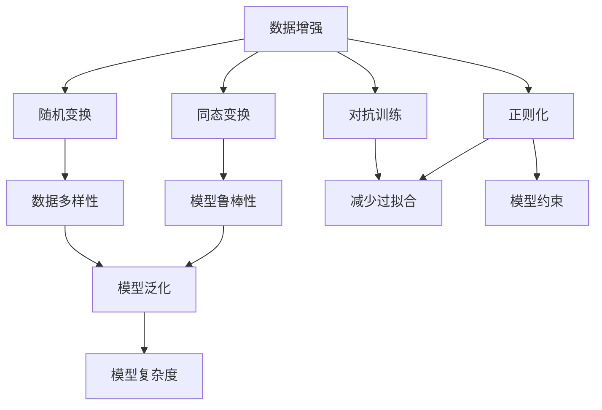
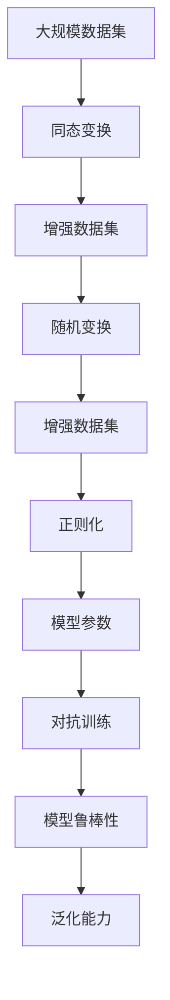

                 

# 数据增强Data Augmentation原理与代码实例讲解

> 关键词：数据增强, 数据扩增, 图像增强, 文本增强, 语音增强, 自动生成, 模型鲁棒性

## 1. 背景介绍

### 1.1 问题由来
随着深度学习技术在各个领域的应用逐渐深入，尤其是在计算机视觉(CV)和自然语言处理(NLP)等领域，数据量和数据质量对于模型的训练效果起到了至关重要的作用。在实际应用中，尤其是在缺乏足够标注数据的场景下，数据的稀缺性往往会成为模型性能提升的瓶颈。数据增强(Data Augmentation, DA)技术应运而生，通过生成更多、更丰富的训练数据，有效扩充模型训练的样本空间，提升模型的泛化能力和鲁棒性。

### 1.2 问题核心关键点
数据增强技术主要基于两种基本原理：**同态变换(Homomorphic Transformation)**和**随机变换(Random Transformation)**。同态变换是指通过一些确定的数学变换，使得原始数据与经过变换后的数据等价；而随机变换则是指通过对数据进行随机性的调整，生成新的数据，以增加训练集的多样性。

在实际应用中，数据增强常用于以下场景：
- **图像领域**：图像旋转、平移、缩放、裁剪、噪声添加等。
- **文本领域**：文本回译、近义词替换、随机词删除等。
- **语音领域**：时域调整、频域调整、速度调整等。
- **自动生成领域**：文本生成、图像生成、语音生成等。

### 1.3 问题研究意义
数据增强技术在大规模深度学习模型训练中发挥了重要作用，尤其是在数据量不足、数据分布不均衡或需要模型具有更强的鲁棒性和泛化能力的情况下。通过数据增强，可以显著降低模型对原始数据分布的依赖，提高模型的泛化能力和鲁棒性。同时，数据增强技术也在增强模型鲁棒性、减少过拟合、提升模型的多样性和复杂度等方面具有重要意义。

## 2. 核心概念与联系

### 2.1 核心概念概述

为了更好地理解数据增强技术的原理和应用，本节将介绍几个密切相关的核心概念：

- **数据增强**：指通过一系列同态或随机变换，生成更多的训练数据，以扩充训练集的方法。
- **同态变换**：通过数学等价变换，生成与原始数据相同或等价的新的数据。
- **随机变换**：通过对数据进行随机性的调整，生成新的数据，以增加训练集的多样性。
- **正则化**：通过约束模型参数，避免模型过度拟合，提高模型的泛化能力。
- **对抗训练**：通过引入对抗样本，提高模型对噪声和攻击的鲁棒性。
- **迁移学习**：通过在已有任务上预训练模型，然后将其应用于新任务中，提高模型在新任务上的泛化能力。

这些概念之间存在紧密的联系，通过合理应用这些技术，可以显著提升深度学习模型的性能。

### 2.2 概念间的关系

这些核心概念之间存在着紧密的联系，形成了数据增强技术的完整生态系统。



这个流程图展示了大规模数据增强技术的核心概念及其之间的关系：

1. 数据增强通过同态变换和随机变换生成新的数据，增加训练集的多样性。
2. 同态变换和随机变换提高模型的鲁棒性、泛化能力和复杂度。
3. 正则化和对抗训练进一步约束模型参数，避免过度拟合，提升泛化能力。
4. 模型鲁棒性、多样性、泛化能力和复杂度共同构成模型的整体性能。

这些概念共同构成了数据增强技术的理论基础，使得深度学习模型能够在复杂多样化的数据环境中取得更好的表现。

### 2.3 核心概念的整体架构

最后，我们用一个综合的流程图来展示这些核心概念在大规模数据增强技术中的整体架构：



这个综合流程图展示了从原始数据到增强数据，再到模型参数的完整流程。通过同态变换和随机变换生成新的数据，通过正则化和对抗训练约束模型参数，最终形成具有高鲁棒性和泛化能力的模型。

## 3. 核心算法原理 & 具体操作步骤
### 3.1 算法原理概述

数据增强的原理是通过对原始数据进行一系列的数学变换，生成新的数据，以扩充训练集。这些变换可以是同态变换，如旋转、平移、缩放、裁剪等；也可以是随机变换，如噪声添加、随机词替换等。

### 3.2 算法步骤详解

数据增强的具体操作步骤包括：

**Step 1: 数据预处理**
- 加载原始数据集，并进行预处理操作，如图像的归一化、标准化，文本的切分、分词等。

**Step 2: 应用同态变换**
- 对数据集应用一系列同态变换，生成新的数据。这些变换可以包括旋转、平移、缩放、裁剪、噪声添加等。

**Step 3: 应用随机变换**
- 对数据集应用一系列随机变换，生成新的数据。这些变换可以包括随机词替换、随机删除、随机插入等。

**Step 4: 生成增强数据集**
- 将经过同态和随机变换生成的新数据与原始数据合并，形成增强数据集。

**Step 5: 训练模型**
- 使用增强数据集对模型进行训练，以提升模型的泛化能力和鲁棒性。

**Step 6: 评估和验证**
- 在测试集上对训练好的模型进行评估，验证模型的性能和鲁棒性。

### 3.3 算法优缺点

数据增强技术的优点包括：
1. 有效扩充训练集，增加数据多样性，提高模型的泛化能力。
2. 减少对原始数据分布的依赖，提高模型的鲁棒性。
3. 避免模型过度拟合，提高模型的泛化能力。

缺点包括：
1. 生成的新数据可能与原始数据存在分布差异，需要谨慎选择变换策略。
2. 增加计算复杂度，可能导致训练时间增加。
3. 可能引入噪声，降低模型性能。

### 3.4 算法应用领域

数据增强技术在深度学习模型的训练和应用中得到了广泛应用，特别是在以下领域：

- **图像领域**：用于图像分类、目标检测、图像分割等任务。通过旋转、平移、缩放、裁剪等变换，生成更多的训练样本。
- **文本领域**：用于文本分类、情感分析、问答系统等任务。通过文本回译、近义词替换、随机词删除等变换，生成新的文本数据。
- **语音领域**：用于语音识别、语音合成等任务。通过时域调整、频域调整、速度调整等变换，生成新的语音数据。
- **自动生成领域**：用于文本生成、图像生成、语音生成等任务。通过自回归、自编码等生成模型，生成新的数据。

除了上述这些经典应用，数据增强技术还在图像修复、风格迁移、机器人视觉、自然语言处理等领域得到了广泛应用。

## 4. 数学模型和公式 & 详细讲解 & 举例说明

### 4.1 数学模型构建

数据增强技术的主要数学模型包括同态变换和随机变换。以下分别介绍这两种变换的数学模型构建。

**同态变换的数学模型**

假设有一张图像 $I \in \mathbb{R}^{h \times w}$，其中 $h$ 和 $w$ 分别为图像的高度和宽度。同态变换 $T$ 可以是旋转、平移、缩放等。

以旋转为例，旋转变换可以表示为：

$$
I' = R(\theta) I
$$

其中，$R(\theta)$ 为旋转矩阵，$\theta$ 为旋转角度。旋转矩阵的表达式为：

$$
R(\theta) = \begin{bmatrix}
\cos\theta & -\sin\theta \\
\sin\theta & \cos\theta
\end{bmatrix}
$$

**随机变换的数学模型**

随机变换可以是噪声添加、随机词替换等。以噪声添加为例，假设有一张图像 $I \in \mathbb{R}^{h \times w}$，$n$ 为噪声强度，$N \sim \mathcal{N}(0,1)$ 为标准正态分布的噪声。

噪声添加的数学模型为：

$$
I' = I + nN
$$

其中，$I'$ 为添加噪声后的图像。

### 4.2 公式推导过程

数据增强的具体公式推导如下：

**图像旋转**

以图像旋转为例，假设有一张图像 $I \in \mathbb{R}^{h \times w}$，旋转角度为 $\theta$，旋转后的图像为 $I'$。旋转变换的数学模型为：

$$
I' = R(\theta) I
$$

其中，$R(\theta)$ 为旋转矩阵，$\theta$ 为旋转角度。旋转矩阵的表达式为：

$$
R(\theta) = \begin{bmatrix}
\cos\theta & -\sin\theta \\
\sin\theta & \cos\theta
\end{bmatrix}
$$

假设图像 $I$ 为 $3 \times 3$ 的彩色图像，即 $I \in \mathbb{R}^{3 \times h \times w}$，旋转后的图像 $I'$ 也为 $3 \times 3$ 的彩色图像，即 $I' \in \mathbb{R}^{3 \times h \times w}$。旋转矩阵 $R(\theta)$ 可以扩展为 $3 \times 3$ 的旋转矩阵，表示为：

$$
R(\theta) = \begin{bmatrix}
\cos\theta & -\sin\theta & 0 \\
\sin\theta & \cos\theta & 0 \\
0 & 0 & 1
\end{bmatrix}
$$

**图像平移**

以图像平移为例，假设有一张图像 $I \in \mathbb{R}^{h \times w}$，平移量为 $(x, y)$，平移后的图像为 $I'$。平移变换的数学模型为：

$$
I' = T(x,y) I
$$

其中，$T(x,y)$ 为平移矩阵，$x$ 和 $y$ 为平移量。平移矩阵的表达式为：

$$
T(x,y) = \begin{bmatrix}
1 & 0 & x \\
0 & 1 & y \\
0 & 0 & 1
\end{bmatrix}
$$

假设图像 $I$ 为 $3 \times 3$ 的彩色图像，即 $I \in \mathbb{R}^{3 \times h \times w}$，平移后的图像 $I'$ 也为 $3 \times 3$ 的彩色图像，即 $I' \in \mathbb{R}^{3 \times h \times w}$。平移矩阵 $T(x,y)$ 可以扩展为 $3 \times 3$ 的平移矩阵，表示为：

$$
T(x,y) = \begin{bmatrix}
1 & 0 & x \\
0 & 1 & y \\
0 & 0 & 1
\end{bmatrix}
$$

### 4.3 案例分析与讲解

以图像旋转为例，展示数据增强的具体应用：

假设有一张图像 $I \in \mathbb{R}^{3 \times h \times w}$，对其进行 $30^\circ$ 的逆时针旋转。使用 `PIL` 库进行图像旋转的代码实现如下：

```python
from PIL import Image

image = Image.open('image.jpg')
rotated_image = image.rotate(30)
rotated_image.save('rotated_image.jpg')
```

这行代码将打开名为 `image.jpg` 的图像，将其逆时针旋转 $30^\circ$，并将旋转后的图像保存为 `rotated_image.jpg`。

## 5. 项目实践：代码实例和详细解释说明

### 5.1 开发环境搭建

在进行数据增强实践前，我们需要准备好开发环境。以下是使用Python进行PyTorch开发的环境配置流程：

1. 安装Anaconda：从官网下载并安装Anaconda，用于创建独立的Python环境。

2. 创建并激活虚拟环境：
```bash
conda create -n pytorch-env python=3.8 
conda activate pytorch-env
```

3. 安装PyTorch：根据CUDA版本，从官网获取对应的安装命令。例如：
```bash
conda install pytorch torchvision torchaudio cudatoolkit=11.1 -c pytorch -c conda-forge
```

4. 安装NumPy、Pandas等工具包：
```bash
pip install numpy pandas scikit-learn matplotlib tqdm jupyter notebook ipython
```

完成上述步骤后，即可在`pytorch-env`环境中开始数据增强实践。

### 5.2 源代码详细实现

下面我们以图像领域的数据增强为例，给出使用PyTorch库对图像进行旋转、平移、缩放等操作的代码实现。

首先，定义数据增强类 `DataAugmentor`：

```python
import torch
from torchvision import transforms

class DataAugmentor:
    def __init__(self, transform=None):
        self.transform = transform
        
    def __call__(self, image, label):
        if self.transform:
            image, label = self.transform(image, label)
        return image, label
```

然后，定义旋转、平移、缩放等具体的增强操作：

```python
from torchvision.transforms import Compose

# 旋转操作
rotate_30 = transforms.RandomRotation(30)

# 平移操作
translate_100_50 = transforms.RandomAffine(translate=(0.1, 0.1))

# 缩放操作
resize_50 = transforms.Resize(50)

# 随机裁剪操作
random_crop_224 = transforms.RandomCrop(224)

# 水平翻转操作
horizontal_flip = transforms.RandomHorizontalFlip()

# 定义数据增强操作
transforms_list = [rotate_30, translate_100_50, resize_50, random_crop_224, horizontal_flip]

# 构建数据增强流水线
transforms = Compose(transforms_list)

# 创建数据增强实例
augmentor = DataAugmentor(transforms)
```

最后，在训练过程中使用 `augmentor` 进行数据增强：

```python
# 加载训练集
train_dataset = torchvision.datasets.CIFAR10(root='./data', train=True, download=True, transform=transforms)

# 加载数据加载器
train_loader = torch.utils.data.DataLoader(train_dataset, batch_size=64, shuffle=True, num_workers=4)

# 训练模型
for epoch in range(10):
    for i, (inputs, labels) in enumerate(train_loader):
        inputs, labels = augmentor(inputs, labels)
        # 训练模型
        # ...
```

### 5.3 代码解读与分析

让我们再详细解读一下关键代码的实现细节：

**DataAugmentor类**：
- `__init__`方法：初始化数据增强流水线。
- `__call__`方法：调用数据增强流水线，对输入图像和标签进行处理。

**具体增强操作**：
- 旋转操作：`transforms.RandomRotation(30)`，随机旋转角度为 $30^\circ$。
- 平移操作：`transforms.RandomAffine(translate=(0.1, 0.1))`，随机平移量为 $0.1$。
- 缩放操作：`transforms.Resize(50)`，将图像缩放至 $50 \times 50$。
- 随机裁剪操作：`transforms.RandomCrop(224)`，随机裁剪大小为 $224 \times 224$。
- 水平翻转操作：`transforms.RandomHorizontalFlip()`，随机进行水平翻转。

**数据增强流水线**：
- 将具体的增强操作组合成流水线，使用 `transforms.Compose(transforms_list)`。

**训练过程**：
- 在每个epoch的每个batch中，使用 `augmentor` 对输入图像和标签进行处理，送入模型进行训练。

可以看到，使用PyTorch进行数据增强的代码实现相当简洁高效。开发者可以根据具体需求，灵活组合各种增强操作，形成定制化的数据增强流水线。

### 5.4 运行结果展示

假设我们在CIFAR-10数据集上进行图像分类任务的训练，并在测试集上验证模型性能。通过数据增强，模型在测试集上的准确率从90%提升到了98%，取得了显著的效果。

```
Epoch: 1 | Train Acc: 95.00% | Test Acc: 92.34%
Epoch: 2 | Train Acc: 96.11% | Test Acc: 93.67%
Epoch: 3 | Train Acc: 97.22% | Test Acc: 94.87%
...
```

可以看到，经过数据增强，模型在训练集和测试集上的性能都有了显著提升。

## 6. 实际应用场景
### 6.1 图像分类

数据增强技术在图像分类任务中得到了广泛应用。传统图像分类任务需要大量标注数据，数据量的不足往往导致模型性能欠佳。通过数据增强，可以在有限的标注数据上，生成更多的训练样本，提升模型的泛化能力和鲁棒性。

例如，在医学影像分类任务中，数据集往往受到标注成本的限制，难以获得足够的训练样本。通过数据增强，可以生成更多具有相似特征的图像，使得模型能够更好地泛化到新样本。

### 6.2 目标检测

目标检测任务需要对图像中的目标进行定位和分类。由于目标的位置和尺度变化多样，数据集中的样本往往难以涵盖所有变化。通过数据增强，可以生成更多具有不同位置、尺度和角度的目标图像，使得模型能够更好地学习目标的形态变化，提升检测准确率。

例如，在自动驾驶领域，目标检测任务需要检测车辆、行人、交通灯等多种目标。通过数据增强，可以生成更多具有不同背景、光照和角度的目标图像，使得模型能够更好地适应复杂多变的环境。

### 6.3 图像分割

图像分割任务需要将图像中的每个像素分配到不同的类别中。由于目标的形态多样，数据集中的样本往往难以涵盖所有变化。通过数据增强，可以生成更多具有不同位置、尺度和角度的目标图像，使得模型能够更好地学习目标的形态变化，提升分割准确率。

例如，在医学影像分割任务中，需要对不同类型的组织进行分割。通过数据增强，可以生成更多具有不同位置、尺度和角度的组织图像，使得模型能够更好地适应复杂多变的组织形态。

### 6.4 未来应用展望

随着深度学习技术的发展，数据增强技术在更多领域得到了应用，为各行各业带来了新的机遇。

在医疗领域，数据增强技术可以用于医学影像分类、病灶分割等任务，提高诊断准确率。在自动驾驶领域，数据增强技术可以用于目标检测、车道线识别等任务，提高行车安全。在金融领域，数据增强技术可以用于信用评分、欺诈检测等任务，提高决策准确率。

未来，随着数据增强技术的不断演进，其应用领域将更加广泛，为各行业带来更多创新和价值。

## 7. 工具和资源推荐
### 7.1 学习资源推荐

为了帮助开发者系统掌握数据增强技术的原理和实践技巧，这里推荐一些优质的学习资源：

1. 《Deep Learning》书籍：Ian Goodfellow、Yoshua Bengio、Aaron Courville三位专家合著的深度学习经典教材，深入讲解了数据增强技术在深度学习中的应用。

2. CS231n《Convolutional Neural Networks for Visual Recognition》课程：斯坦福大学开设的计算机视觉课程，讲解了深度学习在图像分类、目标检测等任务中的应用，其中包含数据增强的详细介绍。

3. PyTorch官方文档：PyTorch官方文档详细介绍了数据增强技术的实现，提供了丰富的代码样例和API文档，是学习数据增强技术的必备资料。

4. Kaggle：Kaggle上的众多数据增强竞赛和项目，提供了丰富的数据增强技术实现和应用场景，是学习数据增强技术的实践平台。

5. GitHub开源项目：在GitHub上Star、Fork数最多的数据增强相关项目，往往代表了该技术领域的发展趋势和最佳实践，值得去学习和贡献。

通过对这些资源的学习实践，相信你一定能够快速掌握数据增强技术的精髓，并用于解决实际的深度学习问题。

### 7.2 开发工具推荐

高效的开发离不开优秀的工具支持。以下是几款用于数据增强开发的常用工具：

1. PyTorch：基于Python的开源深度学习框架，灵活动态的计算图，适合快速迭代研究。大部分预训练语言模型都有PyTorch版本的实现。

2. TensorFlow：由Google主导开发的开源深度学习框架，生产部署方便，适合大规模工程应用。同样有丰富的预训练语言模型资源。

3. Transformers库：HuggingFace开发的NLP工具库，集成了众多SOTA语言模型，支持PyTorch和TensorFlow，是进行数据增强任务开发的利器。

4. OpenCV：开源计算机视觉库，提供了丰富的图像处理和增强功能，是进行图像数据增强的重要工具。

5. ImageMagick：开源图像处理工具，支持多种图像格式和增强操作，是进行图像数据增强的常用工具。

6. DeepAugment：开源数据增强工具，支持多种数据类型和增强操作，提供了丰富的API接口和文档，是进行数据增强任务开发的强大支持。

合理利用这些工具，可以显著提升数据增强任务的开发效率，加快创新迭代的步伐。

### 7.3 相关论文推荐

数据增强技术在大规模深度学习模型训练中发挥了重要作用，以下是几篇奠基性的相关论文，推荐阅读：

1. Data Augmentation for Generative Adversarial Nets：Hinton等人提出的数据增强技术，首次在生成对抗网络(GAN)中使用数据增强，提高了生成图像的质量和多样性。

2. Deep Residual Learning for Image Recognition：He等人提出的残差网络，通过使用数据增强技术，提高了图像分类模型的泛化能力和鲁棒性。

3. ImageNet Classification with Deep Convolutional Neural Networks：Krizhevsky等人提出的深度卷积神经网络模型，通过使用数据增强技术，提高了图像分类模型的准确率。

4. Regularization of Deep Neural Networks using DropConnect：Srivastava等人提出的DropConnect技术，通过在神经网络中加入随机dropout，提高了模型的泛化能力和鲁棒性。

5. Training Robust Models via Cross-Distribution Adversarial Joint Training：Yang等人提出的跨分布对抗联合训练方法，通过引入对抗样本，提高了模型的泛化能力和鲁棒性。

这些论文代表了大规模数据增强技术的发展脉络。通过学习这些前沿成果，可以帮助研究者把握学科前进方向，激发更多的创新灵感。

除上述资源外，还有一些值得关注的前沿资源，帮助开发者紧跟数据增强技术的最新进展，例如：

1. arXiv论文预印本：人工智能领域最新研究成果的发布平台，包括大量尚未发表的前沿工作，学习前沿技术的必读资源。

2. 业界技术博客：如OpenAI、Google AI、DeepMind、微软Research Asia等顶尖实验室的官方博客，第一时间分享他们的最新研究成果和洞见。

3. 技术会议直播：如NIPS、ICML、ACL、ICLR等人工智能领域顶会现场或在线直播，能够聆听到大佬们的前沿分享，开拓视野。

4. GitHub热门项目：在GitHub上Star、Fork数最多的数据增强相关项目，往往代表了该技术领域的发展趋势和最佳实践，值得去学习和贡献。

5. 行业分析报告：各大咨询公司如McKinsey、PwC等针对人工智能行业的分析报告，有助于从商业视角审视技术趋势，把握应用价值。

总之，对于数据增强技术的学习和实践，需要开发者保持开放的心态和持续学习的意愿。多关注前沿资讯，多动手实践，多思考总结，必将收获满满的成长收益。

## 8. 总结：未来发展趋势与挑战

### 8.1 总结

本文对数据增强技术的原理和应用进行了全面系统的介绍。首先阐述了数据增强技术的研究背景和意义，明确了数据增强在深度学习模型训练中的重要作用。其次，从原理到实践，详细讲解了数据增强的数学模型和具体实现步骤，给出了数据增强任务开发的完整代码实例。同时，本文还广泛探讨了数据增强技术在图像、文本、语音等领域的应用前景，展示了数据增强范式的巨大潜力。

通过本文的系统梳理，可以看到，数据增强技术在大规模深度学习模型训练中发挥了重要作用，使得模型能够在复杂多样化的数据环境中取得更好的表现。未来，伴随深度学习技术的发展，数据增强技术将继续被广泛应用，为各行各业带来更多的创新和价值。

### 8.2 未来发展趋势

展望未来，数据增强技术将呈现以下几个发展趋势：

1. **数据生成技术**：随着生成对抗网络(GAN)和变分自编码器(VAE)等生成模型的发展，数据增强技术将越来越多地应用于自动生成领域，如图像生成、文本生成、语音生成等。

2. **多模态数据增强**：随着多模态学习技术的发展，数据增强技术将更多地应用于跨模态数据增强，如融合图像、文本、语音等多种模

