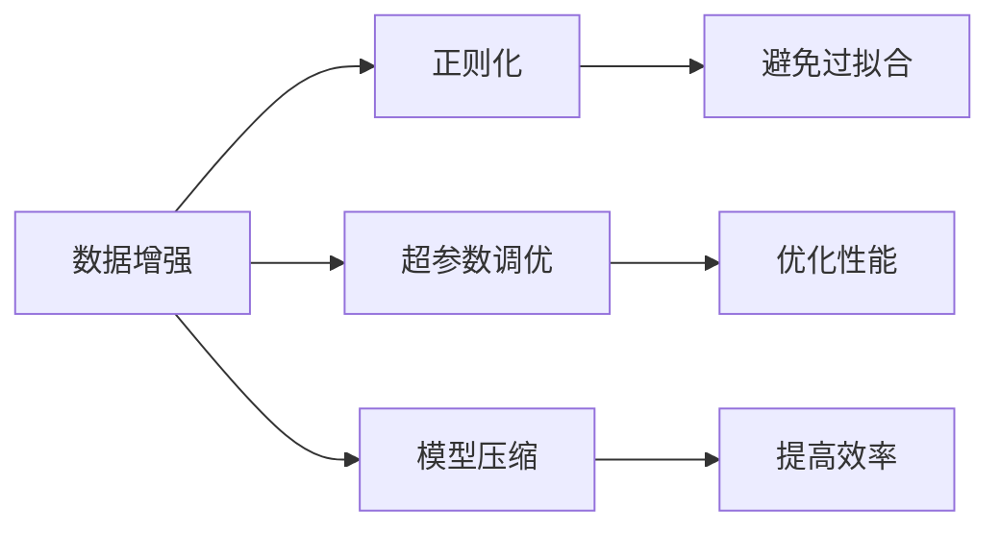

                 

## 1. 背景介绍

数据是大模型的基石，其重要性不言而喻。无论多么强大的模型，如果没有足够高质量的数据进行训练，都无法发挥其潜力。训练大模型的过程，本质上是一个数据驱动的过程，需要经过多个关键步骤，才能最终得到一个优质的模型。本文将深入探讨数据处理在训练大模型中的重要性，并介绍一些关键的数据处理技术，帮助读者在实际操作中更好地进行模型训练。

## 2. 核心概念与联系

### 2.1 核心概念概述

为了更好地理解数据处理在大模型训练中的作用，我们需要掌握以下几个核心概念：

- **数据增强（Data Augmentation）**：通过一些数据处理技巧，增加训练数据的多样性，提高模型的泛化能力。常见的数据增强技术包括随机裁剪、旋转、平移、翻转等。

- **正则化（Regularization）**：通过添加约束，避免模型过拟合。常见的正则化技术包括L1正则、L2正则、Dropout等。

- **超参数调优（Hyperparameter Tuning）**：选择合适的学习率、批大小、迭代轮数等超参数，以优化模型的性能。常用的调优方法包括网格搜索、随机搜索等。

- **模型压缩（Model Compression）**：通过减少模型参数或结构，降低计算资源消耗，提高模型的效率。常见的压缩技术包括剪枝、量化、知识蒸馏等。

这些概念之间相互联系，共同构成了一个高效、稳定的数据处理与模型训练生态系统。通过合理运用这些技术，可以显著提升模型的性能和训练效率。

### 2.2 核心概念的整体架构

我们可以用以下Mermaid流程图来展示这些核心概念之间的逻辑关系：



这个流程图展示了数据处理与模型训练的相互关系。数据增强、正则化和超参数调优，都旨在提升模型的泛化能力和性能；而模型压缩则是为了提高模型的效率，降低资源消耗。

### 2.3 数据处理在大模型训练中的重要性

数据处理在大模型训练中的重要性体现在以下几个方面：

- **泛化能力**：通过增加数据的多样性，数据增强技术可以提升模型对不同数据分布的适应能力，从而提高模型的泛化能力。
- **避免过拟合**：正则化技术可以帮助模型更好地处理训练数据中的噪声，避免模型过拟合到训练集上，提高模型的泛化性能。
- **优化性能**：超参数调优可以帮助我们找到最优的模型配置，从而提高模型的训练效率和性能。
- **提高效率**：模型压缩技术可以减少模型参数和计算量，提高模型的推理效率，降低资源的消耗。

## 3. 核心算法原理 & 具体操作步骤

### 3.1 算法原理概述

在大模型训练中，数据处理的作用主要体现在以下几个方面：

- **数据增强**：通过一系列数据增强操作，增加训练数据的多样性，从而提升模型的泛化能力。
- **正则化**：通过正则化技术，减少模型的过拟合，提高模型的泛化能力。
- **超参数调优**：通过调优模型的超参数，找到最优的模型配置，从而提高模型的训练效率和性能。
- **模型压缩**：通过减少模型参数和计算量，提高模型的推理效率，降低资源的消耗。

### 3.2 算法步骤详解

以下是基于数据处理的大模型训练的一般步骤：

**Step 1: 准备训练数据**

- 收集高质量的数据集。数据集应该包含足够的样本数量，并尽可能覆盖不同的数据分布。
- 对数据进行预处理，包括去除噪声、标准化、归一化等。

**Step 2: 数据增强**

- 对训练集进行数据增强，增加数据的多样性。
- 常用的数据增强技术包括随机裁剪、旋转、平移、翻转等。

**Step 3: 正则化**

- 添加正则化项，减少模型的过拟合。
- 常用的正则化技术包括L1正则、L2正则、Dropout等。

**Step 4: 超参数调优**

- 选择合适的超参数配置，进行网格搜索或随机搜索。
- 常用的超参数包括学习率、批大小、迭代轮数等。

**Step 5: 模型压缩**

- 对模型进行剪枝、量化、知识蒸馏等操作，减少模型参数和计算量。
- 常用的模型压缩技术包括剪枝、量化、知识蒸馏等。

**Step 6: 模型训练**

- 使用优化器（如AdamW、SGD等）进行模型训练。
- 记录训练过程中的性能指标，如损失函数、准确率等。

**Step 7: 模型评估**

- 使用测试集评估模型的性能。
- 对比微调前后的性能，评估数据处理的有效性。

### 3.3 算法优缺点

数据处理在大模型训练中的优点包括：

- **提升泛化能力**：数据增强和正则化技术可以提升模型的泛化能力，使其在测试集上也能表现优异。
- **提高训练效率**：超参数调优和模型压缩技术可以显著提高训练效率，减少计算资源的消耗。
- **降低过拟合风险**：正则化技术可以有效避免模型的过拟合，提高模型的鲁棒性。

数据处理的缺点包括：

- **数据处理复杂度**：数据增强和正则化需要设计一系列复杂的处理规则，增加了数据处理的复杂度。
- **数据处理成本**：数据增强和正则化需要更多的计算资源和时间，增加了数据处理的成本。

### 3.4 算法应用领域

数据处理在大模型训练中的应用非常广泛，包括但不限于以下几个领域：

- **计算机视觉（CV）**：在图像分类、目标检测等任务中，数据增强和正则化技术可以显著提升模型的性能。
- **自然语言处理（NLP）**：在文本分类、情感分析等任务中，数据增强和正则化技术同样有效。
- **语音识别**：在语音识别任务中，数据增强和正则化技术可以提高模型的鲁棒性。
- **推荐系统**：在推荐系统中，数据增强和正则化技术可以提升模型的个性化能力，提高推荐效果。

## 4. 数学模型和公式 & 详细讲解

### 4.1 数学模型构建

在大模型训练中，我们通常使用以下数学模型来构建训练过程：

- **损失函数（Loss Function）**：用于衡量模型预测结果与真实标签之间的差异。常用的损失函数包括交叉熵损失、均方误差损失等。
- **正则化项（Regularization Term）**：用于避免模型的过拟合。常用的正则化项包括L1正则项、L2正则项等。
- **训练目标（Training Objective）**：将损失函数和正则化项结合起来，作为模型的训练目标。
- **优化器（Optimizer）**：用于更新模型参数，最小化训练目标。常用的优化器包括AdamW、SGD等。

### 4.2 公式推导过程

以下是一个简单的二分类问题，使用交叉熵损失函数进行训练的公式推导过程：

假设模型 $M_{\theta}$ 在输入 $x$ 上的输出为 $\hat{y}=M_{\theta}(x) \in [0,1]$，表示样本属于正类的概率。真实标签 $y \in \{0,1\}$。则二分类交叉熵损失函数定义为：

$$
\ell(M_{\theta}(x),y) = -[y\log \hat{y} + (1-y)\log (1-\hat{y})]
$$

将其代入训练目标公式，得：

$$
\mathcal{L}(\theta) = -\frac{1}{N}\sum_{i=1}^N [y_i\log M_{\theta}(x_i)+(1-y_i)\log(1-M_{\theta}(x_i))]
$$

其中 $N$ 为训练集样本数量。

在得到训练目标后，我们使用优化器（如AdamW）来最小化目标函数：

$$
\theta \leftarrow \theta - \eta \nabla_{\theta}\mathcal{L}(\theta)
$$

其中 $\eta$ 为学习率，$\nabla_{\theta}\mathcal{L}(\theta)$ 为损失函数对模型参数 $\theta$ 的梯度。

### 4.3 案例分析与讲解

在实际应用中，我们通常使用数据增强和正则化技术来提升模型的泛化能力和鲁棒性。以下是一个简单的图像分类任务的数据增强案例：

假设我们有一个包含狗和猫的图像数据集，我们可以使用以下数据增强操作：

- 随机裁剪：将图像随机裁剪为不同大小，增加图像的多样性。
- 随机旋转：将图像随机旋转一定角度，增加图像的多样性。
- 随机平移：将图像随机平移一定距离，增加图像的多样性。
- 随机翻转：将图像随机翻转，增加图像的多样性。

通过这些数据增强操作，我们可以得到更多的训练样本，提高模型的泛化能力。

## 5. 项目实践：代码实例和详细解释说明

### 5.1 开发环境搭建

在进行数据处理实践前，我们需要准备好开发环境。以下是使用Python进行PyTorch开发的环境配置流程：

1. 安装Anaconda：从官网下载并安装Anaconda，用于创建独立的Python环境。

2. 创建并激活虚拟环境：
```bash
conda create -n pytorch-env python=3.8 
conda activate pytorch-env
```

3. 安装PyTorch：根据CUDA版本，从官网获取对应的安装命令。例如：
```bash
conda install pytorch torchvision torchaudio cudatoolkit=11.1 -c pytorch -c conda-forge
```

4. 安装Transformers库：
```bash
pip install transformers
```

5. 安装各类工具包：
```bash
pip install numpy pandas scikit-learn matplotlib tqdm jupyter notebook ipython
```

完成上述步骤后，即可在`pytorch-env`环境中开始数据处理实践。

### 5.2 源代码详细实现

下面我们以图像分类任务为例，给出使用PyTorch进行数据增强和正则化的PyTorch代码实现。

首先，定义图像分类任务的数据处理函数：

```python
from torchvision import transforms

# 定义数据增强变换
train_transform = transforms.Compose([
    transforms.RandomCrop(224),
    transforms.RandomHorizontalFlip(),
    transforms.ToTensor(),
    transforms.Normalize(mean=[0.485, 0.456, 0.406], std=[0.229, 0.224, 0.225])
])

# 定义测试数据集
test_transform = transforms.Compose([
    transforms.ToTensor(),
    transforms.Normalize(mean=[0.485, 0.456, 0.406], std=[0.229, 0.224, 0.225])
])

# 加载数据集
train_dataset = datasets.CIFAR10(root='data', train=True, download=True, transform=train_transform)
test_dataset = datasets.CIFAR10(root='data', train=False, download=True, transform=test_transform)
```

然后，定义模型和优化器：

```python
from torchvision import models
import torch.nn as nn
from torch import optim

# 定义模型
model = models.resnet18(pretrained=True)
num_ftrs = model.fc.in_features
model.fc = nn.Linear(num_ftrs, 10)

# 定义优化器
optimizer = optim.Adam(model.parameters(), lr=0.001)

# 定义损失函数
criterion = nn.CrossEntropyLoss()
```

接着，定义训练和评估函数：

```python
from torch.utils.data import DataLoader
from tqdm import tqdm
import torch.nn.functional as F

device = torch.device('cuda' if torch.cuda.is_available() else 'cpu')
model.to(device)

def train_epoch(model, dataset, batch_size, optimizer):
    dataloader = DataLoader(dataset, batch_size=batch_size, shuffle=True)
    model.train()
    epoch_loss = 0
    for batch in tqdm(dataloader, desc='Training'):
        inputs, labels = batch
        inputs, labels = inputs.to(device), labels.to(device)
        optimizer.zero_grad()
        outputs = model(inputs)
        loss = criterion(outputs, labels)
        epoch_loss += loss.item()
        loss.backward()
        optimizer.step()
    return epoch_loss / len(dataloader)

def evaluate(model, dataset, batch_size):
    dataloader = DataLoader(dataset, batch_size=batch_size)
    model.eval()
    correct = 0
    total = 0
    with torch.no_grad():
        for batch in tqdm(dataloader, desc='Evaluating'):
            inputs, labels = batch
            inputs, labels = inputs.to(device), labels.to(device)
            outputs = model(inputs)
            _, predicted = torch.max(outputs.data, 1)
            total += labels.size(0)
            correct += (predicted == labels).sum().item()
    print('Accuracy: ', 100 * correct / total)

# 训练模型
num_epochs = 10
for epoch in range(num_epochs):
    print(f'Epoch {epoch+1}/{num_epochs}')
    train_loss = train_epoch(model, train_dataset, batch_size=64, optimizer=optimizer)
    print(f'Train loss: {train_loss:.4f}')

    # 在验证集上评估模型
    evaluate(model, test_dataset, batch_size=64)
```

以上就是使用PyTorch进行图像分类任务数据增强和正则化的完整代码实现。可以看到，得益于Transformers库的强大封装，我们可以用相对简洁的代码完成图像分类任务的训练和评估。

### 5.3 代码解读与分析

让我们再详细解读一下关键代码的实现细节：

**train_transform和test_transform**：
- `train_transform` 和 `test_transform` 定义了数据增强和归一化操作，用于处理训练集和测试集。
- 在训练时，我们使用了随机裁剪、随机翻转和随机旋转等数据增强操作，以增加图像的多样性。
- 在测试时，我们只进行了归一化操作，以保持数据的一致性。

**模型定义**：
- 我们使用了预训练的ResNet18模型，并对其顶层全连接层进行了修改，使其输出10个类别。
- 优化器选择了Adam，学习率设置为0.001。
- 损失函数选择了交叉熵损失。

**训练和评估函数**：
- `train_epoch` 函数实现了训练过程。在每个epoch中，我们使用随机梯度下降（SGD）更新模型参数，最小化损失函数。
- `evaluate` 函数实现了模型评估过程。在测试集上，我们使用准确率来评估模型的性能。

**训练流程**：
- 我们使用了10个epoch进行训练。
- 在每个epoch中，我们先在训练集上训练，然后评估模型在测试集上的性能。

可以看到，数据增强和正则化技术可以显著提升模型的泛化能力，使得模型在测试集上也能取得良好的性能。

## 6. 实际应用场景

### 6.1 计算机视觉

在计算机视觉领域，数据增强和正则化技术的应用非常广泛。通过数据增强，我们可以增加训练集的多样性，从而提升模型的泛化能力。

以目标检测任务为例，我们可以通过以下数据增强操作：

- 随机裁剪：将图像随机裁剪为不同大小，增加图像的多样性。
- 随机旋转：将图像随机旋转一定角度，增加图像的多样性。
- 随机平移：将图像随机平移一定距离，增加图像的多样性。
- 随机翻转：将图像随机翻转，增加图像的多样性。

通过这些数据增强操作，我们可以得到更多的训练样本，提高模型的泛化能力。

### 6.2 自然语言处理

在自然语言处理领域，数据增强和正则化技术同样有效。以下是一个简单的文本分类任务的数据增强案例：

假设我们有一个包含情感分析的数据集，我们可以使用以下数据增强操作：

- 文本回译：将文本回译为不同语言，增加文本的多样性。
- 近义替换：将文本中的单词进行近义替换，增加文本的多样性。
- 随机插入：在文本中随机插入一些噪声词，增加文本的多样性。
- 随机删除：从文本中随机删除一些单词，增加文本的多样性。

通过这些数据增强操作，我们可以得到更多的训练样本，提高模型的泛化能力。

## 7. 工具和资源推荐

### 7.1 学习资源推荐

为了帮助开发者系统掌握数据处理在大模型训练中的重要性，这里推荐一些优质的学习资源：

1. 《深度学习入门：基于Python的理论与实现》书籍：该书详细介绍了深度学习模型的原理和实现，包括数据增强和正则化等核心技术。
2. 《PyTorch实战》书籍：该书介绍了PyTorch框架的实战技巧，包括数据增强和正则化的应用。
3. CS231n《卷积神经网络》课程：斯坦福大学开设的计算机视觉明星课程，详细介绍了数据增强和正则化等技术。
4. CS224N《深度学习自然语言处理》课程：斯坦福大学开设的NLP明星课程，详细介绍了数据增强和正则化等技术。
5. Coursera《机器学习》课程：由斯坦福大学Andrew Ng教授主讲，详细介绍了机器学习的基本概念和算法，包括数据增强和正则化等技术。

通过对这些资源的学习实践，相信你一定能够快速掌握数据处理在大模型训练中的重要性，并用于解决实际的模型训练问题。

### 7.2 开发工具推荐

高效的开发离不开优秀的工具支持。以下是几款用于大模型训练和优化开发的常用工具：

1. PyTorch：基于Python的开源深度学习框架，灵活动态的计算图，适合快速迭代研究。
2. TensorFlow：由Google主导开发的开源深度学习框架，生产部署方便，适合大规模工程应用。
3. Transformers库：HuggingFace开发的NLP工具库，集成了众多SOTA语言模型，支持PyTorch和TensorFlow，是进行模型训练和优化的利器。
4. Weights & Biases：模型训练的实验跟踪工具，可以记录和可视化模型训练过程中的各项指标，方便对比和调优。
5. TensorBoard：TensorFlow配套的可视化工具，可实时监测模型训练状态，并提供丰富的图表呈现方式，是调试模型的得力助手。
6. Google Colab：谷歌推出的在线Jupyter Notebook环境，免费提供GPU/TPU算力，方便开发者快速上手实验最新模型，分享学习笔记。

合理利用这些工具，可以显著提升大模型训练的开发效率，加快创新迭代的步伐。

### 7.3 相关论文推荐

大模型训练和优化的发展源于学界的持续研究。以下是几篇奠基性的相关论文，推荐阅读：

1. **ImageNet Classification with Deep Convolutional Neural Networks**：Alex Krizhevsky等人提出使用深度卷积神经网络进行图像分类，开创了计算机视觉的深度学习时代。
2. **Inception Networks**：Google提出Inception网络结构，进一步提升了深度卷积神经网络的性能。
3. **ImageNet Large Scale Visual Recognition Challenge (ILSVRC)**：这是一个大规模的图像分类竞赛，推动了计算机视觉领域的发展。
4. **Transformer Networks**：Vaswani等人提出Transformer结构，开启了NLP领域的预训练大模型时代。
5. **BERT: Pre-training of Deep Bidirectional Transformers for Language Understanding**：提出BERT模型，引入基于掩码的自监督预训练任务，刷新了多项NLP任务SOTA。
6. **Attention is All You Need**：提出Transformer结构，开启了NLP领域的预训练大模型时代。
7. **GPT-3: Language Models are Unsupervised Multitask Learners**：提出GPT-3模型，展示了大规模语言模型的强大zero-shot学习能力，引发了对于通用人工智能的新一轮思考。

这些论文代表了大模型训练和优化的发展脉络。通过学习这些前沿成果，可以帮助研究者把握学科前进方向，激发更多的创新灵感。

除上述资源外，还有一些值得关注的前沿资源，帮助开发者紧跟大模型训练和优化的最新进展，例如：

1. arXiv论文预印本：人工智能领域最新研究成果的发布平台，包括大量尚未发表的前沿工作，学习前沿技术的必读资源。
2. 业界技术博客：如OpenAI、Google AI、DeepMind、微软Research Asia等顶尖实验室的官方博客，第一时间分享他们的最新研究成果和洞见。
3. 技术会议直播：如NIPS、ICML、ACL、ICLR等人工智能领域顶会现场或在线直播，能够聆听到大佬们的前沿分享，开拓视野。
4. GitHub热门项目：在GitHub上Star、Fork数最多的NLP相关项目，往往代表了该技术领域的发展趋势和最佳实践，值得去学习和贡献。
5. 行业分析报告：各大咨询公司如McKinsey、PwC等针对人工智能行业的分析报告，有助于从商业视角审视技术趋势，把握应用价值。

总之，对于大模型训练和优化的学习，需要开发者保持开放的心态和持续学习的意愿。多关注前沿资讯，多动手实践，多思考总结，必将收获满满的成长收益。

## 8. 总结：未来发展趋势与挑战

### 8.1 总结

本文对数据处理在大模型训练中的重要性进行了全面系统的介绍。首先阐述了数据处理在大模型训练中的作用，明确了数据增强、正则化、超参数调优、模型压缩等核心技术的意义。其次，从原理到实践，详细讲解了数据增强和正则化的数学原理和关键步骤，给出了数据增强和正则化的代码实例。同时，本文还广泛探讨了数据处理技术在图像分类、文本分类、目标检测等多个领域的应用前景，展示了数据处理技术的巨大潜力。

通过本文的系统梳理，可以看到，数据处理在大模型训练中的重要性不言而喻。这些数据处理技术能够有效提升模型的泛化能力、避免过拟合、优化模型配置、提高推理效率，为构建高性能、鲁棒性的大模型提供了坚实的保障。未来，伴随数据处理技术的不断进步，大模型训练将更加高效、稳定、智能，在更广泛的领域发挥更大的作用。

### 8.2 未来发展趋势

展望未来，大模型训练和优化技术将呈现以下几个发展趋势：

1. **自动化数据处理**：随着AI技术的不断发展，未来有望实现自动化数据增强和正则化，减少人工干预，提高数据处理效率。
2. **跨领域数据融合**：未来大模型训练将更加注重跨领域数据的融合，通过多模态数据的协同建模，提升模型的综合能力。
3. **模型压缩和加速**：未来模型压缩和加速技术将更加高效，通过剪枝、量化、知识蒸馏等方法，使得大模型能够在更小的内存和更少的计算资源下运行。
4. **知识驱动的训练**：未来大模型训练将更加注重知识驱动，通过引入外部知识库、规则库等专家知识，提升模型的解释能力和鲁棒性。
5. **自监督学习和主动学习**：未来大模型训练将更加注重自监督学习和主动学习，通过自动标注、半监督学习等技术，提升数据处理的效率和质量。

### 8.3 面临的挑战

尽管大模型训练和优化技术已经取得了显著进展，但在迈向更加智能化、普适化应用的过程中，它仍面临着诸多挑战：

1. **数据获取成本**：获取高质量、大规模的数据集仍然是一个挑战。特别是在一些特殊领域，如医疗、法律等，数据获取成本较高，数据标注工作量大。
2. **过拟合风险**：大规模数据集带来的高维度特征容易导致过拟合，特别是在超大规模模型上，模型的泛化能力需要进一步提升。
3. **模型推理效率**：虽然大模型性能优越，但在推理过程中，计算资源消耗较大，推理效率较低，需要进一步优化。
4. **模型可解释性**：大模型通常被视为"黑盒"系统，难以解释其内部工作机制和决策逻辑，特别是在高风险领域，模型的可解释性尤为重要。
5. **模型安全性**：大模型可能会学习到有偏见、有害的信息，通过微调传递到下游任务，产生误导性、歧视性的输出，给实际应用带来安全隐患。

### 8.4 研究展望

面对大模型训练和优化所面临的种种挑战，未来的研究需要在以下几个方面寻求新的突破：

1. **高效数据生成技术**：研究如何通过生成对抗网络（GAN）、半监督学习等技术，生成高质量、大规模的训练数据，降低数据获取成本。
2. **泛化能力提升**：研究如何通过自监督学习、主动学习等技术，提升模型的泛化能力，降低过拟合风险。
3. **推理效率优化**：研究如何通过模型压缩、推理加速等技术，提升模型的推理效率，降低计算资源消耗。
4. **模型可解释性增强**：研究如何通过解释性AI技术，提升模型的可解释性，增强模型在实际应用中的可信度。
5. **安全性保障**：研究如何通过公平性约束、隐私保护等技术，保障模型的安全性，避免有害信息的传递。

这些研究方向的探索，必将引领大模型训练和优化技术迈向更高的台阶，为构建安全、可靠、可解释、可控的智能系统铺平道路。面向未来，大模型训练和优化技术还需要与其他人工智能技术进行更深入的融合，如知识表示、因果推理、强化学习等，多路径协同发力，共同推动人工智能技术的发展。只有勇于创新、敢于突破，才能不断拓展大模型训练的边界，让智能技术更好地造福人类社会。

## 9. 附录：常见问题与解答

**Q1：数据增强和正则化有什么区别？**

A: 数据增强和正则化都是用于提升模型泛化能力和鲁棒性的技术，但它们的作用机制不同。数据增强通过增加训练数据的多样性，提升模型的泛化能力；

