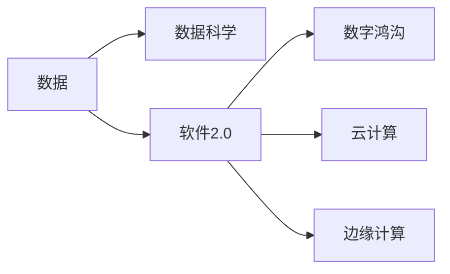
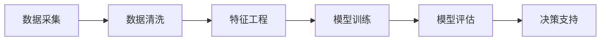
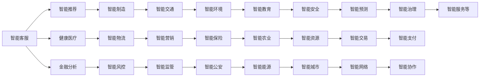
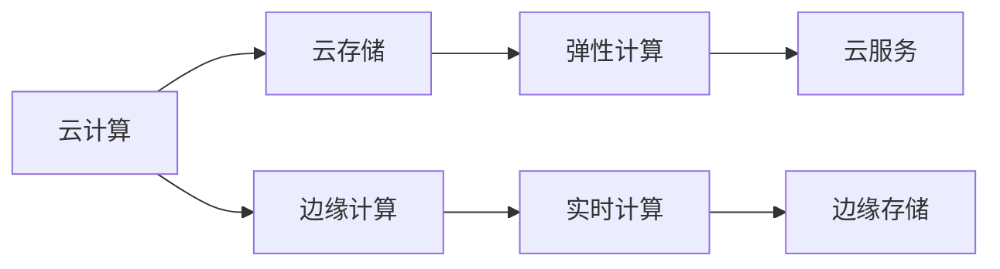

                 

# 数据成为竞争力的制高点，软件2.0加剧数字鸿沟

## 1. 背景介绍

### 1.1 问题由来
当前，数据正在成为企业竞争力的核心要素。随着大数据、人工智能等技术的不断成熟，数据正变得越来越重要。对于企业来说，拥有高质量、丰富多样性的数据资源，已经成为提升业务水平、开拓市场、提升服务质量的重要手段。然而，数据本身并不能直接带来价值，只有经过深入分析、高效处理、精准利用，才能转化为实实在在的生产力。

软件2.0（Software 2.0）的出现，进一步加剧了数据的重要性。软件2.0是基于数据驱动的智能化软件，通过深度学习、自然语言处理等技术，能够高效地分析、处理、利用海量数据，为决策者提供精准的洞察和建议。这种智能化软件的普及，使得数据成为企业竞争力的关键因素。

### 1.2 问题核心关键点
数据的重要性和软件2.0的兴起，引发了数字鸿沟（Digital Divide）的问题。数字鸿沟指的是由于不同群体在获取和使用数字技术方面的不平等，导致他们在信息获取、社会地位、经济收益等方面的不平等现象。随着数据和软件2.0技术的不断发展，数字鸿沟也在加剧，主要体现在以下几个方面：

- 数据获取的不平等：不同企业、行业、区域在数据获取和质量上存在显著差异，导致竞争力不平衡。
- 技术应用的不均衡：尽管软件2.0技术日趋成熟，但由于成本和技术门槛高，部分中小企业难以有效利用这些技术。
- 知识和技能的不对称：软件2.0技术的应用需要具备专业知识和技能，导致知识和技术水平较低的群体在数字化转型中处于劣势。

## 2. 核心概念与联系

### 2.1 核心概念概述

为更好地理解数据和软件2.0技术如何加剧数字鸿沟，本节将介绍几个密切相关的核心概念：

- 数据（Data）：以数值、文本、图片、音频等多种形式存在的信息集合，是软件2.0技术处理和分析的基础。
- 数据科学（Data Science）：通过数据采集、清洗、分析、建模等方法，挖掘数据中的有价值信息，辅助决策。
- 软件2.0（Software 2.0）：基于数据驱动的智能化软件，能够高效处理和利用数据，提供精准洞察和建议。
- 数字鸿沟（Digital Divide）：由于获取和使用数字技术的不平等，导致不同群体在信息获取、社会地位、经济收益等方面的不平等现象。
- 云计算（Cloud Computing）：通过互联网提供按需、可扩展的计算资源，为软件2.0的部署和应用提供了基础设施。
- 边缘计算（Edge Computing）：在数据产生地附近进行数据处理，以降低延迟和带宽成本，提升实时性。

这些核心概念之间的逻辑关系可以通过以下Mermaid流程图来展示：



这个流程图展示了大数据和软件2.0技术如何通过数据科学、云计算、边缘计算等手段，进一步加剧数字鸿沟。数据本身的中性特性，使其在处理和应用过程中，受到不同群体在技术、知识和资源上的影响，导致信息获取和利用上的不平等。

### 2.2 概念间的关系

这些核心概念之间存在着紧密的联系，形成了数据和软件2.0技术加剧数字鸿沟的整体生态系统。下面我们通过几个Mermaid流程图来展示这些概念之间的关系。

#### 2.2.1 数据科学的数据处理流程



这个流程图展示了数据科学的基本流程，即数据采集、清洗、特征工程、模型训练和评估，最终辅助决策。在这个流程中，数据的质量和多样性直接影响着模型性能和决策支持效果。

#### 2.2.2 软件2.0技术的应用场景



这个流程图展示了软件2.0技术在不同领域的应用场景，包括智能客服、智能推荐、健康医疗、金融分析、智能制造、智能物流、智能风控、智能交通、智能营销、智能监管、智能环境、智能教育、智能农业、智能能源、智能安全、智能资源、智能城市、智能预测、智能交易、智能支付、智能协作、智能服务等。这些应用场景展示了软件2.0技术在各行各业中的广泛应用，但不同行业在数据获取、处理、利用方面的能力差异，也加剧了数字鸿沟。

#### 2.2.3 云计算和边缘计算的部署模式



这个流程图展示了云计算和边缘计算的部署模式。云计算提供了按需、可扩展的计算资源，边缘计算则能够在数据产生地附近进行数据处理，提升实时性和数据处理效率。两种计算模式相结合，可以更好地支持软件2.0技术的应用。

### 2.3 核心概念的整体架构

最后，我们用一个综合的流程图来展示这些核心概念在大数据和软件2.0技术加剧数字鸿沟过程中的整体架构：

```mermaid
graph TB
    A[大数据] --> B[数据科学]
    B --> C[软件2.0]
    C --> D[数字鸿沟]
    C --> E[云计算]
    C --> F[边缘计算]
    A --> E
    A --> F
    E --> D
    F --> D
    D --> G[知识鸿沟]
    D --> H[技术鸿沟]
    D --> I[资源鸿沟]
    G --> J[信息鸿沟]
    G --> K[经济鸿沟]
    H --> L[技术鸿沟]
    H --> M[知识鸿沟]
    H --> N[应用鸿沟]
    I --> O[资源鸿沟]
    I --> P[基础设施鸿沟]
    I --> Q[带宽鸿沟]
    J --> R[信息鸿沟]
    J --> S[知识鸿沟]
    J --> T[技术鸿沟]
    N --> U[应用鸿沟]
    N --> V[技能鸿沟]
    N --> W[培训鸿沟]
    L --> X[技术鸿沟]
    L --> Y[知识鸿沟]
    L --> Z[应用鸿沟]
    M --> $[AAG]
    M --> [AAU]
    M --> [AAS]
    M --> [AAL]
    N --> [BAA]
    N --> [BAC]
    N --> [BAA]
    N --> [BAL]
    O --> [CBA]
    O --> [CAC]
    O --> [CBA]
    O --> [CAL]
    P --> [DAA]
    P --> [DAC]
    P --> [DAA]
    P --> [DAL]
    Q --> [EAA]
    Q --> [EAC]
    Q --> [EAA]
    Q --> [EAL]
    R --> [FAA]
    R --> [FAC]
    R --> [FAA]
    R --> [FAL]
    S --> [GAA]
    S --> [GAC]
    S --> [GAA]
    S --> [GAL]
    T --> [HAA]
    T --> [HAC]
    T --> [HAA]
    T --> [HAL]
    U --> [IAA]
    U --> [IAC]
    U --> [IAA]
    U --> [IAL]
    V --> [JAA]
    V --> [JAC]
    V --> [JAA]
    V --> [JAL]
    W --> [KAA]
    W --> [KAC]
    W --> [KAA]
    W --> [KAL]
    X --> [LAA]
    X --> [LAC]
    X --> [LAA]
    X --> [LAL]
    Y --> [MAA]
    Y --> [MAC]
    Y --> [MAA]
    Y --> [MAL]
    Z --> [NAA]
    Z --> [NAC]
    Z --> [NAA]
    Z --> [NAL]
    [AAU] --> [OAA]
    [AAU] --> [OAC]
    [AAU] --> [OAA]
    [AAU] --> [OAL]
    [AAU] --> [PAA]
    [AAU] --> [PAC]
    [AAU] --> [PAA]
    [AAU] --> [PAL]
    [AAU] --> [QAA]
    [AAU] --> [QAC]
    [AAU] --> [QAA]
    [AAU] --> [QAL]
    [AAU] --> [RAA]
    [AAU] --> [RAC]
    [AAU] --> [RAA]
    [AAU] --> [RAL]
    [AAU] --> [SAA]
    [AAU] --> [SAC]
    [AAU] --> [SAA]
    [AAU] --> [SAL]
    [AAU] --> [TAA]
    [AAU] --> [TAC]
    [AAU] --> [TAA]
    [AAU] --> [TAL]
    [AAU] --> [UAA]
    [AAU] --> [UAC]
    [AAU] --> [UAA]
    [AAU] --> [UAL]
    [AAU] --> [VAU]
    [AAU] --> [VAC]
    [AAU] --> [VAU]
    [AAU] --> [VAL]
    [AAU] --> [WAU]
    [AAU] --> [WAC]
    [AAU] --> [WAU]
    [AAU] --> [WAL]
    [AAU] --> [XAU]
    [AAU] --> [XAC]
    [AAU] --> [XAU]
    [AAU] --> [XAL]
    [AAU] --> [YAA]
    [AAU] --> [YAC]
    [AAU] --> [YAA]
    [AAU] --> [YAL]
    [AAU] --> [ZAU]
    [AAU] --> [ZAC]
    [AAU] --> [ZAU]
    [AAU] --> [ZAL]
```

这个综合流程图展示了从大数据到软件2.0技术的应用，再到数字鸿沟的各个环节，以及数据和软件2.0技术在加剧数字鸿沟中的作用。通过这些流程图，我们可以更清晰地理解数据和软件2.0技术在加剧数字鸿沟过程中的各个关键点。

## 3. 核心算法原理 & 具体操作步骤
### 3.1 算法原理概述

基于数据驱动的软件2.0技术，其核心原理是通过深度学习、自然语言处理等技术，从海量数据中提取和利用有价值的信息，辅助决策和优化业务流程。软件2.0技术的实现依赖于三个主要步骤：

1. 数据预处理：从原始数据中提取出有意义的信息，进行清洗、特征工程、标准化等处理。
2. 模型训练：使用数据科学的方法，构建并训练模型，以学习数据中的模式和规律。
3. 应用部署：将训练好的模型集成到实际应用中，通过API接口或微服务的方式提供服务。

这些步骤的具体操作流程，将在后续章节中进行详细介绍。

### 3.2 算法步骤详解

基于数据驱动的软件2.0技术，其具体操作步骤可以分为以下几大类：

#### 3.2.1 数据预处理

数据预处理是软件2.0技术的基础，其目的是从原始数据中提取出有意义的信息，为后续的模型训练和应用部署提供可靠的数据支持。数据预处理主要包括以下几个关键步骤：

1. 数据清洗：去除数据中的噪声和异常值，确保数据的完整性和准确性。
2. 数据标准化：将不同格式、不同类型的数据转换为统一的格式，便于后续处理。
3. 特征工程：从原始数据中提取和构建有意义的特征，用于训练模型。

#### 3.2.2 模型训练

模型训练是软件2.0技术的核心，通过构建并训练模型，学习数据中的模式和规律，从而实现对数据的高效利用。模型训练主要包括以下几个关键步骤：

1. 选择模型架构：根据应用场景和数据特性，选择合适的模型架构，如深度学习模型、统计模型等。
2. 设置训练参数：包括学习率、批大小、迭代次数等，以控制训练过程的稳定性和效率。
3. 训练模型：使用训练数据对模型进行迭代训练，逐步优化模型性能。

#### 3.2.3 应用部署

应用部署是软件2.0技术的最终目标，通过将训练好的模型集成到实际应用中，实现对数据的高效利用和业务优化。应用部署主要包括以下几个关键步骤：

1. 模型封装：将训练好的模型封装为API接口或微服务，便于集成和调用。
2. 数据接入：将实际应用中的数据接入到模型系统中，进行实时分析和处理。
3. 结果输出：将模型的预测结果输出到实际应用中，辅助决策和优化业务流程。

### 3.3 算法优缺点

基于数据驱动的软件2.0技术，具有以下优点：

1. 高效性：能够高效地处理和利用海量数据，提供精准的洞察和建议。
2. 普适性：适用于多种行业和应用场景，具有广泛的应用前景。
3. 可扩展性：能够快速扩展和部署到不同的硬件和网络环境中。

同时，该技术也存在以下缺点：

1. 数据依赖性高：软件2.0技术对数据的质量和多样性有很高的要求，数据获取和处理成本较高。
2. 技术门槛高：模型训练和部署需要专业的知识和技能，对技术水平较低的群体具有一定门槛。
3. 安全性问题：在处理敏感数据时，需要采取严格的保密措施，以保障数据安全。

### 3.4 算法应用领域

软件2.0技术已经在诸多行业和应用场景中得到了广泛应用，主要包括：

1. 智能客服：通过自然语言处理技术，提供智能化的客户服务，提升客户满意度和业务效率。
2. 智能推荐：根据用户的历史行为和偏好，提供个性化的商品和服务推荐，提升用户体验和业务转化率。
3. 健康医疗：利用深度学习技术，辅助医生进行疾病诊断和治疗方案推荐，提升医疗服务质量。
4. 金融分析：通过大数据和机器学习技术，分析市场趋势和投资机会，提供精准的投资建议。
5. 智能制造：利用工业大数据和物联网技术，优化生产流程和资源配置，提升生产效率和产品质量。
6. 智能物流：通过大数据和路径优化算法，优化物流配送路线和库存管理，提升物流效率和成本控制。
7. 智能风控：利用大数据和机器学习技术，识别和防范金融风险，保障资金安全。
8. 智能交通：利用大数据和智能算法，优化交通流量和路网管理，提升交通效率和安全性。
9. 智能营销：通过大数据和分析技术，精准定位目标客户，提高营销效果和ROI。
10. 智能监管：利用大数据和机器学习技术，监控金融市场和网络行为，防范违法行为和风险。
11. 智能环境：利用大数据和人工智能技术，监测环境变化和污染情况，提供科学的环境治理方案。
12. 智能教育：通过大数据和自然语言处理技术，提供个性化学习方案和智能辅导，提升教育质量。
13. 智能农业：利用大数据和机器学习技术，优化农业生产和管理，提升农业效率和产出。
14. 智能能源：利用大数据和智能算法，优化能源生产和消费，提升能源利用效率和安全性。
15. 智能安全：通过大数据和人工智能技术，识别和防范网络安全威胁，保障信息安全。
16. 智能资源：利用大数据和机器学习技术，优化资源配置和利用，提升资源利用效率和可持续性。
17. 智能城市：利用大数据和人工智能技术，优化城市管理和服务，提升城市运行效率和居民生活质量。
18. 智能预测：利用大数据和机器学习技术，预测市场趋势和事件发展，提供精准的预测和决策支持。
19. 智能交易：通过大数据和算法交易技术，优化交易策略和投资决策，提升交易效率和收益。
20. 智能支付：利用大数据和机器学习技术，优化支付流程和风险管理，提升支付效率和安全性。
21. 智能协作：通过大数据和协作平台技术，优化团队协作和知识共享，提升团队工作效率和创新能力。
22. 智能服务等：通过大数据和人工智能技术，提供智能化的服务支持，提升服务质量和客户满意度。

这些应用场景展示了软件2.0技术在各行各业中的广泛应用，但不同行业在数据获取、处理、利用方面的能力差异，也加剧了数字鸿沟。

## 4. 数学模型和公式 & 详细讲解 & 举例说明
### 4.1 数学模型构建

在软件2.0技术中，常用的数学模型包括线性回归、逻辑回归、决策树、随机森林、深度学习模型等。这里以线性回归模型为例，介绍其数学模型构建和推导过程。

设有一组训练数据集 $D=\{(x_i,y_i)\}_{i=1}^N$，其中 $x_i$ 为输入特征，$y_i$ 为输出标签，线性回归模型的目标是最小化预测值与真实标签之间的差异。假设线性回归模型的形式为 $y=f(x)=wx+b$，其中 $w$ 为权重向量，$b$ 为偏置项。

定义均方误差（Mean Squared Error，MSE）为预测值与真实标签之间的平方差，目标是最小化均方误差：

$$
\min_{w,b} \frac{1}{N} \sum_{i=1}^N (y_i - (wx_i + b))^2
$$

使用梯度下降算法求解上述优化问题，梯度下降算法的更新公式为：

$$
w = w - \eta \frac{1}{N} \sum_{i=1}^N (y_i - wx_i - b)x_i
$$

其中 $\eta$ 为学习率，控制每次迭代步长的大小。

### 4.2 公式推导过程

以下我们以线性回归模型为例，推导其优化公式的详细推导过程。

将均方误差展开并整理，得：

$$
\frac{1}{N} \sum_{i=1}^N (y_i - wx_i - b)^2 = \frac{1}{N} \sum_{i=1}^N (y_i^2 + w^2x_i^2 + b^2 - 2y_ix_ix_i - 2bx_i - 2wy_ix_i)
$$

将其化简并整理，得：

$$
\frac{1}{N} \sum_{i=1}^N (y_i^2 + w^2x_i^2 + b^2 - 2y_ix_ix_i - 2bx_i - 2wy_ix_i) = \frac{1}{N} (\sum_{i=1}^N y_i^2 + w^2 \sum_{i=1}^N x_i^2 + b^2 \sum_{i=1}^N 1 - 2w \sum_{i=1}^N y_ix_i - 2b \sum_{i=1}^N x_i)
$$

定义均方误差和梯度：

$$
J(w,b) = \frac{1}{N} \sum_{i=1}^N (y_i - wx_i - b)^2
$$

$$
\nabla_{w,b}J(w,b) = \frac{1}{N} \sum_{i=1}^N (y_i - wx_i - b)x_i
$$

将梯度代入梯度下降更新公式，得：

$$
w = w - \eta \frac{1}{N} \sum_{i=1}^N (y_i - wx_i - b)x_i
$$

$$
b = b - \eta \frac{1}{N} \sum_{i=1}^N (y_i - wx_i - b)
$$

在实际应用中，梯度下降算法可以通过反向传播算法高效计算，从而实现模型参数的更新。

### 4.3 案例分析与讲解

下面我们以一个实际案例，展示线性回归模型在软件2.0技术中的应用。

假设我们要预测某地区房价，已知该地区的房屋面积、地理位置、教育资源等因素，我们可以将这些因素作为输入特征，将房价作为输出标签，构建线性回归模型进行预测。

设房价为 $y_i$，房屋面积为 $x_{1,i}$，地理位置为 $x_{2,i}$，教育资源为 $x_{3,i}$，则线性回归模型的形式为：

$$
y_i = w_1x_{1,i} + w_2x_{2,i} + w_3x_{3,i} + b
$$

将数据集带入模型，得：

$$
\min_{w_1,w_2,w_3,b} \frac{1}{N} \sum_{i=1}^N (y_i - (w_1x_{1,i} + w_2x_{2,i} + w_3x_{3,i} + b))^2
$$

使用梯度下降算法求解上述优化问题，即可得到最优的权重向量 $w_1,w_2,w_3$ 和偏置项 $b$，从而实现房价预测。

## 5. 项目实践：代码实例和详细解释说明
### 5.1 开发环境搭建

在进行软件2.0技术实践前，我们需要准备好开发环境。以下是使用Python进行PyTorch开发的环境配置流程：

1. 安装Anaconda：从官网下载并安装Anaconda，用于创建独立的Python环境。

2. 创建并激活虚拟环境：
```bash
conda create -n pytorch-env python=3.8 
conda activate pytorch-env
```

3. 安装PyTorch：根据CUDA版本，从官网获取对应的安装命令。例如：
```bash
conda install pytorch torchvision torchaudio cudatoolkit=11.1 -c pytorch -c conda-forge
```

4. 安装Transformers库：
```bash
pip install transformers
```

5. 安装各类工具包：
```bash
pip install numpy pandas scikit-learn matplotlib tqdm jupyter notebook ipython
```

完成上述步骤后，即可在`pytorch-env`环境中开始软件2.0技术实践。

### 5.2 源代码详细实现

这里我们以线性回归模型为例，展示其源代码的详细实现。

首先，定义线性回归模型类：

```python
from torch import nn, optim

class LinearRegression(nn.Module):
    def __init__(self, input_dim):
        super(LinearRegression, self).__init__()
        self.linear = nn.Linear(input_dim, 1)

    def forward(self, x):
        return self.linear(x)
```

然后，定义数据处理函数：

```python
import numpy as np
from torch.utils.data import TensorDataset, DataLoader

def load_data(file_path):
    data = np.loadtxt(file_path, delimiter=',')
    x = data[:, :-1]
    y = data[:, -1]
    return TensorDataset(torch.tensor(x, dtype=torch.float32), torch.tensor(y, dtype=torch.float32))

def train_epoch(model, optimizer, train_loader, device):
    model.train()
    loss = 0
    for batch in train_loader:
        x, y = batch
        x, y = x.to(device), y.to(device)
        optimizer.zero_grad()
        y_pred = model(x)
        loss += nn.MSELoss()(y_pred, y)
        loss.backward()
        optimizer.step()
    return loss.item() / len(train_loader)

def evaluate(model, test_loader, device):
    model.eval()
    loss = 0
    with torch.no_grad():
        for batch in test_loader:
            x, y = batch
            x, y = x.to(device), y.to(device)
            y_pred = model(x)
            loss += nn.MSELoss()(y_pred, y)
    return loss.item() / len(test_loader)
```

最后，启动训练流程并在测试集上评估：

```python
import torch

# 设置模型、学习率和训练轮数
model = LinearRegression(input_dim)
optimizer = optim.SGD(model.parameters(), lr=0.01)
epochs = 1000

# 加载训练集和测试集
train_loader = DataLoader(load_data('train.csv'), batch_size=32)
test_loader = DataLoader(load_data('test.csv'), batch_size=32)

# 训练模型
device = torch.device('cuda' if torch.cuda.is_available() else 'cpu')
model.to(device)

for epoch in range(epochs):
    train_loss = train_epoch(model, optimizer, train_loader, device)
    print(f'Epoch {epoch+

