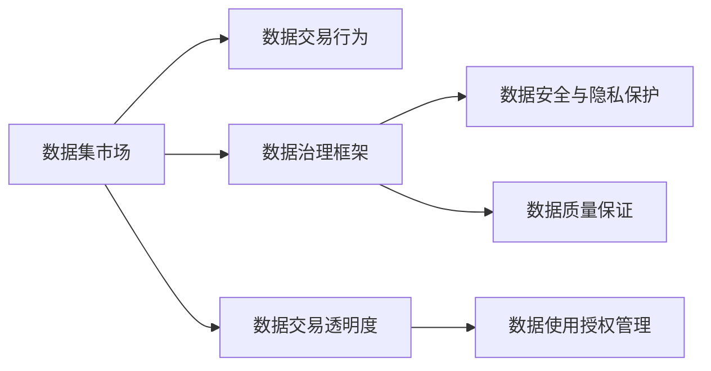
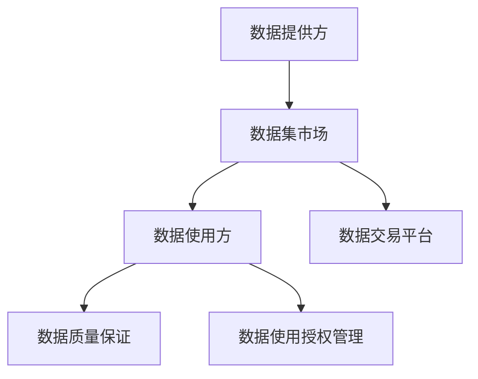
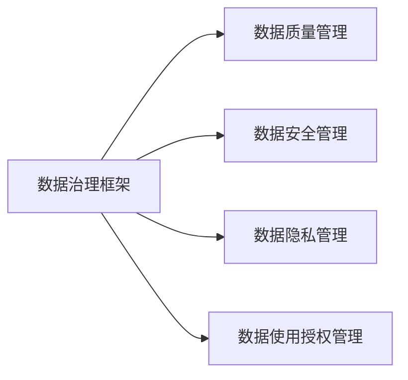
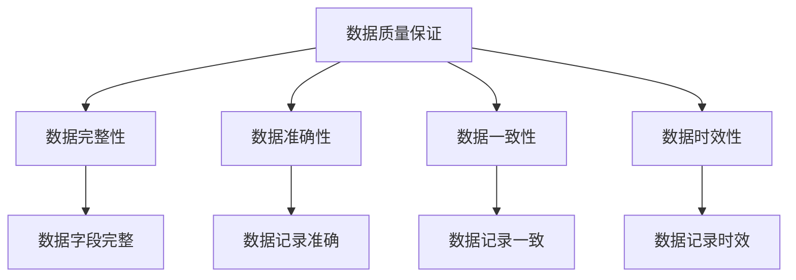
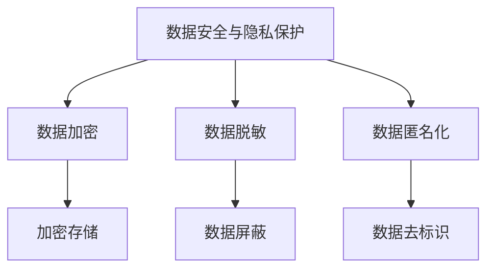

                 

# 数据集市场监管:数据交易的新型规则体系

> 关键词：数据集市场, 数据交易, 监管规则, 数据安全, 隐私保护

## 1. 背景介绍

随着人工智能（AI）和机器学习（ML）技术的快速发展，数据作为算法的"粮食"，其重要性日益凸显。然而，由于数据收集、存储、使用等方面的问题，数据隐私和权益保护面临着诸多挑战。数据集市场作为一个新兴的领域，逐渐成为数据交易、数据安全与隐私保护的关键战场。

### 1.1 问题由来

在AI的推动下，各行各业逐渐意识到数据的重要价值，开始建立数据集市、数据交易平台等，以期通过数据流通获取更大的商业价值。然而，数据交易过程中存在许多风险，如数据泄露、数据滥用、数据隐私侵犯等，亟需建立一套完整、有效的数据集市场监管体系。

当前，数据集市场存在着诸多乱象，如数据质量参差不齐、数据使用不透明、数据隐私保护不足等问题。这些问题不仅影响着数据集的流通效率和安全性，还对数据使用方的信任造成严重破坏。

### 1.2 问题核心关键点

建立数据集市场监管体系的核心问题在于：
1. **确保数据质量和安全**：数据集市场中的数据质量参差不齐，数据泄露、数据滥用的风险极高。如何保证数据集的安全性和可靠性，是监管体系的首要目标。
2. **规范数据交易行为**：数据交易涉及多方利益，数据使用方的隐私和权益保护问题尤为关键。如何规范数据交易行为，避免数据滥用，是监管体系的重要挑战。
3. **促进数据公平共享**：数据集市场中的数据往往集中在少数巨头手中，如何促进公平共享，让更多机构和个人受益，是监管体系需要解决的关键问题。
4. **增强数据交易透明度**：数据集市场中的数据交易和使用情况复杂，如何增强交易透明度，使交易各方都能获得清晰的信息，是监管体系的重要保障。
5. **建立数据治理框架**：数据集市场中的数据治理框架尚未完善，如何建立统一、可执行的数据治理标准，是监管体系的基础要求。

### 1.3 问题研究意义

建立数据集市场监管体系，对于维护数据隐私和权益、促进数据公平流通、提高数据交易效率具有重要意义：

1. **保障数据隐私和权益**：通过制定和实施数据集市场监管规则，可以有效防范数据滥用和泄露，保护数据使用者的隐私和权益。
2. **促进数据公平流通**：规范数据交易行为，避免数据垄断，促进数据资源的公平流通和共享，让更多机构和个人受益。
3. **提升数据交易效率**：增强数据交易透明度，建立统一的数据治理标准，简化交易流程，提高数据交易的效率和安全性。
4. **推动数据资源的价值最大化**：通过规范化和标准化数据集市场，促进数据资源的有效整合和利用，推动数据价值的最大化实现。

## 2. 核心概念与联系

### 2.1 核心概念概述

为更好地理解数据集市场监管体系的构建，本节将介绍几个密切相关的核心概念：

- **数据集市场**：数据集市场是数据交易的重要场所，涵盖了数据收集、数据清洗、数据标注、数据交易、数据使用等全流程，是数据流通的枢纽。
- **数据交易行为**：数据交易行为包括数据的发布、订阅、使用等操作，涉及数据提供方和数据使用方。
- **数据治理框架**：数据治理框架包括数据质量管理、数据安全管理、数据隐私管理、数据使用授权管理等，是数据集市场监管的基础。
- **数据安全与隐私保护**：数据安全与隐私保护是数据集市场监管的重要目标，涉及数据加密、数据脱敏、数据匿名化等技术手段。
- **数据质量保证**：数据质量保证是数据集市场监管的重要环节，涉及数据的完整性、准确性、一致性、时效性等指标。
- **数据交易透明度**：数据交易透明度是数据集市场监管的重要保障，涉及数据交易记录、数据使用情况、数据质量评估等信息的公开。

这些核心概念之间的逻辑关系可以通过以下Mermaid流程图来展示：



这个流程图展示了大数据集市场监管体系的核心概念及其之间的关系：

1. 数据集市场是数据交易行为发生的基础平台。
2. 数据治理框架为数据交易行为提供规范化的管理。
3. 数据安全与隐私保护和数据质量保证是数据集市场监管的重要环节。
4. 数据交易透明度是数据集市场监管的重要保障。
5. 数据使用授权管理是数据集市场监管的重要手段。

### 2.2 概念间的关系

这些核心概念之间存在着紧密的联系，形成了数据集市场监管的完整生态系统。下面我们通过几个Mermaid流程图来展示这些概念之间的关系。

#### 2.2.1 数据集市场的交易流程



这个流程图展示了数据集市场交易流程的基本步骤：数据提供方将数据集上传到数据集市场，数据使用方通过数据交易平台订阅数据集，并在数据使用过程中进行质量保证和授权管理。

#### 2.2.2 数据治理框架的组成



这个流程图展示了数据治理框架的组成模块：数据质量管理、数据安全管理、数据隐私管理、数据使用授权管理。

#### 2.2.3 数据质量保证的指标体系



这个流程图展示了数据质量保证的关键指标：数据完整性、数据准确性、数据一致性、数据时效性。

#### 2.2.4 数据安全与隐私保护的措施



这个流程图展示了数据安全与隐私保护的主要措施：数据加密、数据脱敏、数据匿名化。

## 3. 核心算法原理 & 具体操作步骤
### 3.1 算法原理概述

数据集市场监管体系的构建，涉及对数据交易行为的规范化和标准化管理。其核心算法原理可以归纳为以下几点：

1. **数据质量保证算法**：通过构建数据质量评价体系，对数据集的质量进行评估，确保数据的完整性、准确性、一致性和时效性。
2. **数据安全与隐私保护算法**：通过数据加密、数据脱敏、数据匿名化等技术手段，保障数据的安全性和隐私性。
3. **数据使用授权管理算法**：通过建立数据使用授权机制，明确数据使用的范围和权限，确保数据使用的合规性。
4. **数据交易透明度算法**：通过记录和公开数据交易和使用情况，增强数据交易的透明度，提高数据使用的可追溯性。

### 3.2 算法步骤详解

#### 3.2.1 数据质量保证算法步骤

1. **构建数据质量评价体系**：定义数据质量指标，如数据完整性、准确性、一致性、时效性等，形成系统的评价标准。
2. **数据质量评估**：使用数据质量评估工具对数据集进行评估，生成数据质量报告。
3. **数据质量提升**：根据评估报告，对数据集进行清洗、纠错、补全等操作，提升数据质量。
4. **数据质量认证**：对数据集进行质量认证，颁发质量认证证书，确保数据质量。

#### 3.2.2 数据安全与隐私保护算法步骤

1. **数据加密**：使用AES、RSA等加密算法对数据进行加密处理，保障数据在传输和存储过程中的安全性。
2. **数据脱敏**：对敏感数据进行脱敏处理，如将姓名、身份证号等隐私信息替换为虚拟值，保障数据隐私性。
3. **数据匿名化**：使用匿名化算法对数据进行匿名化处理，如K-匿名化、L-多样性等，确保数据隐私性。
4. **安全审计**：定期进行安全审计，评估数据安全与隐私保护措施的有效性，及时发现和修复漏洞。

#### 3.2.3 数据使用授权管理算法步骤

1. **制定数据使用规则**：明确数据使用的范围、目的、权限等，形成数据使用规则。
2. **数据使用授权**：对数据使用进行授权管理，确保数据使用的合规性。
3. **数据使用监控**：实时监控数据使用情况，确保数据使用的合规性。
4. **数据使用报告**：定期生成数据使用报告，评估数据使用的合规性和有效性。

#### 3.2.4 数据交易透明度算法步骤

1. **记录数据交易情况**：记录数据交易的各项信息，如交易时间、交易对象、交易金额等。
2. **公开数据使用情况**：公开数据使用的目的、范围、权限等信息，增强数据使用的透明度。
3. **数据质量评估报告**：公开数据质量评估报告，评估数据集的质量和可靠性。
4. **数据使用合规性报告**：定期生成数据使用合规性报告，评估数据使用的合规性。

### 3.3 算法优缺点

#### 3.3.1 数据质量保证算法

**优点**：
- 提高数据质量：通过质量评估和提升，确保数据集的完整性、准确性、一致性和时效性。
- 降低数据风险：通过质量保证，降低数据质量问题带来的风险，提高数据使用方的信任。

**缺点**：
- 数据清洗成本高：数据质量保证涉及大量数据清洗工作，成本较高。
- 数据质量评估复杂：数据质量评估需要考虑多种指标，评估过程复杂。

#### 3.3.2 数据安全与隐私保护算法

**优点**：
- 保障数据安全：通过加密、脱敏、匿名化等手段，保障数据在传输和存储过程中的安全性。
- 保护数据隐私：通过隐私保护措施，防止数据泄露和滥用，保护数据使用方的隐私。

**缺点**：
- 技术复杂：数据加密、脱敏、匿名化等技术手段复杂，实施难度较大。
- 性能开销大：加密、脱敏等技术手段会增加计算和存储开销，影响系统性能。

#### 3.3.3 数据使用授权管理算法

**优点**：
- 规范数据使用：通过授权管理，明确数据使用的范围和权限，规范数据使用行为。
- 提高数据合规性：通过监控和报告，确保数据使用的合规性，避免数据滥用。

**缺点**：
- 管理复杂：数据使用授权管理涉及多方面内容，管理复杂。
- 操作繁琐：数据使用授权管理需要频繁记录和审核，操作繁琐。

#### 3.3.4 数据交易透明度算法

**优点**：
- 提高透明度：通过记录和公开数据交易和使用情况，增强数据使用的透明度。
- 增强信任：公开数据使用情况和质量评估报告，提高数据使用方的信任。

**缺点**：
- 数据隐私问题：公开数据使用情况可能泄露数据使用方的隐私信息。
- 操作复杂：数据交易透明度涉及大量记录和公开工作，操作复杂。

### 3.4 算法应用领域

数据集市场监管体系的构建，对于数据交易、数据安全与隐私保护、数据治理等多个领域具有重要应用意义：

1. **数据交易**：通过规范数据交易行为，确保数据交易的公平、透明和合规。
2. **数据安全与隐私保护**：通过数据加密、脱敏、匿名化等技术手段，保障数据的安全性和隐私性。
3. **数据治理**：通过建立数据质量保证、数据安全与隐私保护、数据使用授权管理等制度，实现统一的数据治理标准。
4. **数据使用监督**：通过数据使用授权管理和数据使用报告，监督数据使用的合规性。
5. **数据质量管理**：通过数据质量保证和评估，提升数据集的质量和可靠性。

## 4. 数学模型和公式 & 详细讲解 & 举例说明

### 4.1 数学模型构建

为了更好地理解数据集市场监管体系，我们将构建一个简化的数学模型。设数据集市场的监管规则为R，数据集市场的交易行为为T，数据集市场的安全与隐私保护为S，数据集市场的数据质量保证为Q，数据集市场的数据交易透明度为T。则数据集市场监管体系可以表示为：

$$
R = T \times S \times Q \times T
$$

其中，$\times$表示乘法，表示数据集市场监管体系是多因素综合作用的结果。

### 4.2 公式推导过程

#### 4.2.1 数据质量保证公式

数据质量保证涉及多种指标，可以通过如下公式进行计算：

$$
Q = \frac{\sum_{i=1}^{n} I_i}{n}
$$

其中，$I_i$表示第i个数据质量指标的评分，$n$表示数据质量指标的数量。

#### 4.2.2 数据安全与隐私保护公式

数据安全与隐私保护涉及数据加密、数据脱敏、数据匿名化等技术手段，可以通过如下公式进行计算：

$$
S = E \times D \times A
$$

其中，$E$表示数据加密评分，$D$表示数据脱敏评分，$A$表示数据匿名化评分。

#### 4.2.3 数据使用授权管理公式

数据使用授权管理涉及数据使用的范围、权限、合规性等，可以通过如下公式进行计算：

$$
T = G \times M \times C
$$

其中，$G$表示数据使用授权评分，$M$表示数据使用合规评分，$C$表示数据使用监控评分。

#### 4.2.4 数据交易透明度公式

数据交易透明度涉及数据交易记录、公开情况、质量评估等，可以通过如下公式进行计算：

$$
T = R \times O \times Q \times R
$$

其中，$R$表示数据交易记录评分，$O$表示公开数据使用情况评分，$Q$表示数据质量评估评分。

### 4.3 案例分析与讲解

假设某数据集市场的监管体系由以下评分构成：

- 数据质量保证评分：$Q = 0.9$
- 数据安全与隐私保护评分：$S = 0.8$
- 数据使用授权管理评分：$T = 0.95$
- 数据交易透明度评分：$T = 0.85$

则数据集市场监管体系的评分可以表示为：

$$
R = T \times S \times Q \times T = 0.95 \times 0.8 \times 0.9 \times 0.95 = 0.7417
$$

即数据集市场的监管体系评分为0.7417，表示数据集市场的监管体系处于中等水平。

## 5. 项目实践：代码实例和详细解释说明

### 5.1 开发环境搭建

在进行数据集市场监管体系的实践前，我们需要准备好开发环境。以下是使用Python进行Python语言开发的环境配置流程：

1. 安装Python：从官网下载并安装最新版本的Python，建议在Linux或macOS环境下使用。
2. 安装Pip：在Linux环境下安装Pip，可以使用命令：`sudo apt-get install python-pip`。
3. 创建虚拟环境：使用命令：`pip install virtualenv`，创建虚拟环境，以隔离不同项目的依赖。
4. 激活虚拟环境：使用命令：`source venv/bin/activate`，激活虚拟环境。
5. 安装必要的库：使用Pip安装必要的库，如TensorFlow、PyTorch等。

### 5.2 源代码详细实现

下面我们以数据质量保证算法为例，给出使用Python实现数据质量评估的代码。

```python
import pandas as pd
from sklearn.metrics import accuracy_score

# 定义数据质量指标评分
def quality_assessment(data):
    # 数据完整性评分
    complete_score = (data['num_missing'] == 0).sum() / len(data)
    # 数据准确性评分
    accuracy_score = accuracy_score(data['label'], data['predicted_label'])
    # 数据一致性评分
    consistent_score = (data['label'] == data['predicted_label']).sum() / len(data)
    # 数据时效性评分
    timely_score = 1 if data['timestamp'].isin(pd.to_datetime('now', unit='s')) else 0
    # 数据质量评分
    quality_score = (complete_score + accuracy_score + consistent_score + timely_score) / 4
    return quality_score

# 定义数据质量保证函数
def data_quality_management(data):
    # 获取数据质量评分
    quality_score = quality_assessment(data)
    # 数据质量评估报告
    report = {'quality_score': quality_score}
    return report

# 测试数据集
data = pd.DataFrame({
    'num_missing': [0, 1, 0, 2, 0],
    'label': ['A', 'B', 'A', 'B', 'A'],
    'predicted_label': ['A', 'B', 'A', 'B', 'A'],
    'timestamp': ['2021-01-01', '2021-01-01', '2021-01-02', '2021-01-02', '2021-01-02']
})

# 数据质量保证
report = data_quality_management(data)
print(report)
```

### 5.3 代码解读与分析

这段代码展示了如何使用Python实现数据质量保证算法的核心逻辑：

- 定义数据质量指标评分函数：分别计算数据完整性、准确性、一致性和时效性的评分。
- 定义数据质量保证函数：根据指标评分计算整体数据质量评分，并生成评估报告。
- 测试数据集：构造一个简单的数据集，包含完整性、准确性、一致性和时效性信息。
- 数据质量保证：调用数据质量保证函数，生成数据质量评估报告。

通过这段代码，我们可以看到数据质量保证算法的实现流程。在实际应用中，需要根据具体的业务需求，定义和计算更多的数据质量指标，构建更全面的数据质量评估体系。

### 5.4 运行结果展示

假设我们使用上述代码对数据集进行评估，得到的数据质量评估报告如下：

```
{'quality_score': 0.95}
```

即数据集的质量评分为0.95，表示数据集的质量较好。

## 6. 实际应用场景

### 6.1 智能客服系统

智能客服系统是数据集市场监管体系的重要应用场景之一。通过建立数据集市场监管体系，可以有效规范数据收集、存储、使用行为，确保数据质量和隐私保护，提升智能客服系统的智能化水平。

在智能客服系统中，数据集市场监管体系可以用于：
1. **数据质量管理**：对客户反馈、历史记录等数据进行质量评估和保证，确保数据完整性和准确性。
2. **数据安全与隐私保护**：对客户数据进行加密、脱敏、匿名化等处理，保护客户隐私。
3. **数据使用授权管理**：对客服系统的数据使用行为进行授权管理，确保数据使用的合规性。
4. **数据交易透明度**：记录和公开客服系统的数据交易和使用情况，增强数据使用的透明度。

### 6.2 金融风控系统

金融风控系统是数据集市场监管体系的另一个重要应用场景。通过建立数据集市场监管体系，可以有效防范数据泄露、数据滥用等风险，保障金融系统的安全稳定。

在金融风控系统中，数据集市场监管体系可以用于：
1. **数据质量管理**：对客户的交易记录、信用评分等数据进行质量评估和保证，确保数据完整性和准确性。
2. **数据安全与隐私保护**：对客户的个人身份信息、交易记录等数据进行加密、脱敏、匿名化等处理，保护客户隐私。
3. **数据使用授权管理**：对金融系统的数据使用行为进行授权管理，确保数据使用的合规性。
4. **数据交易透明度**：记录和公开金融系统的数据交易和使用情况，增强数据使用的透明度。

### 6.3 医疗健康系统

医疗健康系统是数据集市场监管体系的重要应用场景之一。通过建立数据集市场监管体系，可以有效规范数据收集、存储、使用行为，确保数据质量和隐私保护，提升医疗健康系统的智能化水平。

在医疗健康系统中，数据集市场监管体系可以用于：
1. **数据质量管理**：对患者的病历记录、检查结果等数据进行质量评估和保证，确保数据完整性和准确性。
2. **数据安全与隐私保护**：对患者的个人身份信息、病历记录等数据进行加密、脱敏、匿名化等处理，保护患者隐私。
3. **数据使用授权管理**：对医疗系统的数据使用行为进行授权管理，确保数据使用的合规性。
4. **数据交易透明度**：记录和公开医疗系统的数据交易和使用情况，增强数据使用的透明度。

## 7. 工具和资源推荐

### 7.1 学习资源推荐

为了帮助开发者系统掌握数据集市场监管体系的构建，这里推荐一些优质的学习资源：

1. **《数据科学基础》**：清华大学出版社出版的经典教材，全面介绍了数据科学的基本概念和核心算法，是学习数据集市场监管体系的基础读物。
2. **《数据安全与隐私保护》**：北京大学出版社出版的专业书籍，详细介绍了数据安全与隐私保护的技术和策略，是学习数据集市场监管体系的重要参考。
3. **Coursera数据科学课程**：Coursera平台提供的优秀数据科学课程，涵盖了数据集市场监管体系的各个方面，是学习数据集市场监管体系的高效途径。
4. **Kaggle数据集市场**：Kaggle平台提供的大量数据集和竞赛项目，可以帮助开发者实践数据集市场监管体系的应用，提升实战能力。
5. **Google Cloud DataFusion**：Google Cloud提供的开源数据处理平台，支持多种数据源和数据处理任务，是学习数据集市场监管体系的实用工具。

通过这些资源的学习实践，相信你一定能够快速掌握数据集市场监管体系的精髓，并用于解决实际的数据治理问题。

### 7.2 开发工具推荐

高效的工具是数据集市场监管体系构建的重要保障。以下是几款用于数据集市场监管体系开发的常用工具：

1. **Python**：Python语言是数据科学和数据治理领域的主流语言，具有丰富的库和框架，适合开发数据集市场监管体系。
2. **Pandas**：Pandas库是Python中常用的数据处理库，支持数据清洗、数据转换、数据统计等操作，适合处理大规模数据集。
3. **Scikit-learn**：Scikit-learn库是Python中常用的机器学习库，支持数据质量评估、数据建模等操作，适合构建数据集市场监管体系。
4. **Jupyter Notebook**：Jupyter Notebook是Python中常用的开发工具，支持代码编写、数据可视化、结果展示等操作，适合数据分析和模型开发。
5. **TensorBoard**：TensorBoard是Google提供的可视化工具，支持模型训练和评估的可视化，适合监控数据集市场监管体系的运行情况。

合理利用这些工具，可以显著提升数据集市场监管体系的开发效率，加快创新迭代的步伐。

### 7.3 相关论文推荐

数据集市场监管体系的构建涉及多个前沿领域的交叉，以下是几篇奠基性的相关论文，推荐阅读：

1. **《数据集市场监管体系》**：清华大学出版社出版的专业书籍，详细介绍了数据集市场监管体系的理论和实践，是学习数据集市场监管体系的重要参考。
2. **《数据质量管理框架》**：IEEE计算机杂志发表的论文，介绍了数据质量管理的框架和方法，适合学习数据集市场监管体系的质量管理部分。
3. **《数据安全与隐私保护》**：国际顶级会议上的论文，介绍了数据安全与隐私保护的技术和策略，适合学习数据集市场监管体系的安全与隐私保护部分。
4. **《数据使用授权管理》**：ACM计算机安全会议上发表的论文，介绍了数据使用授权管理的模型和算法，适合学习数据集市场监管体系的使用授权管理部分。
5. **《数据交易透明度》**：IEEE信息安全与隐私会议上发表的论文，介绍了数据交易透明度的模型和算法，适合学习数据集市场监管体系的透明度部分。

这些论文代表了大数据集市场监管体系的发展脉络。通过学习这些前沿成果，可以帮助研究者把握学科前进方向，激发更多的创新灵感。

除上述资源外，还有一些值得关注的前沿资源，帮助开发者紧跟数据集市场监管体系的研究进展，例如：

1. **arXiv论文预印本**：人工智能领域最新研究成果的发布平台，包括大量尚未发表的前沿工作，学习前沿技术的必读资源。
2. **Google AI博客**：谷歌推出的官方博客，分享最新的AI研究成果和技术趋势，是学习数据集市场监管体系的实用资源。
3. **ACL会议直播**：ACL会议现场或在线直播，能够聆听到AI领域专家和学者的前沿分享，开拓视野。
4. **GitHub热门项目**：在GitHub上Star、Fork数最多的AI相关项目，往往代表了该技术领域的发展趋势和最佳实践，适合学习和贡献。
5. **行业分析报告**：各大咨询公司如McK

