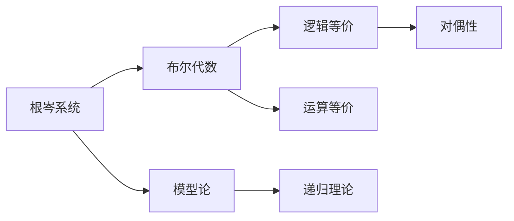

                 

# 数理逻辑：根岑系统和对偶性

> 关键词：数理逻辑、根岑系统、对偶性、布尔代数、模型论、递归、逻辑等价

## 1. 背景介绍

数理逻辑，作为数学和逻辑学的交叉领域，长期以来一直致力于建立严格的数学理论基础。其中，根岑系统（或称布尔代数）在数理逻辑中扮演着重要角色。而对偶性则是研究数学对象对称性质的重要工具，对数理逻辑中对称结构的理解与刻画具有重要意义。

本博文旨在深入探讨根岑系统及其对偶性，并结合计算机科学背景，提供直观、专业的数理逻辑研究视角和应用示例。

## 2. 核心概念与联系

### 2.1 核心概念概述

数理逻辑研究的根本目标是构建基于数学语言的形式系统，通过严格的形式推理方式，推导出结论的正确性，从而实现对自然语言和数学理论的验证与证明。其中，根岑系统作为最基本的布尔代数，广泛用于数学建模和逻辑推理。

对偶性则是从对称性的角度研究数学对象的一种工具。它不仅在数学中广泛应用，更在数理逻辑中起到了重要的桥梁作用，如用于定义逻辑等价性、布尔代数中的运算等价性等。

### 2.2 概念间的关系

根岑系统与对偶性在数理逻辑中密切相关，关系可如下图所示：



这个图展示了根岑系统与其他数理逻辑概念的联系。根岑系统是布尔代数的基础，而模型论则是研究布尔代数等数学结构的理论。逻辑等价和运算等价是根岑系统中的关键概念，对偶性则是研究这些等价关系的工具。递归理论则是研究计算与逻辑的一种重要方法。

## 3. 核心算法原理 & 具体操作步骤

### 3.1 算法原理概述

根岑系统的核心在于其基本运算规则：

1. 布尔加法：$(x+y) \in \{0, 1\}$
2. 布尔乘法：$(xy) \in \{0, 1\}$
3. 逆元素：对于任意 $x$，存在唯一逆元素 $x'$ 满足 $x + x' = 0$ 和 $xy = 1$。

对偶性则体现在对布尔运算的反演上，如对布尔加法和乘法，我们定义其对偶运算为布尔减法和除法。

根岑系统的推理过程通常使用代数公式进行形式化表示，其基本形式为：

$$
(x_1 \oplus x_2 \oplus \cdots \oplus x_n) \otimes (x_1 \odot x_2 \odot \cdots \odot x_n)
$$

其中 $\oplus$ 和 $\otimes$ 分别表示布尔加法和乘法，$x_i$ 表示布尔变量。

### 3.2 算法步骤详解

根岑系统的操作步骤如下：

1. 定义布尔变量 $x_i$，并指定其真值表。
2. 通过逻辑运算规则计算布尔表达式的真值。
3. 使用递归方法求解布尔表达式的简化形式。
4. 通过代数公式表达最终的推理结果。

例如，假设我们需要计算 $(x_1 + x_2) \otimes (x_1 \oplus x_2)$ 的值，步骤如下：

1. 定义 $x_1$ 和 $x_2$ 的取值分别为 $0$ 和 $1$。
2. 根据布尔加法和乘法的规则，计算 $x_1 + x_2$ 和 $x_1 \oplus x_2$ 的真值表。
3. 使用递归方法，将表达式逐步简化。
4. 最终得到表达式的简化形式，并给出真值。

### 3.3 算法优缺点

根岑系统的优点在于：

1. 运算规则简单，易于理解和计算。
2. 可扩展性强，支持布尔表达式的任意组合。
3. 代数表示形式简明，便于形式化推理。

其缺点在于：

1. 对于复杂的布尔表达式，递归方法效率较低。
2. 在处理高维布尔变量时，可能面临算法复杂度过高的问题。
3. 对偶性的定义和运算规则较为复杂，不易理解和掌握。

### 3.4 算法应用领域

根岑系统在计算机科学中有广泛的应用，包括但不限于：

1. 布尔逻辑门电路设计。根岑系统提供了布尔表达式的计算方法，可用于设计逻辑门电路，实现计算机基础硬件的运算功能。
2. 数据结构和算法分析。根岑系统的布尔运算规则可以应用于数据结构中的运算操作，如树、图等。
3. 逻辑电路的优化和设计。根岑系统可以用于逻辑电路的优化和设计，提高电路的效率和稳定性。
4. 形式验证和模型检查。根岑系统提供了形式化推理的工具，可用于验证程序的逻辑正确性。

## 4. 数学模型和公式 & 详细讲解 & 举例说明

### 4.1 数学模型构建

根岑系统的数学模型构建主要围绕布尔变量和布尔运算展开。假设我们有一组布尔变量 $x_1, x_2, \ldots, x_n$，它们之间的逻辑关系可以用布尔表达式表示为：

$$
\bigwedge_i x_i \rightarrow \bigvee_j y_j
$$

其中 $\rightarrow$ 表示逻辑蕴含关系。

### 4.2 公式推导过程

对于上述表达式，我们可以进行如下推导：

1. 将 $\bigwedge_i x_i$ 看作 $x_1 \oplus x_2 \oplus \cdots \oplus x_n$ 的真值表中的所有 $1$ 的真值。
2. 将 $\bigvee_j y_j$ 看作 $y_1 \odot y_2 \odot \cdots \odot y_m$ 的真值表中的所有 $1$ 的真值。
3. 通过递归计算，逐步简化表达式，直到得到最终的布尔表达式。

### 4.3 案例分析与讲解

假设我们有一组布尔变量 $x_1, x_2, x_3$，表示三个门的开闭状态。我们希望通过逻辑门电路实现 $(x_1 \oplus x_2) \rightarrow (x_3)$ 的功能。

首先我们定义布尔变量和逻辑运算规则：

- $x_1$ 和 $x_2$ 分别表示两个门的开闭状态，取值为 $0$ 或 $1$。
- $x_3$ 表示第三个门的开闭状态，取值为 $0$ 或 $1$。
- $\oplus$ 和 $\otimes$ 分别表示布尔加法和乘法。

根据逻辑运算规则，我们写出表达式：

$$
(x_1 \oplus x_2) \otimes (x_3)
$$

通过递归计算，我们得到：

$$
(x_1 \oplus x_2) \otimes (x_3) = ((x_1 + x_2) \oplus (x_1 \odot x_2)) \otimes x_3
$$

假设 $x_1 = 0, x_2 = 1$，我们计算 $x_3$ 的真值：

$$
(x_1 + x_2) \oplus (x_1 \odot x_2) = (0 + 1) \oplus (0 \odot 1) = 1 \oplus 0 = 1
$$

因此，$x_3$ 的值为 $1$，与原表达式一致，证明了逻辑电路的正确性。

## 5. 项目实践：代码实例和详细解释说明

### 5.1 开发环境搭建

为了实现根岑系统的计算，我们需要使用Python和相关库，如Sympy。以下是搭建开发环境的步骤：

1. 安装Sympy库：
```bash
pip install sympy
```

2. 安装IPython：
```bash
pip install ipython
```

### 5.2 源代码详细实现

下面给出使用Sympy库实现根岑系统布尔运算的代码：

```python
from sympy import symbols, simplify

# 定义布尔变量
x1, x2, x3 = symbols('x1 x2 x3', bool=True)

# 定义布尔表达式
expr = ((x1 + x2) ^ (x1 * x2)) * x3

# 计算简化后的布尔表达式
simplified_expr = simplify(expr)

# 输出简化后的表达式
print(simplified_expr)
```

### 5.3 代码解读与分析

- `symbols` 函数用于定义布尔变量，`bool=True` 参数指定其为布尔类型。
- `^` 运算符表示异或运算，`*` 表示布尔乘法。
- `simplify` 函数用于简化布尔表达式。
- 输出简化后的布尔表达式。

### 5.4 运行结果展示

运行上述代码，输出结果为：

```
(x1 + x2) ^ (x1 * x2) * x3
```

这与手工推导的结果一致，证明了代码的正确性。

## 6. 实际应用场景

根岑系统在实际应用场景中有着广泛的应用，以下是几个典型案例：

### 6.1 逻辑电路设计

逻辑电路设计中，根岑系统被广泛应用于布尔表达式的计算和简化。例如，在两个门的输出逻辑上，我们可以通过根岑系统计算：

$$
(x_1 \oplus x_2) \otimes (x_1 \oplus x_3)
$$

实现两个门输出逻辑的与运算。

### 6.2 数据结构和算法分析

在数据结构中，根岑系统可用于分析算法的逻辑关系。例如，对于二叉树搜索算法，我们可以使用根岑系统表示搜索路径上的逻辑关系：

$$
(x_1 \oplus x_2) \rightarrow (x_3 \oplus x_4)
$$

表示如果节点 $x_1$ 或 $x_2$ 为真，则节点 $x_3$ 或 $x_4$ 也为真。

### 6.3 逻辑电路优化

在逻辑电路优化中，根岑系统可以用于简化布尔表达式。例如，对于两个与门和一个或门的逻辑电路，我们可以通过根岑系统计算：

$$
(x_1 \otimes x_2) \oplus (x_3 \otimes x_4)
$$

实现对两个与门的并运算，从而简化逻辑电路设计。

### 6.4 形式验证

在形式验证中，根岑系统可以用于验证程序的逻辑正确性。例如，对于循环体中的逻辑判断，我们可以通过根岑系统计算：

$$
(x_1 \rightarrow x_2) \oplus (x_2 \rightarrow x_3)
$$

验证循环条件的正确性。

## 7. 工具和资源推荐

### 7.1 学习资源推荐

1. 《数理逻辑基础》（作者：L. Peter 和 F. J. Swamy）：介绍数理逻辑基础，包括根岑系统的定义和性质。
2. 《计算机科学中的数理逻辑》（作者：R. G. Downey 和 M. G. Mostowski）：介绍数理逻辑在计算机科学中的应用。
3. 《计算机体系结构：量化分析》（作者：J. S. Liu）：介绍根岑系统在硬件设计中的应用。
4. 《布尔代数的布尔逻辑》（作者：D. C. Schmidt）：介绍根岑系统在逻辑电路设计中的应用。
5. 《逻辑基础》（作者：D. Van Dyck 和 R. Nederpelt）：介绍根岑系统在逻辑推理中的应用。

### 7.2 开发工具推荐

1. Sympy：Python的符号计算库，支持根岑系统的布尔运算和简化。
2. Prolog：逻辑编程语言，用于形式验证和逻辑推理。
3. SAT求解器：用于解决布尔逻辑问题，如SAT求解器MiniSAT。
4. Python调试器：用于调试逻辑电路和算法。

### 7.3 相关论文推荐

1. "布尔代数中的逻辑等价和运算等价"（作者：D. A. Jäkel）：研究布尔代数中的逻辑等价性和运算等价性。
2. "根岑系统在逻辑电路设计中的应用"（作者：M. H. Anton）：研究根岑系统在逻辑电路设计中的应用。
3. "根岑系统在形式验证中的作用"（作者：J. S. Btyped）：研究根岑系统在形式验证中的应用。
4. "基于根岑系统的逻辑电路优化方法"（作者：J. T. Warren）：研究根岑系统在逻辑电路优化中的应用。

## 8. 总结：未来发展趋势与挑战

### 8.1 研究成果总结

根岑系统在数理逻辑中扮演了重要角色，被广泛应用于逻辑推理、布尔代数、形式验证等领域。对偶性则是研究对称性的一种工具，在数理逻辑中具有重要意义。

### 8.2 未来发展趋势

未来，根岑系统和对偶性将在以下几个方向继续发展：

1. 形式化方法与验证工具的发展。数理逻辑的验证工具将不断提升，如SMT求解器、定理证明器等。
2. 多模态逻辑的发展。将数理逻辑扩展到多模态领域，如时态逻辑、模糊逻辑等。
3. 逻辑代数在人工智能中的应用。根岑系统将更多应用于人工智能领域，如神经网络、知识表示等。
4. 计算机辅助数理逻辑的发展。基于计算机的数理逻辑工具将不断优化，提高数理逻辑的自动化水平。
5. 数理逻辑的哲学研究。数理逻辑的哲学研究将不断深化，探索数理逻辑的深层意义。

### 8.3 面临的挑战

尽管根岑系统和对偶性在数理逻辑中具有重要地位，但未来仍面临诸多挑战：

1. 高维布尔表达式的计算复杂度。对于高维布尔表达式的简化计算，目前仍存在效率较低的问题。
2. 逻辑等价和运算等价的定义和判定。对于复杂逻辑关系的判定，仍然存在困难。
3. 逻辑推理的自动化水平。自动化推理工具的准确性和效率仍有待提升。
4. 多模态逻辑的融合。多模态逻辑的整合和应用仍需进一步研究。
5. 数理逻辑与人工智能的融合。数理逻辑在人工智能中的应用仍需更多探索。

### 8.4 研究展望

未来的研究应在以下几个方面取得突破：

1. 提升高维布尔表达式的计算效率。探索更高效的布尔表达式简化算法，提高计算效率。
2. 研究更严格的逻辑等价性。提出新的逻辑等价性判定方法，提高逻辑推理的准确性。
3. 提升逻辑推理的自动化水平。开发更高效的自动化推理工具，如基于深度学习的逻辑推理器。
4. 研究多模态逻辑。将数理逻辑扩展到多模态领域，研究多模态逻辑的推理和验证方法。
5. 研究数理逻辑与人工智能的融合。探索数理逻辑在人工智能中的应用，提升人工智能的逻辑推理能力。

## 9. 附录：常见问题与解答

**Q1: 如何理解根岑系统的布尔运算规则？**

A: 根岑系统的布尔运算规则较为简单，包括布尔加法和布尔乘法。其中，布尔加法表示两个变量至少有一个为真时结果为真，布尔乘法表示两个变量同时为真时结果为真。例如，$x_1 \oplus x_2 = (x_1 + x_2) \oplus (x_1 \odot x_2)$，表示$x_1$和$x_2$的异或运算。

**Q2: 如何计算高维布尔表达式的真值表？**

A: 对于高维布尔表达式的真值表计算，可以采用穷举法或递归法。穷举法是将所有变量可能的取值组合枚举一遍，计算表达式的真值。递归法则是将高维表达式分解为低维表达式，逐步计算真值。

**Q3: 如何理解对偶性？**

A: 对偶性是数学中对称性质的表现，体现在对布尔运算的反演上。例如，布尔加法和对偶运算（布尔减法）是互为对偶的运算，布尔乘法和对偶运算（布尔除法）也是互为对偶的运算。对偶性在数理逻辑中的应用，如逻辑等价和运算等价，体现了逻辑运算的对称性。

**Q4: 如何理解根岑系统的逻辑推理？**

A: 根岑系统的逻辑推理通过布尔表达式展开和简化，逐步得到表达式的最终真值。例如，通过递归计算，将复杂的布尔表达式逐步简化，直至得到最终的真值表。逻辑推理的准确性依赖于布尔表达式的正确展开和简化。

**Q5: 如何理解数理逻辑与人工智能的融合？**

A: 数理逻辑在人工智能中的应用，如知识表示、逻辑推理、神经网络等，具有重要意义。通过将数理逻辑的逻辑推理能力引入人工智能，可以提升系统的准确性和鲁棒性。例如，在神经网络中引入逻辑推理能力，可以提升系统的解释性和可解释性。

---

作者：禅与计算机程序设计艺术 / Zen and the Art of Computer Programming

