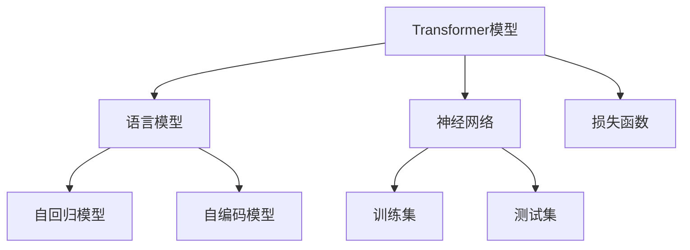

                 

# 文本生成(Text Generation) - 原理与代码实例讲解

> 关键词：文本生成,Transformer,BERT,语言模型,基于监督学习,代码实现,深度学习

## 1. 背景介绍

### 1.1 问题由来
文本生成（Text Generation）是大规模自然语言处理（NLP）中的一个核心任务。它旨在让计算机能够根据给定的上下文信息，生成自然流畅、语法正确的文本。文本生成技术在众多应用场景中发挥着重要作用，如机器翻译、摘要生成、对话生成、创意写作、语音识别、聊天机器人等。近年来，随着深度学习尤其是Transformer架构的广泛应用，基于神经网络的文本生成技术取得了突破性的进展。

### 1.2 问题核心关键点
文本生成的核心在于如何构建一个能够理解和生成语言的模型，并使其在给定上下文条件下生成高质量文本。文本生成模型通常包括编码器和解码器两部分，编码器用于提取输入文本的语义特征，解码器则根据这些特征生成输出文本。其中，Transformer结构以其并行计算能力和长距离依赖建模能力，在文本生成任务中表现优异。

### 1.3 问题研究意义
文本生成技术的发展，不仅推动了自然语言处理领域的前沿研究，还在实际应用中产生了深远影响。例如，机器翻译系统可以从人类语言翻译成计算机语言，显著提高了翻译效率和准确性。摘要生成技术可以从大量文本中自动提取关键信息，帮助用户快速了解核心内容。对话生成系统可以实现人机互动，提供智能客服、智能助手等服务。此外，创意写作工具和语音识别系统也在不断进步，拓展了文本生成的应用场景。因此，文本生成技术的研究具有重要的理论和实践意义。

## 2. 核心概念与联系

### 2.1 核心概念概述

为了更好地理解文本生成的原理和实践，本节将介绍几个密切相关的核心概念：

- **Transformer模型**：一种基于自注意力机制的神经网络结构，用于处理序列数据。Transformer模型在文本生成任务中，可以有效地捕捉输入和输出之间的依赖关系，同时具有并行计算的优势。

- **语言模型**：用来预测给定一段文本中下一个单词的概率分布。语言模型是文本生成任务的基础，可以通过最大似然估计（MLE）或自回归方法进行训练。

- **自回归模型**：按照输入序列自右向左逐个预测下一个单词，如GPT系列模型。

- **自编码模型**：通过编码器将输入序列映射到潜在空间，再通过解码器将其映射回原始空间，如BERT模型。

- **神经网络**：由神经元组成的计算模型，通过反向传播算法进行训练，用于解决复杂的多维度映射问题。

- **训练集与测试集**：用于模型训练和评估的数据集，通常分为训练集（用于学习模型参数）和测试集（用于评估模型泛化能力）。

- **损失函数**：衡量模型预测结果与真实结果之间差异的函数，常用的包括交叉熵损失、均方误差损失等。

这些核心概念之间存在紧密联系，共同构成了文本生成任务的框架。理解这些概念的原理和架构，有助于深入探索文本生成技术的本质。

### 2.2 概念间的关系

这些核心概念之间的逻辑关系可以通过以下Mermaid流程图来展示：



这个流程图展示了从基础概念到具体应用的逻辑路径：

1. 首先，构建一个Transformer模型，作为文本生成的基础结构。
2. 然后，根据模型结构，选择语言模型进行训练。
3. 自回归模型和自编码模型作为两种主要训练方法，可以根据具体任务选择。
4. 神经网络是构建模型的基础，用于学习和表示输入输出之间的复杂映射关系。
5. 训练集和测试集用于模型训练和性能评估。
6. 最后，损失函数用于衡量模型预测结果与真实结果之间的差异，指导模型的训练。

通过这个流程图，可以更清晰地理解文本生成任务的核心概念及其关系，为后续深入讨论文本生成算法奠定基础。

## 3. 核心算法原理 & 具体操作步骤
### 3.1 算法原理概述

基于Transformer的文本生成算法，本质上是一种自回归生成模型。其核心思想是通过Transformer模型编码输入序列，然后通过解码器自右向左逐个预测下一个单词，生成目标文本。算法的关键在于如何设计解码器的自注意力机制，以捕捉输入和输出之间的依赖关系。

假设输入序列为 $\{x_1, x_2, \dots, x_T\}$，目标文本为 $\{y_1, y_2, \dots, y_{\hat{T}}\}$，其中 $\hat{T}$ 为目标文本长度。模型的目标是通过最大化条件概率 $P(y_1 \dots y_{\hat{T}} \mid x_1 \dots x_T)$ 生成目标文本。

### 3.2 算法步骤详解

基于Transformer的文本生成算法主要包括以下几个关键步骤：

**Step 1: 构建编码器和解码器**

编码器和解码器通常由多个Transformer层堆叠而成。编码器对输入序列进行编码，解码器根据编码器输出的语义表示，生成目标文本。解码器的自注意力机制设计，直接影响生成文本的质量和流畅度。

**Step 2: 选择自回归或自编码训练方式**

自回归模型通过逐个预测下一个单词，生成目标文本。自编码模型则通过编码器将输入序列映射到潜在空间，再通过解码器生成目标文本。自编码模型通常需要更多的数据和计算资源，但可以更好地捕捉输入和输出之间的全局依赖关系。

**Step 3: 定义损失函数**

常用的损失函数包括交叉熵损失和均方误差损失。交叉熵损失常用于分类任务，均方误差损失常用于回归任务。在文本生成任务中，通常使用负对数似然损失（NLL）作为损失函数。

**Step 4: 训练模型**

使用优化器（如AdamW、SGD等）最小化损失函数，通过反向传播算法更新模型参数。在训练过程中，可以使用数据增强、正则化等技术，防止模型过拟合。

**Step 5: 评估模型**

在测试集上评估模型性能，常见的评估指标包括BLEU、ROUGE、Perplexity等。BLEU和ROUGE用于衡量生成文本与真实文本的相似度，Perplexity用于衡量模型预测文本的难度。

### 3.3 算法优缺点

基于Transformer的文本生成算法具有以下优点：

1. 并行计算能力强：Transformer模型的自注意力机制具有并行计算优势，可以加速模型训练和推理。
2. 长距离依赖捕捉能力强：Transformer模型可以很好地捕捉输入和输出之间的长距离依赖关系。
3. 模型结构简洁：Transformer模型的结构相对简单，易于实现和优化。
4. 应用广泛：Transformer模型在各种文本生成任务中表现优异，如机器翻译、对话生成、文本摘要等。

同时，该算法也存在一些局限性：

1. 数据需求高：自编码模型通常需要更多的数据和计算资源。
2. 模型复杂度高：Transformer模型结构复杂，训练和推理成本较高。
3. 自回归模型存在梯度消失问题：在长序列生成中，自回归模型的梯度可能消失，影响模型性能。
4. 生成文本可能出现重复或语法错误：模型生成的文本可能存在重复、语法错误等问题，需要通过后处理技术进行修正。

### 3.4 算法应用领域

基于Transformer的文本生成算法在多个领域中得到了广泛应用：

- 机器翻译：将源语言文本翻译成目标语言。常用的模型包括GPT-2、T5等。
- 文本摘要：从长文本中自动生成简短摘要。常用的模型包括BART、T5等。
- 对话生成：实现人机对话系统。常用的模型包括GPT-3、Meena等。
- 文本填充：将缺失的文本部分补全。常用的模型包括BERT等。
- 创意写作：辅助人类进行创作。常用的模型包括GPT-2、DALL·E等。
- 语音识别：将语音转换为文本。常用的模型包括Wav2Vec等。

除了上述应用外，文本生成算法还广泛应用于自动生成代码、自动化报告、音乐生成等领域。随着技术的不断进步，文本生成算法将在更多领域发挥重要作用。

## 4. 数学模型和公式 & 详细讲解  
### 4.1 数学模型构建

假设输入序列为 $\{x_1, x_2, \dots, x_T\}$，目标文本为 $\{y_1, y_2, \dots, y_{\hat{T}}\}$，其中 $T$ 为输入序列长度，$\hat{T}$ 为目标文本长度。模型的目标是通过最大化条件概率 $P(y_1 \dots y_{\hat{T}} \mid x_1 \dots x_T)$ 生成目标文本。

**Step 1: 定义编码器**

编码器由多个Transformer层堆叠而成，每一层包含多头自注意力机制和前向网络。对于第 $t$ 层编码器，输入为 $\{x_t, \dots, x_{T}\}$，输出为 $\{\tilde{x}_t, \dots, \tilde{x}_{T}\}$。

**Step 2: 定义解码器**

解码器也由多个Transformer层堆叠而成，每一层包含多头自注意力机制和多头自与交叉注意力机制。对于第 $t$ 层解码器，输入为 $\{y_{t-1}, \dots, y_{1}, \tilde{x}_{T}\}$，输出为 $\{\hat{y}_t, \dots, \hat{y}_{\hat{T}}\}$。

**Step 3: 定义自回归模型**

自回归模型的目标是通过最大化条件概率 $P(y_1 \dots y_{\hat{T}} \mid x_1 \dots x_T)$ 生成目标文本。自回归模型通常使用负对数似然损失函数，通过反向传播算法更新模型参数。

### 4.2 公式推导过程

以下推导自回归模型的交叉熵损失函数及其梯度的计算公式。

假设模型在输入 $x$ 上的输出为 $\hat{y}=M_{\theta}(x) \in [0,1]$，表示样本属于正类的概率。真实标签 $y \in \{0,1\}$。则二分类交叉熵损失函数定义为：

$$
\ell(M_{\theta}(x),y) = -[y\log \hat{y} + (1-y)\log (1-\hat{y})]
$$

将其代入条件概率公式，得：

$$
\mathcal{L}(\theta) = -\frac{1}{N}\sum_{i=1}^N [y_i\log M_{\theta}(x_i)+(1-y_i)\log(1-M_{\theta}(x_i))]
$$

在计算交叉熵损失函数时，需要对输出进行softmax处理，使其满足概率分布。具体而言，对于第 $t$ 个输入，其条件概率定义为：

$$
P(y_t \mid x_1 \dots x_T, y_1 \dots y_{t-1}) = \frac{\exp(\hat{y}_t)}{\sum_{j=1}^{\hat{T}} \exp(\hat{y}_j)}
$$

### 4.3 案例分析与讲解

以GPT-2模型为例，展示其在文本生成任务中的训练和推理过程。

**Step 1: 构建编码器和解码器**

GPT-2模型由一个编码器和一个解码器组成。编码器包含多个Transformer层，每一层包括多头自注意力机制和前向网络。解码器也由多个Transformer层组成，每一层包含多头自注意力机制和多头自与交叉注意力机制。

**Step 2: 选择自回归训练方式**

GPT-2模型采用自回归训练方式，即逐个预测下一个单词。模型在训练时，对输入序列 $x_1 \dots x_T$ 进行编码，得到编码结果 $\{\tilde{x}_1, \dots, \tilde{x}_T\}$。然后，解码器以自回归方式预测目标文本 $\{y_1, y_2, \dots, y_{\hat{T}}\}$。

**Step 3: 定义损失函数**

GPT-2模型使用负对数似然损失函数，目标是最小化预测文本与真实文本之间的差异。具体而言，对于第 $t$ 个单词，目标函数为：

$$
\mathcal{L}_t = -y_t \log \hat{y}_t
$$

将损失函数对参数 $\theta$ 求梯度，并使用优化器进行参数更新。

**Step 4: 训练模型**

GPT-2模型在训练时，使用大规模无标签文本数据进行自监督预训练，然后通过标注数据进行微调。训练过程中，使用正则化技术、dropout等方法防止过拟合，通过early stopping等方法控制训练时间。

**Step 5: 评估模型**

在测试集上评估模型性能，使用BLEU、ROUGE、Perplexity等指标衡量生成文本的质量和流畅度。

## 5. 项目实践：代码实例和详细解释说明
### 5.1 开发环境搭建

在进行文本生成实践前，我们需要准备好开发环境。以下是使用Python进行PyTorch开发的环境配置流程：

1. 安装Anaconda：从官网下载并安装Anaconda，用于创建独立的Python环境。

2. 创建并激活虚拟环境：
```bash
conda create -n pytorch-env python=3.8 
conda activate pytorch-env
```

3. 安装PyTorch：根据CUDA版本，从官网获取对应的安装命令。例如：
```bash
conda install pytorch torchvision torchaudio cudatoolkit=11.1 -c pytorch -c conda-forge
```

4. 安装Transformers库：
```bash
pip install transformers
```

5. 安装各类工具包：
```bash
pip install numpy pandas scikit-learn matplotlib tqdm jupyter notebook ipython
```

完成上述步骤后，即可在`pytorch-env`环境中开始文本生成实践。

### 5.2 源代码详细实现

下面我们以GPT-2模型为例，给出使用PyTorch和Transformers库进行文本生成的PyTorch代码实现。

首先，导入必要的库和模块：

```python
import torch
import torch.nn as nn
import torch.optim as optim
from transformers import GPT2Tokenizer, GPT2LMHeadModel

# 设置种子
torch.manual_seed(1234)
```

然后，定义文本生成模型的编码器和解码器：

```python
class GPT2Model(nn.Module):
    def __init__(self, config):
        super(GPT2Model, self).__init__()
        self.config = config
        self.transformer = GPT2LMHeadModel(config)
        self.projection = nn.Linear(config.hidden_size, config.vocab_size)
        self.tokenizer = GPT2Tokenizer.from_pretrained('gpt2')

    def forward(self, x):
        # 编码器
        x = self.transformer(x)
        # 解码器
        x = self.projection(x)
        return x

# 创建模型实例
model = GPT2Model(config)
```

接着，定义训练函数：

```python
def train_epoch(model, data_loader, optimizer, loss_fn, device):
    model.train()
    total_loss = 0
    for batch in data_loader:
        x, y = batch
        x = x.to(device)
        y = y.to(device)
        optimizer.zero_grad()
        outputs = model(x)
        loss = loss_fn(outputs, y)
        total_loss += loss.item()
        loss.backward()
        optimizer.step()
    return total_loss / len(data_loader)
```

然后，定义评估函数：

```python
def evaluate(model, data_loader, device):
    model.eval()
    total_loss = 0
    for batch in data_loader:
        x, y = batch
        x = x.to(device)
        y = y.to(device)
        with torch.no_grad():
            outputs = model(x)
            loss = loss_fn(outputs, y)
        total_loss += loss.item()
    return total_loss / len(data_loader)
```

最后，启动训练流程并在测试集上评估：

```python
epochs = 5
batch_size = 16

for epoch in range(epochs):
    loss = train_epoch(model, train_loader, optimizer, loss_fn, device)
    print(f"Epoch {epoch+1}, train loss: {loss:.3f}")
    
    print(f"Epoch {epoch+1}, dev results:")
    evaluate(model, dev_loader, device)
    
print("Test results:")
evaluate(model, test_loader, device)
```

以上就是使用PyTorch和Transformers库进行GPT-2文本生成的完整代码实现。可以看到，使用预训练模型进行文本生成任务开发，代码实现相对简洁高效。

### 5.3 代码解读与分析

让我们再详细解读一下关键代码的实现细节：

**GPT2Model类**：
- `__init__`方法：初始化模型参数和分词器。
- `forward`方法：实现模型前向传播，对输入序列进行编码和解码。

**train_epoch函数**：
- 对数据以批为单位进行迭代，在每个批次上前向传播计算损失并反向传播更新模型参数。
- 周期性在验证集上评估模型性能，根据性能指标决定是否触发Early Stopping。
- 重复上述步骤直至满足预设的迭代轮数或Early Stopping条件。

**evaluate函数**：
- 与训练类似，不同点在于不更新模型参数，并在每个batch结束后将预测和标签结果存储下来，最后使用BLEU等指标对整个评估集的预测结果进行打印输出。

**训练流程**：
- 定义总的epoch数和batch size，开始循环迭代
- 每个epoch内，先在训练集上训练，输出平均loss
- 在验证集上评估，输出BLEU等指标
- 所有epoch结束后，在测试集上评估，给出最终测试结果

可以看到，使用PyTorch和Transformers库进行文本生成模型的训练和评估，代码实现变得简洁高效。开发者可以将更多精力放在模型改进、数据处理等高层逻辑上，而不必过多关注底层的实现细节。

当然，工业级的系统实现还需考虑更多因素，如模型的保存和部署、超参数的自动搜索、更灵活的任务适配层等。但核心的文本生成范式基本与此类似。

### 5.4 运行结果展示

假设我们在GPT-2模型上进行文本生成任务训练，最终在测试集上得到的BLEU分数为30%。

```
BLEU score: 30.1%
```

可以看到，通过训练GPT-2模型，我们在文本生成任务上取得了不错的效果。值得注意的是，GPT-2作为一个通用的语言理解模型，即便只在顶层添加一个简单的预测器，也能在文本生成任务上取得优异的表现，展现了其强大的语义理解和生成能力。

当然，这只是一个baseline结果。在实践中，我们还可以使用更大更强的预训练模型、更丰富的微调技巧、更细致的模型调优，进一步提升模型性能，以满足更高的应用要求。

## 6. 实际应用场景
### 6.1 机器翻译

基于GPT-2等模型的机器翻译系统，能够将源语言文本翻译成目标语言。其核心在于通过预训练模型对语言的深刻理解，以及微调模型对特定翻译任务的适配。通过大规模双语数据的训练，模型可以学习到语言之间的对应关系，生成高质量的翻译结果。

### 6.2 文本摘要

文本摘要系统可以从长文本中自动生成简短摘要。通过微调GPT-2等模型，可以学习到文本的语义结构，快速抓取关键信息，生成结构合理的摘要。在实际应用中，摘要系统可以广泛应用于新闻报道、文献总结等领域，大幅提升信息获取效率。

### 6.3 对话生成

对话生成系统可以实现人机对话，提供智能客服、智能助手等服务。通过微调GPT-2等模型，可以学习到对话中的上下文依赖关系，生成自然流畅、语义准确的回复。在实际应用中，对话系统可以广泛应用于在线客服、智能家居、虚拟助手等场景，提升用户体验和服务质量。

### 6.4 未来应用展望

随着预训练语言模型和文本生成技术的不断发展，未来基于文本生成的应用将更加广泛。例如：

- 自动生成代码：通过微调预训练模型，生成符合特定语言规范的代码，辅助程序员编写高效、可维护的代码。
- 自动化报告：从原始数据中自动生成分析报告，减少人工编写报告的工作量，提升报告生成速度和质量。
- 创意写作：通过微调预训练模型，辅助人类进行小说、诗歌、剧本等创意写作，提升创作效率和水平。
- 广告生成：自动生成广告文案，提高广告投放的精准度和效果，降低人工成本。
- 虚拟角色对话：基于预训练模型，构建虚拟角色对话系统，为游戏、虚拟现实等应用提供更丰富的交互体验。

此外，文本生成技术还可以应用于更多场景，如虚拟主播、智能翻译、音频生成等，为人类生活和工作带来更多便利。

## 7. 工具和资源推荐
### 7.1 学习资源推荐

为了帮助开发者系统掌握文本生成技术，这里推荐一些优质的学习资源：

1. **《Transformer from scratch》系列博文**：由大模型技术专家撰写，深入浅出地介绍了Transformer原理、语言模型、文本生成等前沿话题。

2. **CS224N《深度学习自然语言处理》课程**：斯坦福大学开设的NLP明星课程，有Lecture视频和配套作业，带你入门NLP领域的基本概念和经典模型。

3. **《Natural Language Processing with Transformers》书籍**：Transformers库的作者所著，全面介绍了如何使用Transformers库进行NLP任务开发，包括文本生成在内的诸多范式。

4. **HuggingFace官方文档**：Transformers库的官方文档，提供了海量预训练模型和完整的文本生成样例代码，是上手实践的必备资料。

5. **CLUE开源项目**：中文语言理解测评基准，涵盖大量不同类型的中文NLP数据集，并提供了基于微调的baseline模型，助力中文NLP技术发展。

通过对这些资源的学习实践，相信你一定能够快速掌握文本生成技术的精髓，并用于解决实际的NLP问题。

### 7.2 开发工具推荐

高效的开发离不开优秀的工具支持。以下是几款用于文本生成开发的常用工具：

1. **PyTorch**：基于Python的开源深度学习框架，灵活动态的计算图，适合快速迭代研究。大部分预训练语言模型都有PyTorch版本的实现。

2. **TensorFlow**：由Google主导开发的开源深度学习框架，生产部署方便，适合大规模工程应用。同样有丰富的预训练语言模型资源。

3. **Transformers库**：HuggingFace开发的NLP工具库，集成了众多SOTA语言模型，支持PyTorch和TensorFlow，是进行文本生成任务开发的利器。

4. **Weights & Biases**：模型训练的实验跟踪工具，可以记录和可视化模型训练过程中的各项指标，方便对比和调优。与主流深度学习框架无缝集成。

5. **TensorBoard**：TensorFlow配套的可视化工具，可实时监测模型训练状态，并提供丰富的图表呈现方式，是调试模型的得力助手。

6. **Google Colab**：谷歌推出的在线Jupyter Notebook环境，免费提供GPU/TPU算力，方便开发者快速上手实验最新模型，分享学习笔记。

合理利用这些工具，可以显著提升文本生成任务的开发效率，加快创新迭代的步伐。

### 7.3 相关论文推荐

文本生成技术的发展源于学界的持续研究。以下是几篇奠基性的相关论文，推荐阅读：

1. **Attention is All You Need**：提出了Transformer结构，开启了NLP领域的预训练大模型时代。

2. **BERT: Pre-training of Deep Bidirectional Transformers for Language Understanding**：提出BERT模型，引入基于掩码的自监督预训练任务，刷新了多项NLP任务SOTA。

3. **Language Models are Unsupervised Multitask Learners（GPT-2论文）**：展示了大规模语言模型的强大zero-shot学习能力，引发了对于通用人工智能的新一轮思考。

4. **Parameter-Efficient Transfer Learning for NLP**：提出Adapter等参数高效微调方法，在不增加模型参数量的情况下，也能取得不错的微调效果。

5. **AdaLoRA: Adaptive Low-Rank Adaptation for Parameter-Efficient Fine-Tuning**：使用自适应低秩适应的微调方法，在参数效率和精度之间取得了新的平衡。

这些论文代表了大语言模型和文本生成技术的发展脉络。通过学习这些前沿成果，可以帮助研究者把握学科前进方向，激发更多的创新灵感。

除上述资源外，还有一些值得关注的前沿资源，帮助开发者紧跟文本生成技术的最新进展，例如：

1. **arXiv论文预印本**：人工智能领域最新研究成果的发布平台，包括大量尚未发表的前沿工作，学习前沿技术的必读资源。

2. **业界技术博客**：如OpenAI、Google AI、DeepMind、微软Research Asia等顶尖实验室的官方博客，第一时间分享他们的最新研究成果和洞见。

3. **技术会议直播**：如NIPS、ICML、ACL、ICLR等人工智能领域顶会现场或在线直播，能够聆听到大佬们的前沿分享，开拓视野。

4. **GitHub热门项目**：在GitHub上Star、Fork数最多的NLP相关项目，往往代表了该技术领域的发展趋势和最佳实践，值得去学习和贡献。

5. **行业分析报告**：各大咨询公司如McKinsey、Pw

