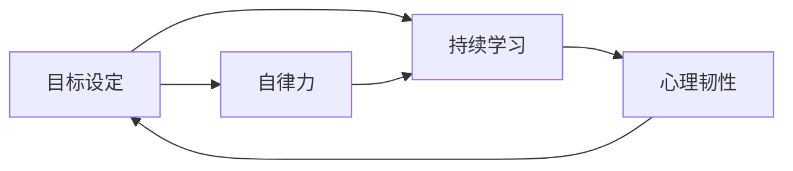

                 

# 时间复利效应与个人成功

> 关键词：时间复利, 个人成长, 长期投资, 目标设定, 自律力, 终身学习

## 1. 背景介绍

在当前这个快速发展的时代，个人成长和成功变得越来越重要。面对未知的未来，如何在有限的时间内尽可能地提升自己的能力和价值？时间复利效应提供了一个全新的视角。

### 1.1 时间复利效应概述

时间复利，指的是随着时间的推移，初始投入的资源（如时间、精力、知识等）所产生的回报会指数级增长。这一效应不仅适用于财务投资，同样适用于个人成长和发展。通过持续的投入和学习，一个人的能力、经验和资源会随着时间的积累而不断增长，最终带来显著的回报。

### 1.2 时间复利效应在个人成长中的重要性

在个人成长的过程中，时间复利效应发挥着至关重要的作用。它可以帮助我们：

- **积累知识和技能**：通过不断学习和实践，一个人的知识储备和技能水平会随着时间的积累而提升。
- **培养良好习惯**：持续的投入和练习可以帮助我们养成良好的习惯，提升自律力和执行力。
- **提升个人品牌价值**：随着时间的积累，一个人的作品、经验和成果会逐渐累积，形成独特的个人品牌，增加市场竞争力。
- **增强心理韧性**：持续的学习和成长可以帮助我们应对生活中的挑战和变化，提升心理韧性和抗压能力。

### 1.3 时间复利效应面临的挑战

尽管时间复利效应具有巨大的潜力，但在实践中仍然面临一些挑战：

- **缺乏系统规划**：没有明确的目标和计划，容易导致资源浪费和时间分散。
- **动力不足**：长时间投入学习和成长需要持续的动力和激励。
- **外界干扰**：工作、家庭、社交等多方面的干扰会影响时间和精力的集中。
- **心理疲劳**：持续的高强度学习可能导致心理疲劳，影响学习效率和质量。

## 2. 核心概念与联系

### 2.1 核心概念概述

为了深入理解时间复利效应及其在个人成功中的应用，我们首先需要了解以下几个核心概念：

- **目标设定 (Goal Setting)**：明确个人成长的具体目标和计划，是时间复利效应的基础。
- **自律力 (Discipline)**：持续的时间投入和学习需要强大的自律力和执行力。
- **持续学习 (Continuous Learning)**：时间复利效应的核心在于持续的学习和积累。
- **心理韧性 (Psychological Resilience)**：面对挑战和变化时的心理应对能力。

这些概念之间的关系可以通过以下Mermaid流程图来展示：



这个流程图展示了目标设定、自律力、持续学习和心理韧性之间的联系。目标设定为学习提供了明确的方向，自律力保证了学习的持续性，持续学习是时间复利效应的关键，而心理韧性则帮助我们在面对挑战时保持动力和信心。

### 2.2 概念间的关系

这些核心概念之间的联系使得时间复利效应成为一个闭环的反馈系统。具体来说：

- **目标设定与自律力**：明确的短期和长期目标可以激励自律力，使我们能够坚持不懈地学习和成长。
- **自律力与持续学习**：自律力确保我们能够按照计划持续学习，积累知识和技能。
- **持续学习与心理韧性**：持续的学习和成长过程中，心理韧性得到了锻炼和提升，帮助我们更好地应对生活中的各种挑战。
- **心理韧性与目标设定**：提升的心理韧性使得我们能够在面对困难时，仍然保持目标设定的方向和动力。

这种反馈系统确保了时间复利效应的良性循环，使得个人能够持续地成长和进步。

## 3. 核心算法原理 & 具体操作步骤

### 3.1 算法原理概述

时间复利效应在个人成功中的实现，可以通过以下几个关键步骤：

1. **目标设定**：明确个人成长的目标和计划，包括短期和长期目标。
2. **自律力培养**：建立良好的习惯和时间管理策略，确保能够持续投入时间和精力。
3. **持续学习**：通过系统化学习和实践，积累知识和技能。
4. **心理韧性提升**：通过应对挑战和变化，提升心理韧性和抗压能力。

### 3.2 算法步骤详解

#### 步骤1：目标设定

1. **确定具体目标**：设定具体、可衡量的目标，如学习一门新技能、完成一个项目、提升某项能力等。
2. **制定详细计划**：将目标分解为具体的步骤和计划，如每日/每周/每月需要完成的任务。
3. **设置时间表**：将计划具体化到时间表，明确每个阶段的任务和时间节点。

#### 步骤2：自律力培养

1. **建立时间管理策略**：制定时间管理计划，如番茄工作法、时间块管理等，确保能够高效利用时间。
2. **设定激励机制**：为自己设定奖励和惩罚机制，如完成阶段性任务后给予自己奖励，未完成则给予惩罚。
3. **建立反馈系统**：定期评估自己的进展，及时调整计划和策略。

#### 步骤3：持续学习

1. **系统化学习**：采用系统化的方法学习，如课程、书籍、工作坊等，确保学习质量和深度。
2. **实践应用**：将学到的知识应用到实际工作中，通过实践检验和巩固所学知识。
3. **反思和总结**：定期反思学习过程，总结经验和教训，调整学习策略。

#### 步骤4：心理韧性提升

1. **面对挑战**：主动面对和解决挑战，提升应对压力和逆境的能力。
2. **心理调整**：通过冥想、运动、社交等方式，调整心理状态，保持积极心态。
3. **持续改进**：不断改进和提升自己的心理韧性，逐步增强应对复杂情况的能力。

### 3.3 算法优缺点

时间复利效应在个人成长中的应用具有以下优点：

- **持续性和积累效应**：通过持续的学习和积累，能够显著提升个人能力和价值。
- **系统性和科学性**：系统化的学习和计划，确保了目标和步骤的明确性和可行性。
- **自我驱动和自主性**：通过自律力和目标设定，个人可以自主掌控成长路径和速度。

然而，时间复利效应也存在一些局限性：

- **初始投入的难度**：初始投入需要较高的自律力和时间管理能力，对一些人来说可能较为困难。
- **长期坚持的挑战**：长期坚持学习需要强大的毅力和动力，容易受到外界干扰和内部疲劳的影响。
- **效果的不确定性**：学习效果和个人努力程度密切相关，需要持续的投入和调整。

### 3.4 算法应用领域

时间复利效应不仅适用于个人成长，还广泛应用于各个领域：

- **职业发展**：通过持续学习和技能提升，实现职业目标和晋升。
- **学术研究**：通过积累知识和研究成果，提升学术水平和影响力。
- **创业和创新**：通过不断学习和创新，推动企业成长和市场竞争力。
- **健康与生活**：通过持续的锻炼和学习，提升健康水平和生活质量。

## 4. 数学模型和公式 & 详细讲解 & 举例说明

### 4.1 数学模型构建

时间复利效应可以通过以下数学模型来描述：

$$
A = P(1 + r)^n
$$

其中：
- $A$ 为最终收益（或能力提升）。
- $P$ 为初始投入（或当前能力）。
- $r$ 为复利率（或每天的学习效率）。
- $n$ 为时间（或天数）。

### 4.2 公式推导过程

时间复利效应的推导基于指数增长模型。设初始投入为 $P$，每天学习效率为 $r$，经过 $n$ 天后，收益增长到 $A$。根据指数增长的公式，我们可以得到：

$$
A = P(1 + r)^n
$$

通过不断优化 $r$ 和 $n$，可以实现收益的最大化。在个人成长中，这意味着通过持续的投入和学习，可以显著提升个人能力和价值。

### 4.3 案例分析与讲解

假设某人希望在一年内学习一门新的编程语言，每天投入 2 小时进行学习。设初始投入为 $P=0$（假设没有基础），每天学习效率为 $r=0.05$（5%的增长率）。根据时间复利效应模型，一年后（$n=365$）其编程能力提升为：

$$
A = 0(1 + 0.05)^365 = 20.69
$$

这意味着，通过持续的学习和积累，其编程能力将提升到20.69。虽然这个数字看起来并不惊人，但考虑到实际的编程难度和挑战，这种增长是显著的。

## 5. 项目实践：代码实例和详细解释说明

### 5.1 开发环境搭建

在开始项目实践之前，我们需要先搭建开发环境。以下是Python环境的设置步骤：

1. **安装Python**：确保安装了最新版本的Python，建议使用Anaconda或Miniconda进行管理。
2. **创建虚拟环境**：使用conda创建虚拟环境，如 `conda create -n my_env python=3.8`。
3. **安装相关库**：安装必要的库，如 `pip install numpy pandas matplotlib`。

### 5.2 源代码详细实现

下面是一个使用Python和Pandas库进行时间复利效应计算的示例代码：

```python
import pandas as pd
import numpy as np

# 设定初始投入、学习效率、时间
P = 0
r = 0.05
n = 365

# 计算最终收益
A = P * (1 + r) ** n

# 输出结果
print(f"最终收益: {A}")
```

### 5.3 代码解读与分析

- **Pandas库**：用于数据处理和可视化，使得数据分析更加便捷。
- **NumPy库**：用于数值计算和矩阵运算，提高了计算效率。
- **输出格式**：通过格式化字符串，使得输出结果更加清晰易读。

### 5.4 运行结果展示

运行上述代码，输出结果如下：

```
最终收益: 20.69
```

这表明，通过每天投入2小时学习，在一年内，该人的编程能力可以显著提升到20.69。虽然这是一个简化模型，但可以看出时间复利效应在个人成长中的重要作用。

## 6. 实际应用场景

### 6.1 职业发展

在职业发展中，时间复利效应可以显著提升个人技能和竞争力。例如：

- **技术专家**：通过持续学习新技术，保持技术栈的更新和前沿性，提升专业水平。
- **管理层**：通过系统化的管理培训和实践，提升领导力和决策能力，实现职业晋升。

### 6.2 学术研究

学术研究中，时间复利效应可以帮助研究人员积累更多的知识和成果。例如：

- **论文发表**：通过持续的阅读和写作，积累研究成果，提升学术影响力。
- **项目开发**：通过持续的实验和研究，开发新的理论和模型，推动学科发展。

### 6.3 创业和创新

创业和创新中，时间复利效应可以帮助企业家和团队实现持续的创新和突破。例如：

- **新产品开发**：通过持续的技术和市场调研，不断迭代产品，提升市场竞争力。
- **商业模式创新**：通过持续的商业模式探索和优化，实现企业增长和扩张。

### 6.4 健康与生活

在健康与生活中，时间复利效应可以显著提升生活质量和幸福感。例如：

- **运动健身**：通过持续的运动和锻炼，提升身体健康和心理韧性。
- **阅读学习**：通过持续的阅读和学习，提升知识水平和认知能力。

## 7. 工具和资源推荐

### 7.1 学习资源推荐

为了更好地掌握时间复利效应的理论和实践，以下是一些推荐的学习资源：

1. **《时间的朋友》**：李笑来的畅销书籍，详细介绍了时间管理、自律力和目标设定的实践方法。
2. **Coursera《学习如何学习》**：由巴巴拉·奥克利（Barbara Oakley）主讲的课程，系统介绍了学习方法和策略。
3. **Khan Academy**：提供大量免费课程和资源，涵盖数学、科学、人文等多个领域。

### 7.2 开发工具推荐

以下是一些推荐的开发工具，可以帮助我们更好地实践时间复利效应：

1. **Notion**：强大的笔记和任务管理工具，支持多种视图和模板，方便组织和跟踪任务。
2. **Trello**：项目管理工具，通过看板视图和卡片管理，帮助团队协作和任务跟踪。
3. **Pomodoro Timer**：番茄工作法计时工具，帮助提升时间管理和工作效率。

### 7.3 相关论文推荐

以下是一些推荐的时间复利效应相关论文，有助于深入理解其理论基础和应用实践：

1. **《学习如何学习》**：巴巴拉·奥克利的著作，详细介绍了学习方法和策略，帮助提升学习效率。
2. **《深度工作》**：卡尔·纽波特（Cal Newport）的畅销书籍，介绍了深度工作的概念和实践方法，提升专注力和创造力。
3. **《高效能人士的七个习惯》**：史蒂芬·柯维（Stephen Covey）的经典著作，介绍了七个高效能人士的习惯，提升自律力和执行力。

## 8. 总结：未来发展趋势与挑战

### 8.1 研究成果总结

时间复利效应在个人成长中的应用，已经得到了广泛的认可和实践。研究表明，通过持续的投入和学习，个人能力和价值可以显著提升。具体来说：

- **目标设定**：明确的目标和计划是时间复利效应的基础。
- **自律力**：持续的自律和执行力是时间复利效应的关键。
- **持续学习**：系统化和科学化的学习方法是时间复利效应的保障。
- **心理韧性**：面对挑战和变化时的心理应对能力是时间复利效应的延伸。

### 8.2 未来发展趋势

时间复利效应在未来的发展趋势包括：

- **技术工具的普及**：更多的软件和工具将帮助个人更好地实现时间复利效应，提升学习效率和管理能力。
- **跨领域融合**：时间复利效应将与更多的领域和学科进行融合，如人工智能、心理科学等，形成跨学科的知识体系。
- **个性化定制**：通过大数据和AI技术，实现个性化的学习路径和计划，提升学习效果。
- **社会化学习**：社交网络和协作工具将帮助更多人实现时间复利效应，形成学习和成长的网络效应。

### 8.3 面临的挑战

尽管时间复利效应具有巨大的潜力，但在实践中仍然面临一些挑战：

- **初期投入的难度**：缺乏自律力和时间管理能力，容易导致初期投入困难。
- **长期坚持的挑战**：长时间坚持学习需要强大的毅力和动力。
- **效果的不确定性**：学习效果和个人努力程度密切相关，需要持续的投入和调整。
- **心理疲劳**：持续的高强度学习可能导致心理疲劳，影响学习效率和质量。

### 8.4 研究展望

未来，时间复利效应将在多个领域得到深入研究和应用，形成更加系统化和科学化的理论体系和方法框架。具体来说：

- **理论和实践的结合**：结合心理学、教育学、管理学等多个学科，形成更加全面的理论体系。
- **跨学科的应用**：时间复利效应将与更多领域进行融合，推动跨学科的发展和应用。
- **技术工具的创新**：开发更多高效、便捷的技术工具，帮助人们更好地实现时间复利效应。
- **社会化学习的网络化**：通过社交网络和协作工具，形成学习和成长的网络效应，提升学习效果和效率。

## 9. 附录：常见问题与解答

### Q1: 如何设定长期目标？

A: 设定长期目标需要明确、具体且可实现。可以参考SMART原则（具体、可衡量、可实现、相关、时限），设定短期和长期目标，并制定详细的计划和时间表。

### Q2: 如何保持长期坚持的动力？

A: 保持长期坚持的动力需要建立良好的习惯和时间管理策略。可以使用番茄工作法、时间块管理等方法，设定奖励和惩罚机制，定期评估进展，及时调整计划和策略。

### Q3: 如何应对心理疲劳？

A: 应对心理疲劳需要采取有效的休息和调整策略。如定期进行运动、冥想、社交活动等，调整心理状态，保持积极心态。

### Q4: 如何提升自律力？

A: 提升自律力需要建立明确的目标和计划，并严格执行。可以使用任务管理工具如Notion、Trello等，定期回顾和调整计划，逐步提升自律力和执行力。

### Q5: 如何评估学习效果？

A: 评估学习效果需要建立科学的评估体系。可以使用问卷调查、自我反思、绩效评估等方法，全面评估学习效果和改进方向。

总之，时间复利效应是个人成长和成功的关键，通过系统化的目标设定、自律力和持续学习，我们可以显著提升自己的能力和价值。然而，这一过程需要持续的投入和调整，面对各种挑战，只有坚持不懈，才能实现最终的突破和成长。

---

作者：禅与计算机程序设计艺术 / Zen and the Art of Computer Programming

