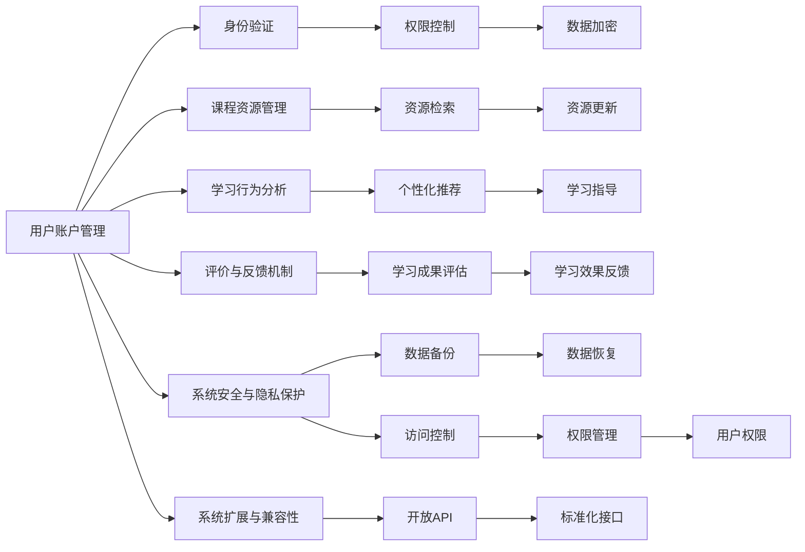
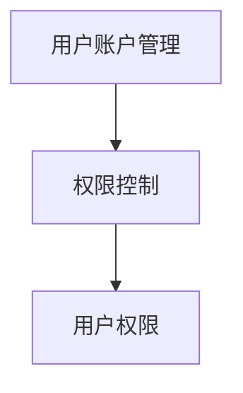
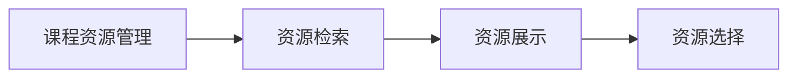
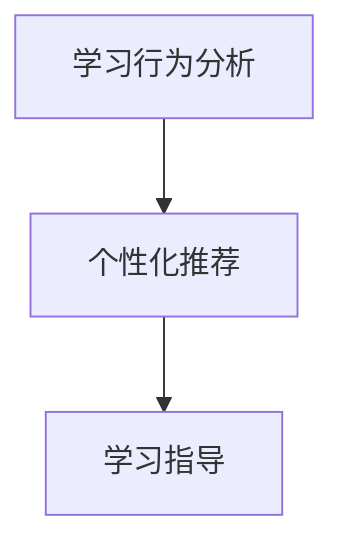
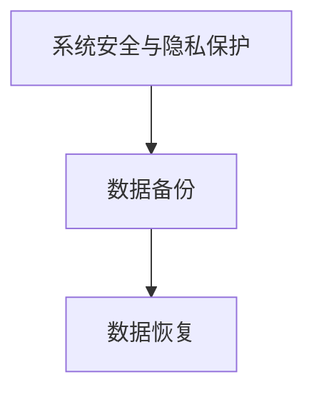
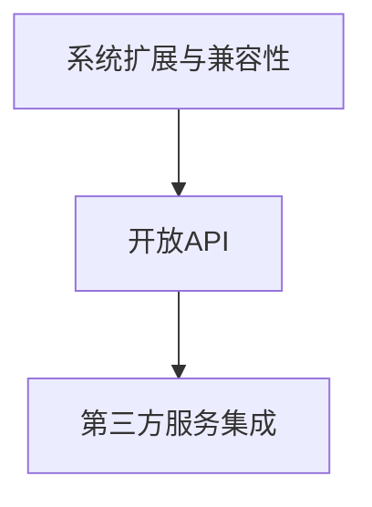
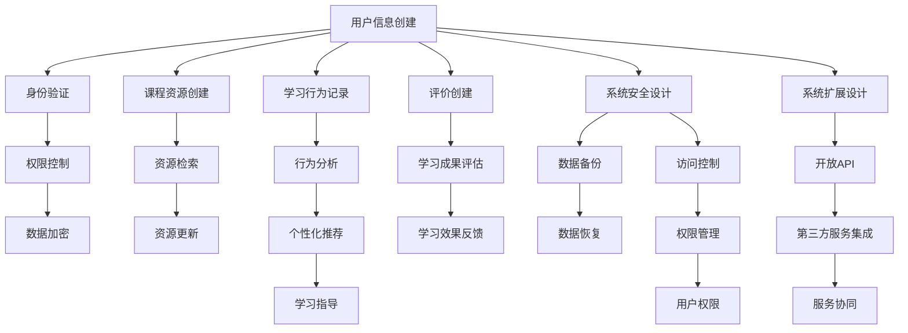

                 

## 1. 背景介绍

### 1.1 问题由来
随着教育信息化、在线教育、人工智能等技术的快速发展，智能学习系统（Intelligent Learning System, ILS）成为教育领域的一大热点。ILS旨在通过个性化推荐、智能答疑、动态评估等技术手段，提高教育质量和教学效率。管理功能作为智能学习系统的核心组成部分，直接影响着系统的稳定性和用户体验。如何设计高效、安全、易用的管理功能，成为教育技术研究的关键问题。

### 1.2 问题核心关键点
智能学习系统的管理功能涉及用户管理、课程管理、资源管理、评价管理等多个方面。其核心任务包括：
1. 用户信息的准确性和及时性：确保用户账户信息的完整性和安全性，及时更新和同步用户数据。
2. 课程和资源的有效管理：高效管理和调度课程、教材、习题等教学资源，支持不同难度、类型的资源供给。
3. 评价的公正性和合理性：提供科学的评价工具和机制，公正地评估学习效果和知识掌握情况。
4. 系统的稳定性和可扩展性：保证系统的运行稳定，同时具备良好的扩展性，以适应不同规模的用户需求。

这些管理功能的实现，需要充分考虑用户体验、数据隐私、系统性能等多个因素。如何设计一个既高效又安全，既易用又易扩展的管理系统，成为ILS设计中的重要课题。

### 1.3 问题研究意义
构建智能学习系统的管理功能，对于提升教育质量、优化教学流程、实现智能化教育具有重要意义：

1. **提高教学效率**：通过自动化的管理手段，减少教师和管理员的重复劳动，提高教学和管理效率。
2. **增强学习体验**：提供个性化的学习资源推荐，及时反馈学习效果，提升学生学习的积极性和效率。
3. **保障数据安全**：确保用户数据的安全和隐私，防止数据泄露和滥用，增强用户信任感。
4. **促进教育公平**：通过公平合理的评价机制，消除教育资源的不均衡，促进教育公平和个性化教育。
5. **支持扩展应用**：提供开放接口和标准，支持第三方应用和服务的接入，拓展教育生态系统。

总之，高效、安全、易用的管理功能，是实现智能学习系统目标的基础。通过科学的设计和管理，可以更好地支撑智能教育的发展和应用。

## 2. 核心概念与联系

### 2.1 核心概念概述

为更好地理解智能学习系统管理功能的设计与实现，本节将介绍几个密切相关的核心概念：

- **用户账户管理**：涉及用户信息的创建、修改、删除、同步等功能，确保用户数据的准确性和安全性。
- **课程资源管理**：对课程、教材、习题等教学资源进行分类、存储、检索等操作，支持资源的查询和更新。
- **学习行为分析**：通过日志和数据记录，分析用户的学习行为、知识掌握情况和反馈，提供个性化的学习建议和指导。
- **评价与反馈机制**：建立科学合理的评价体系，及时反馈学习成果，评估学习效果，帮助学生改进学习方法。
- **系统安全与隐私保护**：设计高效的数据加密、访问控制和权限管理机制，确保用户数据的安全和隐私。
- **系统扩展与兼容性**：通过开放API和标准化接口，支持系统的灵活扩展和不同服务间的协同工作。

这些核心概念之间的逻辑关系可以通过以下Mermaid流程图来展示：



这个流程图展示了智能学习系统管理功能的核心组件及其相互关系：

1. 用户账户管理：负责身份验证、权限控制、数据加密等功能，确保用户数据的安全和隐私。
2. 课程资源管理：实现资源检索和更新，支持教学资源的有效管理和调度。
3. 学习行为分析：通过日志记录和学习数据，提供个性化推荐和学习指导。
4. 评价与反馈机制：建立科学评价体系，及时反馈学习成果，评估学习效果。
5. 系统安全与隐私保护：保障数据安全，提供数据备份和恢复机制，防止数据丢失。
6. 系统扩展与兼容性：支持开放API和标准化接口，实现系统的灵活扩展和与其他服务的协同。

这些核心概念共同构成了智能学习系统管理功能的完整框架，为其稳定运行和高效使用提供了基础。

### 2.2 概念间的关系

这些核心概念之间存在着紧密的联系，形成了智能学习系统管理功能的完整生态系统。下面我们通过几个Mermaid流程图来展示这些概念之间的关系。

#### 2.2.1 用户账户管理与权限控制



这个流程图展示了用户账户管理和权限控制的关系。用户账户管理负责用户身份的验证和数据加密，权限控制则基于用户身份分配相应的权限。

#### 2.2.2 课程资源管理与资源检索



这个流程图展示了课程资源管理与资源检索的关系。课程资源管理对资源进行分类、存储和管理，资源检索则根据用户需求快速查找相应的资源。

#### 2.2.3 学习行为分析与个性化推荐



这个流程图展示了学习行为分析与个性化推荐的关系。通过分析用户的学习行为，学习行为分析提供个性化的学习资源推荐和指导。

#### 2.2.4 系统安全与隐私保护与数据备份



这个流程图展示了系统安全与隐私保护与数据备份的关系。系统安全与隐私保护保障数据安全，数据备份则在数据丢失时提供恢复机制。

#### 2.2.5 系统扩展与兼容性与开放API



这个流程图展示了系统扩展与兼容性与开放API的关系。系统扩展与兼容性提供开放API，支持第三方服务的集成和扩展。

### 2.3 核心概念的整体架构

最后，我们用一个综合的流程图来展示这些核心概念在大语言模型微调过程中的整体架构：



这个综合流程图展示了从用户信息创建到评价反馈的全流程管理架构。用户信息创建后，通过身份验证和权限控制，进行数据加密。课程资源创建和管理，支持资源检索和更新。学习行为记录和分析，提供个性化推荐和学习指导。评价创建和反馈，评估学习成果和学习效果。系统安全设计，保障数据安全，提供数据备份和恢复机制。系统扩展设计，提供开放API，支持第三方服务集成和服务协同。

通过这些流程图，我们可以更清晰地理解智能学习系统管理功能的各个组件及其相互关系，为后续深入讨论具体的管理功能设计和技术实现奠定基础。

## 3. 核心算法原理 & 具体操作步骤
### 3.1 算法原理概述

智能学习系统的管理功能设计，主要涉及以下几个核心算法和流程：

- **身份验证与权限控制**：采用OAuth2.0、JWT等标准，通过用户认证和权限管理，确保用户数据的安全和隐私。
- **数据加密与备份恢复**：使用AES、RSA等加密算法，对敏感数据进行加密存储，确保数据在传输和存储过程中的安全。同时，定期进行数据备份，保障数据在故障情况下的恢复。
- **学习行为分析**：通过日志记录和行为分析算法，识别用户的学习行为和知识掌握情况，提供个性化的学习建议和指导。
- **评价与反馈机制**：设计科学的评价体系，基于用户行为数据和学习结果，生成科学的评价报告和反馈信息，帮助学生改进学习方法。
- **系统扩展与兼容性**：通过开放API和标准化接口，支持系统与其他第三方服务的协同工作，实现系统的灵活扩展和升级。

这些核心算法和流程的实现，需要综合考虑系统的安全性、效率、扩展性和用户体验。设计高效、可靠的管理功能，才能确保智能学习系统的稳定运行和广泛应用。

### 3.2 算法步骤详解

智能学习系统管理功能的实现步骤包括：

**Step 1: 用户身份验证与权限管理**

1. 用户注册与登录：通过OAuth2.0协议，支持用户使用第三方平台账户（如微信、QQ等）进行身份认证和登录。
2. 权限控制：基于RBAC（基于角色的访问控制）模型，根据用户角色分配相应的权限，限制用户对敏感数据的访问。

**Step 2: 数据加密与备份恢复**

1. 数据加密：使用AES算法对敏感数据进行加密存储，如用户密码、学习数据等，确保数据在存储过程中的安全性。
2. 数据备份：定期对重要数据进行备份，并采用RSA算法进行加密，确保备份数据的安全性和不可篡改性。
3. 数据恢复：在系统故障或数据丢失时，通过备份数据进行恢复，确保系统的正常运行。

**Step 3: 学习行为分析与个性化推荐**

1. 行为记录：记录用户的学习行为，如登录时间、学习时间、访问资源等，作为行为分析的基础数据。
2. 行为分析：通过机器学习算法，分析用户的学习行为，识别知识掌握情况和学习难点。
3. 个性化推荐：根据行为分析结果，提供个性化的学习资源推荐和指导，帮助学生提高学习效率。

**Step 4: 评价与反馈机制**

1. 评价创建：基于学习行为数据和学习成果，创建科学合理的评价报告，如成绩单、学习进度报告等。
2. 反馈信息：提供详细的学习效果反馈，帮助学生了解自己的学习状态和改进方法。
3. 评价应用：将评价报告应用于教学管理和个性化学习路径的生成，提升教学质量和学生学习效果。

**Step 5: 系统扩展与兼容性**

1. 开放API设计：设计开放API接口，支持第三方服务的接入，实现系统的灵活扩展。
2. 标准化接口：采用RESTful API和JSON等标准化格式，确保系统与其他服务的兼容性。
3. 服务协同：通过API调用和数据共享，实现系统与其他第三方服务的协同工作，提升系统的功能和用户体验。

以上是智能学习系统管理功能的核心实现步骤。在实际应用中，还需要根据具体需求和业务场景，对各个环节进行优化和调整，以确保系统的稳定性和可靠性。

### 3.3 算法优缺点

智能学习系统管理功能的优点包括：

1. **高效性**：通过标准化接口和开放API，实现系统的灵活扩展和第三方服务的协同工作，提高了系统的运行效率和用户满意度。
2. **安全性**：通过身份验证、权限控制和数据加密等措施，保障用户数据的安全和隐私，防止数据泄露和滥用。
3. **可靠性**：通过定期备份和数据恢复机制，确保系统在故障情况下的快速恢复，提高了系统的可靠性。
4. **扩展性**：开放API和标准化接口设计，支持系统的灵活扩展和升级，适应不同规模和复杂度的业务需求。

同时，这些管理功能也存在一些缺点：

1. **复杂性**：管理功能涉及身份验证、权限控制、数据加密等多个模块，系统设计和实现较为复杂。
2. **性能瓶颈**：数据加密和行为分析等操作可能会增加系统性能开销，需要合理优化算法和数据结构。
3. **易用性**：系统的复杂性可能会影响用户体验，需要提供简洁友好的界面和操作指南。
4. **可维护性**：系统的扩展和升级需要频繁维护和管理，需要建立完善的版本控制和文档体系。

尽管存在这些局限性，但综合考虑其优点，智能学习系统管理功能的实现对于提升教育质量和教学效率具有重要意义。

### 3.4 算法应用领域

智能学习系统管理功能的应用领域非常广泛，涵盖了教育技术、在线教育、智能教育等多个方面。以下是几个典型的应用场景：

1. **学校管理**：为学校提供统一的用户管理和权限控制功能，支持学生、教师和管理人员的数据管理、资源访问和评价反馈。
2. **在线教育平台**：为在线教育平台提供用户身份认证、课程资源管理和个性化学习指导功能，提升教学效果和用户满意度。
3. **教育技术公司**：为教育技术公司提供平台搭建和管理支持，实现系统的灵活扩展和功能扩展。
4. **第三方应用集成**：通过开放API和标准化接口，支持第三方应用的接入，实现系统的功能扩展和协同工作。
5. **智慧校园建设**：为智慧校园建设提供统一的用户管理、资源管理和评价反馈功能，提升校园智能化管理水平。

这些应用场景展示了智能学习系统管理功能的广泛应用和强大功能，对于推动教育信息化和智慧教育的发展具有重要意义。

## 4. 数学模型和公式 & 详细讲解  
### 4.1 数学模型构建

本节将使用数学语言对智能学习系统管理功能的核心算法进行更加严格的刻画。

**用户身份验证与权限控制**

假设用户账户信息为 $U=\{ID, Name, Email, Password, Role\}$，其中 $ID$ 为唯一标识符，$Name$、$Email$、$Password$ 分别为用户姓名、邮箱和密码，$Role$ 为用户角色。设计用户身份验证与权限控制的数学模型为：

$$
\begin{aligned}
&\min_{ID, Name, Email, Password, Role} \mathcal{L}(U) \\
&\text{s.t.} \\
&ID_{\text{unique}}(U) \\
&Name_{\text{valid}}(U) \\
&Email_{\text{valid}}(U) \\
&Password_{\text{secure}}(U) \\
&Role_{\text{valid}}(U)
\end{aligned}
$$

其中 $\mathcal{L}(U)$ 为用户身份验证与权限控制的损失函数，约束条件包括唯一性、有效性、安全性、合法性等。

**数据加密与备份恢复**

假设敏感数据为 $D=\{Data\}$，设计数据加密与备份恢复的数学模型为：

$$
\begin{aligned}
&\min_{K, E} \mathcal{L}_{\text{enc}}(K, E, D) \\
&\text{s.t.} \\
&D_{\text{encrypted}}(E, K, D) \\
&D_{\text{decrypted}}(E, K, D_{\text{encrypted}})
\end{aligned}
$$

其中 $K$ 为加密密钥，$E$ 为加密算法，$D_{\text{encrypted}}$ 为加密后的数据，$D_{\text{decrypted}}$ 为解密后的数据，$\mathcal{L}_{\text{enc}}(K, E, D)$ 为数据加密的损失函数。

**学习行为分析与个性化推荐**

假设用户学习行为数据为 $B=\{Behavior\}$，设计学习行为分析与个性化推荐的数学模型为：

$$
\begin{aligned}
&\min_{L, R} \mathcal{L}_{\text{learn}}(L, R, B) \\
&\text{s.t.} \\
&B_{\text{record}}(L, R) \\
&B_{\text{analyze}}(L, R, B)
\end{aligned}
$$

其中 $L$ 为学习行为分析算法，$R$ 为个性化推荐算法，$B_{\text{record}}(L, R)$ 为行为记录的损失函数，$B_{\text{analyze}}(L, R, B)$ 为行为分析的损失函数。

**评价与反馈机制**

假设评价数据为 $E=\{Score, Progress, Feedback\}$，设计评价与反馈机制的数学模型为：

$$
\begin{aligned}
&\min_{G} \mathcal{L}_{\text{eval}}(G, E) \\
&\text{s.t.} \\
&Score_{\text{valid}}(G, E) \\
&Progress_{\text{valid}}(G, E) \\
&Feedback_{\text{valid}}(G, E)
\end{aligned}
$$

其中 $G$ 为评价生成算法，$\mathcal{L}_{\text{eval}}(G, E)$ 为评价的损失函数，约束条件包括评价的有效性、合理性等。

**系统扩展与兼容性**

假设系统扩展功能为 $F=\{API, Interface\}$，设计系统扩展与兼容性的数学模型为：

$$
\begin{aligned}
&\min_{API, Interface} \mathcal{L}_{\text{ext}}(API, Interface) \\
&\text{s.t.} \\
&API_{\text{standard}}(API, Interface) \\
&Interface_{\text{standard}}(API, Interface)
\end{aligned}
$$

其中 $API$ 为开放API，$Interface$ 为标准化接口，$\mathcal{L}_{\text{ext}}(API, Interface)$ 为扩展的损失函数，约束条件包括标准的符合性等。

### 4.2 公式推导过程

以下我们以用户身份验证与权限控制为例，推导其核心算法的数学表达式及其优化过程。

**用户身份验证与权限控制**

假设用户账户信息 $U=\{ID, Name, Email, Password, Role\}$，其中 $ID$ 为唯一标识符，$Name$、$Email$、$Password$ 分别为用户姓名、邮箱和密码，$Role$ 为用户角色。设计用户身份验证与权限控制的数学模型为：

$$
\begin{aligned}
&\min_{ID, Name, Email, Password, Role} \mathcal{L}(U) \\
&\text{s.t.} \\
&ID_{\text{unique}}(U) \\
&Name_{\text{valid}}(U) \\
&Email_{\text{valid}}(U) \\
&Password_{\text{secure}}(U) \\
&Role_{\text{valid}}(U)
\end{aligned}
$$

其中 $\mathcal{L}(U)$ 为用户身份验证与权限控制的损失函数，约束条件包括唯一性、有效性、安全性、合法性等。

在实际实现中，可以通过以下步骤进行优化：

1. 用户身份验证：通过OAuth2.0协议，支持用户使用第三方平台账户（如微信、QQ等）进行身份认证和登录。
2. 权限控制：基于RBAC（基于角色的访问控制）模型，根据用户角色分配相应的权限，限制用户对敏感数据的访问。

**数据加密与备份恢复**

假设敏感数据为 $D=\{Data\}$，设计数据加密与备份恢复的数学模型为：

$$
\begin{aligned}
&\min_{K, E} \mathcal{L}_{\text{enc}}(K, E, D) \\
&\text{s.t.} \\
&D_{\text{encrypted}}(E, K, D) \\
&D_{\text{decrypted}}(E, K, D_{\text{encrypted}})
\end{aligned}
$$

其中 $K$ 为加密密钥，$E$ 为加密算法，$D_{\text{encrypted}}$ 为加密后的数据，$D_{\text{decrypted}}$ 为解密后的数据，$\mathcal{L}_{\text{enc}}(K, E, D)$ 为数据加密的损失函数。

在实际实现中，可以通过以下步骤进行优化：

1. 数据加密：使用AES算法对敏感数据进行加密存储，如用户密码、学习数据等，确保数据在存储过程中的安全性。
2. 数据备份：定期对重要数据进行备份，并采用RSA算法进行加密，确保备份数据的安全性和不可篡改性。
3. 数据恢复：在系统故障或数据丢失时，通过备份数据进行恢复，确保系统的正常运行。

**学习行为分析与个性化推荐**

假设用户学习行为数据为 $B=\{Behavior\}$，设计学习行为分析与个性化推荐的数学模型为：

$$
\begin{aligned}
&\min_{L, R} \mathcal{L}_{\text{learn}}(L, R, B) \\
&\text{s.t.} \\
&B_{\text{record}}(L, R) \\
&B_{\text{analyze}}(L, R, B)
\end{aligned}
$$

其中 $L$ 为学习行为分析算法，$R$ 为个性化推荐算法，$B_{\text{record}}(L, R)$ 为行为记录的损失函数，$B_{\text{analyze}}(L, R, B)$ 为行为分析的损失函数。

在实际实现中，可以通过以下步骤进行优化：

1. 行为记录：记录用户的学习行为，如登录时间、学习时间、访问资源等，作为行为分析的基础数据。
2. 行为分析：通过机器学习算法，分析用户的学习行为，识别知识掌握情况和学习难点。
3. 个性化推荐：根据行为分析结果，提供个性化的学习资源推荐和指导，帮助学生提高学习效率。

**评价与反馈机制**

假设评价数据为 $E=\{Score, Progress, Feedback\}$，设计评价与反馈机制的数学模型为：

$$
\begin{aligned}
&\min_{G} \mathcal{L}_{\text{eval}}(G, E) \\
&\text{s.t.} \\
&Score_{\text{valid}}(G, E) \\
&Progress_{\text{valid}}(G, E) \\
&Feedback_{\text{valid}}(G, E)
\end{aligned}
$$

其中 $G$ 为评价生成算法，$\mathcal{L}_{\text{eval}}(G, E)$ 为评价的损失函数，约束条件包括评价的有效性、合理性等。

在实际实现中，可以通过以下步骤进行优化：

1. 评价创建：基于学习行为数据和学习成果，创建科学合理的评价报告，如成绩单、学习进度报告等。
2. 反馈信息：提供详细的学习效果反馈，帮助学生了解自己的学习状态和改进方法。
3. 评价应用：将评价报告应用于教学管理和个性化学习路径的生成，提升教学质量和学生学习效果。

**系统扩展与兼容性**

假设系统扩展功能为 $F=\{API, Interface\}$，设计系统扩展与兼容性的数学模型为：

$$
\begin{aligned}
&\min_{API, Interface} \mathcal{L}_{\text{ext}}(API, Interface) \\
&\text{s.t.} \\
&API_{\text{standard}}(API, Interface) \\
&Interface_{\text{standard}}(API, Interface)
\end{aligned}
$$

其中 $API$ 为开放API，$Interface$ 为标准化接口，$\mathcal{L}_{\text{ext}}(API, Interface)$ 为扩展的损失函数，约束条件包括标准的符合性等。

在实际实现中，可以通过以下步骤进行优化：

1. 开放API设计：设计开放API接口，支持第三方服务的接入，实现系统的灵活扩展。
2. 标准化接口：采用RESTful API和JSON等标准化格式，确保系统与其他服务的兼容性。
3. 服务协同：通过API调用和数据共享，实现系统与其他第三方服务的协同工作，提升系统的功能和用户体验。

通过这些数学表达式的推导，我们可以更深入地理解智能学习系统管理功能的核心算法和优化过程，为后续具体实现提供科学依据。

## 5. 项目实践：代码实例和详细解释说明
### 5.1 开发环境搭建

在进行智能学习系统管理功能的开发前，我们需要准备好开发环境。以下是使用Python进行Flask开发的环境配置流程：

1. 安装Anaconda：从官网下载并安装Anaconda，用于创建独立的Python环境。

2. 创建并激活虚拟环境：
```bash
conda create -n flask-env python=3.8 
conda activate flask-env
```

3. 安装Flask：
```bash
pip install Flask
```

4. 安装SQLAlchemy：
```bash
pip install SQLAlchemy
```

5. 安装Flask-Login和Flask-WTF：
```bash
pip install Flask-Login Flask-WTF
```

6. 安装Flask-Admin：
```bash
pip install Flask-Admin
```

完成上述步骤后，即可在`flask-env`环境中开始智能学习系统管理功能的开发。

### 5.2 源代码详细实现

下面我们以用户身份验证与权限控制为例，给出使用Flask框架实现的身份验证功能代码：

```python
from flask import Flask, render_template, redirect, url_for
from flask_login import LoginManager, login_user, logout_user

