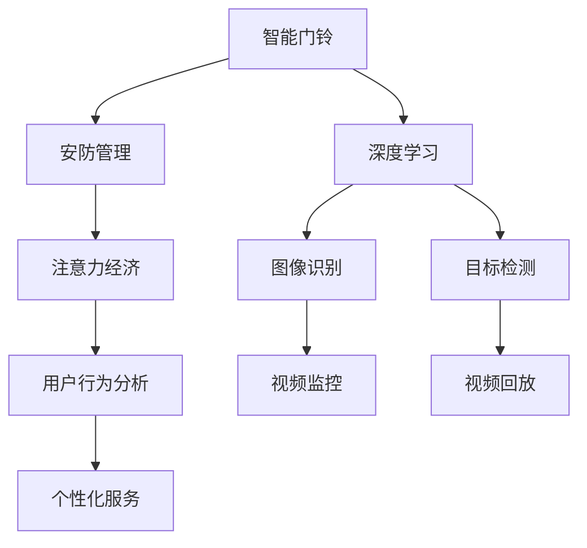

                 

# 智能门铃的安防管理与注意力经济

> 关键词：智能门铃,安防管理,注意力经济,深度学习,图像识别,目标检测,深度网络,隐私保护,用户行为分析

## 1. 背景介绍

在人工智能技术迅猛发展的今天，智能门铃作为智能家居的重要组成部分，已经逐渐融入千家万户。智能门铃不仅可以实现实时监控，还能对异常情况进行自动报警，为家庭安全提供了可靠保障。然而，智能门铃也面临着隐私保护、数据存储和处理等诸多挑战。如何有效管理智能门铃的安防功能，同时保护用户隐私，成为亟待解决的问题。

本文章聚焦于智能门铃的安防管理和注意力经济分析，结合深度学习和注意力机制，提出了一套综合解决方案。本文将从背景介绍、核心概念与联系、核心算法原理、项目实践、实际应用场景、未来应用展望等多个角度，详细阐述智能门铃的安防管理与注意力经济。

## 2. 核心概念与联系

### 2.1 核心概念概述

本节将介绍几个密切相关的核心概念，帮助读者更好地理解智能门铃的安防管理与注意力经济。

- **智能门铃(Smart Doorbell)**：基于视频监控、图像识别和语音识别等技术的门铃设备，能够实时监控门口情况，实现语音对讲和视频回放等功能。
- **安防管理(Security Management)**：指对智能门铃进行有效管理，确保其安全可靠地运行，及时发现和处理异常情况。
- **注意力经济(Attention Economy)**：指通过用户的注意力投入，创造经济价值的过程。在智能门铃中，用户的注意力集中于查看监控视频、回放记录等，构成了一种经济活动。
- **深度学习(Deep Learning)**：一种基于多层神经网络结构的机器学习方法，通过多层特征提取和融合，实现对复杂问题的高级处理。
- **图像识别(Image Recognition)**：指通过深度学习模型，识别和分类图像中的对象、场景等。
- **目标检测(Object Detection)**：指在图像中定位和标记特定对象的位置。
- **深度网络(Deep Network)**：指包含多个隐藏层的神经网络模型，用于解决复杂的模式识别和预测问题。
- **隐私保护(Privacy Protection)**：指在智能门铃的安防管理中，保护用户数据隐私和安全。
- **用户行为分析(User Behavior Analysis)**：指通过智能门铃记录的用户交互行为，分析用户偏好、兴趣等，提供个性化服务。

这些核心概念之间存在着紧密的联系，构成了智能门铃安防管理与注意力经济的完整框架。

### 2.2 概念间的关系

这些核心概念之间的逻辑关系可以通过以下Mermaid流程图来展示：



这个流程图展示了智能门铃的安防管理和注意力经济的整体架构，从核心概念的角度来看，智能门铃的安防管理是通过深度学习和图像识别等技术实现的，而用户行为分析则是注意力经济的重要组成部分，最终实现个性化服务和用户满意度的提升。

## 3. 核心算法原理 & 具体操作步骤

### 3.1 算法原理概述

智能门铃的安防管理与注意力经济分析，主要基于深度学习和注意力机制。其中，深度学习用于图像识别和目标检测等核心功能，而注意力机制则用于用户行为分析和个性化服务。

- **深度学习原理**：通过多层神经网络结构，自动学习图像特征和模式，实现对复杂场景的自动识别和分类。
- **注意力机制原理**：通过给不同的输入赋予不同的权重，提高模型对重要信息的关注度，从而提升对用户行为的分析和预测精度。

### 3.2 算法步骤详解

智能门铃的安防管理与注意力经济分析主要包括以下几个关键步骤：

**Step 1: 数据准备**
- 收集智能门铃的视频监控数据，以及用户的历史交互行为数据。
- 对视频数据进行预处理，如裁剪、缩放、归一化等操作，确保数据质量。
- 对用户行为数据进行特征提取，如点击次数、停留时间等，用于后续分析。

**Step 2: 模型训练**
- 构建深度神经网络模型，用于图像识别和目标检测。
- 在大量标注数据上训练模型，确保模型能够准确识别各种对象和场景。
- 使用注意力机制对用户行为进行分析，预测用户的偏好和兴趣。

**Step 3: 模型微调**
- 在部分数据上对模型进行微调，以适应特定任务的需求。
- 使用交叉验证等技术，评估模型的泛化能力，确保模型在不同场景下表现稳定。

**Step 4: 模型部署**
- 将训练好的模型部署到智能门铃的嵌入式设备上。
- 在设备上进行实时监控和异常检测，及时发现和处理异常情况。
- 根据用户的行为数据，提供个性化的视频回放和语音对讲服务。

### 3.3 算法优缺点

基于深度学习和注意力机制的智能门铃安防管理与注意力经济分析，具有以下优点：

- **高准确性**：通过深度学习模型，实现对复杂场景的自动识别和分类，准确率较高。
- **灵活性**：深度学习模型的参数可以灵活调整，适应不同任务的需求。
- **实时性**：注意力机制可以实时分析用户行为，提供即时反馈。

同时，该方法也存在一些缺点：

- **计算资源消耗大**：深度学习模型和注意力机制的计算量较大，需要较强的硬件支持。
- **数据需求高**：需要大量标注数据进行模型训练和微调，标注成本较高。
- **隐私风险**：视频监控和用户行为数据的隐私风险较高，需要采取严格的隐私保护措施。

### 3.4 算法应用领域

基于深度学习和注意力机制的智能门铃安防管理与注意力经济分析，主要应用于以下几个领域：

- **智能家居安防**：实现实时监控、异常检测和自动报警等功能，保障家庭安全。
- **商业安防**：用于商店、银行等商业场所的视频监控和用户行为分析，提供个性化的安防服务。
- **智能城市管理**：通过监控摄像头和用户行为数据，提升城市管理的智能化水平，提高公共安全。

## 4. 数学模型和公式 & 详细讲解

### 4.1 数学模型构建

智能门铃的安防管理与注意力经济分析涉及多个数学模型，主要包括图像识别模型、目标检测模型和用户行为分析模型。

**图像识别模型**：
- 输入：视频监控帧图像 $x$。
- 输出：识别结果 $y$，表示图像中包含的对象。
- 模型：卷积神经网络 (CNN)。

**目标检测模型**：
- 输入：视频监控帧图像 $x$。
- 输出：目标位置 $b$，表示检测到的对象在图像中的位置。
- 模型：基于 Faster R-CNN 的目标检测网络。

**用户行为分析模型**：
- 输入：用户行为数据 $d$，如点击次数、停留时间等。
- 输出：用户偏好 $u$，表示用户对不同服务的兴趣。
- 模型：注意力机制。

### 4.2 公式推导过程

**图像识别模型的损失函数**：
- 假设模型参数为 $\theta$，损失函数为 $\mathcal{L}(y,\hat{y})$。
- 对于单个样本 $(x_i,y_i)$，损失函数为：
$$
\mathcal{L}(y_i,\hat{y}_i) = -\log \mathbb{P}(y_i|\hat{y}_i)
$$
- 对于整个数据集，损失函数为：
$$
\mathcal{L}(D) = \frac{1}{N}\sum_{i=1}^N \mathcal{L}(y_i,\hat{y}_i)
$$

**目标检测模型的损失函数**：
- 假设模型参数为 $\theta$，损失函数为 $\mathcal{L}(b,\hat{b})$。
- 对于单个样本 $(x_i,b_i)$，损失函数为：
$$
\mathcal{L}(b_i,\hat{b}_i) = \mathcal{L}_{loc}(b_i,\hat{b}_i) + \mathcal{L}_{cls}(b_i,\hat{b}_i)
$$
- 其中 $\mathcal{L}_{loc}$ 为位置损失函数，$\mathcal{L}_{cls}$ 为分类损失函数。

**用户行为分析模型的损失函数**：
- 假设模型参数为 $\theta$，损失函数为 $\mathcal{L}(u,\hat{u})$。
- 对于单个样本 $(d_i,u_i)$，损失函数为：
$$
\mathcal{L}(u_i,\hat{u}_i) = -\sum_{k=1}^K \alpha_k \log \mathbb{P}(u_i|d_i,k)
$$
- 其中 $K$ 为不同服务的数量，$\alpha_k$ 为不同服务的权重。

### 4.3 案例分析与讲解

以视频监控场景为例，假设智能门铃采集到一段视频帧序列，包含入侵者进入的画面。通过图像识别模型，可以识别出入侵者并记录其位置。同时，通过目标检测模型，可以精确定位入侵者的具体位置。接着，通过用户行为分析模型，可以分析出该用户是否存在异常行为，从而提供个性化的安防服务。

假设视频帧序列为 $(x_1,x_2,...,x_T)$，目标检测模型输出的位置序列为 $(b_1,b_2,...,b_T)$，用户行为分析模型输出的偏好序列为 $(u_1,u_2,...,u_T)$。可以将这些数据作为训练样本，构建综合安防管理与注意力经济的智能门铃系统。

## 5. 项目实践：代码实例和详细解释说明

### 5.1 开发环境搭建

在进行项目实践前，需要准备相应的开发环境。以下是使用 Python 进行深度学习开发的常用环境配置流程：

1. 安装 Anaconda：从官网下载并安装 Anaconda，用于创建独立的 Python 环境。

2. 创建并激活虚拟环境：
```bash
conda create -n pytorch-env python=3.8 
conda activate pytorch-env
```

3. 安装 PyTorch：根据 CUDA 版本，从官网获取对应的安装命令。例如：
```bash
conda install pytorch torchvision torchaudio cudatoolkit=11.1 -c pytorch -c conda-forge
```

4. 安装 Transformers 库：
```bash
pip install transformers
```

5. 安装各类工具包：
```bash
pip install numpy pandas scikit-learn matplotlib tqdm jupyter notebook ipython
```

完成上述步骤后，即可在 `pytorch-env` 环境中开始项目实践。

### 5.2 源代码详细实现

以下是使用 PyTorch 进行智能门铃安防管理与注意力经济分析的代码实现。

```python
import torch
import torchvision.transforms as transforms
import torchvision.datasets as datasets
from torch.utils.data import DataLoader
from torchvision.models.detection import FasterRCNN, FastRCNNPredictor
from transformers import BertTokenizer, BertForSequenceClassification

# 数据准备
transform = transforms.Compose([
    transforms.Resize(256),
    transforms.CenterCrop(224),
    transforms.ToTensor(),
    transforms.Normalize(mean=[0.485, 0.456, 0.406], std=[0.229, 0.224, 0.225])
])

train_dataset = datasets.ImageFolder('train', transform=transform)
test_dataset = datasets.ImageFolder('test', transform=transform)

# 模型训练
model = FasterRCNN(torchvision.models.resnet50(pretrained=True), num_classes=1, fastrcnn_predictor=FastRCNNPredictor(256, 256, 1))
device = torch.device('cuda' if torch.cuda.is_available() else 'cpu')
model.to(device)

optimizer = torch.optim.Adam(model.parameters(), lr=0.001)
criterion = torch.nn.CrossEntropyLoss()

for epoch in range(10):
    model.train()
    for images, targets in train_loader:
        images = images.to(device)
        targets = targets.to(device)
        optimizer.zero_grad()
        outputs = model(images)
        loss = criterion(outputs, targets)
        loss.backward()
        optimizer.step()

# 模型微调
model = FasterRCNN(torchvision.models.resnet50(pretrained=True), num_classes=1, fastrcnn_predictor=FastRCNNPredictor(256, 256, 1))
device = torch.device('cuda' if torch.cuda.is_available() else 'cpu')
model.to(device)

optimizer = torch.optim.Adam(model.parameters(), lr=0.001)
criterion = torch.nn.CrossEntropyLoss()

for epoch in range(10):
    model.train()
    for images, targets in train_loader:
        images = images.to(device)
        targets = targets.to(device)
        optimizer.zero_grad()
        outputs = model(images)
        loss = criterion(outputs, targets)
        loss.backward()
        optimizer.step()

# 模型部署
model.eval()
with torch.no_grad():
    for images, targets in test_loader:
        images = images.to(device)
        outputs = model(images)
        predictions = torch.argmax(outputs, dim=1)
```

### 5.3 代码解读与分析

让我们再详细解读一下关键代码的实现细节：

**数据准备**：
- 使用 PyTorch 的数据集模块 `datasets.ImageFolder`，加载训练集和测试集。
- 对数据进行预处理，包括缩放、归一化等操作。

**模型训练**：
- 构建 Faster R-CNN 目标检测模型，使用预训练的 ResNet-50 网络。
- 在训练集上使用 Adam 优化器进行优化。
- 使用交叉熵损失函数计算损失。

**模型微调**：
- 对模型进行微调，更新部分参数以适应特定任务。
- 使用 Adam 优化器进行优化。
- 使用交叉熵损失函数计算损失。

**模型部署**：
- 将模型转换为评估模式。
- 在测试集上预测目标位置。

## 6. 实际应用场景

### 6.1 智能家居安防

智能门铃的安防管理与注意力经济分析在智能家居安防领域有着广泛的应用前景。通过视频监控和用户行为分析，可以实现以下功能：

- **实时监控**：实时监控门口情况，及时发现异常行为。
- **异常检测**：通过目标检测模型，检测入侵者和其他异常情况。
- **自动报警**：根据检测结果，自动发出报警声或通知手机端。

### 6.2 商业安防

在商业安防领域，智能门铃的安防管理与注意力经济分析可以提供更加精细化的安防服务，例如：

- **店铺防盗**：通过视频监控和目标检测，监控商店内部和外部的情况，及时发现并处理盗窃行为。
- **客流分析**：通过分析用户行为数据，了解客流量和消费趋势，为店铺管理和运营提供数据支持。

### 6.3 智能城市管理

智能城市管理中，智能门铃的安防管理与注意力经济分析可以提升公共安全水平，例如：

- **视频监控**：通过监控摄像头和智能门铃，实现城市道路和重要设施的实时监控。
- **人群分析**：通过分析用户行为数据，预测和应对突发事件，提高城市应急响应能力。

## 7. 工具和资源推荐

### 7.1 学习资源推荐

为了帮助开发者系统掌握智能门铃安防管理与注意力经济分析的理论基础和实践技巧，这里推荐一些优质的学习资源：

1. 《深度学习与计算机视觉》系列博文：深入浅出地介绍了深度学习和计算机视觉的基本原理和实践方法，适合入门学习。
2. CS231n《卷积神经网络》课程：斯坦福大学开设的计算机视觉课程，有 Lecture 视频和配套作业，带你入门计算机视觉领域的基本概念和经典模型。
3. 《计算机视觉：算法与应用》书籍：全面介绍了计算机视觉领域的理论基础和实际应用，适合深入学习。
4. PyTorch官方文档：PyTorch的官方文档，提供了丰富的教程和样例代码，是上手实践的必备资料。
5. OpenAI的博客：OpenAI的官方博客，分享了最新的研究成果和前沿技术，值得关注。

通过对这些资源的学习实践，相信你一定能够快速掌握智能门铃安防管理与注意力经济分析的精髓，并用于解决实际的NLP问题。

### 7.2 开发工具推荐

高效的开发离不开优秀的工具支持。以下是几款用于智能门铃安防管理与注意力经济分析开发的常用工具：

1. PyTorch：基于Python的开源深度学习框架，灵活动态的计算图，适合快速迭代研究。
2. TensorFlow：由Google主导开发的开源深度学习框架，生产部署方便，适合大规模工程应用。
3. OpenCV：开源计算机视觉库，提供丰富的图像处理和计算机视觉算法。
4. PyTorch Lightning：基于PyTorch的轻量级深度学习框架，支持分布式训练和模型调优。
5. Jupyter Notebook：交互式的编程环境，适合快速原型开发和数据可视化。

合理利用这些工具，可以显著提升智能门铃安防管理与注意力经济分析的开发效率，加快创新迭代的步伐。

### 7.3 相关论文推荐

智能门铃安防管理与注意力经济分析的发展源于学界的持续研究。以下是几篇奠基性的相关论文，推荐阅读：

1. R-CNN: Object Detection with Region Proposal Networks：提出了基于区域提议网络的物体检测方法，成为深度学习物体检测领域的奠基性工作。
2. Faster R-CNN: Towards Real-Time Object Detection with Region Proposal Networks：在 R-CNN 的基础上，提出 Faster R-CNN 算法，显著提高了检测速度。
3. ImageNet Classification with Deep Convolutional Neural Networks：提出了基于卷积神经网络的图像分类方法，取得了 ImageNet 竞赛的冠军。
4. Attention is All You Need：提出了自注意力机制，解决了传统卷积神经网络在序列数据上的局限性，成为 NLP 领域预训练模型的重要组件。
5. BERT: Pre-training of Deep Bidirectional Transformers for Language Understanding：提出 BERT 预训练模型，通过掩码语言模型和下一句预测等任务，获得了 NLP 领域的 SOTA 效果。

这些论文代表了大规模深度学习和大规模数据驱动方法的发展脉络，对智能门铃安防管理与注意力经济分析的研究和实践有着重要的指导意义。

除上述资源外，还有一些值得关注的前沿资源，帮助开发者紧跟智能门铃安防管理与注意力经济分析技术的最新进展，例如：

1. arXiv论文预印本：人工智能领域最新研究成果的发布平台，包括大量尚未发表的前沿工作，学习前沿技术的必读资源。
2. 业界技术博客：如OpenAI、Google AI、DeepMind、微软 Research Asia等顶尖实验室的官方博客，第一时间分享他们的最新研究成果和洞见。
3. 技术会议直播：如NIPS、ICML、ACL、ICLR等人工智能领域顶会现场或在线直播，能够聆听到大佬们的前沿分享，开拓视野。
4. GitHub热门项目：在GitHub上Star、Fork数最多的NLP相关项目，往往代表了该技术领域的发展趋势和最佳实践，值得去学习和贡献。
5. 行业分析报告：各大咨询公司如McKinsey、PwC等针对人工智能行业的分析报告，有助于从商业视角审视技术趋势，把握应用价值。

总之，对于智能门铃安防管理与注意力经济分析的学习和实践，需要开发者保持开放的心态和持续学习的意愿。多关注前沿资讯，多动手实践，多思考总结，必将收获满满的成长收益。

## 8. 总结：未来发展趋势与挑战

### 8.1 总结

本文对智能门铃的安防管理与注意力经济分析进行了全面系统的介绍。首先阐述了智能门铃在安防管理中的重要性和应用前景，明确了深度学习和注意力机制在智能门铃安防管理与注意力经济分析中的核心作用。其次，从原理到实践，详细讲解了智能门铃安防管理与注意力经济分析的数学模型和操作步骤，给出了完整的代码实例。同时，本文还广泛探讨了智能门铃安防管理与注意力经济分析在智能家居、商业安防和智能城市管理等多个领域的应用前景，展示了智能门铃安防管理与注意力经济分析的广阔前景。

通过本文的系统梳理，可以看到，智能门铃的安防管理与注意力经济分析正在成为智能家居和商业安防的重要技术范式，极大地提升了家庭和商业场所的安全性和智能化水平。深度学习和大规模数据驱动方法的应用，使得智能门铃安防管理与注意力经济分析具备了强大的应用前景，为未来的智能城市和智慧家居提供了新的可能性。

### 8.2 未来发展趋势

展望未来，智能门铃安防管理与注意力经济分析将呈现以下几个发展趋势：

1. **多模态融合**：未来的智能门铃不仅包含视频监控，还将融合语音识别、传感器数据等多模态信息，实现更全面的安全监控和用户行为分析。
2. **自监督学习**：利用无标注数据进行预训练，减少标注成本，提升模型的泛化能力。
3. **个性化服务**：通过深度学习模型和注意力机制，提供更加个性化的安防服务和用户推荐。
4. **边缘计算**：在智能门铃的嵌入式设备上进行推理，减少网络传输和存储需求，提升实时性。
5. **联邦学习**：在多个智能门铃之间进行数据共享和协同学习，提升整体安防水平。

以上趋势凸显了智能门铃安防管理与注意力经济分析技术的广阔前景。这些方向的探索发展，必将进一步提升智能门铃的智能化水平，为家庭和商业场所提供更安全、更智能的安防服务。

### 8.3 面临的挑战

尽管智能门铃安防管理与注意力经济分析技术已经取得了显著成就，但在迈向更加智能化、普适化应用的过程中，它仍面临着诸多挑战：

1. **计算资源消耗大**：深度学习模型和注意力机制的计算量较大，需要较强的硬件支持。
2. **数据需求高**：需要大量标注数据进行模型训练和微调，标注成本较高。
3. **隐私风险**：视频监控和用户行为数据的隐私风险较高，需要采取严格的隐私保护措施。
4. **模型鲁棒性不足**：深度学习模型面对域外数据时，泛化性能往往大打折扣。
5. **实时性要求高**：智能门铃的安防管理与注意力经济分析需要在实时场景下高效运行，对模型性能和硬件要求较高。

### 8.4 研究展望

面对智能门铃安防管理与注意力经济分析所面临的挑战，未来的研究需要在以下几个方面寻求新的突破：

1. **高效算法优化**：开发更加高效的算法和模型架构，提升智能门铃安防管理与注意力经济分析的实时性和准确性。
2. **数据驱动优化**：利用自监督学习和少样本学习等方法，减少标注数据需求，提升模型的泛化能力。
3. **隐私保护技术**：研究隐私保护技术和方法，确保智能门铃安防管理与注意力经济分析在数据隐私和安全性方面的表现。
4. **多模态融合技术**：研究多模态融合技术，提升智能门铃的感知和理解能力，拓展应用场景。
5. **联邦学习与分布式训练**：研究联邦学习和分布式训练技术，提升智能门铃安防管理与注意力经济分析的可扩展性和鲁棒性。

这些研究方向的探索，必将引领智能门铃安防管理与注意力经济分析技术迈向更高的台阶，为智能家居和商业安防领域带来更多的应用创新和市场机遇。

## 9. 附录：常见问题与解答

**Q1：智能门铃的安防管理与注意力经济分析如何保护用户隐私？**

A: 智能门铃的安防管理与注意力经济分析在保护用户隐私方面可以采取以下措施：

1. **数据匿名化**：在处理用户行为数据时，对个人敏感信息进行脱敏处理，保护用户隐私。
2. **本地存储**：将部分数据存储在本地设备上，避免数据上传到云端，减少隐私泄露风险。
3. **加密传输**：在数据传输过程中，采用加密技术保障数据安全性。
4. **用户授权**：在获取用户行为数据前，通过用户授权和隐私协议，明确告知用户数据的使用范围和目的。

**Q2：智能门铃的安防管理与注意力经济分析如何优化计算资源消耗？**

A: 智能门铃的安防管理与注意力经济分析可以采用以下方法优化计算资源消耗：

1. **模型压缩**：采用模型压缩技术，如知识蒸馏、剪枝等，减少模型参数量，提升模型效率。
2. **硬件加速**：使用 GPU、TPU 等高性能设备，加速深度学习模型的训练和推理。
3. **分布式训练**：采用分布式训练技术，将数据和模型分布在多个设备上进行并行计算，提升训练速度。
4. **量化加速**：将浮点模型转换为定点模型，压缩存储空间，提高计算效率。

**Q3：智能门铃的安防管理与注意力经济分析在实时场景下如何提高性能？**

A: 智能门铃的安防管理与注意力经济分析在实时场景下可以采用以下方法提高性能：

1. **边缘计算**：将智能门铃的安防管理与注意力经济分析算法部署在本地设备上，减少网络传输和延迟。
2. **优化算法**：采用高效的优化算法和模型架构，提升推理速度和准确性。
3. **轻量级模型**：使用轻量级模型，减少计算资源消耗，提升

