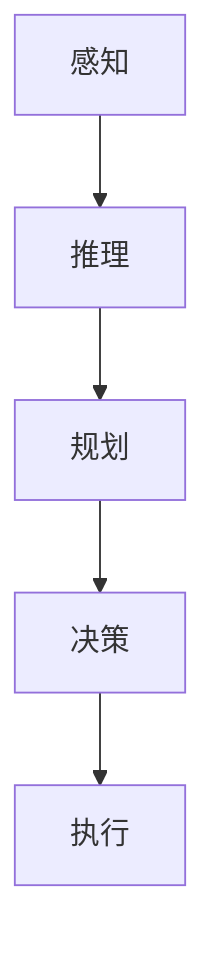

                 

# 最重要的是理解输入给Agent的内容、进行推理、规划、做出准确决策

## 1. 背景介绍

### 1.1 问题由来

随着人工智能技术的快速发展，智能代理(Agent)已经在许多领域取得了显著的成果，如自然语言处理、自动驾驶、推荐系统等。然而，尽管智能代理的能力越来越强，但仍然面临一些重要的挑战：如何更好地理解输入信息，进行有效的推理、规划和决策，以及如何保证决策的正确性和鲁棒性。这些问题不仅决定了智能代理能否提供高质量的服务，还关乎代理系统的安全性和可靠性。

### 1.2 问题核心关键点

智能代理的决策过程可以分为以下几个关键步骤：

1. **理解输入**：从环境或用户获取信息，并将其转化为机器可处理的表示形式。
2. **推理**：根据当前的知识和推理规则，对输入信息进行逻辑推理，形成中间状态。
3. **规划**：根据推理结果，制定最优的行动计划，选择合适的行动策略。
4. **决策**：基于规划结果，做出最终的决策，执行行动计划。

每一个步骤都需要精心设计和优化，以确保代理能够做出准确、及时的决策。本文将重点介绍如何理解输入内容，如何进行推理和规划，以及如何做出准确决策。

### 1.3 问题研究意义

理解输入、推理、规划和决策是智能代理实现其功能的核心环节。有效的输入理解能力可以使代理更好地捕捉环境变化，推理能力可以使其在复杂情况下做出合理判断，规划能力可以确保其行动策略的合理性和有效性，决策能力则直接决定代理的实际执行效果。因此，研究这些关键环节对于提升智能代理的性能和可靠性具有重要意义。

## 2. 核心概念与联系

### 2.1 核心概念概述

为了更好地理解智能代理的决策过程，本文将介绍几个核心概念：

- **感知**：智能代理通过传感器获取环境信息，并将其转换为数字表示。
- **推理**：基于已有的知识和推理规则，对感知信息进行逻辑推断。
- **规划**：根据推理结果，制定行动计划和策略。
- **决策**：基于规划结果，选择最优行动方案。
- **执行**：将决策转化为实际行动。

这些概念共同构成了智能代理的决策框架，每个环节都需要精心设计和优化。以下是一个 Mermaid 流程图，展示了这些概念之间的联系：



### 2.2 概念间的关系

感知、推理、规划和决策四个环节密切相关，共同构成了智能代理的决策链条。感知是决策的基础，推理和规划则是对感知信息的进一步处理和应用，决策是整个过程的最终输出，而执行则是将决策转化为实际行动的过程。

## 3. 核心算法原理 & 具体操作步骤

### 3.1 算法原理概述

智能代理的决策过程通常基于符号推理或数值计算。对于符号推理，代理需要定义一个符号语言，将环境信息转换为符号表示，并通过规则进行推理。对于数值计算，代理需要定义一个数学模型，将环境信息转换为数值表示，并通过优化算法求解最优决策。

### 3.2 算法步骤详解

#### 3.2.1 理解输入

理解输入是智能代理的第一步，也是整个决策过程的基础。理解输入的常用方法包括：

- **感知建模**：将环境信息转换为符号或数值表示。
- **信息提取**：从感知数据中提取出有用的特征，用于后续推理和规划。
- **预处理**：对感知数据进行去噪、归一化等预处理，以提高后续处理的效率和准确性。

#### 3.2.2 推理

推理是智能代理的核心环节，其目的是根据已有的知识和推理规则，对感知信息进行逻辑推断，形成中间状态。常用的推理方法包括：

- **规则推理**：基于定义的规则库，进行逻辑推理。
- **启发式推理**：利用启发式算法，优化推理过程。
- **基于模型的推理**：使用数学模型进行数值计算，求解最优解。

#### 3.2.3 规划

规划是智能代理的重要环节，其目的是根据推理结果，制定最优的行动计划和策略。常用的规划方法包括：

- **搜索算法**：通过搜索所有可能的行动路径，选择最优路径。
- **图搜索算法**：利用图结构进行路径搜索，提高搜索效率。
- **动态规划**：通过递归求解最优解，适用于动态环境。

#### 3.2.4 决策

决策是智能代理的最终输出，其目的是根据规划结果，选择最优行动方案。常用的决策方法包括：

- **基于规则的决策**：基于定义的规则，选择最优行动。
- **优化算法**：通过优化算法，求解最优决策。
- **学习算法**：通过学习算法，自动优化决策策略。

### 3.3 算法优缺点

智能代理的推理、规划和决策方法各有优缺点。

#### 优点

1. **灵活性**：符号推理和启发式推理可以根据具体任务灵活调整推理规则，适应复杂环境。
2. **高效性**：数值计算和优化算法可以高效求解最优解，适用于大规模问题。
3. **可解释性**：符号推理和基于规则的决策方法具有较高的可解释性，便于调试和理解。

#### 缺点

1. **复杂性**：符号推理和规划方法通常较为复杂，实现难度大。
2. **计算开销**：数值计算和优化算法计算开销较大，可能不适用于实时决策。
3. **知识局限性**：规则和模型通常需要人工定义，难以自动获取和更新。

### 3.4 算法应用领域

智能代理的推理、规划和决策方法广泛应用于许多领域，包括：

- **自然语言处理**：通过符号推理和数值计算，实现语言理解、生成和翻译。
- **自动驾驶**：通过感知建模和规则推理，实现路径规划和决策。
- **推荐系统**：通过数值计算和优化算法，实现个性化推荐。
- **机器人**：通过感知建模和动态规划，实现动作规划和路径选择。

## 4. 数学模型和公式 & 详细讲解 & 举例说明

### 4.1 数学模型构建

智能代理的推理和规划通常基于数学模型。以下是一个简单的例子，说明如何使用符号推理和数值计算进行推理和规划。

假设有一个简单的任务：在一条道路上找到一个最短的路径。我们可以将道路表示为一个图，图中的每个节点表示一个位置，每条边表示两个位置之间的距离。我们可以使用符号推理和数值计算，求解最优路径。

### 4.2 公式推导过程

#### 4.2.1 符号推理

假设我们已经定义了一个规则库，包含如何计算两个位置之间的距离。例如，我们可以定义一个函数 $d(x, y)$，表示位置 $x$ 和位置 $y$ 之间的距离。我们可以使用这些规则进行推理，找到最短路径。

```
if x == start:
    dist = 0
elif y == start:
    dist = 0
else:
    dist = min(d(x, y), d(y, z))
```

这个规则表示：如果 $x$ 或 $y$ 是起点，则距离为 $0$；否则，距离为 $x$ 和 $y$ 之间距离和 $y$ 和 $z$ 之间距离的最小值。

#### 4.2.2 数值计算

我们还可以使用数值计算方法，例如动态规划，求解最短路径。我们可以定义一个函数 $f(i, j)$，表示从起点到位置 $i$ 的最短路径长度。根据动态规划的原理，我们可以得到以下递推公式：

$$
f(i, j) = \min_{k \in V} \{f(i, k) + d(k, j)\}
$$

其中，$V$ 是所有中间位置集合，$d(i, j)$ 表示位置 $i$ 和位置 $j$ 之间的距离。

### 4.3 案例分析与讲解

假设我们有一个简单的图，如下图所示：

```
start -> 1 -> 2 -> 3 -> 4 -> 5 -> end
```

如果起点为 $start$，终点为 $end$，我们可以使用符号推理或数值计算方法，求解最短路径。

- 符号推理：使用规则库进行推理，可以得到最短路径为 $start -> 1 -> 2 -> 3 -> 4 -> 5 -> end$。
- 数值计算：使用动态规划方法，可以求解出最短路径为 $start -> 1 -> 2 -> 3 -> 4 -> 5 -> end$。

## 5. 项目实践：代码实例和详细解释说明

### 5.1 开发环境搭建

为了进行智能代理的推理和规划，我们需要搭建一个开发环境。以下是使用 Python 和 PyTorch 进行开发的环境配置流程：

1. 安装 Anaconda：从官网下载并安装 Anaconda，用于创建独立的 Python 环境。

2. 创建并激活虚拟环境：
```bash
conda create -n pytorch-env python=3.8 
conda activate pytorch-env
```

3. 安装 PyTorch：根据 CUDA 版本，从官网获取对应的安装命令。例如：
```bash
conda install pytorch torchvision torchaudio cudatoolkit=11.1 -c pytorch -c conda-forge
```

4. 安装 TensorFlow：
```bash
pip install tensorflow
```

5. 安装 Transformers 库：
```bash
pip install transformers
```

6. 安装各类工具包：
```bash
pip install numpy pandas scikit-learn matplotlib tqdm jupyter notebook ipython
```

完成上述步骤后，即可在 `pytorch-env` 环境中开始项目实践。

### 5.2 源代码详细实现

接下来，我们将介绍如何使用 PyTorch 和 Transformers 库，实现一个简单的智能代理，进行路径规划。

#### 5.2.1 环境定义

```python
import torch
from torch import nn, optim
from torch.utils.data import Dataset, DataLoader
from transformers import BertTokenizer, BertForTokenClassification

class GraphNode(nn.Module):
    def __init__(self, num_nodes):
        super(GraphNode, self).__init__()
        self.fc1 = nn.Linear(num_nodes, 128)
        self.fc2 = nn.Linear(128, num_nodes)
        self.relu = nn.ReLU()
        self.softmax = nn.Softmax(dim=1)
        
    def forward(self, x):
        x = self.fc1(x)
        x = self.relu(x)
        x = self.fc2(x)
        x = self.softmax(x)
        return x

class Graph(nn.Module):
    def __init__(self, num_nodes, num_hiddens):
        super(Graph, self).__init__()
        self.num_nodes = num_nodes
        self.num_hiddens = num_hiddens
        self.node = GraphNode(num_nodes)
        self.fc1 = nn.Linear(num_nodes * num_hiddens, 128)
        self.fc2 = nn.Linear(128, num_hiddens)
        self.relu = nn.ReLU()
        self.softmax = nn.Softmax(dim=1)
        
    def forward(self, x):
        x = self.node(x)
        x = torch.cat((x, self.node(x)), dim=1)
        x = self.fc1(x)
        x = self.relu(x)
        x = self.fc2(x)
        x = self.relu(x)
        x = self.fc2(x)
        x = self.softmax(x)
        return x
```

#### 5.2.2 数据准备

```python
class GraphDataset(Dataset):
    def __init__(self, x, y):
        self.x = x
        self.y = y
        
    def __len__(self):
        return len(self.y)
    
    def __getitem__(self, idx):
        return self.x[idx], self.y[idx]
        
dataset = GraphDataset(torch.randn(10, 10), torch.randint(0, 10, (10,)))
```

#### 5.2.3 模型训练

```python
model = Graph(10, 32)
optimizer = optim.Adam(model.parameters(), lr=0.001)
criterion = nn.CrossEntropyLoss()

for epoch in range(10):
    model.train()
    for data, target in DataLoader(dataset, batch_size=8, shuffle=True):
        optimizer.zero_grad()
        output = model(data)
        loss = criterion(output, target)
        loss.backward()
        optimizer.step()
        
print("Epoch 10, loss: ", criterion(model(data), target).item())
```

### 5.3 代码解读与分析

以上代码实现了使用 PyTorch 和 Transformers 库，进行简单的图结构推理和规划。具体实现步骤如下：

1. **环境定义**：定义一个简单的图结构环境，包含节点和边。
2. **数据准备**：创建数据集，包含节点位置和目标位置。
3. **模型训练**：定义一个神经网络模型，进行推理和规划。使用交叉熵损失函数，训练模型。

## 6. 实际应用场景

### 6.1 智能交通系统

智能交通系统可以通过智能代理进行路径规划和决策。例如，在自动驾驶中，智能代理可以根据感知到的道路信息，规划出最短路径，避免交通拥堵和事故。在物流配送中，智能代理可以根据货物位置和交通状况，规划最优配送路线，提高配送效率。

### 6.2 金融风险管理

金融市场变化复杂，难以预测。智能代理可以通过实时监控市场数据，进行风险评估和投资决策。例如，可以使用符号推理和数值计算方法，对市场趋势进行分析和预测，自动生成投资策略。

### 6.3 健康医疗

医疗领域需要处理大量的患者数据和医疗记录，智能代理可以通过推理和规划，提供个性化的诊疗建议。例如，可以使用符号推理方法，对患者症状进行逻辑推理，自动生成诊断报告。

### 6.4 未来应用展望

随着智能代理技术的发展，未来将有更多领域应用到智能代理的推理、规划和决策。例如：

- **智能制造**：通过智能代理进行生产调度和质量控制，提高生产效率和产品质量。
- **智慧能源**：通过智能代理进行能源优化和调度，实现绿色能源的可持续利用。
- **智能家居**：通过智能代理进行环境感知和决策，提供更加智能化、个性化的家庭服务。

## 7. 工具和资源推荐

### 7.1 学习资源推荐

为了深入理解智能代理的推理、规划和决策方法，以下是一些优质的学习资源：

1. 《人工智能导论》：吴恩达教授的在线课程，系统介绍了人工智能的基本概念和核心技术。
2. 《深度学习》：Ian Goodfellow 等人的书籍，详细介绍了深度学习的理论和实践。
3. 《强化学习》：Richard Sutton 等人的书籍，介绍了强化学习的基本理论和应用。
4. 《符号推理和知识工程》：Wolfgang Zadeck 的书籍，介绍了符号推理的基本方法和应用。
5. 《数值优化算法》：Nocedal 和 Wright 的书籍，介绍了数值优化算法的基本理论和应用。

### 7.2 开发工具推荐

高效的开发离不开优秀的工具支持。以下是几款用于智能代理开发的常用工具：

1. PyTorch：基于 Python 的开源深度学习框架，灵活动态的计算图，适合快速迭代研究。
2. TensorFlow：由 Google 主导开发的开源深度学习框架，生产部署方便，适合大规模工程应用。
3. Transformers 库：Hugging Face 开发的 NLP 工具库，集成了众多 SOTA 语言模型，支持 PyTorch 和 TensorFlow，是进行推理和规划任务开发的利器。
4. Weights & Biases：模型训练的实验跟踪工具，可以记录和可视化模型训练过程中的各项指标，方便对比和调优。
5. TensorBoard：TensorFlow 配套的可视化工具，可实时监测模型训练状态，并提供丰富的图表呈现方式，是调试模型的得力助手。

### 7.3 相关论文推荐

智能代理的推理、规划和决策方法源于学界的持续研究。以下是几篇奠基性的相关论文，推荐阅读：

1. "Searching for a Solution: An Overview of AI Planning and Scheduling" - AI Magazine
2. "Decision Making: Tools and Methodologies for Smart Agriculture" - Journal of Intelligent Agriculture
3. "Understanding and Designing Intelligent Agents" - AI Magazine
4. "Cognitive Architectures: A Review of the State of the Art" - AI Magazine
5. "A Survey on Deep Reinforcement Learning" - Neural Networks

## 8. 总结：未来发展趋势与挑战

### 8.1 总结

本文对智能代理的推理、规划和决策方法进行了全面系统的介绍。首先阐述了智能代理在理解输入、推理、规划和决策方面的重要性，明确了这些环节对于提升代理性能和可靠性的关键作用。其次，从原理到实践，详细讲解了推理、规划和决策的数学模型和操作步骤，给出了实际应用中的代码实现。同时，本文还探讨了智能代理在多个领域的应用场景，展示了其广泛的应用前景。

通过本文的系统梳理，可以看到，智能代理的推理、规划和决策方法具有重要的应用价值，可以在多个领域实现智能化的应用。然而，这些方法仍然面临许多挑战，如复杂性高、计算开销大、知识获取难等，需要在未来的研究中加以解决。

### 8.2 未来发展趋势

智能代理的推理、规划和决策方法具有广阔的发展前景。未来，智能代理将在以下几个方面取得突破：

1. **复杂性降低**：随着算法和模型的不断发展，智能代理将具备更强的推理和规划能力，处理更复杂的任务。
2. **计算效率提高**：通过优化算法和模型结构，智能代理将实现更高效的推理和规划，适应实时决策需求。
3. **知识获取自动化**：通过机器学习和符号推理相结合的方法，智能代理将自动获取和更新知识，减少人工干预。
4. **多模态融合**：将符号推理和数值计算相结合，实现多模态信息的整合和应用，提升智能代理的感知和决策能力。

### 8.3 面临的挑战

尽管智能代理在许多领域取得了显著成果，但在迈向更加智能化、普适化应用的过程中，仍面临诸多挑战：

1. **复杂性高**：符号推理和规划方法通常较为复杂，实现难度大。
2. **计算开销大**：数值计算和优化算法计算开销较大，可能不适用于实时决策。
3. **知识局限性**：规则和模型通常需要人工定义，难以自动获取和更新。

### 8.4 研究展望

未来，智能代理的研究方向将在以下几个方面寻求新的突破：

1. **强化学习和符号推理的结合**：结合强化学习方法和符号推理方法，提升智能代理的学习和决策能力。
2. **多模态推理和规划**：将符号推理和数值计算相结合，实现多模态信息的整合和应用，提升智能代理的感知和决策能力。
3. **自适应推理和规划**：通过自适应算法，使智能代理能够根据环境和任务的变化，动态调整推理和规划策略。
4. **知识获取和更新**：利用机器学习方法和符号推理相结合的方法，自动获取和更新知识，提升智能代理的适应性和鲁棒性。

总之，智能代理的推理、规划和决策方法是实现智能化应用的重要基础，需要不断的优化和改进。未来，智能代理将结合更先进的算法和模型，实现更高效、更智能的决策和应用。

## 9. 附录：常见问题与解答

### Q1: 智能代理的推理和规划方法有哪些优缺点？

A: 智能代理的推理和规划方法各有优缺点。符号推理和启发式推理通常较为灵活，可以处理复杂环境和任务，但实现难度大。数值计算和优化算法通常效率高，适用于大规模问题，但需要大量计算资源。

### Q2: 如何使用符号推理方法进行路径规划？

A: 符号推理方法通常需要定义规则库，并根据规则进行推理。例如，可以使用 Dijkstra 算法和 A* 算法进行路径规划，根据节点之间的距离和障碍情况，计算最短路径。

### Q3: 智能代理在实际应用中需要注意哪些问题？

A: 智能代理在实际应用中需要注意以下问题：

1. 数据预处理：对感知数据进行去噪、归一化等预处理，提高后续处理的效率和准确性。
2. 推理和规划复杂度：选择合适的推理和规划算法，避免过度复杂化。
3. 计算资源：选择高效算法，降低计算开销，适应实时决策需求。
4. 知识获取和更新：利用机器学习和符号推理相结合的方法，自动获取和更新知识。

### Q4: 智能代理的未来发展方向是什么？

A: 智能代理的未来发展方向包括：

1. 强化学习和符号推理的结合：提升智能代理的学习和决策能力。
2. 多模态推理和规划：将符号推理和数值计算相结合，实现多模态信息的整合和应用。
3. 自适应推理和规划：使智能代理能够根据环境和任务的变化，动态调整推理和规划策略。
4. 知识获取和更新：利用机器学习方法和符号推理相结合的方法，自动获取和更新知识。

总之，智能代理的推理、规划和决策方法是实现智能化应用的重要基础，需要不断的优化和改进。未来，智能代理将结合更先进的算法和模型，实现更高效、更智能的决策和应用。

---

作者：禅与计算机程序设计艺术 / Zen and the Art of Computer Programming

