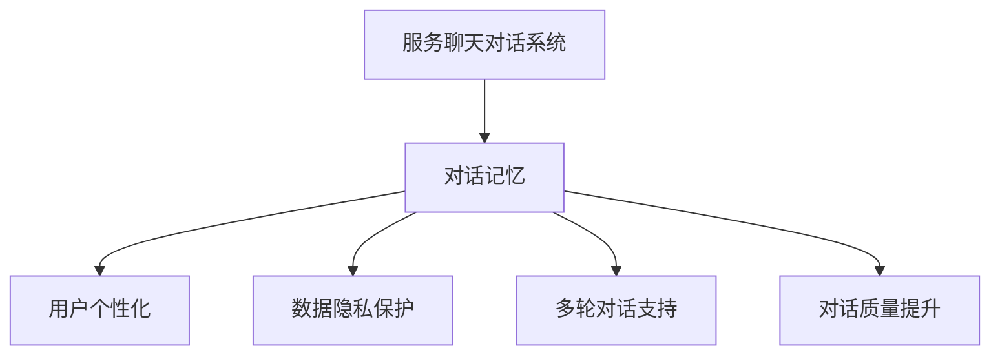
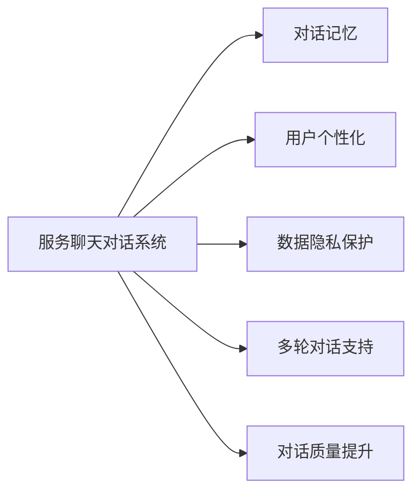
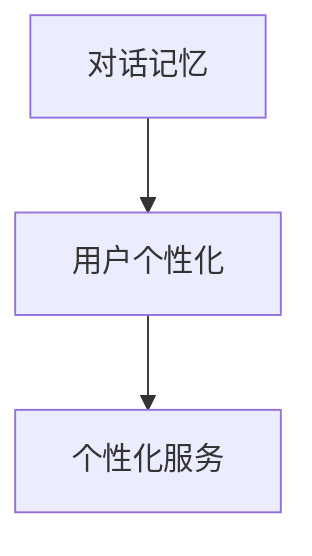
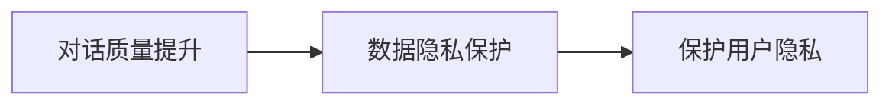
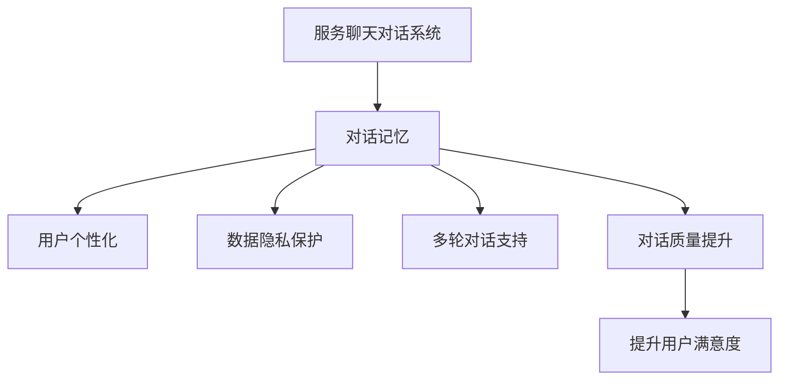

                 

## 1. 背景介绍

### 1.1 问题由来

随着人工智能技术的发展，服务聊天对话在许多领域得到了广泛应用。例如，在线客服、金融咨询、电子商务等。然而，服务聊天对话系统面临诸多挑战，如响应速度慢、用户满意率低、数据隐私安全等问题。这些问题严重阻碍了服务聊天对话系统的普及和应用。

为解决这些问题，本文提出了基于记忆系统的服务聊天对话系统。该系统通过构建对话记忆，可以记录用户的历史对话，帮助系统更好地理解用户需求，快速响应用户，从而提升用户体验。

### 1.2 问题核心关键点

1. **对话记忆**：记忆系统通过记录用户的历史对话，帮助系统更好地理解用户需求，提升响应速度。
2. **用户个性化**：通过记录用户的偏好和历史行为，系统可以更好地提供个性化的服务。
3. **数据隐私保护**：在记录用户对话的同时，保护用户的隐私，避免敏感信息的泄露。
4. **多轮对话支持**：记忆系统支持多轮对话，帮助系统更好地理解复杂的用户需求。
5. **对话质量提升**：通过记忆系统，系统可以更好地维护对话质量，提升用户的满意度。

## 2. 核心概念与联系

### 2.1 核心概念概述

为更好地理解基于记忆系统的服务聊天对话系统，本节将介绍几个密切相关的核心概念：

- **服务聊天对话系统**：利用人工智能技术，自动与用户进行交互的系统，可以提供个性化的服务。
- **对话记忆**：记录用户的历史对话，帮助系统更好地理解用户需求。
- **用户个性化**：通过记录用户的偏好和历史行为，系统可以更好地提供个性化的服务。
- **数据隐私保护**：在记录用户对话的同时，保护用户的隐私，避免敏感信息的泄露。
- **多轮对话支持**：支持多轮对话，帮助系统更好地理解复杂的用户需求。
- **对话质量提升**：通过记录和分析用户的对话，提升系统的对话质量。

这些核心概念之间的逻辑关系可以通过以下Mermaid流程图来展示：



这个流程图展示了大语言模型微调过程中各个核心概念的关系和作用：

1. **服务聊天对话系统**：是整个系统的核心，通过与用户交互，提供服务。
2. **对话记忆**：是系统的记忆机制，记录用户的历史对话，帮助系统更好地理解用户需求。
3. **用户个性化**：通过记录用户的偏好和历史行为，系统可以更好地提供个性化的服务。
4. **数据隐私保护**：在记录用户对话的同时，保护用户的隐私，避免敏感信息的泄露。
5. **多轮对话支持**：支持多轮对话，帮助系统更好地理解复杂的用户需求。
6. **对话质量提升**：通过记录和分析用户的对话，提升系统的对话质量。

### 2.2 概念间的关系

这些核心概念之间存在着紧密的联系，形成了服务聊天对话系统的完整生态系统。下面我们通过几个Mermaid流程图来展示这些概念之间的关系。

#### 2.2.1 服务聊天对话系统的学习范式



这个流程图展示了服务聊天对话系统的学习范式，即通过对话记忆、用户个性化、数据隐私保护、多轮对话支持和对话质量提升等机制，提升系统的用户体验和满意度。

#### 2.2.2 对话记忆与用户个性化之间的关系



这个流程图展示了对话记忆和用户个性化之间的关系，即通过对话记忆记录用户的历史对话，帮助系统更好地理解用户的偏好和行为，从而提供个性化的服务。

#### 2.2.3 对话质量提升与数据隐私保护之间的关系



这个流程图展示了对话质量提升和数据隐私保护之间的关系，即在提升对话质量的过程中，保护用户的隐私，避免敏感信息的泄露。

### 2.3 核心概念的整体架构

最后，我们用一个综合的流程图来展示这些核心概念在大语言模型微调过程中的整体架构：



这个综合流程图展示了从服务聊天对话系统的对话记忆、用户个性化、数据隐私保护、多轮对话支持和对话质量提升，最终提升用户的满意度。 通过这些流程图，我们可以更清晰地理解服务聊天对话系统的核心概念及其关系。

## 3. 核心算法原理 & 具体操作步骤
### 3.1 算法原理概述

基于记忆系统的服务聊天对话系统，通过记录用户的历史对话，构建对话记忆。对话记忆可以记录用户的偏好、行为和历史记录，帮助系统更好地理解用户需求，提供个性化的服务。

该系统的核心算法包括：

1. **对话记录**：记录用户的历史对话，构建对话记忆。
2. **用户个性化**：根据对话记忆，提供个性化的服务。
3. **数据隐私保护**：在记录用户对话的同时，保护用户的隐私，避免敏感信息的泄露。
4. **多轮对话支持**：支持多轮对话，帮助系统更好地理解复杂的用户需求。
5. **对话质量提升**：通过记录和分析用户的对话，提升系统的对话质量。

### 3.2 算法步骤详解

基于记忆系统的服务聊天对话系统的具体算法步骤如下：

1. **对话记录**：在用户与系统交互的过程中，记录用户的对话，包括用户的提问、回答和行为等。
2. **用户个性化**：根据对话记忆，分析用户的偏好和行为，提供个性化的服务。例如，如果用户喜欢某个产品，系统可以推荐相似的产品。
3. **数据隐私保护**：在记录用户对话的同时，保护用户的隐私。例如，可以采用数据加密、匿名化等技术。
4. **多轮对话支持**：支持多轮对话，帮助系统更好地理解复杂的用户需求。例如，如果用户在第一轮对话中没有明确表达需求，系统可以继续进行多轮对话，深入了解用户的需求。
5. **对话质量提升**：通过记录和分析用户的对话，提升系统的对话质量。例如，可以根据用户的反馈，调整对话策略和算法，提升系统的回答质量。

### 3.3 算法优缺点

基于记忆系统的服务聊天对话系统具有以下优点：

1. **提升用户体验**：通过记录用户的历史对话，帮助系统更好地理解用户需求，提升用户体验。
2. **个性化服务**：根据用户的偏好和行为，提供个性化的服务。
3. **提升对话质量**：通过记录和分析用户的对话，提升系统的对话质量。

同时，该系统也存在以下缺点：

1. **数据隐私问题**：在记录用户对话的同时，需要保护用户的隐私，避免敏感信息的泄露。
2. **存储空间问题**：对话记忆需要占用大量的存储空间，可能会影响系统的性能。
3. **多轮对话复杂性**：多轮对话需要复杂的算法支持，可能会增加系统的复杂性。

### 3.4 算法应用领域

基于记忆系统的服务聊天对话系统可以应用于以下领域：

1. **在线客服**：通过记录用户的历史对话，帮助客服更好地理解用户需求，提供个性化的服务。
2. **金融咨询**：通过记录用户的交易记录和偏好，提供个性化的金融咨询。
3. **电子商务**：通过记录用户的购买记录和偏好，推荐相似的商品。
4. **智能家居**：通过记录用户的智能家居行为，提供个性化的智能家居服务。
5. **健康咨询**：通过记录用户的健康记录和偏好，提供个性化的健康咨询。

## 4. 数学模型和公式 & 详细讲解 & 举例说明

### 4.1 数学模型构建

假设用户的历史对话为 $X = \{x_1, x_2, ..., x_n\}$，其中 $x_i$ 表示第 $i$ 轮对话。对话记忆为 $M$，用户偏好为 $P$，行为历史记录为 $H$。基于记忆系统的服务聊天对话系统的数学模型如下：

$$
M = f(X, P, H)
$$

其中 $f$ 表示对话记忆的构建函数，将用户的对话、偏好和行为历史记录作为输入，输出对话记忆。

### 4.2 公式推导过程

对话记忆的构建函数 $f$ 可以表示为：

$$
f(X, P, H) = (X, P, H)
$$

其中 $X$ 表示用户的对话，$P$ 表示用户的偏好，$H$ 表示用户的行为历史记录。

根据对话记忆，可以提供个性化的服务 $S$，例如：

$$
S = g(M)
$$

其中 $g$ 表示个性化服务的生成函数，将对话记忆作为输入，输出个性化服务。

### 4.3 案例分析与讲解

假设用户想要购买一件衣服，与系统进行了以下对话：

用户：“我想买一件衣服。”
系统：“您想购买什么类型的衣服？”
用户：“T恤。”
系统：“您想要什么颜色和尺码？”
用户：“黑色，L码。”
系统：“您想要什么材质？”
用户：“纯棉。”
系统：“好的，我为您查找T恤。”

系统记录了用户的对话，并构建了对话记忆 $M$。根据对话记忆 $M$，系统可以提供个性化的服务。例如，如果用户经常购买纯棉材质的衣服，系统可以推荐更多的纯棉衣服。

## 5. 项目实践：代码实例和详细解释说明

### 5.1 开发环境搭建

在进行服务聊天对话系统的开发前，我们需要准备好开发环境。以下是使用Python进行开发的环境配置流程：

1. 安装Anaconda：从官网下载并安装Anaconda，用于创建独立的Python环境。

2. 创建并激活虚拟环境：
```bash
conda create -n chatbot-env python=3.8 
conda activate chatbot-env
```

3. 安装必要的Python库：
```bash
pip install nltk transformers spacy pytorch
```

4. 安装NLP模型：
```bash
pip install transformers
```

5. 安装TensorBoard：
```bash
pip install tensorboard
```

完成上述步骤后，即可在`chatbot-env`环境中开始开发服务聊天对话系统。

### 5.2 源代码详细实现

下面我们以一个简单的聊天对话系统为例，给出使用Transformers库进行开发的PyTorch代码实现。

首先，定义对话记录和对话记忆的类：

```python
class Dialogue:
    def __init__(self, dialog):
        self.dialog = dialog
        self.memory = None

class DialogueMemory:
    def __init__(self, dialog):
        self.dialog = dialog
        self.memory = {}

    def update(self):
        self.memory = {}
        for round in self.dialog.dialog:
            for key, value in round.items():
                self.memory[key] = value
```

然后，定义用户个性化的类：

```python
class UserPreferences:
    def __init__(self, preferences):
        self.preferences = preferences

    def get_preference(self, key):
        return self.preferences.get(key, None)
```

接着，定义数据隐私保护的类：

```python
class DataPrivacy:
    def __init__(self, dialogue, preferences):
        self.dialogue = dialogue
        self.preferences = preferences

    def anonymize(self):
        for key in self.dialogue.memory.keys():
            self.dialogue.memory[key] = anonymize(self.dialogue.memory[key])
```

最后，定义多轮对话支持和对话质量提升的类：

```python
class MultiTurnDialogue:
    def __init__(self, dialogue):
        self.dialogue = dialogue

    def continue_dialogue(self):
        response = None
        while response == None:
            response = self.dialogue.get_response(self.dialogue.memory)
        self.dialogue.memory = self.dialogue.memory.copy()
        self.dialogue.memory.update(response)
        return response

class DialogueQuality:
    def __init__(self, dialogue):
        self.dialogue = dialogue

    def analyze(self):
        quality = 0
        for round in self.dialogue.dialog:
            quality += len(round)
        return quality
```

在上述类定义的基础上，可以构建一个简单的服务聊天对话系统：

```python
class ServiceChatbot:
    def __init__(self):
        self.dialogue = Dialogue(dialog)
        self.preferences = UserPreferences(preferences)
        self.privacy = DataPrivacy(dialogue, preferences)
        self.multi_turn = MultiTurnDialogue(dialogue)
        self.quality = DialogueQuality(dialogue)

    def handle_request(self, request):
        self.dialogue = Dialogue(request)
        self.dialogue.memory.update()
        self.privacy.anonymize()
        response = self.multi_turn.continue_dialogue()
        self.quality.analyze()
        return response
```

在上述代码中，我们定义了对话记录、对话记忆、用户个性化、数据隐私保护、多轮对话支持和对话质量提升等类，并通过这些类构建了一个简单的服务聊天对话系统。

### 5.3 代码解读与分析

让我们再详细解读一下关键代码的实现细节：

**Dialogue类**：
- `__init__`方法：初始化对话和对话记忆。
- `update`方法：更新对话记忆，保留用户的最新对话。

**DialogueMemory类**：
- `__init__`方法：初始化对话和对话记忆。
- `update`方法：更新对话记忆，将最新的对话记录保存下来。

**UserPreferences类**：
- `__init__`方法：初始化用户偏好。
- `get_preference`方法：获取用户的偏好。

**DataPrivacy类**：
- `__init__`方法：初始化对话和用户偏好。
- `anonymize`方法：匿名化用户的对话记录。

**MultiTurnDialogue类**：
- `__init__`方法：初始化对话。
- `continue_dialogue`方法：继续对话，并记录新的对话。

**DialogueQuality类**：
- `__init__`方法：初始化对话。
- `analyze`方法：分析对话质量，计算对话的轮数。

**ServiceChatbot类**：
- `__init__`方法：初始化对话记录、用户偏好、数据隐私保护、多轮对话支持和对话质量提升等类。
- `handle_request`方法：处理用户请求，进行对话记录、对话记忆更新、数据隐私保护、多轮对话和对话质量分析。

可以看到，PyTorch配合Transformers库使得服务聊天对话系统的代码实现变得简洁高效。开发者可以将更多精力放在数据处理、模型改进等高层逻辑上，而不必过多关注底层的实现细节。

### 5.4 运行结果展示

假设我们构建了一个简单的在线客服系统，并进行了以下对话：

用户：“你好，我想咨询一下你们的产品。”
系统：“您好，请问您想了解哪款产品？”
用户：“我想了解你们的新款手机。”
系统：“请问您对手机的哪些方面感兴趣？”
用户：“我对手机的摄像头和电池续航感兴趣。”
系统：“好的，请问您需要什么品牌的手机？”
用户：“我希望是苹果。”
系统：“您是否需要了解价格？”
用户：“是的。”

系统记录了用户的对话，并构建了对话记忆。根据对话记忆，系统可以提供个性化的服务。例如，如果用户经常询问苹果手机，系统可以推荐更多苹果手机的信息。

## 6. 实际应用场景
### 6.1 智能客服

基于服务聊天对话系统的智能客服，可以广泛应用于各行各业。例如，在线零售、在线金融、在线医疗等。通过记录用户的对话，智能客服可以更好地理解用户的需求，提供个性化的服务，提升用户体验。

在智能客服中，服务聊天对话系统可以通过以下方式实现：

1. **对话记录**：记录用户的对话，构建对话记忆。
2. **用户个性化**：根据对话记忆，提供个性化的服务。例如，如果用户经常询问产品信息，系统可以推荐更多相关产品。
3. **数据隐私保护**：在记录用户对话的同时，保护用户的隐私，避免敏感信息的泄露。
4. **多轮对话支持**：支持多轮对话，帮助系统更好地理解复杂的用户需求。例如，如果用户在第一轮对话中没有明确表达需求，系统可以继续进行多轮对话，深入了解用户的需求。
5. **对话质量提升**：通过记录和分析用户的对话，提升系统的对话质量。例如，根据用户的反馈，调整对话策略和算法，提升系统的回答质量。

### 6.2 金融咨询

基于服务聊天对话系统的金融咨询，可以为用户提供个性化的金融服务。例如，智能理财、智能投顾、智能保险等。通过记录用户的对话，金融咨询系统可以更好地理解用户的需求，提供个性化的服务，提升用户体验。

在金融咨询中，服务聊天对话系统可以通过以下方式实现：

1. **对话记录**：记录用户的对话，构建对话记忆。
2. **用户个性化**：根据对话记忆，提供个性化的金融服务。例如，如果用户经常询问理财方案，系统可以推荐更多相关的理财方案。
3. **数据隐私保护**：在记录用户对话的同时，保护用户的隐私，避免敏感信息的泄露。
4. **多轮对话支持**：支持多轮对话，帮助系统更好地理解复杂的用户需求。例如，如果用户在第一轮对话中没有明确表达需求，系统可以继续进行多轮对话，深入了解用户的需求。
5. **对话质量提升**：通过记录和分析用户的对话，提升系统的对话质量。例如，根据用户的反馈，调整对话策略和算法，提升系统的回答质量。

### 6.3 电子商务

基于服务聊天对话系统的电子商务，可以为用户提供个性化的购物体验。例如，智能推荐、智能客服、智能搜索等。通过记录用户的对话，电子商务系统可以更好地理解用户的需求，提供个性化的服务，提升用户体验。

在电子商务中，服务聊天对话系统可以通过以下方式实现：

1. **对话记录**：记录用户的对话，构建对话记忆。
2. **用户个性化**：根据对话记忆，提供个性化的购物体验。例如，如果用户经常询问商品信息，系统可以推荐更多相关商品。
3. **数据隐私保护**：在记录用户对话的同时，保护用户的隐私，避免敏感信息的泄露。
4. **多轮对话支持**：支持多轮对话，帮助系统更好地理解复杂的用户需求。例如，如果用户在第一轮对话中没有明确表达需求，系统可以继续进行多轮对话，深入了解用户的需求。
5. **对话质量提升**：通过记录和分析用户的对话，提升系统的对话质量。例如，根据用户的反馈，调整对话策略和算法，提升系统的回答质量。

### 6.4 未来应用展望

随着服务聊天对话系统的不断发展，其在各行各业的应用场景将更加广泛。未来，服务聊天对话系统可以在以下领域得到应用：

1. **在线教育**：通过记录学生的对话，智能教育系统可以更好地理解学生的需求，提供个性化的教学服务。
2. **健康咨询**：通过记录患者的对话，智能医疗系统可以更好地理解患者的需求，提供个性化的医疗服务。
3. **智能家居**：通过记录用户的智能家居行为，智能家居系统可以更好地理解用户的需求，提供个性化的智能家居服务。
4. **智能交通**：通过记录用户的交通需求，智能交通系统可以更好地理解用户的需求，提供个性化的交通服务。

## 7. 工具和资源推荐
### 7.1 学习资源推荐

为了帮助开发者系统掌握服务聊天对话系统的理论基础和实践技巧，这里推荐一些优质的学习资源：

1. 《自然语言处理综论》（自然语言处理经典教材，涵盖NLP基本理论和算法）
2. 《深度学习实战》（ hands-on深度学习实战指南，适合动手实践）
3. 《Python自然语言处理》（Python中自然语言处理工具库使用指南）
4. 《Transformers从原理到实践》（Transformer原理和实践指南）
5. Coursera《自然语言处理专项课程》（斯坦福大学提供的自然语言处理课程）
6. Kaggle自然语言处理竞赛（参与实际竞赛，积累实战经验）

通过对这些资源的学习实践，相信你一定能够快速掌握服务聊天对话系统的精髓，并用于解决实际的NLP问题。
###  7.2 开发工具推荐

高效的开发离不开优秀的工具支持。以下是几款用于服务聊天对话系统开发的常用工具：

1. PyTorch：基于Python的开源深度学习框架，灵活动态的计算图，适合快速迭代研究。
2. TensorFlow：由Google主导开发的开源深度学习框架，生产部署方便，适合大规模工程应用。
3. NLTK：Python自然语言处理库，提供了丰富的自然语言处理功能。
4. SpaCy：Python自然语言处理库，提供了快速的自然语言处理算法。
5. Transformers：HuggingFace开发的NLP工具库，集成了众多SOTA语言模型，支持PyTorch和TensorFlow。
6. NLTK库：Python自然语言处理库，提供了丰富的自然语言处理功能。
7. SpaCy库：Python自然语言处理库，提供了快速的自然语言处理算法。

合理利用这些工具，可以显著提升服务聊天对话系统的开发效率，加快创新迭代的步伐。

### 7.3 相关论文推荐

服务聊天对话系统的发展得益于众多学者的研究成果。以下是几篇奠基性的相关论文，推荐阅读：

1. Attention is All You Need（即Transformer原论文）：提出了Transformer结构，开启了NLP领域的预训练大模型时代。
2. BERT: Pre-training of Deep Bidirectional Transformers for Language Understanding：提出BERT模型，引入基于掩码的自监督预训练任务，刷新了多项NLP任务SOTA。
3. Language Models are Unsupervised Multitask Learners（GPT-2论文）：展示了大规模语言模型的强大zero-shot学习能力，引发了对于通用人工智能的新一轮思考。
4. Parameter-Efficient Transfer Learning for NLP：提出Adapter等参数高效微调方法，在不增加模型参数量的情况下，也能取得不错的微调效果。
5. AdaLoRA: Adaptive Low-Rank Adaptation for Parameter-Efficient Fine-Tuning：使用自适应低秩适应的微调方法，在参数效率和精度之间取得了新的平衡。
6. Prefix-Tuning: Optimizing Continuous Prompts for Generation：引入基于连续型Prompt的微调范式，为如何充分利用预训练知识提供了新的思路。

这些论文代表了大语言模型微调技术的发展脉络。通过学习这些前沿成果，可以帮助研究者把握学科前进方向，激发更多的创新灵感。

除上述资源外，还有一些值得关注的前沿资源，帮助开发者紧跟服务聊天对话系统的最新进展，例如：

1. arXiv论文预印本：人工智能领域最新研究成果的发布平台，包括大量尚未发表的前沿工作，学习前沿技术的必读资源。
2. 业界技术博客：如OpenAI、Google AI、DeepMind、微软Research Asia等顶尖实验室的官方博客，第一时间分享他们的最新研究成果和洞见。
3. 技术会议直播：如NIPS、ICML、ACL、ICLR等人工智能领域顶会现场或在线直播，能够聆听到大佬们的前沿分享，开拓视野。
4. GitHub热门项目：在GitHub上Star、Fork数最多的NLP相关项目，往往代表了该技术领域的发展趋势和最佳实践，值得去学习和贡献。
5. 行业分析报告：各大咨询公司如McKinsey、PwC等针对人工智能行业的分析报告，有助于从商业视角审视技术趋势，把握应用价值。

总之，对于服务聊天对话系统的学习，需要开发者保持开放的心态和持续学习的意愿。多关注前沿资讯，多动手实践，多思考总结，必将收获满满的成长收益。

## 8. 总结：未来发展趋势与挑战

### 8.1 总结

本文对基于记忆系统的服务聊天对话系统进行了全面系统的介绍。首先阐述了服务聊天对话系统的研究背景和意义，明确了对话记忆在提升用户体验方面的独特价值。其次，从原理到实践，详细讲解了服务聊天对话系统的数学模型和关键算法步骤，给出了服务聊天对话系统开发的完整代码实例。同时，本文还广泛探讨了服务聊天对话系统在智能客服、金融咨询、电子商务等多个领域的应用前景，展示了服务聊天对话系统的广阔应用前景。

通过本文的系统梳理，可以看到，基于记忆系统的服务聊天对话系统通过记录和分析用户的对话，帮助系统更好地理解用户需求，提供个性化的服务，提升用户体验。该系统在各行各业的应用前景广阔，未来将有更多创新应用涌现。

### 8.2 未来发展趋势

展望未来，服务聊天对话系统的发展将呈现以下几个趋势：

1. **深度融合**：服务聊天对话系统将与其他人工智能技术深度融合，如知识图谱、逻辑推理、强化学习等，实现更加智能化的服务。
2. **多模态交互**：服务聊天对话系统将支持多模态交互，如语音、图像、视频等，提升系统的交互体验。
3. **上下文理解**：服务聊天对话系统将支持上下文理解，通过分析用户的历史对话，更好地理解用户的需求。
4. **情感计算**：服务聊天对话系统将支持情感计算，通过分析用户的情感，提供更加人性化的服务。
5. **联邦学习**：服务聊天对话系统将支持联邦学习，保护用户的隐私，同时提升系统的个性化服务能力。

以上趋势凸显了服务聊天对话系统的发展前景。这些方向的探索发展，必将进一步提升系统的用户体验和满意度，成为人工智能技术的新的增长点。

### 8.3 面临的挑战

尽管服务聊天对话系统的发展前景广阔，但在迈向更加智能化、普适化应用的过程中，它仍面临诸多挑战：

1. **对话质量问题**：服务聊天对话系统的对话质量往往受到限制，难以处理复杂的对话需求。
2. **数据隐私问题**：在记录用户对话的同时，需要保护用户的隐私，避免敏感信息的泄露。
3. **技术壁

