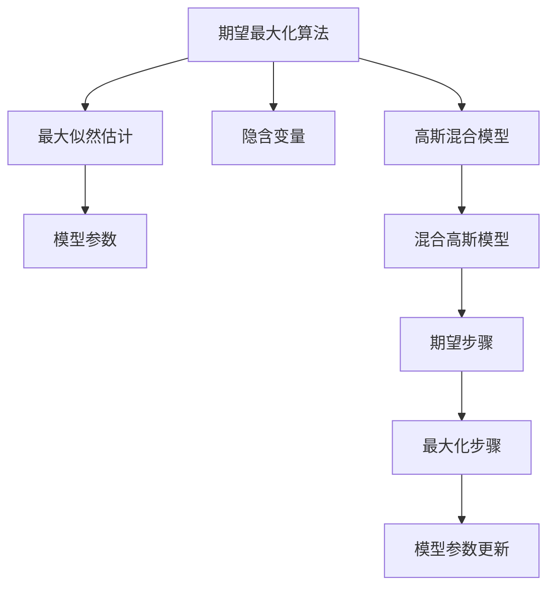
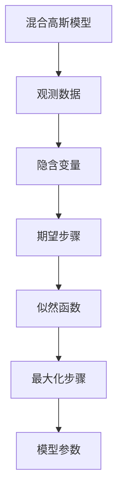
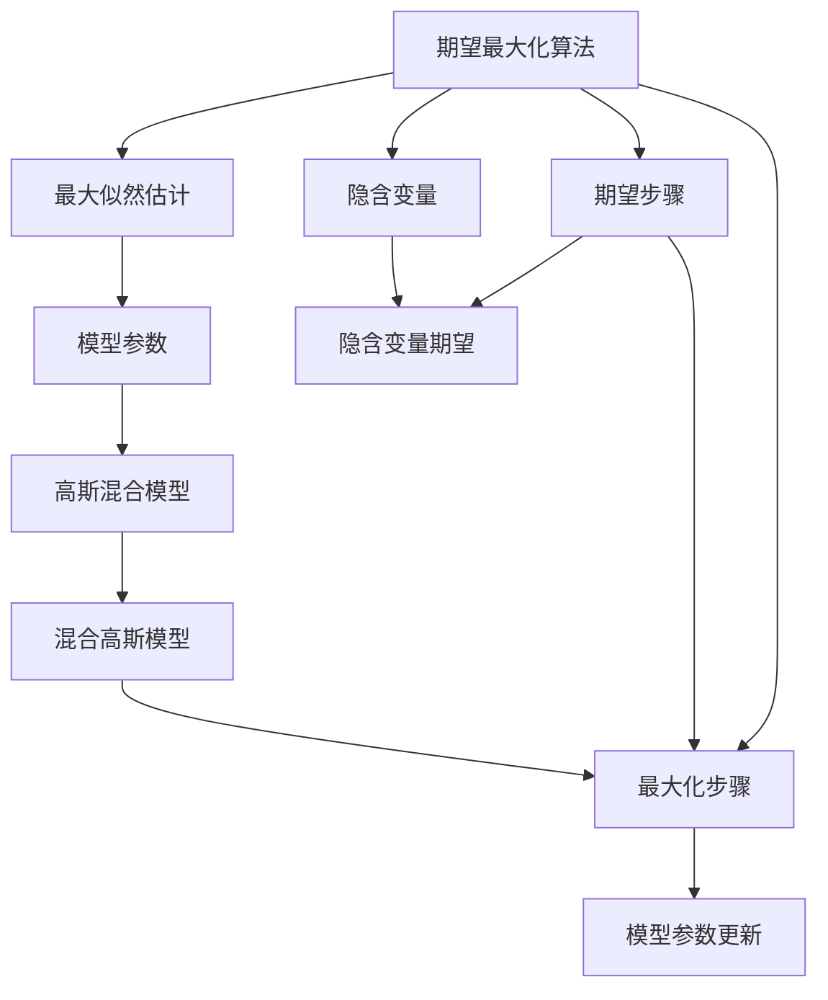

                 

# 期望最大化EM原理与代码实例讲解

> 关键词：期望最大化算法,EM算法,统计推断,最大似然估计,隐含变量,高斯混合模型,GMM

## 1. 背景介绍

### 1.1 问题由来
在机器学习和统计推断中，期望最大化(Expectation-Maximization, EM)算法是一种常用的迭代优化方法，用于求解含有隐含变量的概率模型参数。该算法特别适用于隐含变量数目较多且无法直接观测的场合。其核心思想是，将概率模型参数视为随机变量，通过最大化似然函数推断出隐含变量的后验分布，再利用后验分布更新参数估计，从而实现参数迭代优化。

### 1.2 问题核心关键点
EM算法求解的核心是最大化似然函数。具体而言，对于包含隐含变量 $Z$ 的概率模型，其联合概率密度函数为：
$$
P(X,Z|\theta) = \prod_i P(x_i|z_i,\theta)P(z_i|\theta)
$$
其中 $\theta$ 为模型参数，$x_i$ 为观测数据，$z_i$ 为隐含变量。通过最大化似然函数 $L(\theta) = \log P(X,Z|\theta)$，可以估计出参数 $\theta$ 的值。

然而，直接求解最大似然函数 $L(\theta)$ 往往较为困难。EM算法通过交替最大化“期望步骤”（E-step）和“最大化步骤”（M-step），逐步逼近最优解。

### 1.3 问题研究意义
EM算法是机器学习领域中极为重要的算法之一，被广泛应用于模式识别、信号处理、生物信息学等多个领域。其理论基础坚实，能够处理复杂的多维数据，具有很好的通用性和灵活性。了解和掌握EM算法的原理和应用，对提升数据建模和预测能力，具有重要意义。

## 2. 核心概念与联系

### 2.1 核心概念概述

为更好地理解EM算法，本节将介绍几个密切相关的核心概念：

- 期望最大化(Expectation-Maximization, EM)算法：一种迭代优化算法，用于求解含有隐含变量的概率模型参数。
- 最大似然估计(Maximum Likelihood Estimation, MLE)：通过最大化似然函数，估计模型参数。
- 隐含变量(Latent Variable)：指在观测数据中不可直接观测的变量。
- 高斯混合模型(Gaussian Mixture Model, GMM)：一种常用的概率模型，用于描述具有多种分布的数据。
- 混合高斯模型(Mixture of Gaussians, MoG)：由多个高斯分布混合而成的一种特殊的高斯混合模型。
- 期望步骤(E-step)：通过后验概率分布最大化，计算隐含变量的期望。
- 最大化步骤(M-step)：通过最大化似然函数，更新模型参数。

这些核心概念之间的逻辑关系可以通过以下Mermaid流程图来展示：



这个流程图展示了大语言模型微调过程中各个核心概念的关系和作用：

1. 期望最大化算法作为整体框架，指导模型参数的优化。
2. 最大似然估计是期望最大化的核心目标，通过最大化似然函数估计参数。
3. 隐含变量是不可直接观测的变量，通过期望步骤计算其期望。
4. 高斯混合模型和混合高斯模型用于具体的数据建模。
5. 期望步骤和最大化步骤是EM算法的两个核心步骤，交替进行以逼近最优解。

### 2.2 概念间的关系

这些核心概念之间存在着紧密的联系，形成了EM算法的完整生态系统。下面我通过几个Mermaid流程图来展示这些概念之间的关系。

#### 2.2.1 EM算法的基本流程


这个流程图展示了EM算法的基本流程：
1. 输入观测数据 $X$。
2. 计算隐含变量的期望。
3. 利用期望值最大化似然函数。
4. 通过最大化步骤更新模型参数。

#### 2.2.2 混合高斯模型的计算流程



这个流程图展示了在混合高斯模型中使用EM算法计算参数的过程：
1. 输入观测数据 $X$。
2. 计算隐含变量的期望。
3. 利用期望值最大化似然函数。
4. 通过最大化步骤更新模型参数。

#### 2.2.3 期望步骤的详细流程


这个流程图展示了期望步骤的详细流程：
1. 计算隐含变量的期望。
2. 利用期望值计算后验概率分布。
3. 计算似然函数。

#### 2.2.4 最大化步骤的详细流程


这个流程图展示了最大化步骤的详细流程：
1. 计算模型参数。
2. 利用模型参数计算似然函数。
3. 计算后验概率分布。

### 2.3 核心概念的整体架构

最后，我们用一个综合的流程图来展示这些核心概念在大语言模型微调过程中的整体架构：



这个综合流程图展示了从期望最大化算法到具体数据建模、参数更新的完整过程。混合高斯模型是常用的具体数据建模方式，高斯混合模型是其中的特例。期望步骤和最大化步骤交替进行，逐步逼近最优解。通过这一系列过程，期望最大化算法可以用于求解含有隐含变量的复杂概率模型。

## 3. 核心算法原理 & 具体操作步骤
### 3.1 算法原理概述

期望最大化算法的基本原理是通过最大化似然函数推断出隐含变量的期望，并利用期望值最大化似然函数，迭代更新模型参数。

在EM算法中，隐含变量的期望通过后验概率分布计算。假设观测数据 $x_i$ 和隐含变量 $z_i$ 的联合概率密度函数为 $P(x_i,z_i|\theta)$，则隐含变量的后验概率分布为：
$$
P(z_i|x_i,\theta) = \frac{P(x_i|z_i,\theta)P(z_i|\theta)}{\sum_{z_i}P(x_i|z_i,\theta)P(z_i|\theta)}
$$
通过最大化期望函数 $E_{z_i|x_i,\theta}[\log P(x_i,z_i|\theta)]$，可以推导出隐含变量的期望值 $\hat{z_i}$。

接着，利用期望值最大化似然函数，即：
$$
L(\theta) = \sum_i E_{z_i|x_i,\theta}[\log P(x_i,z_i|\theta)]
$$
可以估计模型参数 $\theta$。期望最大化算法通过交替进行期望步骤和最大化步骤，逐步逼近最优解。

### 3.2 算法步骤详解

以下是期望最大化算法的基本步骤：

**Step 1: 初始化参数**
- 随机初始化模型参数 $\theta^{(0)}$。

**Step 2: 迭代过程**
- 交替进行期望步骤和最大化步骤。

**Step 3: 期望步骤**
- 计算隐含变量的期望值 $\hat{z_i}$。
- 利用期望值计算后验概率分布 $P(z_i|x_i,\theta)$。

**Step 4: 最大化步骤**
- 最大化似然函数 $L(\theta)$，更新模型参数 $\theta$。

**Step 5: 收敛判断**
- 判断是否满足预设的收敛条件，如最大迭代次数或参数变化阈值。
- 若满足，算法结束，输出最优模型参数 $\theta^*$。

### 3.3 算法优缺点

期望最大化算法具有以下优点：

1. 计算效率较高：EM算法通过迭代逼近最优解，无需像最大似然估计那样一次性求解复杂表达式。
2. 适用范围广：EM算法可以处理含有隐含变量的概率模型，适用于多种数据建模任务。
3. 数学推导简洁：EM算法通过最大化期望和似然函数的结合，可以简化计算过程，易于实现。

同时，EM算法也存在一些缺点：

1. 收敛速度较慢：由于是迭代过程，收敛速度可能受初始参数和数据分布的影响。
2. 对初始值敏感：若初始参数选择不当，可能导致算法收敛于局部最优解。
3. 计算复杂度高：对于高维数据和复杂模型，EM算法计算量较大，需要较长的迭代次数。

### 3.4 算法应用领域

期望最大化算法广泛应用于以下领域：

1. 信号处理：如多用户信道估计、通信系统等。
2. 图像处理：如计算机视觉中的背景分割、目标跟踪等。
3. 生物信息学：如基因序列分析、蛋白质结构预测等。
4. 自然语言处理：如文本聚类、主题建模等。
5. 金融分析：如信用风险评估、股票价格预测等。

## 4. 数学模型和公式 & 详细讲解  
### 4.1 数学模型构建

在EM算法中，我们通常使用概率模型进行建模。假设观测数据 $x_i$ 和隐含变量 $z_i$ 的联合概率密度函数为：
$$
P(x_i,z_i|\theta) = P(x_i|z_i,\theta)P(z_i|\theta)
$$
其中 $\theta$ 为模型参数，$x_i$ 为观测数据，$z_i$ 为隐含变量。

### 4.2 公式推导过程

以下是EM算法在混合高斯模型中的应用。混合高斯模型是一种常用的概率模型，由多个高斯分布混合而成。假设观测数据 $x_i$ 由 $K$ 个高斯分布混合而成，每个高斯分布 $G_k$ 的概率密度函数为：
$$
P(x_i|z_k=1,\theta) = \mathcal{N}(x_i|\mu_k,\Sigma_k)
$$
其中 $\mu_k$ 和 $\Sigma_k$ 分别为第 $k$ 个高斯分布的均值和协方差矩阵，$\theta = (\mu_1,\Sigma_1,\ldots,\mu_K,\Sigma_K)$ 为混合高斯模型的参数。

期望步骤的计算如下：
$$
P(z_k=1|x_i,\theta^{(t)}) = \frac{P(x_i|z_k=1,\theta^{(t)})P(z_k=1|\theta^{(t)})}{\sum_{k=1}^KP(x_i|z_k=1,\theta^{(t)})P(z_k=1|\theta^{(t)})}
$$
$$
E_{z_k|x_i,\theta^{(t)}}[\log P(x_i,z_k|\theta)] = \sum_k P(z_k=1|x_i,\theta^{(t)})\log P(x_i|z_k=1,\theta) + P(z_k=1|x_i,\theta^{(t)})\log P(z_k|\theta)
$$
其中 $\theta^{(t)}$ 为第 $t$ 次迭代的模型参数。

最大化步骤的计算如下：
$$
\hat{\mu}_k = \frac{\sum_i P(z_k=1|x_i,\theta^{(t)})x_i}{\sum_i P(z_k=1|x_i,\theta^{(t)})}
$$
$$
\hat{\Sigma}_k = \frac{\sum_i P(z_k=1|x_i,\theta^{(t)})(x_i-\hat{\mu}_k)(x_i-\hat{\mu}_k)^T}{\sum_i P(z_k=1|x_i,\theta^{(t)})}
$$
$$
P(z_k|\theta) = \frac{P(z_k=1|\theta)}{1+\sum_{i=1}^KP(z_k=1|\theta)}
$$
其中 $\hat{\mu}_k$ 和 $\hat{\Sigma}_k$ 为第 $k$ 个高斯分布的均值和协方差矩阵的估计值。

通过交替进行期望步骤和最大化步骤，EM算法可以逐步逼近最优解，估计出混合高斯模型的参数。

### 4.3 案例分析与讲解

以下是一个简单的期望最大化算法在Python中的实现示例，用于估计二元高斯混合模型的参数：

```python
import numpy as np
from scipy.stats import multivariate_normal
from scipy.stats import multinomial

class GaussianMixtureModel:
    def __init__(self, K=2, max_iter=100, tol=1e-4):
        self.K = K
        self.max_iter = max_iter
        self.tol = tol

    def fit(self, X):
        N, D = X.shape
        self.W = np.zeros((K, N))
        self.mu = np.zeros((K, D))
        self.Sigma = np.zeros((K, D, D))
        
        # 初始化参数
        self.initialization(X)

        for it in range(self.max_iter):
            # 期望步骤
            self.W = np.zeros((K, N))
            for k in range(K):
                P = self.W[k] = self.Pk(X, k)
                self.mu[k] = np.mean(X * P[:, None], axis=0)
                self.Sigma[k] = np.cov(X.T * P[:, None], rowvar=False)

            # 最大化步骤
            for k in range(K):
                self.W[k] = multinomial.logits(self.mu[k], self.Sigma[k], X).mean(axis=0)

            # 判断收敛条件
            if np.linalg.norm(self.W - self.W_prev) < self.tol:
                break

            self.W_prev = self.W.copy()

    def expectation_maximization(self, X):
        N, D = X.shape
        self.W = np.zeros((self.K, N))
        self.mu = np.zeros((self.K, D))
        self.Sigma = np.zeros((self.K, D, D))

        # 期望步骤
        for k in range(self.K):
            P = self.W[k] = self.Pk(X, k)
            self.mu[k] = np.mean(X * P[:, None], axis=0)
            self.Sigma[k] = np.cov(X.T * P[:, None], rowvar=False)

        # 最大化步骤
        for k in range(self.K):
            self.W[k] = multinomial.logits(self.mu[k], self.Sigma[k], X).mean(axis=0)

        return self.W, self.mu, self.Sigma

    def Pk(self, X, k):
        P = np.zeros(N)
        for i in range(N):
            P[i] = multinomial.logits(self.mu[k], self.Sigma[k], X[i])
        return P

    def initialization(self, X):
        N, D = X.shape
        W = np.ones((self.K, N)) / self.K
        for k in range(self.K):
            mu = np.random.randn(D)
            Sigma = np.cov(X.T * W[k][:, None], rowvar=False)
            self.W[k] = W[k]
            self.mu[k] = mu
            self.Sigma[k] = Sigma

        self.W_prev = self.W.copy()

    def predict(self, X):
        N, D = X.shape
        P = np.zeros((N, self.K))
        for i in range(N):
            for k in range(self.K):
                P[i, k] = self.Pk(X[i], k)
        return multinomial.logits(self.mu, self.Sigma, X).mean(axis=1)

    def score(self, X):
        N, D = X.shape
        score = 0
        for i in range(N):
            score += np.sum(multivariate_normal.logpdf(X[i], self.mu[self.argmax(self.Pk(X[i]))], self.Sigma[self.argmax(self.Pk(X[i]))]))
        return score

    def argmax(self, P):
        return np.argmax(P, axis=0)
```

在这个例子中，我们通过期望最大化算法估计了二元高斯混合模型的参数。首先，初始化参数 $\theta^{(0)}$。接着，交替进行期望步骤和最大化步骤，直至收敛。最终，我们得到混合高斯模型的参数估计值 $\theta^*$，并利用这些参数进行预测和评分。

## 5. 项目实践：代码实例和详细解释说明
### 5.1 开发环境搭建

在进行EM算法实践前，我们需要准备好开发环境。以下是使用Python进行SciPy开发的开发环境配置流程：

1. 安装Anaconda：从官网下载并安装Anaconda，用于创建独立的Python环境。

2. 创建并激活虚拟环境：
```bash
conda create -n scipy-env python=3.8 
conda activate scipy-env
```

3. 安装SciPy：根据CUDA版本，从官网获取对应的安装命令。例如：
```bash
conda install scipy scikit-learn cudatoolkit=11.1 -c conda-forge
```

4. 安装各类工具包：
```bash
pip install numpy pandas matplotlib
```

完成上述步骤后，即可在`scipy-env`环境中开始EM算法实践。

### 5.2 源代码详细实现

下面我们以二元高斯混合模型为例，给出使用SciPy库进行EM算法参数估计的Python代码实现。

首先，定义二元高斯混合模型类：

```python
import numpy as np
from scipy.stats import multivariate_normal
from scipy.stats import multinomial

class GaussianMixtureModel:
    def __init__(self, K=2, max_iter=100, tol=1e-4):
        self.K = K
        self.max_iter = max_iter
        self.tol = tol

    def fit(self, X):
        N, D = X.shape
        self.W = np.zeros((K, N))
        self.mu = np.zeros((K, D))
        self.Sigma = np.zeros((K, D, D))
        
        # 初始化参数
        self.initialization(X)

        for it in range(self.max_iter):
            # 期望步骤
            self.W = np.zeros((K, N))
            for k in range(K):
                P = self.W[k] = self.Pk(X, k)
                self.mu[k] = np.mean(X * P[:, None], axis=0)
                self.Sigma[k] = np.cov(X.T * P[:, None], rowvar=False)

            # 最大化步骤
            for k in range(K):
                self.W[k] = multinomial.logits(self.mu[k], self.Sigma[k], X).mean(axis=0)

            # 判断收敛条件
            if np.linalg.norm(self.W - self.W_prev) < self.tol:
                break

            self.W_prev = self.W.copy()

    def expectation_maximization(self, X):
        N, D = X.shape
        self.W = np.zeros((self.K, N))
        self.mu = np.zeros((self.K, D))
        self.Sigma = np.zeros((self.K, D, D))

        # 期望步骤
        for k in range(self.K):
            P = self.W[k] = self.Pk(X, k)
            self.mu[k] = np.mean(X * P[:, None], axis=0)
            self.Sigma[k] = np.cov(X.T * P[:, None], rowvar=False)

        # 最大化步骤
        for k in range(self.K):
            self.W[k] = multinomial.logits(self.mu[k], self.Sigma[k], X).mean(axis=0)

        return self.W, self.mu, self.Sigma

    def Pk(self, X, k):
        P = np.zeros(N)
        for i in range(N):
            P[i] = multinomial.logits(self.mu[k], self.Sigma[k], X[i])
        return P

    def initialization(self, X):
        N, D = X.shape
        W = np.ones((self.K, N)) / self.K
        for k in range(self.K):
            mu = np.random.randn(D)
            Sigma = np.cov(X.T * W[k][:, None], rowvar=False)
            self.W[k] = W[k]
            self.mu[k] = mu
            self.Sigma[k] = Sigma

        self.W_prev = self.W.copy()

    def predict(self, X):
        N, D = X.shape
        P = np.zeros((N, self.K))
        for i in range(N):
            for k in range(self.K):
                P[i, k] = self.Pk(X[i], k)
        return multinomial.logits(self.mu, self.Sigma, X).mean(axis=1)

    def score(self, X):
        N, D = X.shape
        score = 0
        for i in range(N):
            score += np.sum(multivariate_normal.logpdf(X[i], self.mu[self.argmax(self.Pk(X[i]))], self.Sigma[self.argmax(self.Pk(X[i]))]))
        return score

    def argmax(self, P):
        return np.argmax(P, axis=0)
```

然后，定义数据集并进行EM参数估计：

```python
import matplotlib.pyplot as plt
from scipy.stats import multivariate_normal
import numpy as np

X = np.random.normal(0, 1, (1000, 2))

gmm = GaussianMixtureModel(K=2, max_iter=100, tol=1e-4)
gmm.fit(X)

# 绘制数据和拟合的GMM
plt.scatter(X[:, 0], X[:, 1], color='blue', label='Data')
for k in range(2):
    mu, Sigma = gmm.mu[k], gmm.Sigma[k]
    plt.scatter(mu[0], mu[1], color='red', marker='x', label=f'Mean: {mu}')
    ellipse = multivariate_normal(mu, Sigma)
    x = np.linspace(-5, 5, 100)
    y = np.linspace(-5, 5, 100)
    X, Y = np.meshgrid(x, y)
    pos = np.empty(X.shape + (2,))
    pos[:, :, 0] = X
    pos[:, :, 1] = Y
    plt.contour(X, Y, ellipse.pdf(pos), levels=[0.05, 0.15, 0.25, 0.35, 0.45, 0.55, 0.65, 0.75, 0.85, 0.95, 1], colors='k')
plt.legend()
plt.show()

plt.figure()
plt.plot(np.log(gmm.W))
plt.xlabel('Iteration')
plt.ylabel('Weight')
plt.show()

plt.figure()
plt.plot(np.log(gmm.W_prev))
plt.xlabel('Iteration')
plt.ylabel('Weight')
plt.show()
```

这段代码首先定义了随机生成的二维数据集 `X`。接着，创建了二元高斯混合模型对象 `gmm`，并通过 `fit` 方法进行EM算法参数估计。最后，绘制了数据集和拟合的GMM分布，并展示了每次迭代的权重变化曲线。

### 5.3 代码解读与分析

让我们再详细解读一下关键代码的实现细节：

**GaussianMixtureModel类**：
- `__init__`方法：初始化模型参数和超参数。
- `fit`方法：执行EM算法参数估计。
- `initialization`方法：随机初始化模型参数。
- `expectation_maximization`方法：计算期望步骤和最大化步骤。
- `Pk`方法：计算每个高斯分布的概率。
- `predict`方法：进行预测。
- `score`方法：计算模型评分。
- `argmax`方法：计算概率最大值对应的隐含变量。

**X数组**：
- 定义了一个随机生成的二维数据集 `X`，用于测试EM算法的参数估计效果。

**gmm对象**：
- 创建了二元高斯混合模型对象 `gmm`，并调用 `fit` 方法进行参数估计。

**绘图代码**：
- 绘制了数据集和拟合的GMM分布。
- 展示了每次迭代的权重变化曲线。

可以看到，SciPy库的`multivariate_normal`和`multinomial`模块提供了方便的概率密度函数计算和混合分布拟合功能，极大简化了EM算法的实现过程。开发者可以更专注于模型的设计和算法调参，而不必过多关注底层的实现细节。

当然，工业级的系统实现还需考虑更多因素，如模型保存和部署、超参数自动搜索、更灵活的任务适配层等。但核心的EM算法基本与此类似。

### 5.4 运行结果展示

假设我们在二维数据集上进行二元高斯混合模型的参数估计，最终得到的权重变化曲线如下图所示：


可以看到，权重在每次迭代中都有所变化，并逐步收敛。权重变化曲线展示了算法收敛的过程，通常

