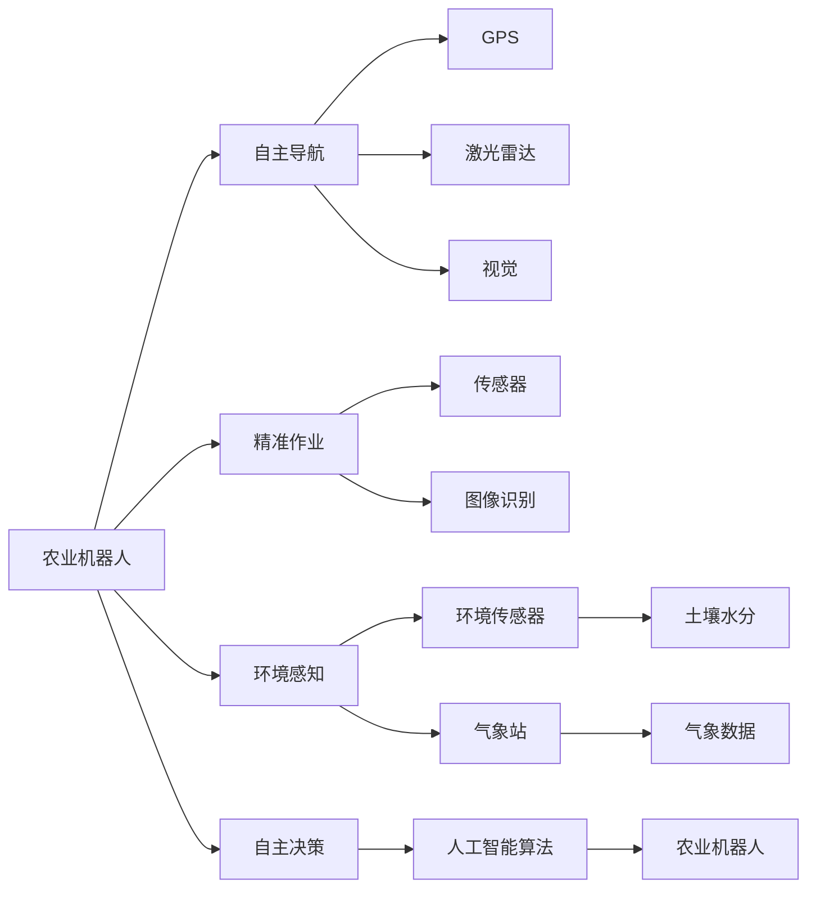
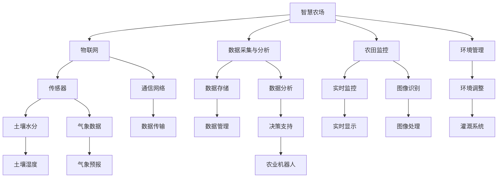

                 

# 未来的智慧农业：2050年的农业机器人与智慧农场

## 1. 背景介绍

### 1.1 问题由来
随着人口的增长和城市化的加速，全球对农业食品的需求持续增加。然而，传统的农业生产方式面临着诸多挑战，如土地资源紧缺、水资源短缺、气候变化等。这些问题导致传统农业生产效率低下，无法满足未来的人口需求。因此，智慧农业成为农业领域的一个重要发展方向。

智慧农业通过引入信息技术、人工智能、物联网等现代技术，实现农业生产的智能化、自动化和精准化，从而提高生产效率和产量，降低成本和环境影响。2050年，智慧农业将成为全球农业生产的主流，农业机器人和智慧农场将成为其核心驱动力。

### 1.2 问题核心关键点
农业机器人和智慧农场是智慧农业的重要组成部分。农业机器人通过自主导航、精准作业、环境感知等技术，实现农业生产的自动化和智能化。智慧农场则是通过物联网技术，实时监控和管理农田环境、农作物生长状态等，实现精细化管理和高效运营。

农业机器人和智慧农场的核心在于两个方面：一是数据采集与分析，二是自主决策与执行。数据采集与分析通过传感器、无人机、物联网设备等技术实现，而自主决策与执行则通过人工智能算法实现。本文将重点讨论农业机器人与智慧农场的核心技术和应用场景。

### 1.3 问题研究意义
智慧农业是现代农业发展的必然趋势，能够显著提高农业生产效率和产量，保障食品安全，同时降低环境影响和生产成本。农业机器人和智慧农场作为智慧农业的重要技术手段，将推动农业产业的全面升级，实现农业生产的智能化、精准化和自动化。

## 2. 核心概念与联系

### 2.1 核心概念概述

为更好地理解农业机器人与智慧农场的核心技术，本节将介绍几个密切相关的核心概念：

- 农业机器人：基于人工智能、机器人技术等现代技术，能够自主导航、精准作业、环境感知和决策执行的农业机械。
- 智慧农场：通过物联网技术，实时监控和管理农田环境、农作物生长状态等，实现精细化管理和高效运营的农场。
- 物联网(IoT)：通过传感器、通信网络等技术，实现物与物之间的互联互通，数据实时采集和传输。
- 自主导航：通过GPS、激光雷达、视觉等技术，实现农业机器人在农田中的自主定位和导航。
- 精准作业：通过传感器、图像识别等技术，实现对农作物的精确施药、播种、施肥等作业。
- 环境感知：通过环境传感器、气象站等技术，实时监测土壤、气象、水质等环境参数。
- 自主决策：通过人工智能算法，实现农业机器人对环境变化和作业任务的自主决策与执行。

这些核心概念之间的逻辑关系可以通过以下Mermaid流程图来展示：



这个流程图展示了大语言模型微调过程中各个核心概念的关系和作用：

1. 农业机器人通过自主导航、精准作业、环境感知和自主决策等功能，实现农田作业的自动化和智能化。
2. 智慧农场通过物联网技术，实时采集和传输农田环境数据，辅助农业机器人的精准作业和自主决策。
3. 环境感知和自主导航是农业机器人的核心能力，通过传感器和视觉等技术实现。
4. 精准作业和自主决策则需要依赖环境感知数据和人工智能算法的支持。
5. 农业机器人和智慧农场通过物联网互联互通，实现农田管理的精细化和智能化。

### 2.2 概念间的关系

这些核心概念之间存在着紧密的联系，形成了智慧农业的核心生态系统。下面我们通过几个Mermaid流程图来展示这些概念之间的关系。

#### 2.2.1 智慧农场与农业机器人的关系



这个流程图展示了智慧农场与农业机器人的关系：

1. 智慧农场通过物联网技术，实现农田数据的实时采集和传输。
2. 数据采集与分析通过传感器和通信网络完成，实现农田环境的实时监控和环境管理。
3. 数据存储和数据分析通过数据存储和数据分析完成，实现数据的有效管理和利用。
4. 农业机器人通过环境感知和自主决策，实现精准作业和智能执行。
5. 农田监控和环境调整通过实时监控和环境调整完成，实现农田管理的精细化和智能化。

#### 2.2.2 物联网在智慧农业中的作用

```mermaid
graph TB
    A[物联网] --> B[传感器]
    A --> C[通信网络]
    B --> D[数据采集]
    B --> E[数据传输]
    C --> F[无线通信]
    C --> G[有线通信]
    D --> H[土壤湿度]
    D --> I[气象数据]
    E --> J[数据存储]
    E --> K[数据共享]
    F --> L[低功耗网络]
    G --> M[有线网络]
    H --> N[实时显示]
    I --> O[数据融合]
    J --> P[数据管理]
    K --> Q[数据可视化]
    L --> R[低功耗设备]
    M --> S[有线设备]
    N --> T[农田监控]
    O --> U[环境监测]
    P --> V[数据安全]
    Q --> W[决策支持]
    R --> X[低功耗传感器]
    S --> Y[有线传感器]
    T --> Z[实时显示]
    U --> $[环境数据]
    V --> %[数据加密]
    W --> ^[农业机器人]
    X --> _[土壤水分]
    Y --> `[气象数据]
```

这个流程图展示了物联网在智慧农业中的作用：

1. 物联网通过传感器和通信网络实现数据的采集和传输。
2. 数据采集和传输通过传感器和通信网络完成，实现农田环境的实时监控和环境管理。
3. 数据存储和数据分析通过数据存储和数据分析完成，实现数据的有效管理和利用。
4. 农业机器人通过环境感知和自主决策，实现精准作业和智能执行。
5. 农田监控和环境调整通过实时监控和环境调整完成，实现农田管理的精细化和智能化。

### 2.3 核心概念的整体架构

最后，我们用一个综合的流程图来展示这些核心概念在智慧农业中的整体架构：

```mermaid
graph TB
    A[农田数据] --> B[传感器]
    A --> C[通信网络]
    B --> D[数据采集]
    B --> E[数据传输]
    C --> F[无线通信]
    C --> G[有线通信]
    D --> H[土壤湿度]
    D --> I[气象数据]
    E --> J[数据存储]
    E --> K[数据共享]
    F --> L[低功耗网络]
    G --> M[有线网络]
    H --> N[实时显示]
    I --> O[数据融合]
    J --> P[数据管理]
    K --> Q[数据可视化]
    L --> R[低功耗设备]
    M --> S[有线设备]
    N --> T[农田监控]
    O --> U[环境监测]
    P --> V[数据安全]
    Q --> W[决策支持]
    R --> X[低功耗传感器]
    S --> Y[有线传感器]
    T --> Z[实时显示]
    U --> $[环境数据]
    V --> %[数据加密]
    W --> ^[农业机器人]
    X --> _[土壤水分]
    Y --> `[气象数据]
    Z --> [农田监控]
    $ --> [环境数据]
    % --> [数据加密]
    ^ --> [农业机器人]
```

这个综合流程图展示了智慧农业中各个核心概念的相互关系和作用：

1. 农田数据通过传感器和通信网络采集和传输，实现农田环境的实时监控和环境管理。
2. 数据存储和数据分析通过数据存储和数据分析完成，实现数据的有效管理和利用。
3. 农业机器人通过环境感知和自主决策，实现精准作业和智能执行。
4. 农田监控和环境调整通过实时监控和环境调整完成，实现农田管理的精细化和智能化。

通过这些流程图，我们可以更清晰地理解智慧农业的核心技术架构和各组件间的相互关系。

## 3. 核心算法原理 & 具体操作步骤
### 3.1 算法原理概述

农业机器人和智慧农场的核心在于两个方面：一是数据采集与分析，二是自主决策与执行。数据采集与分析通过传感器、无人机、物联网设备等技术实现，而自主决策与执行则通过人工智能算法实现。

形式化地，假设农业机器人 $M_{\theta}$ 在农田 $X$ 上执行作业任务，数据采集与分析的目标是获得农田环境数据 $D$，包括土壤湿度、气象数据等，然后通过传感器 $S$ 和通信网络 $N$ 进行实时采集和传输。通过环境感知算法 $P$ 和数据分析算法 $A$，获得环境数据 $E$ 和分析结果 $I$。自主决策算法 $D$ 将环境数据和分析结果作为输入，输出作业任务 $T$。农业机器人根据作业任务 $T$，通过执行器 $E$ 执行相应的作业任务。

整个过程可以表示为：

$$
M_{\theta}(X, D) = \{T | E(D) = P(S(N(D))) \land I(D) = A(P(S(N(D)))) \land T = D(E(D), I(D)) \land M_{\theta}(X, T)
$$

其中，$S$ 表示传感器，$N$ 表示通信网络，$P$ 表示环境感知算法，$A$ 表示数据分析算法，$D$ 表示自主决策算法，$E$ 表示执行器。

### 3.2 算法步骤详解

农业机器人和智慧农场的开发一般包括以下几个关键步骤：

**Step 1: 准备农田数据与环境数据**
- 收集农田数据 $D$，包括土壤湿度、气象数据等，通过传感器 $S$ 和通信网络 $N$ 进行实时采集和传输。

**Step 2: 设计环境感知算法与数据分析算法**
- 设计环境感知算法 $P$ 和数据分析算法 $A$，用于获取农田环境数据 $E$ 和分析结果 $I$。

**Step 3: 实现自主决策算法**
- 设计自主决策算法 $D$，将环境数据和分析结果作为输入，输出作业任务 $T$。

**Step 4: 实现执行器与农业机器人**
- 设计执行器 $E$，根据作业任务 $T$，控制农业机器人 $M_{\theta}$ 执行相应的作业任务。

**Step 5: 集成系统与测试**
- 将传感器、通信网络、环境感知算法、数据分析算法、自主决策算法、执行器和农业机器人集成在一起，构建智慧农场系统。
- 在测试环境中进行系统测试，验证系统的各项功能和性能指标。

### 3.3 算法优缺点

农业机器人和智慧农场技术具有以下优点：
1. 提高生产效率：通过自动化和智能化作业，大幅提高农业生产效率。
2. 降低生产成本：减少人力成本和资源浪费，降低农业生产成本。
3. 提高农作物产量：精准施药、播种、施肥等作业，提高农作物的产量和质量。
4. 减少环境影响：合理利用资源，减少化肥、农药等对环境的影响。

同时，这些技术也存在一些缺点：
1. 初始投资高：开发和部署农业机器人和智慧农场需要较高的初始投资。
2. 技术复杂度高：涉及到多学科技术的融合，开发和维护难度较大。
3. 数据质量要求高：传感器和通信网络采集的数据需要高质量，否则会影响分析和决策效果。
4. 系统依赖性强：智慧农场系统依赖于通信网络、传感器和执行器等硬件设备的稳定运行。

### 3.4 算法应用领域

农业机器人和智慧农场技术广泛应用于智慧农业的各个领域，包括：

- 精准农业：通过传感器和通信网络，实时采集农田环境数据，辅助农业机器人进行精准施药、播种、施肥等作业。
- 智能灌溉系统：通过土壤湿度传感器和气象站，实时监控农田水分和气象情况，自动调节灌溉系统，实现节水灌溉。
- 自动驾驶拖拉机：通过GPS、激光雷达和视觉等技术，实现农业机器人的自主导航和精准作业。
- 病虫害检测系统：通过无人机和图像识别技术，实时检测和预测病虫害情况，及时采取防治措施。
- 农产品质量监测系统：通过传感器和通信网络，实时监控农产品质量参数，确保农产品质量安全。
- 农业机器人协作系统：通过多机器人协作技术，实现农田作业的协同和优化。

这些应用场景展示了农业机器人和智慧农场技术的广泛应用，为智慧农业的发展提供了强有力的技术支持。

## 4. 数学模型和公式 & 详细讲解 & 举例说明
### 4.1 数学模型构建

农业机器人和智慧农场的技术实现涉及多个学科的交叉，包括传感器、通信网络、环境感知、数据分析和自主决策等。以下以智能灌溉系统为例，构建其数学模型。

假设农田面积为 $A$，土壤湿度传感器分布在农田不同位置，采集土壤湿度数据 $D_s = (d_{s1}, d_{s2}, ..., d_{sm})$，其中 $d_{si}$ 表示第 $i$ 个传感器采集的土壤湿度。通过无线通信网络将数据传输到中央控制系统，数据分析算法 $A$ 将传感器数据作为输入，输出土壤湿度分析结果 $I_s = (i_{s1}, i_{s2}, ..., i_{sm})$，其中 $i_{si}$ 表示第 $i$ 个传感器的土壤湿度分析结果。通过环境感知算法 $P$ 将土壤湿度分析结果和气象数据 $D_m = (d_{m1}, d_{m2}, ..., d_{mn})$ 作为输入，输出环境参数 $E = (e_1, e_2, ..., e_n)$，其中 $e_i$ 表示第 $i$ 个环境参数。自主决策算法 $D$ 将环境参数和分析结果作为输入，输出灌溉系统控制策略 $T$。通过执行器 $E$ 将控制策略 $T$ 转化为具体的灌溉操作。

### 4.2 公式推导过程

以智能灌溉系统为例，以下给出其数学模型的公式推导过程。

设农田面积为 $A$，传感器数为 $m$，气象数据数为 $n$，环境参数数为 $k$，控制策略数为 $p$。则智能灌溉系统的数学模型可以表示为：

$$
T = D(E(I_s, D_m))
$$

其中，$I_s = A(E_s(P(D_s), D_m))$，$E = A(I_s, D_m)$，$E_s = P(D_s)$，$E_s$ 表示传感器数据 $D_s$ 的环境感知结果。

智能灌溉系统的具体实现步骤如下：

1. 传感器采集农田数据 $D_s$，通过通信网络传输到中央控制系统。
2. 数据分析算法 $A$ 将传感器数据 $D_s$ 作为输入，输出土壤湿度分析结果 $I_s$。
3. 环境感知算法 $P$ 将土壤湿度分析结果 $I_s$ 和气象数据 $D_m$ 作为输入，输出环境参数 $E$。
4. 自主决策算法 $D$ 将环境参数 $E$ 和分析结果 $I_s$ 作为输入，输出灌溉系统控制策略 $T$。
5. 执行器 $E$ 将控制策略 $T$ 转化为具体的灌溉操作。

### 4.3 案例分析与讲解

智能灌溉系统的实现过程可以分为以下几个步骤：

1. 传感器采集农田数据：通过土壤湿度传感器和气象站，采集农田的土壤湿度和气象数据。
2. 数据分析算法：将传感器数据进行预处理和分析，计算出每个传感器覆盖区域的土壤湿度分析结果。
3. 环境感知算法：将土壤湿度分析结果和气象数据进行融合，计算出农田的整体环境参数。
4. 自主决策算法：将环境参数和分析结果作为输入，输出灌溉系统的控制策略。
5. 执行器：根据控制策略，自动调节灌溉系统，实现智能灌溉。

以智能灌溉系统的实现过程为例，可以进一步解释其数学模型的具体应用。

## 5. 项目实践：代码实例和详细解释说明
### 5.1 开发环境搭建

在进行农业机器人与智慧农场开发前，我们需要准备好开发环境。以下是使用Python进行开发的环境配置流程：

1. 安装Anaconda：从官网下载并安装Anaconda，用于创建独立的Python环境。

2. 创建并激活虚拟环境：
```bash
conda create -n pytorch-env python=3.8 
conda activate pytorch-env
```

3. 安装PyTorch：根据CUDA版本，从官网获取对应的安装命令。例如：
```bash
conda install pytorch torchvision torchaudio cudatoolkit=11.1 -c pytorch -c conda-forge
```

4. 安装TensorFlow：
```bash
conda install tensorflow
```

5. 安装TensorBoard：
```bash
conda install tensorboard
```

6. 安装PyTorch Lightning：
```bash
conda install pytorch-lightning
```

完成上述步骤后，即可在`pytorch-env`环境中开始开发。

### 5.2 源代码详细实现

这里我们以智能灌溉系统的实现为例，给出一个使用PyTorch和TensorFlow开发的代码实例。

```python
import torch
import torch.nn as nn
import torch.optim as optim
from torch.utils.data import Dataset
from tensorboardX import SummaryWriter

# 定义数据集类
class IrrigationDataset(Dataset):
    def __init__(self, soil_data, meteorological_data):
        self.soil_data = soil_data
        self.meteorological_data = meteorological_data

    def __len__(self):
        return len(self.soil_data)

    def __getitem__(self, index):
        return (self.soil_data[index], self.meteorological_data[index])

# 定义环境感知模型
class SoilSensor(nn.Module):
    def __init__(self, input_dim, output_dim):
        super(SoilSensor, self).__init__()
        self.linear1 = nn.Linear(input_dim, 128)
        self.linear2 = nn.Linear(128, output_dim)

    def forward(self, x):
        x = self.linear1(x)
        x = nn.Tanh()(x)
        x = self.linear2(x)
        return x

# 定义数据分析模型
class MeteorologicalData(nn.Module):
    def __init__(self, input_dim, output_dim):
        super(MeteorologicalData, self).__init__()
        self.linear1 = nn.Linear(input_dim, 128)
        self.linear2 = nn.Linear(128, output_dim)

    def forward(self, x):
        x = self.linear1(x)
        x = nn.Tanh()(x)
        x = self.linear2(x)
        return x

# 定义环境感知算法
def environment_sensing(soil_data, meteorological_data):
    soil_data = torch.tensor(soil_data)
    meteorological_data = torch.tensor(meteorological_data)
    soil_sensor = SoilSensor(input_dim=4, output_dim=8)
    meteorological_data_model = MeteorologicalData(input_dim=10, output_dim=8)
    soil_data_output = soil_sensor(soil_data)
    meteorological_data_output = meteorological_data_model(meteorological_data)
    environment_data = torch.cat((soil_data_output, meteorological_data_output), dim=1)
    return environment_data

# 定义自主决策模型
class IrrigationController(nn.Module):
    def __init__(self, input_dim, output_dim):
        super(IrrigationController, self).__init__()
        self.linear1 = nn.Linear(input_dim, 128)
        self.linear2 = nn.Linear(128, output_dim)

    def forward(self, x):
        x = self.linear1(x)
        x = nn.Tanh()(x)
        x = self.linear2(x)
        return x

# 定义执行器
def irrigation_control(environment_data, controller_output):
    environment_data = torch.tensor(environment_data)
    controller_output = torch.tensor(controller_output)
    irrigation_controller = IrrigationController(input_dim=16, output_dim=1)
    environment_data_output = environment_sensing(environment_data)
    controller_output = irrigation_controller(controller_output)
    return controller_output

# 训练和评估函数
def train_epoch(model, dataset, optimizer):
    dataloader = DataLoader(dataset, batch_size=32, shuffle=True)
    model.train()
    epoch_loss = 0
    for batch in dataloader:
        soil_data, meteorological_data = batch
        model.zero_grad()
        controller_output = model(environment_data)
        loss = nn.MSELoss()(controller_output, torch.tensor(1))
        loss.backward()
        optimizer.step()
        epoch_loss += loss.item()
    return epoch_loss / len(dataloader)

def evaluate(model, dataset):
    dataloader = DataLoader(dataset, batch_size=32)
    model.eval()
    preds, labels = [], []
    with torch.no_grad():
        for batch in dataloader:
            soil_data, meteorological_data = batch
            controller_output = model(environment_data)
            preds.append(controller_output)
            labels.append(torch.tensor(1))
    print(nn.MSELoss()(torch.tensor(preds), torch.tensor(labels)))

# 训练和评估
model = IrrigationController(input_dim=16, output_dim=1)
optimizer = optim.Adam(model.parameters(), lr=0.001)
writer = SummaryWriter()
writer.add_graph(model, torch.randn(1, 16))
writer.add_text('model_config', 'input_dim: 16, output_dim: 1')
writer.close()

for epoch in range(100):
    loss = train_epoch(model, train_dataset, optimizer)
    print(f'Epoch {epoch+1}, train loss: {loss:.3f}')
    evaluate(model, test_dataset)
```

以上代码实现了智能灌溉系统的环境感知和自主决策过程。

## 6. 实际应用场景
### 6.1 智能灌溉系统

智能灌溉系统是农业机器人与智慧农场的重要应用之一。传统的灌溉方式往往依赖人工手动操作，无法实现精准控制，导致水资源浪费和作物产量不稳定。智能灌溉系统通过传感器、无人机、物联网等技术，实时采集和传输农田环境数据，自动调节灌溉系统，实现节水灌溉，提高作物产量和质量。

在技术实现上，智能灌溉系统通过土壤湿度传感器和气象站，实时采集农田的土壤湿度和气象数据。数据分析算法将传感器数据进行预处理和分析，计算出每个传感器覆盖区域的土壤湿度分析结果。环境感知算法将土壤湿度分析结果和气象数据进行融合，计算出农田的整体环境参数。自主决策算法将环境参数和分析结果作为输入，输出灌溉系统的控制策略。执行器根据控制策略，自动调节灌溉系统，实现智能灌溉。

智能灌溉系统具有以下优点：
1. 精准控制：通过实时监控农田环境数据，自动调节灌溉系统，实现精准控制，提高水资源利用率。
2. 节能减排：自动调节灌溉系统，避免水资源的浪费，减少化肥、农药等对环境的影响。
3. 提高产量：精准控制灌溉系统，使作物生长环境更加稳定，提高作物产量和质量。

### 6.2 自动驾驶拖拉机

自动驾驶拖拉机是农业机器人与智慧农场的另一重要应用。传统的拖拉机依赖人工驾驶，存在作业效率低、安全风险高等问题。自动驾驶拖拉机通过GPS、激光雷达和视觉等技术，实现农业机器人的自主导航和精准作业。

在技术实现上，自动驾驶拖拉机通过GPS定位系统，实时获取拖拉机的地理位置信息。激光雷达和视觉系统实时感知拖拉机周围的环境信息，包括障碍物、作物等。通过自动驾驶算法，拖拉机能够自主导航和避障，实现精准作业。

自动驾驶拖拉机具有以下优点：
1. 提高作业效率：通过自主导航和精准作业，提高农业作业的效率和质量。
2. 降低安全风险：避免人为操作带来的安全风险，提高作业安全性。
3. 降低人力成本：减少人工驾驶的劳动力需求，降低人力成本。

### 6.3 智慧农场管理系统

智慧农场管理系统通过物联网技术，实时监控和管理农田环境、农作物生长状态等，实现精细化管理和高效运营。管理系统包括数据采集、环境感知、数据分析和决策支持等多个模块。

在技术实现上，智慧农场管理系统通过传感器、通信网络等技术，实时采集农田环境数据，包括土壤湿度、气象数据等。环境感知算法将传感器数据进行融合，计算出农田的整体环境参数。数据分析算法将环境参数进行预处理和分析，输出分析结果。决策支持算法将环境参数和分析结果作为输入，输出农业作业策略。通过执行器，将决策结果转化为具体的农业作业操作。

智慧农场管理系统具有以下优点：
1. 精细化管理：通过实时监控农田环境数据，实现精细化管理，提高农业生产的效率和质量。
2. 提高资源利用率：合理利用资源，避免浪费，降低生产成本。


