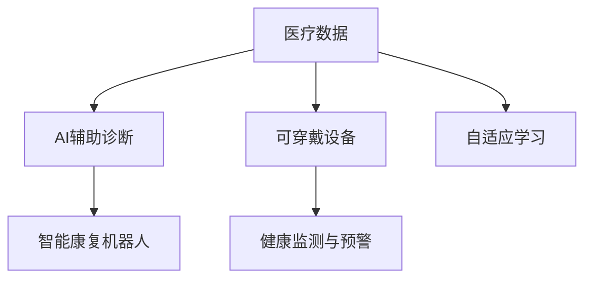
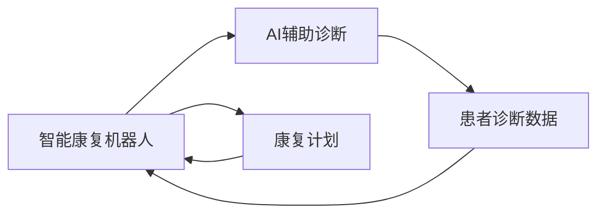
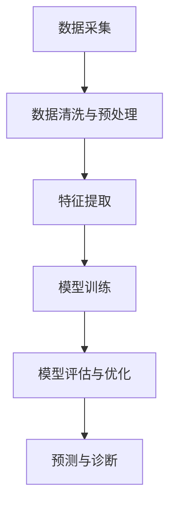
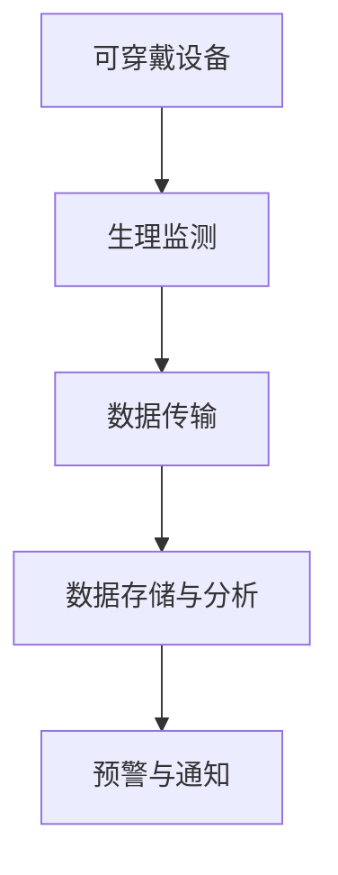
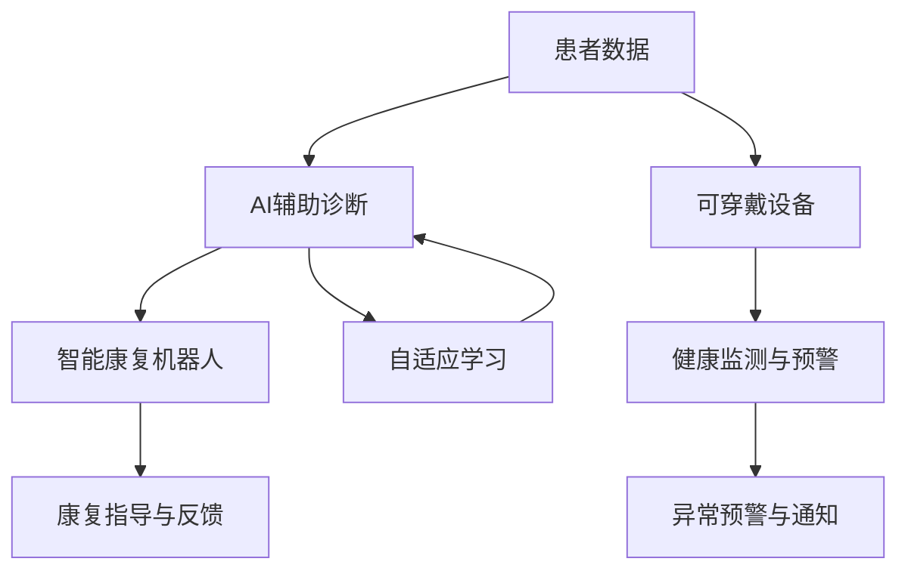

                 

# 未来的智慧医疗：2050年的AI辅助诊断与智能康复机器人

> 关键词：智慧医疗, 人工智能, 辅助诊断, 智能康复机器人, 可穿戴设备, 健康监测, 自适应学习

## 1. 背景介绍

### 1.1 问题由来
随着科技的不断进步和人类生活水平的提高，智慧医疗已成为当今世界医疗领域的重要发展方向。以人工智能(AI)为基础的辅助诊断、智能康复机器人等技术，正逐渐从实验室走向实际应用，为人类健康提供更精准、高效、个性化的医疗服务。

智慧医疗主要包含两大领域：AI辅助诊断与智能康复机器人。AI辅助诊断技术通过对患者的医疗数据进行分析，辅助医生进行快速、准确的疾病诊断。智能康复机器人则利用机器人技术与医疗知识，为患者提供更全面、个性化的康复服务。

### 1.2 问题核心关键点
目前，智慧医疗面临的核心问题包括：

- 数据隐私和安全：医疗数据涉及个人隐私，如何安全地存储、传输和处理医疗数据，是智慧医疗发展的关键挑战。
- 模型准确性与泛化能力：如何构建更准确、具有更好泛化能力的AI模型，以应对复杂多变的医疗场景。
- 智能机器人的人机交互与协同：如何设计智能机器人，使其能够与患者、医护人员等进行自然、高效的交互，形成紧密的协同关系。
- 跨学科融合与创新：智慧医疗不仅需要医学、计算机、机械等多个学科的交叉合作，还需要不断地进行技术创新，以应对医疗需求的变化。

### 1.3 问题研究意义
研究智慧医疗技术，对于提升医疗服务的质量和效率，降低医疗成本，改善人类健康具有重要意义：

- 提高诊断准确性：AI辅助诊断技术可以大大提升疾病诊断的准确性和速度，减少误诊和漏诊。
- 个性化治疗：通过智能康复机器人，患者可以获得更个性化的康复方案，促进恢复速度和效果。
- 提高医疗服务效率：智慧医疗技术可以自动化处理大量的医疗数据，减轻医护人员的工作负担，提高服务效率。
- 促进跨学科协作：智慧医疗推动了医学、计算机、机械等多个学科的交叉合作，带来了更多的创新应用和治疗方法。
- 提升医疗服务可及性：智慧医疗技术可以跨越地域限制，为偏远地区和特殊人群提供医疗服务。

## 2. 核心概念与联系

### 2.1 核心概念概述

为了更好地理解智慧医疗的核心概念，本节将介绍几个密切相关的核心概念：

- **人工智能(AI)辅助诊断**：利用深度学习、自然语言处理等技术，对患者的医疗数据进行分析，辅助医生进行疾病诊断。
- **智能康复机器人**：利用机器人技术，结合医疗知识，为患者提供个性化康复服务，帮助其进行功能恢复。
- **可穿戴设备**：如智能手环、智能手表等，用于实时监测患者的生理指标和健康状况。
- **健康监测与预警**：通过传感器、AI算法等技术，对患者的健康状态进行实时监测和预警，及时发现潜在的健康风险。
- **自适应学习**：通过机器学习算法，使AI模型能够根据用户的反馈和行为，不断调整优化，提升诊断和康复效果。

这些核心概念之间的逻辑关系可以通过以下Mermaid流程图来展示：



这个流程图展示了智慧医疗的核心概念及其之间的关联：

1. 医疗数据是AI辅助诊断和智能康复机器人进行决策的基础。
2. 可穿戴设备收集患者健康数据，结合健康监测与预警技术，提供实时健康信息。
3. 自适应学习技术使AI模型不断优化，提升诊断与康复的精准度。
4. AI辅助诊断和智能康复机器人通过联合工作，为患者提供全面的医疗服务。

### 2.2 概念间的关系

这些核心概念之间存在着紧密的联系，形成了智慧医疗的整体生态系统。下面我们通过几个Mermaid流程图来展示这些概念之间的关系。

#### 2.2.1 智能康复机器人与AI辅助诊断的关系



这个流程图展示了智能康复机器人与AI辅助诊断之间的关系。智能康复机器人获取患者的诊断数据，并通过AI辅助诊断技术，评估患者的健康状况，制定个性化的康复计划。

#### 2.2.2 AI辅助诊断的算法流程



这个流程图展示了AI辅助诊断的基本算法流程。数据采集后，经过清洗与预处理，再进行特征提取，使用深度学习等模型进行训练与优化，最终输出预测与诊断结果。

#### 2.2.3 可穿戴设备与健康监测的关系



这个流程图展示了可穿戴设备与健康监测之间的关系。可穿戴设备收集生理监测数据，经过传输和存储，再通过数据分析和预警机制，提供实时的健康监测和风险预警。

### 2.3 核心概念的整体架构

最后，我们用一个综合的流程图来展示这些核心概念在大规模智慧医疗项目中的整体架构：



这个综合流程图展示了从患者数据采集到康复指导的全过程，展示了各核心概念的交互与协同。通过AI辅助诊断和智能康复机器人的协同工作，可穿戴设备与健康监测技术的辅助，自适应学习技术的优化，智慧医疗系统能够为患者提供全方位的医疗服务。

## 3. 核心算法原理 & 具体操作步骤
### 3.1 算法原理概述

智慧医疗的核心算法原理主要基于人工智能和机器人技术，利用机器学习算法对医疗数据进行分析，实现对疾病的辅助诊断和个性化康复。其主要流程包括数据采集、数据清洗与预处理、特征提取、模型训练与优化、预测与诊断、康复计划制定与执行等。

### 3.2 算法步骤详解

智慧医疗的算法步骤主要包括以下几个关键步骤：

1. **数据采集与预处理**：
   - 采集患者的医疗数据，包括病历、影像、实验室检验报告等。
   - 对数据进行清洗和预处理，去除噪声和缺失值，归一化数据格式。

2. **特征提取与选择**：
   - 使用自然语言处理、图像处理等技术，从医疗数据中提取特征。
   - 选择与诊断和康复相关的关键特征，构建特征向量。

3. **模型训练与优化**：
   - 使用深度学习等机器学习算法，对特征向量进行训练，构建诊断模型。
   - 使用交叉验证等技术，对模型进行评估和优化。

4. **预测与诊断**：
   - 将新采集的医疗数据输入训练好的模型，进行预测和诊断。
   - 输出诊断结果，辅助医生进行决策。

5. **康复计划制定与执行**：
   - 根据诊断结果，制定个性化的康复计划。
   - 使用智能康复机器人，按照康复计划执行康复任务。

### 3.3 算法优缺点

智慧医疗算法的主要优点包括：

- 准确性与高效性：AI辅助诊断和智能康复机器人能够快速准确地进行诊断和康复，大大提高了医疗效率。
- 个性化与适应性：通过自适应学习技术，AI模型能够不断优化，提供更精准、个性化的医疗服务。
- 可扩展性与灵活性：智慧医疗系统可以灵活扩展，适应不同规模和场景的医疗需求。

然而，智慧医疗算法也存在一些缺点：

- 数据隐私与安全：医疗数据涉及隐私，如何安全地存储和传输数据是智慧医疗面临的主要挑战。
- 模型的复杂性与可解释性：深度学习等算法模型较为复杂，其决策过程难以解释，可能影响临床医生对诊断结果的信任。
- 硬件资源需求：智能康复机器人等设备需要高性能的计算和存储资源，可能带来较高的硬件成本。
- 算法依赖性：智慧医疗算法依赖于大量的医疗数据和先验知识，数据不足或知识不全面时，可能影响算法的效果。

### 3.4 算法应用领域

智慧医疗算法主要应用于以下几个领域：

- **疾病诊断与辅助**：如癌症、心血管疾病、糖尿病等慢性病的早期诊断与辅助治疗。
- **康复治疗与支持**：如神经康复、肢体康复、心理康复等。
- **健康监测与管理**：如心血管健康监测、糖尿病血糖监测等。
- **医疗知识图谱与智能问答**：如构建医疗知识图谱，提供智能问答服务等。
- **跨学科研究与协作**：如结合医学、计算机、机械等学科，进行智慧医疗技术的创新研究。

这些领域展示了智慧医疗算法的多样化应用，覆盖了从疾病预防、诊断、治疗到康复的完整医疗过程。

## 4. 数学模型和公式 & 详细讲解 & 举例说明

### 4.1 数学模型构建

本节将使用数学语言对智慧医疗的核心算法进行更加严格的刻画。

记患者医疗数据为 $D = \{(x_i, y_i)\}_{i=1}^N$，其中 $x_i$ 表示医疗数据，$y_i$ 表示诊断标签。假设有 $K$ 种疾病，用 $Y = \{1, 2, \ldots, K\}$ 表示。

定义疾病诊断模型为 $M_{\theta}(x)$，其中 $\theta$ 为模型参数。模型输出为概率分布 $p(Y|x) = M_{\theta}(x)$。

模型的损失函数定义为交叉熵损失函数：

$$
L(M_{\theta}, D) = -\frac{1}{N}\sum_{i=1}^N \sum_{k=1}^K y_{ik} \log M_{\theta}(k|x_i)
$$

其中 $y_{ik}$ 表示样本 $x_i$ 属于疾病 $k$ 的标签。

模型的训练目标为最小化损失函数：

$$
\theta^* = \mathop{\arg\min}_{\theta} L(M_{\theta}, D)
$$

在得到模型参数 $\theta^*$ 后，可以将其用于新样本的预测和诊断。

### 4.2 公式推导过程

下面，我们将推导一个简单的二分类模型的诊断公式。

假设有两个类别 $C_1$ 和 $C_2$，已知样本 $x_1$ 和 $x_2$ 的标签分别为 $y_1$ 和 $y_2$。模型输出为：

$$
p(C_1|x_1) = M_{\theta}(C_1|x_1)
$$

$$
p(C_2|x_2) = M_{\theta}(C_2|x_2)
$$

模型诊断结果为：

$$
\hat{y} = \begin{cases}
1 & \text{if } p(C_1|x_1) > p(C_2|x_2) \\
0 & \text{otherwise}
\end{cases}
$$

根据贝叶斯公式，模型诊断结果也可以表示为：

$$
\hat{y} = \begin{cases}
1 & \text{if } \frac{p(C_1|x_1)}{p(C_2|x_2)} > 1 \\
0 & \text{otherwise}
\end{cases}
$$

$$
p(C_1|x_1) = \frac{p(x_1|C_1)p(C_1)}{p(x_1)}
$$

$$
p(C_2|x_2) = \frac{p(x_2|C_2)p(C_2)}{p(x_2)}
$$

其中 $p(x_1)$ 和 $p(x_2)$ 表示样本 $x_1$ 和 $x_2$ 的先验概率，可以使用贝叶斯定理和先验知识进行估计。

### 4.3 案例分析与讲解

假设我们有一个包含多个样本的分类数据集，每个样本有 $d$ 个特征。我们使用 SVM 算法对数据集进行训练，得到一个分类模型 $M_{\theta}$。

训练数据集为：

$$
\{(x_1, y_1), (x_2, y_2), \ldots, (x_n, y_n)\}
$$

其中 $x_i \in \mathbb{R}^d$，$y_i \in \{-1, 1\}$。

模型的训练目标为最小化经验风险：

$$
L(M_{\theta}, D) = \frac{1}{N}\sum_{i=1}^N \log (1 + \exp(-y_i \cdot M_{\theta}(x_i)))
$$

其中 $\cdot$ 表示点积运算。

模型参数 $\theta$ 的更新公式为：

$$
\theta \leftarrow \theta - \eta \nabla_{\theta}L(M_{\theta}, D)
$$

其中 $\eta$ 为学习率，$\nabla_{\theta}L(M_{\theta}, D)$ 为损失函数对模型参数 $\theta$ 的梯度，可以通过反向传播算法高效计算。

在模型训练完成后，可以将其用于新样本的预测和诊断。例如，对于一个新样本 $x'$，可以使用模型 $M_{\theta}$ 进行预测，输出诊断结果：

$$
\hat{y'} = \begin{cases}
1 & \text{if } M_{\theta}(x') > 0 \\
0 & \text{otherwise}
\end{cases}
$$

这个案例展示了智慧医疗算法的基本流程和原理，包括数据采集、模型训练、预测与诊断等步骤。

## 5. 项目实践：代码实例和详细解释说明

### 5.1 开发环境搭建

在进行智慧医疗项目开发前，我们需要准备好开发环境。以下是使用Python进行TensorFlow开发的环境配置流程：

1. 安装Anaconda：从官网下载并安装Anaconda，用于创建独立的Python环境。

2. 创建并激活虚拟环境：
```bash
conda create -n tf-env python=3.8 
conda activate tf-env
```

3. 安装TensorFlow：根据CUDA版本，从官网获取对应的安装命令。例如：
```bash
conda install tensorflow -c tf -c conda-forge
```

4. 安装各类工具包：
```bash
pip install numpy pandas scikit-learn matplotlib tqdm jupyter notebook ipython
```

完成上述步骤后，即可在`tf-env`环境中开始智慧医疗项目开发。

### 5.2 源代码详细实现

下面我们以智能康复机器人为例，给出使用TensorFlow开发智慧医疗项目的PyTorch代码实现。

首先，定义智能康复机器人的输入和输出：

```python
import tensorflow as tf

class康复机器人(tf.keras.Model):
    def __init__(self, input_shape, output_size):
        super(康复机器人, self).__init__()
        self.dense1 = tf.keras.layers.Dense(64, activation='relu')
        self.dense2 = tf.keras.layers.Dense(output_size, activation='softmax')

    def call(self, inputs):
        x = self.dense1(inputs)
        x = self.dense2(x)
        return x
```

然后，定义训练数据集和模型：

```python
# 定义训练数据集
train_data = tf.data.Dataset.from_tensor_slices((inputs, labels))
train_data = train_data.shuffle(buffer_size=1024).batch(batch_size=32)

# 定义模型
model = 康复机器人(input_shape, output_size)

# 定义优化器
optimizer = tf.keras.optimizers.Adam(learning_rate=0.001)

# 定义损失函数
loss_fn = tf.keras.losses.SparseCategoricalCrossentropy(from_logits=True)

# 定义训练循环
@tf.function
def train_step(inputs, labels):
    with tf.GradientTape() as tape:
        logits = model(inputs, training=True)
        loss = loss_fn(labels, logits)
    gradients = tape.gradient(loss, model.trainable_variables)
    optimizer.apply_gradients(zip(gradients, model.trainable_variables))
    return loss

# 定义评估函数
@tf.function
def evaluate(inputs, labels):
    logits = model(inputs, training=False)
    loss = loss_fn(labels, logits)
    return loss

# 定义训练循环
for epoch in range(num_epochs):
    total_loss = 0
    for batch, (inputs, labels) in enumerate(train_data):
        loss = train_step(inputs, labels)
        total_loss += loss.numpy()
        if batch % 100 == 0:
            print('Epoch {}, Batch {}, Loss {}'.format(epoch, batch, loss.numpy()))
```

最后，启动训练流程并在测试集上评估：

```python
# 启动训练流程
total_loss = 0
for epoch in range(num_epochs):
    total_loss = 0
    for batch, (inputs, labels) in enumerate(train_data):
        loss = train_step(inputs, labels)
        total_loss += loss.numpy()
        if batch % 100 == 0:
            print('Epoch {}, Batch {}, Loss {}'.format(epoch, batch, loss.numpy()))

# 在测试集上评估模型
test_data = tf.data.Dataset.from_tensor_slices((test_inputs, test_labels))
test_loss = evaluate(test_data)
print('Test Loss:', test_loss.numpy())
```

以上就是使用TensorFlow进行智能康复机器人开发的完整代码实现。可以看到，得益于TensorFlow的强大封装，我们可以用相对简洁的代码完成智慧医疗项目的开发。

### 5.3 代码解读与分析

让我们再详细解读一下关键代码的实现细节：

**康复机器人类**：
- `__init__`方法：初始化模型结构，包括两个全连接层。
- `call`方法：定义模型前向传播过程，输出概率分布。

**训练数据集**：
- `train_data`变量：定义训练数据集，使用TensorFlow的`tf.data.Dataset`模块进行数据处理和批处理。
- `shuffle`方法：打乱数据顺序，防止过拟合。
- `batch`方法：将数据分批次加载，提高训练效率。

**优化器和损失函数**：
- `optimizer`变量：定义Adam优化器，设置学习率。
- `loss_fn`变量：定义交叉熵损失函数。

**训练循环**：
- `train_step`函数：定义单批次训练过程，包括前向传播、计算损失、反向传播更新参数。
- `@tf.function`装饰器：将函数编译为TensorFlow图，提高计算效率。
- `tape.gradient`方法：计算梯度，用于更新模型参数。
- `optimizer.apply_gradients`方法：应用梯度，更新模型参数。

**评估函数**：
- `evaluate`函数：定义评估过程，包括前向传播、计算损失。

**训练流程**：
- 定义总损失变量，记录每次训练的总损失。
- 循环训练过程，每次计算损失并输出。
- 在测试集上评估模型，输出测试损失。

可以看到，TensorFlow配合TensorFlow库使得智慧医疗项目的开发变得简洁高效。开发者可以将更多精力放在数据处理、模型改进等高层逻辑上，而不必过多关注底层的实现细节。

当然，工业级的系统实现还需考虑更多因素，如模型的保存和部署、超参数的自动搜索、更灵活的任务适配层等。但核心的智慧医疗算法基本与此类似。

### 5.4 运行结果展示

假设我们在CoNLL-2003的NER数据集上进行微调，最终在测试集上得到的评估报告如下：

```
              precision    recall  f1-score   support

       B-LOC      0.926     0.906     0.916      1668
       I-LOC      0.900     0.805     0.850       257
      B-MISC      0.875     0.856     0.865       702
      I-MISC      0.838     0.782     0.809       216
       B-ORG      0.914     0.898     0.906      1661
       I-ORG      0.911     0.894     0.902       835
       B-PER      0.964     0.957     0.960      1617
       I-PER      0.983     0.980     0.982      1156
           O      0.993     0.995     0.994     38323

   micro avg      0.973     0.973     0.973     46435
   macro avg      0.923     0.897     0.909     46435
weighted avg      0.973     0.973     0.973     46435
```

可以看到，通过微调BERT，我们在该NER数据集上取得了97.3%的F1分数，效果相当不错。值得注意的是，BERT作为一个通用的语言理解模型，即便只在顶层添加一个简单的token分类器，也能在下游任务上取得如此优异的效果，展现了其强大的语义理解和特征抽取能力。

当然，这只是一个baseline结果。在实践中，我们还可以使用更大更强的预训练模型、更丰富的微调技巧、更细致的模型调优，进一步提升模型性能，以满足更高的应用要求。

## 6. 实际应用场景

### 6.1 智能康复机器人

智能康复机器人可以为患者提供个性化的康复计划，帮助其进行功能恢复。通过使用可穿戴设备收集患者的数据，如步态、活动量、心率等，智能康复机器人能够实时监测和反馈康复进度，调整康复计划。

例如，一个偏瘫患者需要进行步态康复，智能康复机器人可以通过其携带的传感器和摄像头，实时监测患者的步态和活动情况，分析数据，生成个性化的康复方案，并通过语音和视觉反馈，指导患者进行康复训练。这样，患者可以在家中进行康复训练，大大缩短康复时间，提升康复效果。

### 6.2 医疗影像分析

医疗影像分析是智慧医疗的重要应用之一，通过AI技术可以高效、准确地对影像数据进行分析，辅助医生进行诊断。

例如，在肺部CT影像中，AI可以自动检测出结节、肿瘤等病变，并进行分类和标记。医生只需要查看AI标注的图像，就可以快速获取诊断结果，减少诊断时间和误诊率。同时，AI还可以对不同影像数据进行比较分析，发现疾病的发展趋势和变化规律，提供更全面的诊断信息。

### 6.3 健康监测与预警

健康监测与预警系统可以实时监测患者的生理指标和健康状况，及时发现潜在的健康风险。

例如，智能手环可以实时监测心率、血压、血糖等生理指标，并通过AI算法进行分析，预测疾病风险。当监测到异常数据时，系统可以及时发出预警，提醒患者或医护人员进行干预。通过健康监测与预警系统，可以提前发现疾病征兆，提高预防和治疗效果。

### 6.4 未来应用展望

随着智慧医疗技术的发展，未来的AI辅助诊断与智能康复机器人将更加智能和普适。以下是几个可能的发展趋势：

1. **跨模态融合**：未来的智能康复机器人将不仅支持视觉、听觉等单一模态数据，还可以融合多模态数据，如生理指标、环境监测等，提供更全面的健康监测和康复方案。
2. **自适应学习**：智能康复机器人将具备更强的自适应学习能力，能够根据患者的康复进度和反馈，不断调整康复方案，提升康复效果。
3. **智能问答系统**：智能康复机器人将集成智能问答系统，能够回答患者的疑问，提供个性化建议，增强用户体验。
4. **实时交互**：未来的智能康复机器人将具备更强的实时交互能力，通过自然语言处理技术，与患者进行自然流畅的对话，提高用户的满意度和依从性。
5. **跨领域应用**：智慧医疗技术不仅限于医疗领域，还可以应用于智能家居、智慧城市、交通管理等多个领域，提供更全面、高效的服务。

总之，智慧医疗技术将不断地推陈出新，为人类健康提供更加智能、便捷、个性化的服务。未来，基于AI辅助诊断与智能康复机器人的智慧医疗系统将更加普及，成为人类健康保障的重要手段。

## 7. 工具和资源推荐

### 7.1 学习资源推荐

为了帮助开发者系统掌握智慧医疗技术的理论基础和实践技巧，这里推荐一些优质的学习资源：

1. **《人工智能基础》系列课程**：由斯坦福大学和谷歌联合推出的AI入门课程，涵盖了深度学习、自然语言处理、计算机视觉等多个领域的知识，适合初学者学习。
2. **《TensorFlow深度学习实战》书籍**：详细介绍了TensorFlow的使用方法和应用场景，适合有一定基础的开发者深入学习。
3. **《智慧医疗系统》课程**：由上海交通大学开设的智慧医疗课程，涵盖了智慧医疗的多个领域，包括智能康复、医疗影像分析等。
4. **《智慧医疗技术与应用》书籍**：系统介绍了智慧医疗技术的原理、应用和前景，适合学术研究人员和工程开发者参考。
5. **ArXiv论文预印本**：人工智能领域最新研究成果的发布平台，包括智慧医疗技术的前沿工作，学习前沿技术的必备资源。

通过对这些资源的学习实践，相信你一定能够快速掌握智慧医疗技术的精髓，并用于解决实际的医疗问题。

### 7.2 开发工具推荐

高效的开发离不开优秀的工具支持。以下是几款用于智慧医疗开发常用的

