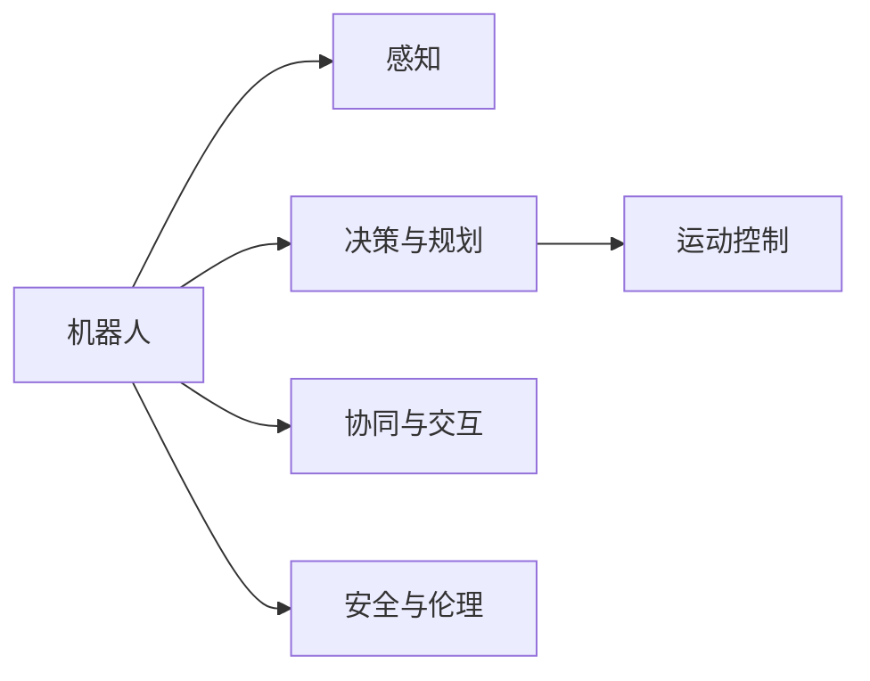

                 

## 1. 背景介绍

### 1.1 问题由来
机器人学（Robotics）是计算机科学、机械工程、电子工程、控制理论、人工智能等学科交叉融合而成的综合性学科。它研究如何设计、构建和操作机器人以完成各种任务。近年来，随着计算能力、传感器技术、自动化技术的飞速发展，机器人学取得了显著进展，尤其是在制造业、医疗、服务等领域广泛应用。

### 1.2 问题核心关键点
机器人学的核心关键点包括：

1. 机器人感知与环境理解：利用传感器获取外界环境信息，并转化为机器人的内部表示。
2. 机器人决策与规划：通过算法和模型，分析当前状态与目标状态之间的差异，选择最优行动路径。
3. 机器人运动控制：通过控制理论，实现机器人关节和执行器的精确控制。
4. 机器人协同与交互：研究多机器人系统之间的协作和人类与机器人之间的交互。

### 1.3 问题研究意义
研究机器人学的意义重大：

1. 提升生产效率：通过自动化替代人工，减少劳动强度，提高生产效率。
2. 保障人类安全：在危险和恶劣环境下执行任务，保障人类生命安全。
3. 促进技术创新：机器人技术的发展促进了新材料、新工艺、新方法的应用。
4. 推动跨学科发展：机器人学是多学科交叉，推动计算机科学、机械工程等领域的深度融合。

## 2. 核心概念与联系

### 2.1 核心概念概述
为更好地理解机器人学的基本原理和应用，本节将介绍几个核心概念：

- 机器人（Robot）：执行指定任务的机械装置，由控制器和执行器组成。
- 感知（Perception）：通过传感器获取环境信息的过程，包括视觉、听觉、触觉等。
- 决策与规划（Decision-Making & Planning）：机器人根据当前状态和目标，选择行动路径的过程。
- 运动控制（Motion Control）：通过控制算法实现机器人关节和执行器的精确运动。
- 协同与交互（Collaboration & Interaction）：多机器人之间的协调合作，以及机器人与人之间的自然交互。
- 安全与伦理（Safety & Ethics）：机器人系统设计需确保安全性和道德性，避免对人类造成伤害。

### 2.2 概念间的关系

这些核心概念之间的逻辑关系可以通过以下Mermaid流程图来展示：



这个流程图展示了机器人学的核心概念及其之间的关系：

1. 机器人通过感知获取环境信息。
2. 决策与规划根据感知结果制定行动路径。
3. 运动控制实现机器人的精确运动。
4. 协同与交互实现多机器人之间的协作和机器人与人的自然交互。
5. 安全与伦理确保机器人系统的安全性和道德性。

这些概念共同构成了机器人学的整体框架，推动了机器人技术的全面发展。

## 3. 核心算法原理 & 具体操作步骤
### 3.1 算法原理概述
机器人学中常用的算法原理包括感知算法、运动规划算法和运动控制算法等。

- **感知算法**：通过传感器获取环境信息，并进行数据处理和特征提取，实现对环境的理解。常见的感知算法包括视觉感知、听觉感知、触觉感知等。
- **运动规划算法**：在已知起点和终点的情况下，规划一条最优的路径。常见的运动规划算法包括A*算法、D*算法等。
- **运动控制算法**：实现对机器人关节和执行器的精确控制。常见的运动控制算法包括PID控制、模型预测控制等。

### 3.2 算法步骤详解
以视觉感知和运动规划为例，详细介绍算法步骤。

**视觉感知步骤**：

1. 获取图像：使用相机获取环境图像。
2. 图像预处理：进行去噪、灰度化、二值化等预处理操作。
3. 特征提取：利用边缘检测、角点检测等算法提取特征点。
4. 目标识别：使用机器学习模型识别目标物体。
5. 物体跟踪：利用目标跟踪算法，对物体进行实时追踪。

**运动规划步骤**：

1. 定义起点和终点：确定机器人起始位置和目标位置。
2. 环境建模：构建机器人操作空间的地图。
3. 路径规划：使用A*等算法计算最优路径。
4. 路径执行：根据路径指令，控制机器人关节和执行器执行运动。

### 3.3 算法优缺点
机器人学中的算法优点包括：

1. 实时性强：算法能在实时数据的基础上进行快速决策和控制。
2. 鲁棒性好：算法对环境的复杂性和不确定性具有一定的适应能力。
3. 可扩展性高：算法可以方便地扩展到多传感器、多机器人系统。

缺点包括：

1. 计算复杂度高：某些算法在处理大规模数据时计算量较大。
2. 数据要求高：算法需要大量高质量的传感器数据，数据采集成本高。
3. 环境适应性差：算法对于复杂和动态环境适应能力有限。

### 3.4 算法应用领域
机器人学中的算法广泛应用于多个领域，包括：

- **工业自动化**：通过机器人执行搬运、焊接、装配等任务，提高生产效率和质量。
- **医疗服务**：利用机器人进行手术、护理、康复等医疗服务，保障患者安全。
- **家庭服务**：开发家用机器人，帮助完成家务、陪伴老人等家庭服务。
- **军事应用**：研发军用机器人，执行侦察、排雷、搬运等任务。
- **空间探索**：利用机器人进行太空探测、行星着陆等任务。

## 4. 数学模型和公式 & 详细讲解  
### 4.1 数学模型构建
机器人学中的数学模型包括运动学模型、动力学模型和控制模型等。

**运动学模型**：描述机器人关节角度和位置的关系。常见的运动学模型包括齐次变换矩阵、D-H参数等。

**动力学模型**：描述机器人在力矩和加速度的作用下，关节角度和位置的变化。常见的动力学模型包括牛顿-欧拉方程、拉格朗日方程等。

**控制模型**：描述机器人控制器和执行器之间的关系。常见的控制模型包括PID控制、模型预测控制等。

### 4.2 公式推导过程
以PID控制为例，推导其具体公式：

$$
\dot{x} = f(x, u)
$$

$$
u = k_p e + k_i \int e dt + k_d \dot{e} dt
$$

其中，$x$ 为机器人状态变量，$u$ 为控制器输出，$e$ 为误差信号，$k_p$、$k_i$、$k_d$ 为PID控制器参数。

### 4.3 案例分析与讲解
假设有一个工业机器人在执行搬运任务，使用PID控制算法。

**步骤1：定义状态变量**：

$$
x = [x_1, x_2, x_3, \dot{x}_1, \dot{x}_2, \dot{x}_3]^T
$$

其中，$x_1$、$x_2$、$x_3$ 为机器人关节角度，$\dot{x}_1$、$\dot{x}_2$、$\dot{x}_3$ 为关节角速度。

**步骤2：定义误差信号**：

$$
e = x_d - x
$$

其中，$x_d$ 为期望的关节角度。

**步骤3：定义控制器输出**：

$$
u = k_p e + k_i \int e dt + k_d \dot{e} dt
$$

**步骤4：定义状态更新方程**：

$$
\dot{x} = f(x, u)
$$

**步骤5：定义运动学模型**：

假设机器人的运动学模型为：

$$
\left[ \begin{matrix} x_1 \\ x_2 \\ x_3 \\ \dot{x}_1 \\ \dot{x}_2 \\ \dot{x}_3 \end{matrix} \right] = \left[ \begin{matrix} \cos x_1 & -\sin x_1 & 0 & 0 & 0 & 0 \\ \sin x_1 & \cos x_1 & 0 & 0 & 0 & 0 \\ 0 & 0 & 1 & 0 & 0 & 0 \\ 0 & 0 & 0 & 1 & 0 & 0 \\ 0 & 0 & 0 & 0 & 1 & 0 \\ 0 & 0 & 0 & 0 & 0 & 1 \end{matrix} \right] \left[ \begin{matrix} \dot{x}_1 \\ \dot{x}_2 \\ \dot{x}_3 \end{matrix} \right] + \left[ \begin{matrix} 0 \\ 0 \\ 0 \end{matrix} \right]
$$

## 5. 项目实践：代码实例和详细解释说明
### 5.1 开发环境搭建
在进行机器人学项目实践前，需要准备开发环境。以下是使用Python进行ROS（Robot Operating System）开发的环境配置流程：

1. 安装ROS：从官网下载并安装ROS，用于管理机器人学项目。
2. 配置ROS：配置ROS所需的环境变量，并进行系统启动。
3. 安装ROS-Python：安装ROS的Python API，用于编写机器人学应用程序。

完成上述步骤后，即可在ROS环境下进行机器人学项目的开发。

### 5.2 源代码详细实现
这里以ROS中的KinematicPlanningNode为例，详细介绍机器人学项目的代码实现。

```python
import rospy
from tf.transformations import euler_from_quaternion
from tf.transformations import quaternion_from_euler
from tf.transformations import Quaternion

class KinematicPlanningNode:
    def __init__(self):
        self.node = rospy.init_node('kinematic_planning_node', anonymous=True)
        rospy.Subscriber('/cmd_vel', Twist, self.get_cmd_vel)
        rospy.Subscriber('/odom', Odometry, self.update_odom)
        rospy.Subscriber('/cmd',geometry_msgs.PoseStamped, self.update_cmd)
        self.pose出版子 = rospy.Publisher('/pose',geometry_msgs.PoseStamped, queue_size=1)
        rospy.spin()

    def get_cmd_vel(self, msg):
        self.linear = msg.linear
        self.angular = msg.angular

    def update_odom(self, msg):
        self.odom = msg.pose.pose
        self.quat = self.odom.pose.orientation

    def update_cmd(self, msg):
        self.cmd = msg.pose.pose

    def update_pose(self):
        # 计算角度
        ang = euler_from_quaternion([self.quat.x, self.quat.y, self.quat.z, self.quat.w])
        # 计算速度
        vel = sqrt(self.linear.x ** 2 + self.linear.y ** 2 + self.linear.z ** 2)
        # 计算加速度
        acc = (self.odom.twist.twist.linear.x - self.linear.x) / time_from_msg(self.linear.header)
        # 计算角速度
        omega = sqrt(self.angular.x ** 2 + self.angular.y ** 2 + self.angular.z ** 2)
        # 计算角加速度
        alpha = (self.odom.twist.twist.angular.x - self.angular.x) / time_from_msg(self.angular.header)
        # 计算姿态
        quat = quaternion_from_euler(ang[0], ang[1], ang[2])
        pose = PoseStamped()
        pose.header = self.odom.header
        pose.pose.pose.orientation = Quaternion(*quat)
        pose.pose.pose.position = Point(0, 0, 0)
        self.pose出版子.publish(pose)
```

在这个代码中，我们使用ROS中的KinematicPlanningNode类来模拟机器人的运动。该类包含三个主要的ROS订阅器，分别用于获取命令速度、更新机器人的位姿，以及更新命令位姿。通过计算机器人的角度、速度、加速度等状态变量，最终输出机器人的姿态信息。

### 5.3 代码解读与分析
这个代码的核心部分是计算机器人的姿态信息。我们使用`euler_from_quaternion`函数将四元数转换为欧拉角，使用`sqrt`函数计算速度和角速度，使用`Quaternion`类将欧拉角转换为四元数，并最终输出机器人的姿态信息。

### 5.4 运行结果展示
假设我们运行这个KinematicPlanningNode程序，并设定命令速度和位姿信息，可以观察到机器人的姿态信息在ROS中实时更新。

```bash
roslaunch robot_learning.launch
```

## 6. 实际应用场景
### 6.1 工业自动化
工业自动化是机器人学的一个重要应用领域。机器人被广泛应用于制造业、物流等自动化生产线中。以下是几个实际应用场景：

1. **装配线自动化**：在汽车制造、电子产品生产等装配线中，机器人被用于搬运零部件、组装零件、焊接等任务，显著提高生产效率和质量。
2. **物流自动化**：在仓库、港口等物流场所，机器人被用于搬运货物、分拣物品、包装等任务，提高物流效率和准确性。
3. **焊接自动化**：在机械制造、船舶制造等焊接任务中，机器人被用于自动化焊接，保障焊接质量和安全。

### 6.2 医疗服务
医疗服务是机器人学的另一个重要应用领域。机器人被广泛应用于医疗诊断、手术、康复等场景中。以下是几个实际应用场景：

1. **手术机器人**：在医疗手术中，机器人被用于精确操作，如微创手术、眼底手术等，提高手术成功率和患者安全性。
2. **护理机器人**：在老年人护理、康复训练等场景中，机器人被用于辅助护理、康复训练，减轻医护人员负担，提升护理质量。
3. **智能诊断**：在医学影像、病理诊断等场景中，机器人被用于辅助医生进行诊断，提高诊断准确性和效率。

### 6.3 家庭服务
家庭服务是机器人学的新兴应用领域。机器人被广泛应用于家务服务、陪伴老人等场景中。以下是几个实际应用场景：

1. **家务机器人**：在家务劳动中，机器人被用于打扫卫生、洗衣、做饭等任务，减轻家庭负担。
2. **陪伴机器人**：在老年人陪伴、儿童教育等场景中，机器人被用于陪伴、互动，提升生活质量。

### 6.4 未来应用展望
机器人学的未来应用展望广阔，将广泛应用于更多领域：

1. **农业自动化**：在农业生产中，机器人被用于播种、施肥、收割等任务，提高农业生产效率和质量。
2. **教育服务**：在教育领域，机器人被用于辅助教学、在线答疑、学习辅导等任务，提高教学效果和学生体验。
3. **交通管理**：在交通管理中，机器人被用于交通监控、车辆调度、行人引导等任务，提高交通管理水平和安全性。

## 7. 工具和资源推荐
### 7.1 学习资源推荐
为了帮助开发者系统掌握机器人学的理论基础和实践技巧，这里推荐一些优质的学习资源：

1. 《机器人学：原理与算法》：这是一本系统介绍机器人学原理和算法的经典教材，涵盖了机器人感知、决策与规划、运动控制等多个方面的内容。
2. ROS官方文档：ROS（Robot Operating System）的官方文档，提供了详细的使用指南和示例代码，是学习机器人学的重要资源。
3. ROS-BYOD：一个ROS教程平台，提供大量ROS教程和示例代码，适合初学者入门。
4. ROS-Gazebo模拟环境：ROS-Gazebo是一个ROS与Gazebo的集成环境，用于模拟机器人操作，提供了丰富的传感器和模型库。
5. ROS-DeepLearning：ROS与深度学习结合的教程，介绍了深度学习在机器人学中的应用。

通过对这些资源的学习实践，相信你一定能够快速掌握机器人学的精髓，并用于解决实际的机器人学问题。

### 7.2 开发工具推荐
高效的开发离不开优秀的工具支持。以下是几款用于机器人学开发的常用工具：

1. ROS（Robot Operating System）：一个开源的机器人操作系统，支持多机器人协同、传感器数据处理、运动控制等功能。
2. Gazebo：一个开源的机器人仿真环境，支持多物理引擎，用于机器人学模拟和测试。
3. Panda3D：一个开源的3D图形引擎，支持多物理引擎，用于机器人学仿真和可视化。
4. RViz：一个ROS可视化工具，用于机器人学数据和传感器数据的可视化。
5. ROS-DeepLearning：ROS与深度学习结合的开发平台，支持深度学习在机器人学中的应用。

合理利用这些工具，可以显著提升机器人学项目的开发效率，加快创新迭代的步伐。

### 7.3 相关论文推荐
机器人学的发展离不开学界的持续研究。以下是几篇奠基性的相关论文，推荐阅读：

1. "The Robotics Manifesto"（机器人宣言）：由Bruno Siciliano等人撰写，提出了机器人学的定义和未来发展方向。
2. "Robot Manipulation: A Survey of the State of the Art"（机器人操作：现状综述）：由Steven M. LaValle等人撰写，介绍了机器人操作领域的最新进展。
3. "Robot Vision: A Survey"（机器人视觉：综述）：由P. Corke等人撰写，介绍了机器人视觉领域的最新进展。
4. "Kinodynamic Planning"（动力规划）：由J. C. Latif等人撰写，介绍了机器人动力学规划的最新进展。
5. "Human-Robot Collaboration"（人机协作）：由M. Omran等人撰写，介绍了人机协作领域的最新进展。

这些论文代表了大机器人学研究的发展脉络。通过学习这些前沿成果，可以帮助研究者把握学科前进方向，激发更多的创新灵感。

## 8. 总结：未来发展趋势与挑战
### 8.1 总结

本文对机器人学的基础原理和应用进行了全面系统的介绍。首先阐述了机器人学的研究背景和意义，明确了机器人学在自动化、医疗、家庭服务等多个领域的应用价值。其次，从原理到实践，详细讲解了机器人学中的感知、决策与规划、运动控制等核心算法，并通过代码实例展示了机器人学的实际应用。最后，本文还广泛探讨了机器人学的发展趋势和面临的挑战，为机器人学研究提供了有益的指导。

通过本文的系统梳理，可以看到，机器人学在现代工业、医疗、家庭服务等领域展现出巨大的潜力和应用前景。得益于技术的不断进步，机器人学已经从简单的自动化操作，发展到复杂的协作与交互，未来必将为人类社会带来更多的变革和进步。

### 8.2 未来发展趋势

机器人学的未来发展趋势包括：

1. **智能化**：机器人将具备更强的自主决策能力，能够实现更复杂的任务。
2. **人机协作**：机器人将与人类更加紧密地协作，实现更高效的共同工作。
3. **多模态交互**：机器人将具备视觉、听觉、触觉等多模态交互能力，提升用户体验。
4. **自主学习**：机器人将具备自主学习和适应能力，能够在复杂环境下进行自我调整。
5. **多功能融合**：机器人将具备多种功能融合能力，实现从单一任务到多功能的应用。
6. **跨领域融合**：机器人学将与物联网、区块链、人工智能等领域深度融合，推动新一轮技术创新。

### 8.3 面临的挑战

尽管机器人学取得了显著进展，但在迈向更加智能化、普适化应用的过程中，它仍面临诸多挑战：

1. **成本高昂**：机器人系统的构建和维护成本较高，难以大规模普及。
2. **安全性和可靠性**：机器人系统需要在复杂环境下稳定运行，确保安全性和可靠性。
3. **环境适应性差**：机器人在不同环境中的适应能力有限，难以应对复杂的现实场景。
4. **数据需求高**：机器人的训练需要大量高质量的数据，数据采集和标注成本高。
5. **计算资源需求大**：机器人系统需要高性能计算资源，对计算资源需求大。
6. **伦理和法律问题**：机器人系统的应用可能涉及伦理和法律问题，需要制定相关规范和标准。

### 8.4 研究展望

机器人学的未来研究展望包括：

1. **感知与认知融合**：将感知和认知融合，提升机器人的理解能力。
2. **多模态交互融合**：将视觉、听觉、触觉等多种传感器融合，提升机器人的交互能力。
3. **自主学习与进化**：实现机器人的自主学习和进化，提升其在复杂环境中的适应能力。
4. **多功能融合**：实现机器人的多功能融合，提升其应用价值和用户体验。
5. **跨领域融合**：将机器人学与其他领域深度融合，推动新一轮技术创新。

总之，机器人学是一门综合性学科，涉及多学科的知识和技能。随着技术的不断进步，机器人学将越来越普及和深入应用，为人类社会带来更多的变革和进步。未来，机器人学将与人工智能、物联网等技术深度融合，推动人类社会的智能化和数字化转型。

