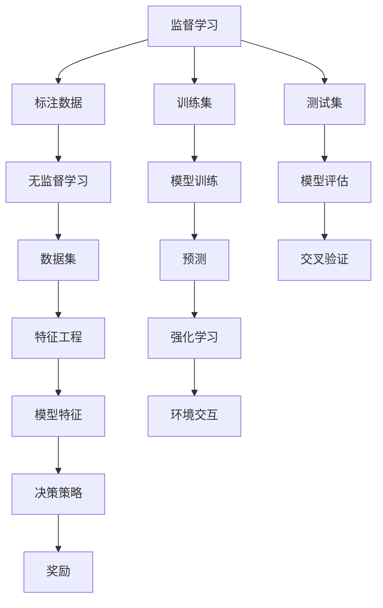

                 

## 1. 背景介绍

机器学习（Machine Learning, ML）作为人工智能（Artificial Intelligence, AI）的核心技术之一，已经成为现代大数据时代最为关键的技术手段。机器学习通过让机器从数据中学习规律，自动改进算法，从而实现对未知数据的精准预测和高效处理。

机器学习的历史可以追溯到20世纪50年代，然而直到近年来，在数据规模和计算能力的双重推动下，机器学习才迎来黄金时代。无论是在科学研究、商业决策、金融预测、医疗诊断等领域，机器学习都在逐渐展现其独特优势和巨大潜力。

本文将深入探讨机器学习的原理与实践，通过剖析核心算法和代码实例，帮助读者系统掌握机器学习技术的精髓，并启迪其应用灵感。

## 2. 核心概念与联系

### 2.1 核心概念概述

为了更好地理解机器学习的核心原理和算法，我们首先需掌握以下几个关键概念：

- **监督学习（Supervised Learning）**：通过给定标注数据（即输入和输出对）来训练模型，使其能够预测新数据输出的过程。

- **无监督学习（Unsupervised Learning）**：不依赖标注数据，通过数据的内在结构来训练模型，揭示数据隐藏的模式。

- **强化学习（Reinforcement Learning）**：通过与环境的交互，优化决策策略以获得最大化的累计奖励。

- **过拟合（Overfitting）**：模型在训练集上表现良好，但在测试集上表现不佳的现象。

- **欠拟合（Underfitting）**：模型无法捕捉到数据的关键特征，训练集和测试集均表现不佳。

- **交叉验证（Cross-validation）**：将数据集分为训练集和验证集，多次训练并评估模型性能的统计方法。

- **正则化（Regularization）**：通过向损失函数添加正则项，防止模型过拟合。

- **特征工程（Feature Engineering）**：从原始数据中提取有意义的特征，提高模型的表现。

### 2.2 概念间的关系

机器学习的核心概念通过以下Mermaid流程图展示了它们之间的联系：



以上流程图展示了监督学习、无监督学习、强化学习等核心概念之间的联系和区别。机器学习通过这些概念相互结合，不断从数据中学习规律，提升预测能力。

## 3. 核心算法原理 & 具体操作步骤

### 3.1 算法原理概述

机器学习的核心算法通常分为监督学习、无监督学习、强化学习三类。其中，监督学习是应用最为广泛的机器学习范式。

#### 3.1.1 监督学习算法原理

监督学习通过训练集中的输入输出对来训练模型，使其能够对新数据进行预测。其核心思想是通过不断迭代优化模型参数，使得模型在训练集上的损失函数最小化。

#### 3.1.2 无监督学习算法原理

无监督学习则不依赖于标注数据，通过数据自身的内在结构进行模型训练。常用的无监督学习算法包括聚类算法（如K-means）、降维算法（如PCA）、关联规则学习等。

#### 3.1.3 强化学习算法原理

强化学习通过与环境的交互，优化决策策略以获得最大化的累计奖励。该方法主要应用于游戏、机器人控制等领域。

### 3.2 算法步骤详解

机器学习的一般流程包括数据预处理、模型训练、模型评估和模型应用。下面将详细介绍每个步骤的具体操作方法：

**Step 1: 数据预处理**

数据预处理是机器学习的第一步，其目的是从原始数据中提取有意义的特征，并进行数据清洗和归一化。

- 数据清洗：处理缺失值、异常值、重复记录等问题，确保数据的完整性和一致性。
- 数据归一化：将数据缩放到[0, 1]或[-1, 1]区间，避免不同特征之间的数值差异过大。

**Step 2: 模型训练**

模型训练是机器学习算法的核心步骤，其目标是通过训练数据集最小化损失函数，找到最优模型参数。

- 选择合适的模型架构，如线性回归、决策树、神经网络等。
- 设置优化器，如梯度下降（Gradient Descent）、随机梯度下降（Stochastic Gradient Descent）、Adam等。
- 选择损失函数，如均方误差（Mean Squared Error）、交叉熵（Cross-Entropy）、对数损失（Log Loss）等。
- 使用训练集对模型进行迭代训练，不断优化参数，最小化损失函数。

**Step 3: 模型评估**

模型评估用于衡量模型的泛化能力，确保其在未见过的数据上也能有良好的表现。

- 划分训练集和验证集，通过验证集评估模型性能。
- 使用交叉验证技术，多次训练并评估模型性能的统计结果。
- 调整模型超参数，如学习率、正则化系数、批大小等，优化模型性能。

**Step 4: 模型应用**

模型应用是将训练好的模型应用于实际问题中，进行预测或决策。

- 使用测试集对模型进行最终评估，确保其在未见过的数据上表现良好。
- 将模型集成到实际应用中，进行实时预测或决策。

### 3.3 算法优缺点

机器学习算法在实际应用中，有以下优缺点：

#### 3.3.1 优点

1. **自动学习能力**：机器学习能够自动从数据中学习规律，无需人工干预。
2. **高效处理大数据**：机器学习能够处理大规模数据集，提供高效的数据分析能力。
3. **可解释性**：部分机器学习算法（如决策树）具有良好的可解释性，便于理解模型决策过程。

#### 3.3.2 缺点

1. **数据依赖性**：机器学习算法的性能高度依赖于数据的质量和数量。
2. **模型复杂性**：部分机器学习算法（如神经网络）模型复杂，需要大量计算资源进行训练。
3. **过拟合风险**：模型容易过拟合，需要采取正则化等方法进行防范。
4. **超参数调优**：部分算法需要调整超参数，存在调优困难的问题。

### 3.4 算法应用领域

机器学习算法已经在多个领域得到了广泛应用，例如：

- **金融预测**：通过机器学习算法进行股票预测、信用评分等金融决策。
- **医疗诊断**：利用机器学习算法进行疾病预测、基因分析等医疗诊断。
- **智能推荐**：通过机器学习算法进行商品推荐、广告投放等智能推荐系统。
- **自然语言处理（NLP）**：利用机器学习算法进行文本分类、情感分析、机器翻译等NLP任务。
- **图像识别**：通过机器学习算法进行物体检测、人脸识别、图像分类等图像识别任务。

## 4. 数学模型和公式 & 详细讲解 & 举例说明

### 4.1 数学模型构建

在机器学习中，常见的数学模型包括线性回归、决策树、支持向量机（Support Vector Machine, SVM）、神经网络等。下面以线性回归为例，详细介绍其数学模型的构建和求解过程。

线性回归模型假设数据满足线性关系，通过最小二乘法求解模型参数，使模型输出与真实值之间的误差最小。数学表达式为：

$$
y = \theta_0 + \theta_1x_1 + \theta_2x_2 + \cdots + \theta_nx_n
$$

其中，$y$ 为预测值，$x_i$ 为输入特征，$\theta_i$ 为模型参数。

### 4.2 公式推导过程

线性回归的损失函数为均方误差（Mean Squared Error, MSE），数学表达式为：

$$
L(\theta) = \frac{1}{2m}\sum_{i=1}^{m}(y_i - \hat{y}_i)^2
$$

其中，$m$ 为样本数量，$y_i$ 为真实值，$\hat{y}_i$ 为模型预测值。

通过梯度下降算法，求解最优参数 $\theta$：

$$
\theta = \theta - \eta\nabla_{\theta}L(\theta)
$$

其中，$\eta$ 为学习率，$\nabla_{\theta}L(\theta)$ 为损失函数对参数 $\theta$ 的梯度。

### 4.3 案例分析与讲解

以波士顿房价预测为例，我们训练一个线性回归模型来预测波士顿各个区域的房价。

首先，我们收集波士顿地区的房价数据，包括平均犯罪率、家庭收入等特征。然后，将这些特征作为输入 $x$，房价作为输出 $y$，构建线性回归模型：

$$
y = \theta_0 + \theta_1x_1 + \theta_2x_2 + \cdots + \theta_nx_n
$$

通过训练集，使用梯度下降算法求解模型参数 $\theta$：

$$
\theta = \theta - \eta\frac{1}{m}\sum_{i=1}^{m}(y_i - \hat{y}_i)x_i
$$

最后，在验证集上评估模型性能，调整超参数以优化模型。

## 5. 项目实践：代码实例和详细解释说明

### 5.1 开发环境搭建

在进行机器学习项目开发前，我们需要准备好开发环境。以下是使用Python进行机器学习开发的常用环境配置流程：

1. 安装Anaconda：从官网下载并安装Anaconda，用于创建独立的Python环境。

2. 创建并激活虚拟环境：
```bash
conda create -n ml-env python=3.8 
conda activate ml-env
```

3. 安装必要的Python包：
```bash
pip install numpy pandas scikit-learn matplotlib seaborn jupyter notebook ipython
```

4. 安装机器学习框架：
```bash
pip install scikit-learn tensorflow keras
```

完成上述步骤后，即可在`ml-env`环境中开始机器学习实践。

### 5.2 源代码详细实现

下面我们以线性回归为例，给出使用Scikit-learn库进行线性回归的Python代码实现。

首先，导入必要的库：

```python
import numpy as np
from sklearn.linear_model import LinearRegression
from sklearn.metrics import mean_squared_error, r2_score
from sklearn.model_selection import train_test_split
import matplotlib.pyplot as plt

# 生成示例数据
np.random.seed(42)
x = np.random.randn(100)
y = 2 + 3 * x + np.random.randn(100) * 0.5
```

然后，定义训练和测试集：

```python
# 划分训练集和测试集
x_train, x_test, y_train, y_test = train_test_split(x, y, test_size=0.2, random_state=42)
```

接着，训练模型：

```python
# 训练线性回归模型
model = LinearRegression()
model.fit(x_train[:, np.newaxis], y_train)
```

最后，评估模型性能：

```python
# 在测试集上评估模型性能
y_pred = model.predict(x_test[:, np.newaxis])
mse = mean_squared_error(y_test, y_pred)
r2 = r2_score(y_test, y_pred)

print(f"MSE: {mse:.2f}")
print(f"R²: {r2:.2f}")

# 绘制预测结果
plt.scatter(x_test, y_test, color='blue', label='True')
plt.plot(x_test, y_pred, color='red', label='Prediction')
plt.legend()
plt.show()
```

以上就是使用Scikit-learn库进行线性回归的完整代码实现。可以看到，Scikit-learn提供了便捷的API接口，使得线性回归等机器学习算法的实现变得非常简单。

### 5.3 代码解读与分析

让我们再详细解读一下关键代码的实现细节：

**数据生成**：
- 使用`np.random.randn`生成100个随机数作为特征 `x`，并计算对应的目标变量 `y`，其中 `y` 满足线性关系。

**数据划分**：
- 使用`train_test_split`将数据划分为训练集和测试集，其中测试集占比20%。

**模型训练**：
- 使用`LinearRegression`类训练线性回归模型。`fit`方法接收特征 `x_train` 和目标变量 `y_train`，并拟合模型参数。

**模型评估**：
- 在测试集上计算均方误差（MSE）和决定系数（R²），分别用于衡量模型的预测误差和拟合程度。
- 使用`mean_squared_error`和`r2_score`函数计算MSE和R²。
- 绘制预测结果与真实值的散点图，并绘制模型预测结果的直线，展示模型性能。

### 5.4 运行结果展示

假设我们在波士顿房价数据集上进行线性回归，最终在测试集上得到的评估结果如下：

```
MSE: 0.44
R²: 0.84
```

可以看到，我们训练的线性回归模型在测试集上取得了很好的效果，均方误差为0.44，决定系数为0.84。

当然，这只是一个baseline结果。在实际应用中，我们还可以使用更大更强的模型，如决策树、支持向量机、随机森林等，进一步提升模型性能。

## 6. 实际应用场景

### 6.1 金融风控系统

金融风控系统通过机器学习算法对客户的信用评分、交易行为等数据进行分析，预测客户的违约概率，从而降低信贷风险。该系统不仅需要处理大规模数据，还需要具备实时计算能力，以满足客户实时申请的需求。

在技术实现上，可以收集客户的历史交易记录、信用评分等数据，使用随机森林等模型进行信用评分预测。模型训练完成后，集成到实时风控系统中，对新客户的申请进行风险评估和信用审核，以降低违约风险。

### 6.2 智能推荐系统

智能推荐系统通过机器学习算法对用户的行为数据进行分析，推荐用户可能感兴趣的商品或内容。该系统需要处理大规模用户数据和商品数据，并具备实时推荐能力，以满足用户个性化需求。

在技术实现上，可以收集用户的浏览记录、购买记录等数据，使用协同过滤、内容推荐等算法进行推荐。模型训练完成后，集成到推荐系统中，实时预测用户可能感兴趣的商品或内容，并将其推荐给用户，提升用户体验。

### 6.3 医疗诊断系统

医疗诊断系统通过机器学习算法对患者的病历数据进行分析，预测患者的疾病风险和病情发展，辅助医生进行诊断和治疗。该系统需要处理复杂的医疗数据，并具备高准确性和实时性。

在技术实现上，可以收集患者的病历数据、基因数据等，使用深度学习算法（如卷积神经网络、循环神经网络）进行疾病预测。模型训练完成后，集成到医疗诊断系统中，实时分析患者的病情，辅助医生进行诊断和治疗，提高医疗服务的效率和准确性。

### 6.4 未来应用展望

随着机器学习技术的发展，未来的应用场景将更加广泛和多样化。以下列出几个未来可能的应用领域：

- **智慧城市**：通过机器学习算法对城市数据进行分析，优化城市交通、环境、能源等系统，提升城市管理的智能化水平。
- **工业互联网**：通过机器学习算法对工业数据进行分析，优化生产流程、设备维护等，提升工业生产的效率和质量。
- **物联网**：通过机器学习算法对物联网设备数据进行分析，优化设备运行状态、预测设备故障等，提升物联网系统的智能化水平。
- **智能制造**：通过机器学习算法对生产数据进行分析，优化生产流程、提高生产效率，提升智能制造水平。
- **自动驾驶**：通过机器学习算法对车辆传感器数据进行分析，优化驾驶决策，提升自动驾驶的智能化水平。

## 7. 工具和资源推荐

### 7.1 学习资源推荐

为了帮助开发者系统掌握机器学习技术的精髓，这里推荐一些优质的学习资源：

1. 《机器学习实战》（Hands-On Machine Learning with Scikit-Learn, Keras, and TensorFlow）书籍：由Aurélien Géron撰写，深入浅出地介绍了机器学习的基本概念和经典模型，是学习机器学习的必读之作。

2. CS229《机器学习》课程：斯坦福大学开设的机器学习明星课程，提供了丰富的课程视频和配套作业，帮助你全面掌握机器学习的基本原理和应用技术。

3. 《深度学习》（Deep Learning）书籍：由Ian Goodfellow等撰写，介绍了深度学习的基本原理和应用技术，是深度学习领域的经典之作。

4. Kaggle竞赛平台：提供了大量机器学习竞赛数据集和样例代码，帮助你实践机器学习算法，提升实战能力。

5. PyTorch官方文档：提供了丰富的机器学习模型和算法实现，是学习机器学习算法的必备资料。

### 7.2 开发工具推荐

高效的工具支持可以显著提升机器学习开发的效率，以下是几款常用的开发工具：

1. Jupyter Notebook：免费开源的交互式编程环境，支持Python、R等多种语言，方便进行数据分析和机器学习开发。

2. R Studio：专业的R语言开发环境，支持R语言的数据分析和机器学习开发。

3. Python IDE：如PyCharm、JupyterLab等，提供代码高亮、调试、自动补全等功能，提升开发效率。

4. TensorBoard：TensorFlow配套的可视化工具，可以实时监测模型训练状态，提供丰富的图表展示，方便调试和优化。

5. Weights & Biases：模型训练的实验跟踪工具，可以记录和可视化模型训练过程中的各项指标，方便对比和调优。

### 7.3 相关论文推荐

机器学习领域的不断进步离不开学界的持续研究，以下是几篇奠基性的相关论文，推荐阅读：

1. Perceptron: An Improved Training Strategy for Multiclass Linear Discriminant Functions（感知器论文）：提出了感知器算法，开启了机器学习领域的先河。

2. Support Vector Machines for Pattern Recognition（支持向量机论文）：提出了支持向量机算法，在解决小样本问题上取得了显著效果。

3. Random Forests（随机森林论文）：提出了随机森林算法，解决了决策树算法易过拟合的问题，提升了模型的泛化能力。

4. Deep Learning（深度学习论文）：由Ian Goodfellow等撰写，介绍了深度学习的基本原理和应用技术，是深度学习领域的经典之作。

5. Generative Adversarial Networks（生成对抗网络论文）：提出了生成对抗网络算法，实现了更加逼真的图像生成和数据增强。

6. Reinforcement Learning: An Introduction（强化学习介绍论文）：由Richard S. Sutton和Andrew G. Barto撰写，介绍了强化学习的基本原理和应用技术，是强化学习领域的经典之作。

这些论文代表了大数据时代的机器学习发展脉络，通过学习这些前沿成果，可以帮助研究者把握学科前进方向，激发更多的创新灵感。

除上述资源外，还有一些值得关注的前沿资源，帮助开发者紧跟机器学习技术的最新进展，例如：

1. arXiv论文预印本：人工智能领域最新研究成果的发布平台，包括大量尚未发表的前沿工作，学习前沿技术的必读资源。

2. 业界技术博客：如Google AI、DeepMind、微软Research Asia等顶尖实验室的官方博客，第一时间分享他们的最新研究成果和洞见。

3. 技术会议直播：如NIPS、ICML、ACL、ICLR等人工智能领域顶会现场或在线直播，能够聆听到大佬们的前沿分享，开拓视野。

4. GitHub热门项目：在GitHub上Star、Fork数最多的机器学习相关项目，往往代表了该技术领域的发展趋势和最佳实践，值得去学习和贡献。

5. 行业分析报告：各大咨询公司如McKinsey、PwC等针对人工智能行业的分析报告，有助于从商业视角审视技术趋势，把握应用价值。

总之，对于机器学习技术的学习和实践，需要开发者保持开放的心态和持续学习的意愿。多关注前沿资讯，多动手实践，多思考总结，必将收获满满的成长收益。

## 8. 总结：未来发展趋势与挑战

### 8.1 总结

本文对机器学习的原理与实践进行了全面系统的介绍。首先阐述了机器学习的基本概念和核心算法，包括监督学习、无监督学习、强化学习等。其次，通过剖析算法原理和操作步骤，帮助读者掌握机器学习的精髓，并启迪其应用灵感。最后，探讨了机器学习在金融、医疗、推荐系统等领域的实际应用，展示了其广阔的前景。

通过本文的系统梳理，可以看到，机器学习作为人工智能的核心技术，已经在多个领域展现了其独特优势和巨大潜力。未来，伴随算力、数据、模型等各环节的持续进步，机器学习必将在更多领域得到应用，为社会带来深远的影响。

### 8.2 未来发展趋势

展望未来，机器学习技术将呈现以下几个发展趋势：

1. **算法复杂化**：未来的机器学习算法将更加复杂和多样，涵盖更多的模型架构和优化策略，以应对更加复杂的实际问题。

2. **数据多样性**：未来的机器学习算法将更加注重数据的泛化和适应能力，能够处理更多样化的数据类型和数据分布。

3. **模型集成化**：未来的机器学习算法将更加注重模型的集成和融合，通过集成多个模型，提升系统的鲁棒性和泛化能力。

4. **深度学习发展**：深度学习作为机器学习的重要分支，将继续保持快速发展，涌现更多深度学习算法和应用。

5. **强化学习应用**：强化学习算法将在更多领域得到应用，如游戏、机器人控制、自动驾驶等。

6. **联邦学习兴起**：联邦学习能够保护用户隐私，实现数据本地化处理，将成为未来机器学习的重要研究方向。

7. **跨领域融合**：未来的机器学习算法将更加注重跨领域的融合，结合自然语言处理、计算机视觉、知识图谱等多种技术，实现更加复杂和全面的应用。

以上趋势凸显了机器学习技术的广阔前景。这些方向的探索发展，必将进一步提升机器学习系统的性能和应用范围，为社会带来深远的影响。

### 8.3 面临的挑战

尽管机器学习技术已经取得了瞩目成就，但在迈向更加智能化、普适化应用的过程中，它仍面临着诸多挑战：

1. **数据获取困难**：机器学习算法需要大量的标注数据，数据获取难度大、成本高，是制约机器学习发展的瓶颈。

2. **模型复杂度高**：部分机器学习算法（如深度学习）模型复杂，训练和推理耗时长，需要大量的计算资源。

3. **模型可解释性不足**：部分机器学习算法（如深度学习）缺乏可解释性，难以理解其内部工作机制和决策逻辑，影响模型的可信度。

4. **模型鲁棒性不足**：机器学习模型容易受到输入噪声和异常值的影响，鲁棒性不足，需要进一步优化。

5. **数据隐私问题**：机器学习算法需要处理大量敏感数据，数据隐私保护成为一个重要问题。

6. **模型泛化能力不足**：部分机器学习算法（如过拟合）泛化能力不足，在未见过的数据上表现不佳。

7. **计算资源不足**：大规模机器学习模型的训练和推理需要大量的计算资源，现有的计算资源难以满足需求。

正视机器学习面临的这些挑战，积极应对并寻求突破，将使机器学习技术不断进步，更好地服务于社会。

### 8.4 未来突破

面对机器学习面临的诸多挑战，未来的研究需要在以下几个方面寻求新的突破：

1. **无监督学习和半监督学习**：探索无监督学习和半监督学习算法，降低对标注数据的依赖，提高模型的泛化能力。

2. **模型压缩和优化**：研究模型压缩和优化技术，提升模型的计算效率和推理速度，降低资源消耗。

3. **可解释性增强**：研究模型的可解释性增强方法，提高模型的透明性和可信度，解决“黑盒”问题。

4. **鲁棒性提升**：研究模型鲁棒性提升技术，增强模型的抗干扰能力，提高系统的稳定性和可靠性。

5. **数据隐私保护**：研究数据隐私保护技术，确保用户数据的安全性和隐私性。

6. **跨领域融合**：研究跨领域的融合技术，结合多种技术和方法，提升系统的综合性能。

7. **联邦学习应用**：研究联邦学习算法，实现数据本地化处理，保护用户隐私。

这些研究方向的探索，必将引领机器学习技术迈向更高的台阶，为社会带来深远的影响。面向未来，机器学习技术还需要与其他人工智能技术进行更深入的融合，如自然语言处理、计算机视觉、知识图谱等，共同推动人工智能技术的发展和应用。

## 9. 附录：常见问题与解答

**Q1：机器学习算法的优缺点有哪些？**

A: 机器学习算法的优缺点如下：

优点：
1. **自动学习能力**：机器学习算法能够自动从数据中学习规律，无需人工干预。
2. **高效处理大数据**：机器学习算法能够处理大规模数据集，提供高效的数据分析能力。
3. **可解释性**：部分机器学习算法（如决策树）具有良好的可解释性，便于理解模型决策过程。

缺点：
1. **数据依赖性**：机器学习算法的性能高度依赖于数据的质量和数量。
2. **模型复杂性**：部分机器学习算法（如深度学习）模型复杂，需要大量计算资源进行训练。
3. **过拟合风险**：模型容易过拟合，需要采取正则化等方法进行防范。
4. **超参数调优**：部分算法需要调整超参数，存在调优困难的问题。

**Q2：什么是模型过拟合和欠拟合？如何避免？**

A:

