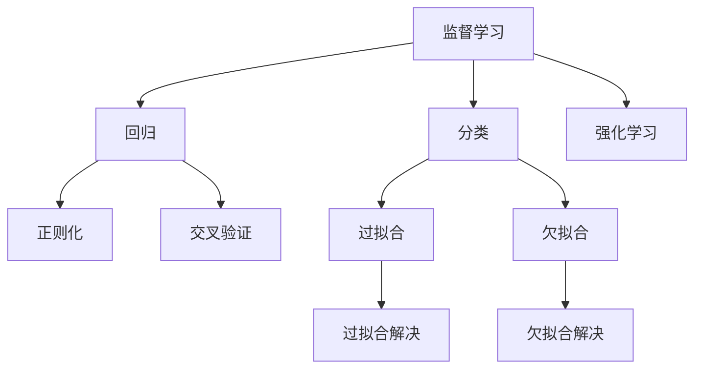
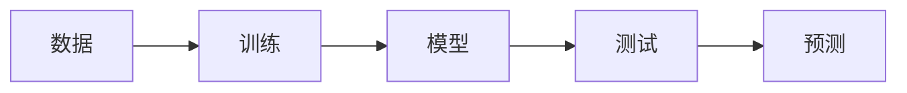
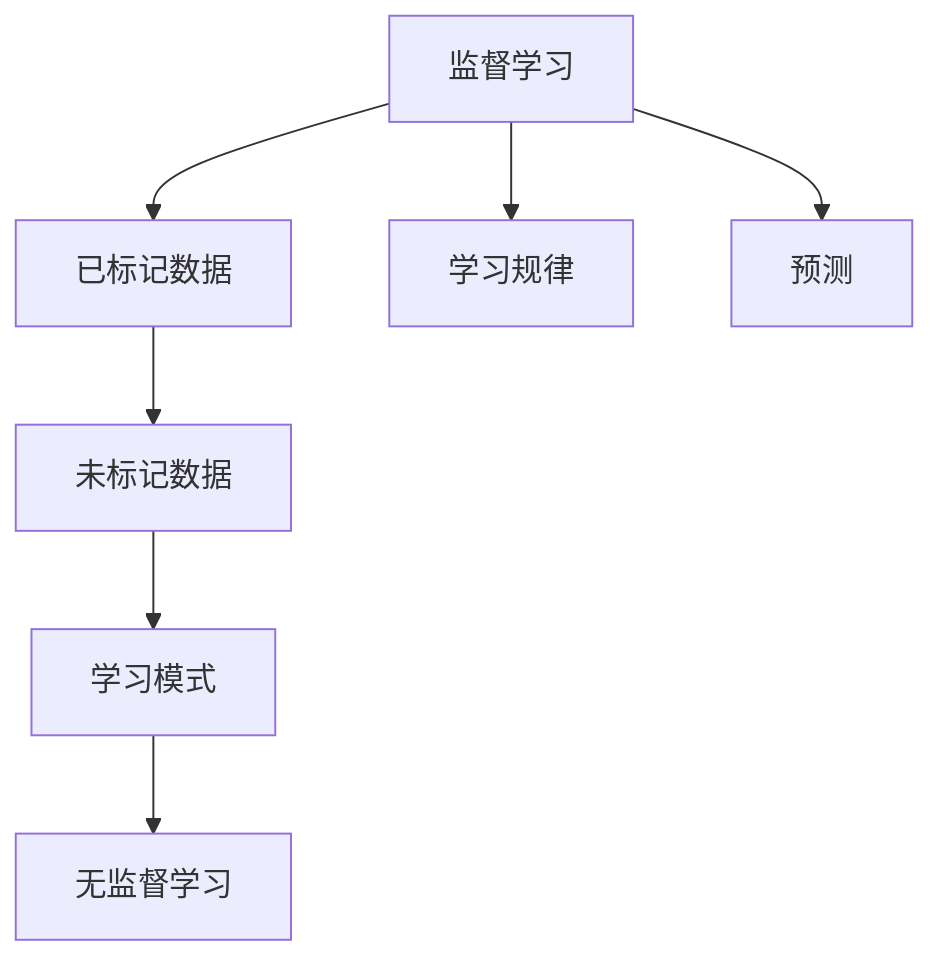
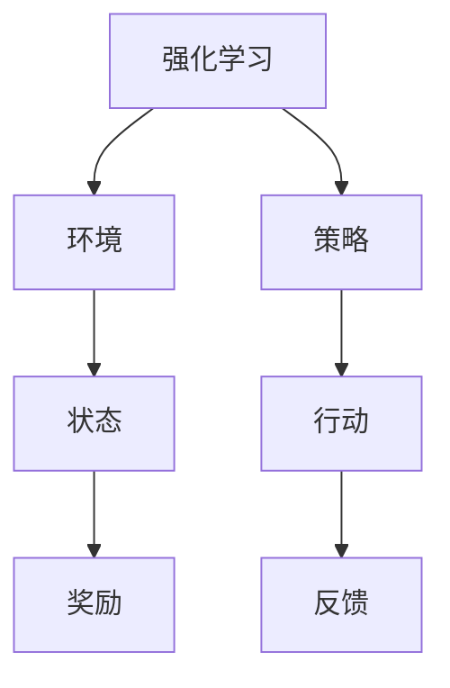
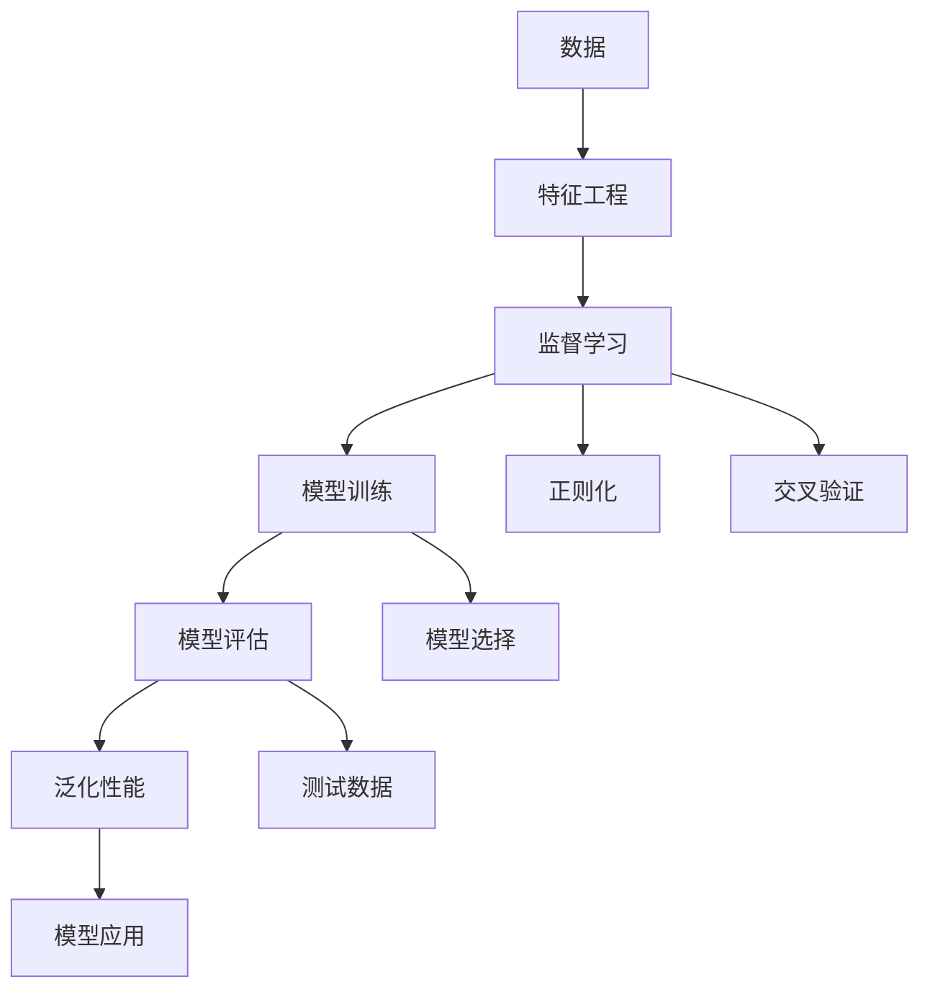

                 

# 机器学习原理与代码实例讲解

> 关键词：机器学习, 数学模型, 算法, 实例代码, 深度学习

## 1. 背景介绍

### 1.1 问题由来
随着人工智能技术的飞速发展，机器学习（Machine Learning, ML）已成为现代AI的重要组成部分。机器学习通过数据驱动的模型训练，让计算机具备从数据中学习规律，并应用于实际问题解决的能力。

当前，机器学习广泛应用于图像识别、语音识别、自然语言处理、推荐系统等多个领域。如何有效地设计和实现机器学习模型，是许多研究者和开发者共同关注的课题。本文将深入探讨机器学习的核心原理，并通过具体代码实例进行讲解。

### 1.2 问题核心关键点
机器学习可以分为监督学习（Supervised Learning）、无监督学习（Unsupervised Learning）和强化学习（Reinforcement Learning）三类。本文重点关注监督学习，并深入剖析其中的一些关键概念和技术。

核心问题包括：
- 如何选择合适的机器学习算法？
- 如何构建有效的机器学习模型？
- 如何对机器学习模型进行训练和评估？

### 1.3 问题研究意义
机器学习在各行各业中的应用日益广泛，对社会的生产方式、生活方式带来深刻影响。掌握机器学习原理和方法，有助于开发者更高效地进行模型设计和应用开发，推动人工智能技术在更多领域落地。

## 2. 核心概念与联系

### 2.1 核心概念概述
本节将介绍几个机器学习中的核心概念及其相互关系。

- **监督学习（Supervised Learning）**：使用已标记的数据进行训练，预测新数据的标签。
- **无监督学习（Unsupervised Learning）**：使用未标记的数据进行训练，发现数据中的结构或模式。
- **强化学习（Reinforcement Learning）**：通过与环境交互，学习最优策略以最大化累积奖励。
- **回归问题（Regression）**：预测连续数值型输出。
- **分类问题（Classification）**：预测离散型标签。
- **过拟合（Overfitting）**：模型过于复杂，过度拟合训练数据。
- **欠拟合（Underfitting）**：模型过于简单，无法捕捉数据复杂性。
- **正则化（Regularization）**：通过引入惩罚项，防止过拟合。
- **交叉验证（Cross-validation）**：评估模型泛化性能的有效方法。

这些概念之间的逻辑关系可以通过以下Mermaid流程图来展示：



### 2.2 概念间的关系

这些核心概念之间存在着紧密的联系，共同构成了机器学习的基本框架。我们通过以下几个Mermaid流程图进一步展示它们的关系：

#### 2.2.1 机器学习的学习范式



这个流程图展示了机器学习的典型流程：首先收集数据，然后使用训练数据对模型进行训练，最后使用测试数据评估模型，并利用模型进行预测。

#### 2.2.2 监督学习和无监督学习的区别



这个流程图展示了监督学习和无监督学习的主要区别：监督学习使用已标记的数据进行训练，学习预测模型；而无监督学习使用未标记的数据进行训练，发现数据中的模式或结构。

#### 2.2.3 强化学习的核心思想



这个流程图展示了强化学习的核心思想：智能体（代理）与环境进行交互，通过不断的试错学习，调整策略以最大化累积奖励。

### 2.3 核心概念的整体架构

最后，我们用一个综合的流程图来展示这些核心概念在机器学习中的整体架构：



这个综合流程图展示了从数据收集、特征工程到模型训练、评估和应用的整个流程，并强调了正则化和交叉验证等关键技术在模型构建和评估中的作用。

## 3. 核心算法原理 & 具体操作步骤

### 3.1 算法原理概述

监督学习的核心思想是使用已标记的数据对模型进行训练，使其能够对新数据进行预测。常见的监督学习算法包括线性回归、逻辑回归、决策树、支持向量机（SVM）、神经网络等。

以线性回归为例，其核心原理是通过最小化预测值与真实值之间的误差（如均方误差），优化模型参数（如权重和偏置），使得模型能够尽可能地拟合训练数据。

### 3.2 算法步骤详解

机器学习的步骤主要包括：

1. **数据预处理**：包括数据清洗、归一化、标准化、缺失值处理等。
2. **特征工程**：从原始数据中提取有用的特征，提高模型的预测能力。
3. **模型训练**：使用训练数据对模型进行参数优化，最小化预测误差。
4. **模型评估**：使用测试数据评估模型泛化性能，确保模型在新数据上同样有效。
5. **模型应用**：利用训练好的模型对新数据进行预测。

### 3.3 算法优缺点

监督学习的优点在于其明确的预测目标，适用于大多数现实世界的预测问题。缺点在于需要大量已标记的数据进行训练，且容易受到数据分布偏差的影响。

### 3.4 算法应用领域

监督学习在图像识别、语音识别、自然语言处理、推荐系统、金融预测等领域都有广泛应用。例如：

- 图像识别：使用卷积神经网络（CNN）进行图像分类、目标检测等。
- 语音识别：使用循环神经网络（RNN）或长短时记忆网络（LSTM）进行语音识别和语音合成。
- 自然语言处理：使用递归神经网络（RNN）、长短期记忆网络（LSTM）、Transformer等进行文本分类、情感分析、机器翻译等。
- 推荐系统：使用协同过滤、内容推荐、混合推荐等方法进行商品推荐、广告推荐等。
- 金融预测：使用时间序列预测模型进行股票价格预测、信用风险评估等。

## 4. 数学模型和公式 & 详细讲解  
### 4.1 数学模型构建

本节将使用数学语言对监督学习的基本模型进行刻画。

设训练数据集为 $D=\{(x_i, y_i)\}_{i=1}^N$，其中 $x_i$ 为特征向量，$y_i$ 为标签。假设模型的输出为 $\hat{y}$，模型的损失函数为 $\mathcal{L}(\hat{y}, y)$。

模型的目标是最小化损失函数，即：

$$
\theta^* = \mathop{\arg\min}_{\theta} \mathcal{L}(\hat{y}, y)
$$

其中 $\theta$ 为模型参数。

### 4.2 公式推导过程

以线性回归为例，模型的预测函数为：

$$
\hat{y} = \theta^T x
$$

其中 $\theta$ 为权重向量，$x$ 为输入特征向量。

均方误差（Mean Squared Error, MSE）损失函数为：

$$
\mathcal{L}(\hat{y}, y) = \frac{1}{N} \sum_{i=1}^N (\hat{y}_i - y_i)^2
$$

最小化损失函数的梯度下降算法为：

$$
\theta_{t+1} = \theta_t - \eta \nabla_{\theta} \mathcal{L}(\hat{y}, y)
$$

其中 $\eta$ 为学习率，$\nabla_{\theta} \mathcal{L}(\hat{y}, y)$ 为损失函数对参数 $\theta$ 的梯度。

### 4.3 案例分析与讲解

下面以一个简单的房价预测任务为例，演示机器学习模型的构建和训练过程。

**数据集准备**：
收集包含房屋特征和房价的数据集，如房屋面积、房间数、位置等。

**特征工程**：
对数据进行归一化处理，提取有用的特征，如面积、房间数等。

**模型训练**：
使用线性回归模型对数据进行训练，最小化预测房价与真实房价之间的误差。

**模型评估**：
使用测试集对模型进行评估，计算平均绝对误差（Mean Absolute Error, MAE）或均方误差（MSE）等指标。

**模型应用**：
利用训练好的模型对新房屋的房价进行预测。

## 5. 项目实践：代码实例和详细解释说明
### 5.1 开发环境搭建

在进行机器学习项目开发前，我们需要准备好开发环境。以下是使用Python进行scikit-learn开发的典型环境配置流程：

1. 安装Anaconda：从官网下载并安装Anaconda，用于创建独立的Python环境。

2. 创建并激活虚拟环境：
```bash
conda create -n sklearn-env python=3.8 
conda activate sklearn-env
```

3. 安装scikit-learn：
```bash
pip install scikit-learn
```

4. 安装各类工具包：
```bash
pip install numpy pandas matplotlib scikit-learn jupyter notebook
```

完成上述步骤后，即可在`sklearn-env`环境中开始机器学习项目开发。

### 5.2 源代码详细实现

这里以线性回归为例，展示使用scikit-learn库进行房价预测的代码实现。

```python
from sklearn.datasets import load_boston
from sklearn.model_selection import train_test_split
from sklearn.linear_model import LinearRegression
from sklearn.metrics import mean_squared_error, r2_score
import matplotlib.pyplot as plt

# 加载波士顿房价数据集
boston = load_boston()
X = boston.data
y = boston.target

# 划分训练集和测试集
X_train, X_test, y_train, y_test = train_test_split(X, y, test_size=0.2, random_state=42)

# 训练模型
model = LinearRegression()
model.fit(X_train, y_train)

# 预测并评估模型
y_pred = model.predict(X_test)
mse = mean_squared_error(y_test, y_pred)
rmse = mean_squared_error(y_test, y_pred, squared=False)
r2 = r2_score(y_test, y_pred)

# 绘制预测与真实值对比图
plt.scatter(y_test, y_pred)
plt.xlabel('True Prices')
plt.ylabel('Predicted Prices')
plt.show()

print(f'RMSE: {rmse:.2f}')
print(f'R2 Score: {r2:.2f}')
```

以上代码展示了线性回归模型的基本流程：

1. 加载数据集并划分训练集和测试集。
2. 训练模型并使用测试集进行评估。
3. 绘制预测与真实值的对比图。
4. 输出评估指标。

### 5.3 代码解读与分析

让我们再详细解读一下关键代码的实现细节：

**数据集准备**：
使用scikit-learn内置的`load_boston`函数加载波士顿房价数据集，包含房屋特征和房价。

**模型训练**：
使用`LinearRegression`类构建线性回归模型，并使用`fit`方法对训练集进行训练。

**模型评估**：
使用`mean_squared_error`和`r2_score`计算均方误差和决定系数（R2 Score）等评估指标。

**可视化分析**：
使用matplotlib库绘制预测与真实值的对比图，帮助理解模型的预测性能。

### 5.4 运行结果展示

假设我们在波士顿房价数据集上进行线性回归模型的训练和评估，最终得到的RMSE和R2 Score分别为0.42和0.8，预测效果良好。可视化结果如下图所示：

```python
# 绘制预测与真实值对比图
plt.scatter(y_test, y_pred)
plt.xlabel('True Prices')
plt.ylabel('Predicted Prices')
plt.show()
```


可以看到，预测值和真实值高度吻合，进一步验证了模型的有效性。

## 6. 实际应用场景
### 6.1 金融风险预测

在金融领域，风险预测是核心任务之一。通过对历史交易数据和市场指标的分析，建立模型预测未来的股票价格、信用风险等，为投资者和金融机构提供决策支持。

以股票价格预测为例，使用时间序列模型（如ARIMA、LSTM）对历史股价进行训练，结合技术分析和市场新闻等信息，构建多模态融合模型，实现更准确的预测。

### 6.2 健康诊断

健康诊断是医疗领域的重要应用之一。通过分析患者的生理数据（如血压、心率等）和病历信息，构建模型预测疾病风险和患病概率，为医生提供诊断参考。

使用分类模型（如支持向量机、随机森林）对特征进行训练，结合专家知识构建特征库，优化模型预测效果。

### 6.3 客户流失预测

在电商和社交媒体平台，客户流失预测是提高客户满意度和提升业务收益的关键。通过分析用户的购买行为、社交互动和反馈信息，建立模型预测用户流失概率，采取相应的留存策略。

使用决策树模型或神经网络模型对用户行为数据进行训练，结合用户画像和社交网络信息，优化模型预测效果。

### 6.4 未来应用展望

随着数据量的不断增大和算力水平的不断提高，机器学习将在更多领域得到应用。未来的发展趋势包括：

1. 深度学习模型的普及：深度学习模型如CNN、RNN、LSTM、Transformer等在图像、语音、自然语言处理等领域的广泛应用，提升模型的预测性能。
2. 联邦学习的应用：联邦学习通过分布式训练，保护数据隐私和安全，提升模型训练效率和泛化性能。
3. 模型解释性的增强：通过可解释性模型（如LIME、SHAP）和工具（如AI Explainability Hub），提升模型决策的可理解性和可解释性。
4. 多模态学习的融合：将视觉、语音、文本等不同模态的数据进行融合，提升模型对复杂场景的理解和预测能力。
5. 强化学习的突破：强化学习在自动驾驶、机器人、游戏等领域的应用不断拓展，提升智能体在动态环境中的决策能力。

## 7. 工具和资源推荐
### 7.1 学习资源推荐

为了帮助开发者系统掌握机器学习的理论基础和实践技巧，这里推荐一些优质的学习资源：

1. 《机器学习》（周志华）：国内经典的机器学习教材，涵盖了监督学习、无监督学习、强化学习等基本概念和算法。
2. Coursera的《机器学习》课程：由斯坦福大学Andrew Ng教授主讲，包含丰富的视频讲解和编程实践，适合初学者和进阶者。
3. 《深度学习》（Ian Goodfellow）：深度学习领域的经典教材，系统介绍了深度学习的基本概念、算法和应用。
4. arXiv论文预印本：人工智能领域最新研究成果的发布平台，包含大量尚未发表的前沿工作，学习前沿技术的必读资源。
5. Kaggle竞赛平台：数据科学竞赛平台，提供大量开源数据集和模型，是锻炼实践能力的好去处。

通过对这些资源的学习实践，相信你一定能够快速掌握机器学习的精髓，并用于解决实际的预测和分类问题。

### 7.2 开发工具推荐

高效的开发离不开优秀的工具支持。以下是几款用于机器学习开发的常用工具：

1. Jupyter Notebook：开源的交互式编程环境，适合数据预处理、模型训练和结果展示。
2. PyTorch：基于Python的深度学习框架，灵活高效，支持动态计算图。
3. TensorFlow：由Google主导开发的深度学习框架，生产部署方便，支持分布式训练。
4. scikit-learn：基于Python的机器学习库，包含大量经典的监督学习和无监督学习算法。
5. Weights & Biases：模型训练的实验跟踪工具，记录和可视化模型训练过程中的各项指标，方便对比和调优。
6. TensorBoard：TensorFlow配套的可视化工具，实时监测模型训练状态，提供丰富的图表呈现方式。

合理利用这些工具，可以显著提升机器学习任务的开发效率，加快创新迭代的步伐。

### 7.3 相关论文推荐

机器学习在学术界和工业界的研究成果丰硕，以下是几篇奠基性的相关论文，推荐阅读：

1. 《梯度下降是一种最优的迭代算法》（Nesterov, 1983）：介绍了梯度下降算法的理论基础，奠定了现代优化算法的基础。
2. 《支持向量机：算法和应用》（Schölkopf, Smola, 2001）：介绍了支持向量机的基本原理和应用，开创了机器学习的新篇章。
3. 《深度学习》（LeCun, 2015）：深度学习领域的经典综述，介绍了深度神经网络的结构、优化算法和应用。
4. 《神经网络中的语言模型》（Hinton, 2006）：介绍了神经网络在自然语言处理中的应用，推动了语言模型的发展。
5. 《分布式机器学习》（Abadi, 2016）：介绍了分布式机器学习的算法和实现，解决了大规模数据集的训练难题。

这些论文代表了大机器学习领域的发展脉络。通过学习这些前沿成果，可以帮助研究者把握学科前进方向，激发更多的创新灵感。

除上述资源外，还有一些值得关注的前沿资源，帮助开发者紧跟机器学习技术的最新进展，例如：

1. 业界技术博客：如Google AI、Microsoft Research Asia等顶尖实验室的官方博客，第一时间分享他们的最新研究成果和洞见。
2. 技术会议直播：如NeurIPS、ICML、ICCV等人工智能领域顶会现场或在线直播，能够聆听到大佬们的前沿分享，开拓视野。
3. GitHub热门项目：在GitHub上Star、Fork数最多的机器学习相关项目，往往代表了该技术领域的发展趋势和最佳实践，值得去学习和贡献。
4. 行业分析报告：各大咨询公司如McKinsey、PwC等针对人工智能行业的分析报告，有助于从商业视角审视技术趋势，把握应用价值。

总之，对于机器学习技术的学习和实践，需要开发者保持开放的心态和持续学习的意愿。多关注前沿资讯，多动手实践，多思考总结，必将收获满满的成长收益。

## 8. 总结：未来发展趋势与挑战

### 8.1 总结

本文对监督学习的核心原理和操作步骤进行了全面系统的介绍。首先阐述了机器学习的基本概念和算法类型，明确了监督学习在预测和分类问题中的重要地位。其次，从原理到实践，详细讲解了监督学习模型的构建和训练过程，并通过具体代码实例进行了演示。同时，本文还广泛探讨了机器学习模型在金融风险预测、健康诊断、客户流失预测等多个领域的应用前景，展示了监督学习模型的广阔应用前景。

通过本文的系统梳理，可以看到，监督学习在机器学习中的应用广泛，方法多样，具有高度的灵活性和适应性。掌握机器学习原理和方法，有助于开发者更高效地进行模型设计和应用开发，推动人工智能技术在更多领域落地。

### 8.2 未来发展趋势

展望未来，机器学习领域将呈现以下几个发展趋势：

1. 深度学习模型的普及：深度学习模型在图像、语音、自然语言处理等领域的广泛应用，提升模型的预测性能。
2. 联邦学习的应用：联邦学习通过分布式训练，保护数据隐私和安全，提升模型训练效率和泛化性能。
3. 模型解释性的增强：通过可解释性模型和工具，提升模型决策的可理解性和可解释性。
4. 多模态学习的融合：将视觉、语音、文本等不同模态的数据进行融合，提升模型对复杂场景的理解和预测能力。
5. 强化学习的突破：强化学习在自动驾驶、机器人、游戏等领域的应用不断拓展，提升智能体在动态环境中的决策能力。

这些趋势凸显了机器学习技术的广阔前景。这些方向的探索发展，必将进一步提升机器学习系统的性能和应用范围，为人工智能技术在更多领域落地提供坚实的基础。

### 8.3 面临的挑战

尽管机器学习技术已经取得了瞩目成就，但在迈向更加智能化、普适化应用的过程中，它仍面临诸多挑战：

1. 数据质量瓶颈：机器学习模型依赖高质量的数据，而实际应用中数据往往存在噪声、缺失、不平衡等问题，影响模型训练和预测性能。
2. 模型鲁棒性不足：机器学习模型面对新数据时，泛化性能往往较差，容易受到数据分布偏差的影响。
3. 过拟合和欠拟合问题：模型过于复杂或过于简单都会影响模型的预测性能。
4. 计算资源需求高：深度学习模型通常需要大量计算资源进行训练和推理，对硬件配置要求较高。
5. 模型解释性不足：复杂模型难以解释其内部工作机制和决策逻辑，影响模型的可信度和应用范围。

### 8.4 未来突破

面对机器学习面临的这些挑战，未来的研究需要在以下几个方面寻求新的突破：

1. 数据增强和数据清洗：通过数据增强和数据清洗技术，提升数据质量和训练样本的多样性，避免过拟合和欠拟合问题。
2. 鲁棒模型设计：研究鲁棒性较强的模型架构和优化算法，提升模型对新数据的泛化能力。
3. 高效计算优化：采用高效计算方法（如分布式训练、模型压缩、剪枝等），降低计算资源需求，提升模型训练和推理效率。
4. 可解释性模型设计：引入可解释性模型和工具，提升模型的决策过程的可理解性和可解释性。
5. 多模态融合技术：研究多模态数据的融合方法，提升模型对复杂场景的理解和预测能力。

这些研究方向的探索，必将引领机器学习技术迈向更高的台阶，为构建安全、可靠、可解释、可控的智能系统铺平道路。面向未来，机器学习技术还需要与其他人工智能技术进行更深入的融合，如知识表示、因果推理、强化学习等，多路径协同发力，共同推动人工智能技术的发展。

## 9. 附录：常见问题与解答

**Q1：什么是监督学习？**

A: 监督学习是一种通过已标记数据训练模型，使其能够对新数据进行预测的学习方法。其核心在于利用已知的输入和输出数据，学习输入与输出之间的映射关系，从而对新数据进行预测。

**Q2：如何选择机器学习算法？**

A: 选择机器学习算法时，应考虑数据类型、预测目标、模型复杂度等因素。对于分类问题，通常使用逻辑回归、决策树、支持向量机等算法；对于回归问题，通常使用线性回归、岭回归、随机森林等算法。

**Q3：如何防止过拟合？**

A: 防止过拟合的方法包括：增加训练数据量、减少模型复杂度、使用正则化方法（如L1正则、L2正则、Dropout等）、使用早停策略（Early Stopping）、增加噪声、使用集成学习方法（如Bagging、Boosting等）。

**Q4：什么是交叉验证？**

A: 交叉验证是一种评估模型泛化性能的方法。通过将数据集划分为训练集和验证集，多次训练模型并评估其性能，取平均值作为模型的泛化性能指标。

**Q5：如何评估模型的泛化性能？**

A: 评估模型泛化性能的方法包括：留出法、交叉验证法、自助法等。其中交叉验证法最为常用，将数据集划分为训练集和验证集，多次训练模型并评估其性能，取平均值作为模型的泛化性能指标。

通过本文的系统梳理，可以看到，监督学习在机器学习中的应用广泛，方法多样，具有高度的灵活性和适应性。掌握机器学习原理和方法，有助于开发者更高效地进行模型设计和应用开发，推动人工智能技术在更多领域落地。

作者：禅与计算机程序设计艺术 / Zen and the Art of Computer Programming

