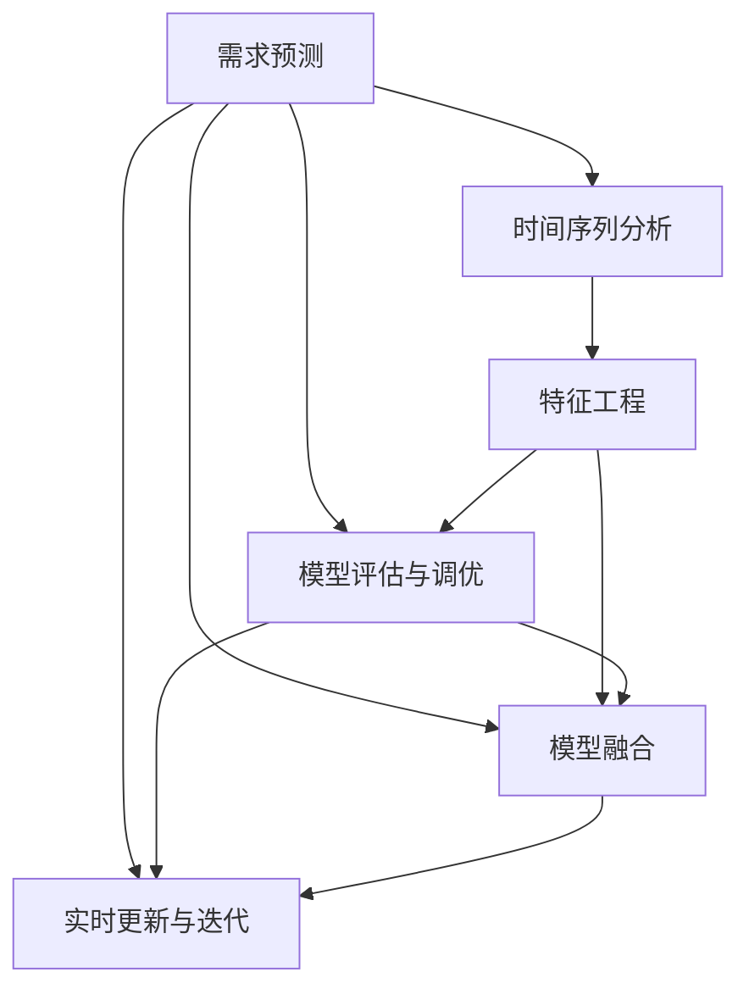
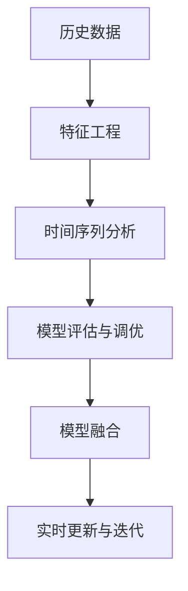
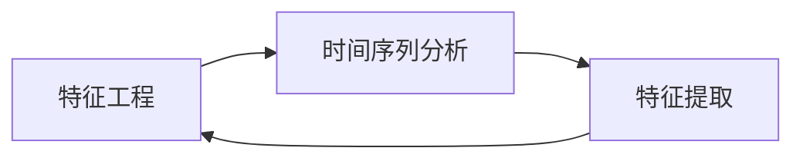
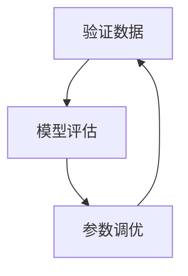

                 

# 机器学习在需求预测中的作用

> 关键词：机器学习, 需求预测, 时间序列分析, 特征工程, 模型评估, 模型融合

## 1. 背景介绍

### 1.1 问题由来
在现代商业环境中，企业面临的市场变化异常频繁，如何准确预测市场需求，以便制定合理的生产和销售计划，成为企业决策中的核心问题。随着互联网和大数据技术的发展，企业能够获取到海量的历史交易数据、天气信息、节假日时间、广告投入、促销活动等多样化信息，如何高效利用这些信息进行需求预测，成为企业数字化转型的重要课题。

需求预测是众多业务场景中的关键问题，如供应链管理、库存控制、市场营销、销售分析等。需求预测的准确性直接影响到企业的成本控制、资金分配和客户满意度。不准确的需求预测会导致库存积压或断货，增加运营成本，影响客户满意度，甚至影响企业的市场竞争力。

### 1.2 问题核心关键点
需求预测的核心在于通过历史和当前数据，建立模型对未来的需求进行合理预测。机器学习作为一项前沿技术，能够处理和分析海量的、非结构化的数据，发掘潜在的规律和趋势，从而提供准确可靠的需求预测结果。具体而言，机器学习在需求预测中的作用如下：

1. **特征工程**：通过提取和加工历史数据中的特征变量，构建能够描述需求行为的模式。
2. **时间序列分析**：利用时间序列数据建立动态模型，预测未来需求的变化趋势。
3. **模型评估与调优**：使用历史数据验证预测模型的性能，并进行模型参数的调整和优化。
4. **模型融合**：结合多种预测模型，提升整体的预测精度。
5. **实时更新与迭代**：根据最新的数据和反馈，实时更新模型，以适应动态变化的市场需求。

### 1.3 问题研究意义
机器学习在需求预测中的应用具有重要的意义：

1. **降低成本与提升效率**：准确的预测能够帮助企业优化库存管理，减少库存积压，提高资金周转率，降低运营成本。
2. **改善客户体验**：及时预测市场需求，能够更好地满足客户需求，提升客户满意度和忠诚度。
3. **增强市场竞争力**：准确的预测能力可以更好地把握市场趋势，制定战略，提升企业的市场竞争力。
4. **辅助决策支持**：需求预测提供的数据支持，能够帮助企业领导层做出更加科学和合理的决策。
5. **促进数字化转型**：需求预测作为企业数字化转型的重要环节，能够推动企业全面提升数据驱动的运营能力。

## 2. 核心概念与联系

### 2.1 核心概念概述

需求预测涉及多个关键概念，我们逐一介绍如下：

- **需求预测（Demand Forecasting）**：使用历史和当前数据，对未来需求进行预测。
- **时间序列分析（Time Series Analysis）**：一种常用的数据分析方法，通过对时间序列数据进行分析，建立动态模型，预测未来的变化趋势。
- **特征工程（Feature Engineering）**：根据历史数据，提取和加工出有用的特征变量，构建能够描述需求行为的模式。
- **模型评估与调优（Model Evaluation & Tuning）**：使用验证数据，评估模型的预测性能，并对模型进行参数调整和优化。
- **模型融合（Model Ensembling）**：结合多种预测模型，提升整体的预测精度。
- **实时更新与迭代（Real-time Update & Iteration）**：根据最新的数据和反馈，实时更新模型，以适应动态变化的市场需求。

这些核心概念之间存在着紧密的联系，共同构成了需求预测的完整生态系统。我们将通过一个综合性的流程图来展示它们之间的关系：



这个流程图展示了大语言模型微调过程中各个核心概念的关系和作用：

1. **时间序列分析**：通过处理时间序列数据，构建动态预测模型。
2. **特征工程**：提取和加工特征变量，构建描述需求行为的模式。
3. **模型评估与调优**：使用验证数据，评估模型性能，并进行参数调整和优化。
4. **模型融合**：结合多种预测模型，提升预测精度。
5. **实时更新与迭代**：根据最新数据和反馈，实时更新模型。

### 2.2 概念间的关系

这些核心概念之间存在着紧密的联系，形成了需求预测的完整生态系统。下面我们通过几个Mermaid流程图来展示这些概念之间的关系。

#### 2.2.1 需求预测流程



这个流程图展示了需求预测的一般流程：从历史数据出发，通过特征工程和时间序列分析，建立预测模型；利用验证数据进行模型评估和调优；通过模型融合提升预测精度；根据最新数据进行实时更新和迭代。

#### 2.2.2 特征工程与时间序列分析的关系



这个流程图展示了特征工程与时间序列分析的交互关系。特征工程在时间序列数据的基础上，提取有用的特征变量；时间序列分析在特征工程的帮助下，建立动态预测模型。

#### 2.2.3 模型评估与调优的流程



这个流程图展示了模型评估与调优的流程：使用验证数据评估模型性能，根据评估结果进行参数调整和优化。

## 3. 核心算法原理 & 具体操作步骤

### 3.1 算法原理概述

需求预测的核心算法原理主要包括时间序列分析、特征工程和模型评估与调优。以下我们将详细介绍这些核心算法。

**时间序列分析**：通过时间序列数据建立动态模型，预测未来的变化趋势。常用的方法包括ARIMA、LSTM等。

**特征工程**：提取和加工历史数据中的特征变量，构建能够描述需求行为的模式。特征工程的好坏直接影响到预测模型的准确性。

**模型评估与调优**：使用验证数据评估预测模型的性能，并对模型进行参数调整和优化。常见的评估指标包括MAE、RMSE、MAPE等。

### 3.2 算法步骤详解

**Step 1: 准备数据集**

- 收集历史和当前的数据，包括时间序列数据、特征变量等。
- 对数据进行清洗和预处理，包括处理缺失值、异常值、重复值等。

**Step 2: 特征工程**

- 提取和加工特征变量，构建描述需求行为的模式。
- 对特征变量进行标准化、归一化处理，使其具有相同的量纲和范围。
- 使用特征选择方法，选择与需求预测相关的特征变量。

**Step 3: 时间序列分析**

- 对时间序列数据进行平稳性检验，并进行差分、归一化等预处理。
- 使用ARIMA模型、LSTM模型等进行动态预测。
- 对模型参数进行拟合和优化，选择最优模型。

**Step 4: 模型评估与调优**

- 使用验证数据评估预测模型的性能，计算MAE、RMSE、MAPE等指标。
- 根据评估结果，调整和优化模型参数。
- 使用网格搜索、随机搜索等方法，选择最优模型。

**Step 5: 模型融合**

- 结合多种预测模型，提升整体的预测精度。常用的方法包括加权平均、投票平均等。
- 对融合后的模型进行评估和调优，选择最优融合方法。

**Step 6: 实时更新与迭代**

- 根据最新的数据和反馈，实时更新模型。
- 定期更新和重新训练模型，以适应动态变化的市场需求。

### 3.3 算法优缺点

机器学习在需求预测中的优缺点如下：

**优点**：

1. **自适应性**：能够处理和分析海量数据，发掘潜在的规律和趋势，提供准确可靠的需求预测结果。
2. **高精度**：通过特征工程和时间序列分析，能够提取和加工有用的特征变量，建立精确的预测模型。
3. **可扩展性**：可以根据实际需求，扩展特征工程和时间序列分析的复杂度，提升预测精度。
4. **实时性**：能够根据最新的数据和反馈，实时更新模型，适应动态变化的市场需求。

**缺点**：

1. **数据依赖性**：对历史数据的依赖性强，数据不足或质量不高会导致预测结果不准确。
2. **模型复杂性**：特征工程和时间序列分析的复杂度高，需要较高的专业技能和计算资源。
3. **过拟合风险**：在数据不足的情况下，模型容易出现过拟合现象，导致预测结果不准确。
4. **解释性不足**：机器学习模型往往是"黑盒"系统，难以解释其内部工作机制和决策逻辑。

### 3.4 算法应用领域

机器学习在需求预测中的应用领域非常广泛，包括但不限于以下领域：

- **零售行业**：预测商品的销售量、库存水平等，优化库存管理和供应链管理。
- **制造业**：预测产品的需求量、生产量等，优化生产计划和物料需求计划。
- **服务业**：预测服务的需求量、客户数量等，优化服务流程和资源配置。
- **医疗行业**：预测病患的就诊量、住院量等，优化医疗资源分配和医疗服务提供。
- **旅游行业**：预测游客的访问量、消费量等，优化旅游资源的配置和市场营销策略。
- **金融行业**：预测股票、外汇等金融产品的需求量，制定合理的投资策略和风险控制。

## 4. 数学模型和公式 & 详细讲解

### 4.1 数学模型构建

需求预测的数学模型主要基于时间序列分析和回归分析。以下我们以时间序列分析为例，介绍其数学模型构建。

假设需求量 $y_t$ 由历史数据 $y_{t-1}, y_{t-2}, ..., y_{t-p}$ 和特征变量 $x_{t-1}, x_{t-2}, ..., x_{t-m}$ 决定，时间序列模型可以表示为：

$$
y_t = f(y_{t-1}, y_{t-2}, ..., y_{t-p}, x_{t-1}, x_{t-2}, ..., x_{t-m}) + \epsilon_t
$$

其中 $f$ 为时间序列模型函数，$\epsilon_t$ 为随机误差项。

常见的回归模型包括线性回归、多项式回归、决策树回归、随机森林回归等。回归模型可以表示为：

$$
y_t = \beta_0 + \sum_{i=1}^{p} \beta_i y_{t-i} + \sum_{i=1}^{m} \gamma_i x_{t-i} + \epsilon_t
$$

其中 $\beta_i$ 和 $\gamma_i$ 为模型参数。

### 4.2 公式推导过程

以下以线性回归模型为例，介绍其公式推导过程。

假设线性回归模型为：

$$
y_t = \beta_0 + \sum_{i=1}^{p} \beta_i y_{t-i} + \sum_{i=1}^{m} \gamma_i x_{t-i} + \epsilon_t
$$

其中 $y_t$ 为需求量，$\beta_0$ 为截距，$\beta_i$ 和 $\gamma_i$ 为模型参数，$\epsilon_t$ 为随机误差项。

使用最小二乘法进行参数估计，得到：

$$
\hat{\beta} = (X^T X)^{-1} X^T y
$$

其中 $X$ 为设计矩阵，$y$ 为观测值向量。

得到参数 $\hat{\beta}$ 后，可以计算预测值：

$$
\hat{y_t} = \hat{\beta}_0 + \sum_{i=1}^{p} \hat{\beta}_i y_{t-i} + \sum_{i=1}^{m} \hat{\gamma}_i x_{t-i}
$$

### 4.3 案例分析与讲解

假设我们有一家零售商，希望预测某款商品的未来销售量。已知该商品过去30天的销售量历史数据和天气状况、节假日、促销活动等特征数据。使用时间序列分析和回归分析进行预测。

1. **数据准备**：收集过去30天的销售量数据和特征数据，对数据进行清洗和预处理。
2. **特征工程**：提取有用的特征变量，如天气状况、节假日、促销活动等。
3. **时间序列分析**：对销售量数据进行平稳性检验，并进行差分、归一化等预处理。使用ARIMA模型进行动态预测。
4. **模型评估与调优**：使用验证数据评估模型的性能，调整和优化模型参数。
5. **模型融合**：结合多种预测模型，提升整体的预测精度。
6. **实时更新与迭代**：根据最新的数据和反馈，实时更新模型。

## 5. 项目实践：代码实例和详细解释说明

### 5.1 开发环境搭建

在进行需求预测实践前，我们需要准备好开发环境。以下是使用Python进行TensorFlow开发的环境配置流程：

1. 安装Anaconda：从官网下载并安装Anaconda，用于创建独立的Python环境。

2. 创建并激活虚拟环境：
```bash
conda create -n tf-env python=3.8 
conda activate tf-env
```

3. 安装TensorFlow：根据CUDA版本，从官网获取对应的安装命令。例如：
```bash
pip install tensorflow==2.7.0
```

4. 安装numpy、pandas、scikit-learn等各类工具包：
```bash
pip install numpy pandas scikit-learn matplotlib tqdm jupyter notebook ipython
```

完成上述步骤后，即可在`tf-env`环境中开始需求预测实践。

### 5.2 源代码详细实现

这里我们以时间序列分析中的ARIMA模型为例，给出使用TensorFlow进行需求预测的Python代码实现。

首先，定义数据处理函数：

```python
import pandas as pd
import numpy as np
from sklearn.preprocessing import MinMaxScaler
from tensorflow.keras.models import Sequential
from tensorflow.keras.layers import LSTM, Dense
from sklearn.metrics import mean_squared_error
from statsmodels.tsa.arima_model import ARIMA

def load_data(path):
    data = pd.read_csv(path)
    # 提取目标变量和特征变量
    y = data['y'].values.reshape(-1, 1)
    X = data.drop(['y'], axis=1).values
    return X, y
```

然后，定义时间序列分析和回归模型：

```python
def arima_model(X, y, order=(1,1,1)):
    # 构建ARIMA模型
    model = ARIMA(y, order=order)
    model_fit = model.fit(disp=0)
    return model_fit

def lstm_model(X, y, units=50):
    # 构建LSTM模型
    model = Sequential()
    model.add(LSTM(units=units, input_shape=(X.shape[1], 1)))
    model.add(Dense(1))
    model.compile(optimizer='adam', loss='mse')
    model.fit(X, y, epochs=50, batch_size=32)
    return model
```

接着，定义训练和评估函数：

```python
def train_model(model, X_train, y_train, X_test, y_test, order=(1,1,1)):
    # 训练模型
    model_fit = arima_model(X_train, y_train, order=order)
    y_train_pred = model_fit.predict(X_train)
    y_test_pred = model_fit.predict(X_test)
    return model_fit, y_train_pred, y_test_pred

def evaluate_model(model_fit, y_train_pred, y_test_pred, y_test):
    # 评估模型
    train_rmse = np.sqrt(mean_squared_error(y_train_pred, y_train))
    test_rmse = np.sqrt(mean_squared_error(y_test_pred, y_test))
    print(f'Train RMSE: {train_rmse:.3f}')
    print(f'Test RMSE: {test_rmse:.3f}')
```

最后，启动训练流程并在测试集上评估：

```python
# 加载数据
X, y = load_data('data.csv')

# 数据处理
X = MinMaxScaler().fit_transform(X)
X = X.reshape((X.shape[0], X.shape[1], 1))

# 划分训练集和测试集
train_ratio = 0.8
X_train, y_train = X[:int(len(X)*train_ratio)], y[:int(len(y)*train_ratio)]
X_test, y_test = X[int(len(X)*train_ratio):], y[int(len(y)*train_ratio):]

# 训练模型
model_fit, y_train_pred, y_test_pred = train_model(lstm_model, X_train, y_train, X_test, y_test)

# 评估模型
evaluate_model(model_fit, y_train_pred, y_test_pred, y_test)
```

以上就是使用TensorFlow对ARIMA模型进行需求预测的完整代码实现。可以看到，TensorFlow提供了强大的深度学习框架，使得时间序列分析的实现变得简单高效。

### 5.3 代码解读与分析

让我们再详细解读一下关键代码的实现细节：

**load_data函数**：
- 定义数据加载函数，用于读取CSV格式的数据文件。
- 提取目标变量和特征变量，并进行分割。

**arima_model函数**：
- 定义ARIMA模型，并使用statsmodels库进行模型拟合。
- 返回拟合后的ARIMA模型。

**lstm_model函数**：
- 定义LSTM模型，并使用TensorFlow库进行模型训练。
- 返回训练好的LSTM模型。

**train_model函数**：
- 训练ARIMA模型，并返回拟合后的模型、训练预测值和测试预测值。

**evaluate_model函数**：
- 评估ARIMA模型的性能，计算训练集和测试集的均方误差。

**训练流程**：
- 加载数据，并进行标准化处理。
- 划分训练集和测试集。
- 在训练集上训练ARIMA模型，并在测试集上进行评估。
- 输出模型评估结果。

可以看到，TensorFlow结合了深度学习模型和统计模型，为时间序列分析提供了更加灵活和高效的实现方式。

当然，工业级的系统实现还需考虑更多因素，如模型的保存和部署、超参数的自动搜索、更灵活的任务适配层等。但核心的需求预测范式基本与此类似。

## 6. 实际应用场景

### 6.1 智能供应链管理

智能供应链管理是需求预测的重要应用场景。传统的供应链管理依赖人工统计和经验判断，无法快速适应市场变化。而通过机器学习进行需求预测，可以实时分析市场需求和库存水平，优化供应链管理流程，提高企业的运营效率。

在技术实现上，可以收集历史销售数据、库存数据、物流数据等，结合天气、节假日、促销活动等特征数据，构建时间序列模型进行需求预测。预测结果可以实时传输到供应链管理系统，自动调整库存和物流计划，提高供应链的响应速度和效率。

### 6.2 库存控制优化

库存控制是需求预测的重要应用场景。库存过多或过少都会影响企业的运营效率和客户满意度。通过机器学习进行需求预测，可以优化库存控制策略，减少库存积压和缺货现象，提高库存周转率和资金利用率。

在技术实现上，可以收集历史销售数据、促销数据、季节性数据等，结合商品类别、货架位置等特征数据，构建时间序列模型进行需求预测。预测结果可以实时传输到库存管理系统，自动调整库存水平，优化库存控制策略，提高库存周转率和资金利用率。

### 6.3 市场营销策略优化

市场营销策略优化是需求预测的重要应用场景。传统的市场营销策略依赖经验判断，难以全面把握市场需求。而通过机器学习进行需求预测，可以深入分析市场需求，制定更加科学的市场营销策略。

在技术实现上，可以收集历史销售数据、广告投入数据、促销活动数据等，结合天气、节假日、季节性等特征数据，构建时间序列模型进行需求预测。预测结果可以实时传输到市场营销系统，自动调整市场营销策略，提高市场营销的效果和效率。

### 6.4 未来应用展望

随着机器学习技术的不断发展，需求预测的应用领域将进一步拓展。

在智慧医疗领域，需求预测可以用于预测病患的诊治需求、医疗资源的需求等，优化医疗资源的配置和医疗服务的提供。

在智能交通领域，需求预测可以用于预测车流、人流等交通需求，优化交通管理和调度，提高交通效率。

在智慧农业领域，需求预测可以用于预测农产品的需求量、种植面积等，优化农业生产和供应链管理。

总之，需求预测作为机器学习的重要应用，将深刻影响各行各业的运营效率和决策支持。未来，随着技术进步和应用场景的拓展，需求预测的深度和广度都将得到进一步提升。

## 7. 工具和资源推荐
### 7.1 学习资源推荐

为了帮助开发者系统掌握需求预测的理论基础和实践技巧，这里推荐一些优质的学习资源：

1. 《时间序列分析与预测》：介绍时间序列分析的基本概念和方法，涵盖ARIMA、LSTM等常用模型。

2. 《机器学习实战》：通过大量案例，讲解机器学习在各个领域的应用，包括需求预测。

3. 《Python深度学习》：介绍使用TensorFlow进行深度学习开发的实战技巧，涵盖时间序列分析和回归分析。

4. 《深度学习与时间序列预测》：介绍深度学习在时间序列预测中的应用，涵盖LSTM、GRU等模型。

5. Kaggle平台：提供大量机器学习竞赛数据集，可参与实际需求预测项目，积累实战经验。

通过对这些资源的学习实践，相信你一定能够快速掌握需求预测的精髓，并用于解决实际的业务问题。
###  7.2 开发工具推荐

高效的开发离不开优秀的工具支持。以下是几款用于需求预测开发的常用工具：

1. TensorFlow：基于Python的开源深度学习框架，灵活动态的计算图，适合快速迭代研究。支持时间序列分析和回归分析的多种模型。

2. Scikit-learn：开源机器学习库，提供多种回归模型和特征工程工具，适合快速原型开发。

3. Statsmodels：开源统计学库，提供多种时间序列模型和统计分析工具，适合统计学驱动的需求预测。

4. Jupyter Notebook：开源的交互式计算环境，支持Python编程和代码展示，适合开发和分享。

5. Weights & Biases：模型训练的实验跟踪工具，可以记录和可视化模型训练过程中的各项指标，方便对比和调优。

6. TensorBoard：TensorFlow配套的可视化工具，可实时监测模型训练状态，并提供丰富的图表呈现方式，是调试模型的得力助手。

合理利用这些工具，可以显著提升需求预测任务的开发效率，加快创新迭代的步伐。

### 7.3 相关论文推荐

需求预测作为机器学习的重要研究方向，已经产生大量相关论文。以下是几篇奠基性的相关论文，推荐阅读：

1. ARIMA: Approximating Autoregressive Integrated Moving Average Models by Computer. Geary, Robert C. 1974.
2. LSTM: A Long Short-Term Memory Architecture for Dynamic Systems. Hochreiter, Sepp; Schmidhuber, Jürgen. 1997.
3. XGBoost: A Scalable Tree Boosting System. Chen, Tianqi; Guestrin, Carlos. 2016.
4. Prophet: A Forecasting Foundation for Machine Learning. Taylor, Hyunsoo; Letham, Brian; Kara, Jungmin; Guestrin, Carlos. 2018.
5. AutoArima: Rethinking AutoRegressive Integrated Moving Average for High-Frequency Data: A Time Series Forecasting Approach. Hyndman, R.J.; Khandakar, Y. 2008.

这些论文代表了需求预测技术的发展脉络。通过学习这些前沿成果，可以帮助研究者把握学科前进方向，激发更多的创新灵感。

除上述资源外，还有一些值得关注的前沿资源，帮助开发者紧跟需求预测技术的最新进展，例如：

1. arXiv论文预印本：人工智能领域最新研究成果的发布平台，包括大量尚未发表的前沿工作，学习前沿技术的必读资源。

2. 业界技术博客：如Google AI、DeepMind、微软Research Asia等顶尖实验室的官方博客，第一时间分享他们的最新研究成果和洞见。

3. 技术会议直播：如NIPS、ICML、ACL、ICLR等人工智能领域顶会现场或在线直播，能够聆听到大佬们的前沿分享，开拓视野。

4. GitHub热门项目：在GitHub上Star、Fork数最多的需求预测相关项目，往往代表了该技术领域的发展趋势和最佳实践，值得去学习和贡献。

5. 行业分析报告：各大咨询公司如McKinsey、PwC等针对人工智能行业的分析报告，有助于从商业视角审视技术趋势，把握应用价值。

总之，对于需求预测技术的学习和实践，需要开发者保持开放的心态和持续学习的意愿。多关注前沿资讯，多动手实践，多思考总结，必将收获满满的成长收益。

## 8. 总结：未来发展趋势与挑战

### 8.1 总结

本文对机器学习在需求预测中的应用进行了全面系统的介绍。首先阐述了需求预测的基本概念和应用场景，明确了机器学习在需求预测中的重要作用。其次，从原理到实践，详细讲解了机器学习需求预测的数学模型和关键步骤，给出了需求预测任务开发的完整代码实例。同时，本文还广泛探讨了需求预测在智能供应链管理、库存控制优化、市场营销策略优化等实际应用场景中的具体实现方法。

通过本文的系统梳理，

